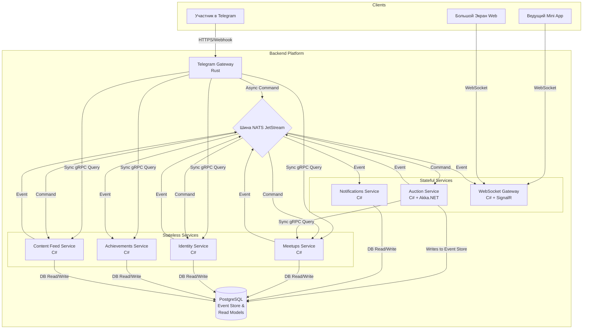

# Архитектура Платформы "Solguficky"

Система построена на принципах **полиглотной, микросервисной архитектуры** с **хореографией на основе событий**. Сервисы слабо связаны и общаются через асинхронную шину сообщений, а также через прямые синхронные вызовы для получения данных.

## Диаграмма верхнего уровня

## Краткое описание сервисов

*   **Telegram Gateway (Rust):** Принимает все внешние запросы, отвечает за авторизацию и роутинг. Команды отправляет в шину, за данными ходит напрямую.
*   **Auction Service (C# + Akka.NET):** Stateful-сервис, управляющий сложной логикой аукционов с помощью акторной модели и Event Sourcing (см. ADR-017: миграция со Scala на C#).
*   **Notifications Service (C#):** Сервис формирования уведомлений: слушает бизнес-события и генерирует команды на отправку сообщений (Elixir-версия — возможная будущая миграция, см. ADR-018).
*   **WebSocket Gateway (C#):** WebSocket-шлюз для "живой" доставки событий на фронтенд-клиенты. Для MVP реализован на C# с SignalR, в будущем возможна миграция на Elixir для масштабирования.
*   **Meetups Service (C#):** CRUD-сервис, "владелец" данных о сходках.
*   **Identity Service (C#):** CRUD-сервис, управляет пользователями, ролями и правами.
*   **Achievements Service (C#):** Stateless-сервис, слушает события и выдает ачивки.
*   **Content Feed Service (C#):** CRUD-сервис для управления информационной лентой сходки (посты, голосования, ссылки).

### Клиентские приложения

*   **Admin Panel (Mini App):** Telegram Mini App для ведущего аукциона. Предоставляет богатый UI для управления ходом торгов (например, прием ставок из зала) с бесшовной и безопасной аутентификацией через Telegram.
*   **Big Screen App (Web):** Отдельное веб-приложение для отображения хода аукциона на большом экране (проекторе) во время офлайн-мероприятий. Получает данные в реальном времени через WebSocket от `Real-Time Hub`.

## Ключевые технологические решения и сервисы

*   **Хостинг:** **Railway (PaaS)** для упрощения развертывания.
*   **Асинхронное взаимодействие:** **NATS JetStream** для надежной доставки команд и событий.
*   **Синхронное взаимодействие:** **gRPC** для быстрых и строго типизированных Service-to-Service вызовов.
*   **Управление схемами:** **Protobuf-in-Git** (ADR-014). Схемы сообщений (`.proto` файлы) хранятся в репозитории и являются частью контракта сервиса. Кодогенерация происходит на этапе сборки. Внешний Schema Registry (Apicurio) осознанно не используется на этапе MVP.
*   **Хранение данных:** **PostgreSQL** как для обычных данных, так и в качестве Event Store.
*   **Языки и роли:**
    *   **Rust (Telegram Gateway):** Высокопроизводительный и безопасный входной шлюз.
    *   **C# + Akka.NET (Auction Service):** Акторная модель и Event Sourcing для сложной stateful-логики (ADR-017).
    *   **C# (Notifications, WebSocket Gateway, будущие Meetups/Identity/Achievements):** Быстрая и надежная разработка сервисов на знакомом стеке. Elixir — кандидат для миграции уведомлений/WS при росте нагрузки (ADR-018).
    *   **TypeScript (Frontend):** Стандарт индустрии для веб-приложений (`Big Screen App`, `Admin Panel`). Рекомендуется использование современных фреймворков, таких как Svelte, Vue или React.

## Наблюдаемость (Observability)

*   **Логирование:** Все сервисы пишут структурированные JSON-логи в `stdout`. Сбор, хранение и индексация логов осуществляется централизованно с помощью **Loki**.
*   **Визуализация и анализ:** Для анализа логов, построения дашбордов и алертинга используется **Grafana**, которая читает данные из Loki.