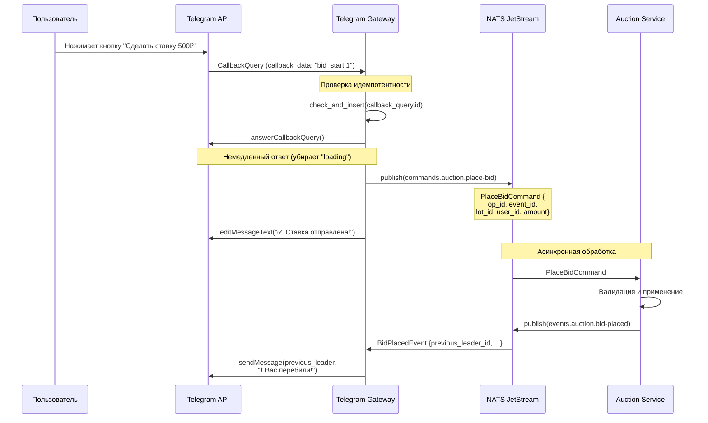
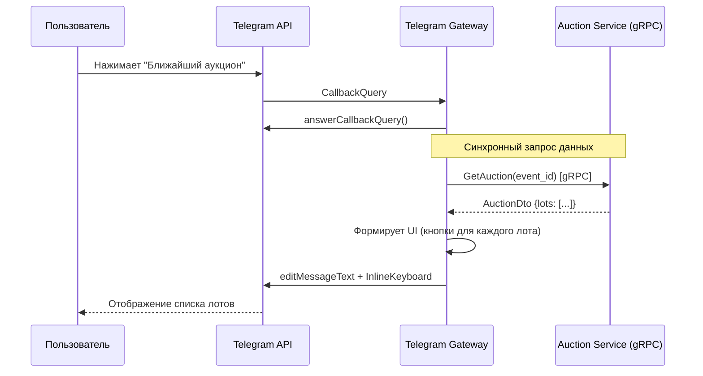

# ТЗ (Живой документ): API Gateway

## 1. Ответственность

Сервис является единственной точкой входа для всех внешних запросов, в первую очередь от Telegram. Он отвечает за:
1.  Прием и базовую валидацию входящих запросов.
2.  Преобразование запросов во внутренние, стандартизированные команды.
3.  Асинхронную отправку команд в шину NATS.
4.  (MVP+) Прием команд из NATS на отправку сообщений обратно в Telegram.

**Сервис НЕ должен содержать сложной бизнес-логики.**

## 2. Технологии

*   **Язык:** Rust
*   **Telegram фреймворк:** Teloxide для работы с Telegram Bot API (Axum для webhooks)
*   **Асинхронный рантайм:** Tokio
*   **NATS-клиент:** `async-nats`
*   **Сериализация:** Protobuf (схемы хранятся в `contracts/proto/`)
*   **Обработка ошибок:** `anyhow` / `thiserror`
*   **Логирование:** `tracing` со структурированным JSON-выводом. Логи из контейнера собираются централизованной системой **Loki**.
*   **Идемпотентность:** Redis для распределенного кеша

**Примечание:** Для локальной разработки на начальном этапе допустимо использовать long polling вместо webhook и in-memory кеш вместо Redis. Эти детали реализации не влияют на архитектуру кода.

## 3. Архитектурные решения

`Telegram Gateway` является "переводчиком" между внешним миром Telegram и внутренней архитектурой платформы.

### 3.1. Модель взаимодействия

Сервис использует гибридную модель взаимодействия, разделяя операции чтения и записи:

1.  **Асинхронные команды (Commands) через NATS:** Для всех действий, **изменяющих состояние** системы (например, сделать ставку, создать сходку), Gateway публикует стандартизированную команду в шину NATS. Это fire-and-forget операция; сервис не ждет ответа и не знает, какой именно сервис обработает команду.
2.  **Синхронные запросы (Queries) через gRPC:** Для всех действий, **запрашивающих информацию** для отображения пользователю (например, проверить права доступа, получить список сходок), Gateway выступает в роли **"сборщика UI"**. Он делает прямые, синхронные gRPC-запросы к одному или нескольким внутренним сервисам (`Events Service`, `Users Service`), собирает из их ответов данные, формирует сообщение Telegram и отправляет его пользователю.

#### Пример: Отображение экрана сходки

1.  Пользователь нажимает кнопку "Сходка 'Летний Пикник'".
2.  Gateway получает колбэк `show_event:event-123`.
3.  Gateway делает gRPC-запрос к `Events Service`: `GetEvent(id: "event-123")`.
4.  `Events Service` возвращает `{ name: "...", enabled_modules: ["auction", "voting"] }`.
5.  Gateway видит, что модуль `auction` включен, и делает gRPC-запрос к `Auction Service`: `GetAuctionStatus(eventId: "event-123")`.
6.  `Auction Service` возвращает `{ status: "running" }`.
7.  Gateway, собрав всю информацию, формирует сообщение и клавиатуру с кнопками для "auction" и "voting" и отправляет его пользователю.

### 3.2. Надёжность

- **Идемпотентность**: Все операции, изменяющие состояние, должны быть идемпотентными.
    - **Дедупликация callback_query:** Использовать `callback_query.id` как ключ с TTL 1 час. Клики по inline-кнопкам должны дедуплицироваться.
    - **Идемпотентность команд в NATS:** Каждая команда содержит уникальный `op_id: Uuid`, который доменные сервисы могут использовать для предотвращения дублирования операций.

- **Быстрый ответ Telegram API**: Сервис должен максимально быстро отвечать на запросы от Telegram. Для `callback_query` необходимо немедленно вызывать `answerCallbackQuery`. При использовании вебхуков — возвращать `200 OK` до завершения обработки. Длительные операции должны выполняться в фоновом режиме.

### 3.3. Тестируемость и Action паттерн

**Реализованная архитектура (MVP):**

Для обеспечения тестируемости используется **Action паттерн**:

1. **Хендлеры возвращают `BotAction`**, а не вызывают `teloxide::Bot` напрямую:
```rust
pub enum BotAction {
    SendMessage { chat_id, text, keyboard },
    EditMessage { chat_id, message_id, text, keyboard },
    AnswerCallback { callback_id, text },
    SendPhoto { chat_id, photo_url, caption, keyboard },
    Multiple(Vec<BotAction>),
}
```

2. **Выполнение через helper-функцию** `execute_action(&Bot, BotAction)` в модуле `helpers.rs`

3. **Wrapper-функции в lib.rs** интегрируют хендлеры с teloxide dispatcher:
```rust
async fn show_auction_wrapper(q: CallbackQuery, deps: Dependencies, bot: Bot) -> Result<()> {
    handle_with_action(bot, || show_auction_handler(q, deps)).await
}
```

**Преимущества:**
- ✅ Хендлеры тестируются проверкой возвращаемого `BotAction`
- ✅ FSM логика полностью изолирована (чистые функции)
- ✅ UI билдеры - чистые функции, легко тестируются
- ✅ 20 юнит-тестов покрывают FSM и UI логику

**Структура модулей:**
```
src/app/
├── actions.rs           # BotAction enum
├── fsm/                 # FSM логика (чистые функции)
│   └── lot_creation.rs  # FsmTransition { new_state, action }
├── ui/                  # UI билдеры (чистые функции)
│   ├── common.rs
│   ├── user/auction.rs
│   └── admin/
│       ├── auction_management.rs
│       └── lot_creation.rs
├── handlers/            # Тонкие обертки над FSM
│   ├── admin.rs
│   └── auction.rs
└── helpers.rs           # execute_action()
```

### 3.4. RBAC (Role-Based Access Control) для MVP

**Реализация:**

Система ролей для MVP реализована через конфигурацию:

1. **Конфигурация** (`configuration.yaml`):
```yaml
auth:
  admins: [123456789, 987654321]  # Telegram ID админов
```

2. **Модуль авторизации** (`src/app/auth/`):
```rust
pub enum UserRole { Admin, User }
pub fn get_user_role(user_id: UserId, config: &Auth) -> UserRole
```

3. **Проверка в хендлерах** через `Dependencies`:
```rust
let role = deps.get_user_role(user_id);
match role {
    UserRole::Admin => ui::admin::build_admin_auction_view(&auction),
    UserRole::User => ui::user::build_auction_list(&auction),
}
```

4. **Фильтр в роутинге** (`lib.rs`):
```rust
fn admin_only(q: CallbackQuery, deps: Dependencies) -> bool {
    deps.get_user_role(q.from.id) == UserRole::Admin
}

// Использование:
.filter(admin_only)
.endpoint(start_lot_creation_wrapper)
```

**Админские функции (MVP):**
- ➕ Создание лотов через пошаговую форму (FSM)
- 📊 Просмотр админской панели аукциона
- 🔄 (Будущее) Управление аукционом (старт/стоп/финал)

**План миграции:** При появлении User Service заменить `get_user_role` на gRPC вызов. Логика уже изолирована в модуле `auth`.

### 3.5. Качество кода и Наблюдаемость

- **Логирование**: Все логи должны выводиться в структурированном формате (JSON). Ключевые операции должны быть обернуты в `tracing::span` с добавлением контекстных полей (`update_id`, `chat_id`, `user_id`, `op_id`). Логи не должны содержать персональных данных (PII), таких как тексты сообщений или имена пользователей. Собранные `stdout` логи отправляются в **Loki** для централизованного хранения и анализа в Grafana.
- **Метрики**: (TBD) В будущем планируется добавление метрик в формате Prometheus для мониторинга здоровья и производительности сервиса.
- **Трейсинг**: (TBD) Распределенная трассировка будет добавлена для анализа жизненного цикла запросов, проходящих через несколько сервисов.

### 3.5. Качество кода

Код должен соответствовать стандартным правилам форматирования (`rustfmt`). Для статического анализа и поиска потенциальных ошибок должен использоваться `clippy` в строгом режиме (`-D warnings`). Использование `unwrap()` в коде обработчиков запрещено; все ошибки должны корректно обрабатываться.

### 3.6. Управление конфигурацией

Для управления конфигурацией используется крейт `figment`. Этот подход обеспечивает гибкость и многоуровневость:
1.  **Базовые значения**: Задаются в файле `configuration.yaml` в корне сервиса. Этот файл содержит небезопасные значения по умолчанию.
2.  **Переопределение через переменные окружения**: Любой параметр может быть переопределен переменной окружения с префиксом `APP_` и разделителем `__` (например, `APP_TELEGRAM__TOKEN`). Это основной способ передачи секретов в приложение.

### 3.7. Продвинутые асинхронные паттерны

- **Graceful Shutdown**: Приложение должно корректно обрабатывать сигналы `SIGINT` и `SIGTERM` для плавного завершения работы. Это позволяет завершить обработку текущих запросов и не терять данные при перезапуске или деплое.
- **Retries**: Для критически важных внешних соединений (в первую очередь, подключение к NATS) должна быть реализована стратегия повторных попыток с экспоненциальной задержкой (exponential backoff), чтобы сервис мог автоматически восстанавливаться после временных сбоев сети.

## 4. Эндпоинты (API Endpoints)

### `POST /telegram/webhook/{token}`

*   **Назначение:** Основной эндпоинт для приема вебхуков от Telegram.
*   **Параметры:**
    *   `token`: Динамический сегмент URL, должен совпадать с `TELEGRAM_BOT_TOKEN` из переменных окружения для базовой безопасности.
*   **Тело запроса:** `JSON`, соответствующий структуре `Update` от Telegram API.
*   **Логика:**
    1.  Проверить, что `token` из URL совпадает с токеном из конфигурации. Если нет — вернуть `403 Forbidden`.
    2.  Десериализовать тело запроса в структуру `Update`.
    3.  Определить тип `Update`.
    4.  В зависимости от типа, либо запустить процесс **синхронного сбора данных**, либо опубликовать **асинхронную команду**.
    5.  Вернуть `200 OK`.

## 5. Внутренние контракты

### 5.1. Асинхронные (NATS)

*   **Публикуемые команды (Примеры):**
    *   **Тема:** `commands.auction.place-bid`
    *   **Payload (Protobuf):** `PlaceBidCommand`
*   **Подписка на команды:**
    *   **Тема:** `commands.telegram.send-message`
    *   **Payload (Protobuf):** `SendMessageCommand`

### 5.2. Синхронные (gRPC)

*   Gateway выступает **клиентом** для gRPC-сервисов:
    *   `EventsService.GetEvent(..)`
    *   `UsersService.GetUser(..)`
    *   `AuctionService.GetAuctionStatus(..)`

## 6. Примеры взаимодействий

### 6.1. Сценарий: Пользователь делает ставку



### 6.2. Сценарий: Показ списка лотов (Query)



## 7. Конфигурация (Переменные окружения)

*   `TELEGRAM_BOT_TOKEN`: Секретный токен бота.
*   `NATS_URL`: Адрес сервера NATS.
*   `RUST_LOG`: Уровень логирования (например, `info`).
*   `EVENTS_SERVICE_GRPC_URL`: Адрес gRPC-сервера `Events Service`.
*   `USERS_SERVICE_GRPC_URL`: Адрес gRPC-сервера `Users Service`.
*   `AUCTION_SERVICE_GRPC_URL`: Адрес gRPC-сервера `Auction Service`.