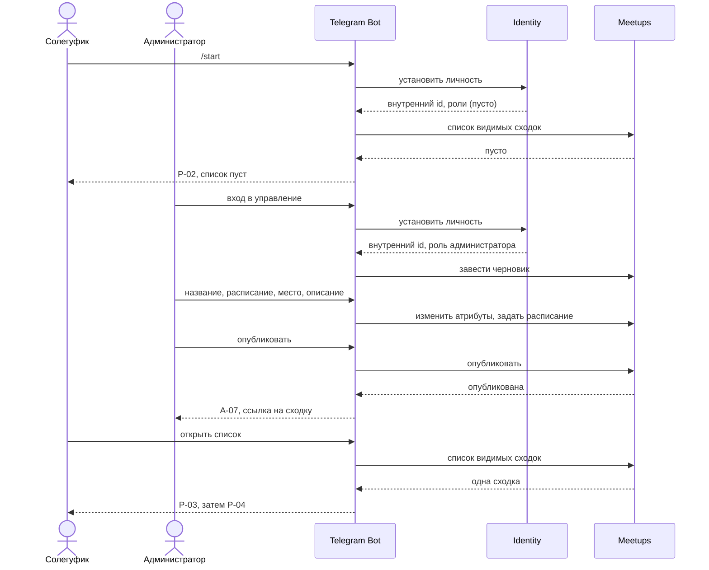

# Первый вертикальный срез MVP

> **Статус:** Canonical. **Слой:** MVP. **Зрелость:** Accepted — состав среза утверждён владельцем.

Документ фиксирует, из чего состоит первый вертикальный срез и что в него сознательно не входит. Он отвечает на вопрос «что мы делаем первым», а не «как это устроено внутри»: устройство Meetups решается в [RFC-004](../rfcs/RFC-004-meetups-domain-events-persistence.md), граница подписок — в [RFC-005](../rfcs/RFC-005-notifications-subscription-scheduling-delivery.md), transport и языки — отдельными ADR. Ни одно имя операции здесь не является контрактом.

## Зачем нужен срез

Meetups и Identity не существуют ни как исполняемые сервисы, ни как контракты. Срез нужен, чтобы проверить границы на работающем коде раньше, чем они будут закреплены в `contracts/proto/`, и чтобы первая же ошибка в разделении ответственности обнаружилась на маленьком объёме.

Срез не является демонстрацией продукта сообществу и не закрывает ни одного продуктового обещания целиком.

## Сценарий

### Действующие лица и предусловия

| Кто | Роль | Состояние на входе |
|---|---|---|
| Администратор | глобальная роль администратора, он же организатор создаваемой сходки | внутренний профиль существует, роль выдана maintainer'ом как данные |
| Солегуфик | обычный пользователь | внутреннего профиля ещё нет, бота не открывал |

Дополнительные предусловия: ни одной опубликованной сходки нет; всё взаимодействие происходит в личном чате с ботом; бот не имеет прав в общем чате.

### Ход

Кадры макета: [P-01](../design/bot/storyboard.html) первый запуск, P-02 пустой список, A-01 вход в управление, A-02 меню, A-03 название, A-04 дата и время, A-05 место и описание, A-06 предпросмотр, A-07 опубликована, P-03 список, P-04 карточка.

### Наблюдаемый результат

Солегуфик, который не участвовал в создании и не имеет административных прав, видит в личном чате карточку сходки с теми атрибутами, которые ввёл администратор, и с состоянием «запланирована, видна».

К результату относится и отрицательная половина: **до шага публикации та же сходка для солегуфика не наблюдаема ни в списке, ни по прямой ссылке**, и ответ на прямую ссылку не отличается от ответа на несуществующую сходку. Без этой проверки срез не подтверждает правило видимости из [ADR-022](../decisions/ADR-022-meetup-state-axes-and-visibility.md), а лишь демонстрирует happy path.

## Что срез обязан доказать

- три сервиса разделены реально, а не номинально: бот не содержит доменных правил;
- решение об авторизации принимает Meetups, а не бот; бот передаёт установленную личность и общие роли, но не готовое разрешение;
- все чтения сходки идут через один путь, принимающий смотрящего, поэтому скрытую сходку нельзя достать новым способом чтения;
- черновик переживает рестарт сервиса, потому что хранится в Meetups, а не в диалоговом состоянии бота;
- недоступность сервиса и пустой результат — разные наблюдаемые состояния;
- повторное нажатие кнопки не создаёт второй объект;
- срез запускается и наблюдается локально через Aspire.

## Границы: минимальные данные и действия

Ниже перечислено то, что пересекает границу в срезе. Имена условны, transport не выбран, `contracts/proto/` не трогается до утверждения словаря событий в RFC-004.

### Telegram → бот

Только `message` в личном чате (команда `/start`, deep link payload `m_<uuid>`, текстовые ответы на `ForceReply`) и `callback_query`. Никаких updates из групп, никакого чтения произвольной переписки. Privacy Mode остаётся включённым.

### Бот → Identity

| Действие | Передаётся | Возвращается |
|---|---|---|
| установить личность обращающегося | Telegram user id, ник если он есть | внутренний идентификатор, набор общих ролей |

Одно действие на весь срез. Оно же создаёт профиль при первом обращении и обновляет ник как кэш.

### Бот → Meetups

Во всех действиях передаётся смотрящий или действующий: внутренний идентификатор и общие роли.

| Действие | Дополнительно передаётся | Возвращается |
|---|---|---|
| завести черновик | — | идентификатор сходки, публичный номер |
| изменить атрибуты | идентификатор, изменённые атрибуты | подтверждение |
| задать расписание | идентификатор, расписание как одно значение | подтверждение |
| опубликовать | идентификатор | результат или отказ по инварианту |
| показать список видимых сходок | — | краткие сведения видимых сходок |
| показать сходку | идентификатор | сходка либо «не найдено» |

Черновик заводится в Meetups в момент входа в форму, а не собирается целиком в боте: это следует из зафиксированного в кадре A-06 правила «неопубликованная сходка хранится в Meetups той же сущностью». Собственного диалогового состояния у бота нет: шаг формы восстанавливается из сообщения, на которое отвечает человек ([ADR-030](../decisions/ADR-030-telegram-bot.md)). Такое разделение закрывает открытый вопрос кадра A-03 про незаконченный ввод после рестарта.

### Что хранит Meetups в срезе

Идентификатор [UUIDv7](../decisions/ADR-020-uuidv7-identifiers.md), публичный номер [ADR-023](../decisions/ADR-023-meetup-public-number.md), заголовок, описание, место, расписание, ось жизненного цикла, ось видимости, отметка первой публикации, организатор как внутренний идентификатор, признак версии для конкурентного изменения, служебные метки времени.

### Что хранит Identity в срезе

Внутренний идентификатор, Telegram user id, ник как обновляемый кэш, глобальные роли отдельными записями с временем и субъектом выдачи.

Полная модель Identity из [ADR-026](../decisions/ADR-026-identity-mvp-model-and-access.md) шире: у профиля есть статус допуска, а к нему журнал изменений, whitelist ников и одноразовые приглашения. Премодерация в срез не входит, поэтому профиль создаётся сразу допущенным и статус в срезе не проверяется. Поле при этом заводится вместе со схемой, чтобы допуск не пришлось добавлять миграцией поверх уже работающего продукта.

### Что границу не пересекает

Содержимое сообщений общего чата, список участников группы, любые данные о материалах сходки, любые данные о подписках и уведомлениях.

## Ошибки и degraded behavior

| Кадр | Ситуация | Требуемое поведение |
|---|---|---|
| E-01 | у человека нет прав на административное действие | отказ приходит от Meetups, а не от проверки в боте |
| E-02 | ввод даты не разобран | прогресс формы не теряется, шаг повторяется |
| E-03 | сходку сняли между отрисовкой списка и нажатием | «не найдено», неотличимо от несуществующей |
| E-04 | нажата кнопка на устаревшем сообщении в истории | ответ строится по текущему состоянию, а не по состоянию на момент отрисовки |
| E-05 | Meetups или Identity не отвечает | сообщение о сбое на стороне продукта; пустой список вместо ошибки не показывается, устаревшие данные молча не подставляются |
| E-08 | ответ дольше, чем ожидает человек | `answerCallbackQuery` в пределах лимита Telegram, результат приходит редактированием сообщения |
| E-09 | кнопка нажата дважды | второй объект не создаётся, состояние то же |

Отдельно про частичный отказ на записи: если сходка создана, а ответ до бота не дошёл, повтор шага не должен завести вторую сходку. Из этого следует требование идемпотентности команды создания, а не только подавления повторов в краю. Ключ создания рождается при отрисовке кнопки и едет в `callback_data`, а Meetups атомарно связывает его с результатом ([ADR-030](../decisions/ADR-030-telegram-bot.md)).

Недоступность Identity не деградирует до пропуска проверки: если личность не установлена, операция не выполняется. Вариант «Meetups жив, Identity мёртв, показываем только чтение» отклонён в [ADR-026](../decisions/ADR-026-identity-mvp-model-and-access.md): поведение fail-closed, кэша фактов доступа нет. Деградация ввела бы в Meetups второй путь авторизации чтения с анонимным смотрящим, который пришлось бы закрывать тестом на каждое чтение.

## Наблюдаемость

Минимум, без которого срез не считается пройденным:

- сквозной идентификатор запроса от Telegram update до ответа человеку, общий для всех трёх сервисов;
- отказ по видимости пишет в лог настоящую причину, а человеку уходит «не найдено»;
- различимы в логах и метриках: отказ по правам, отказ по инварианту, недоступность зависимости, таймаут;
- правило логирования персональных данных зафиксировано до первого деплоя среза, а не после.

## Что не входит в срез

- **материалы сходки** целиком: прикрепление Telegram-сообщения, приложенные файлы, переход к оригиналу, подпись и удаление связи (P-05, P-06, A-11, A-12, A-13, A-14, E-06);
- **уведомления любого вида**, включая категорию «новая опубликованная сходка» (P-09, P-10, P-11, A-10, E-07). Публикация в срезе не порождает рассылку;
- **подписки и настройка категорий** (P-07, P-08, P-13);
- **отложенная публикация** и отмена запланированной публикации;
- **снятие с публикации, отмена сходки, отметка «состоялась»** и архив (P-12);
- **редактирование сходки после создания** (A-09): в срезе есть только заполнение формы и публикация;
- назначение другого организатора, несколько организаторов, передача ответственности;
- **премодерация доступа**: whitelist ников, одноразовые приглашения, ручной допуск и закрытие доступа. Она входит в MVP по [ADR-026](../decisions/ADR-026-identity-mvp-model-and-access.md), но не в срез: срез проверяет границы трёх сервисов, и допуск состава к этой проверке ничего не добавляет. В срезе все профили создаются допущенными;
- автоматическая проверка членства через Bot API — отвергнута совсем, а не отложена;
- административные команды бота для управления составом и ролями;
- любые сценарии в общем чате, включая анонс от бота;
- Telegram Mini App;
- аукцион и всё, что с ним связано.

## Последствия выбранного объёма

Их нужно назвать вслух, потому что они ограничивают то, что срез подтверждает.

- **Конкурентная правка не проверяется.** Редактирования в срезе нет, поэтому сценарий S3 из RFC-004 остаётся без эмпирики: решение 3 принято на основании рассуждения, а не наблюдения.
- **Шина не проверяется.** Без уведомлений наружу событий не публикуется, поэтому срез может вообще не задействовать NATS. Сценарий S5 и работа outbox остаются непроверенными до блока [PER-70](https://linear.app/anticnvm/issue/per-70).
- **Отложенная публикация не проверяется** (S6).
- **Продуктовое обещание не выполняется целиком.** Солегуфик узнаёт о новой сходке, только открыв бота сам. Категория «новая опубликованная сходка» включена по умолчанию именно потому, что иначе сходку легко пропустить; в срезе этого механизма нет.
- **Срез опирается на кадры со статусом «гипотеза» и «открытый вопрос»** (P-01, P-04, A-01, A-04, A-05, A-07). Их перевод в «решено» не входит в PER-2 и происходит вместе с решением по RFC-003 и декомпозицией.

## Что срез не решает

Передаётся в архитектурный дизайн, а не в задачи реализации:

- transport каждой операции: gRPC, NATS или прямой вызов;
- необходимость межсервисных Protobuf-контрактов на этом объёме.

Закрыто после составления среза: язык Identity — Go ([ADR-027](../decisions/ADR-027-identity-go-stack.md)); проверка личности синхронна на каждом действии, а при недоступности Identity операция завершается fail-closed ([ADR-026](../decisions/ADR-026-identity-mvp-model-and-access.md)); состояние экрана и ключ создания живут в самом сообщении, собственного хранилища у бота нет ([ADR-030](../decisions/ADR-030-telegram-bot.md)).

## Связанные документы

- [Архитектурный обзор](overview.md)
- [Meetups](../services/meetups.md), [Identity](../services/identity.md), [Telegram Bot](../services/telegram-bot.md)
- [Продукт и границы MVP](../product/overview.md)
- [ADR-022](../decisions/ADR-022-meetup-state-axes-and-visibility.md), [ADR-023](../decisions/ADR-023-meetup-public-number.md)
- [Макет Bot UI](../design/bot/README.md)
