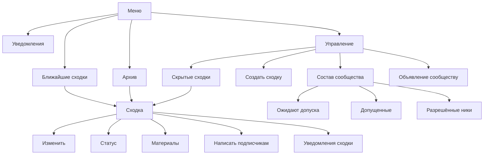
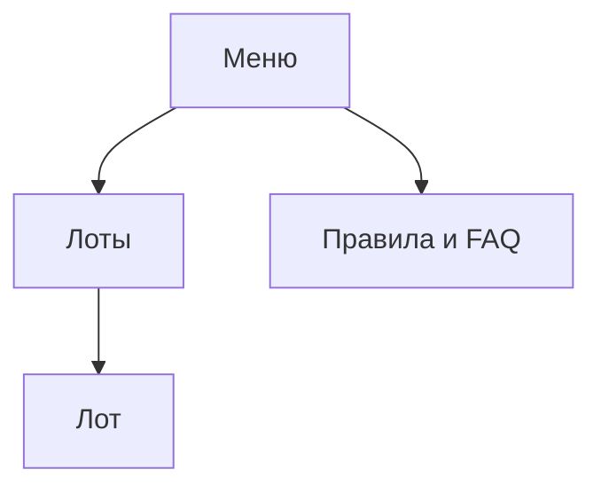

# Дизайн-код экранов бота

> **Статус:** Canonical. **Зрелость:** Accepted — выбор владельца 2 октября 2026 года ([PER-343](https://linear.app/anticnvm/issue/per-343)); на бота аукциона правила распространены решением владельца 3 октября 2026 года ([PER-450](https://linear.app/anticnvm/issue/per-450)). **Реализация:** в боте хаба реализовано в [PER-444](https://linear.app/anticnvm/issue/per-444), постеры карточки — в [PER-443](https://linear.app/anticnvm/issue/per-443); в боте аукциона не реализовано — расхождения перечислены [ниже](#расхождения-экранов-аукциона).

Документ задаёт правила экранов двух ботов в личном чате — бота хаба `hub-bot` и бота аукциона `auction-bot`: как устроена навигация, что стоит в клавиатуре, чем приходит результат, как задаётся вопрос, как размечен текст и что человек видит, пока бот ждёт сервис. Отдельные кадры хаба и их тексты остаются в [раскадровке](storyboard.html), границы компонентов и `callback_data` — в [брифе](../../services/hub-bot.md).

Каждый раздел первой строкой называет свою область: оба бота, только бот хаба или только бот аукциона. В разделе с областью «оба бота» пункт, который касается одного бота, помечен в самом пункте. Правило с областью «оба бота» действует и для экранов аукциона внутри бота хаба: тело аукционного экрана одно на два бота, различается оболочка ([ADR-044](../../decisions/ADR-044-two-telegram-bots-and-shared-auction-screens.md)); на какой слой ложится какое правило — в разделе [«Аукцион: тело, шлюз, оболочка»](#аукцион-тело-шлюз-оболочка).

## Опорные клиенты

> **Область:** оба бота.

Правила рассчитаны на Telegram Desktop и мобильные клиенты. Web K целью не является: в нём не видны ни индикатор на кнопке, ни «печатает…», и вопрос с кнопкой не открывает режим ответа. Механика, которая работает только в Web K или только мимо него, в код не берётся; что на каком клиенте проверено — в разделе [«Что проверено и чем»](#что-проверено-и-чем).

## Три класса сообщений

> **Область:** оба бота.

Каждое сообщение бота принадлежит ровно одному классу. Класс определяет, что происходит с сообщением при нажатии кнопки под ним.

| Класс | Что это | Что делает нажатие |
|---|---|---|
| **Экран** | узел дерева: заголовок, содержимое и клавиатура | правит это же сообщение в следующий экран |
| **Вопрос** | сообщение, на которое бот ждёт ответ текстом, пересылкой или файлом | «Отмена» удаляет вопрос, экран-родитель приходит новым сообщением; ответ человека даёт новое сообщение |
| **След** | факт, который остаётся в истории: уведомление, отправленный файл, предпросмотр рассылки | меняет только собственное состояние следа либо открывает экран новым сообщением; экран след не затирает |

## Дерево экранов

> **Область:** оба бота. Правило одного родителя общее, дерево у каждого бота своё.

У экрана один родитель. Переходов вбок — из раздела в соседний раздел — нет: в другой раздел человек идёт через меню.

Подтверждение, вопрос и кадр отказа — не узлы дерева, а состояния узла: подтверждение и вопрос возвращают в экран, с которого открыты, кадр отказа — в ближайший живой экран.

### Дерево бота хаба

К карточке ведут три стрелки, но родитель у конкретной карточки один — список, в котором сходка стоит сейчас, а не путь, которым человек пришёл. У отменённой, состоявшейся и прошедшей это «Архив», и скрытость здесь ничего не меняет: отменённая сходка уходит в архив сразу. У скрытой из остальных — «Скрытые сходки», у всех прочих — «Ближайшие сходки». Так возврат с карточки из архива ведёт в архив, а карточка, открытая по ссылке из чата или из уведомления, получает тот же возврат, что и открытая из списка. Подпись возврата называет, куда он ведёт, поэтому скрытая сходка, открытая из «Ближайших», честно показывает «‹ Скрытые».

«Управление» и его поддерево видит только администратор; правило входа — в [брифе](../../services/hub-bot.md#меню-команд). Кадры без доступа P-14 и P-17 в дерево не входят: у человека за ними нет экранов, и клавиатуры у них нет.

### Дерево бота аукциона

Лента «Лоты» — тело общего пакета, и родителя ей даёт оболочка: в боте аукциона это меню, в боте хаба — сходка, внутри которой идёт аукцион ([PER-307](https://linear.app/anticnvm/issue/per-307)). Родитель лота в обоих ботах — лента, причём та её страница, с которой лот открыт: номер страницы едет в `callback_data` кнопки возврата. Подписи возврата по правилу [навигации](#навигация): «‹ Лоты» у лота, «‹ Меню» у ленты и FAQ в боте аукциона, «‹ Сходка» у ленты в боте хаба. В кнопках домена `auc` сходки нет, поэтому откуда оболочка хаба берёт родителя ленты при листании, решает подключение аукциона к хабу.

Пункт меню, ведущий в ленту, сегодня называется «Аукционы», а узел — «Лоты»: бот открывает ленту одного аукциона, названного конфигурацией. Каким именем назвать пункт и возврат, выбирает перевёрстка; пока аукцион не назван, тот же узел показывает кадр «каталог пока не открыт» с возвратом в меню. Кадры «ссылка на подробные правила не указана» и «куда направлять вопросы, не указано» — состояния FAQ, а не узлы: возврат из них ведёт в FAQ.

Первый допущенный `/start` открывает «Правила и FAQ» раньше меню. Узел тот же и кнопка та же — `[‹ Меню]`; отличие в том, что её первое нажатие ставит отметку ознакомления ([бриф](../../services/hub-bot.md#общий-faq-и-меню-auction-bot)). После отметки `/start` открывает меню. Кадры ожидания допуска и блокировки в дерево не входят и клавиатуры не несут — так же, как P-14 и P-17 в хабе. Лист ставки ([PER-317](https://linear.app/anticnvm/issue/per-317)) и форма заведения лота ([PER-319](https://linear.app/anticnvm/issue/per-319)) в дерево войдут вместе со своими задачами; раскадровки у бота аукциона нет.

## Навигация

> **Область:** оба бота. Имена разделов и коды кадров в примерах — бота хаба.

- Постоянный вход — кнопка меню клиента с командами бота. Reply-клавиатуры под полем ввода нет: её кнопка отправляет текст в чат и спорит с режимом ответа на вопрос. «Домашнего» сообщения, которое бот находит и правит сам, тоже нет: для него пришлось бы помнить `message_id`, а хранилища у экранов нет ([ADR-030](../../decisions/ADR-030-telegram-bot.md)).
- Последний ряд клавиатуры экрана — навигация: `[‹ Родитель] [Меню]`. У экранов первого уровня родитель и есть меню, поэтому ряд состоит из одной кнопки `[‹ Меню]`. У самого меню ряда навигации нет.
- Подпись возврата — знак «‹», пробел и короткое имя родителя. В хабе: «‹ Меню», «‹ Ближайшие», «‹ Архив», «‹ Управление», «‹ Скрытые», «‹ Состав», «‹ Сходка», «‹ Материалы»; в аукционе: «‹ Лоты» и подпись родителя ленты. Слова «Назад», «К списку», «К лотам», «К сходке» и «К управлению» не используются.
- Боковых ссылок нет. В хабе убираются «Архив» под списком ближайших, «Настройки уведомлений» под списком, «Общие настройки» под уведомлениями сходки. Где соседний раздел важен для понимания, о нём говорит текст экрана.
- «Обновить» нет ни на одном экране, кроме состава сообщества хаба и его подэкранов: там очередь меняется без участия администратора. Остальные экраны перечитывают данные при каждом открытии. Нужна ли «Обновить» карточке лота во время торгов, где цена тоже меняется без участия человека, не решено — [открытые вопросы](#открытые-вопросы-перевёрстки).
- Кадр отказа несёт выход: повтор у отказа сервиса, возврат в ближайший живой экран у остальных. В хабе это «Повторить» у E-05 и возврат у E-01, E-03, E-04, устаревшего вопроса и нечитаемой кнопки. Экрана без кнопки не остаётся; исключение — кадры без доступа, которые в дерево не входят.

## Клавиатура

> **Область:** оба бота. Пределы рядов карточки сходки и примеры подписей — бота хаба.

Ряды идут сверху вниз в одном порядке: действия экрана, содержимое (сходки, материалы, люди), листание, навигация.

- В ряду одна кнопка. Две — только у короткой пары: ряд навигации, ряд листания, в хабе ещё «Изменить» и «Статус», материал и «Убрать». Три и больше — только у заготовок даты и времени.
- Под карточкой сходки не больше пяти рядов, под остальными экранами — не больше двенадцати. Предел рядов под карточкой лота назовёт лист ставки ([PER-317](https://linear.app/anticnvm/issue/per-317)): до него под ней только навигация. Содержимого на странице не больше восьми строк; дальше — листание кнопками «←» и «→», номер страницы стоит в заголовке.
- Словарь закрыт: возврат — «‹ Родитель», вход в меню — «Меню», выход из вопроса — «Отмена», повтор после сбоя — «Повторить», ответы подтверждения — «Да, <глагол>» и «Нет». Новое слово для той же функции не заводится.
- Подтверждение — два ряда без ряда навигации: сверху «Да, <глагол и предмет>» («Да, отменить сходку»), снизу «Нет». «Нет» возвращает в экран, с которого подтверждение открыто.
- Через подтверждение идёт каждое действие, которое человек не отменит с того же экрана. В хабе: отмена сходки, отметка «состоялась», удаление материала, отправка рассылки и объявления, закрытие доступа. В аукционе первым таким действием станет ставка: отменить её нельзя.
- `callback_data` кнопки — не больше 64 байт, а не символов. Формат и разбор — в [брифе](../../services/hub-bot.md); у домена `auc` предел держит parser общего пакета.
- Переключатель, в хабе, несёт состояние словом в начале подписи: «Вкл · Новые сходки», «Выкл · Объявления сообщества». Чекбоксов `[x]` нет.
- Цвет у кнопки один — `danger`, и только у «Да, …» в подтверждении из списка выше. `success`, `primary` и `disabled` не используются: смысл обязан читаться из подписи, а `disabled` на клиентах выглядит обычной кнопкой и нажимается.
- Кнопка-ссылка помечается знаком «↗» в конце подписи. Кнопки внутри rich-документа не используются: действия живут в клавиатуре ([ADR-034](../../decisions/ADR-034-telegram-bot-rich-presentation.md)).

## Доставка

> **Область:** оба бота. В следствиях под таблицей экраны названы хабовские, сами следствия общие.

| Что сделал человек | Чем приходит результат |
|---|---|
| нажал кнопку экрана | правкой этого же сообщения |
| отправил команду | новым сообщением с экраном |
| ответил на вопрос | одним новым сообщением: экран-результат с заметкой в первой строке («Изменение сохранено.») |
| нажал кнопку, задающую вопрос | вопрос приходит новым сообщением, экран над ним теряет клавиатуру |
| нажал «Отмена» под вопросом | вопрос удаляется, экран, с которого он задан, приходит новым сообщением |
| нажал кнопку под следом | след остаётся целым; экран приходит новым сообщением |
| нажал кнопку файла | файл приходит новым сообщением-следом |

Следствия, которые меняют сегодняшнее поведение:

- «Управление» и возвраты в него приходят правкой, как любой другой экран.
- После ответа на вопрос в чате остаётся одно сообщение бота, а не «Изменение сохранено.» и экран отдельно.
- Экран не живёт в сообщении с файлом. Подтверждение прикрепления файла остаётся следом, а «Материалы» после него приходят новым текстовым сообщением: править текст у сообщения с файлом Telegram не даёт.
- «Открыть сходку» под уведомлением открывает карточку новым сообщением. Текст уведомления, в том числе слова организатора, не затирается.
- Если Telegram правку не принял, экран уходит новым сообщением — прежнее правило края из брифа остаётся.
- Вопрос закрывается удалением, а не правкой, — единственное исключение из «нажатие правит своё сообщение». Мобильный клиент держит режим ответа на сообщение с `force_reply`, пока оно есть в чате: правка его не снимает, и он возвращается при каждом входе в чат (зонд PER-443). Если Telegram удалить сообщение не дал, вопрос правится в экран на месте.

## Вопросы

> **Область:** оба бота. Вопросов у бота аукциона пока нет: первыми станут лист ставки и форма заведения лота.

- Вопрос — сообщение с `force_reply` в inline-клавиатуре и кнопкой «Отмена» под ним. Клиент сам открывает режим ответа, а кнопка даёт выход, которого у классического `ForceReply` не было.
- Шаг вопроса лежит в `callback_data` его кнопки и возвращается в `reply_to_message.reply_markup` ответа. Поэтому вопрос переживает рестарт процесса без невидимого маркера в тексте. Исключение в хабе — вопрос о названии материала: источник файла в 64 байта не помещается, и этот шаг остаётся в карте вопросов в памяти процесса.
- Текст вопроса называет, что нужно прислать, показывает текущее значение строкой «Сейчас: …» и даёт образец формата, если формат есть.
- Экран, с которого вопрос задан, теряет клавиатуру: в чате остаётся одно место, где можно действовать. «Отмена» удаляет вопрос и присылает этот экран новым сообщением.
- После принятого ответа клавиатура вопроса снимается. После отвергнутого бот задаёт вопрос заново — с причиной отказа в первой строке и той же «Отменой»; прежний вопрос закрывается после того, как ушёл новый.
- Ответ без текста — фото, стикер, голос — на вопрос, который ждёт текст, значением не является: вопрос задаётся заново с подсказкой «Нужен ответ текстом.» и тем же шагом.
- Брошенный вопрос удаляется: если человек не ответил и не отменил, а отправил команду или нажал кнопку в другом сообщении, бот удаляет открытые вопросы этого чата. Помнит он их в памяти процесса, поэтому вопрос, заданный до рестарта, остаётся в чате и по-прежнему принимает ответ.
- Дату и время выбирают кнопками на экране без режима ответа, а вопросом спрашивают только дату, которой нет среди заготовок; правило — в разделе [«Дата и время»](#дата-и-время).

## Формат

> **Область:** оба бота.

- Экран начинается с жирного заголовка — имени экрана. У карточки сходки заголовок — название сходки, у карточки лота — название лота. Пустой экран («сходок пока нет», «лотов пока нет») несёт заголовок так же, как заполненный.
- Разметка — HTML (`parse_mode: HTML`), пользовательский текст экранируется. Rich-сообщение — только карточка: сходки и лота ([«Показ фото лота»](#показ-фото-лота)). Второй рендерер собирает карточку в HTML за тоглом процесса; в хабе это `HUB_BOT_PRESENTATION=plain`, у бота аукциона тогл появится вместе с перевёрсткой ([ADR-034](../../decisions/ADR-034-telegram-bot-rich-presentation.md)).
- Дата для чтения — «12 июня, сб, 19:00»: месяц в родительном падеже, день недели сокращён. В подписи кнопки списка — «12 июня · Название». Формат ввода в хабе остаётся `ДД.ММ.ГГГГ ЧЧ:ММ`.
- Сущность `date_time` не используется: её готовые форматы клиент рисует на языке своего интерфейса, а не по-русски, и подчёркивает как ссылку.
- Обращение — на «ты» во всех текстах, включая строку автора в карточке сходки.
- Эмодзи нет. Служебные знаки — «‹» у возврата, «·» как разделитель в подписи, «↗» у ссылки, «←» и «→» у листания.
- Текст организатора показывается дословно, без разметки: в хабе — в уведомлении и предпросмотре рассылки, в боте аукциона — тексты FAQ.

## Ожидание

> **Область:** оба бота. Коды кадров P-08, E-04, E-05 и E-09 — бота хаба.

Человек видит ожидание двумя индикаторами, которые рисует сам клиент: спиннером на нажатой кнопке и строкой «печатает…» в шапке чата.

1. **Ответ на нажатие уходит вместе с результатом**, а не до обращения к сервисам. Пока ответа нет, кнопка крутится. Это отменяет прежний порядок «`answerCallbackQuery` без текста до похода к соседям» ([PER-400](https://linear.app/anticnvm/issue/per-400)): тогда ранний ответ убирал навязчивое всплывающее «Загружаю…», теперь ответ по умолчанию не несёт текста и всплывающего окна нет.
2. **Бюджет действия — 5 секунд на все сервисы вместе.** Он один и у нажатия, и у ответа на вопрос, и у команды. Каждый вызов получает меньшее из своего дедлайна в 3 секунды и остатка бюджета; когда остаток исчерпан, вызов не делается, и человек видит кадр E-05. До этого правила худший случай был 9 секунд тишины.
3. **Сторож — 8 секунд.** Если через 8 секунд после начала обработки нажатия ответ на него ещё не ушёл, он уходит без результата. Telegram принимает ответ через 12,2 секунды и отвергает через 15,3, так что у нажатия, которое бот взял в работу, кнопка не крутится дольше лимита. Время в очереди сторож не видит: момента нажатия в апдейте нет.
4. **«Печатает…» — после 1 секунды.** Если результата нет через секунду после нажатия, ответа на вопрос или команды, бот шлёт `sendChatAction` и повторяет его каждые 4 секунды до результата. На сообщение, которое бот оставляет без ответа, индикатора нет.
5. **Всплывающий текст возвращается там, где несёт смысл, которого на экране нет:** подтверждение переключателя (кадр P-08 — «Включено: новые сходки.»), нажатие, после которого экран остался тем же (E-09 — «Без изменений.»), и повтор после сбоя, который снова не удался («Пока не получилось.»). В двух последних случаях сообщение не правится вовсе: править его тем же содержимым Telegram не даёт. Кадр E-04 всплывающего текста не получает: нажатие в устаревшем экране перерисовывает его по текущему состоянию, и то, что версия открыта актуальная, человек видит на самом экране. В остальных случаях ответ на нажатие без текста.
6. **Отказ самого ответа на нажатие действие не отменяет:** он пишется в запись границы, результат всё равно приходит правкой.
7. Экран на время ожидания не правится: промежуточного кадра «Жду ответ…» нет.

Принятый риск: бот обрабатывает апдейты строго по одному, и нажатие ждёт в очереди, пока обрабатывается предыдущее. При зависшем сервисе первое нажатие получает ответ не позже 5 секунд, второе подряд — не позже 10, а третье может получить его позже лимита Telegram и потерять всплывающий текст; само действие при этом выполнится. Параллельная обработка по чатам (`@grammyjs/runner`) не вводится.

## Правила отдельных экранов

> **Область:** только бот хаба.

### Меню

Заголовок «Меню», короткий текст о боте и ряды разделов: `[Ближайшие сходки] [Архив]`, `[Уведомления]`, у администратора — `[Управление]`. Состав команд в кнопке меню клиента не меняется.

### Списки сходок

Ближайшие, архив и скрытые устроены одинаково: заголовок, строки «• 12 июня, сб, 19:00 — Название» с прежними секциями, кнопка на сходку «12 июня · Название», листание по восемь, ряд навигации. Страницу режет бот из полного списка Meetups; страница за пределами списка открывает последнюю.

### Карточка сходки

Под карточкой не больше пяти рядов. У организатора: `[Изменить] [Статус]`, `[Материалы (N)]`, `[Написать подписчикам]`, `[Уведомления сходки]` и навигация. У участника: `[Подписаться на сходку]` либо `[Уведомления сходки]`, `[Материалы (N)]`, если материалы есть, и навигация. Кнопок файлов на карточке нет — файлы открываются из «Материалов». «Отметить состоявшейся» живёт в «Статусе».

Постеры: материалы-фотографии стоят в rich-карточке под её текстом — одно фото фотографией, несколько каруселью, не больше десяти, в порядке коллекции ([PER-443](https://linear.app/anticnvm/issue/per-443)). Карточка с постерами остаётся rich-сообщением и правится на месте в обе стороны, поэтому правило доставки для неё то же. В постеры попадает только файл, пришедший фотографией: вид записан в Meetups рядом с `file_id`, и фото, прикреплённые до этого, в постеры не попадают. Карусель на мобильном занимает почти весь экран; коллаж ниже, но режет постеры до миниатюр — для нескольких постеров выбрана карусель (решение владельца 3 октября 2026 года). В обычной карточке постеров нет: фото открывается из «Материалов».

### Состав сообщества

Корневой экран показывает числа и ведёт в три подэкрана: «Ожидают допуска», «Допущенные» и «Разрешённые ники». Списки листаются по восемь.

«Ожидают допуска» — модерация по одному: экран показывает одного человека и три кнопки — «Допустить», «Закрыть», «Пропустить». Курсор — идентификатор следующего человека в `callback_data`, а не номер в очереди: очередь меняется, пока администратор смотрит на экран. Когда очередь пуста, экран говорит об этом и несёт только навигацию. Это новая отрисовка на сегодняшнем Identity; круги, источники прихода и список отказанных из [ADR-060](../../decisions/ADR-060-auction-access-premoderation.md) в неё не входят.

### Форма создания

Бот спрашивает только название. Дальше черновик показывается карточкой с кнопками полей — дата и время, место, описание — и кнопками «Опубликовать» и «Опубликовать позже». Заполненное видно всё время, отдельного превью нет, порядок полей человек выбирает сам. Выйти из формы можно в любой момент: черновик остаётся в «Скрытых».

### Дата и время

Дата выбирается на экране заготовок: кнопки дня (ближайшие дни и выходные), после выбора дня — кнопки времени и «Другой день», возврат к выбору дня; «Другая дата» и «Отмена» стоят на обоих шагах. Это экран, а не вопрос: режима ответа у него нет, он правится на месте, а выбор времени правит его в результат. Под заготовками стоят «Другая дата» и «Отмена». «Другая дата» удаляет экран и задаёт обычный вопрос с режимом ответа — текст в формате `ДД.ММ.ГГГГ ЧЧ:ММ` для любой даты, которой нет среди заготовок. «Отмена» возвращает правкой на экран, с которого дату открыли. Режим ответа убран с экрана заготовок намеренно: ответ кнопкой не снимает его в клиенте (решение владельца 3 октября 2026 года, вариант с отдельной кнопкой для текста). Тем же экраном выбирается момент отложенной публикации. Точность расписания дизайн-код не меняет: форма, как и сегодня, принимает день со временем начала, а «только день» и интервал из [продуктовой модели](../../product/overview.md) в неё по-прежнему не входят.

### Уведомления

Заголовок, одна-две строки пояснения и переключатели по одному в ряд. Общие настройки и настройки сходки — разные узлы дерева; экран сходки на общие не ссылается кнопкой.

### Рассылка и объявление

Вопрос с «Отменой», затем предпросмотр — текст автора отдельным следом — и подтверждение `[Да, отправить]` с `danger` и `[Нет]`. После отправки подтверждение правится в экран-родитель с заметкой.

## Экраны, которые плохо ложатся на чат

> **Область:** только бот хаба.

Проверка условия возврата Mini App из [mini-app.md](../../services/mini-app.md): «вводится только для сценариев, которые неудобно или невозможно качественно реализовать в интерфейсе бота».

| Экран | Почему неудобен | Ход внутри чата |
|---|---|---|
| Ввод даты и времени | выбора даты в Bot API нет; сегодня только текст строгого формата | экран с кнопками-заготовками дня и времени, текст — через «Другая дата» |
| Форма создания сходки | девять–одиннадцать сообщений на сходку, заполненное не видно до превью, шага назад нет | один вопрос о названии и черновик-карточка с кнопками полей |
| Состав сообщества при росте | ряд кнопок на каждого человека и ник; уже при одиннадцати людях больше двенадцати рядов | три подэкрана с листанием и модерация по одному |
| Архив дальше сорока записей | искать и фильтровать нечем | листание по восемь; поиска нет |

Настройки уведомлений, материалы и рассылка на чат ложатся без оговорок.

Решение владельца: Mini App не вводится, каждый из четырёх экранов улучшается внутри чата. Ближайший повод вернуться к вопросу — поиск или фильтр по архиву или составу: листание такой сценарий не закрывает.

## Аукцион: тело, шлюз, оболочка

> **Область:** оба бота — экраны аукциона в боте аукциона и в боте хаба.

Экран аукциона собирают три слоя ([ADR-044](../../decisions/ADR-044-two-telegram-bots-and-shared-auction-screens.md)). Общий пакет `shared/typescript/auction-bot-ui` за шлюзом `handleAuctionUpdate` отдаёт тело `AuctionScreenBody` — семантические блоки и кнопки-действия без текста. Оболочка приложения — `AuctionEntryScreen` в боте аукциона, `HubScreen` в боте хаба — переводит блоки в текст, а действия в подписи, и добавляет свою навигацию. Адаптер Telegram приложения отправляет результат. У каждого правила назван слой, который его держит; два слоя названы там, где правило делится между ними:

| Правило | Слой-владелец | Что это значит |
|---|---|---|
| Состав и порядок кнопок тела: содержимое, листание, возврат к ленте | общий пакет | кнопка, которой правило не допускает, уходит из тела, а не прячется оболочкой; оба бота получают одно и то же |
| 64 байта `callback_data` домена `auc`, номер страницы в кнопке возврата | общий пакет | состояние экрана едет в кнопке, хранилища нет ([ADR-030](../../decisions/ADR-030-telegram-bot.md)) |
| Подписи кнопок тела, словарь, знаки «‹», «←», «→», «↗» | рендерер оболочки | пакет называет действие (`lot.back`), подпись «‹ Лоты» выбирает приложение; словарь у обоих ботов один |
| Заголовок, HTML, экранирование, дата, обращение на «ты» | рендерер оболочки | заголовок ленты — «Лоты» с номером страницы, заголовок карточки — название лота |
| Ряд навигации и родитель ленты | оболочка | последний ряд — `[‹ Родитель] [Меню]`; родителя ленты пакет не знает. Возврат с лота — кнопка тела `lot.back`, и в один ряд с «Меню» её ставит оболочка |
| Экраны вне тела: меню, FAQ, кадры отказа и ожидания допуска | оболочка | тексты принадлежат боту и между ботами не делятся |
| Доставка: правка на месте, новое сообщение после команды, запасной путь при отказе Telegram | адаптер Telegram приложения | в хабе — единый отправитель `showScreen`, боту аукциона нужен свой с теми же правилами |
| Ожидание: ответ на нажатие с результатом, бюджет, сторож, «печатает…» | адаптер Telegram приложения | бюджет один на личность, тело и изображение; пакет о нём не знает |
| Вопросы и подтверждения | оболочка и адаптер | шаг вопроса — в `callback_data` его кнопки; у действий домена `auc` его кодирует пакет |
| Медиа карточки лота | тело называет лот и версию изображения, адаптер достаёт байты и `file_id` | правило — в разделе [«Показ фото лота»](#показ-фото-лота) |

Шлюз правил экрана не несёт: он применяет политику поверхности и отдаёт тело, отказ доступа либо нечитаемую кнопку. Каким кадром показать отказ и нечитаемую кнопку, решает оболочка, и кадр подчиняется правилам [навигации](#навигация).

## Показ фото лота

> **Область:** оба бота — карточка лота.

Решение владельца 3 октября 2026 года ([PER-450](https://linear.app/anticnvm/issue/per-450)): карточка лота — rich-сообщение, изображение стоит в нём через `media`, как постеры в карточке сходки. Лот без изображения и лот, чьё изображение не получилось, — та же rich-карточка без `media`. Лента остаётся текстовым экраном без фото.

- **Одно сообщение.** Лента и карточка делят сообщение: нажатие на лот правит ленту в карточку, «‹ Лоты» правит карточку обратно. Удаления и нового сообщения при смене вида нет — правило [доставки](#доставка) для карточки лота то же, что для остальных экранов. Для отправителя это не «сообщение с файлом»: у сообщения под нажатием поле `rich_message`, а `photo` и `document` нет. Сообщение-фото, оставшееся в чате от прежней версии бота, в текст не правится: под ним экран приходит новым сообщением по правилу края.
- **Фото под текстом.** Заголовок, описание и строки статуса идут блоками, фото — последним блоком. Предела подписи в 1024 символа у rich-карточки нет: описание в 2,3 тысячи символов пришло целиком. Перенос строки в `html` rich-сообщения не рисуется, абзацы и заголовок размечаются блочными тегами.
- **Откуда фото.** Носитель не меняется ([ADR-057](../../decisions/ADR-057-auction-lot-catalog-as-state.md), дополнение): байты лежат в каталоге Auction, бот загружает их в rich-сообщение и держит `file_id` из ответа в кэше памяти процесса под ключом «лот и версия изображения». `file_id` приходит в ответе и отправки, и правки, поэтому кэш греется с любого показа.
- **Изображение не роняет карточку.** Изображение, которое не получилось взять у Auction или которое Telegram не принял, карточку не роняет: она приходит без фото, отказ пишется на `warn`. Отказ Telegram сообщение не трогает — после него на месте остаётся прежний экран.
- **Холодный показ спорит с бюджетом, и это не решено.** Загрузка — тот же вызов Bot API, который доставляет карточку. Правка с загрузкой файла в 0,6 МБ занимала от 1,5 до 12,8 секунды, из кэша — 0,12–0,26 секунды; файл в 5,7 МБ — от 13 до 62 секунд; файл больше 10 МБ Telegram отвергает, и ответ об этом шёл от 53 до 182 секунд. Бюджет действия из раздела [«Ожидание»](#ожидание) — 5 секунд на сервисы, а сторож отвечает на нажатие через 8. Если оборвать загрузку по времени, `file_id` не придёт, кэш не согреется, и следующее нажатие повторит то же — фото не появится никогда. Как развести, выбирает владелец в задаче перевёрстки: карточка приходит сразу без фото, а загрузка идёт следом и правит её в карточку с фото; либо кэш греется до показа; либо у холодной загрузки свой предел. До решения числа «Ожидания» к загрузке изображения не применяются.
- **Размер изображения.** Предел, который по ADR-057 держит Auction, выбирается с оглядкой на эти замеры: мегабайты загружаются десятками секунд при любом решении о бюджете. Число назначает перевёрстка по замеру на своей сети.
- **Второй рендерер.** В режиме `plain` карточка лота собирается в HTML. Тогл процесса и второй рендерер у бота аукциона вводит перевёрстка ([ADR-034](../../decisions/ADR-034-telegram-bot-rich-presentation.md#дополнение-2026-10-03-область--оба-бота)); показывает ли `plain` фото и чем, решает она же.
- **В боте хаба** тело аукциона пойдёт через единый отправитель, который сегодня принимает фото только готовым `file_id`. Подключение аукциона ([PER-307](https://linear.app/anticnvm/issue/per-307)) учит его принимать загрузку и возвращать `file_id` из ответа.

Цена выбранного варианта: у бота аукциона появляются rich-рендерер карточки, второй рендерер и тогл; единый отправитель хаба учится загрузке; карточка размечается блочными тегами; вопрос холодного показа остаётся открытым. Взамен снимаются строки 3 и 4 [расхождений](#расхождения-экранов-аукциона) и предел подписи.

Отвергнуто:

| Вариант | Почему нет |
|---|---|
| Как сегодня: сообщение-фото с подписью, смена вида — новое сообщение и удаление прежнего | постоянное исключение из двух правил доставки: нажатие не правит своё сообщение, а экран живёт в сообщении с файлом; описание режется под 1024 символа |
| Фото отдельным следом по кнопке, карточка текстом | правил не нарушает и зонда не требует, но фото уходит с карточки за лишнее нажатие; остаётся запасным, если rich придётся снять |
| Лента с фото каждого лота | восемь загрузок одним вызовом шли от 9 до 53 секунд, а одно фото занимает около половины высоты окна — страница из восьми лотов растягивается на несколько экранов; долговечный кэш для неё потребовал бы дополнения к ADR-057 |
| Двухшаговая отправка: `sendPhoto` ради `file_id`, затем rich по нему | лишнее сообщение и его удаление; не нужна, раз rich принимает загрузку сам |

Что именно подтверждено и на каком клиенте — в разделе [«Что проверено и чем»](#что-проверено-и-чем).

## Расхождения экранов аукциона

> **Область:** только бот аукциона. Бот хаба экраны аукциона ещё не показывает ([PER-307](https://linear.app/anticnvm/issue/per-307)); расхождение в общем пакете дойдёт и до него.

Снимок кода на коммите `73ec8841` от 3 октября 2026 года. Список не сопровождается: номера строк верны для этого коммита и устаревают с первой правкой, а сам список снимает перевёрстка экранов аукциона. Пути — от `apps/auction-bot/src/`, если не сказано иное.

| № | Правило | Что в коде | Где | Слой |
|---|---|---|---|---|
| 1 | [Ожидание](#ожидание), п. 1: ответ на нажатие уходит с результатом | `answerCallbackQuery` уходит до похода в Identity и Auction | `bot.ts:85–92` | адаптер |
| 2 | Ожидание, п. 2–4: бюджет 5 с, сторож 8 с, «печатает…» после 1 с | общего бюджета, сторожа и `sendChatAction` нет; дедлайн вызова 3 с, у изображения — 10 с, больше и бюджета, и сторожа | `bot.ts` целиком, `clients.ts:20`, `clients.ts:23` | адаптер |
| 3 | [Доставка](#доставка): нажатие правит своё сообщение | переход «лента ↔ карточка с фото» — новое сообщение и удаление прежнего | `bot.ts:264–266`, `bot.ts:275–279`, `bot.ts:324–330` | адаптер |
| 4 | Доставка: экран не живёт в сообщении с файлом | карточка лота — подпись к фото с клавиатурой; описание режется под 1024 символа подписи | `bot.ts:270–278`, `entry-screen.ts:38–40`, `entry-screen.ts:50`, `entry-screen.ts:177` | адаптер и оболочка |
| 5 | [Навигация](#навигация): подпись возврата — «‹ Родитель» | возврат с лота подписан «К лотам» | `entry-screen.ts:360–361` | оболочка |
| 6 | Навигация: последний ряд — `[‹ Родитель] [Меню]`; словарь: «Меню» | вход в меню подписан «В меню»; у FAQ он первый ряд; под лотом возврат и меню стоят разными рядами, между ними FAQ | `entry-screen.ts:67`, `entry-screen.ts:86–104`, `entry-screen.ts:138` | оболочка |
| 7 | Навигация: боковых ссылок нет | «Правила и FAQ» стоит под экранами, которым FAQ не родитель: заглушкой каталога, лентой, лотом и кадрами отказа | `entry-screen.ts:63–66`, `entry-screen.ts:117`, `entry-screen.ts:138`, `entry-screen.ts:152`, `entry-screen.ts:157` | оболочка |
| 8 | Навигация: «Обновить» нет | «Обновить» под карточкой лота | `entry-screen.ts:358–359`, `shared/typescript/auction-bot-ui/src/internal/use-cases/open-lot.ts:40–48` | общий пакет |
| 9 | Навигация: кадр отказа несёт выход | «недоступно» без «Повторить»; «устарел» отправляет человека печатать `/start`; у обоих только «Правила и FAQ» | `entry-screen.ts:149–158` | оболочка |
| 10 | [Клавиатура](#клавиатура): листание «←» и «→», номер страницы в заголовке | листание «‹ Предыдущие» и «Следующие ›» знаком возврата; номер страницы в тексте | `entry-screen.ts:354–357`, `entry-screen.ts:211` | оболочка |
| 11 | Клавиатура: кнопка-ссылка несёт «↗» | «Прочитать подробнее» и «Задать вопрос» со ссылкой — без знака | `entry-screen.ts:94`, `entry-screen.ts:102` | оболочка |
| 12 | [Формат](#формат): жирный заголовок первой строкой | заголовков нет: FAQ и «Аукционы» начинаются с обычной строки, тело — со строки «Аукцион сообщества.», меню и кадры отказа — с текста | `entry-screen.ts:78`, `entry-screen.ts:108`, `entry-screen.ts:116`, `entry-screen.ts:179` | оболочка |
| 13 | Формат: разметка HTML | сообщения уходят без `parse_mode`, текст не экранируется | `bot.ts:80`, `bot.ts:191–195`, `bot.ts:263`, `bot.ts:265`, `bot.ts:272`, `bot.ts:275–278` | адаптер |
| 14 | Формат: обращение на «ты» | «Выберите раздел.», «Отправьте /start», «Попробуйте позже.» | `entry-screen.ts:108`, `entry-screen.ts:151`, `entry-screen.ts:156` | оболочка |
| 15 | Формат: дата для чтения — «12 июня, сб, 19:00» | срок торгов собирается без дня недели | `entry-screen.ts:407–415` | оболочка |

Каталога экранов и линтера у бота аукциона нет, а отправок две — `ctx.reply` у `/start` (`bot.ts:80`) и `deliver` у нажатия (`bot.ts:244–322`). Расхождением это не считается: раздел [«Исполнение правил»](#исполнение-правил) пока действует только для хаба, а для бота аукциона его вводит [PER-451](https://linear.app/anticnvm/issue/per-451).

Не расходится: `callback_data` домена `auc` проверяется на 64 байта parser'ом пакета; в ряду по одной кнопке, пара — только у листания; эмодзи нет; `/start` отвечает новым сообщением. Вопросов и подтверждений в коде бота аукциона ещё нет, и расходиться там нечему: лист ставки и форма лота пишутся сразу по правилам.

[Бриф](../../services/hub-bot.md#два-входа-аукциона) описывает сегодняшнее поведение бота аукциона и потому расходится с дизайн-кодом там же, где код; он правится вместе с кодом.

### Открытые вопросы перевёрстки

Решает владелец в задаче перевёрстки; дизайн-код до решения не меняется.

- **«Обновить» на карточке лота** (строка 8). Правило допускает кнопку только там, где данные меняются без участия человека, и называет один такой экран — состав сообщества. Цена и лидер лота во время торгов меняются так же. Либо карточка лота становится вторым исключением, либо кнопка уходит из тела и карточка перечитывается при открытии.
- **«Правила и FAQ» под экранами вне FAQ** (строка 7). Бриф требует возврата к FAQ в один переход с любого экрана бота аукциона, дизайн-код запрещает боковые ссылки. Либо FAQ остаётся исключением оболочки бота аукциона, либо достаётся через меню.

## Из чего выбирали

> **Область:** только бот хаба — история выбора 2 октября 2026 года. Варианты показа фото лота — в разделе [«Показ фото лота»](#показ-фото-лота).

Владельцу показаны три варианта; в код вошла смесь, а не один из них.

| Вариант | Суть | Цена перевёрстки | Что взято |
|---|---|---|---|
| A. Узаконить сложившееся | записать то, что есть: «Назад» и «К списку», «Обновить» остаётся, ответ на нажатие по-прежнему до сервисов, к ожиданию добавляется «печатает…» | 7 срезов; не лечит навигацию, тишину до 9 секунд и возврат из архива | цвет только `danger` |
| B. Дерево с одним якорем | один родитель у экрана, возврат назван по родителю, вопрос с кнопкой «Отмена», HTML-заголовки, «Вкл ·» | 11 срезов; больше нажатий на переход между разделами | дерево и возврат, карточка, подтверждения, вопрос, переключатели, формат |
| C. Проверяемый код | те же цели, но каждое правило держит линтер экрана и каталог; ответ на нажатие уходит с результатом, бюджет 5 секунд | 13 срезов, первым идёт каркас проверки | правило ожидания, линтер и каталог |

Рекомендация была за C с подтверждениями из B и переключателями из A. Владелец выбрал навигацию, вопрос и переключатели из B, ожидание и исполнение из C. Отвергнуто во всех трёх: постоянная reply-клавиатура, «домашнее» сообщение и промежуточный кадр «Жду ответ…» с `disabled`-кнопками — клиенты рисуют такую кнопку обычной.

## Исполнение правил

> **Область:** только бот хаба. Каталог экранов и линтер для бота аукциона — [PER-451](https://linear.app/anticnvm/issue/per-451); до него правила в боте аукциона держит ревью.

Правила держит не ревью, а тесты ([PER-444](https://linear.app/anticnvm/issue/per-444)):

- **каталог экранов** — таблица-данные: идентификатор экрана, заголовок, родитель, класс сообщения;
- **линтер экрана** — проверка каждого отправленного экрана в харнессе тестов L0 и L2: заголовок в первой строке, последний ряд по каталогу, число кнопок в ряду и рядов, цвет только у «Да, …», отсутствие слов вне словаря;
- **единый отправитель** — экран уходит в Bot API через одну функцию; клавиатура, отправленная мимо неё, роняет тест.

Непереведённых экранов в каталоге нет. Пометка `legacy` в нём осталась механизмом: экран, который вводится раньше своих правил, помечается, и тест падает, когда помеченный экран уже проходит правила, — пометка не переживает свою причину.

## Что проверено и чем

> **Область:** оба бота. Возможности клиента и Bot API от бота не зависят; замеры пульта провода — бота хаба.

Возможности Bot API подтверждены [документацией](https://core.telegram.org/bots/api) версии 10.3 от 24 августа 2026 года и живым ботом. Живьём проверял одноразовый бот-зонд на токене локального dev-бота: Web K — агент через Chrome, Desktop и мобильный клиент — владелец руками. Как устроена такая проверка и почему не тестовая среда Telegram — в [cookbook пультов](../../development/bot-consoles.md#живая-проверка).

| Возможность | Документация | Web K | Desktop и мобильный | Вывод |
|---|---|---|---|---|
| Цвет кнопки `style` | Bot API 9.4 | рисуется: `danger` красная, `success` зелёная, `primary` в цвет темы | рисуется | берём `danger` |
| `disabled` у кнопки | Bot API 10.3 | выглядит обычной, не нажимается | выглядит обычной и нажимается | не берём |
| Всплывающий текст ответа на нажатие | есть | виден | виден | берём точечно |
| Спиннер кнопки до ответа | «progress bar until you call answerCallbackQuery» | не рисуется | крутится | основной индикатор |
| Лимит ответа на нажатие | числа нет | принят через 12,2 с, отвергнут через 15,3 с | отдельно не мерили: отказ выдаёт Bot API, а не клиент | сторож 8 с |
| `sendChatAction` | статус на 5 с | не виден | виден перед новым сообщением и перед правкой | второй индикатор |
| Rich-сообщение: заголовок, таблица, `details` | Bot API 10.1–10.3 | рисуется | рисуется | карточка остаётся rich |
| Правка одного сообщения rich ↔ текст | `editMessageText` с `rich_message` | принимается в обе стороны | принимается; решает Bot API, а не клиент | карточка и подменю делят сообщение |
| Правка текста у сообщения с файлом | — | отвергается: `there is no text in the message to edit`; `editMessageCaption` принимается | отдельно не проверяли: отказ выдаёт Bot API, а не клиент | экран не живёт в файле |
| Сущность `date_time` | Bot API 9.5 | подчёркнутая ссылка, готовые форматы на языке клиента | не проверялось | не берём |
| `force_reply` в inline-клавиатуре | Bot API 10.3 | принимается, режим ответа не открывается | Desktop: режим ответа открывается сам, в `reply_to_message` приходит клавиатура вопроса; мобильный: режим ответа открывается сам, «Отмена» видна, после ответа клавиатура вопроса снимается | берём, мобильный проверяется до вёрстки вопросов |
| Классический `ForceReply` | есть | режим ответа открывается; клавиатуры в `reply_to_message` нет | — | заменяется |
| Фото по `file_id` и карусель в rich | `tg://photo?id=` и `media`, `<tg-slideshow>`, `<tg-collage>` | не проверялось | Desktop и мобильный: карусель листается, одно фото и коллаж рисуются; на мобильном карусель занимает почти весь экран | постеры в карточке |
| Правка rich с медиа ↔ текст ↔ rich без медиа | `editMessageText` с `rich_message` | не проверялось | принимается во все стороны на том же сообщении, 110–400 мс; замена одной клавиатуры медиа не трогает | карточка с постерами правится на месте |
| Сообщение под нажатием у карточки с постерами | — | не проверялось | `rich_message` с блоками, полей `photo` и `document` нет | для отправителя это не «сообщение с файлом» |
| Загрузка байтов в rich: `media` с `attach://` | `InputRichMessageMedia` принимает загрузку | не проверялось | принимается в `sendRichMessage` и в `editMessageText`; решает Bot API, а не клиент. Фото под текстом во всю ширину сообщения, длинный текст не обрезан — снимок владельца, клиент не назван | карточка лота грузит фото сама |
| `file_id` в ответе rich-сообщения | `RichBlockPhoto.photo` | не проверялось | есть в ответе отправки и правки — правка возвращает сообщение, а не `true`; принимается следующей правкой за 0,15 с | кэш греется с любого показа |
| Время правки текст → rich с фото | — | не проверялось | загрузка 0,6 МБ — 1,5–12,8 с, по `file_id` — 0,12–0,26 с, загрузка 5,7 МБ — 13–62 с; замер Bot API с машины разработчика, два прогона | холодный показ спорит с бюджетом — открытый вопрос перевёрстки |
| Отказ на изображение в правке rich | — | не проверялось | `file must be non-empty`, `IMAGE_PROCESS_FAILED`, `too big for a photo` выше 10 МБ — ответ через 53–182 с, `wrong remote file identifier`; сообщение после отказа прежнее | карточка без фото вместо отказа экрана |
| Rich-лента с восемью фото | — | не проверялось | принимается одним вызовом за 9–53 с; фото во всю ширину, около половины высоты окна каждое | лента остаётся текстом |
| Перенос строки в `html` rich-сообщения | — | не проверялось | не рисуется: строки сливаются в абзац | блочные теги |
| Документ в роли фото | — | не проверялось | отвергается: `can't use file of type Document as Photo`, и для JPEG, присланного файлом | вид файла хранится, а не выводится из MIME |
| Снятие режима ответа у вопроса | — | не проверялось | мобильный: правка вопроса любым способом режим ответа не снимает, и он переживает перезаход, пока человек не ответит или не закроет его сам; удаление сообщения снимает сразу. `force_reply: false` в правке Bot API игнорирует | отменённый вопрос удаляется |
| Неотвеченный классический `ForceReply` | — | не проверялось | мобильный: всплывает при каждом входе в чат, ручное закрытие не помогает; снимается сообщением с `remove_keyboard` | бот классических вопросов не задаёт |

Пульт провода L2 дал измерения до и после перевёрстки. До: ответ на нажатие всегда первый вызов и без текста; сервис, медленный на 1,5 секунды, даёт 1,5 секунды тишины без индикатора; сервис дольше дедлайна — кадр E-05 через 3 секунды; два медленных сервиса подряд — экран через 5,2 секунды. После, 3 октября 2026 года: ответ на нажатие уходит вместе с результатом; при Meetups, медленном на 1,5 секунды, бот шлёт `sendChatAction`, а экран приходит через 1,5 секунды; при Identity, медленном на 1,5 секунды, состав сообщества приходит через 3 секунды — личность и экран читаются двумя вызовами; сервис дольше дедлайна — кадр отказа с «Повторить» через 3 секунды. Линтер экранов на проходе формы создания, заготовок даты, публикации и состава сообщества нарушений не нашёл. Чего пульт не видит: отказ Telegram на вызов, вид экрана у клиента и экраны, которым нужен Notifications.

Зонд rich-карточки лота ([PER-450](https://linear.app/anticnvm/issue/per-450)) шёл 3 октября 2026 года на том же dev-боте; серверную часть читал агент из лога зонда, вид — владелец. Не проверено для карточки лота: что человек видит на Desktop и на мобильном, пока сообщение правится в карточку с загрузкой; вид карточки с загруженным фото на мобильном; время загрузки с сети прода. Ответ на нажатие в первом прогоне зонда Bot API отверг на всех пяти нажатиях, причину зонд не записал — уходит ли он вместе с правкой rich, не подтверждено.

Не проверено: гаснет ли «печатает…» сразу после правки сообщения — документация обещает сброс только при новом сообщении; всплывает ли при входе в чат брошенный вопрос с «Отменой», заданный до рестарта бота; новое поведение вопросов — удаление при отмене и при уходе от вопроса, экран заготовок без режима ответа — на живом мобильном клиенте.
