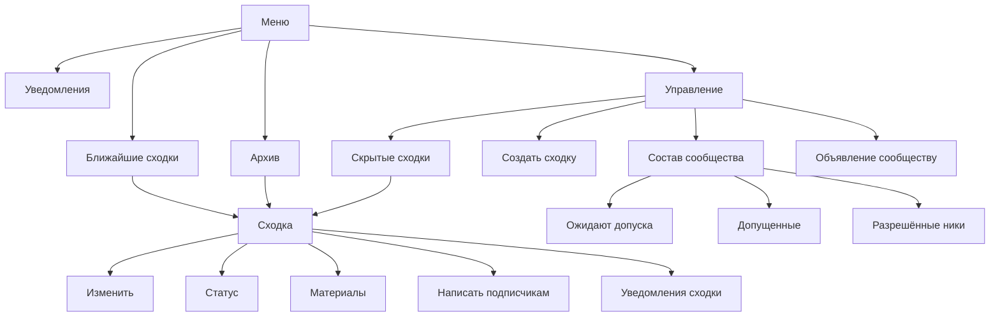

# Дизайн-код экранов бота

> **Статус:** Canonical. **Зрелость:** Accepted — выбор владельца 2 октября 2026 года ([PER-343](https://linear.app/anticnvm/issue/per-343)). **Реализация:** реализовано в [PER-444](https://linear.app/anticnvm/issue/per-444), кроме карусели постеров — [PER-443](https://linear.app/anticnvm/issue/per-443).

Документ задаёт общие правила экранов бота хаба `telegram-bot` в личном чате: как устроена навигация, что стоит в клавиатуре, чем приходит результат, как задаётся вопрос, как размечен текст и что человек видит, пока бот ждёт сервис. Отдельные кадры и их тексты остаются в [раскадровке](storyboard.html), границы компонента и `callback_data` — в [брифе](../../services/telegram-bot.md). Бот аукциона и общий пакет аукционных экранов ([ADR-044](../../decisions/ADR-044-two-telegram-bots-and-shared-auction-screens.md)) этим документом не описаны.

## Опорные клиенты

Правила рассчитаны на Telegram Desktop и мобильные клиенты. Web K целью не является: в нём не видны ни индикатор на кнопке, ни «печатает…», и вопрос с кнопкой не открывает режим ответа. Механика, которая работает только в Web K или только мимо него, в код не берётся; что на каком клиенте проверено — в разделе [«Что проверено и чем»](#что-проверено-и-чем).

## Три класса сообщений

Каждое сообщение бота принадлежит ровно одному классу. Класс определяет, что происходит с сообщением при нажатии кнопки под ним.

| Класс | Что это | Что делает нажатие |
|---|---|---|
| **Экран** | узел дерева: заголовок, содержимое и клавиатура | правит это же сообщение в следующий экран |
| **Вопрос** | сообщение, на которое бот ждёт ответ текстом, пересылкой или файлом | «Отмена» правит вопрос в экран-родитель; ответ человека даёт новое сообщение |
| **След** | факт, который остаётся в истории: уведомление, отправленный файл, предпросмотр рассылки | меняет только собственное состояние следа либо открывает экран новым сообщением; экран след не затирает |

## Дерево экранов

У экрана один родитель. Переходов вбок — из раздела в соседний раздел — нет: в другой раздел человек идёт через меню.

К карточке ведут три стрелки, но родитель у конкретной карточки один — список, в котором сходка стоит сейчас, а не путь, которым человек пришёл. У отменённой, состоявшейся и прошедшей это «Архив», и скрытость здесь ничего не меняет: отменённая сходка уходит в архив сразу. У скрытой из остальных — «Скрытые сходки», у всех прочих — «Ближайшие сходки». Так возврат с карточки из архива ведёт в архив, а карточка, открытая по ссылке из чата или из уведомления, получает тот же возврат, что и открытая из списка. Подпись возврата называет, куда он ведёт, поэтому скрытая сходка, открытая из «Ближайших», честно показывает «‹ Скрытые».

«Управление» и его поддерево видит только администратор; правило входа — в [брифе](../../services/telegram-bot.md#меню-команд). Кадры без доступа P-14 и P-17 в дерево не входят: у человека за ними нет экранов, и клавиатуры у них нет.

Подтверждение, вопрос и кадр отказа — не узлы дерева, а состояния узла: подтверждение и вопрос возвращают в экран, с которого открыты, кадр отказа — в ближайший живой экран.

## Навигация

- Постоянный вход — кнопка меню клиента с командами бота. Reply-клавиатуры под полем ввода нет: её кнопка отправляет текст в чат и спорит с режимом ответа на вопрос. «Домашнего» сообщения, которое бот находит и правит сам, тоже нет: для него пришлось бы помнить `message_id`, а хранилища у экранов нет ([ADR-030](../../decisions/ADR-030-telegram-bot.md)).
- Последний ряд клавиатуры экрана — навигация: `[‹ Родитель] [Меню]`. У экранов первого уровня родитель и есть меню, поэтому ряд состоит из одной кнопки `[‹ Меню]`. У самого меню ряда навигации нет.
- Подпись возврата — знак «‹», пробел и короткое имя родителя: «‹ Меню», «‹ Ближайшие», «‹ Архив», «‹ Управление», «‹ Скрытые», «‹ Состав», «‹ Сходка», «‹ Материалы». Слова «Назад», «К списку», «К сходке» и «К управлению» не используются.
- Боковых ссылок нет: «Архив» под списком ближайших, «Настройки уведомлений» под списком, «Общие настройки» под уведомлениями сходки убираются. Где соседний раздел важен для понимания, о нём говорит текст экрана.
- «Обновить» нет ни на одном экране, кроме состава сообщества и его подэкранов: там очередь меняется без участия администратора. Остальные экраны перечитывают данные при каждом открытии.
- Кадр отказа несёт выход: «Повторить» у E-05, возврат в ближайший живой экран у E-01, E-03, E-04, устаревшего вопроса и нечитаемой кнопки. Экрана без кнопки не остаётся.

## Клавиатура

Ряды идут сверху вниз в одном порядке: действия экрана, содержимое (сходки, материалы, люди), листание, навигация.

- В ряду одна кнопка. Две — только у короткой пары: «Изменить» и «Статус», материал и «Убрать», ряд навигации, ряд листания. Три и больше — только у заготовок даты и времени.
- Под карточкой сходки не больше пяти рядов, под остальными экранами — не больше двенадцати. Содержимого на странице не больше восьми строк; дальше — листание кнопками «←» и «→», номер страницы стоит в заголовке.
- Словарь закрыт: возврат — «‹ Родитель», вход в меню — «Меню», выход из вопроса — «Отмена», повтор после сбоя — «Повторить», ответы подтверждения — «Да, <глагол>» и «Нет». Новое слово для той же функции не заводится.
- Подтверждение — два ряда без ряда навигации: сверху «Да, <глагол и предмет>» («Да, отменить сходку»), снизу «Нет». «Нет» возвращает в экран, с которого подтверждение открыто.
- Через подтверждение идёт каждое действие, которое человек не отменит с того же экрана: отмена сходки, отметка «состоялась», удаление материала, отправка рассылки и объявления, закрытие доступа.
- Переключатель несёт состояние словом в начале подписи: «Вкл · Новые сходки», «Выкл · Объявления сообщества». Чекбоксов `[x]` нет.
- Цвет у кнопки один — `danger`, и только у «Да, …» в подтверждении из списка выше. `success`, `primary` и `disabled` не используются: смысл обязан читаться из подписи, а `disabled` на клиентах выглядит обычной кнопкой и нажимается.
- Кнопка-ссылка помечается знаком «↗» в конце подписи. Кнопки внутри rich-документа не используются: действия живут в клавиатуре ([ADR-034](../../decisions/ADR-034-telegram-bot-rich-presentation.md)).

## Доставка

| Что сделал человек | Чем приходит результат |
|---|---|
| нажал кнопку экрана | правкой этого же сообщения |
| отправил команду | новым сообщением с экраном |
| ответил на вопрос | одним новым сообщением: экран-результат с заметкой в первой строке («Изменение сохранено.») |
| нажал кнопку, задающую вопрос | вопрос приходит новым сообщением, экран над ним теряет клавиатуру |
| нажал кнопку под следом | след остаётся целым; экран приходит новым сообщением |
| нажал кнопку файла | файл приходит новым сообщением-следом |

Следствия, которые меняют сегодняшнее поведение:

- «Управление» и возвраты в него приходят правкой, как любой другой экран.
- После ответа на вопрос в чате остаётся одно сообщение бота, а не «Изменение сохранено.» и экран отдельно.
- Экран не живёт в сообщении с файлом. Подтверждение прикрепления файла остаётся следом, а «Материалы» после него приходят новым текстовым сообщением: править текст у сообщения с файлом Telegram не даёт.
- «Открыть сходку» под уведомлением открывает карточку новым сообщением. Текст уведомления, в том числе слова организатора, не затирается.
- Если Telegram правку не принял, экран уходит новым сообщением — прежнее правило края из брифа остаётся.

## Вопросы

- Вопрос — сообщение с `force_reply` в inline-клавиатуре и кнопкой «Отмена» под ним. Клиент сам открывает режим ответа, а кнопка даёт выход, которого у классического `ForceReply` не было.
- Шаг вопроса лежит в `callback_data` его кнопки и возвращается в `reply_to_message.reply_markup` ответа. Поэтому вопрос переживает рестарт процесса без невидимого маркера в тексте. Исключение — вопрос о названии материала: источник файла в 64 байта не помещается, и этот шаг остаётся в карте вопросов в памяти процесса.
- Текст вопроса называет, что нужно прислать, показывает текущее значение строкой «Сейчас: …» и даёт образец формата, если формат есть.
- Экран, с которого вопрос задан, теряет клавиатуру: в чате остаётся одно место, где можно действовать. «Отмена» правит вопрос в этот экран.
- После принятого ответа клавиатура вопроса снимается. После отвергнутого бот задаёт вопрос заново — с причиной отказа в первой строке и той же «Отменой».
- Вопрос о дате и времени несёт кнопки-заготовки; правило — в разделе [«Дата и время»](#дата-и-время).

## Формат

- Экран начинается с жирного заголовка — имени экрана. У карточки сходки заголовок — название сходки. Пустой экран («сходок пока нет») несёт заголовок так же, как заполненный.
- Разметка — HTML (`parse_mode: HTML`), пользовательский текст экранируется. Rich-сообщение — только карточка сходки; второй рендерер карточки при `TELEGRAM_BOT_PRESENTATION=plain` собирает её в HTML ([ADR-034](../../decisions/ADR-034-telegram-bot-rich-presentation.md)).
- Дата для чтения — «12 июня, сб, 19:00»: месяц в родительном падеже, день недели сокращён. В подписи кнопки списка — «12 июня · Название». Формат ввода остаётся `ДД.ММ.ГГГГ ЧЧ:ММ`.
- Сущность `date_time` не используется: её готовые форматы клиент рисует на языке своего интерфейса, а не по-русски, и подчёркивает как ссылку.
- Обращение — на «ты» во всех текстах, включая строку автора в карточке.
- Эмодзи нет. Служебные знаки — «‹» у возврата, «·» как разделитель в подписи, «↗» у ссылки, «←» и «→» у листания.
- Текст организатора в уведомлении и предпросмотре рассылки показывается дословно, без разметки.

## Ожидание

Человек видит ожидание двумя индикаторами, которые рисует сам клиент: спиннером на нажатой кнопке и строкой «печатает…» в шапке чата.

1. **Ответ на нажатие уходит вместе с результатом**, а не до обращения к сервисам. Пока ответа нет, кнопка крутится. Это отменяет прежний порядок «`answerCallbackQuery` без текста до похода к соседям» ([PER-400](https://linear.app/anticnvm/issue/per-400)): тогда ранний ответ убирал навязчивое всплывающее «Загружаю…», теперь ответ по умолчанию не несёт текста и всплывающего окна нет.
2. **Бюджет действия — 5 секунд на все сервисы вместе.** Он один и у нажатия, и у ответа на вопрос, и у команды. Каждый вызов получает меньшее из своего дедлайна в 3 секунды и остатка бюджета; когда остаток исчерпан, вызов не делается, и человек видит кадр E-05. До этого правила худший случай был 9 секунд тишины.
3. **Сторож — 8 секунд.** Если через 8 секунд после начала обработки нажатия ответ на него ещё не ушёл, он уходит без результата. Telegram принимает ответ через 12,2 секунды и отвергает через 15,3, так что у нажатия, которое бот взял в работу, кнопка не крутится дольше лимита. Время в очереди сторож не видит: момента нажатия в апдейте нет.
4. **«Печатает…» — после 1 секунды.** Если результата нет через секунду после нажатия, ответа на вопрос или команды, бот шлёт `sendChatAction` и повторяет его каждые 4 секунды до результата. На сообщение, которое бот оставляет без ответа, индикатора нет.
5. **Всплывающий текст возвращается там, где несёт смысл, которого на экране нет:** подтверждение переключателя (кадр P-08 — «Включено: новые сходки.»), нажатие, после которого экран остался тем же (E-09 — «Без изменений.»), и повтор после сбоя, который снова не удался («Пока не получилось.»). В двух последних случаях сообщение не правится вовсе: править его тем же содержимым Telegram не даёт. Кадр E-04 всплывающего текста не получает: нажатие в устаревшем экране перерисовывает его по текущему состоянию, и то, что версия открыта актуальная, человек видит на самом экране. В остальных случаях ответ на нажатие без текста.
6. **Отказ самого ответа на нажатие действие не отменяет:** он пишется в запись границы, результат всё равно приходит правкой.
7. Экран на время ожидания не правится: промежуточного кадра «Жду ответ…» нет.

Принятый риск: бот обрабатывает апдейты строго по одному, и нажатие ждёт в очереди, пока обрабатывается предыдущее. При зависшем сервисе первое нажатие получает ответ не позже 5 секунд, второе подряд — не позже 10, а третье может получить его позже лимита Telegram и потерять всплывающий текст; само действие при этом выполнится. Параллельная обработка по чатам (`@grammyjs/runner`) не вводится.

## Правила отдельных экранов

### Меню

Заголовок «Меню», короткий текст о боте и ряды разделов: `[Ближайшие сходки] [Архив]`, `[Уведомления]`, у администратора — `[Управление]`. Состав команд в кнопке меню клиента не меняется.

### Списки сходок

Ближайшие, архив и скрытые устроены одинаково: заголовок, строки «• 12 июня, сб, 19:00 — Название» с прежними секциями, кнопка на сходку «12 июня · Название», листание по восемь, ряд навигации. Страницу режет бот из полного списка Meetups; страница за пределами списка открывает последнюю.

### Карточка сходки

Под карточкой не больше пяти рядов. У организатора: `[Изменить] [Статус]`, `[Материалы (N)]`, `[Написать подписчикам]`, `[Уведомления сходки]` и навигация. У участника: `[Подписаться на сходку]` либо `[Уведомления сходки]`, `[Материалы (N)]`, если материалы есть, и навигация. Кнопок файлов на карточке нет — файлы открываются из «Материалов». «Отметить состоявшейся» живёт в «Статусе».

Постеры: материалы-фотографии показываются каруселью в rich-карточке. Правило принято, но механика ещё не проверена зондом и требует вида файла в контракте Meetups — [PER-443](https://linear.app/anticnvm/issue/per-443). Если карточка с каруселью не правится на месте, правило возвращается владельцу.

### Состав сообщества

Корневой экран показывает числа и ведёт в три подэкрана: «Ожидают допуска», «Допущенные» и «Разрешённые ники». Списки листаются по восемь.

«Ожидают допуска» — модерация по одному: экран показывает одного человека и три кнопки — «Допустить», «Закрыть», «Пропустить». Курсор — идентификатор следующего человека в `callback_data`, а не номер в очереди: очередь меняется, пока администратор смотрит на экран. Когда очередь пуста, экран говорит об этом и несёт только навигацию. Это новая отрисовка на сегодняшнем Identity; круги, источники прихода и список отказанных из [ADR-060](../../decisions/ADR-060-auction-access-premoderation.md) в неё не входят.

### Форма создания

Бот спрашивает только название. Дальше черновик показывается карточкой с кнопками полей — дата и время, место, описание — и кнопками «Опубликовать» и «Опубликовать позже». Заполненное видно всё время, отдельного превью нет, порядок полей человек выбирает сам. Выйти из формы можно в любой момент: черновик остаётся в «Скрытых».

### Дата и время

Вопрос о дате несёт кнопки-заготовки дня (ближайшие дни и выходные), после выбора дня — кнопки времени и «Другой день», возврат к выбору дня. Ответ текстом в формате `ДД.ММ.ГГГГ ЧЧ:ММ` остаётся запасным путём для любой даты, которой нет среди заготовок. Точность расписания дизайн-код не меняет: форма, как и сегодня, принимает день со временем начала, а «только день» и интервал из [продуктовой модели](../../product/overview.md) в неё по-прежнему не входят.

### Уведомления

Заголовок, одна-две строки пояснения и переключатели по одному в ряд. Общие настройки и настройки сходки — разные узлы дерева; экран сходки на общие не ссылается кнопкой.

### Рассылка и объявление

Вопрос с «Отменой», затем предпросмотр — текст автора отдельным следом — и подтверждение `[Да, отправить]` с `danger` и `[Нет]`. После отправки подтверждение правится в экран-родитель с заметкой.

## Экраны, которые плохо ложатся на чат

Проверка условия возврата Mini App из [mini-app.md](../../services/mini-app.md): «вводится только для сценариев, которые неудобно или невозможно качественно реализовать в интерфейсе бота».

| Экран | Почему неудобен | Ход внутри чата |
|---|---|---|
| Ввод даты и времени | выбора даты в Bot API нет; сегодня только текст строгого формата | кнопки-заготовки дня и времени, текст — запасной путь |
| Форма создания сходки | девять–одиннадцать сообщений на сходку, заполненное не видно до превью, шага назад нет | один вопрос о названии и черновик-карточка с кнопками полей |
| Состав сообщества при росте | ряд кнопок на каждого человека и ник; уже при одиннадцати людях больше двенадцати рядов | три подэкрана с листанием и модерация по одному |
| Архив дальше сорока записей | искать и фильтровать нечем | листание по восемь; поиска нет |

Настройки уведомлений, материалы и рассылка на чат ложатся без оговорок.

Решение владельца: Mini App не вводится, каждый из четырёх экранов улучшается внутри чата. Ближайший повод вернуться к вопросу — поиск или фильтр по архиву или составу: листание такой сценарий не закрывает.

## Из чего выбирали

Владельцу показаны три варианта; в код вошла смесь, а не один из них.

| Вариант | Суть | Цена перевёрстки | Что взято |
|---|---|---|---|
| A. Узаконить сложившееся | записать то, что есть: «Назад» и «К списку», «Обновить» остаётся, ответ на нажатие по-прежнему до сервисов, к ожиданию добавляется «печатает…» | 7 срезов; не лечит навигацию, тишину до 9 секунд и возврат из архива | цвет только `danger` |
| B. Дерево с одним якорем | один родитель у экрана, возврат назван по родителю, вопрос с кнопкой «Отмена», HTML-заголовки, «Вкл ·» | 11 срезов; больше нажатий на переход между разделами | дерево и возврат, карточка, подтверждения, вопрос, переключатели, формат |
| C. Проверяемый код | те же цели, но каждое правило держит линтер экрана и каталог; ответ на нажатие уходит с результатом, бюджет 5 секунд | 13 срезов, первым идёт каркас проверки | правило ожидания, линтер и каталог |

Рекомендация была за C с подтверждениями из B и переключателями из A. Владелец выбрал навигацию, вопрос и переключатели из B, ожидание и исполнение из C. Отвергнуто во всех трёх: постоянная reply-клавиатура, «домашнее» сообщение и промежуточный кадр «Жду ответ…» с `disabled`-кнопками — клиенты рисуют такую кнопку обычной.

## Исполнение правил

Правила держит не ревью, а тесты ([PER-444](https://linear.app/anticnvm/issue/per-444)):

- **каталог экранов** — таблица-данные: идентификатор экрана, заголовок, родитель, класс сообщения;
- **линтер экрана** — проверка каждого отправленного экрана в харнессе тестов L0 и L2: заголовок в первой строке, последний ряд по каталогу, число кнопок в ряду и рядов, цвет только у «Да, …», отсутствие слов вне словаря;
- **единый отправитель** — экран уходит в Bot API через одну функцию; клавиатура, отправленная мимо неё, роняет тест.

Непереведённых экранов в каталоге нет. Пометка `legacy` в нём осталась механизмом: экран, который вводится раньше своих правил, помечается, и тест падает, когда помеченный экран уже проходит правила, — пометка не переживает свою причину.

## Что проверено и чем

Возможности Bot API подтверждены [документацией](https://core.telegram.org/bots/api) версии 10.3 от 24 августа 2026 года и живым ботом. Живьём проверял одноразовый бот-зонд на токене локального dev-бота: Web K — агент через Chrome, Desktop и мобильный клиент — владелец руками. Как устроена такая проверка и почему не тестовая среда Telegram — в [cookbook пультов](../../development/bot-consoles.md#живая-проверка).

| Возможность | Документация | Web K | Desktop и мобильный | Вывод |
|---|---|---|---|---|
| Цвет кнопки `style` | Bot API 9.4 | рисуется: `danger` красная, `success` зелёная, `primary` в цвет темы | рисуется | берём `danger` |
| `disabled` у кнопки | Bot API 10.3 | выглядит обычной, не нажимается | выглядит обычной и нажимается | не берём |
| Всплывающий текст ответа на нажатие | есть | виден | виден | берём точечно |
| Спиннер кнопки до ответа | «progress bar until you call answerCallbackQuery» | не рисуется | крутится | основной индикатор |
| Лимит ответа на нажатие | числа нет | принят через 12,2 с, отвергнут через 15,3 с | отдельно не мерили: отказ выдаёт Bot API, а не клиент | сторож 8 с |
| `sendChatAction` | статус на 5 с | не виден | виден перед новым сообщением и перед правкой | второй индикатор |
| Rich-сообщение: заголовок, таблица, `details` | Bot API 10.1–10.3 | рисуется | рисуется | карточка остаётся rich |
| Правка одного сообщения rich ↔ текст | `editMessageText` с `rich_message` | принимается в обе стороны | принимается; решает Bot API, а не клиент | карточка и подменю делят сообщение |
| Правка текста у сообщения с файлом | — | отвергается: `there is no text in the message to edit`; `editMessageCaption` принимается | отдельно не проверяли: отказ выдаёт Bot API, а не клиент | экран не живёт в файле |
| Сущность `date_time` | Bot API 9.5 | подчёркнутая ссылка, готовые форматы на языке клиента | не проверялось | не берём |
| `force_reply` в inline-клавиатуре | Bot API 10.3 | принимается, режим ответа не открывается | Desktop: режим ответа открывается сам, в `reply_to_message` приходит клавиатура вопроса; мобильный не проверен | берём, мобильный проверяется до вёрстки вопросов |
| Классический `ForceReply` | есть | режим ответа открывается; клавиатуры в `reply_to_message` нет | — | заменяется |
| Фото по `file_id` и карусель в rich | `tg://photo?id=`, `<tg-slideshow>` | не проверялось | не проверялось | проверяет [PER-443](https://linear.app/anticnvm/issue/per-443) |

Пульт провода L2 дал измерения до и после перевёрстки. До: ответ на нажатие всегда первый вызов и без текста; сервис, медленный на 1,5 секунды, даёт 1,5 секунды тишины без индикатора; сервис дольше дедлайна — кадр E-05 через 3 секунды; два медленных сервиса подряд — экран через 5,2 секунды. После, 3 октября 2026 года: ответ на нажатие уходит вместе с результатом; при Meetups, медленном на 1,5 секунды, бот шлёт `sendChatAction`, а экран приходит через 1,5 секунды; при Identity, медленном на 1,5 секунды, состав сообщества приходит через 3 секунды — личность и экран читаются двумя вызовами; сервис дольше дедлайна — кадр отказа с «Повторить» через 3 секунды. Линтер экранов на проходе формы создания, заготовок даты, публикации и состава сообщества нарушений не нашёл. Чего пульт не видит: отказ Telegram на вызов, вид экрана у клиента и экраны, которым нужен Notifications.

Не проверено: гаснет ли «печатает…» сразу после правки сообщения — документация обещает сброс только при новом сообщении; inline `force_reply` и снятие клавиатуры вопроса на мобильном клиенте.
