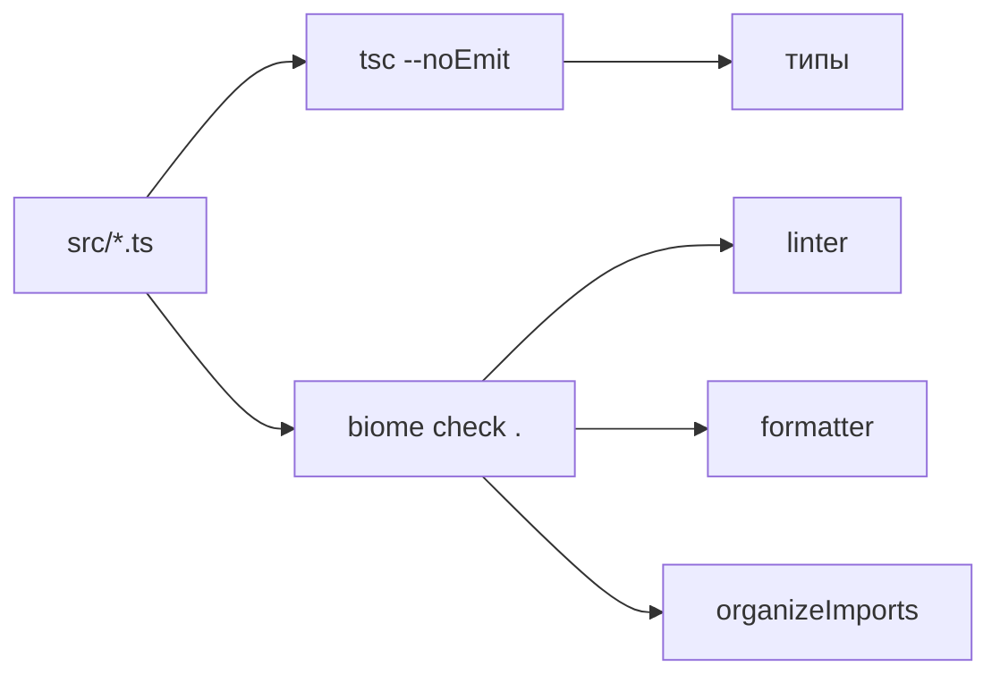

# Lint и format одним `biome check`

Скелет Telegram Bot — первый TypeScript-процесс в репозитории, и у него впервые появляется линтер. Этот файл объясняет, что делает Biome на строках среза и почему выбран он, а не ESLint. Устройство компонента и таблица toolchain — в [брифе](../../services/telegram-bot.md); модуль TypeScript — в [module-and-types.md](../typescript/module-and-types.md). Это не ADR: сравнение не меняет границу системы.

## Механика

### Один бинарник, три проверки

Biome — отдельная программа, не плагин TypeScript. Она читает `.ts` своим парсером и не вызывает `tsc`. Ближайший аналог в .NET — Roslyn analyzer плюс `.editorconfig`, но здесь lint, format и assist живут в одном бинарнике и одной команде.

`apps/telegram-bot/package.json` объявляет два скрипта:

```json
"lint": "biome check .",
"format": "biome format --write ."
```

`biome check` по своей справке «Checks the specified files for formatting, linting, and assist actions». Это не «только lint»: одна команда смотрит стиль, правила и автоправки вроде сортировки импортов. `--write` нет — в CI и в `just telegram-bot-lint` команда только сообщает, не переписывает файлы. `biome format --write .` — отдельный проход, когда формат нужно применить.

`npx biome --version` в этом пакете печатает `2.5.11`. Тот же номер стоит в `devDependencies` как `@biomejs/biome`.

### Конфиг — три независимых тумблера

`apps/telegram-bot/biome.json` включает три механизма отдельно:

```json
"linter": { "enabled": true, "rules": { "preset": "recommended" } },
"formatter": { "enabled": true, "indentStyle": "space", "indentWidth": 2 },
"assist": { "enabled": true, "actions": { "source": { "organizeImports": "on" } } }
```

**Linter** — правила. `preset: recommended` — готовый набор, не список правил вручную. **Formatter** — пробелы, кавычки, ширина строки. **Assist** — правки, которые не «ошибка стиля» и не «баг»: `organizeImports` переставляет `import`. В диффе клиента Identity Biome сам кладёт `type IdentityResolver` выше `toResolveIdentityInput`.

`files.includes` говорит, что проверять: `**`, и сразу вычитает `gen`, `dist`, `coverage`, `node_modules`. Сгенерированный Protobuf и emit `tsc` линтер не трогает — иначе каждое `buf generate` краснело бы на чужом коде. `vcs.useIgnoreFile` дополнительно читает `.gitignore`.

### Зачем это важно при TypeScript 7

`npx tsc --version` печатает `Version 7.0.2`. JS-модуль `typescript` из этого пакета отдаёт только `version` и `versionMajorMinor`. `createProgram` — `undefined`. Это и есть отсутствующий compiler API: программа, которая хотела спросить компилятор «какие типы у этого файла», больше не может сделать это через `import ts from "typescript"`.

ESLint с `@typescript-eslint` так и работает: поднимает программу TypeScript и читает типы. Без API этот путь закрыт. Dual-install `@typescript/typescript6` рядом с `tsc` 7 вернул бы API ценой двух компиляторов в одном пакете. Biome этот путь не использует: типы проверяет `npm run typecheck` (`tsc --noEmit`), стиль — `biome check .`.

### Спор с `noPropertyAccessFromIndexSignature`

`tsconfig.json` включает `noPropertyAccessFromIndexSignature`: `process.env.TELEGRAM_BOT_TOKEN` — ошибка TS4111, нужен индекс. Правило Biome `useLiteralKeys` предлагает обратное: `fields["error"]` упростить до `fields.error`. Это не баг одного из инструментов — разные модели доступа к индексированному типу.

Скелет обходит спор формой кода, а не выключением правила. `readEnv(name)` принимает строку и индексирует ею `process.env`. Поля лога в `LogFields` перечислены явно, без `Record<string, …>`: тогда и `tsc`, и Biome принимают точку. Общий приём: не спорь с двумя проверками, измени форму так, чтобы обе видели одно и то же.

### Перевод строки — часть формата

Biome форматирует переводом строки LF: в справке `--line-ending=<lf|crlf|cr|auto>` сказано «Defaults to `lf`», и CRLF для него такое же нарушение формата, как лишний пробел. На Windows это стреляет не в одном файле, а сразу во всех: `core.autocrlf=true` разворачивает LF из индекса в CRLF при чекауте, и `biome check .` отвечает «Found 19 errors» на 19 проверяемых файлах, где ни одна ошибка не про код. В индексе и на Linux-раннере CI те же файлы в порядке, поэтому расхождение видно только на локальной машине.

Лечится это не конфигом Biome, а `.gitattributes`:

```
*.ts text eol=lf
*.json text eol=lf
```

Правило `* text=auto` уже держит LF в индексе; `eol=lf` добавляет к нему рабочее дерево — файл выкладывается с LF независимо от `core.autocrlf` участника. Тот же приём в этом файле стоял для `*.go` из-за `gofmt`: Biome — второй инструмент репозитория с нормативным форматом, и цена ошибки у него та же.

Деталь, которая понадобится при следующем таком правиле: смена атрибута не переписывает уже выложенные файлы. Их приводят к LF отдельно, и после этого `git status` продолжает показывать их изменёнными, хотя `git hash-object` совпадает с блобом в индексе, а `git diff` пуст. Это устаревшая stat-информация в индексе; снимает её `git add --renormalize`.

## Урок

**Линт, которому нужны типы, привязан к compiler API.** Пока `tsc` 7 этот API не отдаёт, линтер либо парсит сам, либо тащит второй TypeScript. Следующий TypeScript-пакет в репозитории повторяет ту же развилку, пока 7.1 не вернёт API — тогда сравнение нужно сделать заново.

**Одна неинтерактивная команда закрывает gate.** `biome check .` без `--write` и без watch подходит агенту и CI так же, как `golangci-lint run`. Watch и apply — отдельные команды, не режим по умолчанию.

## Почему так, а не иначе

| Вариант | Цена |
|---|---|
| ESLint + `@typescript-eslint` | нужен JS compiler API. В TypeScript 7.0 его нет: `import ts from "typescript"` даёт только `version` |
| Dual-install `@typescript/typescript6` + `tsc` 7 | API вернётся, но в пакете два компилятора и два набора диагностик |
| ESLint + Prettier | lint и format — два демона, два конфига, два формата игнора. `biome check` закрывает оба |
| oxlint | быстрый lint, format всё равно нужен вторым инструментом |
| dprint / Prettier без линтера | формат есть, правила вроде `useLiteralKeys` и `organizeImports` — нет |
| `tsc` как линтер | `noEmit` ловит типы, не ловит кавычки, импорты и unused. В срезе typecheck и lint — разные скрипты намеренно |
| `lineEnding: "auto"` вместо `eol=lf` в `.gitattributes` | проверка перестанет падать, но формат станет зависеть от ОС автора: `biome format --write` на Windows перепишет весь пакет в CRLF, а нормализация индекса это спрячет. Лечится причина, а не симптом |
| `lineEnding: "crlf"` | тот же файл на Linux-раннере CI сразу станет неотформатированным |

Сравнение не тянет на ADR: граница Telegram Bot и выбор grammY уже в [ADR-030](../../decisions/ADR-030-telegram-bot.md). Здесь выбирается инструмент проверки файлов внутри уже принятого стека.

## Схема



`just telegram-bot-lint` и джоба `telegram-bot` в CI вызывают `npm run lint` → `biome check .`. Типы туда не входят: их проверяет соседний `npm run typecheck`.

## Первоисточники

- [Biome `check`](https://biomejs.dev/reference/cli/#biome-check) — одна команда на lint, format и assist; флаг `--write` включает правку.
- [Biome configuration](https://biomejs.dev/reference/configuration/) — `linter`, `formatter`, `assist`, `files.includes`.
- [TypeScript 7.0 announcement](https://devblogs.microsoft.com/typescript/announcing-typescript-7-0/) — нативный `tsc` и отсутствие compiler API в JS-модуле.
- [typescript-eslint typed linting](https://typescript-eslint.io/getting-started/typed-linting/) — зачем ESLint поднимает программу TypeScript.
- Скилл `.skillshare/skills/proj/proj-write-typescript/SKILL.md` — существующий lint/typecheck/test; ослабление типа рядом с местом.

## Проверь себя

- `npx biome --version` в `apps/telegram-bot` печатает `Version: 2.5.11`. Проверено.
- `npx biome check --help` начинается с «Checks the specified files for formatting, linting, and assist actions». Проверено.
- `npx biome check .` завершается кодом 0, «Checked 19 files», без `--write`. Проверено.
- `node --input-type=module -e "import ts from 'typescript'; console.log(Object.keys(ts))"` печатает `version, versionMajorMinor`; `createProgram` — `undefined`. Проверено.
- `npm run lint` в `package.json` — ровно `biome check .`. Проверено чтением манифеста.
- `npx biome check --help` про `--line-ending`: «Defaults to `lf`». Проверено.
- До `eol=lf` в `.gitattributes` `just telegram-bot-lint` на Windows давал «Found 19 errors» — по одной на каждый из 19 файлов, все про формат. После правила и приведения рабочего дерева к LF — «Checked 19 files», ошибок нет. Проверено на обоих состояниях.

Открытые вопросы, из-за которых статус «вернуться»:

- Когда появится compiler API у TypeScript 7.1, останется ли Biome единственным линтером или вернётся typescript-eslint?
