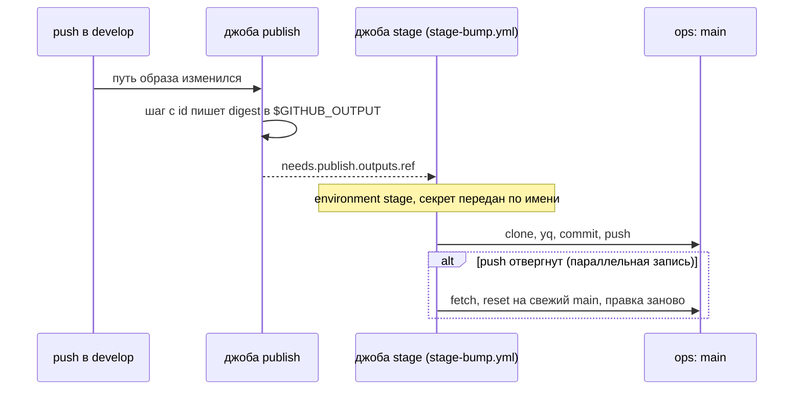

# GitHub Actions: reusable workflow, выходы, секреты environment и concurrency

Разбор объясняет, как CI репозитория после публикации образа или чарта сам пишет их в ops-репозиторий, и на каких механизмах GitHub Actions это держится. Опора:

- дифф PER-454 ([PR #371](https://github.com/Solguficky/solguficky-hub/pull/371)): `.github/workflows/stage-bump.yml`, джоба `stage` в `image-*.yml` и `chart-publish.yml`;
- два дефекта этого же среза, которые не видел ни гейт, ни разбор YAML: выход джобы ссылался на шаг без `id`, а секрет environment не доходил до reusable workflow;
- документация GitHub, сверенная при записи разбора, — цитаты ниже дословные.

Зачем вообще CI пишет в ops-репозиторий и как хост выкатывает записанное — [self-hosting/autodeploy.md](../self-hosting/autodeploy.md). Решение — дополнение [ADR-055](../../decisions/ADR-055-k3s-runtime-from-aspire-chart.md) от 2026-10-07.

## Механика

### Workflow, джоба, шаг

Workflow — YAML-файл в `.github/workflows/`, который GitHub запускает по событию: push, pull request, ручной запуск. Внутри — джобы. Каждая джоба получает свою чистую виртуальную машину (runner), и джобы по умолчанию идут параллельно. Внутри джобы — шаги, они идут по порядку на одной машине и делят её файловую систему.

Отсюда главное следствие: **между джобами нет общей памяти и общего диска**. Значение, которое одна джоба вычислила, другой джобе нужно передать явно — через выходы (ниже). Ближайший аналог из .NET — отдельные процессы: переменная одного не видна другому.

`needs` задаёт порядок и зависимость джоб. В `image-hub-bot.yml`:

```yaml
  stage:
    needs: publish
```

`stage` стартует только после успешной `publish`. Если `publish` пропущена условием `if` — например, на pull request, — пропускается и `stage`: отдельного условия ей не нужно.

### Выход: шаг → джоба → workflow

Значение поднимается по трём ступеням, и каждая называет предыдущую по имени.

1. **Шаг** пишет строку `имя=значение` в файл, путь к которому лежит в переменной `$GITHUB_OUTPUT`. Чтобы на шаг можно было сослаться, у него должен быть `id`. В `chart-publish.yml`:

   ```yaml
   - name: Упаковка
     id: package
     run: |
       echo "version=0.1.${{ github.run_number }}" >> "$GITHUB_OUTPUT"
   ```

2. **Джоба** объявляет выход выражением от выхода шага:

   ```yaml
   outputs:
     version: ${{ steps.package.outputs.version }}
   ```

3. **Следующая джоба** читает его через `needs`: `${{ needs.publish.outputs.version }}`.

Ловушка, которую срез поймал на себе: первая версия правки не добавила шагу `id: package`. Ссылка `steps.package.outputs.version` указывала в пустоту, и это **не ошибка**. Документация контекстов: «If you attempt to dereference a nonexistent property, it will evaluate to an empty string.» Выход молча становился пустой строкой, и упала бы только джоба записи — с текстом «пустое значение», уже после мержа. Ни `yaml.safe_load`, ни гейт этого не видят: файл синтаксически верен. В .NET аналог — чтение отсутствующего ключа словаря, который вместо `KeyNotFoundException` возвращает `""`.

### Reusable workflow и `workflow_call`

Шесть workflow публикации должны делать одно и то же: записать значение в ops-репозиторий. Вместо шести копий шага есть один файл `stage-bump.yml` с событием `workflow_call` — его можно вызвать из другого workflow как функцию:

```yaml
on:
  workflow_call:
    inputs:
      file:  { type: string, required: true }
      key:   { type: string, required: true }
      value: { type: string, required: true }
```

Вызов — это **джоба**, а не шаг: у неё нет `runs-on` и `steps`, вместо них `uses` и `with`.

```yaml
  stage:
    needs: publish
    uses: ./.github/workflows/stage-bump.yml
    with:
      file: stage/test/values.yaml
      key: .parameters.hub_bot.hub_bot_image
      value: ${{ needs.publish.outputs.ref }}
```

Аналогия — метод с параметрами. Отличие: «метод» исполняется на своей машине, а входы — только строки, числа и булевы значения, без объектов.

### Секреты environment в reusable workflow

Environment — именованная среда в настройках репозитория со своими секретами и правилами: например, «запускается только с ветки `develop`». Джоба попадает в environment строкой `environment: stage` и только тогда видит его секреты.

Интуиция подсказывает: раз джоба внутри reusable workflow объявила `environment: stage`, секрет придёт сам. Документация говорит иначе — дословно:

> To use an environment secret in a reusable workflow, set `environment` on the job in the reusable workflow.
> The caller workflow must still pass the secret. Use `secrets: inherit` or pass the secret by name, for example `MY_SECRET: ${{ secrets.MY_SECRET }}`.
> You can pass a secret by name even if it only exists in the environment.
> If the caller workflow doesn't pass an environment secret, the secret resolves to an empty string in the reusable workflow.

Нужны обе половины. Вызываемый объявляет `environment` на джобе и сам секрет в `on.workflow_call.secrets`, вызывающий передаёт его по имени:

```yaml
    secrets:
      OPS_DEPLOY_KEY: ${{ secrets.OPS_DEPLOY_KEY }}
```

Без передачи секрет — пустая строка, а не ошибка. Первая версия среза этого не делала и была бы красной на каждой публикации. Скрипт джобы проверяет пустоту первой строкой (`нет секрета OPS_DEPLOY_KEY`), поэтому отказ был бы громким. Но нашла дефект только сверка с документацией при записи этого разбора.

### `permissions: {}`

Каждой джобе GitHub выдаёт временный токен `GITHUB_TOKEN` с правами на свой репозиторий. `permissions: {}` на уровне workflow снимает все права. Каждая джоба потом просит ровно нужные: `publish` — `packages: write` для GHCR, `stage` — ничего. Джобе записи токен GitHub не нужен вовсе: в чужой ops-репозиторий она пишет своим deploy key, а `GITHUB_TOKEN` в другой репозиторий не пишет.

### `concurrency`: одна запущенная, одна ожидающая

`concurrency.group` — имя очереди: в одной группе одновременно идёт не больше одного прогона. Публикации образа так и устроены: `group: image-hub-bot-publish`. Тонкость в том, что происходит с очередью. Документация:

> By default, any existing `pending` job or workflow in the same concurrency group will be canceled and the new queued job or workflow will take its place.

То есть очередь длиной один. Пришли три прогона — первый идёт, второй ждёт, третий **отменяет второго**. Для публикации образа это правильно: нужен свежий образ, промежуточный не важен. Для записи в ops — нет: шесть публикаций одного мержа пишут **разные** ключи, и отменённая запись — потерянный digest. Поэтому `stage-bump.yml` сериализует запись не группой, а повтором: push отвергнут — клон сбрасывается на свежий `main`, правка ставится заново, до пяти попыток.

## Урок

- **Ссылка в выражении GitHub не проверяется.** Опечатка в `steps.<id>`, `needs.<job>` или имени секрета даёт пустую строку, а не ошибку. Всё, что получено выражением и важно, проверяется на пустоту в самом шаге — как `[ -n "$VALUE" ]` в `stage-bump.yml`. Механически такие ссылки сверяет линтер workflow; в репозитории его нет (наблюдение [2026-10-07-workflow-defect-outside-the-gate](../../development/observations/2026-10-07-workflow-defect-outside-the-gate.md)).
- **Граница reusable workflow закрыта по умолчанию.** Входы, секреты и выходы проходят её только объявленными: секрет не наследуется даже из environment, на который указывает сама вызванная джоба.
- **Группа `concurrency` — очередь из одного места.** Её берут, когда промежуточные прогоны не нужны: публикация, выкладка. Когда важен каждый — как запись разных ключей, — сериализуют иначе.

## Почему так, а не иначе

- **`workflow_run` вместо вызова.** Отдельный workflow «после завершения публикации» не потребовал бы правок шести файлов. Отвергнут по двум причинам. Документация: «This event will only trigger a workflow run if the workflow file exists on the default branch», а ветка по умолчанию здесь `main`, тогда как публикации идут из `develop`. И у такого запуска нет `needs.<job>.outputs` вызвавшего прогона: digest пришлось бы доставать заново.
- **Шаг записи в каждом workflow.** Шесть копий клонирования, `yq` и цикла повторов. Reusable workflow держит их в одном месте; цена — шесть одинаковых по форме вызовов (ось стандартов ревью назвала это запахом, отложено).
- **`secrets: inherit` вместо передачи по имени.** Короче, но reusable workflow получил бы все секреты репозитория. Передача по имени отдаёт ровно один ключ.
- **`concurrency` на джобе записи.** Отменял бы ожидающие записи разных ключей — см. выше.

## Схема



## Первоисточники

- [Reusing workflows](https://docs.github.com/en/actions/sharing-automations/reusing-workflows) — `workflow_call`, входы, выходы и раздел «Using inputs and secrets in a reusable workflow» с правилом про секреты environment.
- [Contexts](https://docs.github.com/en/actions/reference/workflows-and-actions/contexts) — `steps`, `needs`, `secrets` и правило «nonexistent property evaluates to an empty string».
- [Control the concurrency of workflows and jobs](https://docs.github.com/en/actions/writing-workflows/choosing-what-your-workflow-does/control-the-concurrency-of-workflows-and-jobs) — отмена ожидающего прогона и `cancel-in-progress`.
- [Events that trigger workflows](https://docs.github.com/en/actions/writing-workflows/choosing-when-your-workflow-runs/events-that-trigger-workflows) — `workflow_run` и требование файла на ветке по умолчанию.
- [Managing deploy keys](https://docs.github.com/en/authentication/connecting-to-github-with-ssh/managing-deploy-keys) — почему запись идёт deploy key, а не `GITHUB_TOKEN`.

## Проверь себя

Проверяется в Actions после мержа PR #371; до него — только чтением файлов.

1. **Что получит джоба записи, если убрать `id: package`?** Пустую строку и отказ «пустое значение для .version» в логе джобы `stage` прогона `Chart publish`. Проверь: `gh run view <id> --log | grep "пустое значение"` на прогоне с такой правкой.
2. **Видит ли reusable workflow секрет environment без передачи по имени?** Нет: в логе джобы `stage` строка `нет секрета OPS_DEPLOY_KEY в environment stage`. Проверь, убрав блок `secrets:` у одной из джоб `stage` в ветке и запустив workflow вручную.
3. **Что станет со вторым ожидающим прогоном в группе `image-hub-bot-publish`, если придёт третий?** Он будет отменён. Проверь: `gh run list --workflow image-hub-bot.yml --json conclusion,createdAt` после трёх быстрых мержей — у среднего `cancelled`.
4. **Почему джобе записи не нужен `GITHUB_TOKEN`?** Она пишет в другой репозиторий своим deploy key. Проверь: в `stage-bump.yml` нет ни `permissions` с правами, ни упоминания `github.token`.

Статус вопросов 1–3 — «проверь сам, когда будет чем»: живого прогона после мержа ещё не было.
