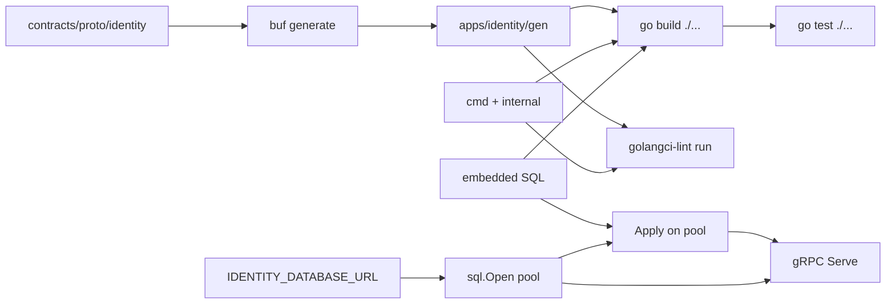
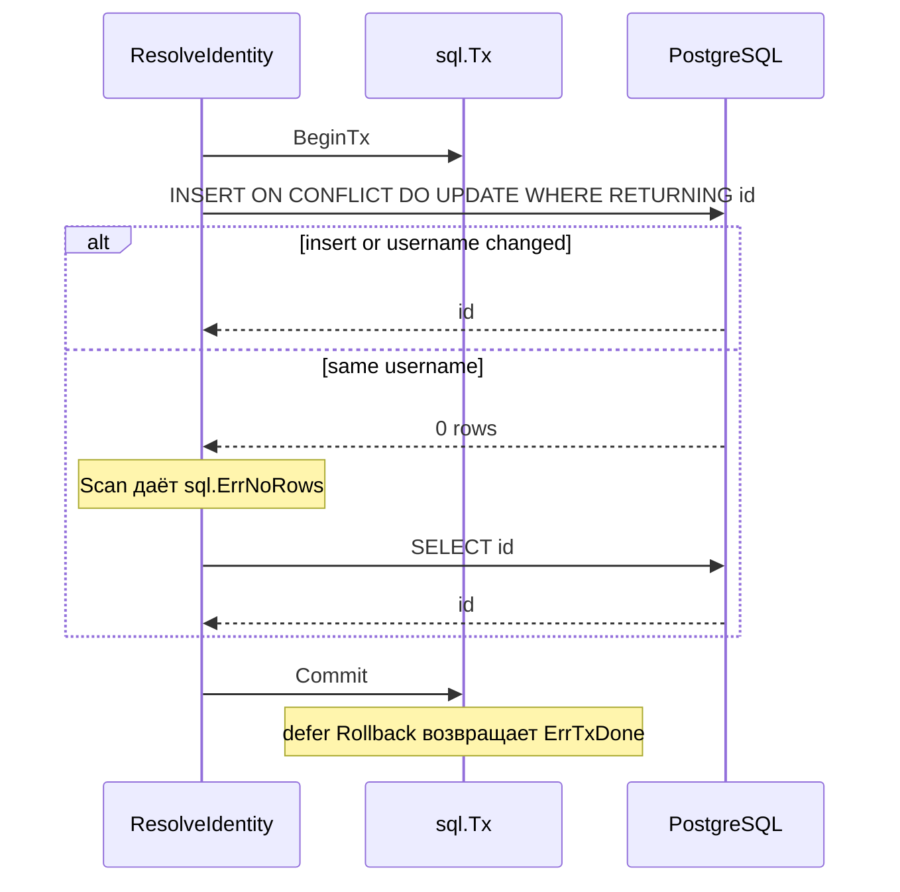

# Модуль Go-сервиса

Identity — первый исполняемый процесс на Go в репозитории: он слушает gRPC и пишет профиль в PostgreSQL. Файл объясняет, как устроен модуль Go, как язык собирает и запускает процесс и как процесс держит пул соединений на всё время жизни. Выбор языка здесь не разбирается — это [ADR-027](../../decisions/ADR-027-identity-go-stack.md); wire — [integration.md](../../architecture/integration.md); gRPC-сервер — [unary-server.md](../grpc/unary-server.md).

## Механика

### Модуль, пакет, каталог

Единица версионирования в Go — **модуль**: каталог с `go.mod`, где записаны имя, версия языка и зависимости. Ближайший аналог — проект с `.csproj`, но с одним отличием, которое сразу заметно: у модуля нет списка файлов. Компилятор берёт всё, что лежит в каталоге.

Единица компиляции — **пакет**, и это ровно один каталог. Все файлы каталога обязаны объявлять один и тот же `package`, а имя пакета не обязано совпадать с именем каталога. Импортируется каталог, а обращаются по имени пакета:

```go
import identityv1 "github.com/Solguficky/solguficky-hub/apps/identity/gen/identity/v1"
```

Здесь `identityv1` — явный псевдоним, потому что пакет внутри называется иначе, чем последний сегмент пути. Namespace как отдельной сущности в Go нет: путь импорта и есть адрес.

Видимость решается регистром первой буквы имени, а не ключевым словом. `ServiceName` виден снаружи пакета, `adminTelegramUserID` — нет. Ни `public`, ни `private` в языке не существует, и переименование буквы меняет контракт пакета. Поэтому «сделать неэкспортируемым» в диффе выглядит как правка регистра.

Каталог `internal/` — правило компилятора, а не договорённость: пакет внутри `internal/` импортируется только из поддерева, где лежит родитель `internal/`. `apps/identity/internal/server` недоступен ни из другого приложения, ни из чужого модуля, и это проверяется на сборке. Ближайшего аналога в .NET нет: `internal` там про сборку, а здесь про положение в дереве каталогов.

`cmd/identity` — конвенция, а не правило языка. Исполняемым пакет делает имя `package main` и функция `main()`. Каталог `cmd/` просто отделяет точки входа от библиотечного кода; при двух бинарниках это `cmd/a` и `cmd/b`.

### Сборка, зависимости и генерация

`go.mod` держит прямые зависимости, `go.sum` — контрольные суммы всего графа, включая транзитивные: это lock-файл, и он коммитится. Строка `go 1.27.0` — не «минимальная версия», а язык, по правилам которого компилируется модуль; она же включает или выключает новые конструкции.

Версии выбираются алгоритмом **minimal version selection**: если два модуля просят разные версии общей зависимости, берётся не последняя, а старшая из запрошенных. Обновление — всегда явное действие, не побочный эффект сборки.

Инструменты сборки объявляются директивой `tool` в `go.mod`:

```
tool (
	google.golang.org/grpc/cmd/protoc-gen-go-grpc
	google.golang.org/protobuf/cmd/protoc-gen-go
)
```

Она появилась в Go 1.24 и заменила приём с файлом `tools.go` под тегом `//go:build tools` — раньше кодогенераторы приходилось «удерживать» в графе зависимостей пустыми импортами, иначе `go mod tidy` их выкидывал. `go install tool` ставит всё перечисленное одной командой; отсюда одна строка в `justfile` вместо списка пакетов.

Контракт генерируется из `contracts/proto/` в `apps/identity/gen/` и в Git не лежит: `apps/identity/.gitignore` игнорирует каталог, а сборка начинается с `buf generate`. Генератор запускает не `protoc`, а `buf` — он держит конфигурацию в `buf.gen.yaml`, сам разрешает пути импорта и вызывает плагины `protoc-gen-go` и `protoc-gen-go-grpc`, найденные в `PATH`.

Форматирование в Go нормативно, а не на вкус: `gofmt` и строгий `gofumpt` считают отклонение ошибкой, и перевод строки в это отклонение входит. Поэтому `.gitattributes` держит `*.go` в `eol=lf` — иначе при `core.autocrlf=true` рабочее дерево Windows получает CRLF, и `just identity-lint` падает на каждом файле, хотя в индексе и на Linux-раннере тот же файл отформатирован верно.

### Процесс: горутины, каналы, select

`main` вызывает `os.Exit(run())`, и вся работа живёт в `run`. Причина в языке: `os.Exit` завершает процесс немедленно и **не выполняет отложенные вызовы**. `defer` регистрирует вызов на выход из функции — аналог `finally`, но привязанный к функции, а не к блоку. Поэтому `defer stop()` стоит внутри `run`, а `os.Exit` снаружи; линтер `gocritic` ловит нарушение правилом `exitAfterDefer`.

**Горутина** — функция, запущенная словом `go`: очень дешёвый поток, которым управляет рантайм Go, а не ОС. Сервер слушает сокет в отдельной горутине, потому что `Serve` блокируется до остановки:

```go
errCh := make(chan error, 1)
go func() {
	errCh <- srv.Serve(lis)
}()
```

**Канал** — типизированная очередь, через которую горутины обмениваются значениями. `make(chan error, 1)` создаёт буфер на один элемент: пишущая горутина не заблокируется, даже если её результат никто не читает. Без буфера горутина повисла бы навсегда в ветке, где `run` возвращается, не дочитав канал, — это классическая утечка горутины.

`select` ждёт первое готовое из нескольких канальных событий:

```go
select {
case <-ctx.Done():
	// пришёл сигнал
case serveErr := <-errCh:
	// сервер упал сам
}
```

Важная деталь, из-за которой в этом срезе был дефект: **если готовы сразу оба case, выбор псевдослучаен**. Не «по порядку» и не «первый объявленный». Значит на ветке сигнала обязательно дочитать `errCh`, иначе отказ листенера, совпавший с `SIGTERM`, потеряется, и процесс отчитается кодом 0.

`context.Context` переносит сигнал отмены и дедлайн через границы вызовов. `signal.NotifyContext` делает контекст, который отменяется по `SIGINT`/`SIGTERM`; `<-ctx.Done()` — это чтение из канала, который закрывается при отмене. Закрытый канал всегда готов к чтению — на этом и держится `select`. Аналог `CancellationToken`, но передаётся первым параметром явно, а не через свойство.

Слушать сокет сервис начинает через `net.ListenConfig.Listen` с тем же `ctx`, а не через `net.Listen`, потому что линтер `noctx` отвергает вызов без контекста. Больше эта замена ничего не даёт: по [документации](https://pkg.go.dev/net#ListenConfig.Listen) `ctx` влияет только на резолв адреса и на уже созданный `Listener` не действует; закрывает сокет `GracefulStop`/`Stop`.

### Ошибки

В Go нет исключений для потока управления. Функция возвращает ошибку последним значением, и вызывающий обязан её проверить — линтер `errcheck` валит сборку за молчаливое игнорирование. Ошибка — это интерфейс с единственным методом `Error() string`, поэтому «своя ошибка» означает свой тип, а не наследование.

Ошибки заворачивают одну в другую и разбирают функциями `errors.Is` (сравнение с известным значением) и `errors.As` (извлечение конкретного типа). В `main.go` это выглядит так:

```go
func serveDone(err error) bool {
	return err == nil || errors.Is(err, grpc.ErrServerStopped)
}
```

`errors.Is` нужен вместо `==`, потому что ошибка могла быть обёрнута по дороге и перестала быть тем же значением.

`panic`/`recover` — не замена исключениям. Паника разматывает стек и роняет процесс; `recover` внутри `defer` её перехватывает. Применяется на границе, где отказ одного вызова не должен убивать сервис, — как в gRPC-интерцепторе, см. [unary-server.md](../grpc/unary-server.md).

### Логирование

Логгер процесса — `log/slog` из стандартной библиотеки, с `JSONHandler` на stdout. Уровень читается из `IDENTITY_LOG_LEVEL` (`debug` | `info` | `warn` | `error`), по умолчанию `Info`. Сообщение — короткая фраза, значения — поля. Успешный RPC пишется через `DebugContext`, поэтому на `Info` его нет, а `IDENTITY_LOG_LEVEL=debug` включает журнал доступа без пересборки. Ожидаемый отказ входа — `Warn`. Это семантика [logging.md](../../standards/observability/logging.md), а не выбор библиотеки: стандарт не требует конкретного пакета.

### Встроенные файлы и миграции

SQL-миграции — обычные файлы рядом с пакетом `internal/migrations`. Компилятор кладёт их внутрь бинарника директивой `//go:embed *.sql`: отдельного тома и `goose -dir` на машине разработчика нет. Это ближе к `EmbeddedResource` в .NET, чем к копированию `appsettings.json` рядом с exe.

При старте `main` сначала применяет миграции, потом слушает порт. Повторный старт на той же базе — успех без ошибки: goose сравнивает таблицу `goose_db_version` с файлами и ничего не делает, если версия уже текущая. Строка подключения читается из `IDENTITY_DATABASE_URL` и в лог не попадает — [logging.md](../../standards/observability/logging.md) запрещает connection strings.

Провайдер goose создаётся на каждый вызов `Apply`, а не глобальной настройкой `SetBaseFS`. Глобальное состояние сломалось бы на параллельных тестах, которые поднимают разные базы. Session lock (`pg_advisory_lock`) сериализует два процесса, которые одновременно стартуют на пустой базе.

Уже применённый файл миграции нельзя править: goose считает хеш SQL и откажется, если `00001` изменится после записи в `goose_db_version`. Новая колонка — новый файл `00002`, даже если в базе ещё нет живых строк.

### Пул `database/sql` и транзакция

`database/sql` — стандартная библиотека, не драйвер. `*sql.DB` — **пул** соединений, безопасный для горутин: его открывают один раз на процесс и передают туда, где нужны запросы. Это ближе к пулу ADO.NET / `NpgsqlDataSource`, чем к одному `SqlConnection` на вызов. `sql.Open` драйвер даже не обязан коннектиться: проверка — `Ping`. Без живого пула слушать gRPC бессмысленно, поэтому `openStore` зовёт `Open` и `Apply` до `Listen`, а `defer db.Close()` стоит в `run` и срабатывает после остановки сервера.

Драйвер регистрируется **пустым импортом** — побочным эффектом `init()` пакета:

```go
_ "github.com/jackc/pgx/v5/stdlib"
```

Имя `"pgx"` в `sql.Open("pgx", dsn)` — строка из этой регистрации, а не из пути импорта. Без строки `_` `Open` отвечает `sql: unknown driver "pgx" (forgotten import?)`. В .NET провайдер подтягивается пакетом и фабрикой; здесь его не видно в типах вызывающего кода, только в импорте с подчёркиванием.

Транзакция (`BeginTx`) занимает **одно** соединение из пула до `Commit` или `Rollback`. Идиома такая:

```go
tx, err := s.db.BeginTx(ctx, nil)
if err != nil { ... }
defer func() { _ = tx.Rollback() }()
// ... запросы ...
if err := tx.Commit(); err != nil { ... }
```

`defer Rollback` срабатывает и на успехе. Это не ошибка: после `Commit` `Rollback` возвращает `sql.ErrTxDone` («transaction has already been committed or rolled back»), и её глотают. Аналог `await using` транзакции — только откат здесь безопасен на счастливой ветке, потому что повторный вызов после commit не ломает уже зафиксированное.

### `QueryRow` и пустой `RETURNING`

`QueryRowContext` + `Scan` — запрос ровно одной строки. Если строк нет, `Scan` возвращает `sql.ErrNoRows`. Это значение, а не «сломалось»: его разбирают `errors.Is`, как `grpc.ErrServerStopped` выше.

PostgreSQL `INSERT ... ON CONFLICT DO UPDATE WHERE ... RETURNING id` возвращает строку только если insert или update **реально произошёл**. Если конфликт есть, а `WHERE` ложно (ник тот же), команда успешна, затронуто 0 строк, `RETURNING` пуст. Документация PostgreSQL 16 говорит это прямо: «Only rows that were successfully inserted or updated will be returned». Для `database/sql` пустой `RETURNING` — тот же `ErrNoRows`, что и у `SELECT` без совпадения. Поэтому после upsert код сначала принимает id из `RETURNING`, а `ErrNoRows` означает «строка уже есть и её не трогали» — тогда id читается обычным `SELECT` в той же транзакции.

`now()` внутри транзакции — время её **начала**, не стенные часы. Два вызова `now()` в одном `BEGIN` с паузой 50 мс вернули один и тот же timestamp; `clock_timestamp()` за это время сдвинулся. Отсюда `updated_at = now()` в `DO UPDATE` не поможет отличить «апдейт в этой же транзакции» от «не было апдейта»: метка меняется только в другой транзакции, то есть в другом RPC.

`uuid.NewV7()` из `github.com/google/uuid` — генерация RFC 9562 в процессе, не в базе. В стандартной библиотеке Go типа UUID нет; `uuidv7()` появляется в PostgreSQL 18, а схема в срезе — 16. `id.String()` даёт каноническую lowercase-форму с дефисами, которую требует [ADR-020](../../decisions/ADR-020-uuidv7-identifiers.md); `Parse` принимает и верхний регистр, но `String()` снова приводит к нижнему. Nibble версии в сгенерированном значении — 7.

`rows.Next()` / `Scan` / `rows.Err()` — курсор. `Next` возвращает false и на конце набора, и на ошибке чтения; отличить их можно только вызовом `Err()` после цикла. `Close` в `defer` обязателен, иначе соединение не вернётся в пул.

## Урок

Следующие механизмы переносятся дальше и не зависят от Go.

**Границу видимости лучше проверять сборкой, чем договорённостью.** `internal/` даёт то, чего не даёт соглашение об именах: случайный импорт из соседнего приложения не проходит компиляцию. Когда в репозитории появится второй Go-сервис, эта граница уже стоит и ничего не стоит.

**Порядок завершения процесса — часть контракта с оркестратором.** Код возврата читает не человек, а Kubernetes или systemd. Любая ветка, в которой ошибка не доезжает до кода возврата, превращает отказ в «успешное завершение» и молча ломает рестарт-политику. Отсюда правило: у каждой ветки выхода есть свой код, и ни одна не игнорирует уже полученный результат.

**Схема применяется тем же процессом, который ей пользуется.** Отдельная CLI-команда миграций забывается в CI и в локальном запуске. Старт без базы — отказ с кодом 1, а не «поднимем сервер, схему потом».

**Генерируемый код не хранится в Git, но обязан быть предусловием каждой команды.** Здесь это выражено зависимостями: `identity-build`, `identity-test` и `identity-lint` зависят от `identity-proto`. Иначе первая же чистая копия репозитория не собирается, и разница между «у меня работает» и CI объясняется состоянием рабочего дерева.

**Пустой результат успешной команды — не ошибка хранения.** `RETURNING` без строк и `SELECT` без совпадения для `QueryRow` выглядят одинаково: `ErrNoRows`. Смысл различает вызывающий: здесь это «апдейт не понадобился», не «профиля нет». Сваливать оба случая в `Internal` — значит превратить идемпотентный повтор в отказ.

**Пул открывают на процесс, транзакцию — на операцию.** `*sql.DB` живёт от старта до остановки; `*sql.Tx` — от `BeginTx` до `Commit`. Открыть пул на каждый RPC — потерять пул; держать транзакцию на весь процесс — держать одно соединение занятым.

## Почему так, а не иначе

| Вариант | Цена |
|---|---|
| Плоский пакет в корне модуля | `main` и тесты смешиваются с сервером; `internal/` отрезает случайный импорт из соседнего приложения |
| zap / zerolog | лишняя зависимость; стандарт просит семантику полей, не конкретный sink. `slog` в стандартной библиотеке с Go 1.21 |
| `net.Listen` | короче, но `noctx` падает. Отмена `ctx` слушателя всё равно не касается: он влияет только на резолв адреса |
| `os.Exit` прямо в `run` после `defer` | `gocritic` `exitAfterDefer`: отложенные `stop()` не выполнятся |
| Небуферизованный `errCh` | горутина `Serve` навсегда блокируется на отправке, если `run` вышел по сигналу и не дочитал канал |
| Не читать `errCh` после `GracefulStop` | отказ листенера, совпавший с сигналом, теряется: при двух готовых case `select` выбирает ветку псевдослучайно |
| `tools.go` с `//go:build tools` | приём до Go 1.24; директива `tool` в `go.mod` делает то же явно, а `go install tool` ставит всё одной командой |
| Только `go vet` в CI | не ловит `slog`/`noctx`/`protogetter`; задача просила линт, не минимальный vet |
| Коммитить `gen/` | ломает правило ADR-027 и [protobuf.md](../../standards/contracts/protobuf.md): generated — не источник правды |
| `golang-migrate` вместо goose | `Up()` без контекста; линтер `noctx` отвергает. У goose есть `Provider.Up(ctx)` |
| Глобальные `goose.SetBaseFS` / `SetDialect` | гонка между параллельными тестами на разных базах |
| goose Provider без session lock | два процесса на пустой базе: один `CREATE TABLE` проходит, второй падает с `already exists` |
| Применять миграции отдельной CLI | `just identity-run` и интеграционные тесты расходятся; задача требовала оба пути |
| Слушать порт, если базы нет | `ResolveIdentity` пишет в PostgreSQL; отказ конфигурации должен быть виден оркестратору |
| Править уже применённый `00001` | goose хранит хеш файла; повторный старт падает на checksum mismatch. Новая колонка — `00002` |
| `uuidv7()` в SQL | появляется в PostgreSQL 18; в срезе 16. Генерация остаётся в процессе |
| `ApplyDSN` и слушать | `ApplyDSN` закрывает пул после миграций; RPC нечем писать. Нужны `Open` + `Apply` на том же `*sql.DB` |
| Нативный `pgx.Pool` вместо `database/sql` | быстрее и с типизированными аргументами, но второй API рядом с goose, который уже говорит через `*sql.DB` |
| `SELECT` + `INSERT` без `ON CONFLICT` | гонка двух одновременных вставок даёт unique_violation второму; upsert атомарно выбирает insert или update |

## Схема



`just identity-build`, `identity-test` и `identity-lint` все зависят от `identity-proto`. Без `gen/` пакет `internal/server` не компилируется.

Путь одного `ResolveIdentity` внутри уже открытого пула:



## Первоисточники

- [Go modules reference](https://go.dev/ref/mod) — `go.mod`, `go.sum`, minimal version selection и директива `tool`.
- [Effective Go: package names](https://go.dev/doc/effective_go#package-names) — почему имя пакета не обязано совпадать с каталогом.
- [`internal` packages](https://go.dev/doc/go1.4#internalpackages) — правило видимости, которое проверяет компилятор.
- [Go spec: select](https://go.dev/ref/spec#Select_statements) — «uniform pseudo-random selection», из-за которого нужен дочитанный `errCh`.
- [`log/slog`](https://pkg.go.dev/log/slog) — JSON-поля, уровни, `*Context`.
- [`net.ListenConfig`](https://pkg.go.dev/net#ListenConfig) — что `ctx` делает и чего не делает.
- [golangci-lint configuration](https://golangci-lint.run/docs/configuration/file/) — формат v2, которым написан `apps/identity/.golangci.yml`.
- Скилл `.skillshare/skills/golang/golang-lint/SKILL.md` — из него взят состав линтеров в `.golangci.yml`; `golang-project-layout/SKILL.md` — раскладка `cmd`/`internal`; `golang-modernize/SKILL.md` — замена `tools.go` на директиву `tool`.
- [`embed`](https://pkg.go.dev/embed) — как SQL попадает в бинарник.
- [goose Provider](https://github.com/pressly/goose) — `NewProvider` + `Up(ctx)` вместо глобального `SetBaseFS`.
- [`database/sql`](https://pkg.go.dev/database/sql) — `DB` как пул, `Open` без коннекта, `Tx` на одно соединение, `ErrNoRows` и `ErrTxDone`.
- [PostgreSQL 16: `INSERT ... ON CONFLICT`](https://www.postgresql.org/docs/16/sql-insert.html) — `excluded`, `WHERE` у `DO UPDATE`, пустой `RETURNING`, если строка не вставлена и не обновлена.
- [`uuid.NewV7`](https://pkg.go.dev/github.com/google/uuid#NewV7) — RFC 9562 в процессе; каноническая форма — `String()`.

## Проверь себя

- `just identity-proto && ls apps/identity/gen/identity/v1/` даёт `identity_service.pb.go` и `identity_service_grpc.pb.go`. Проверено.
- `go list -f '{{.Name}} {{.GoFiles}}' .` в корне модуля не показывает пакета без файлов. Проверено: раньше там жил `identity` с пустым `GoFiles` — пакет существовал только из-за внешнего тестового файла.
- `go install tool` ставит оба плагина в `GOPATH/bin`. Проверено: появились `protoc-gen-go.exe` и `protoc-gen-go-grpc.exe`.
- `cd apps/identity && go run` маленькой программы с `JSONHandler` и `LevelInfo`: `Info` и `Warn` печатают JSON с ключами `time`, `level`, `msg`; `Debug` молчит. Проверено.
- `golangci-lint version` на закреплённой 2.13.2, собранной `go1.27.0`, проходит `golangci-lint run ./...` в модуле. Проверено. 2.6.0 на том же `go.mod` падала с ошибкой версии export data.
- `go test -race ./...` локально не запускается: `-race requires cgo`, а `gcc` в `PATH` нет. Проверено — поэтому детектор гонок стоит шагом в CI, а не в `just identity-test`.
- `IDENTITY_DATABASE_URL` пустой → процесс пишет `store setup failed` и выходит с кодом 1. Проверено `go run ./cmd/identity`.
- Повторный `Apply` на той же базе не падает на goose. Проверено: после двух `Apply` `goose_db_version` остаётся на version 2 — файлы `00001` и `00002`.
- `sql.Open("pgx", dsn)` без `_ "github.com/jackc/pgx/v5/stdlib"` → `sql: unknown driver "pgx" (forgotten import?)`. Проверено `go run`.
- `tx.Commit()` затем `tx.Rollback()` → `sql.ErrTxDone`. Проверено.
- Повторный `INSERT ... ON CONFLICT DO UPDATE WHERE username IS DISTINCT FROM excluded.username RETURNING id` с тем же ником: psql печатает 0 строк, `QueryRow.Scan` даёт `sql.ErrNoRows`. Смена ника возвращает тот же `id`. Проверено на PostgreSQL 16.
- `BEGIN; SELECT now(); SELECT pg_sleep(0.05); SELECT now();` — оба `now()` равны; `clock_timestamp()` больше. Проверено.
- `uuid.NewV7().String()` — lowercase, `Version() == 7`; `Parse` верхнего регистра снова печатает lowercase. Проверено `go run`.
