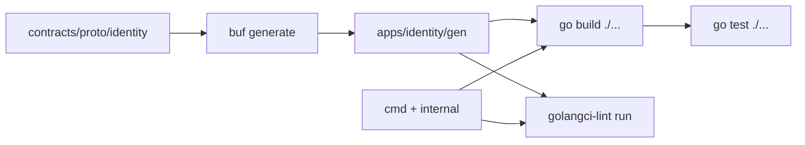

# Модуль Go-сервиса

Первый исполняемый процесс на Go в репозитории — скелет Identity. Этот файл объясняет раскладку модуля, лог и контур сборки. Контракт и выбор языка здесь не разбираются: язык — [ADR-027](../../decisions/ADR-027-identity-go-stack.md), wire — [integration.md](../../architecture/integration.md), gRPC-сервер — [unary-server.md](../grpc/unary-server.md).

## Что появилось и зачем

Модуль `github.com/Solguficky/solguficky-hub/apps/identity` остаётся одним. Точка входа — `cmd/identity`: флаги и сигналы, затем `server.New`. Обработчики живут в `internal/server`, снаружи модуля их импортировать нельзя. Сгенерированный контракт по-прежнему в `gen/` и в Git не лежит: `apps/identity/.gitignore` игнорирует каталог, сборка сначала вызывает `buf generate`.

Логгер процесса — `log/slog` с `JSONHandler` на stdout. Уровень читается из `IDENTITY_LOG_LEVEL` (`debug` | `info` | `warn` | `error`), по умолчанию `Info`. Сообщение — короткая фраза, значения — поля. Успешный RPC пишется через `DebugContext`, поэтому на `Info` его нет, а `IDENTITY_LOG_LEVEL=debug` включает журнал доступа без пересборки. Ожидаемый отказ входа — `Warn`. Это семантика [logging.md](../../standards/observability/logging.md), не выбор библиотеки: стандарт не требует конкретный пакет.

`main` вызывает `os.Exit(run())`. `defer` стоит внутри `run`: иначе `os.Exit` оборвал бы `signal.NotifyContext`. Слушать сокет сервис начинает через `net.ListenConfig.Listen` с тем же `ctx`, а не через `net.Listen`: линтер `noctx` в `.golangci.yml` отвергает вызов без контекста. Это единственная причина: `ctx` здесь используется при резолве адреса и на возвращённый `Listener` не влияет.

Версия языка в `go.mod` — `1.27.0`. `golangci-lint` 2.6.0, собранный более старым toolchain, отказывался анализировать модуль. В `justfile` закреплена `2.13.2`; CI ставит её через `golangci-lint-action` с `install-mode: goinstall`, локально — `just identity-lint-tools`, чтобы бинарник собрался тем же Go, что и сервис. `identity-lint` сверяет `golangci-lint version --short` с закреплённой версией и отказывается работать на другой.

`.gitattributes` держит `*.go` в `eol=lf`. При `core.autocrlf=true` рабочее дерево Windows иначе получает CRLF, и `gofumpt` считает нарушением формата каждый файл, хотя в индексе и на Linux-раннере тот же файл в порядке.

## Почему так, а не иначе

| Вариант | Цена |
|---|---|
| Плоский пакет в корне модуля | `main` и тесты контракта смешиваются с сервером; `internal/` отрезает случайный импорт из соседнего приложения |
| zap / zerolog | лишняя зависимость; стандарт просит семантику полей, не конкретный sink. `slog` в стандартной библиотеке с Go 1.21 |
| `net.Listen` | короче, но `noctx` падает. Отмена `ctx` слушателя всё равно не касается: по [документации](https://pkg.go.dev/net#ListenConfig.Listen) он влияет только на резолв адреса, а сокет закрывает `GracefulStop`/`Stop` |
| `os.Exit` прямо в `run` после `defer` | `gocritic` `exitAfterDefer`: отложенные `stop()` не выполнятся |
| Только `go vet` в CI | не ловит `slog`/`noctx`/`protogetter`; задача просила линт, не минимальный vet |
| Коммитить `gen/` | ломает правило ADR-027 и [protobuf.md](../../standards/contracts/protobuf.md): generated — не источник правды |

## Схема

`just identity-build`, `identity-test` и `identity-lint` все зависят от `identity-proto`. Без `gen/` пакет `internal/server` не компилируется.

## Первоисточники

- [Go modules reference](https://go.dev/ref/mod) — строка `go` в `go.mod` и toolchain.
- [`log/slog`](https://pkg.go.dev/log/slog) — JSON-поля, уровни, `*Context`.
- [`net.ListenConfig`](https://pkg.go.dev/net#ListenConfig) — `Listen` с `context`.
- [golangci-lint configuration](https://golangci-lint.run/docs/configuration/file/) — формат v2, которым написан `apps/identity/.golangci.yml`.

## Проверь себя

- `just identity-proto && ls apps/identity/gen/identity/v1/` даёт `identity_service.pb.go` и `identity_service_grpc.pb.go`. Проверено.
- `cd apps/identity && go run` маленькой программы с `JSONHandler` и `LevelInfo`: `Info` и `Warn` печатают JSON с ключами `time`, `level`, `msg`; `Debug` молчит. Проверено.
- `golangci-lint version` на закреплённой 2.13.2, собранной `go1.27.0`, проходит `golangci-lint run ./...` в модуле. Проверено. 2.6.0 на том же `go.mod` падала с ошибкой версии export data.
- `kill -TERM` по pid `just identity-run` и выход без `serve failed` — проверь сам, когда будет чем: живой процесс в этой сессии не останавливал.
