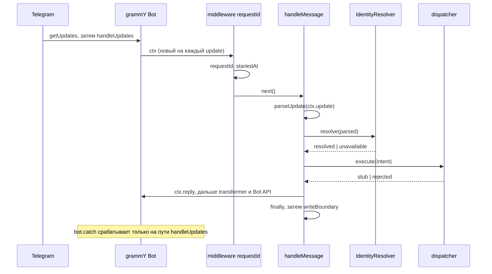

# Адаптер grammY

grammY — библиотека для Telegram Bot API поверх Node. В этом репозитории она держит единственную границу, на которую приходит человек: `apps/telegram-bot/src/presentation/`. Файл объясняет, как поток update от Telegram превращается в вызов кода, где у библиотеки швы для тестов и наблюдаемости и почему обработчик ловит свои отказы сам.

Язык, типы и клиент Identity — [typescript/module-and-types.md](../typescript/module-and-types.md); чем и как это проверяется — [typescript/testing.md](../typescript/testing.md); состав полей записи — [standard: логирование](../../standards/observability/logging.md); границы компонента — [бриф](../../services/telegram-bot.md) и [ADR-030](../../decisions/ADR-030-telegram-bot.md).

## Механика

### Bot — цепочка middleware, а не набор событий

```ts
const bot = new Bot<UpdateContext>(runtime.token);
bot.use((ctx, next) => {
  ctx.requestId = randomUUID();
  ctx.startedAt = process.hrtime.bigint();
  return next();
});
bot.on("message", (ctx) => handleMessage(ctx, runtime));
```

`bot.use` регистрирует функцию вида `(ctx, next)`. Это та же конструкция, что middleware в ASP.NET Core: `next` — продолжение цепочки, и позвать его решает сама функция. Отличия два. Первое: `next()` возвращает Promise, и его надо вернуть или дождаться, иначе следующее звено пойдёт исполняться параллельно с текущим. Второе: молчание вместо ошибки. Middleware, не позвавшая `next`, останавливает обработку update без единого сообщения — проверено экспериментом: `bot.on("message")` после такой middleware не вызывается ни разу.

Обработчик здесь один и зарегистрирован последним, поэтому `handleMessage` не получает `next` и цепочку не продолжает: за ним ничего нет.

### Контекст живёт один update и расширяется типом

Внутри `handleUpdate` grammY делает `new this.ContextConstructor(update, api, this.me)` — свежий объект на каждый update. Поэтому поле, дописанное в `ctx`, исчезает вместе с обработкой, и убирать его не надо.

Расширение объявляется типом и передаётся в конструктор бота:

```ts
type UpdateContext = Context & {
  requestId: string;
  startedAt: bigint;
};

const bot = new Bot<UpdateContext>(runtime.token);
```

grammY называет это **context flavor**. Ближайший аналог в .NET — `HttpContext.Items`: словарь на запрос. Отличие в том, что `Items` типизирован как `object` и каждое чтение из него — приведение типа в рантайме, а флейвор виден компилятору: `ctx.requestId` — обычное поле со своим типом, и опечатка в имени не соберётся.

Цена этой типизации формулируется честно: тип утверждает «поле есть», а заполняет его первая middleware. До неё поля нет, и компилятор об этом не знает. Ниже это отдельный открытый вопрос.

### `bot.on("message")` — предикат, а не подписка

В `composer.js` метод разворачивается в одну строку:

```js
on(filter, ...middleware) {
    return this.filter(Context.has.filterQuery(filter), ...middleware);
}
```

То есть фильтр — та же middleware, которая пропускает дальше только при истинном предикате. Строка `"message"` — не имя события, а выражение на языке filter queries: `"message:text"`, `"message:photo"`, `"message:entities:mention"` сужают тот же поток. Проверено: update `{ update_id: 2 }` без поля `message` до обработчика не доходит.

Скелет намеренно берёт весь `message`, а не `bot.command("start")`: разбор того, что пришло, живёт в `parseUpdate` и Zod-схеме, а не в фильтрах библиотеки.

### Два входа для update, и `bot.catch` подключён только к одному

Это главное место файла: от него зависит и форма кода, и то, что вообще может проверить тест.

- `bot.handleUpdate(update)` — один update. Прогоняет цепочку, а если та бросила, заворачивает причину в `BotError { error, ctx }` и **бросает наружу**.
- `bot.handleUpdates(updates)` — батч. Ловит `BotError` и передаёт его функции, зарегистрированной через `bot.catch`.

Long polling зовёт второе. Проверено экспериментом на голом боте: `handleUpdate` отвергает Promise ошибкой `BotError`, а зарегистрированный `bot.catch` не вызывается ни разу; `handleUpdates([update])` на том же боте вызывает его ровно один раз и приносит и ошибку, и контекст.

Отсюда форма `handleMessage`: он ловит свои отказы сам, а запись границы пишется в `finally`.

```ts
} catch (cause) {
    outcome = unexpectedOutcome(cause);
} finally {
    if (outcome !== undefined) {
      writeBoundary(runtime.logger, ctx, outcome);
    }
}
```

`bot.catch` остаётся вторым уровнем — для отказа, случившегося вне этой функции: в middleware с `randomUUID`, в самой библиотеке, в фильтре. Первым уровнем он быть не может: до него не доходит `handleUpdate`, а ответ человеку «недоступно» и категория отказа рождаются внутри сценария, а не в глобальном обработчике.

### Transformer — шов на исходящих вызовах

`ctx.reply(text)` в итоге зовёт `sendMessage` по HTTP. Тесту в сеть нельзя, и шов для этого предусмотрен самой библиотекой:

```ts
const recorder: Transformer = (_prev, method, payload) => {
  calls.push(recordCall(method, payload));
  return Promise.resolve({ ok: true, result: true as never });
};
bot.api.config.use(recorder);
```

Тип из `core/client.d.ts`:

```ts
type Transformer = <M extends Methods<R>>(
  prev: ApiCallFn<R>, method: M, payload: Payload<M, R>, signal?: AbortSignal,
) => Promise<ApiResponse<ApiCallResult<M, R>>>;
```

Это middleware для исходящих вызовов, симметричная входящей цепочке: `prev` — следующее звено, и не позвать его значит ответить самому. Работает подмена потому, что `handleUpdate` создаёт для каждого update новый объект `Api` и копирует в него `installedTransformers` из `bot.api.config`: transformer, поставленный на бота, оказывается и в `ctx.api`.

Без него тест ушёл бы в интернет. Проверено: тот же обработчик без transformer отвечает `GrammyError: Call to 'sendMessage' failed! (401: Unauthorized)` — то есть реально сходил в `api.telegram.org` и получил отказ по токену.

Аналог в .NET — не мок интерфейса, а `DelegatingHandler` в цепочке `HttpMessageHandler`. Отличие в уровне: transformer видит имя метода Bot API и типизированный payload, поэтому ассерт пишется про `sendMessage` и `text`, а не про URL и тело запроса.

### `init`, `start`, `stop`

`bot.init()` — единственный обязательный сетевой вызов до старта: `getMe`, чтобы бот знал своё имя. Проверка внутри тривиальна: `isInited()` возвращает `me !== undefined`, а `init()` при `isInited()` не делает ничего. Поэтому тест, присвоивший `bot.botInfo` фикстурой, вызывает `await bot.init()` бесплатно и без сети.

`bot.start()` идёт по шагам: `deleteWebhook` (long polling и webhook взаимно исключают друг друга), затем `onStart`, затем `validateAllowedUpdates`, затем цикл `getUpdates`. Две детали видны только в исходнике, и обе важны для `main.ts`:

- возвращённый Promise не резолвится, пока бот не остановлен. Поэтому `await bot.start({ onStart })` в конце `main` — нормальное завершение функции, а не зависание;
- сразу после старта grammY подменяет `bot.use` заглушкой. Middleware, зарегистрированная после запуска, молча теряла бы часть апдейтов, и библиотека закрывает эту дверь.

`bot.stop()` останавливает цикл и подтверждает последний обработанный update ещё одним `getUpdates`. Отсюда форма выключения: сигнал ставит флаг, заводит форсирующий таймер на 15 секунд с `force.unref()` — такой таймер не держит event loop живым сам по себе, — и ждёт `bot.stop()`.

### Откуда на этой границе берутся поля записи

Каркас полей задан [стандартом](../../standards/observability/logging.md); здесь важно только то, чем его закрывает именно grammY.

- `operation` — константа `"message"`: транспортное имя обработчика update.
- `request_id` — `randomUUID()` в первой middleware. Telegram Bot — край цепочки, идентификатор больше взять неоткуда.
- `duration_us` — `Number((process.hrtime.bigint() - started) / 1000n)`. `process.hrtime.bigint()` даёт наносекунды монотонных часов, аналог `Stopwatch.GetTimestamp()`; `Date.now()` не годится, он ходит вместе с системным временем. Деление на `1000n` — целочисленное деление bigint, поэтому микросекунды выходят целым числом без плавающей точки.
- `use_case` опускается у проигнорированного update: сценария человек не начинал. Пустой строкой поле не заполняется — стандарт требует именно опустить.

## Урок

**Шов для теста у сетевого SDK ищется в его собственной точке расширения.** Не в HTTP-клиенте и не в моке интерфейса: transformer знает домен библиотеки, поэтому тест ассертит `sendMessage` и его payload. Следующий SDK — клиент NATS, транспорт gRPC — сначала проверяется на наличие такой точки, и только потом обкладывается моками.

**Границу надо знать по коду, а не по названию.** «Глобальный обработчик ошибок» звучит как первый рубеж, а подключён к одному из двух путей приёма update. Тест, который кормит бота напрямую, его не задевает; тест, который «проверяет `bot.catch`» через `handleUpdate`, проверяет пустоту.

**Идентификатор запроса рождается до бизнес-логики.** Первая middleware ставит `requestId` и точку отсчёта, всё остальное только читает. Это переносится на любую границу: gRPC-интерцептор Identity делает то же самое, отличаясь лишь тем, что там идентификатор приходит извне.

**Ответ человеку и запись в лог — два разных решения об одном исходе.** `identity unavailable` даёт и `ctx.reply("недоступно")`, и запись уровня `error`. Молчание бота при отказе соседа выглядит для человека как «бот сломался», поэтому fail-closed здесь означает короткий ответ, а не тишину.

## Почему так, а не иначе

| Вариант | Цена |
|---|---|
| Webhook вместо long polling | нужен публичный HTTPS и внешний адрес; скелету незачем, а переключение позже стоит одной ветки в `main` |
| `@grammyjs/runner` | даёт конкурентную обработку и sequentialize, но добавляет второй источник поведения поверх `bot.start`. Скелету с одним заглушечным сценарием он не даёт ничего |
| `bot.command("start")` вместо `bot.on("message")` | фильтр библиотеки решал бы за `parseUpdate`, какой update считается валидным; разбор недоверенного ввода должен быть в одном месте |
| Логировать только в `bot.catch` | не вызывается при `handleUpdate`, не знает про `ignored` и `malformed` и не может ответить человеку. Граница осталась бы без записей об успехе |
| Не ставить `bot.catch` вовсе | отказ вне `handleMessage` на пути long polling печатался бы самим grammY в консоль по своему формату, мимо каркаса полей |
| Мокать `Api` через `vi.mock` или перехватывать HTTP (`nock`, `msw`) | transformer — официальный шов той же библиотеки: не ломается от смены её внутреннего HTTP-клиента и типизирован по методам Bot API |
| Хранить `requestId` в `WeakMap<Context, string>` вместо флейвора | тип не расширяется, каждое чтение возвращает `string \| undefined`, а выигрыша нет: контекст и так живёт один update |
| `Date.now()` для длительности | системные часы могут прыгнуть; `process.hrtime.bigint()` монотонен |

## Схема



## Первоисточники

- [grammY: middleware](https://grammy.dev/guide/middleware) — цепочка `(ctx, next)` и почему `next` надо дождаться.
- [grammY: context flavors](https://grammy.dev/guide/context) — расширение `Context` типом вместо словаря.
- [grammY: filter queries](https://grammy.dev/guide/filter-queries) — язык `"message:text"` и то, что `on` это `filter`.
- [grammY: transformers](https://grammy.dev/advanced/transformers) — middleware исходящих вызовов Bot API.
- [grammY: deployment types](https://grammy.dev/guide/deployment-types) — long polling против webhook и почему `start()` сначала снимает webhook.
- [Telegram Bot API: getUpdates](https://core.telegram.org/bots/api#getupdates) — семантика подтверждения offset, на которой стоит `bot.stop()`.
- [Node.js `process.hrtime.bigint()`](https://nodejs.org/api/process.html#processhrtimebigint) — монотонные наносекунды.
- Скилл `.skillshare/skills/proj/proj-write-grammy-bot/SKILL.md` — юзкейс не знает `Context`, парсер принимает `unknown`, ответ человеку fail-closed.

## Проверь себя

Проверялось на `grammy@1.46.0` и Node 26, из `apps/telegram-bot` после `npm ci` и генерации `gen/`.

- Middleware без вызова `next()` останавливает цепочку: обработчик `bot.on("message")` не выполняется. Проверено временным тестом.
- `bot.handleUpdate(update)` при бросившем обработчике отвергает Promise ошибкой класса `BotError` с исходным сообщением внутри, а зарегистрированный `bot.catch` не вызывается. Проверено.
- `bot.handleUpdates([update])` на том же боте вызывает `bot.catch` ровно один раз и передаёт объект с `error` и `ctx`. Проверено.
- `bot.on("message")` не срабатывает на `{ update_id: 2 }` без поля `message`. Проверено.
- Без установленного transformer `ctx.reply("hi")` реально ходит в Telegram: `GrammyError: Call to 'sendMessage' failed! (401: Unauthorized)`. Проверено.
- `isInited()` в `node_modules/grammy/out/bot.js` — это `me !== undefined`, поэтому после `bot.botInfo = ...` вызов `init()` не делает `getMe`. Прочитано в исходнике и косвенно подтверждено тем, что весь набор тестов проходит с фиктивным токеном.
- `npx vitest run` в `apps/telegram-bot` — 4 файла, 11 тестов, все зелёные. Проверено.

Открытые вопросы, из-за которых статус «вернуться»:

- `bot.catch` в `createBot` не покрыт ни одним тестом: все тесты границы идут через `handleUpdate`, а он туда не заходит. Проверить его можно через `bot.handleUpdates([...])` или живым long polling — сделай это, когда появится живой бот.
- `writeBoundary` в `bot.catch` читает `ctx.startedAt`, который ставит первая middleware. Если отказ случится в ней самой, `elapsedUs(undefined)` даст `TypeError: Cannot mix BigInt and other types` уже внутри обработчика ошибок — проверено отдельным вычислением. Сейчас туда попадают только `randomUUID` и `hrtime`, которые не бросают, но защиты нет.
- Как поведёт себя `bot.stop()` посреди обработки update и хватает ли 15 секунд форсирующего таймера — проверь на живом боте: `TELEGRAM_BOT_TOKEN=... just telegram-bot-run`, затем SIGTERM во время ответа.
