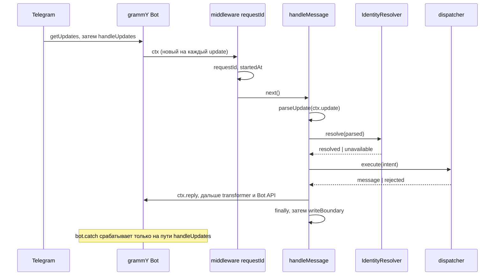
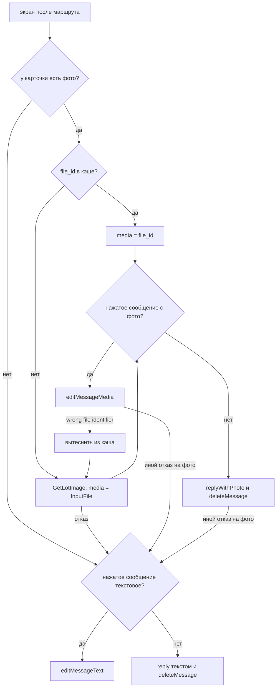

# Адаптер grammY

grammY — библиотека для Telegram Bot API поверх Node. В этом репозитории она держит единственную границу, на которую приходит человек: `apps/hub-bot/src/presentation/`. Файл объясняет, как поток update от Telegram превращается в вызов кода, где у библиотеки швы для тестов и наблюдаемости и почему обработчик ловит свои отказы сам.

Язык, типы и клиент Identity — [typescript/module-and-types.md](../typescript/module-and-types.md); чем и как это проверяется — [typescript/testing.md](../typescript/testing.md); состав полей записи — [standard: логирование](../../standards/observability/logging.md); границы компонента — [бриф](../../services/telegram-bot.md) и [ADR-030](../../decisions/ADR-030-telegram-bot.md).

## Механика

### Bot — цепочка middleware, а не набор событий

```ts
const bot = new Bot<UpdateContext>(runtime.token);
bot.use((ctx, next) => {
  ctx.requestId = randomUUID();
  ctx.startedAt = process.hrtime.bigint();
  return next();
});
bot.on("message", (ctx) => handleMessage(ctx, runtime));
```

`bot.use` регистрирует функцию вида `(ctx, next)`. Это та же конструкция, что middleware в ASP.NET Core: `next` — продолжение цепочки, и позвать его решает сама функция. Отличия два. Первое: `next()` возвращает Promise, и его надо вернуть или дождаться, иначе следующее звено пойдёт исполняться параллельно с текущим. Второе: молчание вместо ошибки. Middleware, не позвавшая `next`, останавливает обработку update без единого сообщения — проверено экспериментом: `bot.on("message")` после такой middleware не вызывается ни разу.

Обработчик здесь один и зарегистрирован последним, поэтому `handleMessage` не получает `next` и цепочку не продолжает: за ним ничего нет.

### Контекст живёт один update и расширяется типом

Внутри `handleUpdate` grammY делает `new this.ContextConstructor(update, api, this.me)` — свежий объект на каждый update. Поэтому поле, дописанное в `ctx`, исчезает вместе с обработкой, и убирать его не надо.

Расширение объявляется типом и передаётся в конструктор бота:

```ts
type UpdateContext = Context & {
  requestId: string;
  startedAt: bigint;
};

const bot = new Bot<UpdateContext>(runtime.token);
```

grammY называет это **context flavor**. Ближайший аналог в .NET — `HttpContext.Items`: словарь на запрос. Отличие в том, что `Items` типизирован как `object` и каждое чтение из него — приведение типа в рантайме, а флейвор виден компилятору: `ctx.requestId` — обычное поле со своим типом, и опечатка в имени не соберётся.

Цена этой типизации формулируется честно: тип утверждает «поле есть», а заполняет его первая middleware. До неё поля нет, и компилятор об этом не знает. Ниже это отдельный открытый вопрос.

### `bot.on("message")` — предикат, а не подписка

В `composer.js` метод разворачивается в одну строку:

```js
on(filter, ...middleware) {
    return this.filter(Context.has.filterQuery(filter), ...middleware);
}
```

То есть фильтр — та же middleware, которая пропускает дальше только при истинном предикате. Строка `"message"` — не имя события, а выражение на языке filter queries: `"message:text"`, `"message:photo"`, `"message:entities:mention"` сужают тот же поток. Проверено: update `{ update_id: 2 }` без поля `message` до обработчика не доходит.

Скелет намеренно берёт весь `message`, а не `bot.command("start")`: разбор того, что пришло, живёт в `parseUpdate` и Zod-схеме, а не в фильтрах библиотеки.

### Два входа для update, и `bot.catch` подключён только к одному

Это главное место файла: от него зависит и форма кода, и то, что вообще может проверить тест.

- `bot.handleUpdate(update)` — один update. Прогоняет цепочку, а если та бросила, заворачивает причину в `BotError { error, ctx }` и **бросает наружу**.
- `bot.handleUpdates(updates)` — батч. Ловит `BotError` и передаёт его функции, зарегистрированной через `bot.catch`.

Long polling зовёт второе. Проверено экспериментом на голом боте: `handleUpdate` отвергает Promise ошибкой `BotError`, а зарегистрированный `bot.catch` не вызывается ни разу; `handleUpdates([update])` на том же боте вызывает его ровно один раз и приносит и ошибку, и контекст.

Отсюда форма `handleMessage`: он ловит свои отказы сам, а запись границы пишется в `finally`.

```ts
} catch (cause) {
    outcome = unexpectedOutcome(cause);
} finally {
    if (outcome !== undefined) {
      writeBoundary(runtime.logger, ctx, outcome);
    }
}
```

`bot.catch` остаётся вторым уровнем — для отказа, случившегося вне этой функции: в middleware с `randomUUID`, в самой библиотеке, в фильтре. Первым уровнем он быть не может: до него не доходит `handleUpdate`, а ответ человеку про сбой на стороне продукта и категория отказа рождаются внутри сценария, а не в глобальном обработчике.

### Transformer — шов на исходящих вызовах

`ctx.reply(text)` в итоге зовёт `sendMessage` по HTTP. Тесту в сеть нельзя, и шов для этого предусмотрен самой библиотекой:

```ts
const recorder: Transformer = (_prev, method, payload) => {
  calls.push(recordCall(method, payload));
  return Promise.resolve({ ok: true, result: true as never });
};
bot.api.config.use(recorder);
```

Тип из `core/client.d.ts`:

```ts
type Transformer = <M extends Methods<R>>(
  prev: ApiCallFn<R>, method: M, payload: Payload<M, R>, signal?: AbortSignal,
) => Promise<ApiResponse<ApiCallResult<M, R>>>;
```

Это middleware для исходящих вызовов, симметричная входящей цепочке: `prev` — следующее звено, и не позвать его значит ответить самому. Работает подмена потому, что `handleUpdate` создаёт для каждого update новый объект `Api` и копирует в него `installedTransformers` из `bot.api.config`: transformer, поставленный на бота, оказывается и в `ctx.api`.

Без него тест ушёл бы в интернет. Проверено: тот же обработчик без transformer отвечает `GrammyError: Call to 'sendMessage' failed! (401: Unauthorized)` — то есть реально сходил в `api.telegram.org` и получил отказ по токену.

Аналог в .NET — не мок интерфейса, а `DelegatingHandler` в цепочке `HttpMessageHandler`. Отличие в уровне: transformer видит имя метода Bot API и типизированный payload, поэтому ассерт пишется про `sendMessage` и `text`, а не про URL и тело запроса.

### `init`, `start`, `stop`

`bot.init()` — единственный обязательный сетевой вызов до старта: `getMe`, чтобы бот знал своё имя. Проверка внутри тривиальна: `isInited()` возвращает `me !== undefined`, а `init()` при `isInited()` не делает ничего. Поэтому тест, присвоивший `bot.botInfo` фикстурой, вызывает `await bot.init()` бесплатно и без сети.

`bot.start()` идёт по шагам: `deleteWebhook` (long polling и webhook взаимно исключают друг друга), затем `onStart`, затем `validateAllowedUpdates`, затем цикл `getUpdates`. Две детали видны только в исходнике, и обе важны для `main.ts`:

- возвращённый Promise не резолвится, пока бот не остановлен. Поэтому `await bot.start({ onStart })` в конце `main` — нормальное завершение функции, а не зависание;
- сразу после старта grammY подменяет `bot.use` заглушкой. Middleware, зарегистрированная после запуска, молча теряла бы часть апдейтов, и библиотека закрывает эту дверь.

`bot.stop()` останавливает цикл и подтверждает последний обработанный update ещё одним `getUpdates`. Отсюда форма выключения: сигнал ставит флаг, заводит форсирующий таймер на 15 секунд с `force.unref()` — такой таймер не держит event loop живым сам по себе, — и ждёт `bot.stop()`.

### Откуда на этой границе берутся поля записи

Каркас полей задан [стандартом](../../standards/observability/logging.md); здесь важно только то, чем его закрывает именно grammY.

- `operation` — имя обработчика update: `"message"` или `"callback_query"`, по тому, какое поле пришло в апдейте. Одна константа на обе границы не подходит: записи тогда нельзя собрать по исполнявшемуся коду.
- `request_id` — `randomUUID()` в первой middleware. Hub Bot — край цепочки, идентификатор больше взять неоткуда.
- `duration_us` — `Number((process.hrtime.bigint() - started) / 1000n)`. `process.hrtime.bigint()` даёт наносекунды монотонных часов, аналог `Stopwatch.GetTimestamp()`; `Date.now()` не годится, он ходит вместе с системным временем. Деление на `1000n` — целочисленное деление bigint, поэтому микросекунды выходят целым числом без плавающей точки.
- `use_case` опускается у проигнорированного и у неразобранного update: сценария человек не начинал либо он не восстановим из недоверенного ввода. Пустой строкой поле не заполняется — стандарт требует именно опустить.
- Обе границы — `handleMessage` и `handleCallback` — держат запись в `try/finally`: ветка присваивает исход, а пишется он один раз на выходе. Поэтому поглощённый update оставляет ровно одну запись независимо от того, чем кончился, а `bot.catch` остаётся только для отказов вне обработчиков. Ветка, которая возвращается молча, — это молчаливо пропавшая запись, а не отсутствие события: чужой ответ на вопрос формы и нечитаемая кнопка тоже поглощают update. Отказ увеличивает `solguficky.failures` внутри `writeBoundary`, а не в обработчике: счётчик и запись рождаются одним вызовом.

### Фото: `file_id` против байтов и смена вида сообщения

Бот аукциона показывает изображение лота в карточке (`apps/auction-bot/src/bot.ts`, функция `deliver`). Bot API принимает фото в поле `media` двумя способами, и grammY выражает их одним типом `string | InputFile`:

```ts
function mediaOf(photo: Photo): string | InputFile {
  return photo.kind === "cached" ? photo.fileId : photo.file;
}
```

- **Строка — `file_id`** файла, который Telegram уже хранит. Байты не едут, отправка мгновенная. Идентификатор действует только у бота, который получил файл: второй бот с тем же `file_id` ничего не отправит ([ADR-057](../../decisions/ADR-057-auction-lot-catalog-as-state.md), дополнение). Поэтому `file_id` лежит в кэше процесса, а не в общей базе.
- **`InputFile` — загрузка байтов.** `new InputFile(image.content, "lot")` оборачивает `Uint8Array`, полученный из Auction, и grammY отправляет его multipart-запросом. В ответ Telegram присылает сообщение с массивом размеров `photo`, и бот кладёт `file_id` из последнего элемента в кэш под версией изображения.

Аналог в .NET — разница между ссылкой на blob и `StreamContent` в `HttpClient`. Отличие в том, что `file_id` нельзя получить заранее: его выдаёт только первая успешная загрузка.

`InputFile` можно отправить второй раз, если он построен из `Uint8Array`. В `node_modules/grammy/out/types.node.js` метод `toRaw()` возвращает буфер как есть, а флаг `consumed` ставит только потокам и итераторам: повторная отправка такого источника падает с `Cannot reuse InputFile data source!`. На этом держится ветка «сообщение не редактируется»: тот же объект уходит новым сообщением после отказа правки. Поменяй источник на поток — ветка сломается молча, до первого отказа Telegram.

Текстовое сообщение не превращается в фото и обратно: `editMessageText` правит текст, `editMessageMedia` — только сообщение, у которого уже есть медиа. Поэтому метод выбирается заранее, по виду нажатого сообщения, а не пробой и перехватом отказа:

```ts
const current = ctx.callbackQuery?.message;
const currentIsPhoto = current !== undefined && "photo" in current;
```

`"photo" in current` — сужение TypeScript по наличию поля, то же, что `is` с проверкой свойства в C#. При смене вида уходит новое сообщение, а прежнее удаляет `ctx.deleteMessage()`. Отказ удаления глушится: Bot API не удаляет сообщения старше 48 часов, а новое уже отправлено. `ctx.deleteMessage()` и `ctx.editMessageMedia()` берут `message_id` из нажатого сообщения — `this.msg` в `context.js`. Отдельный идентификатор передавать не нужно, и удаляется именно то сообщение, на котором нажали кнопку.

Отказ Telegram при правке приходит исключением `GrammyError`, и разобрать его можно только по тексту `description`: отдельного кода у «файл не найден» нет. Поэтому распознавание отвергнутого `file_id` — регулярное выражение без учёта регистра, а неузнанный отказ на фото откатывает карточку в текст, а не бросает. Изображение украшает экран, а не держит его.

### Режим ответа живёт в клиенте, а не в сообщении

Вопрос бота хаба — обычное сообщение с `reply_markup`, в котором стоят сразу два поля: `force_reply: true` и `inline_keyboard` с кнопкой «Отмена» (`apps/telegram-bot/src/presentation/bot.ts`, функция `askQuestion`). `force_reply` — просьба к клиенту Telegram открыть поле ввода в режиме «ответ на это сообщение». Аналог в .NET — `Focus()` на поле формы: сервер просит, а исполняет и помнит это клиент.

Отсюда поведение, которого в типах grammY не видно и которое показал только живой мобильный клиент (зонд PER-443, таблица «Что проверено и чем» в [дизайн-коде](../../design/bot/design-code.md)):

- `editMessageText` и `editMessageReplyMarkup` меняют сообщение на сервере, но открытый режим ответа у клиента не закрывают. Он переживает выход из чата и возвращается при входе, пока человек не ответит или не закроет его сам.
- `force_reply: false` в правке Bot API принимает и игнорирует: в ответе на правку у сообщения по-прежнему `force_reply: true`.
- `deleteMessage` закрывает режим ответа сразу: отвечать больше не на что.

Поэтому вопрос закрывается удалением, а не правкой:

```ts
if (pressed.kind === "question") {
  if (pressedId !== undefined) {
    questions.delete(questionKey(ctx.chat?.id, pressedId));
  }
  ctx.pressedGone = await deletePressed(ctx);
}
```

`deletePressed` — обёртка над `ctx.deleteMessage()`, которая возвращает `false` вместо исключения. Флаг `pressedGone` читает отправитель экрана: сообщения под нажатием больше нет, править нечего, экран уходит новым сообщением.

Удаление — вызов Bot API, и он проходит через тот же transformer, что и остальные. В `apps/telegram-bot/src/presentation/waiting.ts` transformer ожидания считает первый «видимый» вызов результатом нажатия и перед ним отвечает на `callback_query`. Удаление ничего не показывает, поэтому оно стоит в списке тихих методов:

```ts
const quietMethods: ReadonlySet<string> = new Set([
  "answerCallbackQuery",
  "sendChatAction",
  "editMessageReplyMarkup",
  "deleteMessage",
]);
```

Без этой строки ответ на нажатие уходил пустым до всплывающего текста, и тесты это не ловили: они проверяли, что ответ есть, а не что в нём.

### Вид файла привязан к `file_id`

`file_id` несёт не только файл, но и то, чем Telegram его принял. Фото, присланное «как файл», приходит полем `document` с MIME `image/jpeg`, и отправить его фотографией нельзя: Bot API отвечает `can't use file of type Document as Photo`. Вывести вид из MIME или расширения нельзя, его знает только update, которым файл пришёл:

```ts
const photo = parsed.data.photo?.at(-1);
if (photo !== undefined) {
  return { kind: "file", fileId: photo.file_id, fileKind: "photo" };
}
```

Это `apps/telegram-bot/src/presentation/material-input.ts`. Вид едет дальше вместе с идентификатором — в порт `MeetupMaterialSource` и в поле `file_kind` контракта `meetups.v1`. Аналогия из .NET — `Content-Type`, сохранённый рядом с ключом blob: по одному ключу его не восстановить.

### Rich-сообщение с фото остаётся rich-сообщением

Bot API 10 добавил богатые сообщения: `sendRichMessage` и `editMessageText` с полем `rich_message`. Текст — HTML с блоками, а файлы подключаются отдельным списком `media` и ссылкой `tg://photo?id=<id>` из разметки (`apps/telegram-bot/src/presentation/screens/show.ts`):

```ts
const rich = {
  html: text,
  ...(media === undefined || media.length === 0
    ? {}
    : {
        media: media.map((photo) => ({
          id: photo.id,
          media: { type: "photo" as const, media: photo.fileId },
        })),
      }),
};
```

`id` здесь — локальное имя внутри одного сообщения, а не `file_id`: разметка `` находит по нему элемент списка. Несколько `` внутри `<tg-slideshow>` дают карусель.

Главное отличие от фото из раздела выше: такое сообщение не становится «сообщением с фото». В update нажатия у него поле `rich_message` с блоками, а полей `photo` и `document` нет. Поэтому проверка `"photo" in message` его не видит, и `editMessageText` правит его на месте в любую сторону — в текст, в rich без медиа, в rich с другим набором фото. Правило «текст не превращается в фото» относится к `sendPhoto`, а не к rich.

## Урок

**Состояние, которое держит клиент, сервером не отменить — можно только убрать его предмет.** Режим ответа, открытая клавиатура, фокус ввода живут в приложении человека. Правка сообщения до них не дотягивается; удаление сообщения убирает то, к чему состояние привязано. Перед тем как строить сценарий на таком состоянии, выясняется не только как его включить, но и чем оно снимается.

**Тип SDK описывает запрос, а не поведение клиента.** `force_reply?: boolean` в типах grammY допускает `false` в правке, и компилятор доволен. Что Bot API это поле в правке игнорирует, а клиент режим не закрывает, показывает только живой прогон. Поведение на стороне клиента проверяется зондом на тех клиентах, для которых пишется сценарий.

**Идентификатор внешней системы хранится вместе с тем, что о нём знает только момент получения.** `file_id` без вида файла — половина факта. То же относится к любому непрозрачному токену: тип, область действия и срок жизни записываются рядом с ним в ту же секунду.

**Ответ платформы — часть ключа кэша.** `file_id` появляется только в ответе на загрузку, поэтому кэш наполняется после отправки, а ключом служит версия самих загруженных байтов, а не версия из карточки: изображение могли сменить между чтением карточки и загрузкой. Тот же приём переносится на любой внешний идентификатор, который выдаёт принимающая сторона, — ETag, id загруженного объекта в хранилище.

**Повтор безопасен, только если источник повторяем.** Буфер можно отправить дважды, поток — нет. Код, который повторяет отправку, должен держать данные, а не курсор по ним.

**Шов для теста у сетевого SDK ищется в его собственной точке расширения.** Не в HTTP-клиенте и не в моке интерфейса: transformer знает домен библиотеки, поэтому тест ассертит `sendMessage` и его payload. Следующий SDK — клиент NATS, транспорт gRPC — сначала проверяется на наличие такой точки, и только потом обкладывается моками.

**Границу надо знать по коду, а не по названию.** «Глобальный обработчик ошибок» звучит как первый рубеж, а подключён к одному из двух путей приёма update. Тест, который кормит бота напрямую, его не задевает; тест, который «проверяет `bot.catch`» через `handleUpdate`, проверяет пустоту.

**Идентификатор запроса рождается до бизнес-логики.** Первая middleware ставит `requestId` и точку отсчёта, всё остальное только читает. Это переносится на любую границу: gRPC-интерцептор Identity делает то же самое, отличаясь лишь тем, что там идентификатор приходит извне.

**Ответ человеку и запись в лог — два разных решения об одном исходе.** `identity unavailable` даёт и `ctx.reply` с текстом кадра E-05, и запись уровня `error`. Молчание бота при отказе соседа выглядит для человека как «бот сломался», поэтому fail-closed здесь означает короткий ответ, а не тишину.

## Почему так, а не иначе

| Вариант | Цена |
|---|---|
| Webhook вместо long polling | нужен публичный HTTPS и внешний адрес; скелету незачем, а переключение позже стоит одной ветки в `main` |
| `@grammyjs/runner` | даёт конкурентную обработку и sequentialize, но добавляет второй источник поведения поверх `bot.start`. Скелету с одним заглушечным сценарием он не даёт ничего |
| `bot.command("start")` вместо `bot.on("message")` | фильтр библиотеки решал бы за `parseUpdate`, какой update считается валидным; разбор недоверенного ввода должен быть в одном месте |
| Логировать только в `bot.catch` | не вызывается при `handleUpdate`, не знает про `ignored` и `malformed` и не может ответить человеку. Граница осталась бы без записей об успехе |
| Не ставить `bot.catch` вовсе | отказ вне `handleMessage` на пути long polling печатался бы самим grammY в консоль по своему формату, мимо каркаса полей |
| Мокать `Api` через `vi.mock` или перехватывать HTTP (`nock`, `msw`) | transformer — официальный шов той же библиотеки: не ломается от смены её внутреннего HTTP-клиента и типизирован по методам Bot API |
| Хранить `requestId` в `WeakMap<Context, string>` вместо флейвора | тип не расширяется, каждое чтение возвращает `string \| undefined`, а выигрыша нет: контекст и так живёт один update |
| `Date.now()` для длительности | системные часы могут прыгнуть; `process.hrtime.bigint()` монотонен |
| Закрывать вопрос правкой в экран | на сервере сообщение становится экраном, а мобильный клиент держит режим ответа на него и возвращает его при каждом входе в чат |
| Слать `remove_keyboard` новым сообщением | снимает залипший классический `ForceReply`, но это лишнее сообщение в чате, и для вопроса с inline-клавиатурой не проверено |
| Определять фото по MIME или расширению | JPEG, присланный файлом, — документ; `file_id` документа фотографией не отправляется |
| `sendPhoto` с подписью вместо rich с `media` | сообщение с фото не правится в текст, и нажатие под ним не может править своё сообщение |
| Медиагруппа для ленты лотов с фото | у медиагруппы нет inline-клавиатуры, поэтому листание правкой на месте невозможно, и каждая страница — новые сообщения |
| Пробовать `editMessageMedia` и ловить отказ на текстовом сообщении | лишний вызов Bot API на каждую смену вида, а различение строится на тексте ошибки; вид нажатого сообщения известен заранее |
| Хранить `file_id` в базе Auction | идентификатор действует только у одного бота, второй бот его не использует; отвергнуто в ADR-057 |
| Грузить байты на каждый показ | мегабайты на каждое нажатие; кэш в памяти процесса снимает это и теряется при рестарте без вреда |

## Схема


```mermaid
sequenceDiagram
  participant TG as Telegram
  participant Bot as grammY Bot
  participant MW as middleware requestId
  participant H as handleMessage
  participant ID as IdentityResolver
  participant D as dispatcher
  TG->>Bot: getUpdates, затем handleUpdates
  Bot->>MW: ctx (новый на каждый update)
  MW->>MW: requestId, startedAt
  MW->>H: next()
  H->>H: parseUpdate(ctx.update)
  H->>ID: resolve(parsed)
  ID-->>H: resolved | unavailable
  H->>D: execute(intent)
  D-->>H: message | rejected
  H->>Bot: ctx.reply, дальше transformer и Bot API
  H->>H: finally, затем writeBoundary
  Note over Bot: bot.catch срабатывает только на пути handleUpdates
```

Выбор пути доставки экрана в боте аукциона:


```mermaid
flowchart TD
  S[экран после маршрута] --> P{у карточки есть фото?}
  P -- нет --> T{нажатое сообщение текстовое?}
  T -- да --> ET[editMessageText]
  T -- нет --> RT[reply текстом и deleteMessage]
  P -- да --> C{file_id в кэше?}
  C -- да --> M[media = file_id]
  C -- нет --> U[GetLotImage, media = InputFile]
  U -- отказ --> T
  M --> V{нажатое сообщение с фото?}
  U --> V
  V -- да --> EM[editMessageMedia]
  V -- нет --> RP[replyWithPhoto и deleteMessage]
  EM -- wrong file identifier --> X[вытеснить из кэша] --> U
  EM -- иной отказ на фото --> T
  RP -- иной отказ на фото --> T
```

## Первоисточники

- [grammY: middleware](https://grammy.dev/guide/middleware) — цепочка `(ctx, next)` и почему `next` надо дождаться.
- [grammY: context flavors](https://grammy.dev/guide/context) — расширение `Context` типом вместо словаря.
- [grammY: filter queries](https://grammy.dev/guide/filter-queries) — язык `"message:text"` и то, что `on` это `filter`.
- [grammY: transformers](https://grammy.dev/advanced/transformers) — middleware исходящих вызовов Bot API.
- [grammY: deployment types](https://grammy.dev/guide/deployment-types) — long polling против webhook и почему `start()` сначала снимает webhook.
- [Telegram Bot API: getUpdates](https://core.telegram.org/bots/api#getupdates) — семантика подтверждения offset, на которой стоит `bot.stop()`.
- [Node.js `process.hrtime.bigint()`](https://nodejs.org/api/process.html#processhrtimebigint) — монотонные наносекунды.
- Скилл `.skillshare/skills/proj/proj-write-grammy-bot/SKILL.md` — юзкейс не знает `Context`, парсер принимает `unknown`, ответ человеку fail-closed.
- [grammY: files](https://grammy.dev/guide/files) — `file_id` против `InputFile` и откуда берётся `file_id` после загрузки.
- [Telegram Bot API: Sending files](https://core.telegram.org/bots/api#sending-files) — три способа передать файл и то, что `file_id` нельзя переносить между ботами.
- [Telegram Bot API: editMessageMedia](https://core.telegram.org/bots/api#editmessagemedia) — правка медиа существующего сообщения.
- [Telegram Bot API: deleteMessage](https://core.telegram.org/bots/api#deletemessage) — ограничение в 48 часов.

- [Telegram Bot API: ForceReply](https://core.telegram.org/bots/api#forcereply) — что именно поле просит у клиента; о снятии режима там ничего нет, это и есть пробел, который закрыл зонд.
- `node_modules/@grammyjs/types/rich.d.ts` в `apps/telegram-bot` — формат rich-сообщения: блоки, `tg://photo?id=`, список `media`, `<tg-slideshow>` и `<tg-collage>`.
- [Дизайн-код бота, «Что проверено и чем»](../../design/bot/design-code.md) — результаты зондов PER-343 и PER-443 по клиентам.

## Проверь себя

Проверялось на `grammy@1.46.0` и Node 26, из `apps/telegram-bot` после `npm ci` и генерации `gen/`.

- Middleware без вызова `next()` останавливает цепочку: обработчик `bot.on("message")` не выполняется. Проверено временным тестом.
- `bot.handleUpdate(update)` при бросившем обработчике отвергает Promise ошибкой класса `BotError` с исходным сообщением внутри, а зарегистрированный `bot.catch` не вызывается. Проверено.
- `bot.handleUpdates([update])` на том же боте вызывает `bot.catch` ровно один раз и передаёт объект с `error` и `ctx`. Проверено.
- `bot.on("message")` не срабатывает на `{ update_id: 2 }` без поля `message`. Проверено.
- Без установленного transformer `ctx.reply("hi")` реально ходит в Telegram: `GrammyError: Call to 'sendMessage' failed! (401: Unauthorized)`. Проверено.
- `isInited()` в `node_modules/grammy/out/bot.js` — это `me !== undefined`, поэтому после `bot.botInfo = ...` вызов `init()` не делает `getMe`. Прочитано в исходнике и косвенно подтверждено тем, что весь набор тестов проходит с фиктивным токеном.
- `npx vitest run` в `apps/telegram-bot` — 4 файла, 11 тестов, все зелёные. Проверено.

Фото в боте аукциона проверялось на `grammy@1.46.0` из `apps/auction-bot`:

- `InputFile` из `Uint8Array` отправляется повторно: `toRaw()` в `node_modules/grammy/out/types.node.js` возвращает буфер без отметки `consumed`, а поток помечает и второй раз бросает `Cannot reuse InputFile data source!`. Прочитано в исходнике.
- `ctx.editMessageMedia` и `ctx.deleteMessage` берут `message_id` из `this.msg` нажатия. Прочитано в `node_modules/grammy/out/context.js`.
- Переходы текст ↔ фото, кэш, повтор на `wrong file identifier` и откат в текст при отказе фото покрыты `apps/auction-bot/src/bot.test.ts` через transformer: `npx vitest run src/bot.test.ts`. Проверено на подменённом Bot API, а не на живом Telegram.

Режим ответа, вид файла и rich с медиа проверялись в PER-443 зондом на dev-боте, Telegram Desktop и мобильный клиент Android:

- Правка вопроса с `force_reply: false` возвращает сообщение с `force_reply: true`; правка без `reply_markup` возвращает сообщение без клавиатуры. В обоих случаях мобильный клиент оставляет режим ответа и возвращает его после перезахода. Проверено на живом клиенте.
- `deleteMessage` вопроса закрывает режим ответа сразу, после перезахода он не возвращается. Проверено на живом клиенте.
- `sendRichMessage` с `tg://photo?id=` на `file_id` документа отвечает `Bad Request: can't use file of type Document as Photo` — и для PDF, и для JPEG, присланного файлом. Проверено.
- `editMessageText` переводит одно и то же сообщение между rich с каруселью, текстом, rich без медиа, одним фото и коллажем; `message_id` не меняется. В update нажатия у карточки с каруселью ключи сообщения — `rich_message` и `reply_markup`, без `photo`. Проверено.
- `deleteMessage` в `quietMethods`, порядок вызовов «удаление, ответ на нажатие, экран» и запасной путь карточки без постеров покрыты `apps/telegram-bot/src/presentation/bot.test.ts`: `just telegram-bot-test`. Проверено на подменённом Bot API.
- Закрытие вопроса удалением в самом боте на живом мобильном клиенте не проверялось: зонд проверял механику Bot API отдельным скриптом. Проверь сам на dev-боте: задай вопрос кнопкой поля, нажми «Отмена», выйди из чата и зайди снова.
- Остаётся ли режим ответа после ответа кнопкой, а не сообщением, не проверялось.

Открытые вопросы, из-за которых статус «вернуться»:

- Что отвечает живой Telegram на `editMessageMedia` к текстовому сообщению — бот этого вызова избегает, и текст отказа не проверен. Проверь на живом боте профиля `auction-bot` с тестовым токеном. Половина вопроса закрыта зондом PER-343: `editMessageText` к сообщению с файлом отвергается с `there is no text in the message to edit`, а `editMessageCaption` принимается.
- Упорядочен ли массив `photo` в ответе по возрастанию размера: бот берёт последний элемент как наибольший. Bot API называет его «available sizes» без явного порядка — проверь на живой загрузке.

- `bot.catch` в `createBot` не покрыт ни одним тестом: все тесты границы идут через `handleUpdate`, а он туда не заходит. Проверить его можно через `bot.handleUpdates([...])` или живым long polling — сделай это, когда появится живой бот.
- `writeBoundary` в `bot.catch` читает `ctx.startedAt`, который ставит первая middleware. Если отказ случится в ней самой, `elapsedUs(undefined)` даст `TypeError: Cannot mix BigInt and other types` уже внутри обработчика ошибок — проверено отдельным вычислением. Сейчас туда попадают только `randomUUID` и `hrtime`, которые не бросают, но защиты нет.
- Как поведёт себя `bot.stop()` посреди обработки update и хватает ли 15 секунд форсирующего таймера — проверь на живом боте: `HUB_BOT_TOKEN=... just hub-bot-run`, затем SIGTERM во время ответа.
