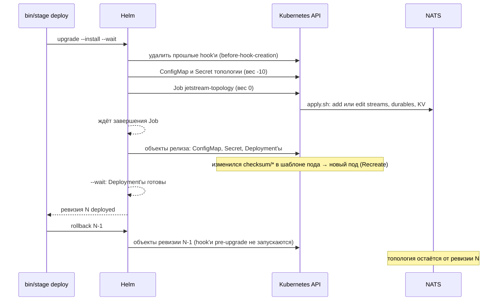

# Helm: hooks, перекат подов и откат

Разбор объясняет, как Helm ставит и обновляет чарт хаба на stage и почему в чарте появились Job-hook, веса, контрольные суммы и выражения `dig`. Опора:

- дифф PER-311 ([PR #366](https://github.com/Solguficky/solguficky-hub/pull/366)): `infra/apphost/AppHost/Configuration/Publish/HelmHookJob.cs`, `ClusterWorkload.cs`, `tools/apphost/check-chart.py`;
- выкладки, откат и перезагрузка stage 06.10.2026;
- проверочные команды, выполненные при записи разбора: helm 4.3.0 локально и учётка выкатки `test` на хосте.

Как устроен сам кластер — в [k3s.md](../self-hosting/k3s.md). Правила stage — в [stage.md](../../development/stage.md), решение о рантайме — в [ADR-055](../../decisions/ADR-055-k3s-runtime-from-aspire-chart.md).

## Механика

### Чарт, релиз и ревизия

Чарт — каталог шаблонов YAML и файл `values.yaml` с параметрами. Шаблоны написаны на Go-шаблонах (`text/template`): в двойных фигурных скобках стоит выражение, которое Helm вычисляет при рендере. Ближайший аналог из .NET — Razor, только на выходе манифесты Kubernetes, а не HTML.

Релиз — установленный экземпляр чарта с именем. На stage он один и называется `hub`. Каждая установка, обновление и откат дают новую ревизию. Helm хранит ревизии Secret'ами типа `helm.sh/release.v1` в namespace релиза (`sh.helm.release.v1.hub.v1`, `…v2` и далее), поэтому история переживает перезапуск всего:

```text
$ helm history hub
1  failed      Release "hub" failed: resource Deployment/test/notifications-deployment not ready
3  superseded  Upgrade complete
7  superseded  Upgrade complete
8  deployed    Rollback to 6
```

`helm upgrade --install --wait` рендерит чарт, применяет манифесты и ждёт, пока Deployment'ы станут готовыми. Ревизия 1 так и упала: Notifications не поднялся, и `--wait` дождался таймаута.

### Hook: объект вне релиза в фиксированный момент

Обычный объект чарта Helm применяет все разом и затем следит за ним как за частью релиза. Hook — объект с аннотацией `helm.sh/hook`, которого Helm в релиз не включает. Он создаётся отдельно, в названный момент жизненного цикла. Сервисам хаба нужны streams и durables JetStream ещё до старта, поэтому Job топологии объявлен так (`HelmHookJob.cs`):

```csharp
public const string Events = "pre-install,pre-upgrade";
```

`pre-install` и `pre-upgrade` значат: Job создаётся до объектов релиза, Helm ждёт его завершения и только потом применяет Deployment'ы. Упал Job — упала выкладка, и сервисы не перекатываются на непригодную шину.

Что hook вне релиза, видно на stage:

```text
$ helm get manifest hub | grep -c jetstream-topology
0
$ helm get hooks hub | grep "^# Source"
# Source: solguficky-hub/templates/jetstream-topology/secrets.yaml
# Source: solguficky-hub/templates/jetstream-topology/files.yaml
```

### Вес: порядок внутри одного события

Job читает свои файлы из ConfigMap и адрес NATS из Secret. Будь они обычными объектами релиза, при первой установке их бы ещё не было: pre-hook идёт до объектов релиза. Поэтому они тоже hook'и того же события. Порядок внутри события задаёт `helm.sh/hook-weight`: Helm создаёт hook'и по возрастанию веса.

```csharp
public const string InputWeight = "-10";
public const string JobWeight = "0";
```

На stage это видно по времени создания (UTC):

```text
ConfigMap jetstream-topology-files    created=09:21:08Z weight=-10
Secret    jetstream-topology-secrets  created=09:21:08Z weight=-10
Job       jetstream-topology          created=09:21:09Z weight=0
```

Вес — строка с целым числом. Без аннотации Helm считает вес нулевым. При равном весе hook'и идут в том же порядке видов, что и объекты релиза, а в нём ConfigMap и Secret стоят раньше Job. Значит, и без весов входы создались бы первыми, но держалось бы это на порядке видов внутри Helm, а не на чарте. Чарт задаёт порядок явно, и `check-chart.py` это держит: вес каждого входа должен быть меньше веса Job, а каждый ConfigMap и Secret, на который Job ссылается, должен быть в чарте. Второе правило важнее первого. Ссылка на объект, которого нет, проходит и `helm lint`, и установку, а под Job висит в `ContainerCreating` до `activeDeadlineSeconds`.

### Политика удаления hook'а

Hook вне релиза, и Helm сам его не удаляет. Когда удалять, говорит аннотация `helm.sh/hook-delete-policy`:

```csharp
public const string DeletePolicy = "before-hook-creation";
```

`before-hook-creation` удаляет прошлый объект прямо перед созданием нового. Отсюда два следствия:

- следующий upgrade не упрётся в `already exists`;
- до следующей выкладки Job остаётся. После успеха на stage видно `succeeded=1`, а упавший Job сохраняет лог, где написано, почему.

Соседние политики `hook-succeeded` и `hook-failed` удалили бы Job сразу. Вместе с ним пропал бы и лог, а он и есть единственная улика.

### Откат не запускает pre-upgrade hook

`helm rollback` — отдельное событие: у него свои hook'и `pre-rollback` и `post-rollback`. Hook на `pre-install,pre-upgrade` на откате не запускается. Проверено по stage: Job создан в 12:21:09 местного времени ревизией 7 (`Upgrade complete`, 12:21:08). Ревизия 8 (`Rollback to 6`, 12:21:31) его не пересоздала.

Значит, откат возвращает Deployment'ы, ConfigMap'ы и Secret'ы сервисов, но топология JetStream остаётся от самой новой выкладки. Как с этим жить, сказано в [stage.md](../../development/stage.md#откат).

### Почему правка ConfigMap не перекатывает под

Сервис получает настройки из ConfigMap через `envFrom`: переменные окружения читаются один раз, при старте контейнера. Изменился ConfigMap — у живого пода переменные старые, а Deployment ничего не заметил: его шаблон пода не изменился. Так и случилось на первой выкладке stage: новые значения силоса Notifications легли в ConfigMap, но под не перезапустился.

Deployment создаёт новые поды только тогда, когда меняется его шаблон пода (`spec.template`). Приём из документации Helm — положить в шаблон пода хеш содержимого конфигурации (`ClusterWorkload.cs`):

```csharp
deployment.Spec.Template.Metadata.Annotations[$"checksum/{file}"] =
    $"{{{{ include (print $.Template.BasePath `/{resource.Resource.Name}/{file}.yaml`) . | sha256sum }}}}";
```

C# здесь только экранирует фигурные скобки. В чарт уходит такое выражение: `include` рендерит соседний шаблон ConfigMap в строку, `sha256sum` берёт от неё хеш. Поменялось значение в values — изменился хеш, изменилась аннотация, и Deployment перекатывает под. Локальная проверка на игрушечном чарте:

```text
$ helm template t . --set k=a | grep checksum
    checksum/config: 13bbdd67…
$ helm template t . --set k=b | grep checksum
    checksum/config: 2093f8c8…
```

### `dig` и умолчание внутри шаблона

Лимиты памяти stage задаёт в values, а без них чарт должен держать прежние числа. Генератор Aspire свои ключи в `values.yaml` не кладёт, поэтому умолчание живёт в самом шаблоне:

```yaml
memory: "{{ dig `resources` `notifications` `memoryLimit` `512Mi` .Values.AsMap }}"
```

`dig` идёт по ключам вложенного словаря и возвращает последний аргумент, если какого-то ключа нет. Прямой путь падает уже на первом пропущенном уровне:

```text
$ helm template t . -s templates/r.yaml                                  # values без resources
  dig: "256Mi"
$ helm template t . -s templates/r.yaml --set resources.hub_bot.memoryLimit=96Mi
  dig: "96Mi"
$ helm template t . -s templates/p.yaml                                  # {{ .Values.resources.hub_bot.memoryLimit }}
Error: … nil pointer evaluating interface {}.hub_bot
```

`dig` работает по словарю, а не по объекту `.Values`, поэтому нужен `.Values.AsMap`. Обратные кавычки — строковый литерал Go-шаблона, такой же законный, как двойные. Здесь они выбраны потому, что YAML-сериализатор AppHost экранировал бы двойные кавычки внутри значения, и Helm такого шаблона уже не разобрал бы.

### Что видит helm и чего не видит

`helm lint` и `helm template` проверяют, что шаблон рендерится в YAML. Схему объектов Kubernetes они не проверяют. Deployment со стратегией `Recreate` и заполненным `rollingUpdate` оба пропускают, а API отвергает его при применении:

```text
$ helm lint .
1 chart(s) linted, 0 chart(s) failed
$ kubectl apply --dry-run=server -f deployment.yaml
The Deployment "dryrun-recreate" is invalid: spec.strategy.rollingUpdate: Forbidden:
  may not be specified when strategy `type` is 'Recreate'
```

Генератор Aspire такой Deployment и выдавал (PER-370). Поэтому у чарта своя проверка правил, `check-chart.py`. Её фикстуры доказывают, что каждое правило ловит свой дефект.

## Урок

- **Порядок, от которого зависит старт, выражается механизмом инструмента, а не надеждой.** Сервисы падают без durables, а Helm умеет «до релиза» только через pre-hook. В любом инструменте выкатки так же: миграция или подготовка инфраструктуры — отдельный шаг с ожиданием, а не гонка с приложением.
- **Объект вне жизненного цикла нужно удалять явно и вовремя.** Hook не принадлежит релизу. `before-hook-creation` убирает его ровно тогда, когда нужно место под новый, и оставляет улику на время между выкладками.
- **Конфигурация, прочитанная при старте, требует сигнала на перезапуск.** Хеш конфигурации в шаблоне пода — общий приём: где процесс читает настройки один раз, изменение настроек должно менять то, за чем следит оркестратор.
- **Откат — отдельное событие со своими правилами.** Что возвращает откат, проверяется отдельно от того, что ставит выкладка: здесь он не трогает ни базу, ни топологию шины.
- **Рендер без ошибок ничего не говорит о схеме.** Между «шаблон собрался» и «API принял» стоит отдельная проверка: правила чарта и `--dry-run=server`.

## Почему так, а не иначе

- **Post-hook (`post-install,post-upgrade`).** Входы Job были бы обычными объектами релиза, без весов. Но при `--wait` Helm запускает post-hook только после готовности Deployment'ов, а Notifications и боты без своих durable готовыми не становятся. Выкладка ждала бы сама себя до таймаута. Живьём это не прогонялось: вывод сделан по документации Helm и по поведению сервисов без топологии.
- **Отдельный Job или скрипт вне чарта, из ops-репозитория.** Чарт остался бы проще. Но описание топологии разошлось бы с таблицей AppHost, а порядок «топология до сервисов» держал бы человек. Владелец выбрал hook в чарте: описание одно, `JetStreamTopology.cs`.
- **Init-контейнер в каждом сервисе.** Нет hook'ов и весов. Цена — каждый под на каждом рестарте применяет топологию всей шины: пять одновременных писателей одних и тех же объектов и nats-box в каждом поде.
- **`helm upgrade --atomic`.** Упавшая выкладка откатывалась бы сама. Но откат решает человек (ADR-055): автоматический откат стёр бы упавшую ревизию как улику и вернул бы старый образ на схему базы, которую тот, возможно, не понимает.
- **Хеш из `.Values` вместо рендера шаблона.** Можно хешировать сами values (`toYaml .Values | sha256sum`). Тогда любая правка values, даже чужого сервиса, перекатывала бы все поды разом. `include` конкретного ConfigMap перекатывает только тот сервис, чья конфигурация изменилась.
- **Умолчания лимитов в `values.yaml`.** Привычнее, но генератор Aspire туда своих ключей не пишет. Умолчание в шаблоне через `dig` держит одно описание формы сервиса в коде AppHost.

## Схема



## Первоисточники

- [Helm: Chart Hooks](https://helm.sh/docs/topics/charts_hooks/) — события hook'ов, включая `pre-rollback`, веса, политики удаления. Там же сказано, что hook'и не входят в релиз и `helm uninstall` их не удаляет.
- [Helm: Charts Tips and Tricks, Automatically Roll Deployments](https://helm.sh/docs/howto/charts_tips_and_tricks/#automatically-roll-deployments) — приём с `checksum/config` и `include … | sha256sum`.
- [Helm: Template Function List, `dig`](https://helm.sh/docs/chart_template_guide/function_list/#dig) — поиск по вложенным словарям с умолчанием и требование словаря на входе.
- [Helm: `helm upgrade`](https://helm.sh/docs/helm/helm_upgrade/) и [`helm rollback`](https://helm.sh/docs/helm/helm_rollback/) — `--wait`, `--atomic`, что делает откат.
- [Kubernetes: Deployments, Strategy](https://kubernetes.io/docs/concepts/workloads/controllers/deployment/#strategy) — `Recreate` против `RollingUpdate` и то, что перекат запускается только сменой `spec.template`.
- [Go: text/template](https://pkg.go.dev/text/template) — синтаксис действий и строковые литералы, в том числе в обратных кавычках.
- [ADR-055](../../decisions/ADR-055-k3s-runtime-from-aspire-chart.md) и [ADR-050](../../decisions/ADR-050-jetstream-topology-owned-by-platform.md) — откуда требования: чарт из AppHost, откат решает человек, топологией владеет платформа.

## Проверь себя

Команды на хосте — под `ops` с `KUBECONFIG=~/.kube/test.yaml`. Локальные — helm 4.3.0.

1. **Входят ли hook'и в релиз?** `helm get manifest hub | grep -c jetstream-topology` — `0`; `helm get hooks hub | grep "^# Source"` — ConfigMap, Secret и Job топологии.
2. **В каком порядке Helm создал входы и Job?** `kubectl get job/jetstream-topology configmap/jetstream-topology-files -o custom-columns=NAME:.metadata.name,CREATED:.metadata.creationTimestamp` — ConfigMap на секунду раньше Job.
3. **Применил ли откат топологию?** Сравни время создания Job с `helm history hub`. Job создан выкладкой-апгрейдом, а более поздняя ревизия `Rollback to …` его не пересоздала.
4. **Перекатит ли под правка values?** На игрушечном чарте с аннотацией `checksum/config`: `helm template t . --set k=a | grep checksum` и то же с `k=b` — хеши разные.
5. **Почему `dig`, а не `.Values.resources…`?** `helm template` с `{{ .Values.resources.hub_bot.memoryLimit }}` без ключа `resources` падает с `nil pointer evaluating interface {}.hub_bot`, а `dig` возвращает умолчание.
6. **Поймает ли `helm lint` Deployment с `Recreate` и `rollingUpdate`?** Нет, `0 chart(s) failed`. Ловит API: `kubectl apply --dry-run=server -f …` — `spec.strategy.rollingUpdate: Forbidden`.
7. **Удалит ли `helm uninstall` Job топологии?** Не проверялось: релиз stage живой, а второй релиз чарта хаба не влезет в квоту `test`. По документации — нет: «resources that a hook creates are not tracked or managed as part of the release». Проверь сам на игрушечном чарте с одним hook-ConfigMap: `helm install tmp ./tiny`, `helm uninstall tmp`, затем `kubectl get configmap` — hook-объект остаётся.
