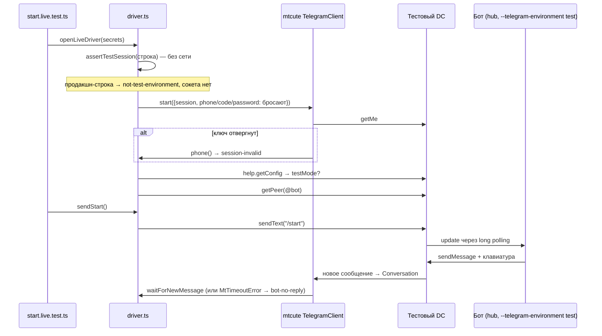

# mtcute в тестовой среде Telegram

mtcute — клиент MTProto для Node на TypeScript. MTProto — протокол, на котором работают сами приложения Telegram: он действует от имени пользователя, а не от имени бота, как Bot API. В репозитории mtcute держит драйвер живого контура `tests/telegram-live/` ([ADR-046](../../decisions/ADR-046-telegram-test-contour.md)): синтетический аккаунт тестовой среды пишет боту `/start` и читает ответ.

Файл объясняет, почему у такого драйвера два неочевидных места отказа — строка сессии и вход — и как код их закрывает. Как бот устроен со своей стороны — [grammy/bot-adapter.md](../grammy/bot-adapter.md); язык и модули — [typescript/module-and-types.md](../typescript/module-and-types.md); порядок живого прогона — [local-development.md](../../development/local-development.md#живой-прогон-start).

## Механика

### Тестовая среда — отдельные дата-центры, а не флаг на сервере

У Telegram две независимые среды: продакшн и тестовая. У каждой свои дата-центры (DC) со своими адресами, свои аккаунты и свой BotFather. Аккаунт, заведённый в одной среде, в другой не существует. «Тестовый режим» клиента поэтому означает только одно: клиент соединяется с другими адресами.

```ts
const client = new TelegramClient({
  apiId: secrets.apiId,
  apiHash: secrets.apiHash,
  testMode: true,
  storage: new MemoryStorage(),
  ...
});
```

`testMode: true` — это выбор таблицы адресов по умолчанию: `149.154.167.40` для тестового DC 2 вместо `149.154.167.50` для продакшн. Ближайший аналог в .NET — выбор `BaseAddress` у `HttpClient` по окружению. Отличие такое же, как у `BaseAddress`: абсолютный адрес из другого источника его перекрывает. Этот источник — строка сессии.

В тестовой среде есть синтетические номера вида `99966XYYYY`, где X — номер DC. SMS на них не приходит: код подтверждения — цифра X, повторённая пять раз. Поэтому вход можно автоматизировать целиком:

```ts
export function syntheticLoginCode(phone: string): string {
  const match = /^99966(\d)\d{4}$/.exec(phone);
  ...
  return match[1].repeat(5);
}
```

### Строка сессии несёт ключ и адреса своих DC

После входа клиент держит ключ авторизации — секрет, по которому сервер узнаёт устройство, примерно как refresh-токен в OAuth. `exportSession()` упаковывает его в строку base64. Вместе с ключом в строку ложатся адреса DC, на которых он выдан (`primaryDcs`): ключ действует только там. `importSession()` при следующем запуске распаковывает строку и **ставит клиенту эти адреса вместо своих умолчаний**.

Отсюда асимметрия, проверенная командой (см. «Проверь себя»):

- продакшн-клиент тестовую сессию отвергает: `This session string is not for the current backend`;
- тестовый клиент продакшн-сессию принимает молча и переходит на её DC `149.154.167.50`.

`testMode: true` сам по себе продакшн не закрывает. Закрывает его проверка строки до соединения:

```ts
export function assertTestSession(session: string): void {
  let testMode: boolean;
  try {
    testMode = readStringSession(session).primaryDcs.main.testMode === true;
  } catch (error) { ... "session-invalid" ... }
  if (!testMode) { ... "not-test-environment" ... }
}
```

`readStringSession` из `@mtcute/core/utils.js` разбирает строку без сети. Проверка стоит раньше `new TelegramClient`, поэтому продакшн-строка не открывает ни одного сокета. Вторая проверка, `help.getConfig().testMode`, идёт уже после соединения. Она ловит другое: сервер оказался не тем, чем его считали. От соединения с продакшн она не защищает, потому что соединение к этому моменту уже открыто.

### `start` — не «подключиться», а «добиться входа любой ценой»

`client.start({ session })` делает три шага: импортирует сессию, спрашивает у сервера `getMe` и, если ключ отвергнут, **начинает новый вход**. В исходнике `@mtcute/core` (`highlevel/methods/auth/start.js`) ошибки `AUTH_KEY_UNREGISTERED`, `SESSION_REVOKED` и `USER_DEACTIVATED` не пробрасываются, а ведут к запросу номера телефона. Node-обёртка `TelegramClient` (`@mtcute/node/client.js`) подставляет вместо отсутствующего номера приглашение в терминале:

```js
if (!params.phone) params.phone = () => this.input("phone > ");
```

Для приложения это удобно. Для теста это зависание: процесс ждёт stdin, пока его не снимет дедлайн, и отказ выглядит как «Telegram недоступен». Драйвер передаёт вместо номера, кода и пароля функции, которые сразу бросают названный отказ:

```ts
await client.start({
  session: secrets.session,
  phone: sessionRejected,
  code: sessionRejected,
  password: sessionRejected,
});
```

Поля `phone`, `code` и `password` принимают значение или функцию (`MaybeDynamic`). Функция вызывается только тогда, когда значение действительно понадобилось. Поэтому `sessionRejected` срабатывает ровно на пути повторного входа и не мешает рабочей сессии.

### Флуд-лимит обрабатывает middleware, и по умолчанию он ждёт

Telegram отвечает на слишком частые запросы ошибкой с кодом 420 и числом секунд в тексте: `FLOOD_WAIT_37`. Исходящие вызовы mtcute проходят через цепочку middleware, как запрос через конвейер ASP.NET Core. Одно из звеньев, `floodWaiter`, на коротком лимите (по умолчанию до 10 с) засыпает и повторяет запрос сам. Для теста это молчаливая пауза, поэтому драйвер выключает ожидание:

```ts
network: {
  middlewares: networkMiddlewares.basic({ floodWaiter: { maxWait: 0 } }),
},
```

Поведение `maxWait` здесь взято из объявления типов `FloodWaiterOptions`: лимит длиннее `maxWait` бросает ошибку вместо ожидания. Живым флуд-лимитом оно не проверялось.

Ошибку сервера mtcute превращает в `tl.RpcError` с полями `code` и `text`. Для части ошибок `RpcError.fromTl` нормализует текст и выносит число: `FLOOD_WAIT_37` становится `text: "FLOOD_WAIT_%d"`, `seconds: 37`. `FLOOD_TEST_PHONE_WAIT_30` так не разбирается и остаётся строкой. Поэтому классификатор узнаёт флуд-лимит по коду 420, а не по тексту, и берёт секунды из `seconds` или из хвоста строки.

### Ответ бота ловит `Conversation`

Бот отвечает асинхронно, отдельным входящим сообщением. `Conversation` — объект mtcute, который на время `with(...)` собирает входящие сообщения одного чата. `waitForNewMessage(filter, timeout)` ждёт первое, прошедшее фильтр, и по таймауту бросает `MtTimeoutError`. Тот же класс бросает и таймаут любого RPC. Поэтому драйвер переводит в `bot-no-reply` только таймаут ожидания ответа, а таймаут отправки оставляет недоступностью Telegram.

## Урок

- **Состояние входа, которое клиент восстанавливает сам, может перекрыть явную конфигурацию.** Если строка сессии, cookie-файл или кэш токена несут адрес или окружение, флаг конструктора описывает только умолчание. Проверять надо то, что восстановится, и до соединения.
- **Библиотека для людей и библиотека для тестов по-разному обращаются с отказом.** Интерактивный клиент чинит отказ вопросом в терминал, тесту нужен немедленный названный отказ. Перед использованием такого клиента в автоматике ищите места, где он может чего-то ждать от человека, и закрывайте их явными параметрами.
- **Один класс ошибки на два смысла различают по месту, а не по типу.** `MtTimeoutError` значит «бот молчит» только внутри ожидания ответа.

## Почему так, а не иначе

- **Проверять среду только по `help.getConfig` после входа.** Дешевле на одну функцию, но к этому моменту клиент уже соединился с продакшн-DC и выполнил `getMe` от чужого аккаунта. Сообщение в продакшн не уйдёт, но обещание ADR-046 «продакшн контуру недоступен физически» было бы нарушено.
- **Вход через `importSession` и `getMe` без `start`.** Повторного входа не было бы вовсе, но пришлось бы самому вызывать `notifyLoggedIn`. Этот вызов `start` делает сам, и через него о входе узнаёт менеджер обновлений (`highlevel/base.js`), а ответ бота `Conversation` получает именно из обновлений. Бросающие `phone`, `code` и `password` оставляют публичный путь `start`.
- **Оставить `floodWaiter` по умолчанию.** Короткие лимиты проходили бы сами, но прогон тогда молча удлиняется, а повтор раньше срока продлевает лимит. Для набора, который по ADR-046 падает с внешней причиной, названный отказ полезнее, чем ожидание.
- **Хранить сессию в SQLite, как по умолчанию предлагает `@mtcute/node`.** Сессия пережила бы процесс без user-secrets, но появился бы второй носитель секрета рядом с user-secrets AppHost и нативный `better-sqlite3`. `MemoryStorage` плюс строка в user-secrets держат секрет в одном месте.

## Схема



## Первоисточники

- [Описание авторизации MTProto](https://core.telegram.org/api/auth) — синтетические номера `99966XYYYY` и код из цифры DC; отсюда вход без SMS.
- [Тестовая среда для ботов](https://core.telegram.org/bots/features) — отдельные аккаунты и BotFather тестовой среды.
- [Ошибки MTProto](https://core.telegram.org/api/errors) — код 420 и семейство `FLOOD_WAIT`; что значит число в тексте.
- [mtcute на выбранной ревизии](https://github.com/mtcute/mtcute/tree/e281e5d4ba43efb8ae86dd4a00c2ccdf8c7e2f47) — исходники `start`, `importSession` и Node-обёртки, на которых держатся разделы о сессии и входе. Установленная копия лежит в `tests/telegram-live/node_modules/@mtcute/`.
- [ADR-046](../../decisions/ADR-046-telegram-test-contour.md) — почему синтетический аккаунт тестовой среды и почему mtcute, а не GramJS или Telethon.

## Проверь себя

Проверялось на `@mtcute/node@0.32.2` и `@mtcute/core@0.32.2`, Node 26, из `tests/telegram-live` после `npm ci --ignore-scripts`. Живого соединения с Telegram не было.

- Тестовый клиент принимает продакшн-строку сессии и переходит на её DC, а продакшн-клиент тестовую отвергает. Проверено: строки собраны `writeStringSession` из `defaultProductionDc` и `defaultTestDc`, после `importSession` внутренний `_client.mt._defaultDcs.main.ipAddress` равен `149.154.167.50`, обратный импорт бросает `This session string is not for the current backend`.
- `assertTestSession` отвергает продакшн-строку и неразборчивую строку разными видами отказа. Проверено тестом `tests/telegram-live/driver.test.ts` (`npx vitest run ../../tests/telegram-live` из `apps/telegram-bot`).
- `RpcError.fromTl({ errorCode: 420, errorMessage: "FLOOD_WAIT_37" })` даёт `text: "FLOOD_WAIT_%d"` и `seconds: 37`, а `FLOOD_TEST_PHONE_WAIT_30` остаётся ненормализованным. Первое проверено `node -e`, второе — тестом `failure.test.ts`.
- Node-обёртка `start` подставляет `this.input("phone > ")`, если номер не передан. Прочитано в `node_modules/@mtcute/node/client.js`, запуском не проверялось.

Открытые вопросы, из-за которых статус «вернуться»:

- Принимает ли тестовый DC `api_id` с my.telegram.org и регистрирует ли `client.start` новый синтетический номер без имени. Проверь сам, когда будут реквизиты: `just telegram-live-login 99966XYYYY`.
- Бросает ли `floodWaiter` с `maxWait: 0` на настоящем флуд-лимите сразу, без единого повтора. Проверяется только живым лимитом; вывод прогона начнётся с `flood-wait:`.
