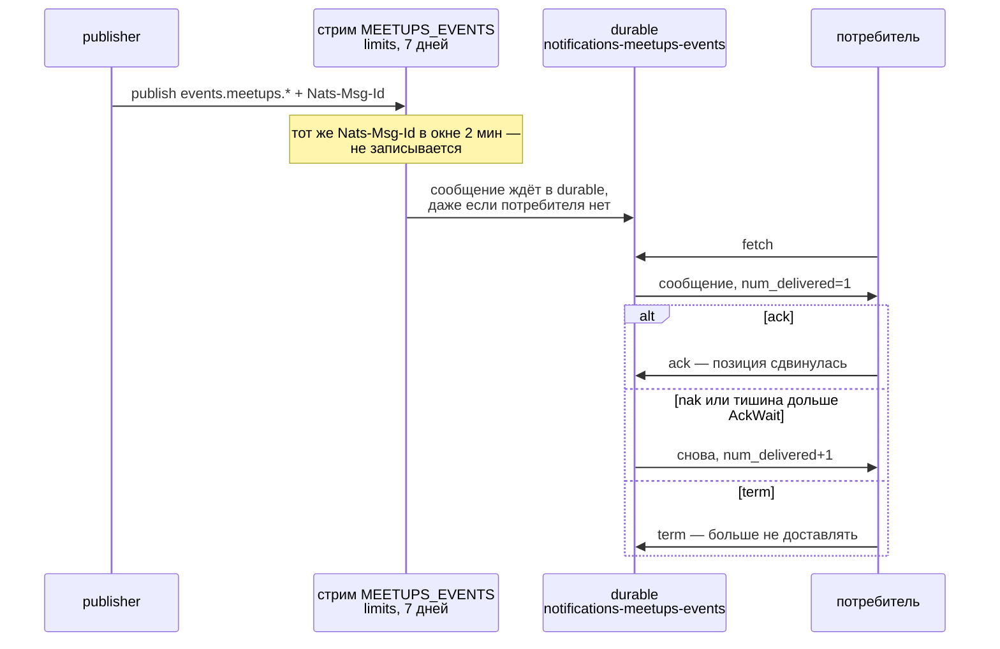

# JetStream: стримы, durable consumers и повторы

Шина репозитория — NATS, и до PER-208 она ничего не хранила: сообщение, которое никто не слушал в момент публикации, исчезало. Файл объясняет, что добавляет к этому JetStream — стрим как журнал, durable consumer как позицию на сервере, подтверждение и повторную доставку, — на коде топологии из `infra/apphost/Configuration/Infrastructure/JetStreamTopology.cs`, на команде `consume` из `tools/nats-tester/nats_tester/cli.py` и на выводе экспериментов против nats-server 2.10.29 из локального стека.

## Механика

### Core NATS не хранит, JetStream хранит то, что попало в стрим

У NATS два слоя. Core NATS — рассылка по subject: сервер отдаёт сообщение тем, кто подписан прямо сейчас, и забывает его. Аналог из .NET — не очередь, а событие C#: нет подписчика — вызов ушёл в пустоту. JetStream — слой хранения поверх того же сервера: **стрим** перехватывает публикации на заданные subjects и пишет их в журнал.

Стрим объявляется фильтром subjects, а не одним именем:

```csharp
new("MEETUPS_EVENTS", "events.meetups.>"),
new("IDENTITY_EVENTS", "events.identity.>"),
```

`>` — многоуровневый wildcard: `events.meetups.>` ловит `events.meetups.meetup_created` и любой другой повод домена. Поэтому новый повод в словаре Meetups не требует нового стрима.

Что вне стрима — не хранится. Проверено: обычный `nc.publish` на `events.notifications.notification_created`, для которого стрима нет, не меняет счётчик сообщений ни одного стрима, а публикация того же через JetStream-клиент (`js.publish`) падает `NoStreamResponseError` — хранить некому, и JetStream-клиент об этом узнаёт, потому что ждёт подтверждения записи.

### Retention: кто решает, когда сообщение удаляется

У стрима три политики хранения, и они отвечают на вопрос «когда сообщение можно удалить»:

- `limits` — по лимитам: возраст, число, объём. Потребители на хранение не влияют.
- `interest` — пока есть consumer, которому сообщение ещё не подтверждено. Нет consumers — хранить не для кого.
- `workqueue` — очередь заданий: сообщение удаляется, как только его подтвердил кто-то один.

Топология берёт `limits` с `MaxAge` 7 дней. Причина видна в эксперименте: стрим с `interest` без единого consumer принял публикацию (`pub seq=1`) и хранит `0` сообщений, а такой же стрим с `limits` хранит `1`. Для шины, где durable объявляется заранее, а сервис-потребитель появится позже, `interest` означал бы «если объявление durable опоздало — события потеряны».

### Durable consumer: позиция чтения живёт на сервере

Consumer — это курсор по стриму. Если у курсора есть имя (`DurableName`), сервер хранит его состояние: что выдано, что подтверждено. Клиент, переподключившись под тем же именем, продолжает с места, а не с начала. В .NET ближайший аналог — consumer group в Kafka с закоммиченным offset, но с двумя отличиями: позицию ведёт сам сервер по подтверждениям, а не клиент коммитом, и подтверждается каждое сообщение отдельно, а не смещение.

```csharp
public static ConsumerConfig ToConfig(ConsumerSpec spec) =>
    new(spec.Durable)
    {
        FilterSubject = spec.FilterSubject,
        AckPolicy = ConsumerConfigAckPolicy.Explicit,
        DeliverPolicy = ConsumerConfigDeliverPolicy.All,
    };
```

`DeliverPolicy.All` — начинать с первого сообщения стрима. Оно работает в паре с тем, что durable создаёт топология, а не сам сервис: durable существует раньше потребителя и копит всё, что пришло до его первого старта. В живом прогоне так и вышло: у `notifications-meetups-events`, для которого Notifications ещё не написан, `pending 4`.

Consumer бывает push (сервер сам шлёт сообщения на subject доставки) и pull (клиент просит пачку). Топология создаёт pull: в эксперименте у durable `deliver_subject` пуст. Pull-клиент в `nats-tester`:

```python
sub = await js.pull_subscribe_bind(durable=durable, stream=stream)
messages = await sub.fetch(10, timeout=1)
```

`pull_subscribe_bind` привязывается к существующему durable и **не** создаёт его — ровно правило «сервис не заводит свой durable». Два клиента на одном durable делят поток, а не получают копию: в эксперименте первый `fetch(1)` отдал `learn.limits.b`, второй — `learn.limits.c`. Копию получает второй durable, поэтому у `nats-tester` свой.

### Подтверждение, AckWait и повторная доставка

При `AckPolicy.Explicit` каждое выданное сообщение ждёт ответа клиента. Ответов три, и они различаются тем, что сервер делает дальше. Проверено на временном durable с `AckWait` 2 секунды:

| Что сделал клиент | Что сделал сервер | Наблюдение |
|---|---|---|
| `ack` | сообщение обработано, позиция сдвинулась | повторно не приходит |
| `nak` | вернуть сейчас | следующий `fetch` отдал его с `num_delivered=2` |
| ничего за `AckWait` | вернуть по таймауту | после паузы 3 с — `num_delivered=3` |
| `term` | больше не доставлять | следующий `fetch` ничего не получил |

Отсюда два следствия для кода. Потребитель обязан быть готов к повтору: сообщение, обработанное, но не подтверждённое из-за падения, вернётся. И битое сообщение нельзя оставлять без ответа: у durable топологии `MaxDeliver=-1` (без предела, проверено `consumer_info`), поэтому неподтверждённое возвращалось бы вечно. `consume` отвечает на него `term`:

```python
except DecodeError as e:
    rejected += 1
    click.secho(f"⛔ #{sequence} {msg.subject} undecodable, terminated: {e}", fg='red')
    await msg.term()
    continue
```

Повтор, распознанный по `event_id`, получает `ack`, а не `term`: он обработан — узнан и пропущен.

### Дедупликация на сервере: `Nats-Msg-Id` и окно

Стрим помнит заголовок `Nats-Msg-Id` публикаций за `DuplicateWindow` и вторую публикацию с тем же значением не записывает. В живом прогоне четыре публикации одного события дали три сообщения: вторая с тем же `Nats-Msg-Id` отброшена, третья без заголовка (`--no-msg-id`) записана.

Окно ловит только повтор **публикации** и только в пределах окна — две минуты по умолчанию и в топологии. Повторную **доставку** потребителю после потерянного `ack` оно не ловит вовсе: сообщение в стриме одно, его просто выдают снова. Поэтому гарантию даёт потребитель по `event_id` из конверта, а окно — дешёвая оптимизация против самого частого повтора: релей отправил и упал до отметки «отправлено».

### Конфигурация живого стрима меняется не вся

`CreateOrUpdateStreamAsync` и `CreateOrUpdateConsumerAsync` идемпотентны: тот же конфиг при повторном старте — не изменение. Но часть полей сервер менять отказывается. Проверено на 2.10.29:

- storage стрима `memory` → `file`: `stream configuration update can not change storage type` (10052);
- retention `limits` → `workqueue`: `can not change retention policy to/from workqueue` (10052);
- retention `limits` → `interest`: принято;
- deliver policy durable `all` → `new`: `deliver policy can not be updated` (10012);
- `AckWait` durable: принято.

Для локального стека это значит: такую правку таблицы топологии применение не переживёт, и лечится она удалением тома NATS вместе с сообщениями. В проде тот же отказ означал бы миграцию стрима, а не правку строки.

## Урок

- «Сообщение не потеряется» складывается из трёх независимых настроек: стрим ловит subject, retention хранит без потребителей, durable существует раньше потребителя. Выпадение любой из трёх теряет события молча — поэтому проверяется прогоном, а не чтением конфига.
- At-least-once — не свойство, которое можно отключить, а следствие подтверждений: любой брокер с ack возвращает неподтверждённое. Идемпотентность потребителя по ключу из конверта нужна в любом стеке, серверная дедупликация её только разгружает.
- Сообщение, которое потребитель никогда не сможет обработать, требует явного ответа «больше не надо» (`term`, dead-letter), иначе повторная доставка превращает одну ошибку в бесконечный цикл.
- Идемпотентное «создать или обновить» идемпотентно только на неизменяемом конфиге. Что сервер менять не даёт, выясняется экспериментом до того, как на это опереться.

## Почему так, а не иначе

- **Стрим на каждый subject.** Цена: число стримов растёт вместе со словарём поводов, а durable потребителя пришлось бы заводить на каждый. Один стрим на домен с фильтром `>` дал ту же фильтрацию одной строкой.
- **Retention `interest`.** Цена: сообщение, опубликованное до объявления durable, не хранится — в эксперименте `0` сообщений. Отвергнуто.
- **Push consumer.** Цена: сервер сам шлёт с заданной скоростью, и управление потоком ложится на клиента; pull отдаёт столько, сколько клиент попросил, и естественно делится между экземплярами одного durable.
- **Durable создаёт сам потребитель.** Цена: события до первого старта сервиса ему не достаются, а настройки шины расходятся по языкам сервисов. Выбор записан в [ADR-050](../../decisions/ADR-050-jetstream-topology-owned-by-platform.md).
- **Только серверная дедупликация.** Цена: не ловит повторную доставку и повтор после окна. Отвергнуто; окно оставлено оптимизацией.

## Схема



## Первоисточники

- [JetStream concepts: streams](https://docs.nats.io/nats-concepts/jetstream/streams) — retention, лимиты, `DuplicateWindow`; зачем идти: определения политик, на которых стоит выбор `limits`.
- [Consumer Details](https://docs.nats.io/using-nats/developer/develop_jetstream/consumers) — durable, push и pull, `AckPolicy`, `DeliverPolicy`, `AckWait`, `MaxDeliver`; зачем идти: полная таблица настроек durable, из которой топология берёт четыре.
- [Ack responses and redelivery](https://docs.nats.io/learn/jetstream/acknowledgment) — `ack`, `nak`, `term` и `in progress`; зачем идти: семантика ответов потребителя из таблицы выше и почему `term` — ответ на сообщение, которое не обработать никогда.
- [ADR-050](../../decisions/ADR-050-jetstream-topology-owned-by-platform.md) и раздел [JetStream](../../architecture/integration.md#jetstream) каталога интеграций; зачем идти: какие стримы и durable приняты и почему — этот разбор их объясняет, а не задаёт.

## Проверь себя

Все команды — против локального стека: `aspire start --isolated --apphost infra/apphost/AppHost.csproj -- --profile infra`, адрес шины — по [README nats-tester](../../../tools/nats-tester/README.md#проверка-топологии-jetstream).

1. **Сколько сообщений окажется в стриме после двух `nats-tester publish` одного файла подряд, а сколько после третьего с `--no-msg-id`?** Ответ: одно и два — второй отбросило окно `Nats-Msg-Id`. Проверка: `nats-tester streams`, строка `messages`.
2. **Что покажет `consume --drain`, запущенный дважды подряд без новых публикаций?** Ответ: второй запуск — `Applied 0`: позиция подтверждена на сервере. Проверка: сама команда.
3. **Какие `AckWait` и `MaxDeliver` у durable топологии?** Ответ: 30 секунд и `-1` — умолчания сервера, топология их не задаёт. Проверка: `nats consumer info MEETUPS_EVENTS nats-tester-meetups-events`.
4. **Можно ли поменять в таблице `DeliverPolicy` на `New` и перезапустить AppHost на том же томе?** Ответ: нет — сервер ответит `deliver policy can not be updated` (проверено экспериментом на временном durable), а `NatsSetup` запишет в лог узла `nats` строку `JetStream topology was not applied`. Сама ветка лога живым прогоном ещё не вызывалась — проверь сам: правка строки, перезапуск на том же томе, `aspire logs nats`.
