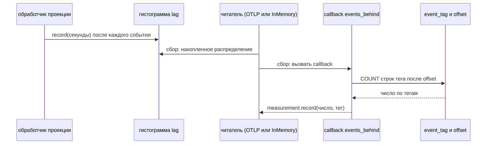

# Метрики OpenTelemetry: синхронный и наблюдаемый инструмент, autoconfigure и чтение в тесте

Разбор объясняет, как `apps/auction` отдаёт отставание проекции метриками по OTLP: чем гистограмма, в которую пишет код, отличается от gauge, который SDK сам опрашивает при сборе, откуда SDK берёт адрес коллектора и как тест читает метрики без коллектора. Читателю не нужно знать OpenTelemetry. Достаточно представлять счётчики и гистограммы вообще — например, `System.Diagnostics.Metrics` в .NET.

Трейсы, спаны и разделение API и SDK разобраны в [tracing.md](tracing.md): здесь те же провайдер и no-op, только для метрик. Что такое отставание проекции и откуда оно берётся — в [../scala/pekko-projection.md](../scala/pekko-projection.md).

Опора:
- срез PER-324: `apps/auction/src/main/scala/auction/telemetry/Telemetry.scala` и `ProjectionMetrics.scala`, `LotProjection.backlog`, тесты `ProjectionMetricsSpec`, `TelemetrySpec` и метрика в `LotProjectionIntegrationSpec`;
- исходник `opentelemetry-sdk-extension-autoconfigure-1.66.0-sources.jar`, `AutoConfiguredOpenTelemetrySdkBuilder.java`, и `DefaultConfigProperties.java` из `-spi`.

## Механика

### Meter и инструменты

Метрики создаются через **meter** — фабрику инструментов с именем библиотеки (`telemetry.getMeter("auction")`). Инструмент — именованный поток измерений с единицей и атрибутами. Атрибуты — пары «ключ — значение», по которым бэкенд режет ряд. Здесь это имя проекции и тег:

```scala
private def attributes(projection: String, tag: String): Attributes =
  Attributes.of(ProjectionKey, projection, TagKey, tag)
```

Аналог в .NET — `Meter` и `Histogram<T>` из `System.Diagnostics.Metrics`, атрибуты там называются tags. Отличие: в .NET инструменты живут в BCL, и OpenTelemetry их только слушает, а в Java инструмент создаётся через API OpenTelemetry напрямую.

### Синхронный инструмент: пишет код

Гистограмма `auction.projection.lag` синхронная: значение записывает код в момент события. Проекция вызывает её из наблюдателя после обработки каждого события:

```scala
override def afterProcess(projectionId: ProjectionId, envelope: Envelope): Unit = {
  val seconds = math.max(0L, clock.millis() - writtenAt(envelope)) / 1000.0
  lag.record(seconds, attributes(projectionId.name, projectionId.key))
}
```

Свойство синхронного инструмента: нет событий — нет измерений. Застрявшая проекция ничего не обрабатывает, и гистограмма молчит ровно тогда, когда отставание растёт.

### Наблюдаемый инструмент: спрашивает SDK

Gauge `auction.projection.events_behind` наблюдаемый (observable). Код не пишет в него, а регистрирует callback, и SDK вызывает его сам в момент сбора метрик:

```scala
meter
  .gaugeBuilder("auction.projection.events_behind")
  .ofLongs()
  .buildWithCallback { measurement =>
    try read().foreach((tag, behind) => measurement.record(behind, attributes(projection, tag)))
    catch { case NonFatal(cause) => logger.warn("auction projection backlog not measured", cause) }
  }
```

Здесь callback считает строки `event_tag` после offset каждого тега запросом к базе. Поэтому застрявшая проекция видна: события копятся, offset стоит, и значение растёт без единого вызова обработчика. Callback исполняется на потоке сбора, поэтому запрос ограничен таймаутом `auction.projection.backlog-timeout`, а исключение ловится внутри. Если базы нет, пропадает одно наблюдение, а не экспорт всех метрик.

Аналог в .NET — `ObservableGauge<T>` с делегатом. Механика та же: значение берётся по требованию, а не накапливается.

### Autoconfigure: настройка из `OTEL_*`

`AutoConfiguredOpenTelemetrySdk` собирает SDK из стандартных переменных окружения: `OTEL_EXPORTER_OTLP_ENDPOINT`, `OTEL_SERVICE_NAME`, `OTEL_METRICS_EXPORTER` и других. Их подставляет AppHost (`WithOtlpExporter()`), и код адреса коллектора не знает. Свои умолчания сервис передаёт через `addPropertiesSupplier`:

```scala
Map(
  "otel.service.name" -> "auction",
  "otel.traces.exporter" -> "none",
  "otel.logs.exporter" -> "none",
  "otel.metrics.exporter" -> (if (environment.contains("OTEL_EXPORTER_OTLP_ENDPOINT")) "otlp" else "none")
)
```

Приоритет задан в javadoc `addPropertiesSupplier`: «system properties > environment variables > the suppliers registered with this method». Умолчание сервиса перекрывается любой переменной окружения. Без коллектора экспорт метрик выключен, и процесс, запущенный вне AppHost, не пишет в лог отказ каждого экспорта.

### Чтение в тесте: `InMemoryMetricReader`

Тесту коллектор не нужен. `InMemoryMetricReader` из `opentelemetry-sdk-testing` регистрируется в `SdkMeterProvider` как читатель, и `collectAllMetrics()` делает то же, что делает экспорт: опрашивает все инструменты, включая callback наблюдаемых.

```scala
val reader = InMemoryMetricReader.create()
val provider = SdkMeterProvider.builder().registerMetricReader(reader).build()
```

Отсюда два следствия, которые проверяют тесты. Callback наблюдаемого gauge вызывается на каждом `collectAllMetrics`, поэтому L1-тест видит, как `events_behind` растёт при сломанном обработчике и падает до нуля после починки. Если callback бросил исключение, метрики в сборе нет совсем («skips one observation when the backlog cannot be read»).

## Урок

- Метрика «сколько осталось» должна быть наблюдаемой и считаться от источника, а не от работы обработчика. Метрика, которую пишет сам обработчик, слепа ровно в случае поломки обработчика.
- Синхронный инструмент хорош для распределения задержек, наблюдаемый — для состояния. Для отставания нужны оба: одно показывает, что проекция стоит, другое — насколько она медленная, когда идёт.
- Callback наблюдаемого инструмента — чужой поток и чужой бюджет времени. Он ограничивается таймаутом и не бросает исключений наружу.

## Почему так, а не иначе

- **Только гистограмма задержки.** Дёшево и без запроса к базе. Цена — застрявшая проекция выглядит как отсутствие данных.
- **Gauge как разность номеров `ordering`.** Так было в первой версии: «голова тега минус offset». Но `ordering` общий для всех тегов, и разность включала события чужих тегов. Ревью корректности это нашло, теперь считаются строки тега.
- **Java-агент OpenTelemetry вместо SDK в коде.** Автоинструментирование без кода, но агент меняет запуск JVM, а узел Aspire стартует голой `java` с classpath. Агент тяжелее, чем одна метрика, и всё равно не знает, что такое отставание проекции.
- **Prometheus-эндпоинт вместо OTLP.** ADR-053 закрепляет OTLP без вендорского SDK, и остальные сервисы уже говорят на нём.

## Схема



## Первоисточники

- [OpenTelemetry Metrics API](https://opentelemetry.io/docs/specs/otel/metrics/api/) — синхронные и асинхронные (наблюдаемые) инструменты, callback и когда его вызывают.
- [SDK autoconfigure](https://opentelemetry.io/docs/languages/java/configuration/) — переменные `OTEL_*` и их значения по умолчанию.
- `opentelemetry-sdk-extension-autoconfigure-1.66.0-sources.jar`, `AutoConfiguredOpenTelemetrySdkBuilder.addPropertiesSupplier` — приоритет системных свойств, окружения и умолчаний.
- [ADR-053](../../decisions/ADR-053-production-observability-otlp-better-stack.md) — почему OTLP и коллектор, а не SDK вендора.

## Проверь себя

1. Что покажет `events_behind`, если обработчик проекции падает на каждом событии? *Ответ: растущее число событий тега. Проверка: тест «shows the events it has not processed as the backlog metric» в `LotProjectionIntegrationSpec`.*
2. Что покажет гистограмма `lag` в том же случае? *Ответ: ничего нового — `afterProcess` не вызывается. Проверка: `grep -n "afterProcess" apps/auction/src/main/scala/auction/telemetry/ProjectionMetrics.scala` — запись только там.*
3. Будут ли экспортироваться метрики, если сервис запущен без `OTEL_EXPORTER_OTLP_ENDPOINT`, но с `OTEL_METRICS_EXPORTER=otlp`? *Ответ: да, окружение перекрывает умолчание сервиса. Проверь сам, когда будет чем: запуск `just auction-run` с этой переменной и коллектором на `localhost:4317`.*
4. Почему `events_behind` не теряет тег без новых событий? *Ответ: `ProjectionBacklog.behind` дополняет отсутствующие теги нулём. Проверка: тест «reports zero for a tag with nothing past its offset» в `ProjectionBacklogSpec`.*
