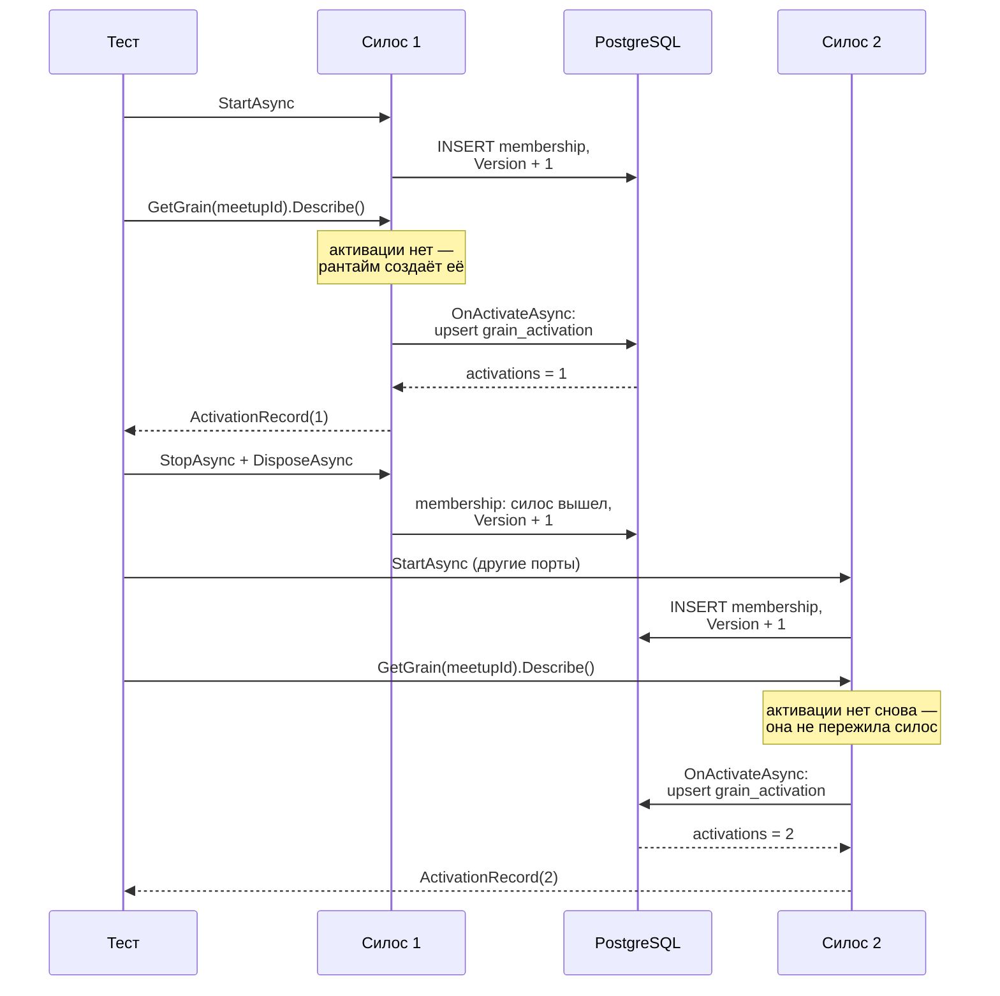

# Orleans: грины и кластер

Notifications (`apps/notifications/`) — первый сервис репозитория на Orleans. Файл объясняет, что такое виртуальный актор, кто решает, где и когда он живёт, и почему скелет сервиса включает ровно один провайдер из трёх возможных. За что отвечает сервис — в [notifications.md](../../services/notifications.md), почему выбран этот стек — в [ADR-029](../../decisions/ADR-029-notifications-orleans-stack.md), почему задание гранулярно по сходке — в [ADR-028](../../decisions/ADR-028-notifications-subscriptions-replica-and-delivery-boundary.md). Механика самой PostgreSQL, на которую здесь всё опирается, разобрана отдельно: [схема](../postgresql/schema.md) и [конкурентность](../postgresql/concurrency.md).

Читателю достаточно знать .NET. Ни одного примитива Orleans здесь не предполагается известным.

## Механика

### Грин существует всегда; рантайм создаёт не его, а активацию

Это первое место, где интуиция из обычного .NET ломается, и ломается целиком.

```csharp
public interface IMeetupNotificationGrain : IGrainWithStringKey
{
    Task<ActivationRecord> Describe();
}
```

```csharp
silo.Grains.GetGrain<IMeetupNotificationGrain>(meetupId)
```

`GetGrain` ничего не создаёт, никуда не ходит и не может вернуть `null` или «не найдено». Он собирает **ссылку** — прокси, у которого внутри только тип интерфейса и ключ. Грин с любым ключом существует по определению, как существует любой URL: вопрос не в том, есть ли он, а в том, есть ли у него прямо сейчас **активация** — живой экземпляр класса в памяти какого-то силоса.

Ближайший аналог в .NET — не синглтон в DI и не `new`. Ближе всего типизированный клиент к удалённому ресурсу: у тебя есть адрес, ресурс по адресу существует независимо от того, держишь ли ты ссылку, и обращение к нему может оказаться первым за сутки. Отличие в том, что за адресом не фиксированный сервер, а рантайм: он сам выбирает силос и сам поднимает экземпляр под первое сообщение.

Практические следствия, которые стоит принять сразу:

- вопрос «а есть ли грин с таким ключом» бессмысленен — спрашивать можно только про состояние, которое грин хранит;
- вызывающая сторона не управляет временем жизни: ни создать, ни удалить грин нельзя;
- ссылку можно держать, передавать и сериализовать — она не «протухает» вместе с активацией.

### Первое сообщение поднимает активацию, и `OnActivateAsync` заканчивается раньше него

```csharp
public override async Task OnActivateAsync(CancellationToken cancellationToken)
{
    var key = this.GetPrimaryKeyString();
    record = await store.Record(key, silo.SiloAddress.ToString(), cancellationToken);
    ...
}

public Task<ActivationRecord> Describe() =>
    Task.FromResult(record ?? throw new InvalidOperationException("grain is not activated"));
```

Порядок здесь гарантирован рантаймом: сообщение доставляется в активацию только после того, как её `OnActivateAsync` успешно завершился. Если `OnActivateAsync` бросил, активации не возникает вовсе, и исключение приходит вызывающей стороне вместо ответа.

Отсюда любопытный побочный результат этого среза: `?? throw` в `Describe` — ветка, в которую невозможно попасть. Ревью справедливо назвало её мёртвой; она оставлена намеренно и как раз является отпечатком этой гарантии. Единственный способ увидеть её срабатывание — смена модели активации в будущей версии рантайма.

### Одно сообщение за раз: почему поле без блокировки — не недосмотр

```csharp
private ActivationRecord? record;
```

Поле изменяется в `OnActivateAsync` и читается в `Describe` без единого `lock`, и это корректно: рантайм исполняет сообщения одной активации **по одному**. Два вызова одного грина никогда не идут параллельно, даже если пришли с разных силосов.

Аналогия из .NET: как если бы вокруг каждого метода стоял `SemaphoreSlim(1, 1)`, разделяемый всеми методами экземпляра. Аналогия важнее для отличия, чем для сходства: из этого следует, что грин, который внутри своего метода дождётся ответа от самого себя, встанет навсегда — по умолчанию активация нереентерабельна. Здесь такого вызова нет, и на живом коде это не проверялось; правила планировщика — в [request scheduling](https://learn.microsoft.com/dotnet/orleans/grains/request-scheduling).

Второе следствие важнее: единица параллелизма в Orleans — не поток и не запрос, а **ключ**. Сервис масштабируется тем, что ключей много, а не тем, что у каждого грина много потоков.

### Ключ — это адрес, и адрес уникален на кластер

```csharp
var key = this.GetPrimaryKeyString();
```

Ключ приходит из ADR-028: одно задание на сходку, значит ключ — идентификатор сходки. Два разных ключа — два независимых грина, что срез и проверяет:

```csharp
first.Activations.ShouldBe(1);
second.Activations.ShouldBe(1);
```

Центральная гарантия рантайма формулируется так: у грина в каждый момент не больше одной активации на весь кластер. Именно она делает акторную модель полезной — два силоса не могут одновременно обрабатывать одну сходку, и «кто сейчас рассылает уведомления по этой сходке» не требует ни блокировки, ни очереди. Здешний срез эту гарантию не проверяет: оба силоса в тесте живут последовательно, а не одновременно. По документации — [grain placement](https://learn.microsoft.com/dotnet/orleans/grains/grain-placement).

### Активация смертна, и умирает она молча

Рантайм убирает активацию, которая слишком долго не получала сообщений. Порог — `CollectionAgeLimit`, по умолчанию два часа. Следующее обращение поднимет активацию заново, и `OnActivateAsync` выполнится ещё раз.

Отсюда честное ограничение этого среза: счётчик в `grain_activation` считает **активации**, а не рестарты кластера. Тест рестарта читает `Activations == 2` и трактует это как «состояние пережило хост» — что верно ровно до тех пор, пока между записью и чтением не проходит два часа. В тесте там миллисекунды, поэтому починка отложена, но само умолчание в коде не названо, и это записано в PR как оставшееся открытым.

Урок общий: **активация — это кэш, а не время жизни.** Всё, что обязано пережить простой, обязано лежать вне неё.

### Силос, кластер и два порта

Силос — процесс, в котором живут активации. Кластер — множество силосов, знающих друг о друге.

```csharp
options.ClusterId = "solguficky";   // имя кластера: общее для всех силосов развёртывания
options.ServiceId = "notifications"; // имя сервиса: переживает пересоздание кластера
```

```csharp
options.AdvertisedIPAddress = IPAddress.Loopback;
options.SiloPort = siloPort;       // умолчание 11111 — силос к силосу
options.GatewayPort = gatewayPort; // умолчание 30000 — внешние клиенты
```

Портов два, потому что трафика два рода: силосы общаются между собой (маршрутизация сообщений к активациям, обмен состоянием кластера), а внешние клиенты подключаются через шлюз. В Notifications клиент находится в том же процессе — gRPC-сервер и силос co-hosted, — но шлюз всё равно открывается: силос не знает, что снаружи к нему никто не придёт.

`AdvertisedIPAddress` — это не «на чём слушать», а «что записать о себе в таблицу кластера»: именно по этому адресу другие силосы будут стучаться. Петля выбрана потому, что Aspire поднимает сервис локальным процессом, а адрес переживает рестарт: объявленный адрес LAN после смены сети указывал бы в пустоту.

### Кластер узнаёт сам себя через таблицу, а не через свой протокол

Это самое интересное место вендорного скрипта. Таблиц две:

```sql
CREATE TABLE IF NOT EXISTS OrleansMembershipVersionTable
(
    DeploymentId varchar(150) NOT NULL,
    Timestamp timestamptz(3) NOT NULL DEFAULT now(),
    Version integer NOT NULL DEFAULT 0,
    CONSTRAINT PK_OrleansMembershipVersionTable_DeploymentId PRIMARY KEY(DeploymentId)
);
```

Одна строка на развёртывание — и в ней номер версии состава кластера. Рядом `OrleansMembershipTable`: строка на силос с адресом, портом, `Status`, `IAmAliveTime` и `SuspectTimes`.

Любое изменение состава — силос вошёл, вышел, объявлен мёртвым — обязано поднять версию, и поднимается она так:

```sql
UPDATE OrleansMembershipVersionTable
SET ... Version = Version + 1
WHERE DeploymentId = DeploymentIdArg
  AND Version = VersionArg AND VersionArg IS NOT NULL;
```

Это оптимистичная блокировка на одной строке. Силос читает состав вместе с версией, принимает решение и пытается записать его, указав прочитанную версию; если за это время состав изменил кто-то другой, `UPDATE` не заденет ни строки, и силос перечитает состав и повторит. Все изменения состава выстраиваются в одну последовательность, потому что все проходят через одну строку.

Практический смысл: **рантайм не несёт собственного протокола консенсуса — он берёт его взаймы у базы.** Отсюда прямое следствие для этого сервиса: силос без PostgreSQL — не силос, и то, что хост Notifications не поднимается без базы, не упущение, а форма этой зависимости.

Живость определяется отдельно от состава: силос периодически обновляет свой `IAmAliveTime`, а соседи, не дождавшись обновления, записывают подозрение в `SuspectTimes`. Мёртвым силос объявляется по голосам соседей, а не по одному наблюдателю, — иначе сетевая икота у одного узла выбрасывала бы из кластера здоровый.

### Силос узнаётся по адресу, а не по строке в таблице: «то же поколение» против «тот же силос»

Адрес силоса — это не только `IP:порт`. К ним добавлено **поколение**: число, которое силос выбирает при старте. Два процесса, поднятые на одном порту один после другого, дают два разных `SiloAddress` с одинаковым endpoint и разными поколениями. Отсюда два разных сравнения в рантайме, и различие между ними несущее:

```csharp
public bool Equals(SiloAddress? other)
    => other != null && Generation == other.Generation
       && Endpoint.Address.Equals(other.Endpoint.Address) && Endpoint.Port == other.Endpoint.Port;

internal bool IsSameLogicalSilo(SiloAddress? other)
    => other != null && Endpoint.Address.Equals(other.Endpoint.Address) && Endpoint.Port == other.Endpoint.Port;
```

`Equals` отвечает «это тот же запуск», `IsSameLogicalSilo` — «это то же место в кластере, возможно, прошлая жизнь». Аналогия из .NET: первое похоже на сравнение по ссылке, второе — на сравнение по ключу сущности, у которой сменилась версия.

Дальше это различие решает судьбу рестарта. Входя в кластер, силос **пингует все записи в состоянии `Active`** и без ответа не входит, но записи того же логического силоса из проверки исключает:

```csharp
foreach (var item in this.membershipManager.CurrentSnapshot.Entries)
{
    var entry = item.Value;
    if (entry.Status != SiloStatus.Active) continue;
    if (entry.SiloAddress.IsSameLogicalSilo(this.localSilo.SiloAddress)) continue;

    activeSilos.Add(entry.SiloAddress);
}
```

Теперь соберём это с тем, что делает неснятое падение. Штатная остановка закрывает запись сама — силос переводит себя в `Dead`. Убитый процесс не закрывает ничего, и его строка остаётся `Active`: в таблице висит силос, которого нет.

Рестарт **на прежнем адресе** проходит: мертвец — тот же логический силос, поэтому из проверки связности он исключён. Дальше его добивает отдельный механизм, который Orleans называет временным парадоксом:

```csharp
// Temporal paradox - There is an older clone of this silo in the membership table
if (siloAddress.Generation < myAddress.Generation)
{
    // Declare older clone of me as Dead.
    silosToDeclareDead.Add(tuple);
}
else if (siloAddress.Generation > myAddress.Generation)
{
    // I am the older clone - Newer version of me should survive - I need to kill myself
```

То есть преемник объявляет предшественника мёртвым сам, потому что узнаёт его по endpoint, а себя отличает по поколению.

Рестарт **на новом порту** не проходит. Это уже другой логический силос, мертвец из проверки не исключается, ответа не даёт, и попытки идут до `MaxJoinAttemptTime` — по умолчанию пять минут, с паузой в `ProbeTimeout`:

```
OrleansClusterConnectivityCheckFailedException: Failed to get ping responses from 1 of 1 active silos.
Newly joining silos validate connectivity with all active silos before joining the cluster.
```

Отключить проверку в Orleans 10 нечем: флаг `ValidateInitialConnectivity` в `ClusterMembershipOptions` был в третьей версии и исчез к седьмой (проверено по исходникам на тегах `v3.7.2` и `v7.2.6`; как проверить самому — в «Проверь себя»). Вопрос поэтому переносится с конфигурации на адрес силоса, и это не обходной путь, а единственный имеющийся.

Практический вывод неожиданно приземлённый: **устойчивость односилосного развёртывания к падению держится на постоянстве порта.** Пока порты штатные и не меняются, восстановление работает само и выглядит как «ничего не потребовалось». Стоит раздать силосу случайный свободный порт — приём, совершенно нормальный для тестов и параллельных прогонов, — и сервис после падения не поднимается пять минут, а потом падает совсем.

### `OrleansQuery`: провайдер, у которого SQL лежит в данных

Ожидание «рантайм знает свой SQL» здесь неверно. Orleans читает тексты запросов из таблицы `OrleansQuery` по ключу:

```sql
INSERT INTO OrleansQuery(QueryKey, QueryText)
VALUES ('UpdateIAmAlivetimeKey', '...')
```

Так один и тот же провайдер работает с PostgreSQL, SQL Server, MySQL и Oracle: диалект живёт в строках таблицы, а не в коде. Строка `Invariant = "Npgsql"` выбирает только фабрику соединений — `DbProviderFactory`, которую рантайм находит рефлексией по имени; отдельно регистрировать `NpgsqlFactory` не требуется, и то, что интеграционные тесты этого среза поднимают кластер, это подтверждает.

Отсюда же — почему адаптация вендорного скрипта под идемпотентность потребовала именно `DO UPDATE`:

```sql
ON CONFLICT (QueryKey) DO UPDATE SET QueryText = EXCLUDED.QueryText
```

Без `ON CONFLICT` второй прогон падает на первичном ключе. С `DO NOTHING` он прошёл бы молча и оставил **старый текст запроса** — то есть апгрейд Orleans применился бы к таблицам и не применился к запросам. Это тот случай, когда «тихо ничего не делать» опаснее отказа.

### Провайдеры — opt-in, и у каждого отсутствия своя форма отказа

Провайдеров тут может быть три: кластеризация (состав кластера), grain storage (состояние гринов) и reminders (устойчивые напоминания). Скелет регистрировал один — кластеризацию; вместе с напоминанием приехал второй:

```csharp
silo.UseAdoNetClustering(options =>
{
    options.Invariant = AdoNetInvariant;
    options.ConnectionString = connectionString;
});

silo.UseAdoNetReminderService(options =>
{
    options.Invariant = AdoNetInvariant;
    options.ConnectionString = connectionString;
});
```

Grain storage не зарегистрирован по-прежнему, и линия между ним и reminders проходит не по строгости, а по тому, **что именно провайдер хранит**. Grain storage хранил бы состояние грина — то есть завёл бы вторую модель источника истины рядом с таблицами сервиса. Reminder хранит другое: когда разбудить грин. Момент при этом всё равно лежит строкой в своей таблице, и потеря reminder'а стоит задержки до ближайшего прохода планировщика, а не потерянного напоминания. Правило «источник истины в PostgreSQL» первое нарушает, второе — нет.

Отсутствие grain storage — решение ADR-029 в исполнимой форме: источник истины остаётся в PostgreSQL, и завести вторую модель состояния незаметно нельзя. Но **форма отказа оказалась не той, которую я записал**, и это стоит знать точно.

Проверено экспериментом: в грин добавлен `[PersistentState("probe", "probe-store")]`, прогнаны интеграционные тесты, правка откачена. Результат:

```
info: Orleans.Hosting.SiloHostedService[1628589225]
      Orleans Silo started.
info: Microsoft.Hosting.Lifetime[14]
      Now listening on: http://127.0.0.1:64267
...
System.InvalidOperationException : Failed to create an instance of grain type 'Notifications.Grains.MeetupNotificationGrain'.
 ---- Orleans.Storage.BadProviderConfigException : No storage provider named "probe-store" found loading grain type meetupnotification
      в Orleans.Runtime.PersistentStateFactory.Create[TState](IGrainContext context, IPersistentStateConfiguration cfg)
```

Силос стартовал, порт открыл, пробу готовности прошёл. Упала **первая активация грина**, и только этого типа. Причина видна в стеке: `[PersistentState]` — это facet, провайдер для него ищется **по строковому имени в момент создания экземпляра**, а не по типу при построении контейнера. Валидация DI сюда не достаёт: с её точки зрения зависимость разрешена, потому что фабрика зарегистрирована.

Отсюда точная формулировка гейта: правило исполнимо не потому, что сервис не запустится, а потому, что интеграционный тест активирует грин. Без такого теста ошибка конфигурации доехала бы до первого настоящего уведомления, причём на сервисе, который по всем пробам здоров.

### Сериализация: `[GenerateSerializer]` и `[Id(n)]`

```csharp
[GenerateSerializer]
public sealed record ActivationRecord(
    [property: Id(0)] string GrainKey,
    [property: Id(1)] string Silo,
    [property: Id(2)] long Activations,
    [property: Id(3)] DateTimeOffset ObservedAt);
```

У Orleans свой сериализатор, устойчивый к версиям, и номера в `[Id(n)]` — это контракт на проводе, ровно как номера полей в Protobuf ([разбор соседней темы](../protobuf/enum-openness.md)). Переименование свойства безопасно, перестановка или переиспользование номера — нет: старый силос прочитает поле по номеру и положит в другое свойство.

Атрибут обязателен даже там, где оба силоса живут в одном процессе, как в тесте рестарта. Ссылка на грин не знает, где окажется активация: для удалённого вызова аргумент сериализуется, для локального рантайм делает копию, и в обоих случаях тип должен быть известен генератору кода. Забытый атрибут даёт отказ на вызове, а не на сборке.

## Урок

Первое и главное — **кто владеет временем жизни.** В Orleans им владеет рантайм: ты называешь ключ, он решает, где и когда поднять активацию и когда её убрать. Это противоположно модели, где актор явно порождается родителем и родителем же надзирается. Различие не стилистическое, оно определяет, каких понятий в системе не будет: у виртуального актора нет «не найден», нет дерева супервизии и нет стратегии перезапуска — но нет и способа сказать «этот актор больше не нужен». Выбор между двумя моделями и есть выбор, кто отвечает за время жизни; при следующей встрече с акторным рантаймом это первый вопрос, а не последний.

Второе переносится дальше Orleans: **запрет исполним только тогда, когда названа форма отказа и проверка, которая её ловит.** «Провайдер не зарегистрирован, значит нарушение упадёт» — это гипотеза до тех пор, пока не выяснено, где именно упадёт. Здесь разница между «не стартует сервис» и «не активируется грин» — это разница между отказом в деплое и здоровым сервисом, который не работает. Общее правило: там, где фреймворк разрешает зависимость **по имени в момент использования**, а не по типу при старте, ошибка конфигурации превращается в отказ первого обращения, и гейтом становится тест, а не запуск.

Третье — **идентичность узла в распределённой системе почти никогда не совпадает с идентичностью его процесса, и путать их дорого.** Здесь у силоса два сравнения: одно отвечает «тот же запуск», другое «то же место в кластере». Восстановление после падения держится на втором, и потому оно молча зависит от постоянства адреса — свойства, которое нигде не объявлено требованием и легко теряется при первой же попытке раздать порт динамически. Приём переносится за пределы Orleans: у всякого узла, который перезапускается и должен быть узнан как прежний, есть такая пара «личность» и «место», и стоит один раз спросить, какая из них держит восстановление. Ответ обычно определяет, что нельзя делать случайным.

Четвёртое — **отказ, воспроизводимый только настоящим убийством процесса, стоит настоящего убийства процесса.** Тест, который останавливает хост штатно, проверяет другой сценарий и об этом не сообщает: запись о выходе закрыта, а значит и восстанавливаться не из чего. Разница между «остановили» и «упал» видна ровно в одном месте — в том, осталась ли запись живой, — и утверждение об этом обязано стоять в тесте, иначе он незаметно вырождается в копию соседнего.

Пятое — **консенсус можно взять взаймы у хранилища.** Последовательность согласованных состояний кластера здесь держится на оптимистичной блокировке одной строки, без собственного протокола в рантайме. Приём переносится на выбор лидера и на «ровно один исполнитель» в любом сервисе: одна строка с версией, `UPDATE ... WHERE version = @version`, повтор при нуле затронутых строк. Цена честная и её надо называть вслух: хранилище становится зависимостью не только по данным, но и по живости.

## Почему так, а не иначе

**Кластеризация на ADO.NET против `UseLocalhostClustering`.** Для одного силоса на машине разработчика хватило бы localhost-кластеризации, и она не требует ни таблиц, ни вендоринга. Отвергнута из-за критерия приёмки: при ней состав кластера живёт в памяти процесса, и «грин переживает рестарт кластера» становится неотличимо от «переменная переживает вызов метода». Таблица membership — единственное, что делает эти два утверждения разными.

**Без grain storage.** Регистрация провайдера дала бы `[PersistentState]` и сняла бы ручной Dapper. Отвергнуто по ADR-029: два места, где живёт состояние сходки, расходятся молча, а ловить расхождение пришлось бы на review каждой следующей задачи. Цена решения — доступ к данным пишется руками; выгода — нарушение имеет форму исключения, а не разночтения.

**Reminders отложены до первого напоминания, а потом взяты.** В скелете они убраны после второго мнения: он не заводил ни одного напоминания, а вендорить пришлось бы два лишних скрипта. Вместе с заданием напоминания провайдер зарегистрирован — но только как механизм пробуждения. Альтернатива, от которой отказались тогда же, звучит соблазнительно: хранить момент срабатывания **в самом reminder'е** и не заводить своей таблицы вовсе. Отвергнуто по ADR-029, и причина не в чистоте слоёв: reminder хранит определение напоминания, а не факт срабатывания, поэтому тик, пришедшийся на простой кластера, не догоняется — приходит только следующий по периоду. Для напоминания за сутки «следующий период» смысла не имеет: сходка уже началась. Отсюда обязательный проход по таблице, который ADR называет условием корректности, а не оптимизацией.

**Свободный порт в тесте против прежнего порта.** Тестам удобно брать случайный свободный порт: так параллельные прогоны и соседние рабочие деревья не дерутся за штатные 11111 и 30000, и весь остальной набор так и устроен. Для сценария «силос упал и поднялся» это оказалось неверным по существу — на новом порту поднимается **другой логический силос**, и он честно ждёт ответа от мертвеца пять минут. Прежний адрес здесь не подгонка под зелёный тест, а воспроизведение того, что делает настоящий рестарт: в развёртывании порт постоянный. Цена — тест обязан явно передать порты убитого процесса, и это стоит комментария в самом тесте, иначе следующая правка вернёт свежие порты как «единообразие». Позже ([PER-367](https://linear.app/anticnvm/issue/per-367)) это стало видно и по API фикстуры: свежие порты с повтором старта выдают `SiloUnderTest.Start`, а прежний адрес занимает отдельный `SiloUnderTest.StartAt` ровно одной попыткой — повтор на новом порту подменил бы сценарий.

**`Orleans.TestingHost` отвергнут.** Штатный способ тестировать Orleans — поднять тестовый кластер его фикстурой. Она строит силос со своей конфигурацией и своими провайдерами, то есть проверяла бы фикстуру, а не конфигурацию сервиса — ровно то, что в этом срезе и требуется доказать. Вместо неё тест поднимает тот же `NotificationsHost.Build`, что и запуск.

**Вендоринг SQL Orleans в свой DbUp против его собственного применения схемы.** У ADO.NET-провайдеров есть свои скрипты и свой порядок накатки. Отвергнуто нормативом: [postgresql.md](../../standards/data/postgresql.md) запрещает два журнала миграций на одну схему. Цена — апгрейд Orleans означает повторный вендоринг с тем же набором правок, и правки эти перечислены в шапке каждого скрипта.

**Порты из конфигурации, а не зашитые умолчания.** Штатные 11111 и 30000 работают ровно до второго силоса на машине, а их два в двух случаях сразу: параллельные рабочие деревья и тест рестарта. Ключи `Orleans:SiloPort` и `Orleans:GatewayPort` открыты наружу, умолчания оставлены штатными, поэтому Aspire не передаёт ничего.

## Схема

Путь, который доказывает критерий приёмки: состояние переживает силос, не будучи ни в одном провайдере Orleans.



Двойка во втором ответе и есть доказательство: её записал остановленный хост, а прочитал новый. Пережил её не процесс — оба хоста живут в одном процессе теста — и не провайдер Orleans, которого нет, а строка в PostgreSQL.

## Первоисточники

- [Develop grains](https://learn.microsoft.com/dotnet/orleans/grains/) — сюда за моделью «грин существует всегда» и за тем, что делает `GetGrain`.
- [Grain lifecycle](https://learn.microsoft.com/dotnet/orleans/grains/grain-lifecycle) — сюда за порядком стадий активации и за тем, что происходит при исключении в `OnActivateAsync`.
- [Grain references](https://learn.microsoft.com/dotnet/orleans/grains/grain-references) — сюда за тем, почему ссылку можно хранить и передавать.
- [Grain identity](https://learn.microsoft.com/dotnet/orleans/grains/grain-identity) — сюда за видами ключей и за тем, из чего складывается идентичность грина.
- [Grain placement](https://learn.microsoft.com/dotnet/orleans/grains/grain-placement) — сюда за гарантией «не больше одной активации на кластер» и за стратегиями размещения.
- [Request scheduling](https://learn.microsoft.com/dotnet/orleans/grains/request-scheduling) — сюда за правилом «одно сообщение за раз» и за тем, что меняет реентерабельность.
- [Activation collection](https://learn.microsoft.com/dotnet/orleans/host/configuration-guide/activation-collection) — сюда за `CollectionAgeLimit` и за условиями, при которых активация убирается.
- [Cluster management](https://learn.microsoft.com/dotnet/orleans/implementation/cluster-management) — сюда за протоколом membership: версия состава, `IAmAliveTime`, голоса подозрений.
- [ADO.NET database configuration](https://learn.microsoft.com/dotnet/orleans/host/configuration-guide/adonet-configuration) — сюда за назначением скриптов и за тем, какие таблицы нужны какому провайдеру.
- [Configure ADO.NET providers](https://learn.microsoft.com/dotnet/orleans/host/configuration-guide/configuring-ado-dot-net-providers) — сюда за строкой `Invariant` и за списком поддерживаемых СУБД.
- [Grain persistence](https://learn.microsoft.com/dotnet/orleans/grains/grain-persistence/) — сюда за тем, что даёт `[PersistentState]`, от которого сервис отказался сознательно.
- [Serialization overview](https://learn.microsoft.com/dotnet/orleans/host/configuration-guide/serialization) — сюда за правилами версионирования и за тем, почему номера полей важнее имён.
- [Server configuration](https://learn.microsoft.com/dotnet/orleans/host/configuration-guide/server-configuration) — сюда за `EndpointOptions` и разницей порта силоса и порта шлюза.
- [Timers and reminders](https://learn.microsoft.com/dotnet/orleans/grains/timers-and-reminders) — сюда за тем, что reminder хранит определение напоминания, а не срабатывание, и за минимальным периодом.
- [PostgreSQL-Clustering.sql, тег v10.3.1](https://github.com/dotnet/orleans/blob/v10.3.1/src/AdoNet/Orleans.Clustering.AdoNet/PostgreSQL-Clustering.sql) — оригинал вендорного скрипта; сюда за сверкой при следующем апгрейде.
- [PostgreSQL-Reminders.sql, тег v10.3.1](https://github.com/dotnet/orleans/blob/v10.3.1/src/AdoNet/Orleans.Reminders.AdoNet/PostgreSQL-Reminders.sql) — то же для reminders; сюда за сверкой при следующем апгрейде.
- [SiloAddress.cs, тег v10.3.1](https://github.com/dotnet/orleans/blob/v10.3.1/src/Orleans.Core.Abstractions/IDs/SiloAddress.cs) — сюда за разницей `Equals` и `IsSameLogicalSilo`; в документации её нет, а восстановление после падения держится на ней.
- [MembershipAgent.cs, тег v10.3.1](https://github.com/dotnet/orleans/blob/v10.3.1/src/Orleans.Runtime/MembershipService/MembershipAgent.cs) — сюда за проверкой связности при входе в кластер: какие записи она пропускает и когда сдаётся.
- [MembershipTableManager.cs, тег v10.3.1](https://github.com/dotnet/orleans/blob/v10.3.1/src/Orleans.Runtime/MembershipService/MembershipTableManager.cs) — сюда за «временным парадоксом»: как преемник объявляет своё прошлое поколение мёртвым.
- `.skillshare/skills/orleans/references/` — скилл, поставленный вместе с этим срезом. Оттуда взяты решающие таблицы «примитив — назначение — модель отказа» и карта официальной документации; он пересказ, а не первоисточник, и стоит рядом со ссылками выше, а не вместо них.

## Проверь себя

**Что вернёт `GetGrain` для ключа, которого «нет»?**
Ссылку. Вопроса «есть ли грин» не существует: грин с любым ключом существует, активации у него может не быть. Проверяется тем, что в срезе нет ни одной проверки на `null` после `GetGrain`.

**Где упадёт сервис, если в грин приедет `[PersistentState]` без зарегистрированного провайдера?**
На первой активации этого грина, а не на старте силоса: `BadProviderConfigException: No storage provider named "..." found loading grain type ...`. Силос стартует и отвечает пробой готовности. Воспроизводится добавлением атрибута в конструктор грина и прогоном:

```bash
dotnet test --project apps/notifications/Notifications.IntegrationTests/Notifications.IntegrationTests.csproj
```

**Почему поле `record` в грине не защищено блокировкой?**
Активация исполняет одно сообщение за раз, поэтому гонки нет по построению. Единица параллелизма — ключ, а не поток.

**Что произойдёт со счётчиком `activations`, если грин простоит без обращений дольше `CollectionAgeLimit`?**
Активация будет убрана, следующий вызов поднимет её заново, и счётчик вырастет без всякого рестарта кластера. Умолчание — два часа; в срезе оно не зафиксировано и названо в открытых вопросах PR.

**Почему `ON CONFLICT ... DO UPDATE`, а не `DO NOTHING` в `OrleansQuery`?**
Потому что рантайм читает тексты запросов из этой таблицы. `DO NOTHING` оставил бы запросы прежней версии Orleans при обновлённых таблицах — отказ без сообщения. Проверяется чтением `SELECT QueryKey FROM OrleansQuery` после повторного прогона миграций.

**Что записывает силос в membership: адрес, на котором слушает, или объявленный?**
Объявленный (`AdvertisedIPAddress`) — по нему к нему будут обращаться другие силосы. Поэтому он указан явно, а не выведен из интерфейса машины.

**Силос убили `kill -9`. В каком состоянии останется его запись в membership и почему?**
В `Active`: перевести себя в `Dead` силос успевает только при штатной остановке, а убитому процессу переводить себя нечем. Проверяется запросом к таблице сразу после убийства:

```bash
psql "$NOTIFICATIONS_DATABASE_URL" -c "SELECT address, port, status FROM orleansmembershiptable"
```

**Почему сервис после такого падения поднимается на прежнем порту и не поднимается на новом?**
Потому что при входе в кластер силос пингует все живые записи, кроме записей **того же логического силоса**, а логический силос — это `IP:порт` без поколения. На прежнем порту мертвец распознан как прошлая жизнь и пропущен, после чего объявлен мёртвым как «старый клон». На новом порту это чужой силос: ответа нет, и через `MaxJoinAttemptTime` старт падает с `OrleansClusterConnectivityCheckFailedException`. Умолчание — пять минут, и столько же длится отказ.

**Можно ли отключить эту проверку связности настройкой?**
В Orleans 10 нельзя: флаг `ValidateInitialConnectivity` остался в третьей версии. Проверяется по исходникам нужного тега — сначала скачать, потом искать:

```bash
curl -fsS https://raw.githubusercontent.com/dotnet/orleans/v10.3.1/src/Orleans.Core/Configuration/Options/ClusterMembershipOptions.cs -o /tmp/cmo.cs \
  && grep -c ValidateInitialConnectivity /tmp/cmo.cs
```

Ноль означает, что настройки нет, и вопрос переносится с конфигурации на адрес силоса.

Два шага, а не конвейер `curl … | grep -c`, и это не вкусовщина: у пустого ввода тоже ноль совпадений, поэтому конвейер печатает `0` и при неудачной загрузке — «подтверждая» вывод ровно тогда, когда проверять было нечего. `-f` и `-S` делают отказ громким, `-o` отделяет загрузку от поиска. На Windows этот `curl` вдобавок может упасть на проверке отзыва сертификата (`CRYPT_E_NO_REVOCATION_CHECK`, код выхода 35); тогда файл берётся по ссылке из «Первоисточников», а не обходом проверки TLS.
