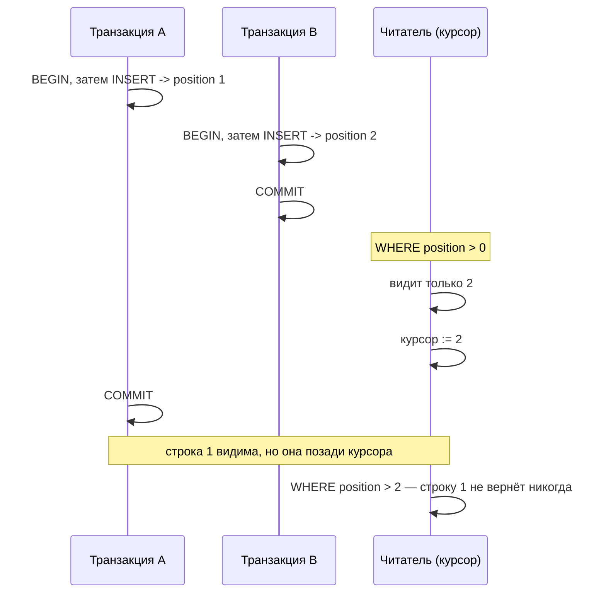
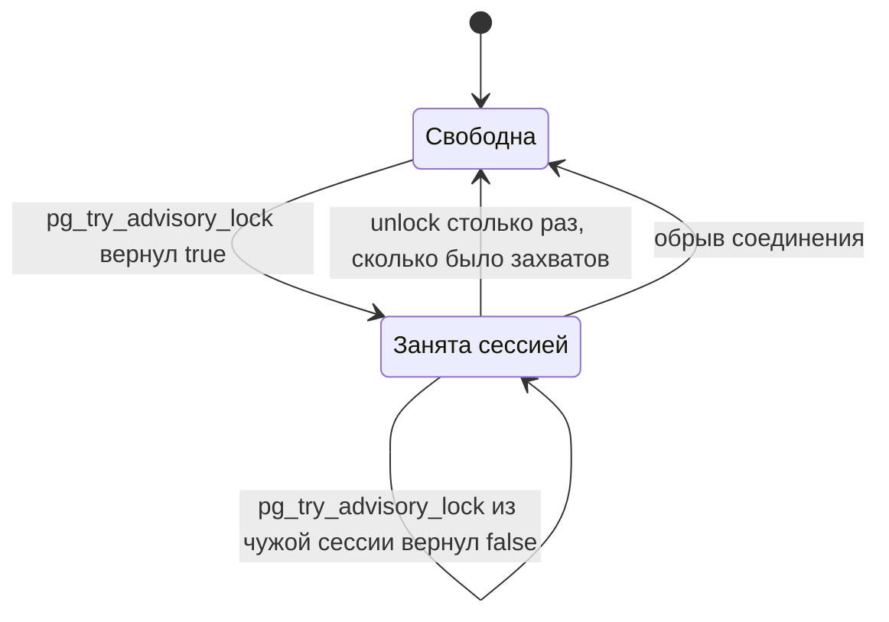

# PostgreSQL: порядок строк и блокировки

Срез схемы Meetups задел три места, где PostgreSQL ведёт себя не так, как подсказывает интуиция: нумерация строк не совпадает с порядком их появления, блокировка приложения живёт на сессии, а не на транзакции, и база не удаляется, пока к ней кто-то подключён. Файл объясняет механику каждого. Ограничения и индексы той же схемы — в [schema.md](schema.md); решение по outbox отложено и живёт в [PER-164](https://linear.app/anticnvm/issue/per-164).

## Механика

### Номер выдаётся при вставке, строка появляется при коммите

Колонка `position BIGINT GENERATED ALWAYS AS IDENTITY` в журнале событий даёт каждой строке возрастающий номер. Аналог — `IDENTITY` в SQL Server или автоинкремент; под капотом это последовательность (`SEQUENCE`).

Ключевой факт: **последовательность выдаёт номер в момент `INSERT`, а строка становится видимой другим сессиям в момент `COMMIT`.** Это разные моменты, и между ними проходит время. Значит, монотонность номера **не означает** монотонности появления данных.

Проверено на двух параллельных сессиях. Транзакция A вставляет строку и держит транзакцию открытой; транзакция B стартует позже, вставляет и коммитится сразу:

```
A получила номер 1     (транзакция открыта)
B получила номер 2     (закоммичена)

читатель в этот момент видит:
 position | who
----------+-----
        2 | B          <-- строки с номером 1 ещё нет

после коммита A:
 position | who
----------+-----
        1 | A          <-- появилась ПОСЛЕ того, как читатель ушёл дальше
        2 | B
```

Отсюда прямое следствие для любого читателя, который хранит «последний обработанный номер» и спрашивает `WHERE position > last`: прочитав 2, он сдвинет курсор на 2. Строка с номером 1 закоммитится позже и окажется позади курсора — она не будет прочитана **никогда**. Не задержится, а потеряется.

Окно между `INSERT` и `COMMIT` маленькое, поэтому на последовательной записи и в тестах ошибка не проявляется вовсе. Она начинает срабатывать ровно тогда, когда параллельных записей становится много.

Второе следствие того же механизма: **номера идут с пропусками.** Последовательность не откатывается вместе с транзакцией, иначе она стала бы точкой сериализации для всех пишущих.

```
BEGIN; INSERT ...; ROLLBACK;   -- номер 3 израсходован
INSERT ...;                    -- получил 4

 position | who
----------+-----
        1 | A
        2 | B
        4 | C
```

Поэтому «следующий номер = предыдущий + 1» — тоже неверное допущение.

### Что из этого следует для схемы

`position` в журнале оставлен как порядок обхода: перечислить события в разумном порядке он позволяет. Курсором публикации наружу он служить не может, и в схеме это записано комментарием, а не оставлено на догадку читателя. Чем именно отмечать отправленное — открытый вопрос [PER-164](https://linear.app/anticnvm/issue/per-164), и до его решения колонки-отметки в таблице нет.

### Advisory-блокировки: договорённость, а не защита

Обычные блокировки PostgreSQL берёт сам на таблицы и строки. Advisory-блокировка — другое: это именованный числом замок, который база держит по просьбе приложения и не связывает ни с какой таблицей. Никто не обязан её спрашивать; она работает, только пока все участники договорились её брать. Ближайший знакомый аналог — именованный `Mutex` в Windows, только областью видимости служит база.

В `Migrations.fs` она сериализует старт нескольких экземпляров сервиса, чтобы миграции не применялись одновременно:

```fsharp
acquired <- conn.ExecuteScalar<bool>(TryLockSql, {| key = lockKey |})
```

Три свойства, каждое проверено.

**Область действия — база, а не кластер.** Один и тот же ключ 42, захваченный в базе `d1`, не мешает захватить его в `d2`:

```
d1 держит 42
d2 получил: t      <-- другая база, тот же ключ — свободен
d1 получил: f      <-- та же база — занято

SELECT locktype, database, objid FROM pg_locks WHERE locktype='advisory';
 advisory | 16404 | 42        (16404 = d1)
```

Практическое следствие для этого репозитория: после разведения сервисов по своим базам блокировка миграций Meetups не может случайно пересечься с блокировкой другого сервиса, даже если они выберут одинаковое число.

**Блокировка живёт на сессии, а не на транзакции.** Она переживает `ROLLBACK` и снимается только явным `pg_advisory_unlock` или обрывом соединения:

```
держатель: BEGIN; pg_advisory_lock(43); ROLLBACK;
чужая сессия: pg_try_advisory_lock(43) -> f     (всё ещё занято)
держатель отключился
чужая сессия: pg_try_advisory_lock(43) -> t
```

Есть и транзакционный вариант — `pg_advisory_xact_lock`, он снимается на `COMMIT` сам. Для миграций он не подходит: DbUp работает своим соединением, и блокировка должна пережить всю его транзакцию целиком.

**Захват реентерабелен.** Одна сессия может взять один ключ дважды, и тогда снимать нужно тоже дважды:

```
pg_advisory_lock(44); pg_advisory_lock(44);
pg_advisory_unlock(44) -> t, но блокировка ещё держится
pg_advisory_unlock(44) -> t, теперь снята
```

Из-за реентерабельности проверять «свободен ли замок» из той же сессии бессмысленно: она получит `t`, даже если держит его сама. Это ловушка при написании теста — проверять надо из второй сессии.

### Ожидающий и пробующий варианты

`pg_advisory_lock` ждёт, пока замок освободится, **без предела**. На пути старта процесса это означает: зависший держатель останавливает каждый следующий экземпляр навсегда, молча, до того как сервис откроет порт. Наблюдаемо это как процесс, который не становится готовым, без единой строки в логе.

`pg_try_advisory_lock` возвращает `true`/`false` немедленно. Отсюда форма в `Migrations.fs` — цикл проб с ограничением по времени: неопределённое зависание превращается в диагностируемый отказ с сообщением.

### DROP DATABASE и живые соединения

Изолированная база на тест (`Testdb.fs`) в конце удаляется. База, к которой есть хоть одно соединение, обычным `DROP DATABASE` не удаляется:

```
соединений с d3: 1
DROP DATABASE d3;
-- ERROR: database "d3" is being accessed by other users
-- DETAIL: There is 1 other session using the database.
DROP DATABASE d3 WITH (FORCE);
-- DROP DATABASE
```

`WITH (FORCE)` обрывает чужие сессии и удаляет базу. Появился в PostgreSQL 13; на более старом сервере это синтаксическая ошибка. В тестах пул соединений Npgsql держит соединения открытыми после последнего запроса, поэтому без `FORCE` уборка падала бы регулярно.

## Урок

Главное, что переносится куда угодно: **порядок присвоения номера и порядок появления данных — разные порядки.** Это не особенность PostgreSQL. Автоинкремент в любой СУБД, `IDENTITY` в SQL Server, offset в очереди — везде, где номер выдаётся до фиксации, «больше последнего» неявно предполагает порядок фиксации, а получает порядок присвоения. Признак ошибки один и тот же: курсор по возрастающему числу поверх конкурентной записи.

Второй переносимый механизм: **ожидание без предела на пути старта — это отказ, который нельзя диагностировать.** Любая блокировка, взятая до того, как процесс начал отвечать на пробу готовности, должна быть с таймаутом, иначе оркестратор видит только «не готов» без причины.

Третий: **тест на конкурентность нельзя ставить в одной сессии.** Реентерабельность advisory-блокировки — частный случай общего правила: механизм, который различает «свой» и «чужой», из одного потока выглядит исправным всегда.

## Почему так, а не иначе

**Сериализация миграций: advisory-блокировка против блокировки таблицы.** Можно было взять `LOCK TABLE meetups_schema_versions`. Отвергнуто: журнала может ещё не быть — на чистой базе его создаёт сам DbUp, и блокировать нечего. Advisory-замок не привязан к объекту и работает до создания первой таблицы.

**Ожидание: `pg_try_advisory_lock` в цикле против `SET lock_timeout`.** `lock_timeout` короче, но его действие на ожидание advisory-блокировки я подтвердить не смог и в код не взял. Цикл проб с явным пределом даёт то же поведение из документированных примитивов. Если будете упрощать — проверьте сначала, что `lock_timeout` действительно прерывает `pg_advisory_lock`.

**Курсор публикации: почему в схеме нет отметки.** Вариант «колонка `dispatched_at` плюс частичный индекс» был написан и снят: он делает журнал изменяемым и предопределяет устройство читателя, которого ещё нет. Альтернативы — курсор по порядку коммитов через `pg_snapshot_xmin(pg_current_snapshot())`, отдельная таблица outbox, логическая репликация — стоят по-разному, и выбор за владельцем. Разбор вариантов и цена каждого — в [PER-164](https://linear.app/anticnvm/issue/per-164).

## Схема

Как теряется строка при курсоре по `position`:



Жизненный цикл advisory-блокировки:



## Первоисточники

- [Advisory Locks](https://www.postgresql.org/docs/16/explicit-locking.html#ADVISORY-LOCKS) — сюда за областью действия, сессионным и транзакционным вариантами и за правилом «снять столько раз, сколько взял».
- [Функции advisory-блокировок](https://www.postgresql.org/docs/16/functions-admin.html#FUNCTIONS-ADVISORY-LOCKS) — сюда за полным списком: ожидающие, пробующие, разделяемые.
- [CREATE TABLE: identity columns](https://www.postgresql.org/docs/16/sql-createtable.html#SQL-CREATETABLE-PARMS-GENERATED-IDENTITY) — сюда за поведением `GENERATED ALWAYS AS IDENTITY`.
- [Sequence Manipulation Functions](https://www.postgresql.org/docs/16/functions-sequence.html) — сюда за тем, почему последовательность не откатывается и номера идут с пропусками.
- [DROP DATABASE](https://www.postgresql.org/docs/16/sql-dropdatabase.html) — сюда за `WITH (FORCE)` и версией, начиная с которой он есть.
- [Transaction Isolation](https://www.postgresql.org/docs/16/transaction-iso.html) — сюда за тем, в какой момент изменения транзакции становятся видимы другим.

## Проверь себя

**Две транзакции вставили строки, первая закоммитилась второй. Что увидит `SELECT ... ORDER BY position` между коммитами?**
Только строку второй транзакции. Строка с меньшим номером появится после её коммита — и окажется позади курсора, который уже сдвинулся.

```bash
# держатель: BEGIN; INSERT; pg_sleep(4); COMMIT — и параллельно вторая сессия с INSERT+COMMIT
# читатель между ними видит только больший номер
```

**Сколько будет `pg_try_advisory_lock(42)` из другой базы того же сервера, если ключ занят в первой?**
`t`. Область действия advisory-блокировки — база, а не кластер; подтверждается колонкой `database` в `pg_locks`.

```bash
docker exec pg psql -U postgres -d d2 -tAc "SELECT pg_try_advisory_lock(42);"
```

**Переживёт ли advisory-блокировка `ROLLBACK`?**
Да, если это `pg_advisory_lock`: она висит на сессии. Снимется явным `unlock` или обрывом соединения. `pg_advisory_xact_lock` — снимется на `COMMIT`. Проверять только из второй сессии: в своей мешает реентерабельность.

**Почему `DROP DATABASE` в уборке теста идёт с `WITH (FORCE)`?**
Пул соединений Npgsql держит соединения открытыми после последнего запроса, и обычный `DROP DATABASE` вернёт «is being accessed by other users». `FORCE` обрывает их; доступен с PostgreSQL 13.
