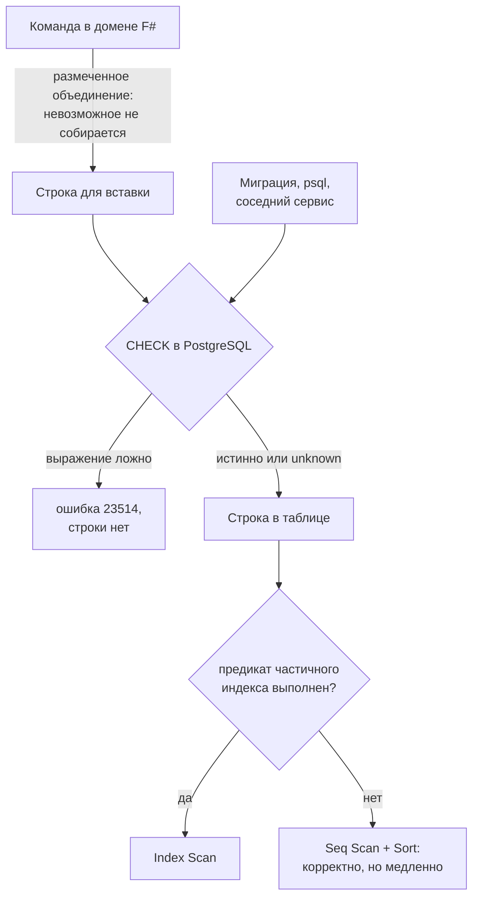

# Схема PostgreSQL: ограничения и индексы

Схема Meetups (`apps/meetups/Meetups/Migrations/`) написана так, что невозможные состояния сходки не отсекаются кодом, а невыразимы в самой таблице. Файл объясняет, чем PostgreSQL это обеспечивает, где проходит граница его возможностей и почему часть проверок выглядит непривычно для человека, который валидировал данные в приложении. Что именно хранится и зачем — в [meetups.md](../../services/meetups.md); набор инструментов — в [standards/data/postgresql.md](../../standards/data/postgresql.md). Конкурентность и порядок строк — в [concurrency.md](concurrency.md).

## Механика

### CHECK — это часть типа строки, а не валидатор

`CHECK` — булево выражение, которое PostgreSQL вычисляет на каждой вставке и изменении строки. Строка, на которой оно ложно, в таблицу не попадает: сервер возвращает ошибку с кодом `23514`. Ближайший знакомый аналог — атрибут валидации на свойстве DTO, но с двумя принципиальными отличиями: проверка живёт в базе, поэтому её нельзя обойти ни другим сервисом, ни ручным `INSERT` из psql; и она не знает ничего, кроме текущей строки — ни соседних строк, ни подзапросов.

В схеме сходки это выглядит так:

```sql
CONSTRAINT meetups_lifecycle_check
    CHECK (lifecycle IN ('planned', 'held', 'cancelled')),
```

### Трёхзначная логика: NULL проходит проверку

Это первое место, где интуиция из C# ломается. В SQL сравнение с `NULL` даёт не «ложь», а третье значение — `unknown`. `CHECK` пропускает строку, если выражение истинно **или** неизвестно, и отвергает только явную ложь.

```
CREATE TABLE chk (a int, b int, CONSTRAINT c1 CHECK (a < b));
INSERT INTO chk VALUES (1, NULL);   -- проходит: 1 < NULL это unknown
INSERT INTO chk VALUES (5, 1);      -- ERROR 23514
```

Практическое следствие: `CHECK` сам по себе не делает колонку обязательной. Обязательность даёт только `NOT NULL`. Поэтому в схеме сходки проверка формы расписания перечисляет `IS NULL` и `IS NOT NULL` явно для каждой колонки, а не полагается на сравнения.

### Сравнение кортежей

PostgreSQL умеет сравнивать составные значения лексикографически — слева направо, как строки:

```sql
AND (schedule_end_date, schedule_end_time)
    >= (schedule_start_date, schedule_start_time)
```

Сначала сравниваются даты; часы смотрятся только при равных датах. Проверено:

```
SELECT (DATE '2026-09-07', TIME '01:00') >= (DATE '2026-09-06', TIME '23:00');  -- t
```

Написать это через `AND`/`OR` вручную можно, но легко ошибиться на границе суток: наивное «дата больше или равна И время больше или равно» отвергло бы интервал с 23:00 до 01:00 следующего дня.

### Взаимоисключающие формы одной сущностью

Расписание сходки — сумма трёх форм (нет даты, ориентировочная, точная) с тремя точностями. В F# это размеченное объединение, где невозможное состояние не собирается. В таблице объединения нет: есть плоский набор колонок, из которых часть должна быть заполнена, а часть обязана пустовать. Форму задаёт `CHECK` из блоков `OR`, где каждый блок описывает одно допустимое сочетание целиком:

```sql
OR (
    schedule_form IN ('tentative', 'fixed')
    AND schedule_precision = 'day'
    AND schedule_start_date IS NOT NULL
    AND schedule_start_time IS NULL
    AND schedule_end_date IS NULL
    AND schedule_end_time IS NULL
)
```

Ключевое здесь — перечислять и пустоту тоже. Блок, который говорит только «дата заполнена», разрешил бы точность `day` вместе со временем окончания, и таблица приняла бы состояние, которого в домене нет.

### Требование IMMUTABLE относится к индексам, а не к CHECK

Здесь пришлось поправить собственное предположение. Логично ожидать, что `CHECK` требует детерминированного выражения — иначе строка, прошедшая проверку вчера, сегодня ей не соответствует. PostgreSQL этого **не** запрещает:

```
CREATE TABLE bad (t timestamptz, CONSTRAINT c CHECK (t < now()));   -- CREATE TABLE
INSERT INTO bad VALUES (now() + interval '1 day');                  -- ERROR 23514
```

Таблица создаётся, проверка работает на вставке. Ответственность за то, что старые строки остаются валидными, лежит на авторе схемы: `pg_dump` и восстановление такой базы могут упасть.

А вот индексное выражение обязано быть `IMMUTABLE`, и это проверяется:

```
CREATE INDEX ON idxbad ((t < now()));
-- ERROR: functions in index expression must be marked IMMUTABLE
CREATE INDEX ON idxbad ((date_trunc('day', t)));
-- ERROR: functions in index expression must be marked IMMUTABLE
```

Второй случай неочевиден: `date_trunc` над `timestamptz` — `STABLE`, а не `IMMUTABLE`, потому что результат зависит от параметра сессии `TimeZone`. Над `timestamp` без зоны та же функция immutable. Волатильность конкретной функции смотрится в `pg_proc.provolatile` (`i` — immutable, `s` — stable, `v` — volatile).

Проверка минутной точности в схеме опирается на `EXTRACT(SECOND FROM schedule_start_time) = 0`. Работает она не потому, что immutable (для `CHECK` это не требуется), а потому что `time without time zone` не зависит от зоны сессии вовсе.

### Частичный индекс

Индекс можно построить не по всей таблице, а по строкам, удовлетворяющим условию:

```sql
CREATE INDEX IF NOT EXISTS meetups_visible_schedule
    ON meetups (schedule_start_date ASC NULLS LAST, schedule_start_time ASC NULLS LAST)
    WHERE visibility = 'visible';
```

Аналога в мире ORM-моделей нет; ближе всего — отдельная материализованная выборка, только поддерживать её не нужно. Выгода измеримая: на 200 000 строк, где видима каждая сотая, частичный индекс занял 64 kB против 4408 kB у полного — в 69 раз меньше.

Цена — планировщик берёт его только тогда, когда условие запроса гарантирует условие индекса. Проверено на тех же данных:

```
EXPLAIN (COSTS OFF) SELECT id FROM m WHERE visibility='visible' ORDER BY start_date;
--  Index Scan using m_visible on m
EXPLAIN (COSTS OFF) SELECT id FROM m ORDER BY start_date;
--  Sort
--    ->  Seq Scan on m
```

Отсюда правило: предикат частичного индекса — часть контракта запроса. Убрали `visibility = 'visible'` из `WHERE` — потеряли индекс молча, без ошибки, только по времени ответа.

### Частичный индекс и HOT-update

У частичного индекса есть вторая, менее очевидная цена: **колонка из его предиката считается индексируемой, даже если её нет в самом индексе.** Это меняет стоимость UPDATE.

Обычно PostgreSQL старается сделать HOT-update (Heap-Only Tuple): новая версия строки кладётся на ту же страницу, и записи в индексы не добавляются вовсе. Условие — ни одна индексируемая колонка не изменилась. Колонка предиката в это условие входит: изменив её, строка может выйти из индекса или войти в него, и индекс обязан об этом узнать.

Измерено на таблице с `fillfactor = 50` (иначе HOT невозможен физически — на странице нет места), 100 обновлённых строк:

```
таблица без частичного индекса,  UPDATE любой колонки        upd=100  hot=100
таблица с индексом WHERE mark IS NULL:
    UPDATE note   (колонки нет ни в индексе, ни в предикате)  upd=100  hot=100
    UPDATE mark   (колонка предиката)                         upd=100  hot=0
```

Ноль против ста. Каждый такой UPDATE пишет новую версию строки и запись **в каждый** индекс таблицы, а не только в частичный. Для очереди поверх таблицы — а «неотправленное» это именно очередь — отсюда следует практический вывод: лишние индексы на такой таблице стоят не только места, но и одной записи на каждую отметку. В журнале Meetups их три, и все несущие; будь там ещё пара «на всякий случай», отметка отправки писала бы пять индексных версий вместо трёх.

Первый замер этого эффекта у меня был неверным: я обновлял все строки таблицы сразу и получил `hot=0` в обоих вариантах. Причина была не в индексе, а в том, что новым версиям не хватало места на странице. Правильный замер требует и свободного места, и обновления малой доли строк.

### JSONB и проверка его формы

`jsonb` — двоичное представление JSON: хранится разобранным, поэтому доступ к полю не требует парсинга, но порядок ключей и дубликаты не сохраняются. Тип значения возвращает `jsonb_typeof`:

```
SELECT jsonb_typeof('{}'::jsonb), jsonb_typeof('[]'::jsonb),
       jsonb_typeof('5'::jsonb), jsonb_typeof('null'::jsonb);
-- object | array | number | null
```

Колонка типа `jsonb` сама по себе принимает и массив, и число, и `null` — всё это валидный JSON. Поэтому «полезная нагрузка события — объект» пришлось записать отдельным ограничением:

```sql
CONSTRAINT meetup_events_payload_object
    CHECK (jsonb_typeof(payload) = 'object'),
```

### Триггер: граница, которую `CHECK` выразить не может

`CHECK` видит только текущую строку и только её конечное состояние. Правило «эту колонку менять нельзя, а вон ту можно» ему недоступно: оно про переход из старого состояния в новое, а старого `CHECK` не знает. Такие правила держит триггер — процедура, которую сервер вызывает сам на указанном событии.

В журнале Meetups граница проходит между записью события и отметкой публикации: запись неизменяема, отметка подвижна.

```sql
CREATE OR REPLACE TRIGGER meetup_events_record_immutable
BEFORE UPDATE OF
    event_id, meetup_id, version, event_type, payload, performed_by, occurred_at
ON meetup_events
FOR EACH ROW
EXECUTE FUNCTION reject_meetup_event_record_change();
```

Четыре свойства, каждое проверено.

**`UPDATE OF` смотрит на список `SET`, а не на значения.** Триггер срабатывает, если колонка упомянута в запросе, даже когда значение не поменялось:

```
UPDATE t SET payload = payload WHERE id = 1;   -- ERROR: record is immutable
UPDATE t SET mark    = now()   WHERE id = 1;   -- UPDATE 1
```

Это и удобно, и опасно: правило «не трогай» здесь буквальное. Зато перечисление колонок становится несущей частью схемы — именно оно, а не комментарий, отделяет неизменяемое от подвижного.

**Триггер `BEFORE` идёт раньше ограничений.** `CHECK`, `NOT NULL` и внешние ключи проверяются на той строке, которую вернул триггер, а не на той, что была в запросе:

```
CREATE TABLE c (v int CHECK (v > 0));
-- BEFORE INSERT триггер делает NEW.v := 42
INSERT INTO c VALUES (-1);   -- проходит, в таблице 42
```

Отсюда следствие для диагностики: если `BEFORE`-триггер заполняет поля, ошибка ограничения расскажет про итоговую строку и ничего — про исходную.

**TRUNCATE не проходит через строчный триггер.** Он не удаляет строки по одной, и объявить `FOR EACH ROW` на нём нельзя вовсе:

```
CREATE TRIGGER x BEFORE TRUNCATE ON t FOR EACH ROW ...;
-- ERROR: TRUNCATE FOR EACH ROW triggers are not supported

TRUNCATE t;   -- при живом BEFORE DELETE триггере: TRUNCATE TABLE, строк 0
```

Запрет на DELETE без отдельного `BEFORE TRUNCATE ... FOR EACH STATEMENT` закрывает удаление по одной строке и оставляет способ стереть таблицу целиком одной командой. В журнале Meetups стоят оба триггера — второй появился ровно потому, что этот пробел нашёлся при написании этого разбора.

**Функция триггера разрешает имена по `search_path` вызывающего.** Функция без `SET search_path` берёт путь той сессии, которая вызвала триггер. Триггер, читавший `meetup_events` без указания схемы, при `search_path = app, public` прочитал одноимённую таблицу из `app` и записал в целевую строку **чужие данные** — молча, без ошибки. Отсюда `SET search_path = pg_catalog, public` в объявлении функции.

**Свой SQLSTATE вместо `23514`.** `RAISE EXCEPTION` по умолчанию даёт `P0001`, а `USING ERRCODE` позволяет назначить любой пятизначный код из цифр и заглавных латинских букв. Взять `23514` (нарушение `CHECK`) заманчиво — но тогда «кто-то пытается переписать историю» и «строка не прошла обычную проверку» приходят в приложение одним кодом, и развести их нельзя:

```
UPDATE meetup_events SET payload = ...   -> MT001: event record is immutable
DELETE FROM meetup_events                -> MT002: row cannot be deleted
TRUNCATE meetup_events                   -> MT002: cannot be truncated
INSERT ... payload = '[1]'               -> 23514: violates check constraint
```

Классы `23`, `P0`, `XX` и прочие заняты стандартом и самим PostgreSQL; `MT` свободен. Тест на неизменяемость, который ловит просто «ошибку», проходил бы и на опечатке в SQL — поэтому проверять надо код.

## Урок

Переносится на любой следующий сервис: **граница, где отсекается невозможное состояние, выбирается один раз и явно.** Если её держит код, то у таблицы есть второй вход — миграция, скрипт поддержки, соседний сервис, — и через него состояние, которого «не бывает», в базу попадает. Если её держит схема, цена в том, что диагностика приходит кодом ошибки, а не понятным сообщением, и часть проверок выражается неудобно.

Третий — **декларативная граница выражает состояние, императивная выражает переход**. `CHECK` отвечает на вопрос «может ли строка выглядеть так»; «можно ли превратить вот эту строку вот в эту» — вопрос другого рода, и в реляционной схеме на него отвечает только триггер. Признак, что понадобился триггер: в формулировке правила есть слово «менять», «уже» или «после».

Второй переносимый механизм — **предикат частичного индекса как часть контракта запроса**. Он не проявляется ни в типах, ни в тестах на малых данных: запрос остаётся корректным, просто перестаёт быть быстрым. Значит, такой индекс нужно называть в брифе рядом с путём чтения, который он закрывает, а не только в миграции.

## Почему так, а не иначе

**Формы расписания: `CHECK` против отдельных таблиц.** Каноничная альтернатива — таблица на форму (`schedule_no_date`, `schedule_day`, `schedule_interval`), где невозможное сочетание невыразимо структурно, без единой проверки. Отвергнуто из-за цены чтения: список видимых сходок стал бы объединением трёх таблиц с сортировкой поверх, а сортировка по расписанию — основной путь чтения сервиса. Плоские колонки с `CHECK` дают одну таблицу и один индекс.

**Формы расписания: `CHECK` против `jsonb`.** Хранить расписание одним `jsonb` было бы ближе к размеченному объединению из F#. Отвергнуто: по `jsonb` не построить обычный B-tree индекс на «дату начала» без выражения-индекса, а сортировка по расписанию нужна постоянно.

**Оси состояния: текст с `CHECK` против `ENUM`.** Тип `ENUM` дал бы ту же проверку и компактнее хранение. Отвергнут из-за миграций: добавление значения в `ENUM` — отдельная операция уровня типа, а не таблицы, и удаление значения не поддерживается вовсе. `TEXT` с `CHECK` меняется обычным `ALTER TABLE`, а словарь значений всё равно нормирован контрактом Protobuf.

**Неизменяемость записи: триггер против дисциплины приложения.** Проще всего было бы договориться, что журнал никто не обновляет, и проверять это на ревью. Отвергнуто по тому же доводу, по которому `CHECK` стоит в базе, а не в домене: у таблицы есть входы помимо домена — миграция, psql, скрипт поддержки, — и на них договорённость не распространяется. Важно понимать предел: сервис ходит в свою базу владельцем схемы, а владелец может снять собственный триггер одной командой (проверено: `DROP TRIGGER` от имени владельца проходит). Триггер ловит ошибку, а не злоумышленника и не сознательное решение; ценность в том, что случайный `UPDATE` из psql останавливается, а снятие защиты становится отдельным явным шагом миграции.

**Неизменяемость записи: триггер против `REVOKE UPDATE`.** Права раздаются по колонкам, поэтому границу можно было провести ими: `REVOKE UPDATE ON meetup_events FROM app`, затем `GRANT UPDATE (dispatched_at)`. Механизм рабочий — обычного владельца (не суперпользователя) `REVOKE` действительно останавливает, `permission denied for table`. Отвергнуто по двум причинам. Первая: владелец возвращает себе право одним `GRANT`, то есть предел ровно тот же, что у триггера, но выражен вне схемы. Вторая решает: права живут на объекте, а не в тексте миграции — таблицу, пересозданную будущей миграцией, они не сопровождают, и их пришлось бы восстанавливать вручную. Триггер едет вместе со схемой. Разведение владельца и рабочей роли, при котором `REVOKE` стал бы настоящей границей, — отдельное решение, которого в MVP нет.

**Минутная точность: `CHECK` против `TIME(0)`.** Объявление `TIME(0)` округлило бы значение до секунд молча, приняв `18:00:30` как `18:00:30`. Нужно было отвергнуть, а не округлить, поэтому проверка явная.

## Схема

Три границы, на которых состояние может быть отсечено, и что делает каждая:



Стрелка от «Миграция, psql, соседний сервис» — то, ради чего проверка стоит в базе: этот вход домен не контролирует.

## Первоисточники

- [CREATE TABLE: CHECK](https://www.postgresql.org/docs/16/ddl-constraints.html#DDL-CONSTRAINTS-CHECK-CONSTRAINTS) — сюда за поведением при `NULL` и за тем, почему проверка не видит других строк.
- [Row and Array Comparisons](https://www.postgresql.org/docs/16/functions-comparisons.html#ROW-WISE-COMPARISON) — сюда за правилом лексикографического сравнения кортежей.
- [Partial Indexes](https://www.postgresql.org/docs/16/indexes-partial.html) — сюда за условиями, при которых планировщик признаёт частичный индекс применимым.
- [Function Volatility Categories](https://www.postgresql.org/docs/16/xfunc-volatility.html) — сюда за разницей `IMMUTABLE`/`STABLE`/`VOLATILE` и за тем, почему `date_trunc` над `timestamptz` не immutable.
- [JSON Functions: jsonb_typeof](https://www.postgresql.org/docs/16/functions-json.html) — сюда за списком значений, которые возвращает `jsonb_typeof`.
- [Heap-Only Tuples](https://www.postgresql.org/docs/16/storage-hot.html) — сюда за условиями, при которых UPDATE обходится без записи в индексы.
- [CREATE TRIGGER](https://www.postgresql.org/docs/16/sql-createtrigger.html) — сюда за `UPDATE OF`, за тем, почему `FOR EACH ROW` несовместим с `TRUNCATE`, и за версией, с которой доступен `CREATE OR REPLACE TRIGGER` (14).
- [Overview of Trigger Behavior](https://www.postgresql.org/docs/16/trigger-definition.html) — сюда за порядком «BEFORE-триггер, потом ограничения» и за тем, что возвращает функция триггера.
- [PostgreSQL Error Codes](https://www.postgresql.org/docs/16/errcodes-appendix.html) — сюда за занятыми классами SQLSTATE и за правилами для своих кодов.
- [Writing a Trigger Function in PL/pgSQL](https://www.postgresql.org/docs/16/plpgsql-trigger.html) — сюда за `TG_OP` и за тем, какие переменные доступны в теле.

## Проверь себя

**Пройдёт ли `INSERT` строки, где колонка из `CHECK (a < b)` равна `NULL`?**
Пройдёт: сравнение даёт `unknown`, а отвергается только ложь. Обязательность даёт `NOT NULL`, не `CHECK`.

```bash
docker run --rm -d --name q -e POSTGRES_PASSWORD=x postgres:16-alpine && sleep 3 && docker exec q psql -U postgres -c "CREATE TABLE t (a int, b int, CHECK (a < b))" -c "INSERT INTO t VALUES (1, NULL)"; docker rm -f q
```

**Можно ли поставить `now()` в `CHECK`? А в выражение индекса?**
В `CHECK` — можно, PostgreSQL не проверяет волатильность. В индекс — нельзя, будет `functions in index expression must be marked IMMUTABLE`. Проверяется теми же двумя `CREATE`.

**Почему запрос без `WHERE visibility = 'visible'` не использует `meetups_visible_schedule`?**
Планировщик применяет частичный индекс, только если условие запроса гарантирует предикат индекса; иначе в индексе нет нужных строк. Смотрится через `EXPLAIN (COSTS OFF)`.

**Какого типа значение примет колонка `jsonb` без дополнительной проверки?**
Любое валидное JSON-значение, включая массив, число и `null`. Ограничение на объект даёт только `CHECK (jsonb_typeof(...) = 'object')`.

**Сработает ли `BEFORE UPDATE OF payload`, если запрос присваивает колонке то же самое значение?**
Да. `UPDATE OF` смотрит на список `SET`, а не на то, изменилось ли значение. `UPDATE t SET payload = payload` триггер поймает.

**Триггер `BEFORE DELETE` запрещает удаление строк. Можно ли после этого опустошить таблицу?**
Можно: `TRUNCATE` не проходит через строчный триггер, а `FOR EACH ROW` на `TRUNCATE` объявить нельзя вовсе. Нужен отдельный `BEFORE TRUNCATE ... FOR EACH STATEMENT`.

```bash
docker exec q psql -U postgres -c "TRUNCATE t"   # при живом BEFORE DELETE: TRUNCATE TABLE
```

**Почему у триггера, который читает соседнюю таблицу, важен `SET search_path`?**
Без него имя разрешается по пути вызывающей сессии. Одноимённая таблица в другой схеме будет прочитана вместо целевой — молча, без ошибки, с чужими данными в результате.

**Сколько индексных записей пишет `UPDATE` колонки, которая входит только в предикат частичного индекса?**
По одной в каждый индекс таблицы: HOT-update невозможен, потому что колонка предиката считается индексируемой. Видно по `n_tup_hot_upd` в `pg_stat_user_tables` — при `fillfactor`, оставляющем место на странице, соседняя неиндексируемая колонка даёт 100 HOT из 100, а колонка предиката — 0.
