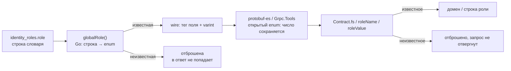

# Открытые и закрытые enum в Protobuf

Контракт `identity.v1` вырос с одной роли до четырёх, и значение, которого потребитель не знает, должно было не сломать разбор, а быть отброшенным. Файл объясняет, что на самом деле решает судьбу числа, которого нет в словаре enum: не схема, а рантайм потребителя плюс перевод в его доменный словарь. Норматив — [protobuf.md](../../standards/contracts/protobuf.md), соседняя тема транспорта — [grpc/unary-server.md](../grpc/unary-server.md), решение о ролях — [ADR-043](../../decisions/ADR-043-identity-roles-and-community-circles.md).

## Механика

### Enum на проводе — число, а не имя

`GLOBAL_ROLE_ADMIN = 1` в схеме задаёт имя для человека и JSON, а на проводе поле несёт только номер. У `repeated GlobalRole global_roles = 2` тег поля — `0x10` (номер 2, wire type 0), значение — varint; `GLOBAL_ROLE_MEMBER = 3` доедет как `0x10 0x03`. Список имён схемой не является барьером: добавление значения расширяет словарь, а не формат. Поэтому расширение enum совместимо в обе стороны, если номер не переиспользован и тип поля не изменён.

### Кто решает, выживет ли неизвестное число

Рантайм потребителя. В protobuf-es у дескриптора enum есть признак `open`: `addEnum` выставляет его через `isEnumOpen`, а `compileEnumFieldReader` смотрит `field.enum.open` — открытый enum читается как `reader.int32()` прямо в поле, закрытый уводит неизвестное число в unknown fields (`node_modules/@bufbuild/protobuf/dist/esm/registry.js:390-409`, `from-binary.js:184-204`). Для proto3-схемы признак открыт, и `GlobalRole` в боте принимает `99` числом, не падая.

Проверено командой: тест `apps/telegram-bot/src/identity/client.test.ts` «parses an unknown role value off the wire and ignores it» подаёт байты `Uint8Array.of(0x10, 0x63, 0x18, 0x01)` — поле 2 со значением 99 и поле 3 `blocked = true` — и получает разобранным `globalRoles: []`, `blocked: true`. То же на проводе C#: интеграционный тест `apps/meetups/Meetups.IntegrationTests/Scenarios/GrpcBoundaryTests.fs` шлёт `Viewer` со `enum<Identity.V1.GlobalRole> 99` реальным gRPC-каналом, и сервер отвечает `PERMISSION_DENIED` по праву, а не `INVALID_ARGUMENT` по разбору. Число дожило до домена.

Поведение Go на чтении в срезе не проверялось: `ResolveIdentity` — производитель, потребителя ответа на Go нет. Написание — `GlobalRole int32`; проверь сам, когда появится Go-клиент.

### Судьбу решает ещё и потребитель

Открытость enum — только половина. Вторая в переводе: `Meetups/Slices/Contract.fs` сопоставляет четыре известных значения доменному словарю и отбрасывает остальные через `| _ -> None`; `roleName` в боте возвращает `undefined` для неизвестного и `flatMap` его выбрасывает; `roleValue` в клиенте Meetups ведёт неизвестное имя в `UNSPECIFIED`. Схема объявляет `GLOBAL_ROLE_UNSPECIFIED` значением «роль неизвестна потребителю» — это не украшение, а соглашение, на котором держится совместимость.

Обратный край того же шва — Go: `globalRole` отбрасывает неизвестную строку словаря БД, чтобы она не попала в контракт. Производитель и потребитель одинаково обязаны игнорировать неизвестное.

### Отвергнуть нельзя, отбросить

Отказ по неизвестному значению (`INVALID_ARGUMENT`) был бы проще и хуже: тогда расширение словаря в Identity становится отказом обслуживания в Meetups до согласованного деплоя обоих. Отбрасывание оставляет совместимость, но требует теста: именно тест удерживает «неизвестное не разрешает», а не комментарий в схеме.

## Урок

- Добавление значения enum совместимо ровно тогда, когда каждый потребитель игнорирует неизвестное. Это проверяется тестом у каждого потребителя, а не предполагается из «proto3 совместим».
- Способ разбора различается по рантаймам: открытый enum сохраняет число, закрытый прячет его; полагаться нужно на поведение, подтверждённое командой, а не на память.
- Catch-all в F# на границе сгенерированного контракта — намеренное исключение из правила исчерпывающего matching ([fsharp.md](../../standards/languages/fsharp.md)): он держит fail-closed перевод, а не скрывает забытый кейс. Внутри домена правило остаётся.
- «Неизвестное значение не роняет потребителя» — свойство не схемы, а двух швов сразу: рантайма и перевода. Оба места проекта одинаково обязаны его исполнять.

## Почему так, а не иначе

- **Отвергать запрос на неизвестной роли (`INVALID_ARGUMENT`).** Цена: расширение словаря в Identity становится отказом обслуживания в Meetups до согласованного деплоя обоих; любой старый клиент со новым Identity недоступен. Отвергнуто.
- **Заводить `identity/v2` под дополнение словаря.** Цена: новый каталог и package ради совместимого изменения; стандарт требует `v2` только для несовместимого изменения ([protobuf.md](../../standards/contracts/protobuf.md)).
- **Отдавать неизвестное число в домен как есть.** Цена: домен получил бы кейс без правила, а `Set<GlobalRole>` — значение, которое никто не проверяет; fail-closed теряется. Отвергнуто.

## Схема

## Первоисточники

- [Protobuf language guide: enums](https://protobuf.dev/programming-guides/enum/) — правило `UNSPECIFIED = 0` и открытость enum в proto3; зачем идти: спецификация, на которую опирается стандарт репозитория.
- `node_modules/@bufbuild/protobuf/dist/esm/from-binary.js` (`compileEnumFieldReader`) и `registry.js` (`addEnum`, `isEnumOpen`) — механика open/closed на чтении; зачем идти: увидеть, что «неизвестное не падает» — свойство рантайма и признака `open`, а не схемы.
- [protobuf.md](../../standards/contracts/protobuf.md) — совместимость и порядок изменения контракта; зачем идти: норматив, которому подчиняется добавление значения.
- [`.skillshare/skills/proj/proj-change-contract/SKILL.md`](../../../.skillshare/skills/proj/proj-change-contract/SKILL.md) — шаги обновления всех потребителей в одном изменении; зачем идти: процессная часть, спецификация лежит выше.

## Проверь себя

- **Что прочитает бот, если Identity пришлёт `GlobalRole = 99`, и что с ним сделает?** Ответ: рантайм сохранит `99` (открытый enum), а `roleName` вернёт `undefined` и `flatMap` его выбросит. Команда: `cd apps/telegram-bot && npx vitest run src/identity/client.test.ts -t "unknown role value"`.
- **Что ответит Meetups на `Viewer` только с ролью `public`?** Ответ: `PERMISSION_DENIED` — роль известна словарю, но правила на неё нет. Команда: `dotnet test --solution apps/meetups/Meetups.sln --filter "Commands refuse a viewer carrying only new or unknown roles by right"`.
- **Почему добавление пятого значения не требует `v2`?** Ответ: номер поля и тип не меняются, старый потребитель игнорирует неизвестное значение. Опора: раздел «Совместимость» в [protobuf.md](../../standards/contracts/protobuf.md).
- **Чем закрытый enum отличается на чтении?** Ответ: неизвестное число уходит в unknown fields, а не в поле. Опора: `from-binary.js:184-204`.
