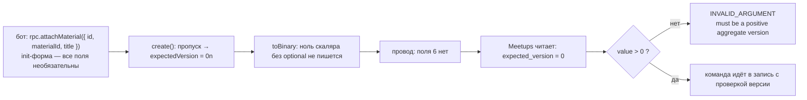

# Присутствие поля в proto3 и init-форма protobuf-es

Контракт Meetups требует `expected_version` в командах над сходкой, и бот пять дней слал прикрепление материала без него. Typecheck был зелёным, а Meetups отвечал `invalid_argument`. Файл объясняет, почему «обязательное» поле proto3 держит только сервер и почему TypeScript не заметил пропуска, хотя сгенерированный тип поле требует. Норматив — [protobuf.md](../../standards/contracts/protobuf.md), соседние темы — [enum-openness.md](enum-openness.md) и Connect-клиент в [typescript/module-and-types.md](../typescript/module-and-types.md). Случай записан в журнале наблюдений ([2026-09-27](../../development/observations/2026-09-27-bot-call-without-required-field-passed-ci.md)).

## Механика

### У скаляра proto3 нет «пропущено»

Сообщение на проводе — это последовательность пар «номер поля — значение», а не объект с полным набором ключей. Для скалярного поля proto3 без слова `optional` действует правило: значение по умолчанию (0, пустая строка, `false`) на провод не пишется вовсе. Поэтому «поле не заполнили» и «поле заполнили нулём» дают одни и те же байты, и получатель различить их не может.

Проверено на `AttachMaterialRequest` из `contracts/proto/meetups/v1/meetups_service.proto`, где `int64 expected_version = 6` объявлен без `optional`:

```text
omitted: 120178        ← только поле 2 (id = "x")
zero:    120178        ← ноль не записан — байты те же
five:    1201783005    ← 0x30 = поле 6, тип varint; 0x05 = значение
omitted read back: 0n
```

Аналог из .NET: не `int?`, а `int` в DTO, который сериализатор пропускает при значении по умолчанию. Отличие в том, что в proto3 это поведение формата, а не настройка сериализатора, и выключить его на одной стороне нельзя.

### Обязательность держит только сервер

Отсюда форма «обязательного» поля в этом репозитории. Схема говорит словами (`meetups_service.proto`, `ChangeMeetupAttributesRequest.expected_version`): «0 is not a valid version, so an absent field is refused rather than read as "the latest one"». Код Meetups делает то же самое проверкой значения:

```fsharp
let expectedVersion (value: int64) : Result<int64, InvalidRequest> =
    if value > 0L then Ok value else Error(invalid "expected_version" "must be a positive aggregate version")
```

`apps/meetups/Meetups/Slices/Contract.fs:137-138`. Работает это потому, что у версии сходки нуля не бывает: она начинается с единицы. Для поля, где ноль — законное значение, такой трюк невозможен, и нужен `optional` (ниже).

### Тип сообщения и init-форма — разные типы

protobuf-es генерирует для сообщения TypeScript-тип, в котором скаляр без `optional` обязателен:

```ts
export type AttachMaterialRequest = Message<"meetups.v1.AttachMaterialRequest"> & {
  id: string;
  materialId: string;
  title: string;
  expectedVersion: bigint;
  // …
};
```

`apps/telegram-bot/gen/meetups/v1/meetups_service_pb.ts:454-496`. Но методы Connect-клиента принимают не этот тип, а init-форму:

```ts
(request: MessageInitShape<I>, options?: CallOptions) => Promise<MessageShape<O>>
```

`node_modules/@connectrpc/connect/dist/esm/promise-client.d.ts:10`. Сама init-форма в `@bufbuild/protobuf` объявлена так, и комментарий библиотеки говорит прямо: «The init type for a message, which makes all fields optional».

```ts
type MessageInit<T extends Message> = T | {
    [P in keyof T as P extends "$unknown" ? never : P]?: …
};
```

`node_modules/@bufbuild/protobuf/dist/esm/types.d.ts:105`. Знак `?` после ключа делает необязательным каждое поле. Смысл понятен: `create()` дозаполняет пропуски значениями по умолчанию, поэтому писать все поля руками не нужно. Цена в том, что пропуск обязательного по смыслу поля компилятор больше не ловит, а дозаполненный ноль уходит на провод как «ничего».

Проверено компиляцией: присвоение init-форме `{ id: "x" }` проходит `tsc --noEmit`, а тот же объект, объявленный типом сообщения, даёт `TS2322` на единственной строке. Вызов `rpc.attachMaterial({ viewer, id, materialId, title, source })` в `apps/telegram-bot/src/meetups/client.ts:357-370` поэтому и был зелёным.

### `optional` возвращает присутствие

Слово `optional` перед скаляром proto3 включает явное присутствие поля: рантайм помнит, было ли поле задано, и пишет заданный ноль на провод. Генерация на временной схеме с двумя полями показывает разницу в типе:

```ts
expectedVersion: bigint;                 // int64 expected_version = 1;
expectedVersion?: bigint | undefined;    // optional int64 expected_version = 1;
```

и на проводе:

```text
plain omitted:    (empty)
plain zero:       (empty)
optional omitted: (empty)  set? false
optional zero:    0800     set? true
```

`isFieldSet` из `@bufbuild/protobuf` различает «не задано» и «задано нулём» только у поля с `optional`. У обычного поля ответа на этот вопрос нет, потому что на проводе его нет.

## Урок

- «Обязательное поле» в proto3 — это соглашение, а не свойство формата. Его держит сервер проверкой значения, и работает оно только там, где ноль не бывает законным значением. Иначе нужен `optional` и проверка присутствия.
- Сгенерированный строгий тип не защищает вызов, если клиент принимает init-форму. У клиентов, построенных на protobuf-es (Connect в боте), граница «забыли поле» проверяется не компилятором, а вызовом в настоящий сервер. Поэтому такой вызов нужен в проводе бота `bot-wire`, а не только в unit-тесте с подставным RPC ([PER-393](https://linear.app/anticnvm/issue/per-393)).
- На другие стеки правило формата переносится как есть: присутствие скаляра — свойство proto3, а не protobuf-es. Как это выглядит в сгенерированном C# Meetups и Go Identity, здесь не проверялось — проверь сам, когда будет чем: `grep -n "ExpectedVersion" apps/meetups/Meetups.Contracts/obj/Debug/net10.0/meetups/v1/MeetupsService.cs` после `just meetups-build` покажет, `long` это или `long?` с признаком `HasExpectedVersion`.

## Почему так, а не иначе

- **`optional int64 expected_version`.** Даёт присутствие, и сервер мог бы отвечать «поле не задано» отдельно от «версия 0». Цена: в TypeScript поле становится `bigint | undefined` и в типе сообщения тоже, то есть строгость типа сообщения пропадает и там. Ноль версии и так невозможен, поэтому проверка `value > 0` различает оба случая, и выигрыш от `optional` здесь нулевой.
- **Обёртка `google.protobuf.Int64Value`.** Даёт то же присутствие через сообщение-обёртку. Цена: лишний уровень вложенности в каждом клиенте ради того, что `optional` в proto3 делает встроенно, и ради того, что здесь не нужно по той же причине.
- **Передавать в клиент тип сообщения вместо init-формы**, например строить запрос через `create(Schema, init)` с явной аннотацией типа сообщения. Компилятор тогда ловит пропуск, но только если каждый вызов пишется так, а Connect этого не требует: одно забытое место возвращает дыру. Надёжнее поймать пропуск сценарием провода против настоящего сервера, чем дисциплиной записи.
- **Proto2 `required`.** В proto3 его нет намеренно: обязательное поле нельзя сделать необязательным без поломки старых читателей, и сообщество Protobuf от него отказалось. В этом репозитории контракты на proto3 (`syntax = "proto3"`).

## Схема



## Первоисточники

- [Protobuf: Field Presence](https://protobuf.dev/programming-guides/field_presence/) — зачем идти: правило «implicit presence» скаляров proto3 и что меняет `optional`; первоисточник формулировок раздела «Механика».
- [Protobuf language guide (proto3): default values](https://protobuf.dev/programming-guides/proto3/#default) — зачем идти: какие значения считаются значениями по умолчанию и почему их нет на проводе.
- [protobuf-es: manual, `create` и init-форма](https://github.com/bufbuild/protobuf-es/blob/main/MANUAL.md) — зачем идти: как protobuf-es строит сообщение из частичного init-объекта и что делает `isFieldSet`.
- `node_modules/@bufbuild/protobuf/dist/esm/types.d.ts` (`MessageInitShape`, `MessageInit`) и `node_modules/@connectrpc/connect/dist/esm/promise-client.d.ts` — зачем идти: увидеть своими глазами, что клиент принимает init-форму, а не тип сообщения.
- [protobuf.md](../../standards/contracts/protobuf.md) — зачем идти: норматив требует описать в комментарии `.proto` семантику отсутствия значения, и `expected_version` это делает.

## Проверь себя

- **Что уйдёт на провод, если бот не передаст `expectedVersion`, и что прочитает Meetups?** Ответ: поля 6 на проводе нет, Meetups прочитает 0 и ответит `INVALID_ARGUMENT`. Проверка: в `apps/telegram-bot` собрать `dist` (`just telegram-bot-build`) и сериализовать `create(AttachMaterialRequestSchema, { id: "x" })` через `toBinary` — байты `120178` совпадут с вариантом `expectedVersion: 0n`.
- **Почему `tsc` пропустил вызов без поля, хотя в `AttachMaterialRequest` оно обязательно?** Ответ: метод клиента принимает `MessageInitShape<I>`, где все поля необязательны. Проверка: `grep -n "MessageInitShape" apps/telegram-bot/node_modules/@connectrpc/connect/dist/esm/promise-client.d.ts`.
- **Что изменит `optional` перед `int64 expected_version`?** Ответ: тип станет `bigint | undefined`, а явно заданный ноль запишется на провод (`0800` для поля 1) и `isFieldSet` вернёт `true`. Проверка: сгенерировать `protoc-gen-es` временную схему с двумя вариантами поля через `buf generate` и сравнить типы и `toBinary`.
- **Почему для `expected_version` хватает проверки `value > 0`, а для счётчика с законным нулём — нет?** Ответ: ноль версии невозможен, поэтому он однозначно значит «не передано»; у счётчика ноль — законное значение, и без `optional` пропуск от него не отличить. Опора: `Contract.fs:134-138`.
