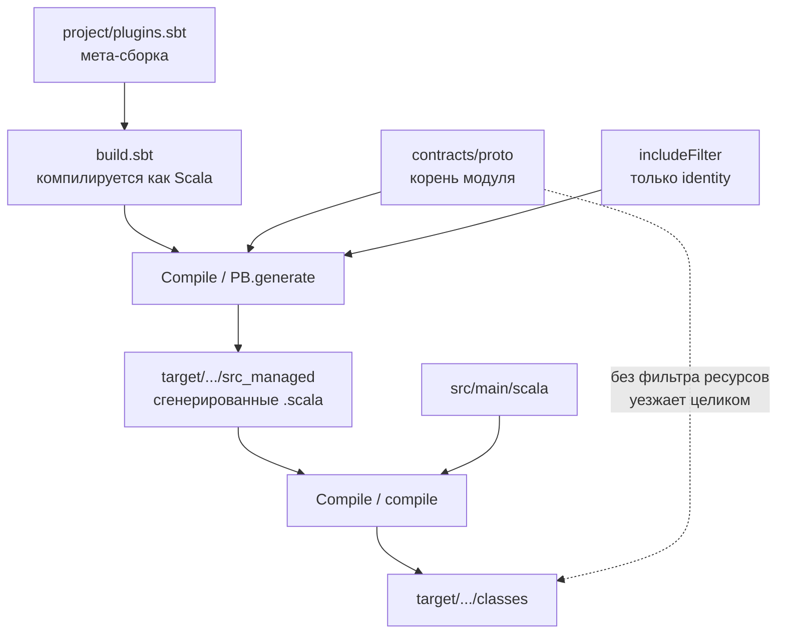

# Сборка Scala и кодогенерация

Первый Scala-компонент репозитория — `apps/auction`. Разбор объясняет, как устроена его сборка: почему `build.sbt` не конфигурационный файл, что такое ключ и его область, куда попадает сгенерированный из Protobuf код и чем всё это отличается от MSBuild, который читатель уже знает.

Опора — дифф ветки `feature/PER-143` и прогоны `sbt` из той же сессии. Решение об инструменте сборки принято [ADR-048](../../decisions/ADR-048-auction-sbt-and-scalapb-build.md), нормативная форма кода — [languages/scala.md](../../standards/languages/scala.md).

## Механика

### sbt — это программа, а не конфигурация

`build.sbt` выглядит как конфиг, но компилируется как Scala-код. Перед сборкой проекта sbt собирает **мета-сборку**: каталог `project/` — это отдельный Scala-проект, чей результат и есть определение основной сборки.

Отсюда `project/plugins.sbt`:

```scala
addSbtPlugin("com.thesamet" % "sbt-protoc" % "1.0.6")
libraryDependencies += "com.thesamet.scalapb" %% "compilerplugin" % "0.11.19"
```

Вторая строка — не зависимость сервиса. Это зависимость **мета-сборки**: `compilerplugin` нужен, чтобы в `build.sbt` компилировалось выражение `scalapb.gen(grpc = false)`. Поэтому в `build.sbt` можно написать `scalapb.compiler.Version.scalapbVersion` и получить версию генератора значением, а не строкой-дублёром.

Аналог в .NET — `Directory.Build.props` и кастомные MSBuild-таргеты. Отличие принципиальное: MSBuild читает XML и вычисляет свойства как строки, а sbt **компилирует** определение сборки, поэтому опечатка в имени ключа — ошибка компиляции, а не пустая строка в рантайме. Цена — отдельная сборка перед сборкой и заметный холодный старт.

### Ключ, область, и почему их три

Значения в sbt адресуются не именем, а именем с областью. Строка из `build.sbt`:

```scala
Compile / PB.generate / includeFilter := new SimpleFileFilter(...)
```

читается справа налево: ключ `includeFilter`, но не вообще, а тот, что принадлежит задаче `PB.generate`, и не вообще, а в конфигурации `Compile`. Три оси области — конфигурация (`Compile`, `Test`), задача и сам ключ. У MSBuild ближайший родственник — свойство внутри конкретного таргета, но там область выражается порядком выполнения и условиями, а здесь она часть адреса.

Это объясняет, почему `Test / parallelExecution := false` не трогает компиляцию, а `Compile / mainClass` не влияет на тесты.

### Setting против task и зачем `Def.setting`

`setting` вычисляется один раз при загрузке сборки, `task` — на каждый запуск. Поэтому путь к контрактам объявлен так:

```scala
lazy val contractsRoot = Def.setting {
  ((ThisBuild / baseDirectory).value / ".." / ".." / "contracts" / "proto").getCanonicalFile
}
```

`.value` внутри `Def.setting` — не обычный вызов метода: это макрос, который на этапе компиляции сборки превращается в объявление зависимости между ключами. Поэтому `.value` нельзя писать внутри обычной функции или `if` — sbt не сможет построить граф. Ограничение выглядит странным ровно до того момента, как становится понятно, что сборка — это граф ключей, а не последовательность команд.

`getCanonicalFile` здесь не косметика: относительный `..` доезжает до обходчика файлов sbt как есть, и каждый прогон печатает предупреждение про relative glob, которое в логе CI неотличимо от настоящего.

### Куда попадает сгенерированный код

ScalaPB вызывается внутри `compile` и пишет в `sourceManaged` — каталог порождённых исходников:

```scala
Compile / PB.targets := Seq(
  scalapb.gen(grpc = false) -> (Compile / sourceManaged).value / "protobuf"
)
```

Проверяется командой:

```bash
find apps/auction/target -path "*src_managed*" -name "*.scala"
```

Она печатает файлы в `target/scala-3.3.7/src_managed/main/protobuf/identity/v1/`. Отдельного каталога `gen/` рядом с исходниками у Scala нет — в отличие от Go и TypeScript, где `buf` пишет именно туда. Всё лежит под `target/`, и одной строки `target/` в `.gitignore` достаточно.

Аргумент `grpc = false` выключает генерацию стабов клиента и сервера: по умолчанию ScalaPB их генерирует, они требуют `io.grpc` на classpath, и без него компиляция падает с `value io is not a member of <root>` — 64 ошибки на пустом месте. Это прямой аналог `GrpcServices="None"` у элемента `Protobuf` в .NET.

### Ловушка: вход генерации и состав артефакта — разные вещи

`PB.protoSources` указывает на корень модуля `contracts/proto`, а сужает генерацию фильтр. Но `sbt-protoc` кладёт `protoSources` **ещё и** в каталоги ресурсов, поэтому без явной строки

```scala
Compile / unmanagedResourceDirectories :=
  (Compile / unmanagedResourceDirectories).value.filterNot(_ == contractsRoot.value)
```

весь `contracts/proto` — включая схемы чужих доменов и `buf.yaml` — уезжает в артефакт сервиса рядом с его `application.conf`. Фильтр этого не ловит: он сужает вход `protoc`, а не состав ресурсов.

Ловушка двойная: убедиться в исправлении можно только чистой сборкой. Инкрементальная не удаляет ресурсы, скопированные прошлыми прогонами, поэтому `classes` продолжает показывать чужие каталоги и после правки.

Сузить сам `protoSources` до каталога домена нельзя по другой причине: `sbt-protoc` кладёт его ещё и на include path, одна схема становится видна по двум относительным путям, и `protoc` отвергает её сообщением `"identity.v1.GlobalRole" is already defined`. Обе ловушки записаны нормативом в [protobuf.md](../../standards/contracts/protobuf.md).

### Версия платформы: `_3`, LTS и `-release`

Артефакты Scala 3 публикуются с суффиксом `_3` — `scalatest_3`, `pekko-http_3`. Это значит, что вся линия Scala 3 бинарно совместима: библиотека, собранная под 3.3, работает на 3.7. В Scala 2 суффикс был `_2.13`, и каждая минорная версия требовала своей сборки библиотеки.

Отсюда практическое следствие, которое пришлось чинить: `scalaVersion := "3.3.6"` при зависимостях, тянущих `scala3-library` 3.3.7, даёт сборку с компилятором одной версии и рантаймом другой. Версия компилятора обязана совпадать с той, до которой вытесняется библиотека.

Версия JDK читается из файла компонента и попадает в компилятор:

```scala
s"-release:${IO.read(baseDirectory.value / ".java-version").trim}"
```

`-release` заставляет компилировать против API указанной платформы, а не той, на которой запущен компилятор. Без него локальная сборка на JDK 25 и сборка CI на другом JDK расходятся молча; с ним несовпадение — ошибка компиляции.

## Урок

Переносится на любой следующий компонент репозитория:

- **Кодогенерация принадлежит сборке языка, а не отдельному шагу.** У .NET это `Grpc.Tools` внутри `dotnet build`, у Scala — `sbt-protoc` внутри `compile`. Общий frontend вроде `buf` удобен там, где генератор — отдельный бинарник, и мешает там, где генератор поставляется библиотекой сборки.
- **Фильтр входа и состав артефакта — независимые вопросы.** Инструмент, сузивший генерацию, не обязан сузить упаковку, и проверять это надо содержимым `target/classes`, а не чтением конфигурации.
- **Версия платформы объявляется один раз и читается сборкой.** Файл, который читает только CI, гарантирует расхождение: локальная сборка о нём не знает.

## Почему так, а не иначе

| Вариант | Цена |
|---|---|
| `buf` + `protoc-gen-scala` | Один frontend генерации на весь репозиторий. Но native-бинарь плагина ScalaPB публикует только для Linux и macOS; на Windows это JVM-скрипт из Maven, то есть запуск JVM на каждый вызов плагина. Стабы `pekko-grpc` через buf не получить — их даёт свой sbt-плагин, и под контракты аукциона понадобился бы третий путь. Компилировать Scala buf всё равно не умеет, поэтому sbt появился бы рядом |
| `scala-cli` | Самый дешёвый старт: один файл, быстрый первый зелёный прогон. Multi-module и плагин `pekko-grpc` не поддерживает, поэтому переезд на sbt случился бы на первой доменной задаче — то есть эта работа была бы переделана целиком |
| Mill | Быстрее sbt на холодном старте, DSL предсказуемее. Экосистема меньше: путь к `pekko-grpc` пришлось бы собирать руками там, где у sbt он готов |
| `sbtn` вместо `sbt` в рецептах | Снимает холодный старт постоянным сервером. Сервер оставляет блокировку именованного канала, и убитый мимо sbt процесс роняет следующий запуск на `ServerAlreadyBootingException` — воспроизведено на Windows в той же сессии |

Выбран sbt с `sbt-protoc`. Решающим был не вкус, а то, что задача на контракты аукциона заблокирована этим контуром и вводит gRPC: стабы даёт `sbt-pekko-grpc` поверх ScalaPB, то есть плагин того же инструмента. Цена — третий `protoc` в репозитории после `BUF_VERSION` и того, что внутри `Grpc.Tools`.

Холодный старт гасится не сервером, а составом команд: `just auction-verify` выполняет формат, сборку и тесты одной сессией вместо трёх.

## Схема



## Первоисточники

- [sbt Reference Manual: ключи и области](https://www.scala-sbt.org/1.x/docs/Scopes.html) — сюда идут за тем, как читается `Compile / PB.generate / includeFilter`.
- [sbt: задачи и `.value`](https://www.scala-sbt.org/1.x/docs/Task-Graph.html) — почему `.value` макрос и где его нельзя писать.
- [ScalaPB: генерация и sbt-protoc](https://scalapb.github.io/docs/sbt-settings/) — настройки `PB.targets`, `PB.protoSources` и опции генератора.
- [ScalaPB: standalone-компилятор](https://scalapb.github.io/docs/scalapbc/) — здесь сказано, что native-бинарь плагина есть только для Linux и macOS; на этом держится отказ от варианта с buf.
- [Scala 3: совместимость и LTS](https://www.scala-lang.org/blog/2022/08/17/long-term-compatibility-plans.html) — откуда взялся единый суффикс `_3`.

## Проверь себя

- **Куда ScalaPB положил сгенерированный код?** `find apps/auction/target -path "*src_managed*" -name "*.scala"` — в `target/scala-3.3.7/src_managed/main/protobuf/identity/v1/`.
- **Попали ли чужие схемы в артефакт?** Только после чистой сборки: `cd apps/auction && sbt -batch "clean; Test/compile"`, затем `ls target/scala-3.3.7/classes`. Печатает `application.conf`, `auction`, `identity`, `logback.xml` — ни `meetups/`, ни `notifications/`, ни `buf.yaml`. Без `clean` проверка врёт: инкрементальная сборка не удаляет ресурсы, скопированные прошлыми прогонами, и каталоги чужих доменов остаются лежать от сборки до правки.
- **Какая версия Scala реально собирает проект?** `cd apps/auction && sbt -batch "print scalaVersion"` — должна совпадать с версией `scala3-library` в дереве зависимостей: `sbt -batch "whatDependsOn org.scala-lang scala3-library_3"`.
- **Что будет, если убрать `grpc = false`?** Компиляция упадёт с `value io is not a member of <root>`: генератор напишет стабы, требующие `io.grpc`, которого в зависимостях нет.
