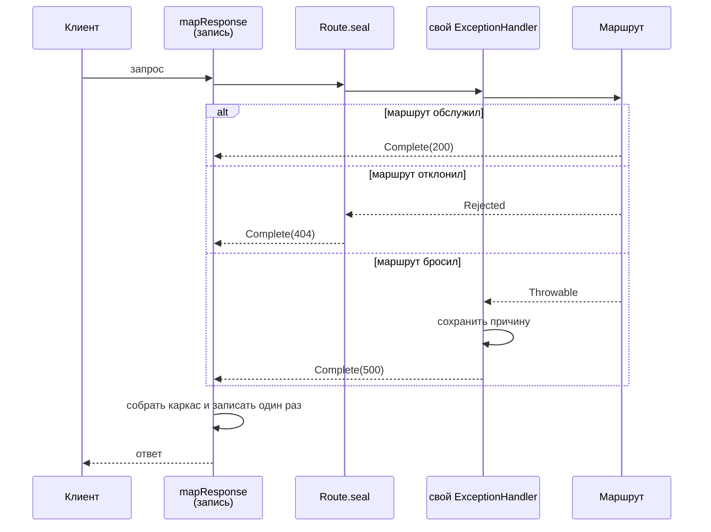

# HTTP-граница на Pekko

Разбор объясняет, из чего собрана HTTP-граница `apps/auction`: что такое маршрут и директива в Pekko HTTP, почему отклонение и исключение — два разных механизма, и почему запись в журнал ставится не там, где кажется. Читателю не нужно ничего знать про Akka и Pekko заранее.

Опора — код `apps/auction/src/main/scala/auction/boundary/` и прогоны тестов из той же сессии, включая отдельный зонд, результат которого приведён ниже. Каркас полей записи задаёт [logging.md](../../standards/observability/logging.md).

## Механика

### Маршрут — это функция

За словом `Route` в Pekko HTTP стоит обычная функция:

```
RequestContext => Future[RouteResult]
```

`RouteResult` имеет ровно два варианта: `Complete` с ответом и `Rejected` со списком причин, по которым маршрут за запрос не взялся. Всё остальное — способы эти функции составлять.

Ближайший аналог в .NET — делегат middleware в ASP.NET Core. Отличие: там middleware почти всегда отвечает или передаёт дальше, а здесь есть третий исход — «не мой запрос», и он выражен значением.

### Директива — это обёртка вокруг маршрута

```scala
val route: Route =
  path("health") {
    get {
      complete(HttpEntity(ContentTypes.`application/json`, okBody))
    }
  }
```

`path`, `get` и `complete` — не ключевые слова и не DSL-магия: `path("health")` возвращает директиву, а вызов её с блоком в фигурных скобках даёт новый `Route`. Вложенность блоков и есть композиция: внешняя директива решает, вызывать ли внутренний маршрут.

Отсюда следует неочевидное: `Get("/health") ~> HealthRoutes.route` на неизвестном пути даёт не 404, а `handled == false`. Маршрут отклонил запрос, и никакого ответа ещё не существует.

### Отклонение и исключение — разные механизмы

Это главная развилка границы, и на ней легко ошибиться дважды.

**Отклонение** — значение `Rejected`. Оно всплывает вверх, и в HTTP-ответ его превращает `RejectionHandler` — на самом верху, вне всех директив. Если запись в журнал стоит внутри, она этого ответа не увидит: `mapResponse` вызывается только на `Complete`. Запрос, на который сервис ответил 404, не попал бы в журнал вообще.

**Исключение** — брошенный `Throwable`. Его перехватывает `ExceptionHandler` и превращает в ответ.

Лечится и то и другое запечатыванием — `Route.seal` ставит оба обработчика:

```scala
def boundary(route: Route): Route =
  extractRequestContext { ctx =>
    ...
    mapResponse { response => ...; response } {
      Route.seal(handleExceptions(capturing(failure))(route))
    }
  }
```

Порядок вложения здесь не косметика, и это проверено зондом. Временный тест обернул `Route.seal(throwing)` снаружи в `mapResponse` и записал, что тот увидел:

```
PROBE RESULT: status=500
```

То есть `mapResponse` **срабатывает** и видит ответ — но видит только статус. Причины у ответа нет, и взять её неоткуда: штатный `ExceptionHandler` внутри `seal` уже превратил исключение в ответ и `Throwable` не сохранил. Поля `error` и `stack`, обязательные при неожиданном отказе, заполнить нечем.

Поэтому свой обработчик ставится **внутрь** `seal` — он перехватывает причину первым, кладёт её в держатель рядом с запросом и отвечает пустым 500:

```scala
private def capturing(failure: AtomicReference[Option[Throwable]]): ExceptionHandler =
  ExceptionHandler { case cause =>
    failure.set(Some(cause))
    complete(StatusCodes.InternalServerError)
  }
```

`AtomicReference` создаётся внутри `extractRequestContext`, тело которого вычисляется на каждый запрос заново, поэтому держатель живёт ровно один запрос и между запросами не протекает.

### `given` вместо `implicit`

```scala
given system: ActorSystem[Nothing] = ActorSystem(Behaviors.empty, "auction", config)
Http().newServerAt(host, port).bind(...)
```

`Http()` требует actor system, но в аргументах её нет. В Scala 3 значение, объявленное `given`, подставляется в неявный параметр по типу. Это переименованный `implicit` из Scala 2 с разделёнными ролями: `given` объявляет, `using` объявляет параметр.

Аналог в .NET — не существует в языке; ближе всего инъекция зависимостей контейнером, но здесь всё решается компилятором по типу, и отсутствие подходящего значения — ошибка компиляции, а не исключение при первом вызове.

### Логирование на JVM: привязка и её гонка

Код зовёт SLF4J — фасад, который сам ничего не пишет. Пишет реализация, найденная на classpath: здесь `logback-classic`, а JSON из неё делает `logstash-logback-encoder`. Имя сервиса объявлено в `logback.xml` константой сборки:

```xml
<customFields>{"service":"auction"}</customFields>
```

Аналог в .NET — `ILogger` как фасад и Serilog как реализация; идея та же.

Неочевидное — инициализация. Пока один поток поднимает реализацию, SLF4J возвращает остальным `SubstituteLogger`, который ни к какому logback не приводится. В тестах это дало отказ, который выглядит как дефект кода:

```
java.lang.ClassCastException: class org.slf4j.helpers.SubstituteLogger
cannot be cast to class ch.qos.logback.classic.Logger
```

Инициализацию начинает поток `ActorSystem`, которую `ScalatestRouteTest` поднимает в конструкторе каждого сьюта. Поэтому налетает на неё тот сьют, которому не повезло с порядком запуска: отдельный прогон файла был зелёным, а полный `just verify` — красным **на том же коде**.

## Урок

- **Запись о запросе ставится там, где ответ уже существует, но причина ещё не потеряна.** Это узкое место: снаружи запечатывания причины нет, внутри маршрута нет ответа. Правило переносится на любой транспорт с обработчиком отказов по умолчанию.
- **Обработчик по умолчанию — это молчаливая потеря контекста.** Он делает корректный ответ и ровно поэтому выглядит безопасным; теряется то, что в ответ не попало.
- **Отклонение и отказ — разные вещи и в других стеках тоже.** Смешав их, получаешь либо непокрытый журналом негативный путь, либо отказ без причины.
- **Зелёный прогон отдельного теста не заменяет зелёный гейт.** Порядок сьютов — часть входных данных, и гонка инициализации проявляется только на полном прогоне.

## Почему так, а не иначе

| Вариант | Цена |
|---|---|
| Не запечатывать, ловить 404 снаружи | Запись появилась бы у обслуженных запросов и исчезла у отклонённых. Негативный путь — ровно тот, ради которого журнал и читают |
| Запечатать и довольствоваться статусом | Ответ корректный, но `error` и `stack` пустые. Норматив требует их при отказе, и без причины запись отвечает «что-то сломалось» без продолжения |
| Логировать причину прямо в `ExceptionHandler` | Две записи на одну операцию: одна от обработчика, вторая от `mapResponse`. Норматив прямо требует одного автора записи об отказе |
| Писать сырой путь неизвестного запроса | Перебор адресов неаутентифицированным клиентом даёт в журнале столько разных `operation`, сколько строк клиент сумел прислать. Поэтому у 404 путь заменяется на `<unmatched>` |
| Оставить параллельный прогон сьютов | Порядок невоспроизводим, и один и тот же код зелёный отдельным вызовом и красный в гейте |

## Схема



## Первоисточники

- [Pekko HTTP: Routing DSL](https://pekko.apache.org/docs/pekko-http/current/routing-dsl/index.html) — сюда за тем, что `Route` это функция и чем директива отличается от маршрута.
- [Pekko HTTP: отклонения](https://pekko.apache.org/docs/pekko-http/current/routing-dsl/rejections.html) — как отклонение превращается в ответ и где стоит `RejectionHandler`.
- [Pekko HTTP: обработка исключений](https://pekko.apache.org/docs/pekko-http/current/routing-dsl/exception-handling.html) — поведение обработчика по умолчанию, из-за которого причина не доезжает до записи.
- [Scala 3: given и using](https://docs.scala-lang.org/scala3/reference/contextual/givens.html) — что заменило `implicit`.
- [SLF4J: сообщение о подменных логгерах](https://www.slf4j.org/codes.html#substituteLogger) — официальное объяснение гонки инициализации, которая уронила гейт.
- Скилл `.skillshare/skills/akka-streams/SKILL.md` — оттуда взята формулировка «сначала проверь, нужен ли здесь поток»; к самой границе он не применялся, потоков в ней нет.

## Проверь себя

- **Что вернёт незапечатанный маршрут на неизвестном пути?** `Get("/lots") ~> HealthRoutes.route ~> check { handled shouldBe false }` — тест в `HealthRoutesSpec` это и утверждает: не 404, а отсутствие ответа.
- **Доходит ли причина исключения до `mapResponse` через штатный `seal`?** Нет. Зонд напечатал `PROBE RESULT: status=500`: ответ виден, причина — нет. Повторяется временным тестом, который оборачивает `Route.seal(throwing)` в `mapResponse` и записывает увиденное.
- **Что попадает в запись на неизвестном пути?** `just auction-test`, затем найти в выводе строку `request handled`: там `operation=GET <unmatched>`, `result=error`, `error=Not Found`, `error_category=invariant` — и никакого сырого пути.
- **Воспроизводится ли гонка SLF4J?** Убрать `Test / parallelExecution := false` из `build.sbt` и прогнать `just auction-verify` несколько раз: отказ появляется не на каждом прогоне, и это и есть признак гонки.
