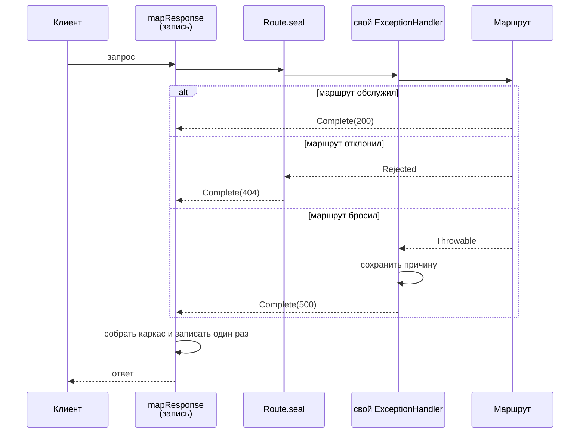
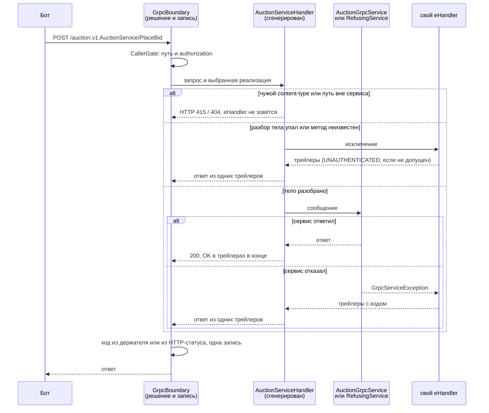

# HTTP-граница на Pekko

Разбор объясняет, из чего собраны HTTP- и gRPC-граница `apps/auction`: что такое маршрут и директива в Pekko HTTP, почему отклонение и исключение — два разных механизма, почему запись в журнал ставится не там, где кажется, и что сгенерированный pekko-grpc обработчик делает до вызова сервиса. Читателю не нужно ничего знать про Akka и Pekko заранее.

Опора — код `apps/auction/src/main/scala/auction/boundary/` и `grpc/`, сгенерированный `AuctionServiceHandler`, байткод `pekko-grpc-runtime` 1.2.0 и прогоны тестов из той же сессии, включая отдельный зонд, результат которого приведён ниже. Каркас полей записи задаёт [logging.md](../../standards/observability/logging.md).

## Механика

### Маршрут — это функция

За словом `Route` в Pekko HTTP стоит обычная функция:

```
RequestContext => Future[RouteResult]
```

`RouteResult` имеет ровно два варианта: `Complete` с ответом и `Rejected` со списком причин, по которым маршрут за запрос не взялся. Всё остальное — способы эти функции составлять.

Ближайший аналог в .NET — делегат middleware в ASP.NET Core. Отличие: там middleware почти всегда отвечает или передаёт дальше, а здесь есть третий исход — «не мой запрос», и он выражен значением.

### Директива — это обёртка вокруг маршрута

```scala
val route: Route =
  path("health") {
    get {
      complete(HttpEntity(ContentTypes.`application/json`, okBody))
    }
  }
```

`path`, `get` и `complete` — не ключевые слова и не DSL-магия: `path("health")` возвращает директиву, а вызов её с блоком в фигурных скобках даёт новый `Route`. Вложенность блоков и есть композиция: внешняя директива решает, вызывать ли внутренний маршрут.

Отсюда следует неочевидное: `Get("/health") ~> HealthRoutes.route` на неизвестном пути даёт не 404, а `handled == false`. Маршрут отклонил запрос, и никакого ответа ещё не существует.

### Отклонение и исключение — разные механизмы

Это главная развилка границы, и на ней легко ошибиться дважды.

**Отклонение** — значение `Rejected`. Оно всплывает вверх, и в HTTP-ответ его превращает `RejectionHandler` — на самом верху, вне всех директив. Если запись в журнал стоит внутри, она этого ответа не увидит: `mapResponse` вызывается только на `Complete`. Запрос, на который сервис ответил 404, не попал бы в журнал вообще.

**Исключение** — брошенный `Throwable`. Его перехватывает `ExceptionHandler` и превращает в ответ.

Лечится и то и другое запечатыванием — `Route.seal` ставит оба обработчика:

```scala
def boundary(route: Route): Route =
  extractRequestContext { ctx =>
    ...
    mapResponse { response => ...; response } {
      Route.seal(handleExceptions(capturing(failure))(route))
    }
  }
```

Порядок вложения здесь не косметика, и это проверено зондом. Временный тест обернул `Route.seal(throwing)` снаружи в `mapResponse` и записал, что тот увидел:

```
PROBE RESULT: status=500
```

То есть `mapResponse` **срабатывает** и видит ответ — но видит только статус. Причины у ответа нет, и взять её неоткуда: штатный `ExceptionHandler` внутри `seal` уже превратил исключение в ответ и `Throwable` не сохранил. Поля `error` и `stack`, обязательные при неожиданном отказе, заполнить нечем.

Поэтому свой обработчик ставится **внутрь** `seal` — он перехватывает причину первым, кладёт её в держатель рядом с запросом и отвечает пустым 500:

```scala
private def capturing(failure: AtomicReference[Option[Throwable]]): ExceptionHandler =
  ExceptionHandler { case cause =>
    failure.set(Some(cause))
    complete(StatusCodes.InternalServerError)
  }
```

`AtomicReference` создаётся внутри `extractRequestContext`, тело которого вычисляется на каждый запрос заново, поэтому держатель живёт ровно один запрос и между запросами не протекает.

### `given` вместо `implicit`

```scala
given system: ActorSystem[Nothing] = ActorSystem(Behaviors.empty, "auction", config)
Http().newServerAt(host, port).bind(...)
```

`Http()` требует actor system, но в аргументах её нет. В Scala 3 значение, объявленное `given`, подставляется в неявный параметр по типу. Это переименованный `implicit` из Scala 2 с разделёнными ролями: `given` объявляет, `using` объявляет параметр.

Аналог в .NET — не существует в языке; ближе всего инъекция зависимостей контейнером, но здесь всё решается компилятором по типу, и отсутствие подходящего значения — ошибка компиляции, а не исключение при первом вызове.

### Логирование на JVM: привязка и её гонка

Код зовёт SLF4J — фасад, который сам ничего не пишет. Пишет реализация, найденная на classpath: здесь `logback-classic`, а JSON из неё делает `logstash-logback-encoder`. Имя сервиса объявлено в `logback.xml` константой сборки:

```xml
<customFields>{"service":"auction"}</customFields>
```

Аналог в .NET — `ILogger` как фасад и Serilog как реализация; идея та же.

Неочевидное — инициализация. Пока один поток поднимает реализацию, SLF4J возвращает остальным `SubstituteLogger`, который ни к какому logback не приводится. В тестах это дало отказ, который выглядит как дефект кода:

```
java.lang.ClassCastException: class org.slf4j.helpers.SubstituteLogger
cannot be cast to class ch.qos.logback.classic.Logger
```

Инициализацию начинает поток `ActorSystem`, которую `ScalatestRouteTest` поднимает в конструкторе каждого сьюта. Поэтому налетает на неё тот сьют, которому не повезло с порядком запуска: отдельный прогон файла был зелёным, а полный `just verify` — красным **на том же коде**.

### gRPC-граница — та же функция, только без маршрутов

gRPC-сервер в Pekko не отдельный сервер, а тот же `Http().newServerAt(...).bind(...)`, которому передана функция попроще маршрута. Генератор `pekko-grpc` делает по `.proto` трейт сервиса и объект `AuctionServiceHandler`, и его `apply` возвращает:

```
HttpRequest => Future[HttpResponse]
```

Отклонений здесь нет: на каждый запрос есть ответ. Зато есть точка, которой у HTTP-маршрута не было: функцию можно обернуть своей и решить **до** сгенерированного кода, кому её отдать. Так устроена проверка вызывающего в `apps/auction/src/main/scala/auction/grpc/GrpcBoundary.scala`:

```scala
val target = decision match {
  case GateDecision.Admitted(_) => service
  case GateDecision.Refused(_, _) => refusing
}
AuctionServiceHandler(target, _ => capturing(outcome, admitted))(system)(request)
```

Не допущенный вызов уходит не в отказ, собранный руками, а в другую реализацию сервиса (`RefusingService`), которая на любой метод отвечает `UNAUTHENTICATED`. Кадрирование, трейлеры и формат ответа остаются за сгенерированным кодом: граница не собирает gRPC-ответ сама, а значит, и не может собрать его неправильно.

Аналог в .NET — interceptor в Grpc.AspNetCore. Отличие: interceptor получает уже разобранный запрос, а здесь обёртка стоит раньше разбора — и это даёт ловушку, о которой ниже.

### Что сгенерированный обработчик делает до сервиса

Внутри `handle` для каждого метода стоит одна и та же цепочка (`target/scala-3.3.7/pekko-grpc/main/auction/v1/auction_service/AuctionServiceHandler.scala`):

```scala
case "PlaceBid" =>
  GrpcMarshalling.unmarshal(request.entity)(PlaceBidRequestSerializer, mat, reader)
    .flatMap(implementation.placeBid(_))
    .map(e => GrpcMarshalling.marshal(e, eHandler)(PlaceBidResponseSerializer, writer, system))
...
case m => scala.concurrent.Future.failed(new NotImplementedError(s"Not implemented: $m"))
```

и снаружи — `GrpcMarshalling.negotiated(request, ...).getOrElse(unsupportedMediaType)`. Отсюда три следствия, и каждое — состояние, которого не видно, пока смотришь только на свой сервис:

- **Тело разбирается раньше, чем зовётся сервис.** Битое тело падает в `unmarshal`, до `RefusingService` дело не доходит. Если граница отнесёт это исключение к неожиданным, любой клиент без токена получит `INTERNAL` и оставит в журнале стек — запись категории `unexpected` по команде извне.
- **Неизвестный метод — исключение `NotImplementedError`,** а не отдельный ответ.
- **Чужой `content-type` — HTTP 415 мимо всего.** `negotiated` не находит протокол и отдаёт `unsupportedMediaType` без вызова сервиса и без обработчика исключений. То же для пути вне сервиса: `partial` не совпадает, и наружу уходит HTTP 404.

### Обработчик исключений — единственное место, где виден код отказа

Отказ сервис возвращает неудачным `Future`. Превращает его в ответ функция `eHandler: ActorSystem => PartialFunction[Throwable, Trailers]`, которую генератор принимает параметром. Штатная — `GrpcExceptionHandler.defaultMapper`. Байткод `pekko-grpc-runtime_3-1.2.0` (`javap -c -p 'org.apache.pekko.grpc.scaladsl.GrpcExceptionHandler$$anon$1'`) показывает её ветки: разворачивает `ExecutionException`, берёт статус у `GrpcServiceException` и `StatusRuntimeException`, `NotImplementedError` и `UnsupportedOperationException` отдаёт как `UNIMPLEMENTED`, а всё остальное пишет сам — `log.error("Unhandled error: [{}]", …)` с сообщением исключения — и отвечает `INTERNAL`.

Для границы с одним автором записи это два дефекта сразу: вторая запись об отказе и сообщение исключения в журнале. Поэтому граница передаёт свою функцию, и она же — единственный способ узнать код ответа: успешный unary-ответ несёт `OK` в трейлерах в конце потока, которых обёртка на уровне `HttpResponse` не видит, а отказ проходит через `eHandler` до того, как ответ уйдёт. Держатель исхода — тот же приём, что `AtomicReference` у HTTP-границы выше: создаётся на запрос, заполняется обработчиком, читается при записи.

```scala
def classify(cause: Throwable): Trailers =
  cause match {
    case _ if !admitted => answer(Status.UNAUTHENTICATED)
    case wrapped: (ExecutionException | CompletionException) if wrapped.getCause != null =>
      classify(wrapped.getCause)
    case expected: GrpcServiceException => answer(expected.status)
    case _: InvalidProtocolBufferException => answer(Status.INVALID_ARGUMENT.withDescription("malformed request"))
    case _: NotImplementedError => answer(Status.UNIMPLEMENTED)
    case unexpected => answer(Status.INTERNAL, Some(unexpected))
  }
```

Первая ветка закрывает ловушку с разбором тела: не допущенному вызову всё равно, на чём он упал, — ответ `UNAUTHENTICATED`. Ответы 404 и 415 через обработчик не проходят вовсе, поэтому код для записи граница выводит из HTTP-статуса, а не оставляет умолчанием `OK`.

## Урок

- **Запись о запросе ставится там, где ответ уже существует, но причина ещё не потеряна.** Это узкое место: снаружи запечатывания причины нет, внутри маршрута нет ответа. Правило переносится на любой транспорт с обработчиком отказов по умолчанию.
- **Обработчик по умолчанию — это молчаливая потеря контекста.** Он делает корректный ответ и ровно поэтому выглядит безопасным; теряется то, что в ответ не попало.
- **Отклонение и отказ — разные вещи и в других стеках тоже.** Смешав их, получаешь либо непокрытый журналом негативный путь, либо отказ без причины.
- **Зелёный прогон отдельного теста не заменяет зелёный гейт.** Порядок сьютов — часть входных данных, и гонка инициализации проявляется только на полном прогоне.
- **Проверка перед сгенерированным кодом наследует всё, что этот код делает до вызова сервиса.** Обёртка решила «не пускать» — но разбор тела, согласование протокола и поиск метода всё равно случаются, и каждый может кончиться своим исходом. Новая проверка проходится по этим исходам отдельно: битое тело, неизвестный метод, чужой формат. На PER-323 все три нашлись ревью, а не тестами автора.
- **Код ответа узнаётся там, где отказ ещё исключение.** В gRPC он уходит в трейлерах, и на успешном ответе обёртка его не видит вовсе. Тот же приём, что у HTTP: своя функция-обработчик, держатель на запрос, одна запись.

## Почему так, а не иначе

| Вариант | Цена |
|---|---|
| Не запечатывать, ловить 404 снаружи | Запись появилась бы у обслуженных запросов и исчезла у отклонённых. Негативный путь — ровно тот, ради которого журнал и читают |
| Запечатать и довольствоваться статусом | Ответ корректный, но `error` и `stack` пустые. Норматив требует их при отказе, и без причины запись отвечает «что-то сломалось» без продолжения |
| Логировать причину прямо в `ExceptionHandler` | Две записи на одну операцию: одна от обработчика, вторая от `mapResponse`. Норматив прямо требует одного автора записи об отказе |
| Писать сырой путь неизвестного запроса | Перебор адресов неаутентифицированным клиентом даёт в журнале столько разных `operation`, сколько строк клиент сумел прислать. Поэтому у 404 путь заменяется на `<unmatched>` |
| Оставить параллельный прогон сьютов | Порядок невоспроизводим, и один и тот же код зелёный отдельным вызовом и красный в гейте |
| gRPC на том же порту, что health | HTTP-статус gRPC-ответа всегда 200, и HTTP-граница записала бы каждый вызов успешным; пришлось бы ветвить одну запись по транспорту |
| Проверять вызывающего внутри каждого метода сервиса | Метод, где проверку забыли, открыт; обёртка решает до сервиса для всех методов сразу, а допуск — данные |
| Отказ не допущенному вызову собрать вручную как `HttpResponse` | Кадрирование, трейлеры и согласование протокола пришлось бы повторить; подмена реализации оставляет их сгенерированному коду |
| Штатный `defaultMapper` | Вторая запись об отказе и сообщение исключения в журнале; код ответа для своей записи взять неоткуда |
| Читать `grpc-status` из заголовков ответа | Есть только у ответа из одних трейлеров; у успешного его там нет, и умолчание «нет заголовка — OK» верно ровно до первого ответа 415 |

## Схема


```mermaid
sequenceDiagram
    participant C as Клиент
    participant M as mapResponse<br/>(запись)
    participant S as Route.seal
    participant H as свой ExceptionHandler
    participant R as Маршрут

    C->>M: запрос
    M->>S: 
    S->>H: 
    H->>R: 
    alt маршрут обслужил
        R-->>M: Complete(200)
    else маршрут отклонил
        R-->>S: Rejected
        S-->>M: Complete(404)
    else маршрут бросил
        R-->>H: Throwable
        H->>H: сохранить причину
        H-->>M: Complete(500)
    end
    M->>M: собрать каркас и записать один раз
    M-->>C: ответ
```

Путь gRPC-вызова через границу Auction:


```mermaid
sequenceDiagram
    participant C as Бот
    participant B as GrpcBoundary<br/>(решение и запись)
    participant G as AuctionServiceHandler<br/>(сгенерирован)
    participant S as AuctionGrpcService<br/>или RefusingService
    participant E as свой eHandler

    C->>B: POST /auction.v1.AuctionService/PlaceBid
    B->>B: CallerGate: путь и authorization
    B->>G: запрос и выбранная реализация
    alt чужой content-type или путь вне сервиса
        G-->>B: HTTP 415 / 404, eHandler не зовётся
    else разбор тела упал или метод неизвестен
        G->>E: исключение
        E-->>G: трейлеры (UNAUTHENTICATED, если не допущен)
        G-->>B: ответ из одних трейлеров
    else тело разобрано
        G->>S: сообщение
        alt сервис ответил
            S-->>G: ответ
            G-->>B: 200, OK в трейлерах в конце
        else сервис отказал
            S-->>E: GrpcServiceException
            E-->>G: трейлеры с кодом
            G-->>B: ответ из одних трейлеров
        end
    end
    B->>B: код из держателя или из HTTP-статуса, одна запись
    B-->>C: ответ
```

## Первоисточники

- [Pekko HTTP: Routing DSL](https://pekko.apache.org/docs/pekko-http/current/routing-dsl/index.html) — сюда за тем, что `Route` это функция и чем директива отличается от маршрута.
- [Pekko HTTP: отклонения](https://pekko.apache.org/docs/pekko-http/current/routing-dsl/rejections.html) — как отклонение превращается в ответ и где стоит `RejectionHandler`.
- [Pekko HTTP: обработка исключений](https://pekko.apache.org/docs/pekko-http/current/routing-dsl/exception-handling.html) — поведение обработчика по умолчанию, из-за которого причина не доезжает до записи.
- [Scala 3: given и using](https://docs.scala-lang.org/scala3/reference/contextual/givens.html) — что заменило `implicit`.
- [SLF4J: сообщение о подменных логгерах](https://www.slf4j.org/codes.html#substituteLogger) — официальное объяснение гонки инициализации, которая уронила гейт.
- [Pekko gRPC: сервер](https://pekko.apache.org/docs/pekko-grpc/current/server/walkthrough.html) — что генерируется, как обработчик привязывается к `Http().newServerAt` и что нужен HTTP/2.
- [Pekko gRPC: детали сервера, обработка ошибок](https://pekko.apache.org/docs/pekko-grpc/current/server/details.html) — параметр `eHandler` и штатное отображение исключений в статус.
- [gRPC over HTTP/2](https://github.com/grpc/grpc/blob/master/doc/PROTOCOL-HTTP2.md) — где лежит статус: трейлеры в конце ответа и «Trailers-Only» для ответа без тела.
- Скилл `.skillshare/skills/akka-streams/SKILL.md` — оттуда взята формулировка «сначала проверь, нужен ли здесь поток»; к самой границе он не применялся, потоков в ней нет.

## Проверь себя

- **Что вернёт незапечатанный маршрут на неизвестном пути?** `Get("/lots") ~> HealthRoutes.route ~> check { handled shouldBe false }` — тест в `HealthRoutesSpec` это и утверждает: не 404, а отсутствие ответа.
- **Доходит ли причина исключения до `mapResponse` через штатный `seal`?** Нет. Зонд напечатал `PROBE RESULT: status=500`: ответ виден, причина — нет. Повторяется временным тестом, который оборачивает `Route.seal(throwing)` в `mapResponse` и записывает увиденное.
- **Что попадает в запись на неизвестном пути?** `just auction-test`, затем найти в выводе строку `request handled`: там `operation=GET <unmatched>`, `result=error`, `error=Not Found`, `error_category=invariant` — и никакого сырого пути.
- **Что делает штатный `defaultMapper` с неизвестным исключением?** `javap -c -p -cp <pekko-grpc-runtime_3-1.2.0.jar> 'org.apache.pekko.grpc.scaladsl.GrpcExceptionHandler$$anon$1'`: в ветке по умолчанию — `LoggingAdapter.error` со строкой `Unhandled error: [{}]` и `Throwable.getMessage`, затем поле `INTERNAL`. Проверено.
- **Видит ли обёртка `HttpResponse` код успешного ответа?** Нет: временный зонд в `GrpcBoundarySpec` послал верный `PlaceBid` от допущенного вызывающего и напечатал `PROBE headers=None status=200` — `grpc-status` в заголовках нет, он уходит трейлером в конце потока. У отказа он в заголовках есть: это утверждают тесты на битое тело в том же сьюте.
- **Что получит не допущенный клиент с битым телом?** `UNAUTHENTICATED` без стека в записи: тест `answers UNAUTHENTICATED to a malformed body without a token rather than an unexpected failure` в `GrpcBoundarySpec`, `just auction-test`. Без первой ветки `classify` исход был бы `INVALID_ARGUMENT`: тот же разбор у допущенного вызывающего кончается `InvalidProtocolBufferException`, это утверждает соседний тест. Мутацией не проверялось — проверь сам, убрав ветку и прогнав `just auction-test`.
- **Воспроизводится ли гонка SLF4J?** Убрать `Test / parallelExecution := false` из `build.sbt` и прогнать `just auction-verify` несколько раз: отказ появляется не на каждом прогоне, и это и есть признак гонки.
