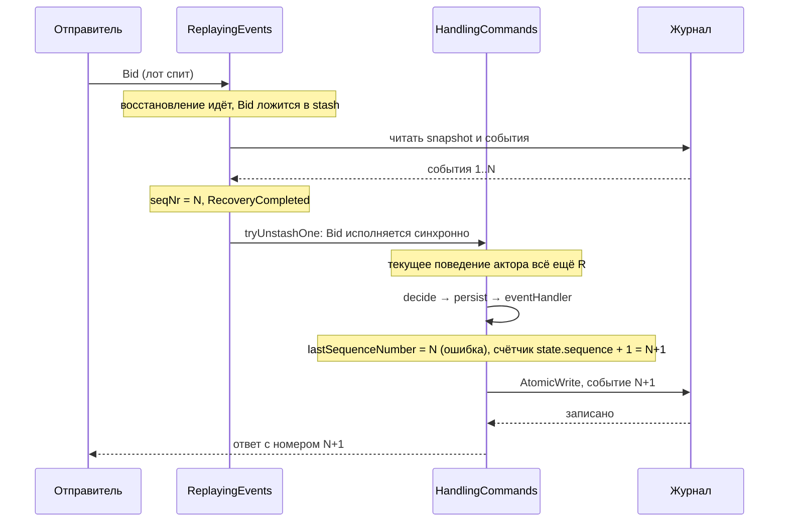

# Pekko Persistence Typed: агрегат как журнал событий

Разбор объясняет, как `apps/auction` делает лот персистентным агрегатом: что такое `EventSourcedBehavior`, где кончается решение и начинается запись, что происходит с командой, которая пришла во время восстановления, и почему номер события entity считает сама, а не спрашивает у Pekko. Читателю не нужно знать Pekko или Akka. Достаточно представлять Event Sourcing по Marten или EventStoreDB и акторы в общих чертах: объект, который обрабатывает сообщения по одному.

Опора:
- `apps/auction/src/main/scala/auction/entity/LotEntity.scala` из среза PER-314;
- исходники `pekko-persistence-typed_3-1.6.0-sources.jar`: `EventSourcedBehavior.scala`, `internal/ReplayingEvents.scala`, `internal/Running.scala`, `internal/StashManagement.scala`;
- прогоны той же сессии: L0-тест, который упал на полном прогоне и прошёл на одиночном, и мутация на L1.

Формат, в котором событие лежит в базе, — в [ADR-058](../../decisions/ADR-058-auction-journal-row-json-storage-model.md). Сами правила торгов, `decide` и `apply`, — в [domain-types.md](domain-types.md).

## Механика

### Агрегат — поведение с тремя функциями

`EventSourcedBehavior` — это актор, у которого состояние не хранится в поле, а сворачивается из журнала. Его задают три вещи:

```scala
EventSourcedBehavior[Command, StoredLotEvent, State](
  persistenceId = PersistenceId(TypeKey.name, lotId),
  emptyState = State(Lot.initial, 0),
  commandHandler = (state, command) => handle(state.lot, command, clock, newId),
  eventHandler = (state, stored) => { ... }
)
```

- `persistenceId` — имя потока в журнале. Здесь `lot|<lot_id>`: одна строка `persistence_id` в таблице `event_journal` на лот.
- `commandHandler` — решение. Он получает состояние и команду и возвращает не новое состояние, а **эффект**: «запиши эти события и потом ответь» (`Effect.persist(...).thenReply(...)`) или «просто ответь» (`Effect.reply(...)`). Сам он ничего не пишет.
- `eventHandler` — применение. Он получает состояние и событие и возвращает новое состояние. Pekko зовёт его и при живой записи, и при восстановлении, и это одна и та же функция.

Аналог в .NET — агрегат Marten с методами `Apply(Event)`. Отличие: Marten загружает поток по запросу и отдаёт агрегат вызывающему, а здесь агрегат живёт в памяти актора, и все команды одного лота идут через него по одной. Конкурентного доступа к состоянию одного лота внутри процесса нет по построению.

### Запись: сначала применение, потом журнал

`Effect.persist(List(event))` не пишет в базу сразу. В `Running.scala` (обработка `PersistAll`) Pekko для каждого события сначала увеличивает номер и зовёт `eventHandler`, а уже потом отдаёт пакет в журнал одним сообщением `AtomicWrite`:

```scala
_currentSequenceNumber = state.seqNr
events.foreach { event =>
  _currentSequenceNumber += 1
  ...
  currentState = currentState.applyEvent(setup, event)
}
```

Почему применение идёт до записи, объясняет комментарий в исходнике: исключение в `eventHandler` должно случиться до того, как событие попало в журнал, иначе в журнале окажется событие, которое нельзя применить. Пока журнал не подтвердил запись, новые команды этого агрегата ждут в stash, а ответ из `thenReply` уходит только после подтверждения. Поэтому ответ «принято» означает «лежит в базе», а не «применено в памяти».

Плагин JDBC кладёт один `AtomicWrite` в одну транзакцию базы. Это проверено L1-тестом `JournalIntegrationSpec`: в журнал заранее кладётся чужая строка на место второго события пакета из двух, и после отказа в журнале нет и первого.

### Отказ записи останавливает entity

Если журнал отверг запись — например, строка с тем же `(persistence_id, sequence_number)` уже есть, потому что тот же лот писал второй узел, — поведение по умолчанию останавливает актор. Ответа отправитель не получает, состояние в памяти пропадает, и следующая команда поднимает entity заново из того, что журнал действительно держит. `onPersistFailure` в `LotEntity` не задан намеренно, правило записано в `apps/auction/AGENTS.md`.

### Восстановление и stash

Когда шардинг будит entity, Pekko сначала читает snapshot, если он есть, затем события после него, и сворачивает их `eventHandler`. Пока это идёт, актор находится в отдельном поведении `ReplayingEvents`, и пришедшие команды он не обрабатывает, а складывает во внутренний stash — очередь отложенных сообщений.

Когда восстановление закончено, `ReplayingEvents` создаёт рабочее поведение и сразу прогоняет через него первую отложенную команду (`ReplayingEvents.scala`, в конце `onRecoveryCompleted`):

```scala
tryUnstashOne(new running.HandlingCommands(initialRunningState))
```

`tryUnstashOne` (`StashManagement.scala`) вызывает `buffer.unstash(behavior, 1, ...)`. Это синхронный вызов обработчика нового поведения **внутри обработки текущего сообщения старого**. Актор ещё не вернулся из `ReplayingEvents`, и для контекста актора текущим поведением остаётся `ReplayingEvents`.

### Номер события и `lastSequenceNumber`

Номер события в потоке — `sequence_number` строки журнала: 1, 2, 3… на каждый `persistence_id`. Ядру лота он нужен, чтобы запомнить конверт принятой команды: повтор того же `op_id` получает тот же ответ с тем же номером.

У Pekko есть функция для номера, `EventSourcedBehavior.lastSequenceNumber(context)` (`EventSourcedBehavior.scala`). Она ищет текущее поведение актора и спрашивает у него:

```scala
extractConcreteBehavior(context.currentBehavior) match {
  case w: Running.WithSeqNrAccessible => w.currentSequenceNumber
  ...
}
```

Дальше всё зависит от того, какое поведение текущее:

- рабочее поведение (`Running`) увеличивает свой счётчик до вызова `eventHandler` — внутри обработчика номер равен номеру применяемого события;
- `ReplayingEvents` при восстановлении ставит `seqNr` события до его применения — номер тоже верен;
- в команде, которая пришла во время восстановления и выполняется из stash, текущим поведением ещё числится `ReplayingEvents`. Его `currentSequenceNumber` — это `state.seqNr`, номер последнего **проигранного** события. Новое событие получает номер на единицу меньше своего.

А пассивированный лот будит именно команда, поэтому на рабочем пути это не редкий случай, а обычный.

`LotEntity` поэтому считает номер сама:

```scala
final case class State(lot: Lot, sequence: Long)

eventHandler = (state, stored) => {
  val sequence = state.sequence + 1
  State(Lot.apply(state.lot, LotJournal.envelope(sequence, stored)), sequence)
}
```

Счёт совпадает с журналом по построению. Через `eventHandler` проходит каждое событие потока ровно один раз и по порядку — при записи и при replay. Snapshot сохраняет `sequence` вместе с лотом, и replay продолжает со следующего события. В строку журнала номер не пишется: там он уже есть в колонке, и второй копии, которая могла бы разойтись, нет.

### Snapshot и его адаптер

`.withRetention(RetentionCriteria.snapshotEvery(100, keepNSnapshots = 2))` велит Pekko сохранять состояние после каждого сотого события и держать два последних snapshot. События при этом не удаляются: журнал остаётся источником истины. `.snapshotAdapter(...)` переводит состояние в класс хранения и обратно, так же как для событий это делает модель хранения из ADR-058.

### Тег — метка события при записи

`withTagger` добавляет к поведению функцию «событие → набор тегов». Pekko зовёт её при записи, и плагин JDBC кладёт каждый тег строкой в таблицу `event_tag` рядом со строкой журнала. Читающая сторона потом выбирает события по тегу (`eventsByTag`) — так устроена проекция, разбор в [pekko-projection.md](pekko-projection.md).

У лота тег один и от события не зависит, поэтому он считается один раз внутри `Behaviors.setup`, где уже есть `ActorSystem`:

```scala
Behaviors.setup { context =>
  val persistenceId = PersistenceId(TypeKey.name, lotId)
  val tag = Set(LotTags.of(Persistence(context.system.classicSystem).sliceForPersistenceId(persistenceId.id)))
  EventSourcedBehavior[Command, StoredLotEvent, State](...)
    ...
    .withTagger(_ => tag)
}
```

`sliceForPersistenceId` — функция Pekko: `math.abs(persistenceId.hashCode % 1024)` (`Persistence.scala` в source-jar 1.6.0). `String.hashCode` в Java задан спецификацией языка, поэтому номер одинаков на любой JVM, а тег — его остаток от деления на 4. Важно, что тег пишется в момент append и потом не меняется: событие, записанное без тега или с другим тегом, остаётся таким навсегда. Смена формулы — переписывание `event_tag`, а не правка кода ([ADR-061](../../decisions/ADR-061-auction-journal-tag-slices.md)).

## Урок

- **Функция вида «дай текущий X» у фреймворка может читать не твоё состояние, а состояние того, кто сейчас держит управление.** `lastSequenceNumber` верна внутри обработчиков в устойчивом состоянии и ошибается в переходном — при выполнении из stash сразу после восстановления. Там, где значение выводится из собственных данных, его надёжнее вывести самому.
- **Тест, который падает не на каждом прогоне, — это сигнал о гонке, а не шум.** Одиночный прогон L0 проходил, потому что команда приходила после восстановления. Полный прогон под нагрузкой ронял его, потому что команда успевала лечь в stash. Детерминированно гонку воспроизводит L1: новый узел, настоящая база, команда уходит сразу после `spawn` и неизбежно ждёт восстановления.
- **Проверь тест мутацией.** Возврат к `lastSequenceNumber` роняет три L1-теста из пяти. Значит, тесты стерегут именно это свойство, а не совпали с ним случайно.

## Почему так, а не иначе

- **`lastSequenceNumber` в `eventHandler`** — первоначальный план. Отвергнут: ошибается ровно на пути пробуждения, см. выше.
- **`lastSequenceNumber` в `commandHandler` и номер в событии.** В командном обработчике номер верен и при выполнении из stash, но тогда его придётся положить в само событие, то есть записать `sequence_number` второй раз в payload строки. Две копии одного числа могут разойтись, и ADR-058 держит конверт без этой копии.
- **Счётчик в состоянии entity** — принят владельцем. Цена: номер живёт в состоянии и в snapshot, и его правильность держится свойством «каждое событие проходит `eventHandler` один раз». Держат его L0 (`restart()`) и L1 (сверка ответа с колонкой `sequence_number`).
- **`onPersistFailure` с рестартом по backoff** — отвергнут ADR-045: рестарт продолжил бы работу с состоянием в памяти, которого в журнале нет.

## Схема



## Первоисточники

- [Pekko: Event Sourcing](https://pekko.apache.org/docs/pekko/current/typed/persistence.html) — зачем: команда, эффект, событие, stash во время восстановления и snapshot глазами документации.
- [Pekko: Snapshotting](https://pekko.apache.org/docs/pekko/current/typed/persistence-snapshot.html) — зачем: `RetentionCriteria` и что происходит с событиями при snapshot.
- `pekko-persistence-typed_3-1.6.0-sources.jar` в Maven Central — зачем: документация не говорит, от чего зависит `lastSequenceNumber`; ответ — в `EventSourcedBehavior.lastSequenceNumber`, `ReplayingEvents.onRecoveryCompleted` и `StashManagement.tryUnstashOne`.
- [ADR-045](../../decisions/ADR-045-auction-scala-pekko-persistence-jdbc.md) — зачем: почему отказ записи останавливает entity и что держит уникальность номера.
- `.skillshare/skills/proj/proj-test-scala/SKILL.md` — зачем: правило «L1 для рестарта и уникальности, in-memory журнал этого не доказывает», по которому гонка и была поймана на настоящей базе.

## Проверь себя

1. Какой номер вернёт `lastSequenceNumber` внутри `eventHandler` для первой команды к лоту, в журнале которого три события, если команда пришла до конца восстановления?
   Ответ: 3, а не 4. Проверка: временно вернуть в `LotEntity` номер из `EventSourcedBehavior.lastSequenceNumber(context)` (понадобится `Behaviors.setup`) и выполнить `AUCTION_INTEGRATION_TESTS=1 sbt -batch "testOnly auction.entity.LotEntityIntegrationSpec"` из `apps/auction`. Тест Т-16 падает с `Right(3) was not equal to Right(4)`.
2. Почему ответ на `Bid` приходит только после записи, а не после `eventHandler`?
   Ответ: `thenReply` — побочный эффект, который Pekko исполняет после подтверждения журнала. Проверка: тест конкурентного писателя в `LotEntityIntegrationSpec` — у отвергнутой записи ответа нет (`expectNoMessage`), хотя `eventHandler` для неё уже отработал.
3. Что останется в журнале, если второе событие пакета из двух не записалось?
   Ответ: ничего из пакета. Проверка: тест `write the events of one command together or not at all` в `JournalIntegrationSpec`.
4. Отказывает ли запись события, у которого нет привязки к сериализатору?
   Проверь сам, когда будет чем: убрать строку `"auction.entity.JournalSerializable" = jackson-json` из `application.conf` и прогнать `sbt -batch "testOnly auction.entity.LotEntitySpec"`. Ожидание по ADR-058 — отказ, потому что Java-сериализация в Pekko выключена, но прогоном в этой сессии это не проверялось.
