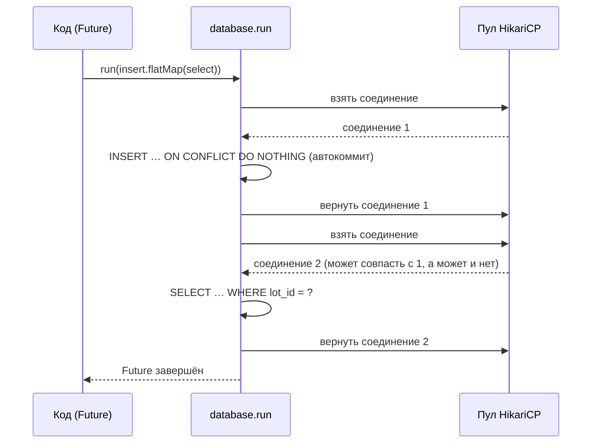

# Slick как исполнитель plain SQL

Разбор объясняет, как `apps/auction` ходит в PostgreSQL мимо журнала событий: что такое действие Slick и чем оно отличается от выполненного запроса, откуда берётся пул, почему `${...}` в SQL-строке — параметр, а не склейка, и почему два запроса, склеенные в одно действие, не обязаны идти по одному соединению. Читателю не нужно знать Slick заранее; достаточно ADO.NET или Dapper.

Опора — `apps/auction/src/main/scala/auction/persistence/SlickLotCatalogStore.scala` и `build.sbt` из среза каталога лота ([ADR-057](../../decisions/ADR-057-auction-lot-catalog-as-state.md)), плюс зонд на настоящем PostgreSQL из той же сессии, результат которого приведён ниже. Как устроен сам запрос `INSERT … ON CONFLICT` — в [postgresql/concurrency.md](../postgresql/concurrency.md#insert--on-conflict-do-nothing-ноль-строк-и-чтение-следом).

## Механика

### Действие — описание, а не выполненный запрос

Slick — библиотека доступа к базе для Scala. Здесь от неё берётся только нижний слой: выполнение SQL на пуле соединений. Главное понятие — **действие** (`DBIO[T]`): значение, которое описывает работу с базой и её результат типа `T`, но само ничего не выполняет.

```scala
private def select(lotId: LotId) =
  sql"SELECT title, description FROM lot_catalog WHERE lot_id = ${lotId.value.toString}::uuid"
    .as[(String, String)]
    .headOption
```

`select(id)` возвращает действие. Запроса в базу в этот момент нет. Выполняет действие только `database.run(action)`, и возвращает `Future[T]` — аналог `Task<T>`:

```scala
def find(lotId: LotId): Future[Option[LotCard]] = database.run(select(lotId))
```

Ближайший аналог из .NET — `IQueryable` в EF: выражение строится, но в базу уходит только при материализации. Отличие: `DBIO` не транслирует выражения в SQL. SQL здесь написан руками, а действие лишь несёт его вместе со способом прочитать результат.

### Интерполятор: `${...}` — параметр запроса

`sql"…"` и `sqlu"…"` выглядят как интерполяция строк (`$"…"` в C#), но не склеивают текст. Каждое `${…}` превращается в `?` подготовленного запроса, а значение уходит отдельным параметром — как `@p0` в Dapper. SQL-инъекции тут нет по построению.

- `sql"…".as[(String, String)]` — запрос, строки которого читаются в кортеж; `.headOption` берёт первую строку или `None`.
- `sqlu"…"` — команда без результата строк: действие отдаёт число затронутых строк (`Int`), как `ExecuteNonQuery`.

Параметр связывается по типу Scala-значения. Для `String` и `Int` связка встроена, для `java.util.UUID` в этом срезе её не заводили: идентификатор передаётся строкой и приводится в SQL — `${…toString}::uuid`. Это осознанная цена: одна строка приведения вместо собственного `SetParameter`.

### Пул — тот же, что у журнала

```scala
val database = SlickExtension(system).database(system.settings.config.getConfig("jdbc-journal")).database
```

Плагин Pekko Persistence JDBC сам построен на Slick и держит пул HikariCP. С `jdbc-journal.use-shared-db = "slick"` в `application.conf` журнал, snapshots и этот вызов получают **один и тот же** пул: `SlickExtension` возвращает уже созданную базу, а не открывает вторую. Поэтому проба готовности `/health`, которая пингует пул журнала, заодно видит и пул каталога.

### Композиция в одном `run` не значит одно соединение

Действия складываются `flatMap`, как `ContinueWith` у задач:

```scala
sqlu"""INSERT … ON CONFLICT (lot_id) DO NOTHING""".flatMap {
  case 1 => DBIO.successful(None)
  case _ => select(card.lotId).flatMap { … }
}
```

Интуиция подсказывает, что всё это выполнится на одном соединении: это же одно действие и один `database.run`. Зонд показывает обратное. Действие `pid.flatMap(a => pid.map(b => a == b))`, где `pid` — `SELECT pg_backend_pid()`, запущено 400 раз параллельно на пуле плагина:

```
PROBE flatMap:           same=48  different=352
PROBE withPinnedSession: same=400 different=0
PROBE transactionally:   same=400 different=0
```

Каждый шаг композиции берёт соединение из пула заново и возвращает его после себя. Одно соединение на всё действие дают только два комбинатора:

- `.withPinnedSession` — закрепить соединение, транзакцию не открывать;
- `.transactionally` — закрепить соединение и выполнить всё одной транзакцией.

Для каталога это не дефект: `INSERT` в режиме автокоммита уже зафиксирован, и `SELECT` с любого соединения его видит. Но всё, что живёт **на сессии**, между шагами такой композиции теряется: временные таблицы, `SET` параметров сессии, advisory-блокировка, `SELECT … FOR UPDATE` без транзакции.

### Транзитивная зависимость, объявленная явно

Slick приходит в сборку вместе с `pekko-persistence-jdbc`, и код компилировался бы и без строки в `build.sbt`. Она добавлена той же версией, что у плагина (`3.5.1` из его POM): код импортирует `slick.jdbc.PostgresProfile.api.*` сам, и обновление плагина молча сменило бы API под ним. Аналог — явный `PackageReference` на пакет, который уже приходит транзитивно, ради того, чтобы им владел проект, а не соседняя библиотека.

## Урок

**Описание работы и её выполнение — разные значения, и граница выполнения не совпадает с границей соединения.** Это переносится на любой стек: `DBIO` в Slick, `ConnectionIO` в doobie, цепочка запросов через Dapper на `IDbConnection` из пула — везде нужно отдельно спросить, что держит соединение между шагами. Если ответ «ничего», то всё сессионное — блокировки, временные таблицы, параметры сессии — работает случайно, пока нагрузка мала.

Второе: **общий пул делит не только соединения, но и отказы.** Каталог и журнал ждут одних и тех же соединений; тяжёлый запрос каталога задержит запись события. Для редких команд администратора это приемлемо, и это записано в ADR как сигнал пересмотра, а не спрятано.

## Почему так, а не иначе

**Plain SQL против lifted embedding.** Верхний слой Slick описывает таблицу классом Scala и строит SQL из выражений на коллекциях. Схему здесь ведёт Flyway, и модель таблицы в коде описала бы её второй раз — два источника правды, которые расходятся молча. Цена plain SQL: колонки не проверяются компилятором, опечатку ловит только L1-тест на PostgreSQL.

**Пул плагина против своего.** Отдельный HikariCP или `DriverManager` изолировал бы нагрузку, но это вторая конфигурация таймаутов и пула, невидимого пробе готовности ([ADR-057](../../decisions/ADR-057-auction-lot-catalog-as-state.md), п. 6).

**Slick против doobie или skunk.** Обе библиотеки живут на Cats Effect, а [scala.md](../../standards/languages/scala.md) не допускает второй effect-рантайм рядом с Pekko.

**Без `.transactionally` в `insertIfAbsent`.** Вставка и чтение следом не требуют одной транзакции: вставка уже зафиксирована, а исчезновение строки между ними обрабатывается явно, отказом, а не ответом «вставлено». Транзакция добавила бы блокировку строки на время чтения, не закрыв ни одного реального сценария.

## Схема



## Первоисточники

- [Slick: Database I/O Actions](https://scala-slick.org/doc/3.5.1/dbio.html) — сюда за композицией действий, `withPinnedSession` и `transactionally`, и за тем, что без них шаги могут идти в разных сессиях.
- [Slick: Plain SQL Queries](https://scala-slick.org/doc/3.5.1/sql.html) — сюда за интерполяторами `sql`/`sqlu`, `GetResult` и `SetParameter`.
- [Pekko Persistence JDBC: Configuration](https://pekko.apache.org/docs/pekko-persistence-jdbc/current/configuration.html) — сюда за `shared-databases` и `use-shared-db`: как журнал, snapshots и сторонний код делят один пул.
- `.skillshare/skills/proj/proj-write-scala/SKILL.md` — отсюда правило «зависимости приходят функциями рядом с потребителем», по которому хранилище оформлено портом `LotCatalogStore`.

## Проверь себя

**Два запроса склеены `flatMap` в одном `database.run`. Одно ли у них соединение?**
Не обязательно. На пуле плагина при 400 параллельных запусках совпало 48 раз из 400. Одно соединение дают `.withPinnedSession` и `.transactionally`.

```scala
val pid = sql"SELECT pg_backend_pid()".as[Int].head
db.run(pid.flatMap(a => pid.map(b => a == b)))                    // иногда false
db.run(pid.flatMap(a => pid.map(b => a == b)).withPinnedSession)  // всегда true
```

**Что получит PostgreSQL от `sql"… WHERE lot_id = ${id}::uuid"`?**
Подготовленный запрос с `$1::uuid` и значение отдельным параметром. В этой сессии это не наблюдалось в журнале сервера — проверь сам, когда будет чем: включи `log_statement = 'all'` у тестового контейнера и найди в его логе строку `execute` с `$1` и следующую за ней `DETAIL: parameters:`.

```bash
docker exec <контейнер> psql -U test -c "ALTER SYSTEM SET log_statement = 'all'; SELECT pg_reload_conf();"
docker logs <контейнер> 2>&1 | grep -A1 lot_catalog
```

**Откуда берётся пул в `SlickLotCatalogStore.apply`, и сколько пулов в процессе?**
Из `SlickExtension` по секции `jdbc-journal`; при `use-shared-db = "slick"` пул один на журнал, snapshots и каталог. Косвенно это видно в логе L1-прогона: строка `db - Starting...` от HikariCP появляется один раз на узел. Прямую проверку по `pg_stat_activity` в этой сессии не ставил — проверь сам, когда будет чем.

```bash
docker exec <контейнер> psql -U test -c "SELECT application_name, count(*) FROM pg_stat_activity GROUP BY 1;"
```
