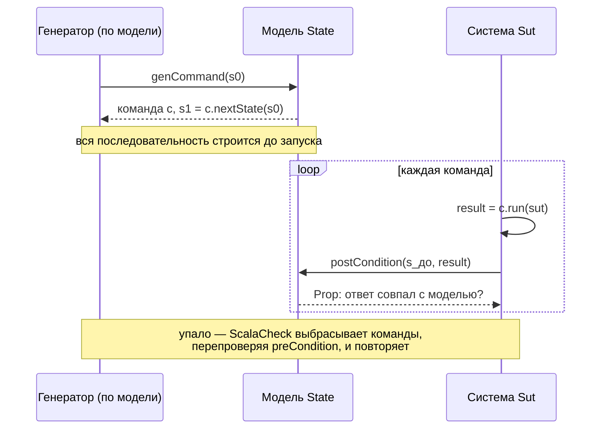

# Тесты на Scala: ScalaTest и ScalaCheck

Разбор объясняет, как устроены тесты ядра лота в `apps/auction`: чем свойство ScalaCheck отличается от примера, зачем для последовательностей команд нужен `Commands`, а не `forAll`, и почему сжатие контрпримера в двух местах выключено. Читателю не нужно знать Scala-тестирование заранее; знание xUnit и FsCheck помогает, но не обязательно.

Опора — тесты `apps/auction/src/test/scala/auction/lot/` из PER-297, прогоны с внесёнными мутациями из той же сессии, временная спека-зонд (её вывод приведён ниже) и исходник `Commands.scala` ScalaCheck 1.18.0. Уровни и стек задаёт [testing-strategy.md](../../standards/testing/testing-strategy.md), имена — [naming.md](../../standards/testing/naming.md).

## Механика

### Спека — это класс с блоками-предложениями

ScalaTest даёт несколько стилей записи; репозиторий взял `AnyWordSpec`. Тест — не метод с атрибутом, как `[Fact]` в xUnit, а вызов внутри тела класса:

```scala
final class LotSpec extends AnyWordSpec with Matchers with ScalaCheckDrivenPropertyChecks {
  "lot" should {
    "reject a bid below the next price and leave the lot unchanged (Т-02)" in {
      ...
      result shouldBe Left(PlaceBidRejected.BidBelowMinimum(money(110)))
      after shouldBe before
```

`"lot" should { … }` и `"…" in { … }` — обычные методы на строке, которые ScalaTest подмешивает трейтом. При создании экземпляра класса тело выполняется и *регистрирует* тесты, а не запускает их; запуск идёт позже. Отсюда следствие, на котором держится отбор уровня в `build.sbt`: сьют создаётся всегда, даже если все его тесты потом отфильтрованы, поэтому тяжёлое в конструкторе сьюта стартует и без нужды. `shouldBe` из `Matchers` — утверждение с сообщением о расхождении, аналог `Should().Be()` из FluentAssertions.

### Свойство вместо примера

Пример проверяет одну точку: цена 100, шаг 10, ставка 105 — отказ. Свойство утверждает инвариант для всех входов из генератора, и ScalaCheck сам подбирает входы:

```scala
forAll(Gen.chooseNum(0L, 1_000_000_000L)) { (price: Long) =>
  StepPolicy.step(fixedTen, money(price)) shouldBe money(10)
}
```

`Gen[T]` — описание того, как получить случайное `T`; генераторы собираются `for`-выражением, как LINQ-запрос собирает последовательность. Свойство ценно ровно настолько, насколько независим его оракул — ожидаемое значение. В `StepPolicySpec` шаг ожидается от референсной формулы `tiers.filter(bound <= price).last`, а не от `StepPolicy.step`: иначе реализация проверяла бы саму себя и была бы зелёной при любой ошибке.

Аналог в .NET — FsCheck, и механизм тот же: FsCheck — порт QuickCheck, как и ScalaCheck.

### Мост ScalaTest—ScalaCheck и его умолчание

`forAll` внутри `AnyWordSpec` берётся не из самого ScalaCheck, а из моста `scalatestplus-scalacheck` (трейт `ScalaCheckDrivenPropertyChecks`). У моста своя конфигурация, и зонд её напечатал:

```text
PROBE bridge-default: PropertyCheckConfiguration(PosInt(10),PosZDouble(5.0),PosZInt(0),PosZInt(100),PosInt(1))
```

Первое число — `minSuccessful`: **десять** успешных проверок, а не сто, как в ScalaCheck по умолчанию. Поэтому каждая спека задаёт число явно:

```scala
implicit override val generatorDrivenConfig: PropertyCheckConfiguration =
  PropertyCheckConfiguration(minSuccessful = 200)
```

`implicit` здесь — значение, которое компилятор сам подставит в каждый `forAll` этого класса. Близкий .NET-аналог — фикстура класса в xUnit, которую тест получает, не передавая явно.

### Сжатие контрпримера и когда его выключать

Упавшее свойство ScalaCheck не отдаёт как есть: он *сжимает* вход, чтобы показать минимальный контрпример. Сжатие задаёт `Shrink[T]`. Для списков оно убирает элементы:

```text
PROBE shrinkDefault: List(List(3), List(1, 2), List(3, 1), List(3, 2))
PROBE shrinkAny: List()
```

Сжатие не знает, как был построен вход. Список порогов шага по построению начинается с нуля и строго растёт; стандартное сжатие выбросит нулевой порог, и сокращённый «контрпример» упадёт не на проверке шага, а на построении политики — сообщение о дефекте подменится сообщением о битых данных. Поэтому в `StepPolicySpec` сжатие для этого типа выключено:

```scala
implicit val noTierShrink: Shrink[List[(Long, Long)]] = Shrink.shrinkAny
```

`shrinkAny` — сжатие, которое не предлагает ничего. Цена — контрпример приходит несокращённым. Мягче — `Shrink.suchThat`, который отбрасывает кандидатов, нарушающих инвариант; он был бы точнее, но требует записать инвариант второй раз.

### `Commands`: последовательность против модели

`forAll` проверяет независимые значения. Для торгов важен порядок: залп равных ставок, повтор того же `op_id`, смена лидера — это свойства *последовательности* команд, и дефект может проявиться только на пятой команде после трёх определённых. Для этого в ScalaCheck есть `org.scalacheck.commands.Commands`: описание системы через две стороны.

- **`Sut`** — проверяемая система, изменяемая. В `LotCommandsSpec` это обёртка с `var journal`, которая зовёт настоящие `Lot.decide` и `Lot.apply`.
- **`State`** — референсная модель, неизменяемая. Здесь `Model`: цена, лидер и принятые `op_id` на примитивах `Long` и `Int`, без типов ядра, и шаг, посчитанный своим способом.

Команда описывает четыре вещи: как применить её к системе (`run`), как изменить модель (`nextState`), когда её можно отправлять (`preCondition`) и как сверить ответ системы с моделью (`postCondition`). Исходник 1.18.0 уточняет две детали, от которых зависит правильная запись:

- последовательность строится **по модели до запуска** системы: `genCommand(s0)` получает состояние модели, а цепочка собирается через `c.nextState(s0)`. Генератор видит модель, а не систему, поэтому может целиться в интересное: `Gen.const(state.next)` порождает ставку ровно по следующей цене, то есть залп;
- `postCondition(state, result)` получает состояние модели **до** команды: «given the system was in the provided state before the command ran». Отсюда в коде `val after = nextState(state)` внутри `postCondition` — сравнивать журнал нужно с моделью *после* команды.

Упавшую последовательность ScalaCheck сжимает сам: из неё выбрасываются команды, а оставшиеся заново проверяются на `preCondition` (`ensurePreconditions` в исходнике). Состояние модели по умолчанию не сжимается (`shrinkState` — `implicitly`, то есть без сжатия).

Спека запускается из ScalaTest трейтом `Checkers`, а не `forAll`, потому что `Commands.property()` возвращает готовое свойство ScalaCheck:

```scala
check(LotCommands.property(), MinSuccessful(200))
```

### Мутация как проверка теста

Зелёный тест доказывает только то, что код и тест согласны. Чтобы проверить сам тест, в ядро вносят ошибку и смотрят, падает ли он. В сессии было внесено две: проверка лидерства перенесена под порог суммы, `replay` лишён сортировки по `sequence`. `LotSpec` упал в двух тестах, `LotCommandsSpec` — в своём единственном:

```text
should answer every sequence of bids exactly as the reference model of RFC-011 does *** FAILED ***
```

Ручная мутация — не инструмент, а приём; инструменты мутационного тестирования для Scala (например, Stryker4s) в репозитории не заведены.

## Урок

- **Оракул свойства должен быть независим от реализации.** Проверка `replay(shuffled) == lot` в первой версии свойства сравнивала реализацию с ней же и прошла бы на любом детерминированном дефекте свёртки. То же правило переносится на FsCheck в Meetups и на любые property-тесты.
- **Последовательность — это отдельный предмет проверки.** Если дефект может жить в порядке команд, `forAll` по отдельным значениям его не найдёт; нужна модель, которая идёт рядом с системой шаг за шагом.
- **Умолчания инструментов проверяются, а не предполагаются.** Десять проверок моста против ста у ScalaCheck — ровно тот случай, когда свойство выглядит проверенным, а проверено в десять раз слабее.

## Почему так, а не иначе

- **`forAll` по сценариям вместо `Commands`.** Проще: генератор списка команд и свёртка. Отвергнут нормативом (testing-strategy.md, «Стек Scala»), и по существу: без модели оракулом становится реализация, а без сжатия по командам контрпример приходит длинным.
- **Модель, переиспользующая типы ядра.** Короче: модель могла бы звать `StepPolicy.step` и хранить `Money`. Отвергнута: ошибка в `step` или в сравнении `Money` тогда оказалась бы и в модели, и расхождение не проявилось бы.
- **`Shrink.suchThat` вместо `shrinkAny`.** Точнее, но требует повторить инвариант генератора в шринкере. Выбран грубый вариант: генератор маленький, и несокращённый контрпример читается.
- **Т-15 остался `forAll` по перестановкам.** Его оракул независим — лидер тот, кто первым в сгенерированном порядке, — и он прямо проверяет формулировку критерия приёмки «при любом порядке генерации». Последовательности с повторами `op_id` ушли в `Commands`.

## Схема



## Первоисточники

- [ScalaCheck, `Commands.scala` 1.18.0](https://github.com/typelevel/scalacheck/blob/v1.18.0/core/shared/src/main/scala/org/scalacheck/commands/Commands.scala) — контракт `run`/`nextState`/`postCondition` и сжатие последовательности; комментарии к методам короче любого пересказа.
- [ScalaCheck User Guide, Stateful Testing](https://github.com/typelevel/scalacheck/blob/main/doc/UserGuide.md#stateful-testing) — пример модели и системы от авторов.
- [ScalaTest + ScalaCheck](https://www.scalatest.org/plus/scalacheck) — мост, `ScalaCheckDrivenPropertyChecks` и `Checkers`.
- [testing-strategy.md](../../standards/testing/testing-strategy.md), раздел «Стек Scala» — почему последовательности идут через `Commands` и только с независимой моделью.
- `.skillshare/skills/proj/proj-test-scala/SKILL.md` — последовательность работы с тестами Scala; оттуда взяты правила «число проверок явно» и «шринкер для суженного генератора».

## Проверь себя

- **Сколько проверок сделает `forAll` моста без явной конфигурации?** Десять. Временная спека с `println(new ScalaCheckDrivenPropertyChecks {}.generatorDrivenConfig)` печатает `PosInt(10)` первым полем.
- **Какое состояние модели видит `postCondition`?** До команды. Проверка: в `LotCommandsSpec` заменить `nextState(state)` в `postCondition` на `state` и прогнать `sbt "testOnly auction.lot.LotCommandsSpec"` — первая же принятая ставка разойдётся по размеру журнала.
- **Ловит ли `Commands` перенос проверки лидерства под порог?** Да. Внести мутацию в `Lot.placeBid` и прогнать ту же команду: спека падает с `*** FAILED ***`.
- **Что вернёт `Shrink.shrinkAny[List[Int]].shrink(List(3, 1, 2))`?** Пустой поток; стандартный `Shrink[List[Int]]` вернёт `List(3)`, `List(1, 2)`, … Проверяется той же временной спекой.
