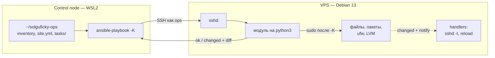
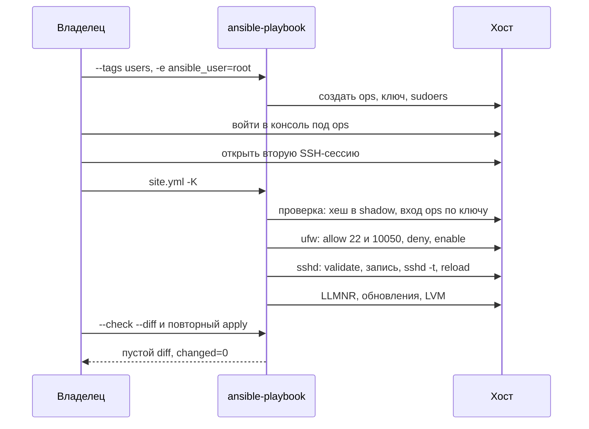

# Ansible: хост как декларация

Разбор объясняет, зачем хосту Solguficky Hub декларация на Ansible, как читается playbook и в каком порядке он применяется к живому серверу, чтобы ни на одном шаге не потерять доступ. Опора — приватный репозиторий [Solguficky/solguficky-ops](https://github.com/Solguficky/solguficky-ops), его первое применение к VPS Timeweb из WSL2 05.10.2026 ([PER-237](https://linear.app/anticnvm/issue/per-237)) и вывод команд этого прогона. Общий словарь — SSH, console, rescue, идемпотентность — уже есть в [vocabulary.md](vocabulary.md), устройство дисков и LVM — в [disks.md](disks.md). Здесь — сам инструмент.

## Механика

### Зачем вообще декларация

Сервер можно настроить руками: войти по SSH, создать пользователя, поправить `sshd_config`, включить firewall. Через месяц никто не вспомнит, что именно было сделано, а после переустановки ОС всё придётся повторять по памяти. RFC-010 требует обратного: состояние хоста лежит в Git, и новый хост поднимается тем же текстом ([RFC-010, «Host baseline»](../../rfcs/RFC-010-remote-development-and-self-hosting-platform.md#host-baseline)).

**Ansible** — программа, которая читает описание желаемого состояния и приводит к нему машину по SSH. Агента на сервере нет: Ansible копирует на хост маленькую программу на Python (модуль), запускает её и забирает результат в JSON. На сервере нужен только `sshd` и `python3`, а в образе Debian 13 оба уже есть.

Ближайший аналог из .NET-мира — миграции EF Core: текст в репозитории описывает целевое состояние, а инструмент сам решает, что применить. Отличие важное: миграция — упорядоченный журнал шагов «от версии N к N+1», а Ansible каждый раз сравнивает желаемое с фактическим. Пропущенной «версии» у него не бывает: правку, сделанную на хосте руками, следующий прогон увидит и вернёт.

### Control node, inventory, playbook

- **Control node** — машина, с которой запускается Ansible. Windows ею быть не может, поэтому это WSL2 на ноутбуке владельца. Сам хост тоже не годится: тогда `--check` проверял бы машину тем, что на ней уже стоит ([vocabulary.md](vocabulary.md#чем-описывается-сам-хост)).
- **Inventory** — список хостов и их переменных. У нас один хост:

  ```yaml
  # inventory.yml
  all:
    vars:
      ansible_user: ops
      ansible_become: true
      ansible_ssh_private_key_file: ~/.ssh/solguficky-vps
    hosts:
      solguficky-vps:
        ansible_host: 80.64.17.33
        state_disk_by_id: /dev/disk/by-id/scsi-0QEMU_QEMU_HARDDISK_vdc
  ```

  Переменные с префиксом `ansible_` — служебные: под каким пользователем входить, каким ключом, повышать ли права. Остальные (`state_disk_by_id`) — наши.
- **Playbook** — YAML-файл со списком задач. `site.yml` говорит «для всех хостов выполни эти файлы `tasks/` по порядку» и подключает их через `import_tasks`:

  ```yaml
  - name: Firewall
    ansible.builtin.import_tasks: tasks/firewall.yml
    tags: [firewall]
  ```

  RFC-010 разрешает одному хосту один playbook и файлы `tasks/`, без **roles** и **Galaxy**. Role — переиспользуемый пакет задач со своей структурой каталогов, Galaxy — их публичный реестр. Для одного сервера это лишний слой.
- **ansible.cfg** в корне репозитория задаёт умолчания: где inventory, таймауты. Ansible ищет его в текущем каталоге, но **игнорирует каталог, доступный на запись всем**. Каталоги Windows, смонтированные в WSL как `/mnt/c/...`, имеют права `drwxrwxrwx`, и там Ansible печатает `ignoring it as an ansible.cfg source`, а `ansible-config dump` показывает `CONFIG_FILE() = None`. Поэтому ops-репозиторий склонирован в домашний каталог WSL (`~/solguficky-ops`), а не лежит рядом с остальными проектами на диске C.

### Модуль и идемпотентность

Задача — вызов одного модуля с параметрами:

```yaml
- name: Install SSH access policy
  ansible.builtin.copy:
    dest: /etc/ssh/sshd_config.d/00-solguficky.conf
    content: |
      PermitRootLogin no
      PasswordAuthentication no
      ...
    validate: /usr/sbin/sshd -t -f %s
  notify: reload sshd
```

Модуль `copy` не «копирует файл», а обеспечивает, что файл с таким содержимым лежит по этому пути. Совпадает — модуль отвечает `ok` и ничего не трогает; не совпадает — пишет и отвечает `changed`. Поэтому второй прогон подряд даёт `changed=0`: это и есть **идемпотентность**, и на ней стоят два критерия приёмки.

Имя `ansible.builtin.copy` — полное имя модуля: коллекция `ansible.builtin` плюс модуль `copy`. **Коллекция** — пакет модулей. Встроенные приходят с `ansible-core`, а `ufw`, `lvg`, `lvol`, `filesystem` лежат в `community.general`, `mount` и `authorized_key` — в `ansible.posix`. Пакет `ansible` (у нас 14.4.0) — это `ansible-core` плюс набор коллекций в комплекте, поэтому Galaxy не нужен:

```bash
uv tool install --force "ansible==14.4.0" --with-executables-from ansible-core
ansible-galaxy collection list | grep -E "community.general|ansible.posix"
```

**`validate`** проверяет новый файл до того, как он ляжет на место: модуль пишет временный файл, подставляет его путь вместо `%s`, запускает команду, и только при коде 0 заменяет настоящий файл. Битый `sshd_config` до диска не доходит. Ограничение: `sshd -t -f %s` проверяет drop-in как самостоятельный конфиг, а совместную конфигурацию со всеми остальными файлами проверяет уже handler, после записи.

Такая же проверка у sudoers — `validate: /usr/sbin/visudo -cf %s`. Опечатка в `/etc/sudoers.d/ops` иначе ломает `sudo` целиком.

### Handlers: действие по факту изменения

Перечитать конфиг sshd нужно, только если он поменялся. Для этого задача объявляет `notify`, а действие лежит в **handler**:

```yaml
# handlers.yml
- name: Check full sshd config
  ansible.builtin.command: /usr/sbin/sshd -t
  changed_when: false
  listen: reload sshd

- name: Reload sshd
  ansible.builtin.systemd_service:
    name: ssh
    state: reloaded
  listen: reload sshd
```

Handler запускается, только если уведомившая задача ответила `changed`, и не сразу, а в конце play. `listen` позволяет одним уведомлением запустить два handler'а по порядку: сначала проверка всей конфигурации, потом reload. Упала проверка — reload не случится, и работающий sshd останется на старых настройках.

Отложенность handler'а здесь мешает: после задачи sshd идут ещё LLMNR, обновления и диск, а политику SSH хочется применить сразу. Для этого в `tasks/sshd.yml` стоит `ansible.builtin.meta: flush_handlers`: «выполни накопленные handler'ы сейчас».

**reload, а не restart.** Reload посылает демону SIGHUP: он перечитывает конфиг для новых подключений, а открытые сессии живут дальше. Это проверено на живом хосте: во второй SSH-сессии крутился `while sleep 2; do date; done`, из первой выполнен `sudo sshd -t && sudo systemctl reload ssh`, и часы не прервались. Служебное соединение самого Ansible тоже пережило reload: следующие задачи шли по нему же.

Обратная сторона: уведомление живёт только в этом прогоне. Если play упал после изменившейся задачи, но до handler'а, следующий прогон увидит файл уже правильным, ответит `ok`, и `notify` не случится. Файл на месте, а демон его так и не перечитал. От этого в `ansible.cfg` стоит `force_handlers = True`: handler'ы, успевшие получить уведомление, выполняются и при падении play. Это поведение по документации, на живом хосте не воспроизводилось. Проверь сам, когда будет чем: уроните play заданием `fail` после изменившегося `copy` и посмотрите, выполнился ли handler.

### Повышение прав: `become`

На хост Ansible входит как `ops`, а пакеты и конфиги требуют root. **become** — повышение прав через `sudo`. У `ops` есть пароль только для `sudo`, войти им по SSH нельзя, поэтому прогон запускается с `-K` и спрашивает `BECOME password`.

Ловушка, на которой споткнулся первый прогон: где задано `become`. В inventory стоит **переменная** `ansible_become: true`. Задача проверки доступа запускает `ssh` на самом control node (`delegate_to: localhost`), и `sudo` там не нужен, поэтому в ней стояло **ключевое слово** `become: false`. Ansible всё равно пытался выполнить `sudo` на ноутбуке и ждал пароль, пока не упал по таймауту: `Timed out waiting for become success or become password prompt`.

Причина в приоритете. Служебные переменные `ansible_*` из inventory сильнее ключевых слов задачи. Перекрыть переменную можно только переменной с более высоким приоритетом, например `vars:` самой задачи:

```yaml
- name: Ops logs in by key from control node
  ansible.builtin.command: >-
    ssh -o BatchMode=yes ... {{ ops_user }}@{{ ansible_host }} true
  delegate_to: localhost
  vars:
    ansible_become: false
```

Аналог из .NET — конфигурация ASP.NET Core, где переменная окружения перекрывает `appsettings.json`: значение берётся у самого сильного источника, а не у того, что написан ближе к коду. На вершине лестницы стоят `-e` из командной строки, поэтому первый прогон входит под root так: `-e ansible_user=root`, не трогая inventory.

### Check mode и его слепые зоны

`--check` — прогон, в котором модули только сообщают, что изменили бы, а `--diff` показывает разницу в файлах. На настроенном хосте пустой diff и `changed=0` доказывают, что декларация и хост совпадают.

На свежем хосте check mode врёт, потому что шаги зависят друг от друга, а предыдущий в check mode ничего не сделал:

- `apt` с `ufw` отвечает «поставил бы», но пакета нет, и следующий `lineinfile` на `/etc/default/ufw` падает: `Destination /etc/default/ufw does not exist`;
- `apt` с `lvm2` — то же, и `community.general.lvg` падает: `Failed to find required executable "pvs"`;
- `authorized_key` для ещё не созданного `ops` не может вычислить путь: `Either user must exist or you must provide full path to key file in check mode`.

Лечится явно. Шаги ufw обёрнуты в `block` с условием «не в check mode, если пакет только что "был бы" поставлен»:

```yaml
- name: Install ufw
  ansible.builtin.apt:
    name: ufw
  register: firewall_package

- name: Configure ufw
  when: not (ansible_check_mode and firewall_package.changed)
  block:
    - ...
```

`register` сохраняет ответ модуля в переменную, а `changed` в нём — тот самый флаг. Для ключа задан явный `path:`, а предпросмотр разметки диска заканчивается на классификации диска (ниже).

Обратный случай — команды, которые только читают: `readlink`, `pvs`, `wipefs -n`. В check mode модуль `command` по умолчанию не выполняется вовсе, и решения по их выводу принимать не из чего. Таким задачам ставят `check_mode: false` («выполняй и в check mode») и `changed_when: false` («это чтение, не изменение»), иначе каждая читающая команда считалась бы изменением и ломала `changed=0`.

### Факты и проверки

В начале play Ansible собирает **факты** о хосте: дистрибутив, диски, точки монтирования. Они лежат в `ansible_facts`, и по ним пишутся проверки:

```yaml
- name: Host runs Debian 13
  ansible.builtin.assert:
    that:
      - ansible_facts.distribution == 'Debian'
      - ansible_facts.distribution_major_version == '13'
```

`assert` ничего не меняет: он роняет прогон, если условие ложно. Так playbook проверяет то, что сам не делает или делает опасно. Пустой вход у такой проверки — частая ловушка: `readlink -f` на несуществующий путь в `/dev/disk/by-id/` возвращает сам этот путь с кодом 0, и сравнение «state-диск не корневой» проходит, когда диска нет вовсе. Поэтому до сравнения стоит отдельная проверка существования:

```yaml
- name: Stat disks by id
  ansible.builtin.stat:
    path: "{{ item }}"
    follow: false
  loop: ["{{ root_disk_by_id }}", "{{ state_disk_by_id }}"]
  register: preflight_disk_links

- name: Disks by id exist
  ansible.builtin.assert:
    that: [item.stat.exists, item.stat.islnk]
  loop: "{{ preflight_disk_links.results }}"
```

`loop` повторяет задачу для каждого элемента. Зарегистрированный результат цикла — список `results`, по одному ответу на элемент.

### Диск: идемпотентность разрушительной операции

Создать LVM — операция, которая на чужом диске уничтожает данные. Модули `lvg`, `lvol`, `filesystem` сами по себе идемпотентны: повторный `filesystem` не форматирует том, на котором уже есть `ext4`. Но первый прогон на диске с чужими данными они бы честно разметили. Поэтому до них стоит классификация по трём чтениям:

```yaml
storage_disk_is_ours: "{{ storage_pv.rc == 0 and storage_pv.stdout | trim == state_vg }}"
storage_disk_is_empty: >-
  {{ storage_pv.rc != 0
     and storage_signatures.stdout | trim == ''
     and storage_children.stdout_lines | length == 1 }}
```

Диск свой, если `pvs` называет нашу VG `data`. Пустой — если он не PV, `wipefs --noheadings` не видит сигнатур и `lsblk` не видит разделов. Всё остальное — `fail` с выводом всех трёх чтений, и диск не трогается. `{{ ... }}` — шаблоны Jinja2: выражение вычисляется при выполнении задачи, а `| trim` — фильтр, как метод-расширение над строкой.

Дальше `lvol` с `shrink: false` (меньший размер в переменной не уменьшит живой том), `filesystem` с `resizefs: true` (рост LV растит и `ext4`) и `ansible.posix.mount` с `state: mounted`: модуль и пишет строку в `/etc/fstab`, и монтирует. Опция `nofail` в fstab нужна, чтобы отцепленный в панели диск не уводил загрузку в emergency mode, где нет sshd. На хосте строка выглядит так: `/dev/data/prod /srv/state ext4 defaults,nodev,nosuid,nofail 0 0`.

### Файлы, которые читает не Ansible

Две задачи пишут конфиги, у которых своя логика слияния, и Ansible её не знает:

- **sshd берёт первое значение директивы.** В `sshd_config` Debian первой строкой стоит `Include /etc/ssh/sshd_config.d/*.conf`, а файлы подключаются по алфавиту. Образ Timeweb кладёт `50-cloud-init.conf` с `PasswordAuthentication yes`. До playbook `sshd -T` показывал `passwordauthentication yes`, хотя основной файл говорил `no`: выигрывал drop-in, потому что он раньше. Наш файл называется `00-solguficky.conf` и раньше всех, поэтому его значения перекрывают и основной файл, и cloud-init. После применения сервер на вход без ключа отвечает `Permission denied (publickey)`, пароль даже не предлагается.
- **apt складывает списки из файлов.** `50unattended-upgrades` Debian перечисляет три origin'а, включая обычные point-release. Свой файл `52solguficky-unattended-upgrades` с `Origins-Pattern` только добавил бы к ним свои. Директива `#clear Unattended-Upgrade::Origins-Pattern;` сначала очищает список. Проверено без root: `apt-config dump | grep Origins-Pattern` на хосте показывает пустую строку очистки и ровно два security-origin'а, а `Automatic-Reboot "false"` — отдельной строкой.

## Как playbook ложится на свежий хост

Порядок строится по одному правилу из [vocabulary.md](vocabulary.md#урок): не убирай путь отхода, пока не проверил запасной. Образ панели пускает только root по ключу. Конечное состояние пускает только `ops`. Между ними нельзя оказаться без обоих входов.

1. **Узнать хост, ничего не меняя.** Под root по ключу: `ss -tulpn`, `lsblk`, `ls -l /dev/disk/by-id`, `sshd -T`, `dpkg -l` нужных пакетов. Здесь нашлись `PasswordAuthentication yes` от cloud-init, порты zabbix-agent и LLMNR на всех адресах и поменявшиеся местами `sda`/`sdb`. Playbook писался от этих фактов, а не от ожиданий.
2. **Синтаксис и пробные прогоны.** `ansible-playbook site.yml --syntax-check`, затем `--check --diff -e ansible_user=root` по тегам. Пробные прогоны нашли слепые зоны check mode из раздела выше. Правило, выученное дорогой ценой: пробно прогоняется **каждый** тег, который потом пойдёт на живой хост. Теги `sshd` и `firewall` сначала пропускались, и оба их дефекта владелец получил уже на своём прогоне.
3. **Пароль `ops` — на control node.** `openssl passwd -6 > ~/.config/solguficky-ops/ops-password.hash`: `openssl` спрашивает пароль и пишет только хеш SHA-512 crypt (`$6$…`). Модуль `user` кладёт его в `/etc/shadow` при создании пользователя (`update_password: on_create`) и больше не трогает, поэтому повторный прогон хеш не требует.
4. **Создать `ops`, пока root открыт.** `ansible-playbook site.yml -e ansible_user=root --diff --tags users`. Потом снаружи: `ssh ops@… true` проходит, `sudo -n true` отвечает `a password is required`.
5. **Проверить запасной вход.** Консоль панели Timeweb, вход `ops` с паролем. Вторая SSH-сессия под `ops` открыта и не закрывается.
6. **Весь playbook под `ops`.** `ansible-playbook site.yml -K --diff`. Внутри он сам держит порядок:
   - проверка доступа: у `ops` в `/etc/shadow` хеш, и `ops` входит по ключу отдельной сессией с control node;
   - ufw: сначала `allow 22/tcp` и 10050 для мониторинга, потом `default deny`, и только затем `enable`;
   - sshd: `validate`, запись, `sshd -t`, reload через `flush_handlers`;
   - остальное.
7. **Доказать снаружи.** root по ключу — `Permission denied`, вход без ключа — пароль не предлагается, порты 22 открыт, 10050 и 5355 закрыты.
8. **Повторяемость.** `--check --diff` даёт ноль diff-блоков, повторный apply — `changed=0`.
9. **Негативный путь.** В консоли: `sed -i 's/^AllowUsers ops$/AllowUsers opz/' …` и reload. Новый `ssh ops@…` получает отказ. В консоли та же правка обратно, `sshd -t`, reload, вход вернулся. Root для починки не нужен — для того консоль и проверялась на шаге 5. Файл после ручной починки совпал с playbook по `sha256sum`, то есть следующий прогон не увидит дрейфа.

Один прогон на шаге 6 упал посреди цикла правил ufw: `Timeout (12s) waiting for privilege escalation prompt`. Разовая задержка сети, а не дефект: следующие замеры дали ping около 75 мс без потерь. Состояние осталось безопасным: правила добавлены, ufw ещё `inactive`, sshd не тронут. Именно поэтому разрешения ставятся раньше включения. Таймаут поднят до 30 секунд строкой `timeout = 30` в `ansible.cfg`, и повтор того же прогона просто продолжил с места: уже добавленные правила модуль `ufw` отметил `ok`.

## Урок

- **Декларация проверяет сама себя.** `--check --diff` на настроенном хосте — тест «код равен состоянию». Ручная правка на сервере всплывает как diff при следующем прогоне, а не теряется в памяти.
- **Предпросмотр зависимой цепочки врёт там, где шаг полагается на результат предыдущего.** Это верно не только для Ansible: `terraform plan` показывает `(known after apply)` ровно для значений, которые появятся только после создания соседнего ресурса. Место, где предпросмотр не может ответить, лучше пропускать явно, чем давать ему падать.
- **Читающая команда должна сказать, что она читает.** Без `changed_when: false` любой `command` считается изменением, и честный `changed=0` становится недостижимым. Идемпотентность держится и на словах «это не изменение».
- **Разрушительный шаг сначала классифицирует цель.** Пустой, свой, чужой — три исхода, и только первые два ведут к действию. Отказ печатает, что увидел, чтобы человек решал по фактам.
- **Приоритет конфигурации — часть её смысла.** Где задано значение, важно не меньше, чем какое оно: ключевое слово задачи проиграло переменной inventory, drop-in sshd выиграл у основного файла, список apt сложился, а не заменился. Перед правкой сначала выясни, кто побеждает.
- **Проверка, которой нечего проверять, не должна выглядеть зелёной.** `readlink -f` на несуществующий путь отвечает кодом 0, и сравнение над его выводом проходит.

## Почему так, а не иначе

- **Скрипт на bash по SSH.** Быстрее написать, но идемпотентность и предпросмотр пришлось бы строить руками для каждого шага: «есть ли уже пользователь», «совпадает ли файл». Режима «покажи, что изменится» у скрипта нет вовсе.
- **cloud-init.** Срабатывает один раз при первой загрузке и годится для того, что нужно до первого входа. Для «привести живой хост к описанию» он не подходит: повторно не запускается, и предпросмотра нет. Образ панели уже пользуется им, и его `50-cloud-init.conf` пришлось перекрывать.
- **Puppet, Salt, Chef.** Держат агента на хосте, который сам тянет состояние с сервера. Для одного сервера это второй сервис, который нужно ставить и обновлять. Ansible по SSH агента не требует.
- **Roles и Galaxy.** Нужны, когда одна и та же настройка повторяется на многих хостах. Для одного хоста это лишняя структура каталогов и внешние зависимости, поэтому RFC-010 их запрещает.
- **`ansible-core` без коллекций и всё через `command`.** Тогда идемпотентность `ufw`, LVM и `mount` пришлось бы писать самим. Пакет `ansible` целиком везёт коллекции с собой и закрепляется одной версией.
- **`sudo` без пароля (NOPASSWD).** Прогоны шли бы без `-K`, и агент мог бы запускать их сам. Но тогда украденный ключ `ops` — это сразу root, а «ограниченный sudo» из RFC-010 ничего не значит. Цена выбранного варианта: каждый боевой прогон требует пароля человека.
- **ufw, а не nftables руками** — в [vocabulary.md](vocabulary.md#почему-так-а-не-иначе).
- **Разметка из панели при установке ОС.** Панель Timeweb её не выбирает, поэтому LVM на дополнительном диске создаёт playbook ([disks.md](disks.md#почему-так-а-не-иначе)).

## Схема





## Первоисточники

- [Ansible playbooks](https://docs.ansible.com/projects/ansible-core/devel/playbook_guide/playbooks_intro.html) — модель play, задачи и модуля; отсюда идемпотентность и check mode.
- [Check mode and diff mode](https://docs.ansible.com/ansible/latest/playbook_guide/playbooks_checkmode.html) — что делает `--check`, `check_mode: false` на задаче и почему `command` в check mode пропускается.
- [Handlers](https://docs.ansible.com/ansible/latest/playbook_guide/playbooks_handlers.html) — `notify`, `listen`, `flush_handlers` и поведение при падении play, включая `force_handlers`.
- [Variable precedence](https://docs.ansible.com/ansible/latest/playbook_guide/playbooks_variables.html#understanding-variable-precedence) — лестница приоритетов, на которой `ansible_become` из inventory обыгрывает ключевое слово задачи.
- [Understanding privilege escalation: become](https://docs.ansible.com/ansible/latest/playbook_guide/playbooks_privilege_escalation.html) — `become`, `-K` и связь ключевых слов с переменными `ansible_become*`.
- [Avoiding security risks with ansible.cfg in the current directory](https://docs.ansible.com/ansible/devel/reference_appendices/config.html#cfg-in-world-writable-dir) — почему `ansible.cfg` в `/mnt/c` игнорируется.
- [community.general.ufw](https://docs.ansible.com/ansible/latest/collections/community/general/ufw_module.html), [community.general.lvol](https://docs.ansible.com/ansible/latest/collections/community/general/lvol_module.html), [ansible.posix.mount](https://docs.ansible.com/ansible/latest/collections/ansible/posix/mount_module.html) — параметры, на которых держатся шаги firewall и диска: `shrink`, `state: mounted`.
- [sshd_config(5)](https://man.openbsd.org/sshd_config) — «for each keyword, the first obtained value will be used», отсюда префикс `00-` у drop-in.
- [unattended-upgrade(8)](https://manpages.debian.org/stable/unattended-upgrades/unattended-upgrade.8.en.html) — `Origins-Pattern` и `Automatic-Reboot`.
- [RFC-010, «Host baseline»](../../rfcs/RFC-010-remote-development-and-self-hosting-platform.md#host-baseline) — почему один playbook без roles, control node в WSL2 и порядок «не потерять доступ».
- [docs/access.md в ops-репозитории](https://github.com/Solguficky/solguficky-ops/blob/main/docs/access.md) — процедура консоли, rescue и отката политики SSH.

## Проверь себя

1. **Совпадает ли хост с декларацией прямо сейчас?** `cd ~/solguficky-ops && ansible-playbook site.yml -K --check --diff`. Ответ: да, если нет ни одного блока `---`/`+++` и в итоге `changed=0`.
2. **Почему `ansible.cfg` из каталога на диске C не подхватывается?** `stat -c '%A' .` показывает `drwxrwxrwx`, а `ansible-config dump --only-changed` — `CONFIG_FILE() = None` и предупреждение `world writable directory`.
3. **Какое значение `PasswordAuthentication` действует на хосте и из какого файла?** `sudo sshd -T | grep passwordauthentication` даёт `no`. `ls /etc/ssh/sshd_config.d/` показывает `00-solguficky.conf` раньше `50-cloud-init.conf`: первое значение выигрывает.
4. **Какие origin'ы обновляет unattended-upgrades?** `apt-config dump | grep Origins-Pattern` — без root. Ответ: строка очистки `""` и два origin'а `Debian-Security`.
5. **Что ответит `readlink -f` на несуществующий by-id?** `readlink -f /dev/disk/by-id/does-not-exist; echo $?` печатает тот же путь и `0`. Поэтому в preflight до сравнения стоит `stat`.
6. **Переживёт ли открытая SSH-сессия reload sshd?** Во второй сессии `while sleep 2; do date; done`, в первой `sudo systemctl reload ssh`. Часы идут дальше.
7. **Видны ли правила ufw для IPv6?** `sudo ufw status verbose` покажет строки с `(v6)`. Снаружи IPv6 из этой сети не проверялся: у ноутбука нет IPv6-маршрута. Проверь с машины, где он есть: `nc -6 -zv 2a03:6f02::1:758d 10050` должен отказать, а `… 22` — соединиться.
8. **Растёт ли `ext4` вместе с томом?** На хосте не запускалось. Проверь, когда понадобится место: поднимите `state_lv_size_gb` в `site.yml`, прогоните playbook и сравните `df -h /srv/state` до и после.
