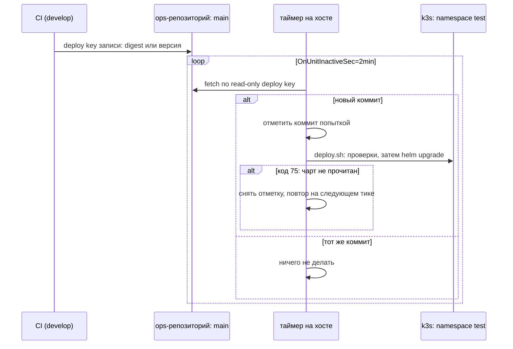

# Автовыкладка stage: pull-модель, deploy keys и таймер systemd

Разбор объясняет, как stage обновляется сам после мержа в `develop`, когда у CI нет входа на хост, и на каких механизмах это держится. Опора:

- дифф PER-454: [PR #371](https://github.com/Solguficky/solguficky-hub/pull/371) — джоба записи `stage-bump.yml`; PR #3 приватного ops-репозитория — `stage/autodeploy.sh`, `stage/deploy.sh`, `tasks/autodeploy.yml`, `tests/stage.sh`;
- опыт с временными таймерами systemd в WSL (Debian/Ubuntu, systemd пользователя), выполненный при записи разбора;
- `man systemd.timer` и документация GitHub о deploy keys — цитаты ниже дословные.

Как CI передаёт значение в ops-репозиторий — [github-actions/reusable-workflows.md](../github-actions/reusable-workflows.md). Что делает сама выкладка helm — [helm/hooks-and-rollout.md](../helm/hooks-and-rollout.md). Правила stage — [stage.md](../../development/stage.md), решение — дополнение [ADR-055](../../decisions/ADR-055-k3s-runtime-from-aspire-chart.md) от 2026-10-07.

## Механика

### Push против pull

Выкатить новую версию — значит запустить `helm upgrade` с учёткой, у которой есть права на кластер. Вопрос в том, **кто** его запускает.

- **Push.** CI сам заходит на хост (`ssh`, туннель к API Kubernetes) и запускает выкладку. Значит, у CI есть ключ входа на хост и учётка кластера. Утечка секретов CI — это доступ к stage.
- **Pull.** CI только записывает желаемое состояние в git-репозиторий: «stage должен работать на образе с таким-то digest». Хост сам периодически читает репозиторий и приводит себя к записанному. У CI нет ни входа на хост, ни учётки кластера; утечка его ключа даёт только запись в репозиторий, а она видна в истории.

Flux — это pull-модель с контроллером внутри кластера. Срез делает то же без контроллера: ops-репозиторий — источник желаемого состояния, а таймер на хосте — «контроллер» из двадцати строк. Поэтому переход на Flux ([PER-383](https://linear.app/anticnvm/issue/per-383)) меняет читателя, а не писателя: джоба CI и файлы `values.yaml` и `release.yaml` остаются.

### Deploy key: ключ на один репозиторий

Deploy key — SSH-ключ, который добавляется не человеку, а одному репозиторию. Документация GitHub:

> Deploy keys only grant access to a single repository.
> You can't reuse a deploy key for multiple repositories.
> Deploy keys are read-only by default, but you can give them write access when adding them to a repository.

Поэтому ключей два, и у каждого своя роль:

| Ключ | Где лежит закрытая часть | Права | Что даёт утечка |
|---|---|---|---|
| запись | секрет `OPS_DEPLOY_KEY` environment `stage` в GitHub | запись в ops-репозиторий | коммит в ops, который выкатится на stage |
| чтение | `~ops/.ssh/ops-repo-read` на хосте, создан там же | только чтение | содержимое ops-репозитория |

Закрытая часть ключа чтения создаётся на хосте и его не покидает: в git и в Ansible-переменных её нет, владелец добавляет в GitHub только публичную. Цена deploy key, которую называет сама документация, — нет срока жизни и пароля: «credentials that don't have an expiry date». Аналог в .NET-мире — строка подключения с постоянным паролем, выданная одному приложению: узко, но без ротации.

### Закреплённый ключ хоста

SSH проверяет не только клиента, но и сервер: при первом подключении клиент запоминает ключ хоста в `known_hosts` и дальше требует того же. `ssh-keyscan github.com` берёт этот ключ из сети — то есть доверяет первому ответу, кто бы его ни прислал. Срез вместо этого записывает в `known_hosts` опубликованный ключ GitHub литералом (`vars.yml`, `stage-bump.yml`) и включает `StrictHostKeyChecking=yes`. Подмена сервера тогда даёт отказ, а не тихое подключение.

### Unit, service и timer

systemd управляет **unit'ами**. Два вида нужны здесь:

- **service** — что запустить. `Type=oneshot` значит «процесс отработает и завершится»; systemd считает unit активным, пока процесс идёт, и неактивным после.
- **timer** — когда запускать service того же имени. Сам он ничего не исполняет.

Юнит системный (`/etc/systemd/system/`) с `User=ops`, а не пользовательский. Пользовательский manager systemd живёт, пока пользователь залогинен, а после перезагрузки поднимается только с linger ([remote-workstation.md](remote-workstation.md)). Системному не нужен ни вход `ops`, ни linger.

### Как таймер стартует и тикает

Таймер stage:

```ini
[Timer]
OnBootSec=3min
OnUnitInactiveSec=2min
```

Обе строки нужны, и это проверено опытом.

- `OnUnitInactiveSec` отсчитывает от момента, когда service **закончился**. Таймер, у которого есть только эта строка, ни разу не сработал: service ещё ни разу не был неактивным после запуска таймера — отсчитывать не от чего. Опыт: `systemd-run --user --on-unit-inactive=2s …`, за 6 секунд — 0 запусков.
- `OnBootSec` запускает цепочку. И если момент «3 минуты после загрузки» уже в прошлом, таймер срабатывает сразу при включении. `man systemd.timer`: «If a timer configured with OnBootSec= or OnStartupSec= is already in the past when the timer unit is activated, it will immediately elapse and the configured unit is started. This is not the case for timers defined in the other directives.» Опыт: `--on-boot=1s --on-unit-inactive=4s` на давно загруженной машине — первый запуск сразу, дальше раз в ~4,1 секунды.

Отсюда два следствия для stage:

- Интервал считается **от конца** прошлой выкладки, поэтому выкладка дольше двух минут не копит очередь тиков.
- Первое включение таймера на работающем хосте выкатывает `main` немедленно. Поэтому `--tags autodeploy` прогоняют, когда токены обоих ботов уже в файле секретов.

`Persistent=true` здесь бесполезен: `man systemd.timer` — «this setting only has an effect on timers configured with OnCalendar=». Пропуск за время простоя закрывает `OnBootSec`.

### Попытка отмечается до выкладки

Таймер должен выполнить два требования, которые тянут в разные стороны:

- упавшая выкладка не повторяется по кругу — иначе каждые две минуты новая упавшая ревизия helm;
- следующий коммит выкатывается заново.

Решение — запоминать не «что выкачено», а «что пробовали»: `autodeploy.sh` пишет хеш коммита в `~/.local/state/solguficky/autodeploy.attempted` **до** вызова выкладки. Тот же хеш на следующем тике — выход без действий; новый — новая попытка. Это семантика «не больше одного раза на коммит».

Одно исключение: если выкладка не начиналась — чарт не прочитан из реестра, — `deploy.sh` выходит с кодом 75 (`EX_TEMPFAIL` из `sysexits.h`, «временный сбой, повтори позже»; `python3 -c "import os; print(os.EX_TEMPFAIL)"` — 75), и `autodeploy.sh` стирает отметку. Кластер не тронут, повтор безопасен. Код выбран из общепринятого словаря, а не придуман: так его читают и люди, и другие инструменты.

### Один lock на ручную и автоматическую выкладку

Ручная выкладка `bin/stage deploy` и таймер вызывают один `deploy.sh`, а тот берёт файловую блокировку `flock -w 1800` на `~/.local/state/solguficky/deploy.lock`. Второй ждёт первого до 30 минут; не дождался — код 1 и понятная причина (проверено: `flock -w 2` на занятом файле возвращает 1, после освобождения — 0). Аналог в .NET — именованный `Mutex` с таймаутом ожидания.

## Урок

- **Pull-модель сужает то, что даёт утечка CI.** Писатель желаемого состояния и исполнитель разделены: у первого нет доступа к среде, у второго нет входа снаружи. Это переносится на любой стенд без входящего доступа, в том числе на будущий прод.
- **Контроллер из таймера отвечает на те же вопросы, что Flux:** где желаемое состояние, как часто сверять, что делать с упавшей попыткой. «Отметка попытки до действия» — семантика не больше одного раза, а отдельный код временного сбоя — способ вернуть повтор там, где он безопасен.
- **У таймера systemd старт и интервал — разные строки.** Интервальный таймер без стартовой строки молчит, а стартовая строка в прошлом срабатывает при включении.

## Почему так, а не иначе

- **Push из CI** (`ssh` на хост и `helm upgrade`). Минус — CI получает вход на хост; «Обоснование» ADR-055 отвергло это и для прода. 6443 к тому же закрыт.
- **Flux сейчас.** Правильная цель, но это контроллеры в кластере, SOPS и проверка attestation — объём [PER-383](https://linear.app/anticnvm/issue/per-383). Таймер даёт ту же модель за малую цену и уступает место без переделки писателя.
- **Пользовательский юнит с linger.** Тот же результат, но зависит от включённого linger у `ops`; системный юнит с `User=` переживает перезагрузку без условий.
- **Отметка «что выкачено» вместо «что пробовали».** Тогда упавшая выкладка повторялась бы каждые две минуты, и каждая попытка — новая ревизия helm с простоем `Recreate`.
- **Один токен GitHub с правами на оба репозитория.** Fine-grained PAT привязан к человеку и истекает; deploy key узок и не зависит от учётки владельца.

## Схема



## Первоисточники

- `man systemd.timer` — `OnBootSec`, `OnUnitInactiveSec`, срабатывание моментов в прошлом и область действия `Persistent=`.
- `man systemd.service` — `Type=oneshot` и `TimeoutStartSec`.
- [Managing deploy keys](https://docs.github.com/en/authentication/connecting-to-github-with-ssh/managing-deploy-keys) — область одного репозитория, чтение по умолчанию, запись по выбору и минусы deploy key.
- [GitHub's SSH key fingerprints](https://docs.github.com/en/authentication/keeping-your-account-and-data-secure/githubs-ssh-key-fingerprints) — откуда берётся закреплённый ключ хоста.
- `man flock` — ожидание с таймаутом `-w`.

## Проверь себя

Команды на хосте — под `ops`. Пока владелец не поставил таймер (`site.yml --tags autodeploy`), вопросы 1–3 — «проверь сам, когда будет чем».

1. **Сработал ли таймер после загрузки?** `ansible-playbook verify.yml -K --tags autodeploy` с control node: `UnitFileState` — `enabled`, `ActiveState` — `active`, `LastTriggerUSecMonotonic` не `0`.
2. **Почему упавший коммит не повторяется?** `cat ~/.local/state/solguficky/autodeploy.attempted` совпадает с `git -C ~/solguficky-ops rev-parse HEAD`, а `journalctl -u solguficky-stage-autodeploy --since -10min` после упавшей выкладки — без новых попыток.
3. **Как вернуть stage к `main` после чарта ветки без нового коммита?** `bin/stage resume` стирает отметку попытки; через ≤2 минуты в `bin/stage autolog` — новая выкладка того же коммита.
4. **Почему таймер без `OnBootSec` не стартует?** Локально: `systemd-run --user --on-unit-inactive=2s bash -c 'date >> /tmp/x'`, через 6 секунд `/tmp/x` нет. Проверено при записи разбора.
5. **Что вернёт `deploy.sh`, если GHCR недоступен?** `75`. Проверено `bash tests/stage.sh` в ops: случай «an unreadable chart exits 75 before the cluster».
