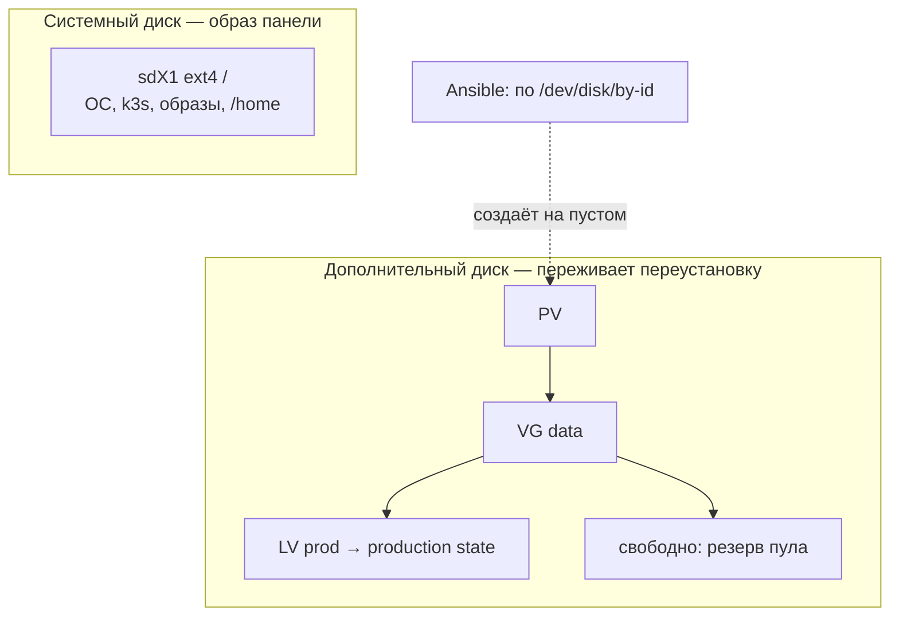

# Диски VPS: LVM, граница тома и имена устройств

Разбор объясняет, как Linux видит диски арендованного сервера и зачем RFC-010 держит production state на отдельном томе. Опора — spike [PER-233](https://linear.app/anticnvm/issue/per-233) на хосте Timeweb: вывод `lsblk`, `ls -l /dev/disk/by-id` и `wipefs` до и после переустановки ОС. Решение о раскладке записано баннером в [RFC-010](../../rfcs/RFC-010-remote-development-and-self-hosting-platform.md); здесь — механика, на которой оно стоит.

## Механика

### Диск, раздел, файловая система

Ядро показывает каждый диск устройством в `/dev`. `lsblk` на свежем хосте:

```
NAME     SIZE TYPE FSTYPE MOUNTPOINT
sda       80G disk
├─sda1  79.9G part ext4   /
├─sda14    3M part
└─sda15  124M part vfat   /boot/efi
```

`sda` — весь диск, `sda1` — раздел на нём, `ext4` — файловая система внутри раздела, `/` — куда она подключена (смонтирована). Аналог из Windows: диск 0 в «Управлении дисками», том `C:`, NTFS. Отличие: в Linux нет букв дисков, всё живёт в одном дереве от `/`, и любая папка может оказаться отдельным диском.

Раздел задаётся при разметке, и менять его на живой системе больно: раздел, на котором стоит корень, нельзя просто сдвинуть, пока система с него работает. Образ панели Timeweb ставится одним разделом `sda1` на весь диск: пакет `cloud-initramfs-growroot` при первой загрузке растягивает его до конца диска.

### Зачем отдельный том: граница размера

Один раздел на всё означает одно общее место. Сборка агента, логи или образы контейнеров заполнят его до нуля — и вместе с ними встанет PostgreSQL: ему некуда писать WAL, журнал изменений, без которого база не принимает запись. Отдельный том под production state — это стена: переполнение по одну её сторону не трогает другую. RFC-010 называет это bounded volume.

### LVM: диск как пул

**LVM** (Logical Volume Manager) — слой между дисками и файловыми системами. Три понятия:

- **PV** (physical volume) — диск или раздел, отданный LVM;
- **VG** (volume group) — пул из одного или нескольких PV;
- **LV** (logical volume) — кусок пула, который выглядит для системы как обычный раздел: на нём делают `ext4` и монтируют.

Аналог из .NET-мира ближе всего к Storage Spaces в Windows: пул дисков и виртуальные тома поверх него. Выигрыш — том можно создать и увеличить без переразметки диска, и том не обязан занимать весь пул: свободное место в VG остаётся резервом, который отдаётся тому, когда понадобится.

На хосте LVM создал Ansible в [PER-237](https://linear.app/anticnvm/issue/per-237) 05.10.2026: VG `data` на дополнительном диске, LV `prod` на 12 GB с `ext4` в `/srv/state`, опции `nodev,nosuid`. Playbook делает это модулями `lvg`, `lvol`, `filesystem` и `mount`, а не командами ниже. Команды — то же самое руками; `lvextend` на хосте ещё не запускался:

```bash
pvcreate /dev/disk/by-id/<диск>          # отдать диск LVM
vgcreate data /dev/disk/by-id/<диск>     # пул из одного диска
lvcreate -L 12G -n prod data             # том 12 GB, остальное — резерв пула
mkfs.ext4 /dev/data/prod
lvextend -r -L +4G /dev/data/prod        # увеличить том и ext4 разом (-r)
```

Уменьшать `ext4` можно только размонтированным, поэтому том заводят меньше пула и растят по мере нужды, а не наоборот.

### Имена `/dev/sdX` не стабильны

До переустановки ОС системный диск был `sda`, а добавленный 20 GB — `sdb`. После переустановки:

```
NAME     SIZE FSTYPE LABEL      MOUNTPOINT
sda       20G ext4   spikeprobe
sdb       80G
├─sdb1  79.9G ext4              /
```

Буквы раздаются в порядке, в котором ядро обнаружило диски при загрузке, а порядок между загрузками не обещан. Стабилен путь `/dev/disk/by-id/`: там ссылки по серийному номеру, который диску выдал гипервизор.

```
scsi-0QEMU_QEMU_HARDDISK_vda -> ../../sdb    # системный
scsi-0QEMU_QEMU_HARDDISK_vdc -> ../../sda    # дополнительный
```

До переустановки те же идентификаторы указывали на `sda` и `sdb` соответственно — серийный номер переехал вместе с диском, буква нет. Команда `mkfs` или `wipefs` по букве, записанная до переустановки, после неё стёрла бы системный диск. Поэтому перед разрушительной командой по диску сверяют, что он не корневой:

```bash
readlink -f /dev/disk/by-id/scsi-0QEMU_QEMU_HARDDISK_vdc   # /dev/sda
findmnt -no SOURCE /                                         # /dev/sdb1
```

### Дополнительный диск переживает переустановку ОС

На дополнительный диск перед переустановкой лёг файл-маркер; после переустановки он прочитался тем же содержимым. Переустановка из панели перезаписывает только системный диск. Для production state это удобно — пересоздание хоста не трогает данные, — но «переустановить начисто» больше не значит «чистый диск», и Ansible обязан отличать пустой диск от диска с данными, а не форматировать безусловно. `wipefs -n` показывает сигнатуры, не стирая их; пустой вывод — диск пуст.

## Урок

- Граница по ресурсу — отдельный том, а не договорённость «не заливать много»: переполнение одного потребителя не должно останавливать другого. Тот же принцип у cgroup для памяти ([vocabulary.md](vocabulary.md#чем-ограничивают-процессы)).
- Устройство адресуют по идентичности, а не по порядку обнаружения. То же правило, что digest вместо tag у образа: имя, которое может переклеиться, не годится для разрушительной операции.
- Разрушительная команда проверяет цель перед действием, а не полагается на то, что цель не изменилась.

## Почему так, а не иначе

- **LVM на системном диске при установке** — буква RFC-010. Панель Timeweb разметку не выбирает; путь — свой образ с LVM, но Timeweb не растягивает LVM-образ под диск сервера, и каждое пересоздание тянет сборку и загрузку образа.
- **Переразметить системный диск cloud-init'ом при первой загрузке** — та же граница на одном диске, но через самый хрупкий шаг: ошибка в нём оставляет хост без корня, и чинить его можно только через rescue.
- **Один раздел и квоты** — квота считает место по владельцу файлов. Граница тогда держится на том, под каким uid пишет каждый процесс, а не на размере: процесс без квоты или под root по-прежнему съедает общий раздел целиком. Том ограничивает место независимо от того, кто пишет.
- **Выбрано:** системный диск — образ панели, production state — LVM на дополнительном диске. Цена — 120 ₽ за 10 GB в месяц и правило адресации по `by-id`.

## Схема



## Первоисточники

- [lvm(8)](https://man7.org/linux/man-pages/man8/lvm.8.html) — что такое PV, VG и LV и какие команды их создают.
- [lvextend(8)](https://man7.org/linux/man-pages/man8/lvextend.8.html) — флаг `-r`, который растит файловую систему вместе с томом.
- [Persistent block device naming, ArchWiki](https://wiki.archlinux.org/title/Persistent_block_device_naming) — почему `/dev/sdX` меняются и чем адресовать стабильно.
- [Переустановка ОС, Timeweb Cloud](https://timeweb.cloud/docs/cloud-servers/manage-servers/os-reinstall) — что панель даёт выбрать при переустановке.
- [Образы сервера, Timeweb Cloud](https://timeweb.cloud/docs/cloud-servers/manage-servers/server-images) — переустановка из своего образа и ограничение на LVM.

## Проверь себя

1. **На какой диск указывает буква `sda` на хосте сейчас?** Ответ даёт только команда, а не память: `readlink -f /dev/disk/by-id/scsi-0QEMU_QEMU_HARDDISK_vda` — системный, `…_vdc` — дополнительный.
2. **Пуст ли дополнительный диск?** `wipefs -n /dev/disk/by-id/scsi-0QEMU_QEMU_HARDDISK_vdc` — пустой вывод значит, что сигнатур файловой системы и LVM нет. Playbook задаёт тот же вопрос перед разметкой: пустой диск размечает, PV своей VG `data` только проверяет, на любой другой сигнатуре останавливается и диск не трогает.
3. **Что займёт место на `/` и не тронет production state?** `df -h / && df -h <точка монтирования LV>` — две разные строки с разным `Avail` и есть граница.
