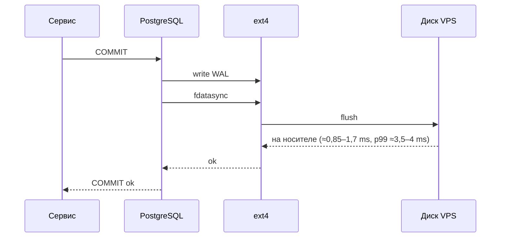

# Замеры VPS: CPU steal, диск и хвосты задержки

Разбор объясняет, что и зачем меряют на арендованном сервере до того, как класть на него базу. Опора — spike [PER-233](https://linear.app/anticnvm/issue/per-233): вывод `mpstat` и `fio` на хосте Timeweb, 4 vCPU, 8 GB, два локальных диска. Критерии хоста — [RFC-010](../../rfcs/RFC-010-remote-development-and-self-hosting-platform.md), раздел «Критерии хоста»: конкурентность подтверждается замером steal, latency и OOM.

## Механика

### Почему на VPS меряют, а не верят тарифу

VPS — виртуальная машина на физическом сервере, который делят несколько клиентов. Тариф обещает число vCPU и объём диска, но не то, сколько их достаётся под нагрузкой соседей. Это и меряют: не «сколько у меня ядер», а «сколько из них реально мои и насколько стабильно».

### CPU steal

**Steal** — доля времени, когда виртуальный процессор готов был работать, а гипервизор отдал физическое ядро другой машине. Видна в колонке `%steal` у `mpstat` (пакет `sysstat`):

```
mpstat 1 60                       # простой, минута
Average: all ... %steal 0.03 ... %idle 99.33
4 × while :; do :; done + mpstat  # все vCPU на 100 %
Average: all  %usr 99.66 ... %steal 0.22
```

Мерить надо под нагрузкой: в простое steal почти всегда ноль, потому что процессору нечего отбирать. 0,22 % при четырёх загруженных vCPU — соседи практически не отнимают процессор. Ориентир, а не норма RFC: при steal в единицы процентов сборка и тесты замедляются без видимой причины внутри машины, и искать её надо у хостера, а не в своём коде.

### fio: что меряют на диске

`fio` гоняет синтетическую нагрузку с заданной формой. Три параметра определяют, на какой вопрос отвечает прогон:

- `--bs` — размер одной операции: 4k — мелкие случайные чтения базы, 1M — последовательная запись;
- `--iodepth` — сколько операций в полёте одновременно (глубина очереди). `qd1` — одна операция за раз, это задержка; `qd16` — очередь, это пропускная способность;
- `--direct=1` — мимо страничного кэша, иначе меряется RAM, а не диск.

```
randrw 4k qd16 read:  20287 IOPS, clat mean 0.30 ms p99 1.47 ms p99.9 3.95 ms
randrw 4k qd16 write:  8713 IOPS, clat mean 1.10 ms p99 3.26 ms p99.9 7.05 ms
randread 4k qd1:       clat mean 0.15 ms p99 0.78 ms
seq write 1M:          1688 MB/s
```

### fdatasync — цена коммита базы

PostgreSQL подтверждает транзакцию только после того, как её запись в WAL физически на диске. Для этого он вызывает `fdatasync` — системный вызов «дождись, пока данные файла дойдут до носителя». Поэтому для базы главная цифра — задержка `fdatasync` на одной операции:

```
fio --rw=write --bs=8k --ioengine=sync --fdatasync=1   # 8k — страница PostgreSQL
fdatasync 8k qd1: 1120 IOPS, sync lat mean 0.85 ms p99 3.46 ms
```

Средняя 0,85 ms — потолок примерно в тысячу последовательных коммитов в секунду из одного соединения. Для бота сообщества это на порядки больше нужного; важнее хвост.

### Хвосты и шумные соседи

**p99** — задержка, которую не превышают 99 % операций; **p99.9** — 999 из 1000. Средняя прячет редкие медленные операции, а пользователь бота чувствует именно их. На spike хвост записи — 3,3 ms на p99 и 7 ms на p99.9 при средней 1,1 ms.

Второй признак соседей — разброс между прогонами. Один и тот же тест 4k qd16 дал 11,5k IOPS на чтение в первом прогоне и 20,3k во втором. `fdatasync` на системном диске — 0,85 ms 4 октября и 1,54–1,64 ms 5 октября. Чтобы отделить свойство диска от времени суток, прогоны двух дисков чередуют в одном окне:

```
run1 /root       mean 1.54 ms p99 3.46 ms      # системный
run1 /mnt/probe  mean 1.61 ms p99 3.52 ms      # дополнительный
run2 /root       mean 1.64 ms p99 3.98 ms
run2 /mnt/probe  mean 1.71 ms p99 4.23 ms
```

Диски одинаковы, меняется время. Вывод: одиночный прогон — не характеристика хоста, нужна серия, а сравнение — только в одном окне.

### Время перезагрузки

RFC просит замерить reboot, потому что из него складывается время восстановления: `systemd-analyze` показал 2,2 s ядра и 4,8 s userspace, а от команды до ответа SSH снаружи прошло 25 s. Второе число честнее для расчёта простоя: в него входят остановка служб, загрузка виртуальной машины до ядра и подъём сети.

## Урок

- Меряют под нагрузкой и сериями: steal в простое и одиночный прогон диска отвечают не на тот вопрос.
- Для базы важна задержка `fdatasync` на одной операции, а не IOPS с глубокой очередью: коммит ждёт ровно один `fdatasync`.
- Хвост и разброс характеризуют общий хост лучше средней; средняя пригодна только для сравнения в одном окне.
- Число из прогона записывают с формой нагрузки: «1120 IOPS» без `bs`, `iodepth` и `fdatasync` ничего не значит.

## Почему так, а не иначе

- **`dd if=/dev/zero of=file`** — меряет последовательную запись в кэш, если не задать `oflag=direct`, и ничего не говорит о задержке коммита.
- **Синтетика вроде `pgbench`** — точнее для PostgreSQL, но требует поднятой базы, а spike по границам задачи данных не ставит. `fio` с `fdatasync` 8k — ближайшее к WAL без базы.
- **Одиночный прогон** — дешевле, но разброс между прогонами на этом хосте почти двукратный: одиночное число может оказаться и лучшим, и худшим часом соседей.

## Схема



## Первоисточники

- [fio documentation](https://fio.readthedocs.io/en/latest/fio_doc.html) — параметры `bs`, `iodepth`, `direct`, `fdatasync` и поля JSON-вывода с перцентилями.
- [mpstat(1)](https://man7.org/linux/man-pages/man1/mpstat.1.html) — колонка `%steal` и что в неё входит.
- [PostgreSQL: WAL Reliability](https://www.postgresql.org/docs/current/wal-reliability.html) — почему коммит ждёт сброса WAL на носитель.
- [pg_test_fsync](https://www.postgresql.org/docs/current/pgtestfsync.html) — штатный инструмент PostgreSQL для того же замера, когда база уже стоит.

## Проверь себя

1. **Отнимают ли соседи процессор под нагрузкой?** Загрузи все vCPU (`nproc` циклов `while :; do :; done`) и смотри `%steal` в `mpstat 1 30`; на spike — 0,22 %.
2. **Сколько ждёт один коммит?** `fio --name=f --filename=fio.tmp --size=256M --rw=write --bs=8k --ioengine=sync --fdatasync=1 --runtime=20 --time_based --output-format=json` и поле `sync.lat_ns` с перцентилями.
3. **Почему terse-вывод fio опасен для перцентилей?** На spike первый разбор terse-полей дал p99 0,10 ms при средней 0,58 ms — меньше средней, чего для одного распределения быть не может. В terse поля адресуются порядковым номером, и ошибка в номере даёт правдоподобное, но чужое число. JSON называет поля по имени.
