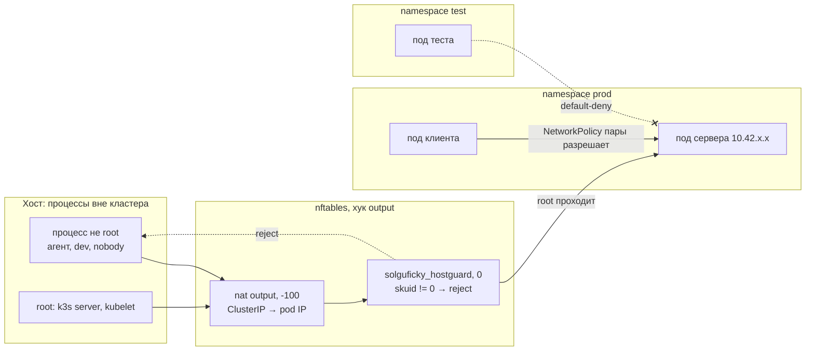
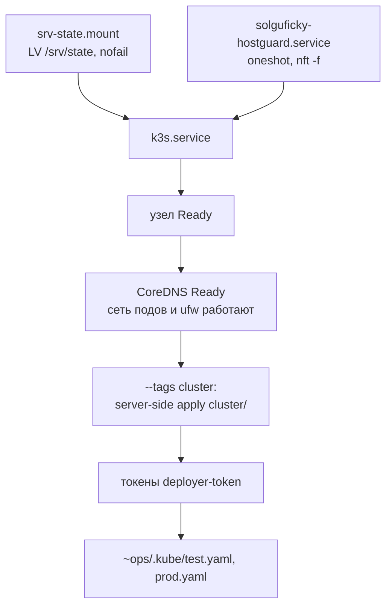

# k3s на одном хосте: кластер, сеть и границы

Разбор объясняет, как устроен k3s, поставленный на VPS Solguficky Hub, и почему каждая его настройка выглядит именно так. Опора — коммиты `d886039`, `c85604c` и `b272ae1` приватного ops-репозитория ([Solguficky/solguficky-ops](https://github.com/Solguficky/solguficky-ops)), [дополнение 2026-10-05 к ADR-055](../../decisions/ADR-055-k3s-runtime-from-aspire-chart.md#дополнение-2026-10-05-установка-на-хост) и вывод команд установки 05.10.2026 ([PER-371](https://linear.app/anticnvm/issue/per-371)): лабораторного контейнера и боевых прогонов на хосте. Ansible-часть этого среза — в [ansible.md](ansible.md#k3s-скачать-по-сумме-поставить-скриптом-дождаться-живого-кластера), учёт памяти — в [memory-accounting.md](memory-accounting.md), словарь — в [vocabulary.md](vocabulary.md).

## Механика

### Что такое k3s

Kubernetes — это не одна программа, а набор: API-сервер (единственная дверь, через которую меняется состояние кластера), хранилище этого состояния (обычно etcd), планировщик (решает, на какой узел пойдёт под), controller-manager (циклы «привести факт к желаемому»), а на каждом узле — kubelet (запускает контейнеры пода) и kube-proxy (переводит адреса сервисов в адреса подов). Сверху — сеть подов (CNI), DNS кластера и способ выдавать диски.

**k3s** — дистрибутив Kubernetes, в котором всё это собрано в один бинарь `/usr/local/bin/k3s`. Процесс `k3s server` держит в себе API-сервер, планировщик, controller-manager, kubelet и kube-proxy. Хранилище — не etcd, а **kine**: прослойка, которая отвечает API-серверу на языке etcd, а данные кладёт в SQLite. Рядом процесс запускает свой containerd (рантайм контейнеров), сеть flannel и контроллер NetworkPolicy на основе kube-router. Встроенными компонентами приходят CoreDNS (DNS кластера), local-path-provisioner (тома в каталоге узла), Traefik (ingress), ServiceLB (балансировщик) и metrics-server: часть из них — поды в `kube-system`, часть — контроллеры внутри самого сервера.

Аналогия из .NET: ASP.NET Core тоже собирает хост из отдельных частей — Kestrel, DI, конфигурацию, — но даёт `WebApplication.CreateBuilder` с разумными умолчаниями. k3s — тот же приём для Kubernetes: части те же, но собраны одним бинарём с умолчаниями под маленький кластер. Отличие в том, что выключить ненужное здесь надо явно, иначе оно работает.

Видно по одному узлу: после установки `kubectl get pods -n kube-system` показывает только `coredns` и `local-path-provisioner`. Остальное — процессы внутри `k3s server`, их видно в `ps`, а не в списке подов. На хосте замер дал `k3s-server` 400 MiB PSS, `containerd` 105 MiB и четыре шима по ~9 MiB (шим — маленький процесс-надзиратель на каждый под), поды — 30 MiB рабочего набора. Как считать такие числа, разобрано в [memory-accounting.md](memory-accounting.md).

### Конфиг до первого старта

k3s читает флаги из `/etc/rancher/k3s/config.yaml` — ключ на флаг:

```yaml
data-dir: /srv/state/k3s
default-local-storage-path: /srv/state/volumes
cluster-cidr: 10.42.0.0/16
service-cidr: 10.43.0.0/16
write-kubeconfig-mode: "0600"
disable:
  - traefik
  - servicelb
  - metrics-server
kubelet-arg:
  - container-log-max-size=10Mi
  - container-log-max-files=5
```

- **`data-dir`** — где лежит всё состояние: база kine, образы containerd, сертификаты. После первого прогона там появились `agent`, `data` и `server`. Файл должен лечь до первого старта: k3s инициализирует каталог при первом запуске, и смена `data-dir` после этого означает новый пустой кластер, а не переезд.
- **`disable`** выключает встроенные компоненты. Traefik принимал бы HTTP снаружи, а боту ingress не нужен: апдейты он забирает long polling'ом. ServiceLB на сервис типа LoadBalancer открыл бы порт на адресе узла. metrics-server нужен для `kubectl top` и автомасштабирования, которых здесь нет.
- **`cluster-cidr` и `service-cidr`** — сети подов и сервисов. Это умолчания k3s, но записаны явно: от них зависят правила firewall, и умолчание, о котором firewall не знает, ломается молча.
- **`write-kubeconfig-mode: "0600"`** — админский kubeconfig `/etc/rancher/k3s/k3s.yaml` читает только root.
- **`kubelet-arg`** передаёт флаги kubelet. Про ротацию логов — ниже.

Какие флаги kubelet k3s ставит сам, видно в исходнике: `pkg/daemons/agent/agent.go:180` тега v1.36.5+k3s1 содержит `FailSwapOn: utilsptr.To(false)`. Обычный kubelet отказывается стартовать, если в системе есть swap, а k3s это умолчание снимает. Поэтому zram на хосте узлу не мешает.

### Адрес API: почему не localhost

Задача сначала просила «API только на localhost». [ADR-055](../../decisions/ADR-055-k3s-runtime-from-aspire-chart.md) это отвергает, и причина — в сетевых пространствах имён.

У каждого пода своё **network namespace**: свои интерфейсы, свои маршруты и свой `127.0.0.1`. Под, который пишет в `localhost:6443`, стучится в себя, а не в узел. Внутрикластерные клиенты API — будущие Flux и оператор CloudNativePG — ходят к нему через сервис `kubernetes` в namespace `default`. Его ClusterIP — `10.43.0.1`, а за ним стоит адрес узла и порт 6443. API, который слушает только `127.0.0.1` узла, для подов недостижим.

Поэтому API слушает все адреса узла, а 6443 снаружи закрывает ufw. На хосте это видно двумя проверками `verify.yml`: `ss -Htln` показывает `*:6443` и `*:10250` слушающими, а `nc -z -w 3` с ноутбука до тех же портов получает отказ. Пара нужна целиком: отказ без «порт слушает» прошёл бы и на остановленном k3s.

### ClusterIP: адрес, которого нет ни на одном интерфейсе

Сервис в Kubernetes — стабильное имя и **ClusterIP** перед меняющимся набором подов. ClusterIP не принадлежит ни одному интерфейсу. kube-proxy пишет в таблицу `nat` правила DNAT: «пакет на `10.43.x.y:80` переадресовать на `10.42.0.19:8080`», адрес одного из подов сервиса. Подмена происходит в ядре до того, как пакет куда-то уйдёт.

Это важно для двух мест. Первое — DNS кластера: `nslookup verify-server.prod.svc.cluster.local` в поде отвечает ClusterIP (`10.43.220.120` в лаборатории), а соединяется под уже с адресом пода. Второе — правило host guard ниже: оно видит пакет после подмены.

### NetworkPolicy и kube-router

**NetworkPolicy** — объект Kubernetes «кто с кем может говорить», а исполняет его контроллер сети, у k3s это kube-router. Политика выбирает поды по меткам (`podSelector`) и перечисляет разрешённый вход (`ingress`) и выход (`egress`). Пустой селектор `{}` выбирает все поды namespace. Как только под выбран хоть одной политикой нужного направления, всё, что ни одна политика не разрешает, запрещено. Разрешения складываются.

Отсюда схема каркаса сред:

```yaml
kind: NetworkPolicy
metadata:
  name: default-deny
spec:
  podSelector: {}
  policyTypes: [Ingress, Egress]
```

Эта политика ничего не разрешает: она только выбирает все поды по обоим направлениям, и всё становится запрещено. Следом `allow-dns` разрешает выход к подам CoreDNS (`k8s-app: kube-dns` в namespace `kube-system`) на порт 53. `allow-https-egress` разрешает TCP 443 в `0.0.0.0/0`, кроме частных сетей: Telegram API нужен обеим средам, а его адреса не закреплены. Сеть подов `10.42.0.0/16` входит в исключённую `10.0.0.0/8`, поэтому HTTPS к соседям по кластеру этой политикой не открыт.

Проверено на хосте парой: клиент в `prod` с разрешающей политикой пары `verify` получает `200` от сервера в `prod`, а под в `test` по адресу того же сервера в ту же минуту получает отказ (`cross-blocked`).

**Гонка свежего пода.** kube-router переводит селекторы политик в наборы адресов (ipset) и обновляет их по событиям API. Под, только что запущенный и сразу шлющий запрос, в набор ещё не попал. В лаборатории первый `curl` клиента получил отказ за `0 ms`, а тот же клиент с паузой 20 секунд получил `200` по обоим адресам. Поэтому клиенты в `verify.yml` повторяют запрос в цикле `until curl …; do sleep 2; done`, а общий потолок держит `kubectl wait` на 120 секунд.

**Трафик с самого узла.** Процесс хоста — не под, и политика на него не распространяется. Вход в под с адреса узла, по [ADR-055](../../decisions/ADR-055-k3s-runtime-from-aspire-chart.md), обычно не режется: иначе не работали бы пробы kubelet — «NetworkPolicy трафик с самого узла обычно не режет». Здесь это не проверялось напрямую: в `verify.yml` нет запроса от root с хоста в под. Проверь сам, когда будет чем: под с `default-deny` в `prod`, затем `sudo curl -m3 http://<pod IP>:8080/` с хоста — если ответ пришёл, политика узел пропускает.

### Host guard: правило по владельцу процесса

Раз политика не закрывает узел, агент, работающий на хосте под своим Unix-пользователем, достаёт до ClusterIP и адресов подов любой среды. [ADR-056](../../decisions/ADR-056-service-calls-per-caller-token-and-closed-network.md) требует постоянного второго рубежа: firewall хоста, который смотрит, **чей процесс** шлёт пакет.

Firewall в Linux — подсистема ядра **netfilter**. Пакет проходит по **хукам** (точкам): `input` — пакет пришёл в этот хост, `forward` — проходит через хост дальше, `output` — порождён процессом этого хоста. На хук вешаются **цепочки** правил, у каждой цепочки есть **приоритет**, и цепочки одного хука выполняются по возрастанию приоритета. Цепочки группируются в **таблицы**.

**nftables** — современный интерфейс к netfilter. Правило host guard:

```text
table inet solguficky_hostguard {
  chain output {
    type filter hook output priority filter; policy accept;
    ip daddr { 10.42.0.0/16, 10.43.0.0/16 } meta skuid != 0 counter reject
  }
}
```

- `inet` — таблица для IPv4 и IPv6 сразу.
- `hook output` — смотрит только пакеты, которые родил процесс хоста. Пакеты подов идут через `forward` или живут в своём network namespace, их правило не видит.
- `priority filter` — числом 0. NAT-подмена ClusterIP в `output` стоит на приоритете −100 (`dstnat`), то есть раньше, поэтому запрос к ClusterIP сюда приходит уже с адресом пода. Сеть сервисов в списке оставлена как страховка. Порядок приоритетов взят из документации nftables, на хосте отдельно не выводился. Проверь сам: `sudo nft list ruleset | grep -B1 'hook output'` покажет приоритеты всех цепочек этого хука.
- `meta skuid != 0` — UID владельца сокета не root. kubelet и `k3s server` работают от root, их пробы и обращения правило пропускает.
- `counter` считает пакеты, `reject` отвечает отказом сразу. Для TCP это выглядит как `Connection refused`, а не таймаут.

nft сам слил две соседние сети: в лаборатории `nft list table` показал `ip daddr { 10.42.0.0/15 }`. Это одно правило на обе `/16`.

В `verify.yml` отказ доказывается двумя наблюдениями. `runuser -u nobody -- timeout 5 bash -c '</dev/tcp/<адрес>/<порт>'` по адресу пода и по ClusterIP должен вернуть `refused`. Счётчик правила до и после должен вырасти минимум на два. Одного `refused` мало: его дал бы и kube-router, и упавший сервис. Рост счётчика именно этой таблицы говорит, кто отказал.

**Почему своя таблица, а не ufw.** В nftables каждая цепочка на хуке выносит свой вердикт. `accept` в одной таблице не отменяет `reject` в другой: чтобы пакет прошёл, его должны пропустить все. Своя таблица остаётся последним словом, что бы ни делали с остальными: `ufw reload` перезаписывает только таблицы ufw, рестарт k3s — только цепочки kube-proxy и flannel. Файл правил начинается с двух строк:

```text
table inet solguficky_hostguard
delete table inet solguficky_hostguard
```

`nft -f` применяет файл одной транзакцией. Первая строка создаёт таблицу, если её нет, вторая удаляет, третий блок создаёт заново. Повторная загрузка не копит дубли и не оставляет окна без правила.

**Почему не штатный `nftables.service` Debian.** Его `/etc/nftables.conf` начинается с `flush ruleset`, а это удаление всех таблиц — и ufw, и k3s. Поэтому таблицу грузит свой юнит `solguficky-hostguard.service`, а штатный выключен (`enabled: false`). Останавливать его playbook не берётся: `ExecStop` штатного юнита — тот же `flush ruleset`.

### ufw рядом с k3s

ufw с политикой `deny (incoming)` и `deny (routed)` режет два пути, нужных кластеру:

- **под → API и kubelet на адресе узла.** Для хоста это входящий пакет из сети подов. Правило `ufw allow from 10.42.0.0/16`.
- **под → под и под → интернет.** Это пересылка через хост, хук `forward`, и у ufw по умолчанию `DROP`. Правило `ufw route allow from 10.42.0.0/16`.

В лаборатории это выглядело так:

```text
Default: deny (incoming), allow (outgoing), deny (routed)
Anywhere                   ALLOW IN    10.42.0.0/16               # k3s
Anywhere                   ALLOW FWD   10.42.0.0/16               # k3s
```

Без этих правил узел всё равно становится `Ready`: статус узла сообщает kubelet, а не поды. Но CoreDNS, которому нужен API, не встанет. Этот сценарий нашла ось корректности ревью, а не прогон: без правил ufw кластер не поднимали. Поэтому после ожидания `Ready` playbook ждёт ещё `rollout status deployment/coredns`.

### Каркас сред: namespace, Pod Security, квоты

**Namespace** — папка для объектов кластера: имена внутри уникальны, права и квоты вешаются на неё. Среды `test` и `prod` — два namespace одного k3s.

**Pod Security Admission** — встроенная проверка подов при создании. Метка namespace `pod-security.kubernetes.io/enforce: restricted` включает самый строгий профиль: запрещены root, повышение прав, `hostNetwork`, `hostPort`, лишние capabilities, обязателен seccomp. Под, который нарушает профиль, API-сервер не создаёт. Проверка в `verify.yml` — `kubectl apply --dry-run=server` пода с `runAsUser: 0`: ответ содержит `violates PodSecurity`. `--dry-run=server` прогоняет запрос через все проверки API-сервера и ничего не сохраняет.

Ловушка из лаборатории. Под с `runAsNonRoot: true` не стартовал: `container has runAsNonRoot and image has non-numeric user (curl_user), cannot verify user is non-root`. Образ `curlimages/curl` объявляет пользователя именем, а kubelet сверяет только число: имя он не может перевести в uid, не заглянув в `/etc/passwd` образа. Лечится явным `runAsUser: 100`.

**ResourceQuota** ограничивает сумму по namespace: память, CPU, число подов, место под тома. **LimitRange** задаёт умолчания и пределы на один контейнер. Они связаны: если квота считает `limits.memory`, каждый контейнер обязан объявить лимит памяти, иначе API-сервер его не примет. LimitRange подставляет умолчания (`256Mi` лимита, `64Mi` запроса), поэтому под без своих лимитов проходит.

Квота CPU стоит на `requests.cpu`, а не на `limits.cpu`. Лимит CPU — потолок, после которого процесс притормаживают, а сумма потолков ничего не говорит о реальной нагрузке. Четыре сервиса с умолчанием `500m` в сумме дали бы 2 CPU лимитов и не влезли бы в квоту на «100% CPU» из RFC-010, хотя реально ест каждый гораздо меньше.

Ещё две строки квоты — `services.nodeports: "0"` и `services.loadbalancers: "0"`. Сервис типа NodePort открывает порт на адресе узла. Квотой такой сервис просто не создаётся, и модель «снаружи только SSH» не зависит от того, помнит ли о ней автор чарта.

Отказ квоты проверен так же: под с лимитом `2Gi` в `test` при квоте `1Gi` даёт `exceeded quota`. Контроль — тот же манифест с `64Mi` и без root проходит `--dry-run=server`.

### Права: ServiceAccount, Role и kubeconfig

У людей и программ в Kubernetes разные учётки. **ServiceAccount** — учётка программы внутри namespace. Права в Kubernetes только разрешающие: **Role** перечисляет, что можно делать с какими ресурсами в одном namespace, а **RoleBinding** выдаёт роль учётке. Чего роль не назвала, того нельзя.

Учётка `deployer` в каждой среде получила роль «как встроенная `edit`, но NetworkPolicy, ResourceQuota и LimitRange — только на чтение». Держатель kubeconfig не снимет `default-deny` своего namespace и не поднимет себе квоту. На хосте это доказано парой: `kubectl auth can-i delete networkpolicies -n test` с этим kubeconfig отвечает `no` с кодом 1, а `kubectl auth can-i delete pods -n test` — `yes` с кодом 0. Запрос того же kubeconfig к `prod` получает `Forbidden`: роль и привязка живут в `test` и на `prod` не распространяются.

**kubeconfig** — файл с адресом API, сертификатом его удостоверяющего центра и учётными данными. Для учётки программы учётные данные — токен. Токен здесь берётся из Secret особого типа:

```yaml
kind: Secret
metadata:
  name: deployer-token
  annotations:
    kubernetes.io/service-account.name: deployer
type: kubernetes.io/service-account-token
```

Контроллер k3s сам дописывает в такой Secret токен и `ca.crt` через мгновение после создания. Playbook ждёт их и собирает `~ops/.kube/test.yaml` и `prod.yaml` с сервером `https://127.0.0.1:6443`: файлы читаются на самом хосте, где localhost — это узел. Токен долгоживущий, поэтому повторный прогон собирает тот же файл и даёт `changed=0`. Ротация — удалить Secret и прогнать playbook. Альтернатива — короткоживущие токены через TokenRequest, но тогда файл менялся бы на каждом прогоне.

### Server-side apply и владелец полей

Объекты кластера лежат kustomize-деревом `cluster/`: общая часть `env/` и оверлеи `test/`, `prod/`, где оверлей проставляет `namespace:`. Kustomize переписывает и пространство имён субъекта в RoleBinding — в собранном дереве у `deployer` стоит `namespace: prod` и `namespace: test`.

Применяет дерево Ansible через **server-side apply**: клиент отправляет желаемый объект целиком, а API-сервер сам сливает его с текущим и запоминает, какой **field manager** владеет каким полем. У нас менеджер — `ansible-ops`. Поля, которые дописал кто-то другой (токен в Secret — контроллер), остаются за ним и не конфликтуют. Когда придёт Flux, он применит тот же путь своим менеджером и с `force` заберёт поля себе, не пересоздавая объектов.

### Логи подов и ротация

Логи контейнеров k3s не попадают в journald: kubelet пишет их файлами в `/var/log/pods/<namespace>_<под>_<uid>/<контейнер>/`. Ротирует их kubelet, и только **по размеру**: `container-log-max-size=10Mi` — порог одного файла, `container-log-max-files=5` — сколько файлов держать. Срока хранения в днях у kubelet нет.

Отсюда 14 дней — расчёт: 50 MiB на контейнер делятся на 14 дней, это около 3,5 MiB в сутки. Контейнер, который пишет быстрее, хранит меньше. [ADR-053](../../decisions/ADR-053-production-observability-otlp-better-stack.md) записывает срок как расчёт, а не гарантию.

### zram и swap

**zram** — сжатый блочный диск в оперативной памяти. Отдать его системе под swap — значит вытеснять редкие страницы не на диск, а в сжатую RAM. Секреты на tmpfs при этом не попадают на физический диск, что RFC-010 и требует. Генератор `systemd-zram-generator` читает `/etc/systemd/zram-generator.conf` и создаёт устройство и swap-юнит.

Ловушка, которую лаборатория не поймала, а хост поймал: `swapon --show --bytes` показал `/dev/zram0 1073737728`, а не `1073741824`. Первые 4 KiB swap-устройства — заголовок с подписью и списком плохих страниц, под данные они не идут. Проверка размера теперь — «больше 1023 MiB и не больше 1024 MiB».

### systemd: кто кого ждёт

Три зависимости держат порядок старта.

- **`RequiresMountsFor=/srv/state`** в drop-in k3s: юнит требует смонтированный путь и ждёт его. LV смонтирован с `nofail`, чтобы отцепленный диск не ронял загрузку ([disks.md](disks.md)). Без этой строки k3s на отцепленном диске стартовал бы в пустом каталоге на системном диске и начал бы новый кластер.
- **`Requires=` и `After=solguficky-hostguard.service`**: k3s не стартует без host guard и стартует после него. Обратная сторона: `systemctl stop solguficky-hostguard` останавливает и k3s, потому что `Requires=` распространяет остановку. Снять только правило — `nft delete table inet solguficky_hostguard`. Это поведение `Requires=` по документации systemd, на хосте не воспроизводилось. Проверь сам: `systemctl list-dependencies --reverse solguficky-hostguard` покажет `k3s.service`.
- **`Type=oneshot` и `RemainAfterExit=yes`** у host guard: юнит выполняет `nft -f` и остаётся `active`, хотя процесса нет. Отсюда слепое пятно: таблицу можно удалить руками, а юнит продолжит числиться активным. Поэтому есть ли правило, показывает `verify.yml --tags network`, а не `systemctl status`.

## Как это собиралось

Срез шёл по контуру исполнения ([agent-execution-loop.md](../../development/agent-execution-loop.md)), и порядок здесь — то, что сработало, а не идеальный план.

1. **Развязка до кода.** При захвате нашлось, что PER-311 (stage на том же VPS) взяли в работу за минуту до этого, и её первый пункт — тоже «установить k3s». Владелец решил: ставит PER-371, PER-311 ждёт. Разведка по ADR нашла, что «API только на localhost» противоречит ADR-055, а «срок из PER-378» берётся у задачи, которая сама ждёт эту. Обе развилки решил владелец.
2. **План из трёх вариантов.** Три планировщика с разными приоритетами (минимальный дифф, целостность с соседними листьями, проверяемость) разошлись в четырёх местах: как применять объекты кластера, чем держать правило по владельцу, какие права у учётки среды и какой выход открыть подам. Владелец выбрал по рекомендации: kustomize-дерево с server-side apply, своя таблица nftables, роль без записи NetworkPolicy, HTTPS наружу в обеих средах.
3. **Факты хоста только чтением.** sha256 бинаря и установщика — из релиза GitHub. Умолчание `fail-swap-on` — из исходника. С хоста под `ops` без sudo: архитектура, пустой `/srv/state`, отсутствие `nft` и наличие пакетов в репозиториях.
4. **Лаборатория.** Контейнер Debian 13 с systemd собран по образцу узла kind: `--privileged --cgroupns=private`, tmpfs на `/run` и `/tmp`, docker-том на `/srv/state`, Ansible ходит в него соединением `community.docker.docker`. В нём настоящие ufw, nftables и k3s v1.36.5. Лаборатория прогнала первый apply, повтор с `changed=0`, check mode на чистом и на настроенном хосте, `verify.yml` до и после рестарта k3s и после перезапуска контейнера. До хоста она поймала три дефекта: `runAsNonRoot` с именованным пользователем образа, гонку kube-router и падение check mode на ещё не созданном каталоге установщика. Не поймала один — размер zram: zram-устройство создаёт ядро хоста Docker, а не контейнер, и тег пришлось пропустить.
5. **Боевые прогоны — у владельца.** По одному тегу, со второй открытой SSH-сессией: `zram`, `firewall`, `k3s`, `cluster`, затем полный повтор с `changed=0`, `verify.yml`, рестарт k3s и снова `verify.yml`, замер памяти.
6. **Ревью по трём осям** нашло в playbook то, чего не видела лаборатория: check mode после `--tags k3s` до первого `--tags cluster` крутил бы чтение токенов минуту и падал; `Ready` узла проходил на кластере без живых подов; доказательство host guard держалось на одном слове `refused`. Всё это исправлено в `b272ae1` и прошло повторный прогон на хосте.

## Урок

- **Ready — не «работает».** Статус узла от подов не зависит. Готовность кластера доказывает компонент, которому нужна сеть подов: здесь CoreDNS. Это верно для любой системы с иерархией готовности — «процесс жив» и «процесс может делать работу» проверяются разными пробами.
- **Отказ доказывается вместе с тем, кто отказал.** `refused` дают и firewall, и упавший сервис. Счётчик конкретного правила, положительный контроль из разрешённого места и проверка «порт слушает» превращают отказ из совпадения в доказательство.
- **Слои firewall складываются, а не перекрываются.** В nftables каждая цепочка хука выносит свой вердикт. Своя таблица — способ поставить правило, которое не потеряется при чужом reload; и то же самое — причина, по которой чужой `flush ruleset` опаснее любой ошибки в своём правиле.
- **Ограничение ставится там, где его нельзя обойти забывчивостью.** Квота `services.nodeports: "0"` не даёт создать NodePort, вместо того чтобы надеяться, что его никто не создаст. Роль без записи NetworkPolicy не даёт снять default-deny, вместо того чтобы надеяться на ревью чарта.
- **Срок как расчёт пишется вместе с допущением.** Ротация по размеру даёт срок только при названном темпе записи. Число без допущения читается как гарантия.
- **Лаборатория стоит своей цены, если повторяет хост.** Контейнер с systemd и настоящими ufw и k3s нашёл дефекты, которые синтаксическая проверка и lint не видят. Где лаборатория не может повторить хост (zram), это и есть место, где владелец получит красный.

## Почему так, а не иначе

- **API на localhost** — недостижим для подов (своё network namespace у каждого). Закрытие 6443 снаружи делает ufw.
- **Правило по владельцу в `ufw before.rules` с `-m owner`.** Без нового механизма, но `before.rules` — конфигурационный файл пакета: правка спорит с обновлениями ufw, и правило живёт в общем наборе рядом с kube-proxy. Своя таблица стоит второго места с правилами, зато её не трогает никто, кроме её юнита.
- **Auto-deploy каталог k3s (`server/manifests`)** для объектов кластера. Без зависимостей на хосте, но deploy-контроллер k3s сам переприменяет файлы и становится вторым владельцем объектов рядом с будущим Flux, а удаление файла объект не удаляет. Цена выбранного пути — пакет `python3-kubernetes` на хосте.
- **`kubectl apply` командой.** Без зависимостей, но `changed` пришлось бы вычислять разбором вывода.
- **Встроенная роль `edit`.** Меньше YAML, но она позволяет удалить NetworkPolicy своего namespace.
- **Выход наружу только тесту.** Прод оставался бы закрытым до выкатки, но Telegram API нужен боту обеих сред, и разрешение всё равно пришлось бы добавить.
- **Тома теста на системном диске (вторая StorageClass).** Тест не делил бы LV 12 GB с продом, но появился бы второй класс хранения. Выбрана одна StorageClass на LV и квота `requests.storage`: тест 2Gi, прод 6Gi.
- **`install.sh` с загрузкой (`curl … | sh`).** Скрипт сам скачал бы бинарь, но проверка суммы и идемпотентность остались бы на нём. Бинарь качает `get_url` с sha256, а скрипт с `INSTALL_K3S_SKIP_DOWNLOAD=true` только пишет юнит, симлинки и `k3s-killall.sh`/`k3s-uninstall.sh` — готовый откат.
- **Короткоживущие токены (TokenRequest)** вместо Secret. Безопаснее при утечке, но kubeconfig менялся бы на каждом прогоне, и `changed=0` стал бы недостижим.

## Схема





## Первоисточники

- [k3s: Configuration Options](https://docs.k3s.io/installation/configuration) — `config.yaml`, соответствие ключей флагам, `data-dir`, `disable`.
- [k3s: Installation requirements и Networking](https://docs.k3s.io/installation/requirements) — CIDR по умолчанию и рекомендации для ufw: разрешить сети подов и сервисов.
- [k3s: install.sh](https://github.com/k3s-io/k3s/blob/v1.36.5%2Bk3s1/install.sh) — переменные `INSTALL_K3S_SKIP_DOWNLOAD`, `INSTALL_K3S_SKIP_START` и откуда берутся `k3s-killall.sh` и `k3s-uninstall.sh`.
- [k3s: pkg/daemons/agent/agent.go](https://github.com/k3s-io/k3s/blob/v1.36.5%2Bk3s1/pkg/daemons/agent/agent.go) — строка 180, `FailSwapOn` выключен.
- [Kubernetes: Network Policies](https://kubernetes.io/docs/concepts/services-networking/network-policies/) — как складываются политики и что значит пустой селектор.
- [Kubernetes: Pod Security Standards](https://kubernetes.io/docs/concepts/security/pod-security-standards/) — что запрещает профиль `restricted`.
- [Kubernetes: Resource Quotas](https://kubernetes.io/docs/concepts/policy/resource-quotas/) и [Limit Ranges](https://kubernetes.io/docs/concepts/policy/limit-range/) — почему квота на лимиты требует лимитов у каждого контейнера.
- [Kubernetes: Service account tokens](https://kubernetes.io/docs/concepts/security/service-accounts/#manual-secret-management-for-serviceaccounts) — Secret типа `service-account-token` и чем он отличается от TokenRequest.
- [Kubernetes: Server-Side Apply](https://kubernetes.io/docs/reference/using-api/server-side-apply/) — field manager, владение полями и конфликты.
- [Kubernetes: Logging Architecture](https://kubernetes.io/docs/concepts/cluster-administration/logging/#log-rotation) — ротация kubelet по размеру.
- [nftables wiki: Netfilter hooks](https://wiki.nftables.org/wiki-nftables/index.php/Netfilter_hooks) и [Configuring chains](https://wiki.nftables.org/wiki-nftables/index.php/Configuring_chains) — хуки, приоритеты и числа `dstnat`/`filter`.
- [systemd.unit(5)](https://www.freedesktop.org/software/systemd/man/latest/systemd.unit.html) — `Requires=`, `After=`, `RequiresMountsFor=`; [systemd.service(5)](https://www.freedesktop.org/software/systemd/man/latest/systemd.service.html) — `Type=oneshot` и `RemainAfterExit=`.
- [zram-generator](https://github.com/systemd/zram-generator/blob/main/zram-generator.conf.example) — ключи `zram-size` и `compression-algorithm`.
- [ADR-055](../../decisions/ADR-055-k3s-runtime-from-aspire-chart.md), [ADR-056](../../decisions/ADR-056-service-calls-per-caller-token-and-closed-network.md), [ADR-053](../../decisions/ADR-053-production-observability-otlp-better-stack.md) — откуда требования: адрес API, второй рубеж по владельцу, срок хранения логов.

## Проверь себя

Команды на хосте — под `ops`, где нужен root — через `sudo`.

1. **Какие компоненты k3s работают подами, а какие — внутри процесса?** `sudo k3s kubectl get pods -n kube-system` — только `coredns` и `local-path-provisioner`; `ps -C k3s-server -o rss,cmd` — один процесс сервера.
2. **Почему под не достучится до API по `localhost:6443`?** Не запускалось. `sudo k3s kubectl get endpoints kubernetes -n default` должен показать адрес узла и порт 6443, а не `127.0.0.1`: клиенты в подах ходят на него через ClusterIP `10.43.0.1`.
3. **Есть ли правило host guard и работает ли оно?** `sudo nft list table inet solguficky_hostguard` — таблица с одной `/15` и счётчиком. `cd ~/solguficky-ops && ansible-playbook verify.yml -K --tags network` — счётчик растёт на два, клиент `prod` получает `200`, под `test` — `cross-blocked`.
4. **Пускает ли ufw сеть подов?** `sudo ufw status verbose` — строки `ALLOW IN` и `ALLOW FWD` от `10.42.0.0/16`.
5. **Что запрещает учётка среды?** `kubectl --kubeconfig ~/.kube/test.yaml -n test auth can-i delete networkpolicies` — `no`; `… auth can-i delete pods` — `yes`; `… -n prod get pods` — `Forbidden`.
6. **Отклонит ли API под с root в `test`?** `ansible-playbook verify.yml -K --tags admission`: три шага, отказ root и сверхквоты и приём контрольного пода.
7. **Сколько логов держит один контейнер?** `sudo ls -la /var/log/pods/kube-system_coredns-*/coredns/` — до пяти файлов, каждый до 10 MiB.
8. **Почему swap 1 GiB показан на 4 KiB меньше?** `swapon --show --bytes` — `1073737728`: первая страница устройства — заголовок swap.
9. **Остановит ли остановка host guard и k3s?** Не запускалось на хосте. Проверь без остановки: `systemctl list-dependencies --reverse solguficky-hostguard` должен показать `k3s.service`.
10. **Режет ли NetworkPolicy трафик с узла?** Не проверялось. Под в `prod` без разрешающей политики, затем `sudo curl -m3 http://<pod IP>:<порт>/` с хоста: ответ — значит, kube-router пропускает узел, и второй рубеж держит только host guard.
