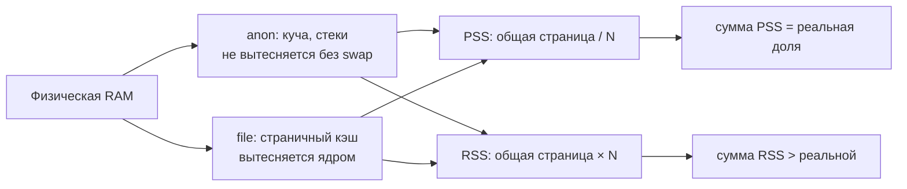
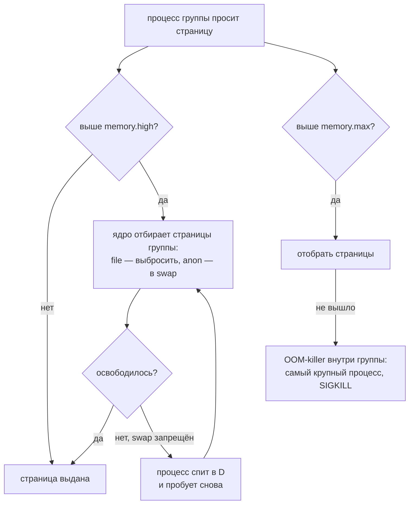

# Учёт и потолки памяти в Linux: RSS, PSS и cgroup

Разбор объясняет две вещи. Первая — почему один и тот же кластер «занимает» то 1228 MiB, то 913 MiB, и каким числом сверять порог. Опора — замер [PER-233](https://linear.app/anticnvm/issue/per-233) пустого k3s с Flux, CNPG и Collector на хосте 8 GB: вывод `ps`, `/proc/<pid>/smaps_rollup`, `memory.stat` cgroup, `kubectl top` и `free`. Итог и порог — в [ADR-055](../../decisions/ADR-055-k3s-runtime-from-aspire-chart.md#замер-2026-10-05-пустой-кластер-на-хосте-8-gb).

Вторая — что происходит, когда группе процессов ставят потолок, и почему на хосте без дискового swap мягкий потолок опаснее жёсткого. Опора — потолок пользователя `dev-solguficky` из [PER-257](https://linear.app/anticnvm/issue/per-257): drop-in `user-<uid>.slice` в ops-репозитории и прогоны в лаборатории — контейнере Debian 13 с systemd, sshd и `libpam-systemd`. Числа ниже — вывод `memory.events`, `memory.pressure` и `ps` из этих прогонов.

## Механика

### Страницы и общая память

Процесс видит свою память как непрерывное пространство адресов, а ядро раздаёт её страницами по 4 KiB. Одна физическая страница может стоять в пространстве нескольких процессов сразу: так разделяется код одного бинарника, запущенного девятью процессами, и общие библиотеки. Отсюда вся путаница: «сколько памяти у процесса» зависит от того, как делить общие страницы.

### RSS — всё, что сейчас в RAM, без деления

**RSS** (resident set size) — сколько страниц процесса сейчас лежит в физической памяти, включая общие. Девять процессов `containerd-shim-runc-v2` запускают один бинарник, и каждый показывает его страницы целиком:

```
k3s-server RSS 654 MiB
containerd RSS 217 MiB
containerd-shim RSS 184 MiB
```

Сумма RSS считает общую страницу столько раз, сколько процессов её видят. Аналог из Windows — колонка «Рабочий набор» в диспетчере задач: тоже включает общие DLL в каждый процесс, и сумма по процессам больше занятой RAM.

### PSS — общая страница делится поровну

**PSS** (proportional set size) — та же резидентная память, но страница, общая для N процессов, засчитывается каждому как 1/N. Сумма PSS по процессам равна их реальной доле в RAM. Ядро отдаёт её в `/proc/<pid>/smaps_rollup`, строка `Pss:`:

```
k3s-server PSS 595 MiB (1 proc)
containerd PSS 157 MiB (1 proc)
shims PSS 104 MiB (9 proc)
```

Шимы — главный пример: 184 MiB по RSS и 104 MiB по PSS, потому что их общий код посчитан один раз, а не девять. У одиночного `k3s-server` разница меньше — делить ему почти не с кем.

### Working set пода — то, что видит Kubernetes

`kubectl top pods` показывает **working set**: память cgroup пода минус неактивный файловый кэш, то есть то, что ядро не может просто выбросить. Это число Kubernetes сравнивает с лимитом пода. Для пустого кластера оно мало: от 10 MiB у local-path-provisioner до 37 MiB у Collector.

### cgroup: anon и file

У каждой cgroup — группы процессов с общим учётом, — ядро ведёт `memory.stat`. Две главные строки:

- **anon** — анонимная память: куча, стеки, всё, что не отображение файла. Её нельзя выбросить, только выгрузить в swap, а swap на хосте нет. Это и есть настоящая цена процесса.
- **file** — страничный кэш: содержимое прочитанных файлов, бинарников и образов. Ядро вытесняет его само, когда памяти не хватает.

У `k3s.service`:

```
anon 671 MiB
file 1785 MiB
kernel 75 MiB
```

1785 MiB кэша — распакованные образы и бинарники. Посчитать их «занятыми» значит завысить цену в три раза; не посчитать anon — занизить.

### `free`: used против available

`free -m` даёт хосту целиком: **used** — без кэша, **available** — сколько можно выделить, не выгоняя никого в OOM, с учётом вытесняемого кэша. Прирост used при установке кластера — 373 → 1297 MiB, то есть 924 MiB, — независимая сверка, которой не нужно знать ни про процессы, ни про cgroup.

### Сводка методов на одном кластере

| Метод | Сумма | Что считает |
|---|---|---|
| RSS процессов + working set подов | 1228 MiB | общие страницы — по разу на процесс |
| PSS процессов + working set подов | ≈1030 MiB | общие страницы — поровну |
| anon + kernel cgroup `k3s.service` и `kubepods.slice` | ≈913 MiB | только невытесняемое |
| прирост `used` в `free` | 924 MiB | хост целиком, без кэша |

Три честных метода сходятся в пределах 120 MiB. RSS отстоит от них на 200–315 MiB, и на пороге «1,2 GB» эта разница решает вердикт: 1,2 GB — это 1144 MiB, 1,2 GiB — 1229 MiB.

### Потолок группы: `memory.high`, `memory.max`, `memory.swap.max`

Учёт отвечает «сколько занято», потолок — «что будет, когда займут больше». В cgroup v2 у группы три файла-регулятора. systemd пишет их из свойств юнита или slice:

| Файл cgroup | Свойство systemd | Что делает ядро у границы |
|---|---|---|
| `memory.high` | `MemoryHigh=` | отбирает у группы страницы и усыпляет её процессы, пока не освободит; не убивает |
| `memory.max` | `MemoryMax=` | отбирает страницы; не вышло — OOM-killer внутри группы |
| `memory.swap.max` | `MemorySwapMax=` | сколько группе можно держать в swap сверх RAM |

Ближайшее из .NET — лимит памяти контейнера: GC рантайма читает `memory.max` своей cgroup и подгоняет под него кучу, а `GCHeapHardLimit` задаёт такой потолок изнутри. Отличие решающее: cgroup-потолок ставят снаружи на всю группу процессов. Python, JVM языкового сервера и `node` о нём не знают и узнают, только упёршись.

«Отобрать страницы» значит разное для двух видов памяти из подраздела выше. Страницы `file` ядро просто выбрасывает: содержимое лежит на диске, понадобится — прочитает снова. Страницы `anon` выбросить нельзя, их можно только выгрузить в swap. На хосте рабочего места дискового swap нет, есть только zram на 1 GiB — общий для всех.

### `memory.high` без swap: процесс замерзает

Ожидание из словаря self-hosting — «`MemoryHigh` притормаживает и даёт шанс дожить». Оно верно, пока есть куда вытеснять. В лаборатории потолок поставили в 150M/200M и запретили swap (`memory.swap.max 0`), а процесс выделил 300 MiB анонимной памяти (`bytearray`). Через пять минут:

```text
memory.high: 157286400        memory.max: 209715200        memory.swap.max: 0
memory.current: 170459136
memory.events: low 0 high 21649 max 0 oom 0 oom_kill 0
memory.pressure: some avg10=83.27 ... full avg10=83.27 ...
PID  STAT   RSS     ELAPSED CMD
1966 Ds   166016      05:16 python3 -c b=bytearray(300*2**20); ...
```

- `memory.current` выше `memory.high`, но ниже `memory.max`: до OOM группа не дошла.
- `high 21649` — столько раз ядро упиралось в `memory.high` и пыталось отобрать память. `oom 0` — ни одного OOM.
- `STAT D` — непрерываемый сон: процесс ждёт ядро и не реагирует ни на что, кроме `SIGKILL`.
- `memory.pressure full avg10=83` — 83% последних десяти секунд все процессы группы стояли без дела в ожидании памяти. Это PSI, pressure stall information.

Механизм: над `memory.high` ядро на каждом выделении пытается отобрать страницы у группы. Анонимные отдать некуда, файловых почти нет, и ядро усыпляет процесс на время, растущее с превышением. Отказа нет и OOM нет: на хосте это выглядело бы как замёрзший без ошибки агент или языковой сервер.

### `memory.max` и `memory.swap.max`: жёсткий потолок

Тот же процесс при `memory.high = max`, `memory.max = 200M` и `memory.swap.max = 0`:

```text
rc=255 (300 MiB)        memory.events: high 0 ... oom 1 oom_kill 1
alive, rc=0 (50 MiB)
```

300 MiB убиты сразу, 50 MiB живут. OOM-killer выбирает жертву только среди процессов группы, по размеру, и соседей за её пределами не трогает.

Без `memory.swap.max = 0` потолок дырявый. В более раннем прогоне swap был разрешён: процесс на 300 MiB при `memory.max = 200M` дожил до конца, а лишние страницы ушли в swap. `memory.max` ограничивает только RAM. Для рабочего места это значило бы, что разработчик сверх своих 3 GB занимает zram — общий запас хоста, на который рассчитывают и stage, и k3s.

У жёсткого потолка тоже есть фаза торможения: до OOM ядро выбрасывает файловый кэш группы, и всё её снова читается с диска. С `memory.high` она отличается тем, что заканчивается: либо память освободилась, либо OOM-killer выбрал жертву.

### Кто попадает в slice пользователя

Потолок пользователя ставится drop-in на `user-<uid>.slice`. Это работает, только если процессы пользователя действительно лежат в этом slice. Кладёт их туда `pam_systemd`, PAM-модуль из пакета `libpam-systemd`: при входе по ssh он регистрирует сессию в logind, и systemd создаёт `session-<N>.scope` внутри `user-<uid>.slice`.

В первой лаборатории `libpam-systemd` не было. Процесс на 300 MiB при потолке 200M жил, а каталога `/sys/fs/cgroup/user.slice/user-1001.slice` не существовало: ssh-сессии оставались в cgroup `ssh.service`, и потолок ни на что не действовал. Проверка, что механизм работает, — cgroup своей же ssh-сессии. `cat /proc/self/cgroup` в cgroup v2 печатает одну строку `0::<путь>`, и `verify.yml` требует, чтобы путь подходил под `/user\.slice/user-[0-9]+\.slice/session-`. Проверь на хосте: `ssh solguficky-dev cat /proc/self/cgroup`.

### OOM внутри tmux

tmux-сервер живёт в scope той сессии, из которой его запустили, и после выхода из ssh остаётся в нём. В лаборатории в одном окне tmux запустили процесс сверх потолка, в другом — счётчик:

```text
exit=137                 # процесс в окне 1 убит SIGKILL (128 + 9)
main: 2 windows          # tmux жив, оба окна на месте
calm: 18 -> 21           # счётчик в окне 2 идёт
```

Убит только сам процесс. Когда тот же процесс был прямым потомком ssh-сессии, ssh вернул `255` — оборвалась вся сессия. Почему: `DefaultOOMPolicy=stop` у systemd и то, как logind обращается с scope после OOM, — лаборатория не выясняла. Проверь сам, когда будет чем: `systemctl show session-<N>.scope -p OOMPolicy` и `journalctl -b | grep -i oom` после такого прогона.

## Урок

- Порог по памяти без названного метода не проверяем: разные честные инструменты отвечают на разные вопросы. Записывая порог, называют метод; записывая замер, называют метод рядом с числом.
- Сумма по процессам корректна только для PSS. RSS складывать нельзя, когда процессы делят код: контейнерные шимы, воркеры одного бинарника, форки.
- Кэш — не потребление. Для решения «хватит ли RAM» смотрят anon и available, а не used с кэшем.
- Совпадение независимых методов — проверка самого замера: расхождение значит, что один из них считает не то.
- Мягкий потолок работает только там, куда можно вытеснять. Без swap `memory.high` превращает нехватку памяти в бесконечное ожидание без ошибки. Видимый отказ — OOM у `memory.max` — лучше молчаливого замерзания.
- `memory.max` — потолок RAM, а не всей памяти. Без `memory.swap.max` группа уходит в общий swap или zram сверх своей доли.
- Потолок проверяется отдельно от механизма, на котором стоит: запись в `memory.max` ничего не значит, если процессы в эту группу не попадают. Отсюда пара проверок — значение потолка и cgroup живой сессии.
- Потолок в лаборатории проверяется уменьшенным: 200M и процесс на 300 MiB, а не 3G и настоящий языковой сервер. Механизм тот же, прогон — секунды.

## Почему так, а не иначе

- **`kubectl top nodes`** — одно число на узел, но оно включает всё на хосте, в том числе Podman-контейнер и системные службы: компонент не отделить.
- **Только RSS из `ps`** — самый доступный метод, и он завышает ровно там, где компонентов много и они однотипны.
- **Только cgroup** — лучший ответ на «сколько не вернуть», но не разбивает `k3s.service` на сервер, containerd и шимы; разбивку дал PSS.
- **Выбрано:** PSS для процессов k3s, working set для подов, cgroup anon и `free` как сверка.

Для потолка разработчика:

- **`MemoryHigh` ниже `MemoryMax`, как требует RFC-010.** Без swap процесс над `MemoryHigh` замерзает в состоянии `D` без OOM — лаборатория выше.
- **`MemoryHigh` плюс немного zram.** Торможение получает куда вытеснять, но разработчик занимает общий запас хоста. В лаборатории результат был непредсказуем: нулевые страницы `bytearray` в zram почти ничего не весят, и проверкой это назвать нельзя.
- **Без потолка до PER-256.** Рядом работает stage, и на нехватке памяти OOM-killer выбирал бы на всём хосте между языковым сервером и PostgreSQL.
- **Выбрано:** жёсткий `MemoryMax=3G` и `MemorySwapMax=0` без `MemoryHigh`. Цена — фаза торможения на файловом кэше перед OOM и убитый, а не притормозивший процесс.

## Схема



Что происходит с группой, когда её процесс просит страницу сверх границы:



## Первоисточники

- [proc_pid_smaps(5)](https://man7.org/linux/man-pages/man5/proc_pid_smaps.5.html) — определения `Rss` и `Pss` и как ядро делит общие страницы.
- [Control Group v2: memory](https://docs.kernel.org/admin-guide/cgroup-v2.html#memory-interface-files) — поля `memory.stat`: `anon`, `file`, `kernel`.
- [free(1)](https://man7.org/linux/man-pages/man1/free.1.html) — разница `used` и `available`.
- [Kubernetes: Resource metrics pipeline](https://kubernetes.io/docs/tasks/debug/debug-cluster/resource-metrics-pipeline/) — что такое working set в `kubectl top`.
- [Control Group v2: memory.high, memory.max, memory.swap.max, memory.events](https://docs.kernel.org/admin-guide/cgroup-v2.html#memory-interface-files) — что ядро делает у каждой границы и что считают поля `high`, `max`, `oom`, `oom_kill`.
- [PSI — Pressure Stall Information](https://docs.kernel.org/accounting/psi.html) — что значат `some` и `full` в `memory.pressure`.
- [systemd.resource-control(5)](https://www.freedesktop.org/software/systemd/man/latest/systemd.resource-control.html) — `MemoryHigh=`, `MemoryMax=`, `MemorySwapMax=` и как они ложатся на файлы cgroup.
- [pam_systemd(8)](https://www.freedesktop.org/software/systemd/man/latest/pam_systemd.html) — регистрация сессии в logind и её scope в `user-<uid>.slice`.

## Проверь себя

1. **Сколько процессов делят код шимов и насколько завышает сумма RSS?** `pgrep -fc containerd-shim-runc-v2` даёт число процессов; сравни `ps -o rss= -p <pids>` в сумме с суммой `Pss:` из `/proc/<pid>/smaps_rollup`. На spike: 9 процессов, 184 против 104 MiB.
2. **Какая часть памяти `k3s.service` вытесняемая?** `grep -E '^(anon|file) ' /sys/fs/cgroup/system.slice/k3s.service/memory.stat` — `file` вытесняемая, `anon` нет.
3. **Сколько памяти ещё можно выдать нагрузке?** `free -m`, колонка `available`, а не `free`: на spike с кластером ≈6650 MiB available при 4383 MiB free.
4. **Какой потолок стоит у разработчика и нет ли мягкой границы?** `systemctl show user-$(id -u dev-solguficky).slice -p MemoryHigh -p MemoryMax -p MemorySwapMax`. Ответ: `MemoryHigh=infinity`, `MemoryMax=3221225472`, `MemorySwapMax=0`.
5. **Сколько раз потолок уже срабатывал?** `cat /sys/fs/cgroup/user.slice/user-$(id -u dev-solguficky).slice/memory.events`. Строка `oom_kill` — убитые процессы, `high` должна оставаться `0`, раз `memory.high` не задан.
6. **Попадает ли твоя сессия под потолок?** `ssh solguficky-dev cat /proc/self/cgroup`. Ответ — путь вида `0::/user.slice/user-<uid>.slice/session-<N>.scope`. Если в пути `ssh.service`, `pam_systemd` не сработал, и потолок не действует.
