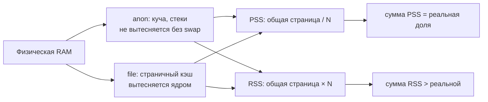

# Учёт памяти в Linux: RSS, PSS и cgroup

Разбор объясняет, почему один и тот же кластер «занимает» то 1228 MiB, то 913 MiB, и каким числом сверять порог. Опора — замер [PER-233](https://linear.app/anticnvm/issue/per-233) пустого k3s с Flux, CNPG и Collector на хосте 8 GB: вывод `ps`, `/proc/<pid>/smaps_rollup`, `memory.stat` cgroup, `kubectl top` и `free`. Итог и порог — в [ADR-055](../../decisions/ADR-055-k3s-runtime-from-aspire-chart.md#замер-2026-10-05-пустой-кластер-на-хосте-8-gb).

## Механика

### Страницы и общая память

Процесс видит свою память как непрерывное пространство адресов, а ядро раздаёт её страницами по 4 KiB. Одна физическая страница может стоять в пространстве нескольких процессов сразу: так разделяется код одного бинарника, запущенного девятью процессами, и общие библиотеки. Отсюда вся путаница: «сколько памяти у процесса» зависит от того, как делить общие страницы.

### RSS — всё, что сейчас в RAM, без деления

**RSS** (resident set size) — сколько страниц процесса сейчас лежит в физической памяти, включая общие. Девять процессов `containerd-shim-runc-v2` запускают один бинарник, и каждый показывает его страницы целиком:

```
k3s-server RSS 654 MiB
containerd RSS 217 MiB
containerd-shim RSS 184 MiB
```

Сумма RSS считает общую страницу столько раз, сколько процессов её видят. Аналог из Windows — колонка «Рабочий набор» в диспетчере задач: тоже включает общие DLL в каждый процесс, и сумма по процессам больше занятой RAM.

### PSS — общая страница делится поровну

**PSS** (proportional set size) — та же резидентная память, но страница, общая для N процессов, засчитывается каждому как 1/N. Сумма PSS по процессам равна их реальной доле в RAM. Ядро отдаёт её в `/proc/<pid>/smaps_rollup`, строка `Pss:`:

```
k3s-server PSS 595 MiB (1 proc)
containerd PSS 157 MiB (1 proc)
shims PSS 104 MiB (9 proc)
```

Шимы — главный пример: 184 MiB по RSS и 104 MiB по PSS, потому что их общий код посчитан один раз, а не девять. У одиночного `k3s-server` разница меньше — делить ему почти не с кем.

### Working set пода — то, что видит Kubernetes

`kubectl top pods` показывает **working set**: память cgroup пода минус неактивный файловый кэш, то есть то, что ядро не может просто выбросить. Это число Kubernetes сравнивает с лимитом пода. Для пустого кластера оно мало: от 10 MiB у local-path-provisioner до 37 MiB у Collector.

### cgroup: anon и file

У каждой cgroup — группы процессов с общим учётом, — ядро ведёт `memory.stat`. Две главные строки:

- **anon** — анонимная память: куча, стеки, всё, что не отображение файла. Её нельзя выбросить, только выгрузить в swap, а swap на хосте нет. Это и есть настоящая цена процесса.
- **file** — страничный кэш: содержимое прочитанных файлов, бинарников и образов. Ядро вытесняет его само, когда памяти не хватает.

У `k3s.service`:

```
anon 671 MiB
file 1785 MiB
kernel 75 MiB
```

1785 MiB кэша — распакованные образы и бинарники. Посчитать их «занятыми» значит завысить цену в три раза; не посчитать anon — занизить.

### `free`: used против available

`free -m` даёт хосту целиком: **used** — без кэша, **available** — сколько можно выделить, не выгоняя никого в OOM, с учётом вытесняемого кэша. Прирост used при установке кластера — 373 → 1297 MiB, то есть 924 MiB, — независимая сверка, которой не нужно знать ни про процессы, ни про cgroup.

### Сводка методов на одном кластере

| Метод | Сумма | Что считает |
|---|---|---|
| RSS процессов + working set подов | 1228 MiB | общие страницы — по разу на процесс |
| PSS процессов + working set подов | ≈1030 MiB | общие страницы — поровну |
| anon + kernel cgroup `k3s.service` и `kubepods.slice` | ≈913 MiB | только невытесняемое |
| прирост `used` в `free` | 924 MiB | хост целиком, без кэша |

Три честных метода сходятся в пределах 120 MiB. RSS отстоит от них на 200–315 MiB, и на пороге «1,2 GB» эта разница решает вердикт: 1,2 GB — это 1144 MiB, 1,2 GiB — 1229 MiB.

## Урок

- Порог по памяти без названного метода не проверяем: разные честные инструменты отвечают на разные вопросы. Записывая порог, называют метод; записывая замер, называют метод рядом с числом.
- Сумма по процессам корректна только для PSS. RSS складывать нельзя, когда процессы делят код: контейнерные шимы, воркеры одного бинарника, форки.
- Кэш — не потребление. Для решения «хватит ли RAM» смотрят anon и available, а не used с кэшем.
- Совпадение независимых методов — проверка самого замера: расхождение значит, что один из них считает не то.

## Почему так, а не иначе

- **`kubectl top nodes`** — одно число на узел, но оно включает всё на хосте, в том числе Podman-контейнер и системные службы: компонент не отделить.
- **Только RSS из `ps`** — самый доступный метод, и он завышает ровно там, где компонентов много и они однотипны.
- **Только cgroup** — лучший ответ на «сколько не вернуть», но не разбивает `k3s.service` на сервер, containerd и шимы; разбивку дал PSS.
- **Выбрано:** PSS для процессов k3s, working set для подов, cgroup anon и `free` как сверка.

## Схема



## Первоисточники

- [proc_pid_smaps(5)](https://man7.org/linux/man-pages/man5/proc_pid_smaps.5.html) — определения `Rss` и `Pss` и как ядро делит общие страницы.
- [Control Group v2: memory](https://docs.kernel.org/admin-guide/cgroup-v2.html#memory-interface-files) — поля `memory.stat`: `anon`, `file`, `kernel`.
- [free(1)](https://man7.org/linux/man-pages/man1/free.1.html) — разница `used` и `available`.
- [Kubernetes: Resource metrics pipeline](https://kubernetes.io/docs/tasks/debug/debug-cluster/resource-metrics-pipeline/) — что такое working set в `kubectl top`.

## Проверь себя

1. **Сколько процессов делят код шимов и насколько завышает сумма RSS?** `pgrep -fc containerd-shim-runc-v2` даёт число процессов; сравни `ps -o rss= -p <pids>` в сумме с суммой `Pss:` из `/proc/<pid>/smaps_rollup`. На spike: 9 процессов, 184 против 104 MiB.
2. **Какая часть памяти `k3s.service` вытесняемая?** `grep -E '^(anon|file) ' /sys/fs/cgroup/system.slice/k3s.service/memory.stat` — `file` вытесняемая, `anon` нет.
3. **Сколько памяти ещё можно выдать нагрузке?** `free -m`, колонка `available`, а не `free`: на spike с кластером ≈6650 MiB available при 4383 MiB free.
