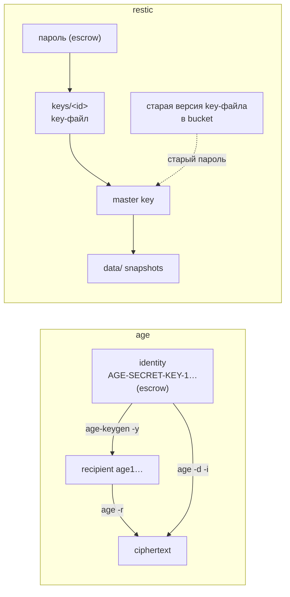

# Ключи восстановления: age, restic и проверка копии

Разбор объясняет, из чего состоят ключи, которые RFC-010 держит в escrow, и почему процедура проверки устроена так, как записано в пункте об escrow в разделе «Принято владельцем» [RFC-010](../../rfcs/RFC-010-remote-development-and-self-hosting-platform.md). Опора — drill владельца в [PER-236](https://linear.app/anticnvm/issue/per-236) и проверочный прогон на тестовых ключах: `age` 1.2.1 и `restic` 0.18.1 в WSL, вывод приведён ниже. Значений ключей здесь нет. Слово escrow определено в [словаре](vocabulary.md).

## Механика

### age: identity и recipient

У age пара ключей называется не «приватный и публичный», а **identity** и **recipient**. Identity расшифровывает, recipient только шифрует. Аналог из .NET — пара `RSA` и её `ExportSubjectPublicKeyInfo`, но у age ключ один на всё: ни сертификата, ни хранилища, ни срока действия.

`age-keygen -o k1.key` пишет файл из трёх строк:

```
# created: 2026-10-05T14:06:26+03:00
# public key: age16ekg3qu0y54q58lnjjvjfs03a3x5l7yfs033tnep9e3pfvcly4dsdkkata
AGE-SECRET-KEY-1<скрыто>
```

Первые две — комментарии. Секрет — третья строка длиной 74 символа: её и переписывают на бумагу. Recipient не нужно хранить отдельно: `age-keygen -y k1.key` выводит его из identity, и вывод совпал с комментарием в файле. Поэтому в escrow лежит одна строка, а recipient восстанавливается из неё.

Шифрование идёт на recipient, расшифровка — identity:

```
echo probe | age -r age16ekg… -o t.age
age -d -i k1.key t.age            # probe
```

Identity от другой пары даёт отказ, а не мусор: `no identity matched any of the recipients`, код 1. Файл, зашифрованный на двух recipient, начинается так:

```
age-encryption.org/v1
-> X25519 <одноразовое значение>
<ключ файла, зашифрованный для первого>
-> X25519 <одноразовое значение>
<ключ файла, зашифрованный для второго>
```

Тело зашифровано одним случайным ключом файла, а заголовок хранит его копию для каждого recipient. Кому адресована запись, в ней не сказано: строка recipient в файле не встречается ни разу. age пробует данную ему identity на каждой записи и, если ни одна не открылась, отказывает до чтения тела.

### Контрольная сумма в секретной строке

Строка `AGE-SECRET-KEY-1…` записана в **bech32** — кодировке с контрольной суммой, придуманной для адресов Bitcoin, чтобы опечатка при ручном вводе ловилась до использования. `1` отделяет человекочитаемый префикс от данных, а последние шесть символов — контрольная сумма.

Одна заменённая буква в середине строки:

```
age: error: … malformed secret key: invalid checksum
```

Код 1, расшифровки не было. Строчная буква в строке из прописных даёт другой отказ: `malformed secret key: mixed case`. Строка, целиком набранная строчными, тоже не принимается: `unknown identity type`, потому что age ищет префикс `AGE-SECRET-KEY-` прописными. Для бумажной копии это главное свойство: перенабор с ошибкой не превращается в «другой ключ, который молча не подходит», а ловится сразу и называется.

### restic: master key под key-файлами

Repository restic шифрует данные не паролем, а случайным **master key**, который создаётся при `restic init`. Пароль открывает только key-файл в каталоге `keys/` repository, а key-файл хранит master key, зашифрованный этим паролем. Данные под одним ключом, ключ под паролем: паролей может быть несколько, и любой из них можно сменить, не перешифровывая данные. Ближайший аналог из мира .NET — envelope encryption в Azure Key Vault: данные шифрует ключ данных, а `WrapKey` и `UnwrapKey` оборачивают его ключом хранилища. Отличие в том, что у restic обёрток несколько и каждая открывается своим паролем.

Проверка на тестовом repository:

```
key-файлов: 1
restic key passwd …               # saved new key as <Key of …>
key-файлов после passwd: 1
старый пароль после passwd: exit=12
новый пароль: exit=0
```

`key passwd` записал новый key-файл и удалил старый. Код 12 — отказ restic по неверному паролю. Master key при этом не изменился: смена пароля переупаковывает его, а данные не трогает.

Затем старый key-файл вернули в `keys/` — так, как его вернула бы сохранённая версия объекта в bucket с versioning:

```
c95d4f03  2026-10-05 14:06:00  LAPTOP-7DPQMSA1  6 B
1 snapshots
```

Старый пароль снова открыл repository. Отсюда правило RFC-010: утёкший пароль restic не закрывается сменой пароля, если хранилище держит версии объектов. Нужен новый repository с новым master key.

## Урок

- Проверка копии ключа доказывает что-то только против эталона, полученного не из этой копии. Тестовый файл, зашифрованный на recipient, выведенный из проверяемой копии, расшифруется этой копией всегда — даже если копия от чужой пары:

  ```
  age -r "$(age-keygen -y k2.key)" … | age -d -i k2.key   # probe, exit=0
  ```

  Тот же разрыв бывает у любого «теста, который проверяет сам себя»: моки, собранные из тестируемого кода, и снапшоты, перезаписанные текущим выводом.
- Схема «данные под ключом, ключ под паролем» отделяет ротацию пароля от ротации ключа. Первая дешёвая и закрывает только будущие утечки. От утечки, которая уже случилась, спасает только вторая, а она дорогая: всё перешифровывается. Это различие нужно держать в голове для SOPS, restic и любого KMS.
- Ручная копия ключа годится, если формат ловит опечатку сам. bech32 это делает, а у пароля restic такой защиты нет, поэтому drill проверяет оба секрета по отдельности.

## Почему так, а не иначе

- **SSH-ключ как age identity.** age это умеет, но тогда один ключ служит и для входа на хост, и для расшифровки секретов: утечка одного открывает оба. Отдельная native identity — рекомендация автора age, и RFC-010 её повторяет.
- **Хранить в escrow recipient вместе с identity.** Лишняя строка, которую можно переписать с ошибкой, и при этом без всякой проверки: recipient выводится из identity командой.
- **Проверять копию на той же машине, где лежит вторая.** Проверка пройдёт, даже если проверяемая копия мертва, а живую инструмент нашёл на машине сам. Машина без второй копии исключает такую подмену.
- **Сменить пароль restic после утечки.** Дёшево, но версии bucket возвращают старый key-файл, и проверка выше показывает, что старый пароль тогда работает. Новый repository дороже, зато закрывает утечку.

## Схема



## Первоисточники

- [age, README](https://github.com/FiloSottile/age) — identity и recipient, `-y`, почему для age нужен отдельный ключ, а не SSH.
- [Спецификация формата age (C2SP)](https://github.com/C2SP/C2SP/blob/main/age.md) — заголовок с метками recipient и кодирование ключей в bech32.
- [BIP-173](https://github.com/bitcoin/bips/blob/master/bip-0173.mediawiki) — bech32: человекочитаемая часть, разделитель `1`, контрольная сумма из шести символов и запрет смешанного регистра.
- [restic: дизайн repository, раздел Keys](https://restic.readthedocs.io/en/stable/100_references.html#keys-encryption-and-mac) — master key, key-файлы и что именно шифрует пароль.
- [restic: управление ключами](https://restic.readthedocs.io/en/stable/070_encryption.html) — `key add`, `key remove`, `key passwd`.
- [restic: коды возврата](https://restic.readthedocs.io/en/stable/075_scripting.html#exit-codes) — код 12 означает неверный пароль.

## Проверь себя

1. **Какой recipient у identity в файле?** `age-keygen -y k1.key` — вывод должен совпасть со строкой `# public key:` в том же файле.
2. **Ловит ли age одну опечатку в секретной строке?** Замени одну прописную букву в середине на другую прописную и выполни `age -d -i bad.key t.age`. Ожидаемо: `invalid checksum`, код 1.
3. **Сколько паролей открывают repository?** `restic key list` — число строк равно числу key-файлов, и каждый открывает тот же master key.
4. **Закрыла ли смена пароля утечку?** Нет, если в bucket есть версия старого key-файла. Проверка: верни её в `keys/` и выполни `restic snapshots` со старым паролем — код 0 значит «не закрыла».

## Остались вопросы

- Где SOPS ищет age identity, если ключ не передан явно, и может ли drill случайно взять её оттуда. Ответ даёт документация SOPS, а не этот прогон: в нём SOPS не участвовал.
- Какой ключ шифрует PITR-репозиторий CloudNativePG и Barman ([ADR-055](../../decisions/ADR-055-k3s-runtime-from-aspire-chart.md)) и лежит ли он в escrow. Это открытый вопрос из PR PER-236, а не механика age и restic.
