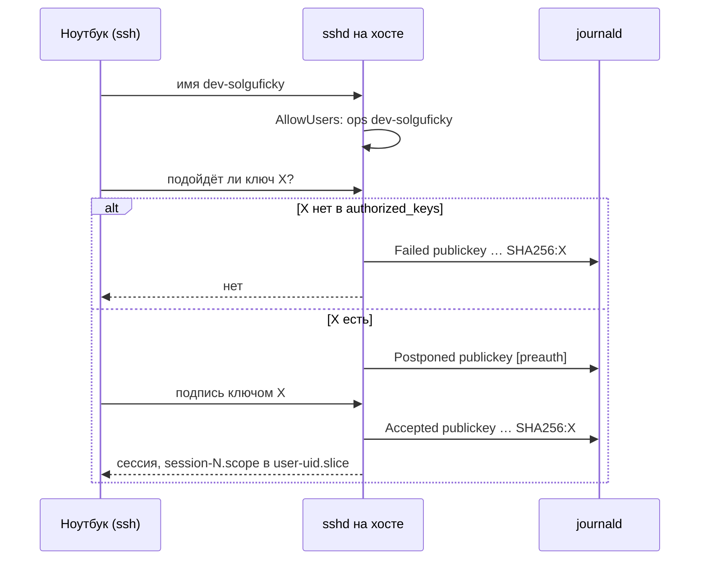
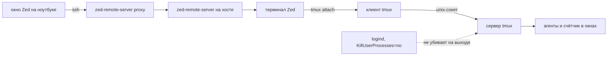

# Рабочее место на хосте: учётки, вход по ключу и сессия, которая переживает редактор

Разбор объясняет, как устроено удалённое рабочее место: почему работа идёт не под `ops`, что происходит между `ssh` на ноутбуке и строкой `Accepted publickey` в журнале хоста, где на самом деле работает редактор и почему tmux переживает его закрытие. Опора — [PER-257](https://linear.app/anticnvm/issue/per-257): `tasks/dev.yml`, `tasks/sshd.yml` и `verify.yml --tags dev` в ops-репозитории, прогоны в лаборатории и живой хост 2026-10-07. Как работать с этим на практике — `docs/access.md` ops-репозитория. Потолок памяти разработчика — [memory-accounting.md](memory-accounting.md#потолок-группы-memoryhigh-memorymax-memoryswapmax), его задачи в Ansible — [ansible.md](ansible.md#пользователь-и-его-ключи-exclusive-и-пустой-вход).

## Механика

### Учётка — граница доверия, а не логин

В Linux «кто ты» определяет не имя человека, а uid процесса. Файлы, сокеты и cgroup проверяют uid, и всё, что запущено под одной учёткой, видит одно и то же. Агент, который ставит пакет с вредоносным `postinstall`, получает права ровно той учётки, под которой его запустили.

Отсюда раскладка из RFC-010 ([«Доверительные зоны и аккаунты»](../../rfcs/RFC-010-remote-development-and-self-hosting-platform.md#доверительные-зоны-и-аккаунты)):

| Учётка | Что может | Чего не должна иметь |
|---|---|---|
| `ops` | sudo по паролю, Ansible, kubeconfig сред | ежедневной разработки, токенов агентов |
| `dev-solguficky` | свой home, рабочее дерево, агенты в tmux | sudo, пароля, секретов сред |
| `agent-<project>` (PER-256) | только рабочее дерево и токен провайдера | входа по SSH |

Аналог из Windows — отдельная непривилегированная учётка для повседневной работы рядом с администраторской. Отличие: здесь у `dev-solguficky` нет пароля вовсе. Войти можно только по ключу, а «запустить от администратора» нечем.

Имя ставит роль впереди: `dev-<проект>`, а не `<проект>-dev`. С проектом впереди шаблон `solguficky-*` в sudoers или slice захватил бы и будущую учётку рантайма. В `AllowUsers` шаблон всё равно не используется: учётка попадает туда явным списком, только когда её ключ проверен входом.

Граница проверяется тестом, а не обещанием. `verify.yml` запускает `runuser -u dev-solguficky -- test -r <файл>` на админском kubeconfig, kubeconfig сред у `ops` и файле секретов stage и ждёт код 1. Держится это на двух уровнях: сами файлы `0600`, а домашний каталог `ops` — `0700`. Debian 13 создаёт домашние каталоги закрытыми, и в лаборатории `stat -c %a /home/ops` дал `700`. Открытый на чтение `test.env` внутри закрытого `/home/ops` отказ не нарушил. Утечку проверка поймала, только когда открыли и сам каталог.

### Вход по ключу: от клиента до журнала

Ключ — пара файлов. Закрытый лежит на ноутбуке, публичный — строкой в `~/.ssh/authorized_keys` на хосте. Пароль по сети не идёт вовсе. Клиент доказывает, что владеет закрытым ключом: подписывает данные этой сессии.

Что делает `sshd` по порядку, и что пишет при `LogLevel VERBOSE`:

1. Проверяет имя по `AllowUsers`. Чужое имя отказывается сразу, до ключей.
2. Клиент спрашивает: «подойдёт ли этот публичный ключ?» Подписи ещё нет. Если ключа нет в `authorized_keys`, ответ «нет», и в журнале `Failed publickey for dev-solguficky from … ssh2: ED25519 SHA256:…`. Если есть — `Postponed publickey … [preauth]`: ключ подходит, ждём подпись.
3. Клиент присылает подпись. Сошлась — `Accepted publickey for dev-solguficky from … ssh2: ED25519 SHA256:…`.
4. Ключи кончились — `Connection closed by authenticating user dev-solguficky … [preauth]`.

Все четыре строки взяты из журнала лаборатории. Без `VERBOSE` строки `Failed publickey` с отпечатком нет, и в журнале остаётся только последняя, без указания, каким ключом стучались. Отпечаток в журнале сверяется с `ssh-keygen -lf <файл>.pub`. Строку отказа по `AllowUsers` в этой задаче не воспроизводили; негативный путь PER-237 видел отказ со стороны клиента ([ansible.md](ansible.md#как-playbook-ложится-на-свежий-хост), шаг 9).

`IdentitiesOnly yes` в конфиге клиента заставляет ssh предлагать только названный ключ, а не все из агента. Иначе ssh-agent перебирал бы все свои ключи, и каждый давал бы строку `Failed publickey`. По `sshd_config(5)` после `MaxAuthTries` попыток (по умолчанию 6) сервер рвёт соединение, даже если нужный ключ ещё не предложен. В этой задаче это не воспроизводилось; проверь сам: `ssh -o IdentitiesOnly=no solguficky-dev true` с шестью ключами в агенте.

`ForwardAgent no` на клиенте и `AllowAgentForwarding no` на сервере закрывают пересылку агента. Пересланный агент — сокет на хосте, через который можно подписывать твоими ключами, пока открыта сессия. Root на хосте, а с ним и любой, кто его получил, мог бы входить этими ключами куда угодно: в GitHub, на другие машины.

### Клиент на Windows: три проверки, которые OpenSSH делает до сети

Встроенный в Windows OpenSSH читает `%USERPROFILE%\.ssh\config` и до подключения отказывает в трёх случаях. Все три встретились в этой задаче.

- **Права файла.** `Bad permissions. Try removing permissions for user: LAPTOP-7DPQMSA1\admin … on file …/.ssh/config`. Конфиг, в который может писать кто-то, кроме тебя, SYSTEM и «Администраторов», ssh не читает: подменивший его направил бы тебя на чужой хост. Файл унаследовал права каталога, а там была вторая учётка Windows. Лечится снятием наследования: `icacls … /inheritance:r /grant:r …`. Это аналог `chmod 600` из Linux, только в ACL Windows.
- **BOM.** `Set-Content -Encoding utf8` в Windows PowerShell 5.1 пишет в начало файла байты `EF BB BF`. ssh читает их как часть первого слова: `Bad configuration option: \357\273\277host`. Проверено на временном файле, с `-Encoding ascii` тот же текст читается.
- **Сменившийся ключ хоста.** `REMOTE HOST IDENTIFICATION HAS CHANGED`. Хост предъявил ключ, отличный от записанного в `known_hosts`. Здесь причина законная: ОС хоста переустанавливали в PER-233, а на Windows остался старый ключ. Решение принимается сверкой, а не догадкой. Отпечаток, который показал сервер, сравнивают с `known_hosts` control node, где Ansible уже ходит на этот хост: `ssh-keygen -F 80.64.17.33 -f ~/.ssh/known_hosts | ssh-keygen -lf -`. ED25519 `SHA256:C+TBQ6vl…` совпал, и только после этого старая запись удалена (`ssh-keygen -R`).

`ssh -G solguficky-dev` печатает итоговые настройки для имени, не подключаясь. Так проверяется, что блок `Host` прочитан, до того как хост знает о ключе.

### Где работает редактор

Zed при «Connect SSH Server» ставит на хост свой бинарь `~/.zed_server/zed-remote-server-…` и запускает его через тот же ssh. На ноутбуке остаётся окно, на хосте — работа с файлами, терминалы и, по документации Zed, языковые серверы. На хосте это видно:

```text
95529 /home/dev-solguficky/.zed_server/zed-remote-server-stable-1.22.0+stable…
95619 .zed_server/zed-remote-server-stable-1.22.0+stable…115 proxy --identifier
```

Судя по имени и выводу, `proxy` связывает ssh-соединение клиента с долгоживущим сервером. Наборов `proxy` в выводе два: после повторного открытия Zed старое подключение ещё не завершилось. Устройство изнутри не проверялось; проверь сам: `pstree -p -u dev-solguficky | grep -A3 zed` до и после переподключения. Всё это работает под `dev-solguficky` и делит его потолок памяти.

Аналог — VS Code Remote-SSH: тот же принцип «сервер редактора на хосте, интерфейс на клиенте», запасной редактор работает так же. Отличие от `ssh` с `vim` внутри в том, что редактор держит своё соединение и переподключается сам.

Агенты запускаются не из панели редактора, а в tmux. Процесс, порождённый сервером редактора, живёт, пока жив сам сервер. Агент в tmux от редактора не зависит.

### tmux и logind: почему сессия переживает выход

tmux — тоже клиент и сервер. Первая команда `tmux new -s main` запускает сервер — фоновый процесс, который держит окна и их процессы, — и клиент, который рисует их в твоём терминале. Связь между ними — Unix-сокет в `/tmp/tmux-<uid>/`. Закрыл терминал или потерял сеть — умер клиент, сервер с окнами остался. `tmux attach -t main` подключает новый клиент к тому же серверу. На хосте это проверено так: в tmux шёл счётчик `date` с шагом 5 секунд, Zed закрыли, переподключились — счёт шёл без пропуска.

Переживёт ли сервер tmux выход пользователя, решает не tmux, а `systemd-logind`. При `KillUserProcesses=yes` logind на выходе убивает все процессы сессии, включая tmux. В Debian по умолчанию `no`, и `verify.yml` это сверяет: `busctl get-property … KillUserProcesses` отвечает `b false`.

tmux держит только интерактивную сессию. Долгие фоновые процессы по RFC-010 — systemd user units. Но user units пользователя без linger останавливаются вместе с его последней сессией, а linger у `dev-solguficky` появится с PER-261. До тех пор агента держит tmux.

### Восстановление с чужой машины

Своих ключей нет — ноутбук потерян. Второго постоянного ключа «на всякий случай» нет намеренно: он был бы ещё одним вечно годным доступом к хосту. Путь в обход — консоль хостера. Это экран и клавиатура сервера в браузере, они не зависят ни от sshd, ни от сети, ни от firewall ([vocabulary.md](vocabulary.md#как-ты-попадаешь-на-хост-и-как-теряешь-доступ)).

Через консоль под `ops` временный публичный ключ дописывается в `authorized_keys` разработчика, с чужой машины выполняется вход, сессия tmux на месте. Уборку делает сам playbook. `authorized_key` с `exclusive: true` при следующем прогоне `--tags dev` оставляет только ключи из репозитория, и `--diff` показывает снятую строку. Забудешь прогнать — `verify.yml` упадёт на «на хосте лишний ключ». В лаборатории процедура прошла целиком, живой прогон — [PER-474](https://linear.app/anticnvm/issue/per-474).

## Урок

- Учётка — единица доверия: всё, что работает под ней, видит одно и то же. Раскладка учёток — первое решение рабочего места, а не последнее.
- Отказ без следа в журнале — половина проверки. `LogLevel VERBOSE` превращает «кто-то стучался» в «стучались этим ключом», и проверка может это доказать, а не только увидеть код отказа у клиента.
- Устойчивость сессии держится на разнесении процессов: интерфейс, который можно потерять, и сервер, который живёт сам. Так устроены и tmux, и remote server редактора. Проверяется это в обе стороны: сервер на хосте есть, и после потери клиента он на месте.
- Смену ключа хоста не принимают на веру. Его сверяют с источником, которому уже доверяют, и только после совпадения удаляют старую запись.
- Восстановление проектируется вместе с уборкой. Ручной ключ, который никто не снимет, — постоянная дыра. Декларация, которая сама убирает лишнее, превращает аварийную правку во временную.

## Почему так, а не иначе

- **Работать под `ops`.** Один пользователь, но разработка и агенты получили бы sudo, kubeconfig сред и пароль консоли — всё, что RFC-010 от них отделяет.
- **Общий `dev` для всех проектов.** Проще, пока проект один, но агент одного проекта читал бы токены всех. Разносить по учёткам потом — значит переносить home и перевыпускать токены на живом хосте.
- **Шаблон `dev-*` в `AllowUsers`.** Новый проект не трогал бы sshd, но любая учётка `dev-…` с ключом входила бы без проверки второй сессией, которую требует RFC-010.
- **Второй постоянный ключ в менеджере паролей для восстановления.** Быстрее в аварии, но это ещё один вечно годный доступ, который нужно хранить и проверять.
- **Агенты в панели редактора.** Удобно, но агент умирает вместе с remote server редактора и делит его жизненный цикл.
- **herdr вместо tmux.** Даёт статусы агентов, но это отдельный бинарь с ручным закреплением версии, а tmux приходит из apt вместе с обновлениями безопасности. Отложен владельцем.
- **Пароль у `dev-solguficky` для консоли.** Дал бы ещё один путь входа. Консоль уже есть у `ops`, а через неё и в `dev-solguficky`.

## Схема

Вход и что видит журнал:



Что живёт дольше чего:



Закрылось окно Zed — рвётся всё слева от сервера tmux, а справа всё продолжает работать.

## Первоисточники

- [RFC-010, «Доверительные зоны и аккаунты»](../../rfcs/RFC-010-remote-development-and-self-hosting-platform.md#доверительные-зоны-и-аккаунты) — какие учётки предполагались и что каждой запрещено; решения PER-257 — баннер в шапке того же RFC.
- [sshd_config(5)](https://man.openbsd.org/sshd_config) — `AllowUsers`, `LogLevel`, `AllowAgentForwarding`, `MaxAuthTries`.
- [ssh_config(5)](https://man.openbsd.org/ssh_config) — `IdentitiesOnly`, `ForwardAgent`, `Host` и `ssh -G`.
- [RFC 4252, раздел 7](https://www.rfc-editor.org/rfc/rfc4252#section-7) — метод `publickey`: запрос «подойдёт ли ключ» без подписи и затем с подписью; отсюда пара `Postponed` и `Accepted`.
- [Win32-OpenSSH: Security protection of various files](https://github.com/PowerShell/Win32-OpenSSH/wiki/Security-protection-of-various-files-in-Win32-OpenSSH) — какие права на `config` и ключах Windows OpenSSH считает допустимыми.
- [Zed: Remote Development](https://zed.dev/docs/remote-development) — что работает на хосте, а что на клиенте, и где лежит remote server.
- [tmux(1)](https://man7.org/linux/man-pages/man1/tmux.1.html) — клиент, сервер и сокет в `/tmp/tmux-<uid>/`.
- [logind.conf(5)](https://www.freedesktop.org/software/systemd/man/latest/logind.conf.html) — `KillUserProcesses` и чем он грозит tmux.
- [loginctl(1), enable-linger](https://www.freedesktop.org/software/systemd/man/latest/loginctl.html) — почему user units без linger не переживают выход.

## Проверь себя

1. **Каким ключом стучались в `dev-solguficky` последние 10 минут?** `sudo journalctl -u ssh --since "-10min" -o cat | grep -E 'publickey for dev-solguficky'`, затем `ssh-keygen -lf keys/dev-solguficky/*.pub` в ops-репозитории. Отпечаток из строки `Accepted` совпадает с твоим `.pub`, а у `Failed` — нет.
2. **Видит ли ssh блок `Host` до подключения?** `ssh -G solguficky-dev | Select-String '^(user|hostname|identityfile|forwardagent) '` в PowerShell. Ответ: `user dev-solguficky`, `hostname 80.64.17.33`, `identityfile ~/.ssh/solguficky-dev`, `forwardagent no`.
3. **Почему ssh отказывается читать `config`?** `icacls "$env:USERPROFILE\.ssh\config"`. Строка с `(I)` и чужой учёткой — унаследованное право записи; после `/inheritance:r` остаются три строки без `(I)`.
4. **Прочитает ли `dev-solguficky` kubeconfig `ops`?** На хосте `sudo runuser -u dev-solguficky -- test -r /home/ops/.kube/test.yaml; echo $?` даёт `1`. Контроль: `sudo runuser -u dev-solguficky -- test -r /home/dev-solguficky/src/solguficky-hub/.git/HEAD; echo $?` — `0`.
5. **Где сейчас работает редактор?** Пока Zed открыт: `pgrep -u dev-solguficky -af zed-remote-server | cut -c1-100` на хосте показывает сервер и `proxy`.
6. **Убьёт ли logind tmux на выходе?** `busctl get-property org.freedesktop.login1 /org/freedesktop/login1 org.freedesktop.login1.Manager KillUserProcesses` — `b false`. Где лежит сокет tmux, проверь сам: `ls -l /tmp/tmux-$(id -u)/` под `dev-solguficky`.
