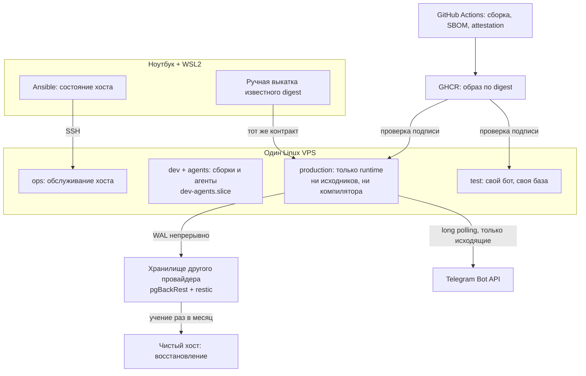

# Словарь self-hosting: что происходит на арендованном сервере

Файл объясняет термины и модель мира [RFC-008](../../rfcs/RFC-008-remote-development-and-self-hosting-platform.md) читателю, который не администрировал Linux-сервер. Он не нормирует: требования к хосту живут в RFC, принятое решение — в [ADR-035](../../decisions/ADR-035-single-vps-for-initial-self-hosting.md), порядок работ — в [PER-80](https://linear.app/anticnvm/issue/per-80).

Это осознанное исключение из правила раздела «разбор пишется вместе со срезом и объясняет технологию через код диффа». Кода self-hosting в репозитории ещё нет ни строки. Исключение сделано потому, что без словаря нельзя ни ответить на решения владельца из RFC, ни отревьюить первый лист: обычный разбор придёт слишком поздно, чтобы повлиять на выбор. Разборы по диффу пишутся отдельно, по мере реализации, и этот файл в них не превращается.

## Механика

### Один хост, четыре зоны

Арендованный сервер (VPS) — это виртуальная машина у хостера: своя ОС, свой диск, свой публичный адрес. Вы берёте один такой хост и селите на нём четыре разные роли:

| Зона | Что делает | Чего не должна мочь |
|---|---|---|
| `dev` | ты пишешь код удалённо | лезть в боевые данные |
| `agents` | фоновые coding agents | получить боевой токен и выкатку |
| `test` | тестовый контур бота | трогать боевую базу |
| `production` | боевой бот | ничего лишнего: ни компилятора, ни исходников |

Разделяет их **Unix-пользователь** — в Linux у каждого процесса есть владелец, и файлы одного пользователя по умолчанию недоступны другому. Это не такая же граница, как между двумя разными машинами: ядро операционной системы у всех зон общее. RFC называет это остаточным риском и не притворяется, что это полноценная изоляция.

### Как ты попадаешь на хост и как теряешь доступ

**SSH** — протокол удалённого доступа: у тебя в терминале строка, команды выполняются на сервере. На сервере за это отвечает программа `sshd`. Конфиг — `/etc/ssh/sshd_config`.

Вход по паролю выключается, остаётся вход по ключу. **SSH-ключ** — пара файлов: приватный лежит у тебя, публичный кладётся на сервер в `~/.ssh/authorized_keys` того пользователя, под которым ты входишь. Сервер проверяет, что ты владеешь приватным, никогда его не получая.

Отсюда главная опасность первого дня: **ломается или закрывается только то, чем ты сам пользуешься**. Опечатка в `sshd_config`, ключ не в том файле, firewall закрыл порт — и починить через SSH уже нельзя, потому что SSH и сломан. Поэтому нужен второй, независимый вход:

- **console** (в панелях — VNC-консоль, KVM-консоль, аварийная консоль) — браузер показывает экран сервера, как если бы ты подключил монитор и клавиатуру. Не зависит ни от `sshd`, ни от сети сервера, ни от firewall;
- **rescue** — хостер грузит сервер с аварийной мини-системы, а твой диск подключает как обычную папку.

RFC требует проверить их **фактом входа**, а не наличием кнопки: кнопка может не работать, просить другой пароль или упираться в верификацию, и узнавать об этом, уже будучи запертым снаружи, поздно.

Второй приём — **вторая сессия**. Правишь конфиг, проверяешь синтаксис `sshd -t`, применяешь, **не закрываешь** текущее окно и подключаешься из второго. Подключилось — конфиг рабочий. Нет — первое окно живо, откатываешь. Приём работает потому, что уже установленное SSH-соединение при перезапуске `sshd` не рвётся.

**Firewall** решает, какие входящие соединения пускать. `ufw` — простой интерфейс поверх штатного механизма ядра `nftables`: по умолчанию запрещает входящие, разрешает исходящие, сам разбирается с ответами на твои же запросы и с IPv6. Правило RFC: включать его только когда console уже проверена.

### Порядок работ: сортировка по цене ошибки

Обычный туториал ведёт «поставь систему, закрой root, включи firewall, поставь Docker, запусти приложение». RFC переставляет шаги, потому что сортирует их по другому вопросу — что теряется при ошибке:

| Этап | Ошибка стоит |
|---|---|
| Доступ | сервер, на котором ещё ничего нет. Переустановил |
| Воспроизводимость | время: делаешь руками то, что должно делаться командой |
| Данные | данные живых людей. Необратимо |

Отсюда и последовательность: убедиться, что не можешь запереть себя снаружи; потом — что умеешь пересоздать хост с нуля; и только потом класть то, что пересоздать нельзя.

### Как запускается приложение

**Образ** (OCI image) — слепок: файловая система приложения плюс команда запуска. Хранится в **реестре** (registry); здесь это GHCR, реестр внутри GitHub.

У образа два способа адресации, и разница принципиальна:

- **tag** — имя вроде `bot:latest`. Ярлык, его можно переклеить на другой образ, и снаружи это незаметно;
- **digest** — `sha256:a3f9...`, контрольная сумма содержимого. Изменился байт — другая сумма. Переклеить нельзя, потому что digest и есть содержимое.

«Deploy только по digest» означает: команда выкатки однозначно отвечает, что именно поедет, и даст тот же результат через полгода и на восстановленном с нуля хосте. Откат становится «разверни предыдущий digest», а не «пересобери из старого коммита и надейся на зависимости».

Запускает образы **Podman**. Он делает то же, что Docker, но без постоянно работающей службы с правами root. **Rootless** — контейнеры принадлежат обычному пользователю: процесс, сбежавший из контейнера, получает права этого пользователя, а не всей машины.

Перезапуском и автостартом в Linux заведует **systemd**. Описание одной службы называется **unit**. **Quadlet** — файл вида «вот такой контейнер», из которого systemd сам делает unit: не приходится писать unit руками. Ближайшая понятная аналогия — `docker compose`, но результат интегрирован в системный автозапуск, логи и лимиты, а не живёт своей жизнью.

### Чем ограничивают процессы

**cgroup** — механизм ядра «этой группе процессов не больше столько-то памяти и процессора». Именованная группа называется **slice**; RFC заводит `dev-agents.slice` под сборки и агентов, чтобы они не съели память у боевого бота.

Два порога различаются:

- `MemoryMax` — жёсткий потолок: превысил, и процесс убивают;
- `MemoryHigh` — мягкий: система начинает притормаживать процесс.

Без swap один `MemoryMax` означает, что тяжёлая сборка просто умирает. `MemoryHigh` ниже него даёт ей шанс дожить.

**Квота** — лимит места на диске для пользователя. Нужна, чтобы агент, залив логами весь диск, не отобрал место у базы. В RFC ту же роль частично играет отдельный **LVM logical volume** под боевые данные: его размер и есть граница.

### Почему у бота ровно один процесс

Бот получает сообщения через **long polling**: сам стучится в Telegram «есть новое?» и ждёт ответа. Альтернатива — **webhook**, когда Telegram приходит к тебе, — требует публичного адреса и сертификата.

Токен бота — его пароль. Telegram отдаёт каждое обновление **один раз**. Два процесса с одним токеном делят сообщения между собой случайным образом. Отсюда три следствия RFC: тест и бой — разные боты с разными токенами; при обновлении старый процесс сначала останавливается и только потом стартует новый; переезд на другой сервер не требует ни домена, ни балансировщика — переключается единственный опрашивающий процесс.

### Где живут секреты

**SOPS** шифрует значения в конфиге, оставляя структуру читаемой; ключи ему даёт **age** — простой инструмент асимметричного шифрования. Зашифрованный файл можно хранить в приватном Git: без ключа он бесполезен.

Расшифрованное значение не должно попасть на диск. Для этого — **tmpfs**, файловая система в оперативной памяти: файл выглядит обычным, но на диске его нет и после перезагрузки не остаётся. В RFC это `RuntimeDirectory=` у systemd-unit, то есть каталог в `/run`, который systemd удаляет при остановке службы.

Здесь же причина запрета обычного **swap**. Swap выгружает неиспользуемые страницы памяти на диск, когда памяти не хватает, — включая страницы tmpfs с открытым токеном. Ты аккуратно не писал секрет на диск, а ядро записало за тебя, и после перезагрузки он там остался. **zram** — сжатый swap внутри оперативной памяти: тот же эффект «чуть больше памяти», ничего не пишет на диск.

### Что значит «данные не потеряны»

PostgreSQL перед изменением данных пишет в журнал **WAL** (write-ahead log): «собираюсь сделать вот это». Если непрерывно вывозить журнал наружу, историю можно повторить до любой секунды — это **PITR**, восстановление на точку во времени. Инструмент, который это делает, — **pgBackRest**: полные копии плюс непрерывный вывоз WAL.

Две цифры описывают обещание:

- **RPO** — сколько данных допустимо потерять, в минутах;
- **RTO** — за сколько надо восстановиться.

Обычные файлы вывозит **restic**: шифрует, сжимает, хранит только изменения.

Три условия превращают копию в бэкап:

- **off-provider** — копия у другого хостера и в другом аккаунте. Причина не в поломке диска, а в потере аккаунта: блокировка за неоплату, угон, ошибка саппорта. Снимок диска у того же хостера и его же объектное хранилище этому условию не отвечают;
- **escrow ключей** — ключ шифрования лежит минимум в двух местах, ни одно из которых не сервер. Целые зашифрованные копии без ключа — это уничтоженные данные, результат тот же, что при отсутствии бэкапа;
- **restore drill** — учение: берёшь чистый сервер и поднимаешь всё с нуля, засекая время. Непроверенный бэкап бэкапом не является; типовой улов первого учения — не та директория, несовместимая версия, неработающий порядок шагов.

Отсюда правило порядка в RFC: боевой бот запускается после первого успешного восстановления, а не после первого успешного запуска.

### Откуда берётся доверие к образу

**CI** (GitHub Actions) собирает образ на чистой одноразовой машине. **SBOM** — список всех библиотек внутри образа, чтобы через год ответить «а был ли у нас уязвимый пакет». **Attestation** — подпись «этот образ собрал именно наш workflow из именно этого коммита», проверяется на хосте командой `gh attestation verify`.

Подпись не доказывает, что код безопасен. Она доказывает происхождение: подсунуть в выкатку чужой digest не выйдет.

### Чем описывается сам хост

**Ansible** описывает желаемое состояние хоста текстом и применяет его по SSH; ставить на сервер ничего не нужно. Ключевое свойство — **идемпотентность**: повторный запуск ничего не меняет, потому что модуль сначала смотрит, как есть, и действует только при расхождении. Отсюда `--check --diff`: «покажи, что изменилось бы, но не делай».

**Control node** — машина, с которой Ansible запускается. Windows этой ролью быть не может, поэтому нужен WSL2. Это плата не за Ansible, а за POSIX-инструментарий вообще: любая замена упирается в то же самое.

## Урок

- **Никогда не убирай единственный путь отхода, пока не проверил запасной.** Одна идея закрывает и вторую SSH-сессию, и console до firewall, и restore drill до боевого запуска. Она же работает вне серверов: миграция схемы, отключение старого API, удаление фиче-флага.
- **Цена временного решения измеряется не расстоянием до целевого, а объёмом работы, который придётся выбросить.** Quadlet вместо k3s выбрасывает полтора листа из шестнадцати, потому что образы, CI, секреты и бэкапы у обоих одинаковые.
- **Решение, на которое нельзя ответить, — это не заблокированный проект, а неправильно заданный вопрос.** «Какое хранилище выбрать» — тема; «вот два варианта с такой ценой и такими ограничениями» — вопрос.
- **Идемпотентность дешевле аккуратности.** Скрипт, который можно запустить дважды, снимает целый класс страха перед повторным запуском — и именно поэтому у него есть режим «покажи, но не делай».

## Почему так, а не иначе

**Podman rootless, а не Docker.** Docker держит службу с правами root: процесс, получивший доступ к её сокету, управляет всей машиной. Цена Podman — менее привычная сеть и меньше готовых ответов в интернете.

**Quadlet, а не compose.** Compose проще и знаком, но живёт мимо systemd: автозапуск, лимиты памяти и логи приходится решать отдельно. Цена Quadlet — свой формат файла.

**ufw, а не nftables руками.** Ручной ruleset даёт полный контроль и ровно один способ отрезать себе доступ опечаткой. Для одного хоста с единственным открытым портом выигрыш не окупается.

**pgBackRest, а не `pg_dump`.** Дамп — снимок на момент запуска: между дампами данные теряются целиком. PITR удерживает RPO в минутах. Цена — совместимость версий, контроль объёма WAL и регулярные учения. Поэтому RFC оставляет рядом и недельный дамп: он страхует не от отказа хоста, а от неверно настроенного PITR.

**Один VPS, а не два.** Два хоста дали бы настоящую границу между недоверенной разработкой и боевым контуром. Цена — второй жизненный цикл хоста до того, как появится измеренная необходимость. Решение и сигналы пересмотра — в ADR-035.

**Quadlet сейчас, k3s потом.** k3s держит container runtime от root, съедает часть памяти и приносит свою модель мира ровно тогда, когда изучается базовый Linux. Образы у обоих одни и те же, поэтому переход не требует переделки.

**Long polling, а не webhook.** Webhook дал бы мгновенную доставку, но потребовал бы публичного адреса, домена, TLS и reverse proxy. Long polling убирает весь входящий контур: снаружи открыт только SSH.

## Схема

## Первоисточники

- [Debian stable](https://www.debian.org/releases/stable/) — какая ветка сейчас stable и что это обещает по срокам поддержки.
- [sshd_config](https://man.openbsd.org/sshd_config) — точная семантика `AllowUsers`, `PermitRootLogin` и forced command; читать до первой правки конфига.
- [ForwardAgent](https://man.openbsd.org/ssh_config#ForwardAgent) — почему локальный SSH-agent не пересылается на сервер.
- [Podman](https://docs.podman.io/en/stable/markdown/podman.1.html) — модель rootless и где живёт хранилище образов конкретного пользователя.
- [Podman Quadlet](https://docs.podman.io/en/latest/markdown/podman-systemd.unit.5.html) — формат unit-файла контейнера и rootless search paths.
- [systemd.resource-control](https://www.freedesktop.org/software/systemd/man/latest/systemd.resource-control.html) — разница `MemoryHigh` и `MemoryMax`, устройство slice.
- [PostgreSQL Continuous Archiving](https://www.postgresql.org/docs/current/continuous-archiving.html) — что именно гарантирует `archive_command` и как ведёт себя `archive_timeout`.
- [pgBackRest User Guide](https://pgbackrest.org/user-guide.html) — full/differential/incremental, шифрование repository, S3-совместимые хранилища.
- [restic: подготовка repository](https://restic.readthedocs.io/en/stable/030_preparing_a_new_repo.html) и [forget/prune](https://restic.readthedocs.io/en/stable/060_forget.html) — почему пароль нельзя потерять и как устроен append-only.
- [SOPS](https://github.com/getsops/sops) и [age](https://github.com/FiloSottile/age) — формат шифрованного конфига и почему для age заводится отдельный ключ, а не переиспользуется SSH.
- [Ansible playbooks](https://docs.ansible.com/projects/ansible-core/devel/playbook_guide/playbooks_intro.html) — модель идемпотентного применения и check mode.
- [GitHub artifact attestations](https://docs.github.com/en/actions/concepts/security/artifact-attestations) — что подпись доказывает и чего не доказывает.
- [Telegram Bot API: getUpdates](https://core.telegram.org/bots/api#getupdates) — почему два процесса с одним токеном конфликтуют.

## Проверь себя

Ответы ниже взяты из документации: на Windows проверить их нечем, а доступного Linux-хоста в момент написания файла не было. Команды — то, чем это подтверждается на spike-хосте; выполни их там и поправь файл, если поведение разойдётся.

**Переживёт ли rootless-контейнер перезагрузку?** Только если у пользователя включён linger, иначе его службы останавливаются с выходом из системы. Проверяется `loginctl show-user <имя> --property=Linger`, затем `sudo reboot` и `systemctl --user status`.

**Виден ли снаружи порт PostgreSQL?** Не должен: база слушает loopback. Локально — `ss -tlnp`, снаружи — сканирование хоста с другой машины. Наличие правила в firewall это не заменяет: слушающий на `0.0.0.0` сервис при ошибке в правилах откроется.

**Сколько места занимает WAL за сутки?** Зависит от частоты записи, и именно поэтому в RFC это отдельный замер. `SELECT * FROM pg_stat_archiver;` показывает счётчики архивации, `pgbackrest info` — что реально доехало в хранилище.

**Правда ли, что принудительно переключённый WAL-сегмент весит столько же, сколько полный?** Да, размер сегмента фиксирован. Проверяется `SELECT pg_switch_wal();` и `ls -l` в каталоге архива.

**Действительно ли повторный запуск playbook ничего не меняет?** Проверяется двумя запусками подряд: второй должен дать `changed=0`. Предварительно — `ansible-playbook --check --diff`.

**Восстанавливается ли бэкап?** Единственная честная проверка — поднять его на чистом хосте и засечь время. Всё остальное проверяет наличие файлов, а не возможность вернуться.
