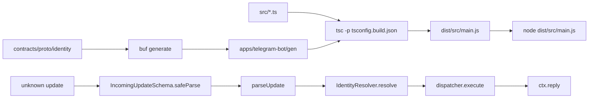

# Модуль TypeScript-сервиса

Первый исполняемый процесс на TypeScript в репозитории — скелет Telegram Bot. Файл объясняет, как язык собирает ESM-модуль под Node, откуда берутся типы и почему недоверенный ввод разбирается не компилятором, а схемой. Выбор стека компонента — [ADR-030](../../decisions/ADR-030-telegram-bot.md) и [бриф](../../services/telegram-bot.md); wire Identity — [unary-server.md](../grpc/unary-server.md) и [protobuf.md](../../standards/contracts/protobuf.md).

## Механика

### Пакет, ESM и расширение `.js`

Единица установки в Node — каталог с `package.json`. Ближайший аналог — проект с `.csproj`, но манифест здесь ещё и говорит рантайму, как читать файлы. Строка `"type": "module"` включает **ESM**: `import`/`export`, а не `require`. Без неё Node считал бы `.js` модулями CommonJS, и тот же синтаксис падал бы при запуске.

`package-lock.json` — lock-файл графа зависимостей, как `go.sum` или `packages.lock.json`. Ставит его только `npm ci`; поле `"packageManager": "npm@10.9.7"` фиксирует менеджер, чтобы CI и локальная машина не разъехались на pnpm/yarn.

Импорт в исходнике указывает расширение `.js`, хотя на диске лежит `.ts`:

```ts
import { acknowledge } from "./acknowledge.js";
```

Это не опечатка и не «файл ещё не скомпилировали». `module`/`moduleResolution`: `NodeNext` просит писать тот specifier, с которым файл будут загружать после `tsc`. Компилятор стирает типы и оставляет строку импорта как есть: в `dist/src/application/dispatcher.js` после сборки та же строка `./acknowledge.js`. Если написать `from "./acknowledge"`, `tsc` отвечает TS2835 и предлагает `./acknowledge.js`. В C# using не несёт расширения; здесь путь импорта — часть контракта с загрузчиком Node.

`import type { ExecuteRequest }` — отдельная форма. Флаг `verbatimModuleSyntax` запрещает обычный `import { ExecuteRequest }`, если `ExecuteRequest` существует только как тип: иначе в выдаче остался бы `import`, которому в рантайме нечего грузить. `import type` стирается целиком.

### TypeScript 7 и `"types": ["node"]`

`npx tsc --version` в этом пакете печатает `7.0.2`. Это нативный компилятор, а не очередной минор 5.x: JS-модуль `typescript` больше не отдаёт compiler API (`ts.createProgram` и соседние). Поэтому линт и тесты в срезе не ходят в `typescript` как в библиотеку: Biome парсит сам, Vitest транспилирует через свой pipeline, `tsc` вызывается как бинарник.

В 7.0 поле `types` по умолчанию пустое: `@types/*` больше не подхватываются молча. Без `"types": ["node"]` тот же `src/main.ts` не видит `process`, `setTimeout` и `node:crypto` — ошибка TS2591 с подсказкой добавить `node` в `types`. Это ровно то наблюдение, которое в задаче скелета пришло из пробного прогона. Ближайший аналог в .NET — не подключить `ImplicitUsings` и удивиться, что `Console` «пропал»; здесь глобальные типы Node — отдельный пакет `@types/node`, и его нужно назвать.

### Strictness, которая меняет форму кода

`strict: true` включает привычный набор (`strictNullChecks` и соседи). В `tsconfig.json` рядом стоят флаги, которые `strict` не подразумевает, и каждый виден в диффе.

`noPropertyAccessFromIndexSignature` запрещает `process.env.TELEGRAM_BOT_TOKEN`: `ProcessEnv` индексируется строкой, и обращение через точку — это чтение несуществующего известного поля. Нужен индекс: `process.env["TELEGRAM_BOT_TOKEN"]`. Biome при этом предлагает обратное — упростить до точки. Скелет обходит спор хелпером `readEnv(name)`, который принимает строку и индексирует ею `process.env`.

`noUncheckedIndexedAccess` делает `calls[0]` типом `T | undefined`, даже если массив только что заполнили. Поэтому в тесте адаптера стоит `calls[0]?.method`, а не `calls[0].method`. В C# `list[0]` на пустом списке бросит исключение в рантайме; здесь компилятор требует учесть отсутствие элемента до запуска.

`exactOptionalPropertyTypes` различает «ключа нет» и «ключ есть, значение `undefined`». Тип

```ts
telegramUsername?: string;
```

принимает объект без поля и отвергает `{ telegramUsername: undefined }`. Поэтому `toRequest` в клиенте Identity собирает вход двумя ветками: если ника нет, в объект он не попадает. Сгенерированный Protobuf-тип пишет `telegramUsername?: string | undefined` — генератор допускает оба; наш доменный тип уже нет.

`useUnknownInCatchVariables` делает параметр `catch` типом `unknown`, а не `any`. В `main` это `cause instanceof Error ? cause.message : String(cause)`. Обращение `e.message` сразу — TS18046.

### `unknown`, Zod и тип из схемы

Компилятор проверяет то, что написал автор файла. Update от Telegram — JSON, который клиент может подменить. Статический тип `Update` из grammY здесь не доказательство: он описывает контракт Bot API, а не содержимое конкретного байта. Поэтому `parseUpdate` принимает `unknown` и отдаёт его схеме:

```ts
export function parseUpdate(raw: unknown): ParsedUpdate {
  const parsed = IncomingUpdateSchema.safeParse(raw);
  if (!parsed.success) {
    return { kind: "malformed" };
  }
```

Zod — библиотека runtime-схем. `z.object({ update_id: z.number().int(), ... })` в рантайме проверяет форму значения. `safeParse` возвращает успех или отказ значением, без исключения: мусор от человека на этой границе ожидаем. `parse` бросил бы — его оставляют месту, где невалидные данные означают дефект соседа.

`export type IncomingUpdate = z.infer<typeof IncomingUpdateSchema>` выводит тип из схемы, чтобы они не разъехались. Это ближе к «схема — источник, тип — следствие», чем к FluentValidation, который проверяет уже существующий C#-тип.

Схема считает `message` необязательным: объект `{ update_id: 1 }` проходит `safeParse`, и уже `parseUpdate` возвращает `ignored`. `malformed` — это не «нет сообщения», а «это вообще не update»: `null`, строка, `{ update_id: "x" }`. Три результата — три разных решения, а не одна ошибка.

### Discriminated union и `never`

Результат юзкейса — не иерархия классов, а союз с общим полем-дискриминантом:

```ts
export type ExecuteResult =
  | { kind: "stub"; text: string }
  | { kind: "rejected"; reason: "unknown-intent" };
```

`switch (result.kind)` сужает тип ветки: в `case "stub"` есть `text`, в `rejected` — `reason`. В C# похожий приём даёт pattern matching по record; отличие в том, что TypeScript проверяет полноту через `never`:

```ts
default: {
  const _exhaustive: never = request.intent;
  return unknownIntent(_exhaustive);
}
```

Пока `Intent` — литерал `"acknowledge"`, default недостижим и тип сходится. Новый литерал в `Intent` без новой ветки `switch` ломает сборку: присвоить его `never` нельзя. Это не runtime-assert «этого не бывает», а отказ компилятора на неполноте.

То же для enum `GlobalRole` из сгенерированного файла: `ADMIN` и `UNSPECIFIED` разобраны по имени, default снова `never`.

### Сгенерированный клиент Identity

`buf generate --template apps/telegram-bot/buf.gen.yaml` вызывает локальный `protoc-gen-es` и пишет `apps/telegram-bot/gen/identity/v1/identity_service_pb.ts`. Каталог в Git не лежит. В отличие от Go, где из схемы выходят два файла (сообщения и gRPC-стабы), здесь один: сообщения, enum и дескриптор сервиса `IdentityService`. RPC-клиент не генерируется отдельным плагином — его собирает Connect:

```ts
const client = createClient(IdentityService, transport);
await client.resolveIdentity(toRequest(input));
```

`createGrpcTransport` из `@connectrpc/connect-node` говорит с Identity обычным gRPC по HTTP/2; протокол Connect сервер не принимает. Поле `int64 telegram_user_id` в TypeScript становится `bigint`: JS `number` — это float64 и не держит целый int64. Поэтому parser делает `BigInt(from.id)` на границе, где Telegram ещё отдаёт JSON-число.

Отказ транспорта ловится `try/catch` и становится `{ kind: "unavailable"; cause }`. Исключение здесь — неожиданный отказ соседа, а не поток управления юзкейса. Доменный отказ — значение союза.

### Сборка и проверка

`tsconfig.json` с `noEmit: true` — проверка типов. `tsconfig.build.json` наследует его, выключает `noEmit` и исключает `*.test.ts`: в `dist/` попадает только то, что запустит `node dist/src/main.js`. Тесты Vitest читают `.ts` сами и в emit не входят.

`just telegram-bot-build` сначала генерирует `gen/`, потом вызывает `tsc`. Без `gen/` импорт `identity_service_pb.js` не резолвится. Это тот же приём, что у Identity: кодогенерация — предусловие сборки, а не шаг, который «как-нибудь сделают».

## Урок

**Расширение в импорте — часть контракта с загрузчиком, а не деталь компилятора.** Пока module system — NodeNext, писать `.js` в `.ts` файле правильно. Соседний сервис на том же стеке получит ту же ошибку TS2835, если забудет расширение.

**Тип на границе недоверенных байт ничего не доказывает.** `Update` из grammY удобен внутри представления, после того как схема уже разобрала `unknown`. Следующий TypeScript-вход (мини-приложение, webhook, если появится) повторяет ту же пару: `unknown` → `safeParse` → `z.infer`.

**Полнота союза дешевле второго assert.** `never` в `default` ломает сборку при новом варианте. Это переносится на любой стек с алгебраическими типами; в C# без исчерпывающего matching ту же роль играет тест на новый enum-член.

**Пустой `types` в TypeScript 7 — ловушка глобалей.** Node-глобали не появляются от факта установки `@types/node`. Явный `"types": ["node"]` нужно повторить в следующем пакете, иначе первая же ссылка на `process` выглядит как «сломанный toolchain».

## Почему так, а не иначе

| Вариант | Цена |
|---|---|
| CommonJS / `"module": "CommonJS"` | `require` и default-import живут по другим правилам; Connect и grammY в срезе — ESM. NodeNext совпадает с тем, как Node 22 грузит `"type": "module"` |
| `moduleResolution: "bundler"` | удобно Vite/Webpack, врёт Node: стартовый `node dist/src/main.js` не бандлится |
| pnpm / yarn | стандарт Protobuf уже фиксирует `npm ci`; второй менеджер в CI — второй lockfile и расхождение с полем `packageManager` |
| TypeScript 5.x / 6.x как `tsc` | `npm i typescript` ставит 7.x; 7.0 проверен с Zod 4.5 и grammY 1.46. Цена — нет compiler API, поэтому не ESLint+typescript-eslint |
| ESLint + typescript-eslint | нужен JS API компилятора. В 7.0 его нет; dual-install `@typescript/typescript6` вернул бы API ценой двух `tsc` |
| Prettier рядом с ESLint | два инструмента и два конфига. Biome делает lint и format одной неинтерактивной `biome check` |
| `node:test` вместо Vitest | ноль лишних зависимостей, но нет нативного TS без `tsx` или предварительного emit. `vitest run` выключает watch и ест `.ts` |
| Тип `Update` вместо Zod | компилятор принимает любой объект, который автор привёл через `as Update`. Клиент шлёт произвольный JSON |
| `parse()` вместо `safeParse` | мусорный update становится исключением и роняет обработчик. На границе человека отказ — значение `malformed` |
| Порог coverage в первом скелете | команда `npm run coverage` есть, порога нет: иначе gate краснеет на `main.ts` и default-ветках `never`, которые нарочно недостижимы |
| Lint-rule «не импортировать grammY в application» | TypeScript не запретит протащить `Context`. Границу держит тест диспетчера без grammY; автоматическое правило откладывается |
| Коммитить `gen/` | ломает [protobuf.md](../../standards/contracts/protobuf.md): generated — не источник правды |
| `httpVersion: "2"` у `createGrpcTransport` | поля нет: этот транспорт всегда HTTP/2. Лишний ключ — TS2353 |

## Схема



`just telegram-bot-typecheck`, `telegram-bot-test`, `telegram-bot-lint` и `telegram-bot-build` зависят от `telegram-bot-proto`. Без `gen/` клиент Identity не компилируется.

## Первоисточники

- [TypeScript 7.0 announcement](https://devblogs.microsoft.com/typescript/announcing-typescript-7-0/) — нативный `tsc`, пустой default `types`, отсутствие compiler API в JS-модуле.
- [TypeScript handbook: Node.js modules](https://www.typescriptlang.org/docs/handbook/modules/reference.html) — `NodeNext`, specifier с расширением, `verbatimModuleSyntax`.
- [Node.js ES modules](https://nodejs.org/api/esm.html) — `"type": "module"` и как Node грузит `import`.
- [tsconfig `exactOptionalPropertyTypes`](https://www.typescriptlang.org/tsconfig/#exactOptionalPropertyTypes) — отсутствие ключа против `undefined`.
- [Zod](https://zod.dev/) — `safeParse`, `z.infer`, `optional`.
- [protobuf-es / protoc-gen-es](https://github.com/bufbuild/protobuf-es) — один `target=ts` файл со схемой сервиса.
- [Connect: createClient](https://connectrpc.com/docs/web/getting-started) — клиент из дескриптора; транспорт gRPC в Node — `@connectrpc/connect-node`.
- [Vitest CLI](https://vitest.dev/guide/cli) — `vitest run` выключает watch (`--run`).
- [Biome `check`](https://biomejs.dev/reference/cli/#biome-check) — lint, format и assist одной неинтерактивной командой.
- Скилл `.skillshare/skills/proj/proj-write-typescript/SKILL.md` — `unknown` → Zod → `z.infer`, `safeParse` на человеческом вводе, `never` в default.
- Скилл `.skillshare/skills/proj/proj-write-grammy-bot/SKILL.md` — юзкейс без `Context`, parser принимает `unknown`, а не grammY.

## Проверь себя

- `npx tsc --version` в `apps/telegram-bot` печатает `Version 7.0.2`. Проверено.
- Копия `tsconfig.json` без `"types": ["node"]` даёт TS2591 на `process` и `node:crypto` в `src/main.ts` / `src/logging.ts` / `src/presentation/bot.ts`. Проверено.
- `import { acknowledge } from "./acknowledge"` под текущим `tsconfig` — TS2835, предложение `./acknowledge.js`. Проверено.
- `process.env.TELEGRAM_BOT_TOKEN` — TS4111, нужен индекс. Проверено.
- `import { ExecuteRequest }` без `type` — TS1484 при `verbatimModuleSyntax`. Проверено.
- `{ telegramUsername: undefined }` не присваивается в `ResolveIdentityInput`; объект без ключа — проходит. Проверено.
- `calls[0].method` без `?.` — TS2532 `possibly 'undefined'`. Проверено.
- `catch (e) { return e.message; }` — TS18046, `e` имеет тип `unknown`. Проверено.
- `IncomingUpdateSchema.safeParse` на `null`, `""`, `1`, `{}`, `{ update_id: "x" }` — `success: false`; на `{ update_id: 1 }` — `success: true`; полный message — `success: true`. Проверено на emit в `dist/`.
- `just telegram-bot-proto && ls apps/telegram-bot/gen/identity/v1/` даёт `identity_service_pb.ts` с `telegramUserId: bigint` и `export const IdentityService`. Проверено.
- После `tsc -p tsconfig.build.json` первая строка `dist/src/application/dispatcher.js` — `import { acknowledge } from "./acknowledge.js"`. Проверено.
- `npx vitest run src/application/dispatcher.test.ts` завершается кодом 0, без watch. Проверено.

Открытые вопросы, из-за которых статус «вернуться»:

- Когда появится compiler API у TypeScript 7.1, останется ли Biome единственным линтером или вернётся typescript-eslint?
- `try/catch` вокруг `resolveIdentity` сейчас глотает любой отказ в `unavailable`. Как Connect кодирует gRPC `InvalidArgument` и надо ли его отличать от сетевого сбоя — проверь сам, когда будет живой Identity: вызови клиент с `telegramUserId: 0n` и посмотри `cause`.
