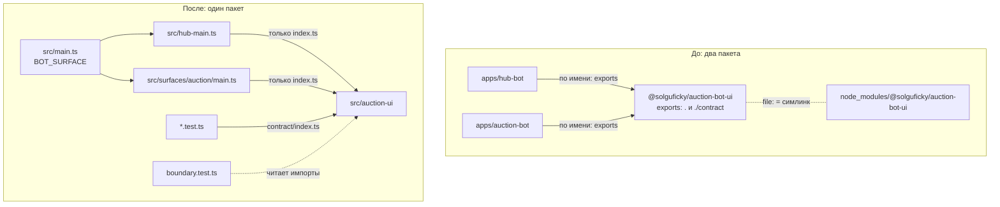

# Границы пакета и сборки в TypeScript

Аукционный интерфейс двух ботов жил отдельным npm-пакетом `shared/typescript/auction-bot-ui`, а потом переехал внутрь `apps/hub-bot`. Устройство переезда описывает [ADR-064](../../decisions/ADR-064-two-bots-by-audience-circle-and-rights.md), пп. 18–19, а этот файл — механизмы Node и TypeScript, на которых держалась старая граница и держится новая. Что из этих механизмов прячет код, что только кажется, что прячет, и что попадает в сборку вопреки ожиданию.

## Механика

### `exports`: что пакет отдаёт наружу

Поле `exports` в `package.json` — список путей, по которым пакет можно импортировать **по имени**. У прежнего пакета было два входа:

```json
"exports": {
  ".": { "types": "./dist/src/index.d.ts", "default": "./dist/src/index.js" },
  "./contract": { "types": "./dist/src/contract/index.d.ts", "default": "./dist/src/contract/index.js" }
}
```

`import { handleAuctionUpdate } from "@solguficky/auction-bot-ui"` разрешается в `dist/src/index.js`. Импорт любого другого файла пакета по имени, например `"@solguficky/auction-bot-ui/internal/use-cases/open-lot"`, Node отвергает ошибкой `ERR_PACKAGE_PATH_NOT_EXPORTED`, а `tsc` под `moduleResolution: NodeNext` — ошибкой типа. Ближайший аналог в .NET — `internal` на уровне сборки: публичный API задан явно, остальное снаружи недостижимо.

Пакет проверял это сам файлом `test/boundary.typecheck.ts`: положительные импорты по имени и запрещённые — под `@ts-expect-error`:

```ts
// @ts-expect-error сырой юзкейс не входит в exports
import { openLot } from "@solguficky/auction-bot-ui/internal/use-cases/open-lot";
```

`@ts-expect-error` требует, чтобы на следующей строке была ошибка. Откроет кто-то путь в `exports` — ошибки не станет, директива окажется лишней, и `typecheck` покраснеет. Проверка границы «наоборот».

### Чего `exports` не видит

Граница `exports` работает только для импорта **по имени пакета**. Относительный путь к тому же файлу её не проходит вовсе: `"../../shared/typescript/auction-bot-ui/src/internal/use-cases/open-lot.js"` резолвится как обычный файл, и `exports` в этом не участвует. Поэтому `AGENTS.md` пакета держал отдельное правило «приложения берут пакет только по имени» — механизмом оно не было.

Внутри одного приложения импорт по имени собственного кода не нужен: всё — относительные пути. Значит, после переезда граница «поверхность входит в дерево только через шлюз» лишилась опоры. Её теперь держит тест, который читает исходники: `src/auction-ui/boundary.test.ts` собирает все относительные импорты пакета (`testkit/imports.ts`) и требует, чтобы снаружи дерева они вели только в `index.ts`, а из тестов — ещё в `contract/index.ts`. Тот же приём в `src/surfaces/boundary.test.ts` не даёт поверхности хаба и поверхности аукциона импортировать друг друга. Это ближе к архитектурным тестам вроде NetArchTest в .NET, чем к модификатору доступа: правило проверяется прогоном, а не компилятором.

### `file:`-зависимость — симлинк на каталог

Оба бота брали пакет строкой `"@solguficky/auction-bot-ui": "file:../../shared/typescript/auction-bot-ui"`. `npm install` для неё ничего не копирует: в `node_modules/@solguficky/auction-bot-ui` ложится **симлинк на весь каталог пакета**, вместе с его собственным `node_modules`. Зависимости пакета (у этого — `zod`) поэтому находятся локально «сами»: Node ищет `zod` в `node_modules` вверх от файла, который его импортирует, и находит его внутри каталога пакета.

В production-образе симлинк на путь репозитория бесполезен: `/app` его не содержит. `Containerfile` хаба заменял симлинк копией:

```sh
rm node_modules/@solguficky/auction-bot-ui \
  && cp -R ../../shared/typescript/auction-bot-ui node_modules/@solguficky/auction-bot-ui
```

Копия несёт только то, что в неё положили. Бот аукциона клал `package.json` и `dist` без `node_modules` пакета и сам `zod` не объявлял — поэтому, по комментарию его `Containerfile`, «копия без них в образе падает на старте с `ERR_MODULE_NOT_FOUND`». Хаб `zod` объявлял сам, и у него та же копия работала. Растворение пакета эту ловушку снимает целиком: кода, который надо копировать отдельно, больше нет.

### `exclude` в `tsconfig` — фильтр корней, а не стена

`tsconfig.build.json` пакета ботов исключает из сборки тесты и `contract/`:

```json
"exclude": ["src/**/*.test.ts", "src/auction-ui/contract/**"]
```

`contract/` импортирует `vitest`, а в образе пакетов разработки нет. Но `include` и `exclude` выбирают только **корневые файлы** — те, с которых `tsc` начинает. Любой файл, на который ведёт `import` из корневого, компилятор подтягивает сам, исключён он или нет. Достаточно одной строки `export { … } from "./contract/surfaces.js"` в прод-коде дерева, чтобы `contract/` оказался в `dist`, а процесс в образе упал на загрузке `vitest`. Поэтому `boundary.test.ts` отдельно проверяет, что прод-код дерева `contract/` не импортирует: `exclude` этого не гарантирует.

### Статический импорт исполняет модуль

`src/main.ts` выбирает поверхность:

```ts
import { startHub } from "./hub-main.js";
import { startAuction } from "./surfaces/auction/main.js";
// …
if (surface.surface === "hub") startHub();
else startAuction();
```

Статический `import` в ESM загружает и **исполняет верхний уровень** модуля до первой строки `main.ts`, даже если его функцию никто не позовёт. Оба composition root поэтому загружаются в оба процесса. Это безопасно ровно потому, что на их верхнем уровне нет побочных эффектов: старт, чтение переменных и подключения спрятаны в `startHub` и `startAuction`. `await import("./hub-main.js")` грузил бы только выбранную поверхность — ценой асинхронного входа и того, что ошибка импорта второй поверхности всплывала бы только в её процессе.

## Урок

**Граница, которую держит упаковка, исчезает вместе с упаковкой.** `exports`, отдельный `package.json` и раскладка по приложениям — механизмы, а правило «входить только через шлюз» — смысл. При слиянии пакетов смысл надо перенести на новый механизм тем же изменением, иначе он остаётся текстом в `AGENTS.md`. Переносится на любую сборку: проекты .NET со своими `internal`, Go-модули с `internal/`, Scala-подпроекты.

**Проверку «запрещено» сопровождает проверка «видно».** Тест, который ищет запрещённые импорты и возвращает пустой список, неотличим от сломанного сканера. Поэтому оба теста границ рядом проверяют, что сканер видит разрешённый импорт (`sees the bot importing the tree`).

**Исключение из сборки не исключает из графа.** Что попадает в артефакт, решает граф импортов, а не список файлов. Это верно для `tsc`, бандлеров и `dotnet publish` с trimming.

## Почему так, а не иначе

- **Поле `imports` с подпутями `#auction-ui`.** Node умеет внутренние алиасы: `"imports": { "#tree": "./tree/index.js" }`, и `import … from "#tree"` работает, а `"#tree/internal/raw.js"` без объявления даёт `ERR_PACKAGE_IMPORT_NOT_DEFINED`. Но относительный путь к тому же файлу проходит мимо, как и мимо `exports`: граница снова держалась бы дисциплиной. Тест импорта всё равно нужен, а алиас добавлял бы второй способ писать один импорт.
- **Правило линтера `noRestrictedImports` в Biome.** Держало бы границу на lint, но шаблоны путей в нашей версии не проверены, а отказ нужно было бы доказывать фикстурой отдельно. Тест на vitest пишется тем же языком, что и код, и сам показывает нарушителя.
- **Оставить пакет и сделать бота аукциона `file:`-зависимостью на `apps/hub-bot`.** Сохраняло `exports`, но тянуло сборку всего бота хаба ради одного модуля и было переходным: следующий шаг всё равно сливал приложения.
- **Динамический `import()` в `main.ts`.** Грузил бы одну поверхность, но статические импорты проще и ловят ошибку сборки любой поверхности в любом процессе; цена — ничего, пока на верхнем уровне нет эффектов.

## Схема



## Первоисточники

- [Node.js: package entry points (`exports`)](https://nodejs.org/api/packages.html#package-entry-points) — какие пути открывает `exports` и ошибка `ERR_PACKAGE_PATH_NOT_EXPORTED`.
- [Node.js: subpath imports (`imports`)](https://nodejs.org/api/packages.html#subpath-imports) — алиасы `#name` внутри пакета.
- [npm: `file:` dependencies](https://docs.npmjs.com/cli/v10/configuring-npm/package-json#local-paths) — локальный путь как зависимость и симлинк при установке.
- [TypeScript: `include`/`exclude`](https://www.typescriptlang.org/tsconfig/#exclude) — оговорка, что `exclude` меняет только набор корневых файлов, а импортированный файл всё равно попадает в программу.
- [ECMAScript modules: evaluation](https://nodejs.org/api/esm.html#modules-ecmascript-modules) — статический импорт загружается и исполняется до кода импортирующего модуля; `import()` — по требованию.
- Решение о слиянии: [ADR-064](../../decisions/ADR-064-two-bots-by-audience-circle-and-rights.md), пп. 18–19; правило шлюза — [ADR-044](../../decisions/ADR-044-two-telegram-bots-and-shared-auction-screens.md), «Доступ как обязательный шлюз».
- Скилл `.skillshare/skills/proj/proj-write-typescript/SKILL.md` — существующий tooling и строгие типы; правило границы оттуда не взято, оно из ADR.

## Проверь себя

Эксперименты — на крошечных пакетах в пустом каталоге, Node 22 и `tsc` 7.0.2 из `apps/hub-bot/node_modules`.

- Пакет `b` с `"exports": { ".": "./index.js" }`; `import … from "b/internal/raw.js"` из пакета `a` — `ERR_PACKAGE_PATH_NOT_EXPORTED`. Проверено.
- Тот же файл относительным путём `"./node_modules/b/internal/raw.js"` — импортируется без ошибки. Проверено.
- После `npm install` пакета с `"b": "file:../b"` путь `a/node_modules/b` — симлинк на `b`; зависимость `dep`, лежащая только в `b/node_modules`, находится. Проверено.
- Замена симлинка копией `package.json` и `index.js` без `node_modules` — `ERR_MODULE_NOT_FOUND`. Проверено.
- `node --preserve-symlinks` при симлинке на целый каталог зависимость тоже находит: симлинк ведёт и на `b/node_modules`. Поэтому причина поломки — потерянный `node_modules` копии, а не способ разрешения симлинка. Проверено.
- `tsconfig` с `"exclude": ["src/contract/**"]`: пока `contract/` никто не импортирует, его в `dist` нет; после `export { surfaces } from "./contract/surfaces.js"` в `src/screen.ts` — `dist/src/contract/surfaces.js` есть. Проверено.
- `main.mjs` статически импортирует `hub.mjs` и `auction.mjs` с `console.log` на верхнем уровне: при `S=hub` печатаются обе строки «evaluated», затем «hub started». С `await import()` — только `hub`. Проверено.
- `"imports": { "#tree": "./tree/index.js" }`: `import … from "#tree"` работает, `"#tree/internal/raw.js"` — `ERR_PACKAGE_IMPORT_NOT_DEFINED`, относительный `"./tree/internal/raw.js"` — работает. Проверено.
- Подкинутый в `src/uuid-v7.ts` реэкспорт `./auction-ui/dispatcher.js` роняет `boundary.test.ts` с этим путём в выводе; то же — импорт `./surfaces/auction/logging.js` из кода хаба и импорт `./contract/surfaces.js` из `src/auction-ui/screen.ts`. Проверено и откачено.
