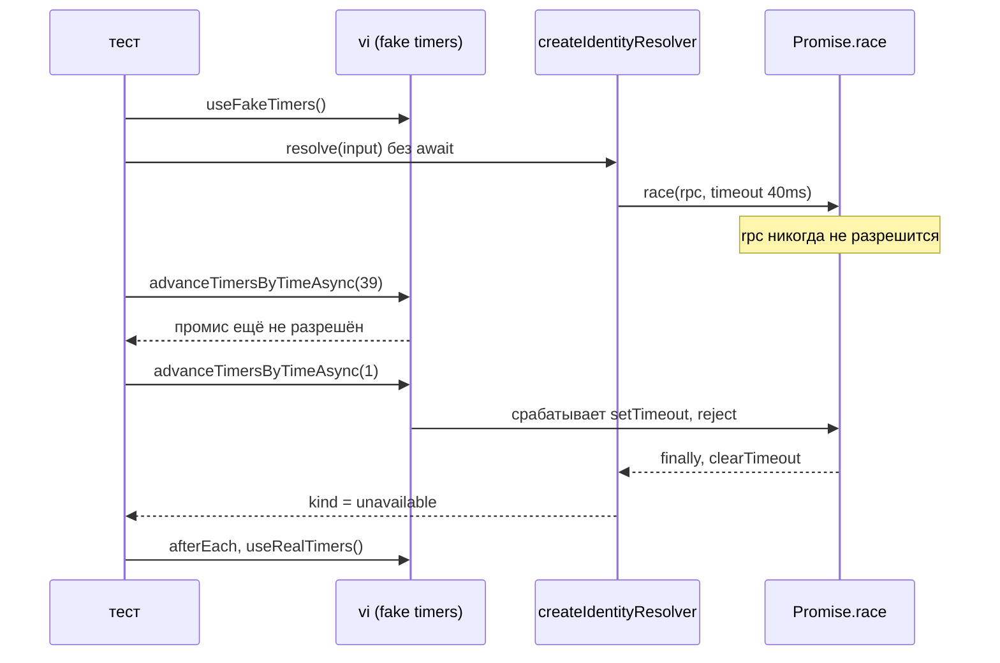
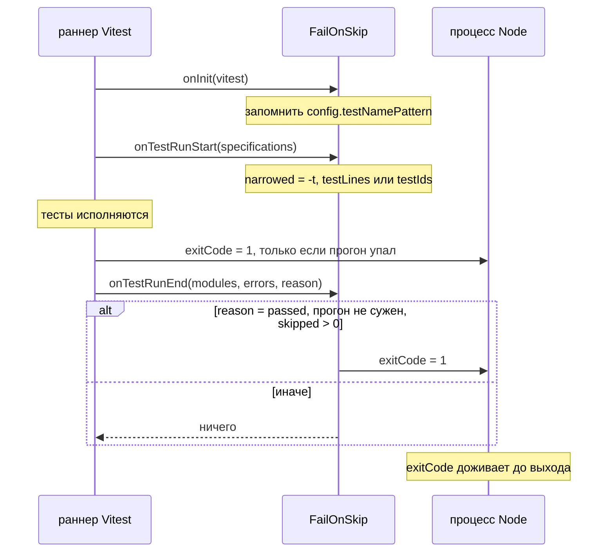

# Тесты на TypeScript

Тесты Hub Bot запускает Vitest — раннер поверх Vite. Файл объясняет, что он делает с `.ts` и чего принципиально не делает, как подменяется сосед без мок-фреймворка и как проверяется дедлайн, не ожидая три секунды. Устройство модуля и типов — [module-and-types.md](module-and-types.md); что именно проверяется у границы Telegram — [grammy/bot-adapter.md](../grammy/bot-adapter.md); уровни и правила — [standard: стратегия тестирования](../../standards/testing/testing-strategy.md). Тот же вопрос в другом стеке — [go/testing.md](../go/testing.md), и различия ниже отмечены.

## Механика

### Где живёт тест и что его находит

Файл `*.test.ts` лежит рядом с проверяемым кодом: `dispatcher.ts` и `dispatcher.test.ts` в одном каталоге. Отбор задаёт конфиг, а не конвенция:

```ts
test: {
  watch: false,
  environment: "node",
  include: ["src/**/*.test.ts"],
}
```

`include` — то, что раннер вообще считает тестовым файлом. `watch: false` и команда `vitest run` выключают режим наблюдения дважды: конфиг закрывает запуск из IDE, флаг — запуск из CI.

Отличие от Go тут принципиальное, и его легко пропустить. В Go каталог — это пакет, и выбор `package server` против `package server_test` даёт тесту доступ к неэкспортируемым именам. В TypeScript единица видимости — модуль-файл, и тест видит ровно то, что файл экспортировал. Промежуточного режима нет: либо имя экспортировано всем, либо не проверяется напрямую. Отсюда форма кода — `createDispatcher()`, `createIdentityResolver(rpc)`, `createBot(runtime)`: проверяется то, что и так публично, а внутренние функции (`withDeadline`, `writeBoundary`) достаются через них.

Тестовые функции ищутся не по атрибуту, а по вызову внутри файла, и имена импортируются явно:

```ts
import { afterEach, describe, expect, it, vi } from "vitest";
```

`globals: true` в конфиге не включён, поэтому `describe` и `expect` не появляются сами. Плюс в том, что имя видно в импорте и линтер знает, откуда оно; в xUnit ту же роль играет атрибут `[Fact]`, который не надо импортировать, но и не видно, чей он.

### Vitest не проверяет типы

Это главное отличие от `dotnet test` и главный источник ложного спокойствия. Vitest берёт `.ts` и прогоняет через трансформер Vite: типы **стираются**, а не проверяются. Файл с несовместимым типом проходит тесты зелёным.

Проверено: временный тест со строкой

```ts
const wrong: number = "not a number";
```

завершается `Tests 2 passed`, а `npx tsc --noEmit -p tsconfig.json` на том же файле печатает `error TS2322: Type 'string' is not assignable to type 'number'`.

Отсюда две отдельные команды в гейте — `just hub-bot-typecheck` и `just hub-bot-test`, — и обе стоят в `verify`. Зелёный `npm test` не означает, что модуль компилируется; в .NET такое состояние недостижимо, потому что тесты собираются тем же компилятором.

### Подмена соседа — тип, а не мок-фреймворк

`vi.mock` в тестах компонента не используется ни разу. Подменяется не модуль, а параметр:

```ts
const identity = createIdentityResolver(
  { resolveIdentity: () => new Promise<never>(() => {}) },
  40,
);
```

Объектный литерал подходит под тип `IdentityRpc`, потому что у него нужная форма: в TypeScript типизация **структурная**. Ни `implements`, ни базового класса, ни регистрации — совпали поля и сигнатуры, значит подходит. В C# для того же нужен объявленный интерфейс и либо Moq, либо класс-заглушка; здесь достаточно того, что функция принимает тип, а не класс.

Тот же приём держит границу в `bot.test.ts`: `IdentityResolver` — тип-порт, и тесты дают три разные его реализации — успешную, отвечающую `unavailable` и бросающую. Логгер подменяется так же: `createCapturingLogger()` возвращает объект типа `Logger`, который складывает записи в массив. Перехватывать `process.stdout.write` не нужно, и тест не знает, что настоящий логгер пишет JSON.

`new Promise<never>(() => {})` — промис, который никогда не разрешится: конструктор не зовёт ни `resolve`, ни `reject`. Это точная модель соседа, который принял соединение и молчит, а `<never>` говорит компилятору, что значения не будет.

### Фейковые таймеры: дедлайн проверяется за миллисекунды

Дедлайн Identity — 3 секунды. Ждать их в тесте нельзя, поэтому таймер подменяется:

```ts
vi.useFakeTimers();
const identity = createIdentityResolver({ resolveIdentity: () => new Promise<never>(() => {}) }, 40);
const pending = identity.resolve({ telegramUserId: 1n });
await vi.advanceTimersByTimeAsync(39);
// ещё не разрешён
await vi.advanceTimersByTimeAsync(1);
await expect(pending).resolves.toMatchObject({ kind: "unavailable" });
```

`vi.useFakeTimers()` подменяет `setTimeout` и соседей: время двигает тест, а не часы. Проверка «на 39 не сработало, на 40 сработало» — это проверка именно дедлайна, а не «примерно быстро»; стандарт тестирования требует ровно этого: фиксируй время, не завись от часов машины.

Два метода различаются сильнее, чем кажется по именам. `advanceTimersByTime` двигает время синхронно и на этом заканчивает. `advanceTimersByTimeAsync` дополнительно даёт прокрутиться микрозадачам. Проверено: после синхронного сдвига на 40 мс и одного `await Promise.resolve()` промис ещё не разрешён, а после `await vi.advanceTimersByTimeAsync(0)` — разрешён. Причина в том, что между сработавшим таймером и возвратом из `resolve()` стоит цепочка `reject` → `finally` → `catch` → `return`, и каждое звено — отдельный тик очереди микрозадач.

```ts
afterEach(() => {
  vi.useRealTimers();
});
```

Это не ритуал. Проверено: подмена, поставленная в одном тесте, остаётся видимой в следующем тесте того же файла — `vi.isFakeTimers()` возвращает там `true`. Без `afterEach` соседний тест начинает жить в остановленном времени.

### Харнесс и общий ассерт по каркасу лога

`createHarness(identity)` собирает бота, ставит записывающий transformer и capturing logger, возвращает `{ bot, calls, records }`. Устройство transformer — в [grammy/bot-adapter.md](../grammy/bot-adapter.md); здесь важно, что харнесс собран один раз, а тесты отличаются только подменённым соседом.

Проверка записи вынесена в `expectBoundary(record, expected)`: у любой записи границы должны быть `operation`, `result`, непустой `request_id` и числовой `duration_us`, а при `result: "error"` — ещё `error_category` и непустой `error`. Каркас [стандарта](../../standards/observability/logging.md) проверяется как контракт, в одном месте: если поле пропадёт, покраснеют все тесты сразу, а не тот единственный, где кто-то вспомнил про ассерт.

### Типы берутся из библиотеки, а не переписываются

```ts
type ApiMethod = Parameters<Transformer>[1];
type ApiPayload = Parameters<Transformer>[2];
```

`Parameters<F>` — утилитный тип: кортеж аргументов функции `F`, индекс выбирает нужный. Тест не копирует сигнатуру grammY и не разойдётся с ней при обновлении библиотеки. В C# ближайший аналог — рефлексия, но она работает в рантайме; здесь это операция над типами, исчезающая при сборке.

Рядом стоит честное ослабление:

```ts
return Promise.resolve({ ok: true, result: true as never }); // ApiCallResult depends on method; fixture never calls prev
```

Тип ответа Bot API зависит от вызванного метода, а фикстура одна на все методы. `as never` подходит под любой ожидаемый результат, и комментарий говорит, почему это безопасно: `prev` фикстура не зовёт, настоящий ответ никуда не идёт.

### Асинхронные ассерты

`await expect(pending).resolves.toMatchObject({ kind: "unavailable" })` — ассерт над промисом. Забытый `await` в этой конструкции считается классической ловушкой, но конкретно здесь она закрыта: проверено, Vitest 4 ловит незавершённый `resolves`-ассерт и валит тест, а не пропускает его. `await` остаётся вопросом читаемости и порядка, а не единственной защитой.

### Покрытие

Провайдер — v8, в конфиге `enabled: false`, включает его флаг в скрипте `coverage`. Порога нет намеренно: `npm run coverage` завершается кодом 0 при 84.25% statements, где недобор дают `main.ts` и ветки `never`, недостижимые по построению.

### Свой reporter как гейт: пропуск роняет прогон

У `dotnet test` есть флаг `--fail-skips`, у Vitest такого нет: прогон с `it.skip` завершается кодом 0. Правило «пропуск не равен прохождению» поэтому исполняет свой reporter — `vitest.fail-on-skip.ts` рядом с конфигом.

Reporter в Vitest — объект с необязательными методами-хуками, которые раннер зовёт по ходу прогона. Это ближе всего к `ITestLoggerWithParameters` у `dotnet test`: наблюдатель, а не участник. Тестов он не запускает и результат не меняет, но в Node у него есть рычаг, которого у логгера .NET нет, — `process.exitCode`:

```ts
onTestRunEnd(testModules, _unhandledErrors, reason): void {
  if (reason !== "passed" || this.narrowed) return;
  const skipped = testModules.flatMap((module) => [
    ...module.children.allTests("skipped"),
  ]);
  if (skipped.length === 0) return;
  // печать «пропущено тестов: N» со списком имён
  process.exitCode = 1;
}
```

Почему это работает, видно в исходнике раннера. В `vitest/dist/chunks/cli-api.*.js` конец прогона устроен так:

```js
if (state !== "passed") process.exitCode = 1;
await this.vitest.report("onTestRunEnd", modules, [...errors], state);
```

Раннер выставляет код **до** вызова reporter'а и только на провале, а после ничего не сбрасывает. Значит, `exitCode = 1`, выставленный в `onTestRunEnd`, доживает до выхода процесса. Будь порядок обратным, раннер перезаписал бы код reporter'а нулём.

`allTests("skipped")` — генератор по всем тестам модуля с фильтром по состоянию. Состояние `skipped` собирает `.skip`, `.todo`, `skipIf`, `ctx.skip()` и тесты, отсечённые чужим `.only`.

Подключается reporter полем конфига:

```ts
reporters: ["default", new FailOnSkip()],
```

`"default"` написан не для красоты. Своё поле `reporters` **заменяет** список по умолчанию, а не дополняет его: без `"default"` пропадает весь штатный вывод, остаются только строки своего reporter'а.

Правило живёт в конфиге, а не в рецепте `justfile`, по одной причине: CI зовёт `npm test` напрямую. Проверку в рецепте он обошёл бы, а конфиг читает любой запуск раннера.

### Три случая, когда «skipped» — не пропуск в коде

Состояние `skipped` шире, чем «кто-то написал `.skip`». Раннер ставит его в трёх случаях, где ронять прогон было бы неверно или бесполезно, и reporter обязан их различать.

**Отбор по имени или строке.** `vitest run -t "откат"` или `vitest run file.test.ts:28` помечает все остальные тесты файла тем же `mode = "skip"`, что и `.skip` в коде. Это видно в `interpretTaskModes` из `@vitest/runner`:

```js
if (namePattern && !getTaskFullName(t).match(namePattern)) {
  t.mode = "skip";
}
```

По самому тесту эти два случая не различить. Различаются они по прогону: если запуск сузил сам человек, reporter молчит. Признак сужения reporter берёт в двух хуках. `onInit(vitest)` даёт объект раннера, у которого `vitest.config.testNamePattern` — флаг `-t`. `onTestRunStart(specifications)` даёт спецификации запуска, у которых `testLines` и `testIds` — отбор по строке и по id.

**Упавший хук.** Если `beforeAll` бросил исключение, тесты под ним не запускаются и тоже числятся `skipped`. Код уже 1, потому что прогон упал, а сообщение «пропущено тестов: 2» увело бы читателя от настоящей причины. Поэтому reporter проверяет `reason` — третий аргумент `onTestRunEnd` — и молчит на всём, что не `"passed"`.

**Чужой reporter из командной строки.** `--reporter=dot` заменяет поле `reporters` из конфига целиком. Правило снимается вместе со штатным выводом, и прогон с `it.skip` снова зелёный. Рецепты и CI этот флаг не передают. Это граница правила, а не защита от неё.

## Урок

**Раз тесты не проверяют типы, гейт состоит из двух команд.** Это переносится на любой стек, где раннер сам транспилирует: зелёные тесты не доказывают, что код собирается. В `verify` обе команды стоят рядом именно поэтому.

**Порт — это тип, а не фреймворк.** Функция, принимающая структурный тип, тестируется объектным литералом. Мок-библиотека нужна там, где подменяется модуль по пути, а не сосед по параметру; таких мест в компоненте пока нет.

**Дедлайн проверяется границей, а не ожиданием.** Два шага — «до срока не сработало» и «на сроке сработало» — доказывают именно правило. Тест, который ждёт настоящие 3 секунды, доказывает только терпение и первым начнёт мигать.

**Наблюдаемость проверяется как контракт.** Один хелпер на каркас полей дешевле, чем ассерты, рассыпанные по тестам, и он ломается сразу, если поле исчезло.

**Правило гейта ставится туда, через что проходит любой запуск.** Рецепт `justfile` — один из входов, и CI с IDE его обходят. Конфиг раннера читают все. Тот же выбор сделан в Scala: обёртка задачи в `build.sbt`, а не разбор лога в рецепте ([scala/build-and-codegen.md](../scala/build-and-codegen.md)).

**Состояние результата не равно намерению автора.** `skipped` склеивает «автор выключил тест», «запускающий отфильтровал» и «хук упал». Проверка, которая читает только состояние, ошибается в обе стороны: роняет отбор по имени и подменяет диагноз упавшего хука. Различать их приходится по контексту прогона, а не по самому тесту.

## Почему так, а не иначе

| Вариант | Цена |
|---|---|
| `node:test` | ноль зависимостей, но `.ts` он не ест: нужен `tsx` или предварительный `tsc`. Это второй шаг перед каждым запуском |
| Jest | свой трансформер и своя история с ESM; Vitest берёт трансформер Vite и конфиг в том же формате, что остальной тулинг |
| `globals: true` | `describe` и `expect` появляются без импорта: короче, но имя приходит ниоткуда и его происхождение не видно ни читателю, ни линтеру |
| `vi.mock("./client.js")` | подмена привязывается к пути модуля, а не к типу; переезд файла ломает тест, который про файл ничего не должен знать |
| `nock` / `msw` для Bot API | перехват на уровне HTTP вместо официального шва библиотеки — см. [grammy/bot-adapter.md](../grammy/bot-adapter.md) |
| Перехват `process.stdout.write` вместо порта `Logger` | тест начинает зависеть от формата JSON и порядка записи, то есть проверяет не то, что хотел |
| Реальные таймеры и `sleep(3000)` | три секунды на тест и мигание на нагруженной машине; правило стандарта «фиксируй время» нарушено прямо |
| Порог coverage сейчас | гейт краснеет на `main.ts` и недостижимых ветках `never`, а не на реальном недоборе проверок |
| Экспортировать внутреннюю функцию «ради теста» | публичная поверхность модуля растёт под давлением теста; `withDeadline` проверяется через `createIdentityResolver`, и этого достаточно |
| Пропуск ловится разбором `--reporter=json` в рецепте | работает только через `just`; CI зовёт `npm test` напрямую и правило обходит. Плюс второй формат вывода и скрипт разбора рядом с раннером |
| Пропуск ловится линтером по тексту `.skip` | не видит `skipIf` с условием, `ctx.skip()` внутри теста и тесты, отсечённые чужим `.only`: состояние знает только раннер |
| Reporter без учёта сужения прогона | `vitest run -t "имя"` падает всегда, потому что отфильтрованные тесты числятся пропущенными. Ручной прогон одного теста становится невозможен |
| Reporter печатает пропуск и на упавшем прогоне | под упавшим `beforeAll` все тесты `skipped`, и сообщение о пропуске заслоняет исключение хука |

## Схема


```mermaid
sequenceDiagram
  participant T as тест
  participant V as vi (fake timers)
  participant R as createIdentityResolver
  participant P as Promise.race
  T->>V: useFakeTimers()
  T->>R: resolve(input) без await
  R->>P: race(rpc, timeout 40ms)
  Note over P: rpc никогда не разрешится
  T->>V: advanceTimersByTimeAsync(39)
  V-->>T: промис ещё не разрешён
  T->>V: advanceTimersByTimeAsync(1)
  V->>P: срабатывает setTimeout, reject
  P-->>R: finally, clearTimeout
  R-->>T: kind = unavailable
  T->>V: afterEach, useRealTimers()
```

Жизненный цикл reporter'а и место, где он выставляет код:


```mermaid
sequenceDiagram
  participant V as раннер Vitest
  participant F as FailOnSkip
  participant N as процесс Node
  V->>F: onInit(vitest)
  Note over F: запомнить config.testNamePattern
  V->>F: onTestRunStart(specifications)
  Note over F: narrowed = -t, testLines или testIds
  Note over V: тесты исполняются
  V->>N: exitCode = 1, только если прогон упал
  V->>F: onTestRunEnd(modules, errors, reason)
  alt reason = passed, прогон не сужен, skipped > 0
    F->>N: exitCode = 1
  else иначе
    F-->>V: ничего
  end
  Note over N: exitCode доживает до выхода
```

## Первоисточники

- [Vitest: configuring](https://vitest.dev/config/) — `include`, `watch`, `environment`, `globals`.
- [Vitest: fake timers](https://vitest.dev/api/vi#vi-usefaketimers) — `advanceTimersByTime` против `advanceTimersByTimeAsync` и что именно подменяется.
- [Vitest: expect().resolves](https://vitest.dev/api/expect#resolves) — ассерты над промисами.
- [Vitest: coverage](https://vitest.dev/guide/coverage) — провайдер v8 и пороги.
- [Vite: TypeScript](https://vite.dev/guide/features#typescript) — трансформер стирает типы и не проверяет их; отсюда отдельный `tsc`.
- [TypeScript: utility types](https://www.typescriptlang.org/docs/handbook/utility-types.html) — `Parameters<F>`.
- [Vitest: Reporters API](https://vitest.dev/api/advanced/reporters) — хуки `onInit`, `onTestRunStart`, `onTestRunEnd` и их аргументы.
- [Vitest: TestCase](https://vitest.dev/api/advanced/test-case) — `result().state`, `options.mode` и почему `skipped` объединяет `skip`, `todo` и `only`.
- [Vitest: reporters в конфиге](https://vitest.dev/config/#reporters) — поле заменяет список по умолчанию, а флаг `--reporter` заменяет поле.
- Исходник `node_modules/vitest/dist/chunks/cli-api.*.js`, метод `end()` — порядок «код на провале, затем `onTestRunEnd`», на котором держится весь приём. Документация этого порядка не обещает, поэтому смотреть сюда при обновлении Vitest.
- [Standard: стратегия тестирования](../../standards/testing/testing-strategy.md) — уровни и правило про фиксацию времени.
- Скилл `.skillshare/skills/proj/proj-write-typescript/SKILL.md` — существующий lint/typecheck/test как обязательная тройка, ослабление типа рядом с местом и с причиной.

## Проверь себя

Проверялось на `vitest@4.1.11`, TypeScript 7.0.2 и Node 26, из `apps/telegram-bot` после `npm ci` и генерации `gen/`.

- `npx vitest run` — 4 файла, 11 тестов, зелено, без watch. Проверено.
- Файл со строкой `const wrong: number = "not a number";` проходит `vitest run` зелёным; `npx tsc --noEmit -p tsconfig.json` на нём даёт `TS2322`. Проверено.
- `vi.useFakeTimers()` в одном тесте остаётся активным в следующем тесте того же файла: `vi.isFakeTimers()` там `true`. Проверено, поэтому `afterEach` обязателен.
- После `vi.advanceTimersByTime(40)` и одного `await Promise.resolve()` промис `resolve()` ещё не разрешён; после `await vi.advanceTimersByTimeAsync(0)` — разрешён. Проверено.
- `expect(Promise.resolve(1)).resolves.toBe(2)` без `await` валит тест, а не проходит молча. Проверено.
- `npm run coverage` завершается кодом 0 при 84.25% statements. Проверено.

Reporter пропусков проверялся на `vitest@4.1.11` в `apps/community-site-api` и `apps/telegram-bot`:

- Временные `it.skip` и `it.todo` в `src/` роняют `just community-site-api-test` и `just telegram-bot-test` кодом 1, в выводе «пропущено тестов: 2» и оба имени. Проверено.
- `npx vitest run src/document.test.ts -t "откат"` — `3 passed | 9 skipped`, код 0: отбор по имени прогон не роняет. Проверено.
- `npx vitest run src/document.test.ts:28` — `1 passed | 11 skipped`, код 0. На строке без теста (`:5`) код 1, но это отказ самого Vitest: «No test found … in line 5». Проверено.
- Файл с `beforeAll`, бросающим исключение, и двумя тестами: `2 skipped`, код 1, сообщения «пропущено тестов» нет. Проверено.
- Тот же `it.skip` с `--reporter=dot` — код 0: флаг снимает правило. Проверено.
- Конфиг с `reporters: [new FailOnSkip()]` без `"default"` печатает только строки reporter'а, строки `Tests …` нет. Проверено.

Открытые вопросы, из-за которых статус «вернуться»:

- В текстовом отчёте покрытия нет `main.ts`, `logging.ts`, `acknowledge.ts` и `schemas.ts`, хотя два последних тесты загружают. Отчёт нельзя читать как покрытие модуля целиком, пока не разобрано, что именно отбирает v8-провайдер — проверь `npx vitest run --coverage --coverage.all` и сравни таблицы.
- Изоляция между файлами не проверялась: утечка фейковых таймеров подтверждена только внутри одного файла. Проверить можно двумя файлами, один из которых не восстанавливает таймеры.
- Отбор по тегам (`testTagsFilter` в `interpretTaskModes`) reporter как сужение не учитывает: в репозитории тегов нет, и прогон с ними не проверялся. Проверь, когда появятся: тест вне тега получит `skip`, и прогон упадёт.
