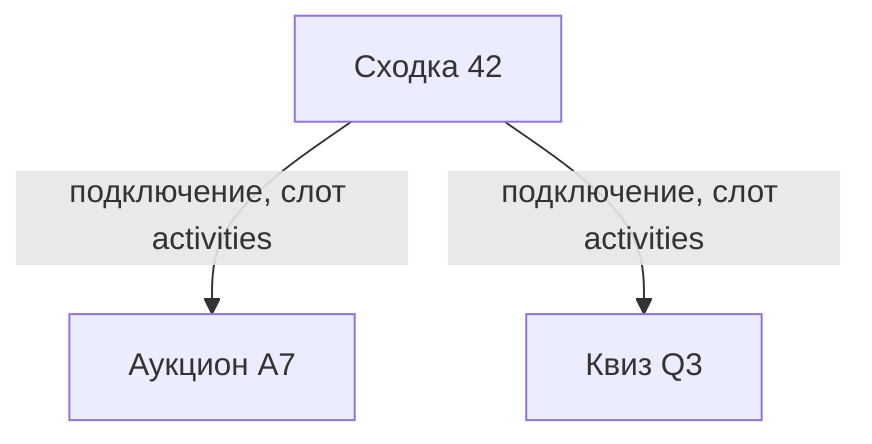
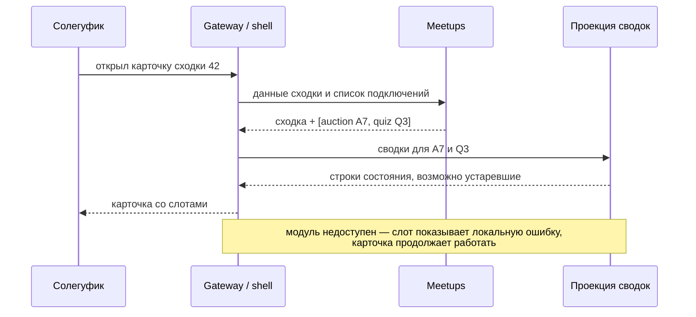
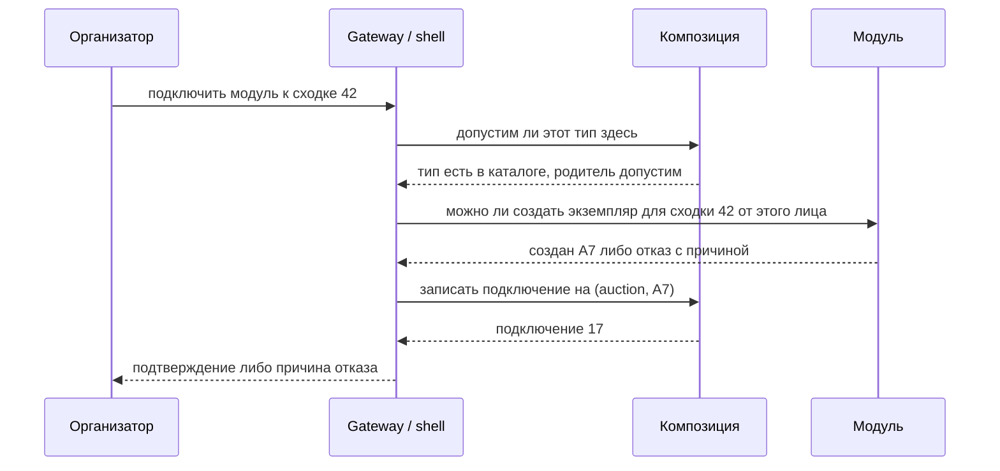

# RFC-001: Модули сходки — модель композиции, размещение и транспорт

> **Статус:** Draft
> **Автор:** владелец
> **Дата:** 2026-08-12
> **Рассмотрение:** отложено владельцем 2026-08-15 до появления первого реального модуля; MVP и первый вертикальный срез не блокирует

## Кратко

Макет Bot UI зафиксировал в карточке сходки слот расширения: место, где появляется подключённый модуль — условный аукцион, выбор фильма, плейлист, потлак-лист. Место в интерфейсе обозначено, но граница модуля не определена: неизвестно, кто владеет фактом подключения, кто рисует экран модуля, каким транспортом идут его команды и где проходит линия между платформой и доменом.

RFC собирает варианты и их цену, чтобы решение принималось до первого модуля, а не выводилось задним числом из первой реализации. Ни один вариант здесь не принят.

Документ охватывает десять связанных решений. Часть из них после принятия распадётся на отдельные ADR — RFC нужен именно потому, что решать их по отдельности нельзя: выбор в одном меняет цену остальных.

Два вопроса вынесены в соседние документы, потому что упираются в другие границы: модель самой сходки — в [RFC-002](RFC-002-meetup-publication-visibility-materials.md), механика представления бота — в [RFC-003](RFC-003-bot-presentation-rich-blocks.md). Решение 6 зависит от второго, решение 7 — от первого.

## Проблема и границы

### Что вынуждает решать сейчас

Сходка — не конечный набор возможностей. К ней со временем прикрепляются активности: торги за место, выбор фильма, общий плейлист, список «кто что берёт». Их нельзя вписать в Meetups как поля, потому что их состав заранее неизвестен и различается от сходки к сходке.

Три вещи дороже всего менять после первого модуля:

- место в карточке и роль, которая подключает, — уже зафиксированы макетом;
- владелец факта подключения — определяет схему Meetups, то есть первую же миграцию;
- контракт представления — попадает в `.proto` и далее меняется согласованно у всех потребителей.

Остальное можно уточнять итеративно.

### Что в границах RFC

- Модель композиции: как платформа узнаёт, что к сходке подключён модуль.
- Владение фактом подключения и форма записи.
- Состояния доступности модуля.
- Топология размещения: сколько процессов.
- Транспорт команд, запросов и событий между платформой и модулем.
- Контракт представления для бота и Mini App.
- Как права доезжают до модуля.
- Вложенность модулей.
- Каталог типов модулей.
- Классы компонентов: что является модулем сходки, а что не является.
- Терминология.

### Что вне границ

- Проектирование любого конкретного модуля, включая аукцион.
- Scope Mini App.
- Конкретные NATS subjects и `.proto` — они появляются после принятия решений отсюда.
- Выбор языка Meetups и модулей.
- Продуктовое решение, какие модули вообще нужны, — идеи собраны в [ideas.md](../product/ideas.md).

### Исходное состояние репозитория

| Факт | Источник | Следствие для RFC |
|---|---|---|
| Meetups и Identity не реализованы, контракты не спроектированы | [architecture/overview.md](../architecture/overview.md) | решения принимаются до кода, миграции нет |
| Транспорт выбирается по failure semantics сценария, а не по признаку read/write | [integration.md](../architecture/integration.md) | матрица транспорта должна опираться на сценарии |
| NATS JetStream принят, но consumers не durable автоматически | [ADR-003](../decisions/ADR-003-nats-jetstream-message-bus.md) | durable delivery проектируется отдельно |
| Разделение Meetup/Auction принято, допускается несколько аукционов на одну сходку | [ADR-019](../decisions/ADR-019-meetup-auction-separation-and-ulid.md) | связь «сходка — модуль» заведомо один-ко-многим |
| UUIDv7 — канонический формат идентификаторов | [ADR-020](../decisions/ADR-020-uuidv7-identifiers.md) | влияет на бюджет `callback_data` |
| ADR-016 переведён в `Historical`: роли заменены ADR-026, остальное описывает удалённый аукционный шлюз | [decisions/README.md](../decisions/README.md) | опираться на него как на действующее решение MVP нельзя |
| «Feature flags и модульность» — гипотеза с вопросом «нужен ли каталог модулей или достаточно конфигурации» | [ideas.md](../product/ideas.md) | вопрос каталога уже поставлен продуктом |
| Слот расширения и правила зафиксированы в макете | [design/bot/storyboard.html](../design/bot/README.md) | интерфейсная часть уже ограничена |
| Аукцион вне MVP | [AGENTS.md](../../AGENTS.md) | первый реальный модуль появится после MVP |

Из последнего следует важное: **в MVP модулей нет**. RFC определяет границу, а не вводит функциональность.

## Терминология

Слово `attachment` в этом проекте занято: команда `/attach` и сценарии A-11…A-13 макета описывают прикрепление Telegram-сообщения к сходке, и это видимая пользователю формулировка. Для модулей нужен другой термин.

| Понятие | Термин в документах и UI | Имя в схеме и контрактах |
|---|---|---|
| связь сходки с Telegram-сообщением | прикрепление, `/attach` | существующая терминология Meetups |
| связь сходки с модулем | подключение, привязка | `module_binding` |
| действие организатора | «Подключить» / «Отключить» | — |
| место в карточке | слот | `slot` |
| тип модуля | тип модуля | `module_type` |
| описание типа в каталоге | каталог модулей | `module_definition` |
| компонент со своим доменом, не подключаемый к сходке | сквозной сервис | — |

`connection` как имя в коде не используется: читается как сетевое соединение.

Слово «платформа» в этом документе означает shell без домена: композицию, представление, права и навигацию. Компонент со своим доменным словарём платформой не является, даже если он общий для всей системы, — см. решение 10.

## Сценарии и требования

### Наблюдаемые сценарии

| # | Сценарий | Ожидаемый исход |
|---|---|---|
| S1 | Организатор подключает модуль к сходке | модуль появляется в карточке, его состояние принадлежит модулю |
| S2 | Солегуфик открывает карточку сходки с двумя модулями | видит строку состояния каждого и кнопку перехода |
| S3 | Модуль недоступен в момент открытия карточки | карточка работает, слот показывает локальную ошибку |
| S4 | Модуль присылает уведомление | уведомление подчиняется подписке на сходку, а не собственной подписке модуля |
| S5 | Сходка отменена | модуль узнаёт об этом и сам решает, что показать; каскадного удаления нет |
| S6 | Организатор отключает модуль | данные модуля не удаляются, подключение можно вернуть |
| S7 | Новый тип модуля выкатывается не на все сходки | различимо, что выключено платформой, а что организатором |
| S8 | Солегуфик нажимает кнопку модуля в боте | ответ приходит в дедлайн Telegram, без зависшего спиннера |
| S9 | Организатор пытается подключить модуль, который здесь неприменим | отказ с причиной, подключение не создаётся |

### Требования

**Обязательные:**

- ядро не знает семантику модуля: ни одного ветвления по типу модуля в Meetups;
- у команды один логический адресат; broadcast-команд «кто-нибудь разберётся по id» нет;
- права модуля не шире прав того, кто его открыл;
- недоступность модуля не ломает карточку сходки;
- отключение модуля не удаляет его данные;
- уведомления модуля подчиняются подписке на сходку;
- ответ на нажатие кнопки укладывается в дедлайн `answerCallbackQuery`;
- адрес действия помещается в 64 байта `callback_data`.

**Осознанно не требуется в первом целевом состоянии:**

- установка модулей во время работы без развёртывания;
- сторонние авторы модулей и sandbox;
- независимая поставка UI модуля;
- вложенность модулей глубже одного уровня.

Три последних требования — самые дорогие в реализации, и ни одно из них не следует из продуктовых сценариев.

## Решения и варианты

### 1. Кто владеет фактом подключения

Связь «к сходке 42 подключён модуль» — отдельная запись: в таблице сходок одна строка на сходку, а количество модулей у сходок разное.

```text
сходки
id | название   | дата       | статус
42 | Кинопоказ  | 2026-09-05 | опубликована

подключения модулей
id | родитель     | тип модуля | цель          | видим
17 | (meetup, 42) | auction    | (auction, A7) | да
18 | (meetup, 42) | quiz       | (quiz, Q3)    | нет
```

Вопрос в том, в чьей базе лежит вторая таблица.

| Вариант | Устройство | За | Против |
|---|---|---|---|
| **1a. Meetups владеет** | таблица в БД Meetups, тип модуля — непрозрачная строка | целостность обеспечивает СУБД внешним ключом; один запрос на рендер карточки; нет висящих строк | в схеме Meetups появляется слово «модуль»; риск, что со временем туда добавят семантику |
| **1b. Отдельный компонент композиции** | таблица в БД платформенного компонента или BFF | Meetups остаётся обычным бизнес-модулем без привилегий; композиция переиспользуется для будущих контекстов, кроме сходок | ссылка на сходку живёт в другой базе: удалили сходку — остались висящие подключения, и целостность не обеспечивает никто |
| **1c. Проекция из событий** | модули публикуют факт подключения, проекция строится подписчиком | ядро не знает вообще ничего | карточка eventual consistent; нужна проекция и её восстановление; отладка сложнее |

Хранение непрозрачного `module_type` само по себе не создаёт связности: связность появляется в момент, когда в Meetups возникает ветвление вида `if module_type == 'auction'`. Это проверяемая граница, в отличие от расплывчатого «ядро не должно знать о модулях».

Вариант 1b концептуально чище, но переносит целостность из СУБД в прикладной код. Вариант 1c платит консистентностью карточки за устранение связности, которой в непрозрачной колонке и нет.

### 2. Форма записи подключения

Подвопрос первого: на что указывает строка подключения.

| Вариант | Устройство | Цена |
|---|---|---|
| **2a. Синтетический экземпляр** | платформа заводит свою сущность `M123`, модуль — свою `A7`, между ними хранится соответствие | два идентификатора одной вещи |
| **2b. Ссылка на доменную сущность** | подключение хранит `(auction, A7)`, своей сущности платформа не заводит | идентификатор один, владеет им модуль |

Вариант 2a создаёт вторую идентичность и с ней три проблемы:

- **перевод на каждом обращении.** В `callback_data` лежит либо `M123` — и тогда перед любым вызовом модуля нужен перевод в `A7`, — либо сразу `A7`, и тогда `M123` не используется нигде;
- **расхождение состояний.** Аукцион завершился у себя. Что теперь в `status` у `M123`? Либо кто-то синхронизирует его событиями, либо поле врёт. У 2b расходиться нечему: подключение хранит только «видим / скрыт» — факт, которым платформа владеет, — а «идёт / завершён / архивирован» живёт в модуле и не дублируется;
- **неопределённый порядок создания.** У 2a непонятно, кто создаётся первым и что делать, если второй шаг не выполнился. У 2b порядок задан: модуль создаёт сущность, потому что только он знает, допустимо ли это, и возвращает ссылку.

Общее правило: платформа хранит **ссылку**, а не **копию факта существования**. Проверка при проектировании любой такой таблицы — может ли эта строка соврать. Если в ней есть поле, значение которого выводится из чужих данных, то может.

Синтетическая запись оправдана ровно в одном случае: у модуля нет собственной корневой сущности, и всё его состояние — это и есть настройки при конкретной сходке. Тогда запись подключения не тень, а единственная сущность. Модель должна допускать оба случая, но не навязывать обёртку тем, у кого сущность есть.

### 3. Состояния доступности

Модуль не виден в карточке. Причин четыре, и они различаются по всем признакам.

| Причина | Кто это решил | Где живёт | Кто возвращает | Что видит пользователь |
|---|---|---|---|---|
| код не развёрнут, сервис недоступен | никто, состояние runtime | нигде, наблюдается | maintainer, деплоем | «временно недоступен, данные на месте» |
| тип модуля выключен на платформе | админ платформы | каталог | тот же админ | ничего, возможности здесь нет |
| подключение скрыто у этой сходки | организатор | строка подключения | организатор | ничего |
| доменное состояние модуля | никто, ход домена | внутри модуля | не возвращается | «аукцион завершён, победитель…» |

| Вариант | Цена |
|---|---|
| **3a. Один флаг `enabled`** | дёшево сейчас, необратимая потеря информации потом |
| **3b. Четыре источника, разведённые по владельцам** | на строке подключения остаётся только «видим / скрыт» |

Ловушка варианта 3a проявляется на втором модуле. Появляется второй тип, который ещё не развёрнут или выкатывается не всем. Состояния «тип недоступен» нет, ближайшее решение — миграция, проставляющая `enabled = false` всем подключениям этого типа. После неё **невозможно отличить**, какие подключения выключил организатор, а какие миграция; вернуть всё в `true` — значит включить модуль тем, кто его осознанно убрал. Информация уничтожена безвозвратно.

Проверочный вопрос для любого флага `enabled` / `active` / `visible`: у выключенного состояния одна причина или несколько, и кто возвращает обратно в каждом случае. Если возвращают разные люди разными действиями — это разные состояния. Отдельно: если состояние восстанавливается развёртыванием, оно вообще не хранится в базе.

### 4. Топология размещения

Здесь важно предварительное различение: **модуль — не то же самое, что процесс**. Логическая модульность и физическое развёртывание — разные оси, и объединять их не обязательно.

| Вариант | Устройство | За | Против |
|---|---|---|---|
| **4a. Модульный монолит** | Identity отдельно, Meetups и модули — модули одного backend-процесса, внутренняя шина | самая дешёвая проверка доменных границ; нет распределённых отказов | границу легко нарушить незаметно; учебная цель проекта не достигается |
| **4b. Сервис на модуль** | каждый модуль — отдельный сервис, композиция в BFF | независимая поставка и отказы | distributed tax на каждый модуль, включая тривиальные |
| **4c. Общий host модулей** | один процесс загружает встроенные модули, но у каждого свои контракты, состояние и регистрация UI | середина; вынести модуль позже дёшево | изоляция отказов слабее, чем у 4b |
| **4d. Смешанное размещение** | контракт один, размещение — свойство модуля: тяжёлый уезжает отдельно, простые живут в общем host | платится только там, где есть польза | требует, чтобы контракт был написан до первого модуля |

Аргумент за 4d: первый реальный модуль — аукцион на Scala/Pekko — и так уезжает отдельным сервисом, потому что он и есть учебная цель. Простые модули вроде плейлиста или потлак-листа не оправдывают отдельного сервиса ничем. При едином логическом контракте вызывающий код не меняется при переносе модуля между процессами.

Аргумент против 4d и за 4a: пока не существует ни Meetups, ни одного модуля, любой контракт — гипотеза, и проверить её дешевле внутри процесса.

### 5. Транспорт

Исходная формулировка «подключаем все модули к общей шине, они сами разберутся по id» должна быть отвергнута: broadcast-команда лишает систему владения, авторизации, диагностируемости и понятного результата. У команды один логический адресат. Событие — наоборот, факт для нуля или многих потребителей.

Распространённый довод «gRPC требует знания адреса, поэтому нужна шина» неточен. Subject `commands.module.auction.place_bid` — такой же адрес, как DNS-имя сервиса. Шина не устраняет знание, а переносит его с «кто» на «что», и имя subject выводится из типа модуля по соглашению. Выигрыш реален, но состоит в **маршрутизации соглашением вместо реестра**, а не в отсутствии адресации: DNS-имя точно так же выводится из типа модуля.

Решает другое. Telegram даёт жёсткий дедлайн: `answerCallbackQuery` нужно вызвать за считанные секунды, иначе у пользователя висит спиннер. Часть модульного трафика обязана быть синхронной по восприятию. NATS закрывает обе модели на одной адресации за счёт request-reply — это и есть содержательный довод в его пользу.

Предлагаемая матрица:

| Сценарий | Механизм | Failure mode, который надо принять |
|---|---|---|
| немедленный запрос или действие из UI | локальный типизированный вызов либо gRPC | timeout виден пользователю |
| синхронный вызов без знания адреса | NATS request-reply | нет responder, timeout, нет durability |
| долгая адресная операция | JetStream-команда одному владельцу | нужен статус операции и идемпотентность |
| факт для нескольких реакций | JetStream-событие | доставка и порядок проектируются отдельно |
| сводка модуля для карточки | проекция, обновляемая событием модуля | устаревание вместо отказа |

Kafka здесь ничего не добавляет: задачу маршрутизации и обнаружения она не решает лучше, а стоит существенно дороже в эксплуатации. Она станет содержательной альтернативой, только если центральной потребностью окажутся длинные replayable-потоки и stream processing. Baseline репозитория — NATS JetStream по [ADR-003](../decisions/ADR-003-nats-jetstream-message-bus.md).

Отдельно про рендер карточки. Сводка каждого модуля нужна в момент открытия карточки, то есть на горячем пути. Синхронный опрос N модулей на каждый рендер даёт fan-out и делает время открытия карточки суммой худших ответов. Дешевле, чтобы модуль публиковал свою сводку событием, а карточка читала локальную проекцию: тогда требование S3 выполняется само — вместо отказа пользователь видит устаревшую строку.

### 6. Представление

Даже когда весь трафик асинхронный, кто-то формирует текст и клавиатуру. Для бота выбор ограничен платформой: Bot API вызывает Gateway, значит модуль обязан отдать декларативное описание, а не готовый вывод.

| Вариант | Устройство | Риск |
|---|---|---|
| **6a. Общий контракт представления** | модуль возвращает описание экрана: заголовок, строки, действия с непрозрачным payload; рисует Gateway | контракт со временем станет объединением потребностей всех модулей — god object в форме схемы |
| **6b. Модуль отдаёт готовую Telegram-разметку** | Gateway — тупой транспорт | каждый модуль знает Bot API; в Mini App это переиспользовать нельзя |
| **6c. Модуль везёт собственный UI** | отдельный frontend-бандл модуля | для бота технически невозможно; для Mini App требует versioned protocol, CSP/origin policy, fallback и единый design system |

Опасность 6a не в том, что трафик идёт через Gateway — трафик безвреден. Она в росте контракта. Поэтому предлагается не «сделать универсальный контракт», а ограничение на его изменение:

> В контракт представления не попадает ни одно поле, называющее доменное понятие. Новый примитив добавляется, только если он нужен как минимум двум несвязанным модулям.

Это правило фальсифицируемо и проверяется на review, в отличие от «не связывать компоненты».

Честная цена 6a — ограниченная выразительность. Отсюда естественное разделение, уже заложенное макетом:

- **бот** — общий знаменатель: строка состояния, кнопки, простые формы. Рисует общий shell по декларативной схеме;
- **Mini App** — холст модуля: для простых карточек та же схема, для богатых сценариев вроде консоли аукциониста возможен отдельный frontend модуля.

Общий shell в любом случае владеет навигацией, темой, контекстом пользователя и границей ошибок. Модуль владеет содержанием экрана и семантикой действий.

**Что изменилось после выноса Mini App за границы MVP** (решение владельца 2026-08-15, см. [service brief](../services/mini-app.md)). Разделение «бот — общий знаменатель, Mini App — холст модуля» перестаёт работать как аргумент: клиент остался один. Пока это так, декларативный контракт представления имеет единственного потребителя — тот же Gateway, который по нему и рисует, — то есть не окупается. Правило роста контракта от этого не меняется, но сам контракт откладывается до появления второго клиента либо первого модуля, смотря что случится раньше.

**Внешняя зависимость этого решения.** Формулировки выше исходят из того, что бот отправляет плоский текст с inline-клавиатурой, и потому вклад модуля в карточку — строка состояния и кнопка. Bot API 10.1 и 10.2 добавили структурные блоки, при которых модуль может отдавать секцию прямо в общий документ. Это меняет объём контракта, а не правило его роста. Варианты и гейт проверки — в [RFC-003](RFC-003-bot-presentation-rich-blocks.md); до его результата формулировка «строка и действия» является нижней границей, а не окончательной формой.

**Ограничение, которое надо учесть в контракте действий:** `callback_data` — 64 байта. В них должны уместиться тип модуля, ссылка на сущность и действие, а UUIDv7 по [ADR-020](../decisions/ADR-020-uuidv7-identifiers.md) в каноническом виде занимает 36 символов. Влезает, но запаса нет. Значит, форму payload модуль не выбирает произвольно: бюджет делится контрактом либо вводится короткий токен на сообщение. Обнаруженное поздно, это ломает уже написанные модули.

### 7. Как права доезжают до модуля

| Вариант | Устройство | Цена |
|---|---|---|
| **7a. Модуль сам спрашивает** | модуль обращается к Identity и Meetups за правами вызывающего | каждый новый модуль заводит две зависимости; fan-out на каждый клик |
| **7b. Права едут в сообщении** | Gateway один раз разрешает вызывающего и прикладывает подтверждённый контекст: кто, какие права на эту сходку, до какого времени | модуль обязан доверять источнику контекста |

Вариант 7b прямо реализует правило макета «права модуля не шире прав открывшего»: модуль права не выводит, он их предъявляет. Ограничение доверия приемлемо внутри одного контура и перестаёт быть приемлемым при появлении сторонних авторов модулей — что вынесено за границы RFC.

Тонкость: общие системные роли принадлежат Identity, а роль организатора **конкретной** сходки — Meetups, согласно [брифу Meetups](../services/meetups.md). Значит контекст собирается из двух источников до отправки команды модулю.

Вторая тонкость появляется, если сходка может быть адресована не всему сообществу. Тогда в контексте обязан ехать не только «какие права на эту сходку», но и сам факт «вправе её видеть»: иначе модуль закрытой сходки становится обходным путём к её существованию.

[RFC-002 принят](RFC-002-meetup-publication-visibility-materials.md) с вариантом 7a: проверку выполняет Meetups, Gateway передаёт установленную личность и общие роли, но не готовое разрешение. Ограниченной аудитории в MVP нет, однако скрытые сходки существуют с первого дня, поэтому правило «ни один путь чтения не обходит проверку» действует уже сейчас. Вариант 7c с подтверждённым контекстом становится нужен ровно тогда, когда появится первый модуль и проверять придётся вне Meetups. При выборе 1a проверка достаётся бесплатно вместе с чтением подключений, а при 1b таблица подключений лежит вне Meetups и о видимости ничего не знает.

### 8. Вложенность модулей

| Вариант | Устройство | Цена |
|---|---|---|
| **8a. Плоско** | модуль подключается только к сходке | при появлении сценария вложенности меняется контракт |
| **8b. Полиморфный родитель** | подключение указывает на `(тип, id)`, а не на `meetup_id`; фактически используется только сходка | одно поле, ноль семантики |
| **8c. Полноценное дерево** | модуль подключается к модулю, каскады и транзитивные права | каскад жизненного цикла, вывод прав, многоуровневая навигация в боте с единственной кнопкой «назад» |

Сценария, где модуль агрегирует модуль, сейчас нет ни одного. Вариант 8b даёт возможность без реализации: дерево становится описанием композиции экземпляров, а не сетевой топологией и не зависимостью сервисов.

Второй, независимый потребитель того же примитива нашёлся в решении 10: награда сквозного сервиса должна указать повод — сходку, подключение модуля, тип модуля или ничего. Это существенно усиливает 8b. Само правило роста контракта требует, чтобы новый примитив был нужен как минимум двум несвязанным потребителям; до решения 10 у `context_ref` был один потребитель и гипотетическая вложенность, то есть обоснование не проходило собственную проверку документа.

При выборе 8b нужно зафиксировать, что родитель задаёт контекст и место отображения, но **не владеет жизненным циклом ребёнка**. Отсюда сценарий S5: отмена сходки не удаляет модуль каскадно — модуль подписан на факты родителя и сам решает, что показать. Отсутствие каскада это не отсутствие связи, а перенос ответственности на модуль, и это должно быть записано как обязанность в контракте.

### 9. Каталог типов модулей

| Вариант | Устройство | Когда оправдан |
|---|---|---|
| **9a. Регистрация в коде** | типизированный список известных типов в composition root | код модулей всегда поставляется с платформой |
| **9b. Таблица в БД** | типы и их доступность настраиваются без развёртывания | нужно включать типы по окружениям без релиза |
| **9c. Runtime registry** | модули регистрируются при старте, версии согласуются | независимый жизненный цикл модулей, сторонние авторы |

Для маршрутизации реестр не нужен: имя subject или DNS-имя выводится из типа модуля соглашением. Каталог нужен только экрану подключения — ответить, какие типы вообще существуют.

Вопрос уже поставлен продуктом: [ideas.md](../product/ideas.md) содержит гипотезу «Feature flags и модульность» с открытым вопросом, нужен ли продуктовый каталог модулей или достаточно конфигурации разработки. Ответ на него — это и есть выбор между 9a и 9b.

Отдельно: размещение модуля (локальный вызов или удалённый) не должно храниться в каталоге вместе с описанием типа — оно меняется между окружениями и относится к конфигурации, а не к описанию модуля.

### 10. Классы компонентов

Решения 1–9 неявно предполагают два класса: shell без домена и модуль, подключаемый к сходке. Первый же разбор конкретной возможности показывает, что классов три.

Проверка на ачивках. Награда не занимает слот в карточке, не подключается к сходке и не имеет строки подключения — подключать её не к чему. При этом у неё есть собственный домен: каталог ачивок, критерий выдачи, факт награждения. Ни один из двух классов ей не подходит.

| Класс | Есть свой домен | Подключается к сходке | Занимает слот | Пример |
|---|---|---|---|---|
| shell | нет | — | владеет слотами | Gateway, композиция, контракт представления |
| модуль сходки | да | да | да | аукцион, квиз, потлак-лист |
| сквозной сервис | да | нет | нет | Notifications, ачивки |

Существование третьего класса не гипотеза: Notifications уже существует в репозитории и уже в него попадает.

| Вариант | Устройство | За | Против |
|---|---|---|---|
| **10a. Два класса** | всё, что не shell, — модуль; ачивки получают подключение к чему-нибудь | одна модель, один контракт | синтетическое подключение ради модели — это [вариант 2a](#2-форма-записи-подключения), уже отвергнутый как вторая идентичность |
| **10b. Три класса** | сквозной сервис не имеет подключения и подписан на события | честно описывает Notifications и ачивки | в системе два разных контракта расширения вместо одного |
| **10c. Считать сквозные сервисы частью платформы** | ачивки и Notifications объявляются платформенными | не нужен третий класс | их доменный словарь попадает в контракт композиции — тот самый god object, против которого написано решение 6 |

Вариант 10c соблазнителен формулировкой «ачивки — сервис платформы», но платформа в этом документе определена через **отсутствие** домена. У ачивок домен есть, и объявление их платформой означает, что слова «ачивка», «награда» и «критерий» рано или поздно окажутся в контракте представления.

Отдельный вопрос внутри 10b — кто владеет критерием выдачи.

| Вариант | Цена |
|---|---|
| **Критерий в сквозном сервисе** | сервис обязан понимать событийный словарь каждого модуля; каждый новый модуль дописывает код в ачивки |
| **Критерий в модуле, сервис владеет каталогом, реестром и показом** | сервис не знает ни одного доменного понятия: он записывает «модуль `auction` наградил пользователя U ачивкой A по поводу `(meetup, M7)`» |

Вторая схема симметрична правилу роста контракта представления и ломается на одном классе наград — межмодульных вроде «года в соли». Это аргумент не против схемы, а за то, что такие сводки являются отчётом, а не ачивкой.

Область действия награды при этом описывается уже существующим примитивом: `(meetup, M7)`, `(module_binding, B12)`, `module_type = auction` либо ничего. Внутри «привязана к модулю» прячется развилка — ссылка на конкретное подключение или на тип модуля. Хранятся одинаково, считаются по-разному: первое — награда за событие, второе требует агрегата по всем экземплярам, которого у модуля может не быть.

## Как это выглядит целиком

Композиция экземпляров при выборе 8b:



Дерево описывает композицию экземпляров, а не зависимость сервисов.

Открытие карточки сходки при выборе 1a + проекции сводок:



Подключение модуля с проверкой на стороне модуля:



Ключевая деталь: проверку допустимости делает **модуль**, а не платформа. Платформа не знает, при каких условиях аукцион может существовать. Это пятая поверхность контракта, которую легко упустить: без неё таблица подключений наполняется ссылками в никуда.

Нажатие кнопки модуля в боте:

```mermaid
sequenceDiagram
    participant U as Солегуфик
    participant G as Gateway
    participant Mod as Модуль
    U->>G: callback_data "тип:сущность:действие"
    G->>G: разрешить пользователя, собрать права на сходку
    G->>Mod: команда с подтверждённым контекстом прав
    Mod-->>G: описание экрана или результат действия
    G-->>U: answerCallbackQuery и обновление сообщения
    Note over G,Mod: адресат один; ответ должен уложиться<br/>в дедлайн Telegram
```

## Предложение

Предпочтения ниже — исходная позиция для обсуждения, а не принятое решение.

| # | Решение | Предпочтение | Главная причина |
|---|---|---|---|
| 1 | владелец факта подключения | **1a**, Meetups с непрозрачной колонкой | целостность даёт СУБД; непрозрачный тип не создаёт связности |
| 2 | форма записи | **2b**, ссылка на доменную сущность | нет второй идентичности и нечему рассинхронизироваться |
| 3 | состояния доступности | **3b**, четыре источника | склейка уничтожает информацию необратимо |
| 4 | размещение | **4a** сейчас, контракт под **4d** | нет ни Meetups, ни модулей; проверять границу дешевле внутри процесса |
| 5 | транспорт | матрица из раздела 5, broadcast-команды запрещены | у команды один адресат; NATS закрывает обе модели |
| 6 | представление | **6a** с правилом роста контракта; Mini App допускает **6c** позже | для бота альтернатив нет; правило удерживает контракт от разрастания |
| 7 | права | **7b**, подтверждённый контекст в сообщении | иначе каждый модуль зависит от Identity и Meetups |
| 8 | вложенность | **8b**, полиморфный родитель без реализации дерева | сценария нет, обобщение стоит одно поле |
| 9 | каталог | **9a**, регистрация в коде | код модулей поставляется с платформой |
| 10 | классы компонентов | **10b**, три класса; критерий выдачи у модуля | сквозной сервис не имеет подключения, но и не лишён домена |

Расхождение между 4a и 4d намеренное: логический контракт проектируется так, чтобы вынос модуля в отдельный процесс не менял вызывающий код, но само вынесение делается тогда, когда для него появится причина, — первой такой причиной будет аукцион.

Минимальный набор понятий, вытекающий из предпочтений:

```text
module_type      — какой тип модуля существует
context_ref      — типизированная ссылка (тип, id)
module_binding   — какая сущность подключена к какому родителю, в каком слоте, видима ли
ui_contribution  — как shell её показывает
```

Универсального контракта вида `ExecuteModuleCommand(payload)` быть не должно: он уничтожает типизацию и превращает платформу в динамический RPC-фреймворк. Общими остаются только обнаружение, подключение, права и протокол представления; доменные команды, состояние и события у каждого модуля свои.

## Что станет сложнее

- **Появляется вторая сущность на границе.** Даже при 1a таблица подключений — новая ответственность со своими правилами удаления и восстановления.
- **Правило роста контракта требует дисциплины ревью.** Оно не проверяется автоматически: нужен человек, который откажет первому же модулю, попросившему специфичное поле.
- **Проекция сводок вводит устаревание.** Пользователь может увидеть строку, не соответствующую состоянию модуля. Нужно решить допустимую задержку и способ принудительного обновления.
- **Контекст прав в сообщении вводит доверие.** Модуль не проверяет права заново, значит компрометация Gateway даёт больше, чем раньше. Требуется срок жизни контекста и понятная граница доверия.
- **Разделение четырёх состояний доступности удорожает интерфейс.** Четыре разных ответа пользователю, четыре пути диагностики.
- **Бюджет `callback_data` становится общим ресурсом.** Его придётся делить между платформой и модулем явным правилом.
- **Сквозной сервис нельзя выключить у одной сходки.** У модуля выключение есть штатно: организатор его не подключает. У сквозного сервиса такого рычага нет по построению — он либо есть в системе, либо нет. Для ачивок это означает, что guardrail «не должны влиять на доступ и становиться важнее живого общения» из [ideas.md](../product/ideas.md) перестаёт выполняться сам собой и требует отдельного продуктового механизма: opt-out пользователя, приватность витрины наград или что-то ещё.
- **Два контракта расширения вместо одного.** Подключаемый модуль и подписанный на события сквозной сервис расширяют систему по-разному, и оба нужно спроектировать и версионировать.
- **Уведомления пересекают границу планов.** Чтобы уведомление модуля подчинялось подписке на сходку, кто-то должен связать событие модуля с родительским контекстом. Либо это делает сам модуль в своём intent, либо Notifications читает проекцию подключений — второе размывает разделение планов.

## Открытые вопросы

Требуют решения владельца до принятия RFC:

1. Кто владеет фактом подключения — 1a, 1b или 1c. Блокирует схему Meetups и не удешевляется от ожидания.
2. Кто подключает модуль: организатор из разрешённого списка, организатор без ограничений или организатор с подтверждением администратора. Общее правило прав принято владельцем и записано в [product/overview.md](../product/overview.md): администратор изменяет любую сходку, организатор — только свою. Открытым остаётся, является ли подключение модуля обычным изменением сходки или требует отдельного полномочия.
3. Может ли модуль существовать вне сходки — модуль сообщества как отдельный контекст.
4. Допустимая задержка сводки в карточке и нужен ли принудительный refresh.
5. Является ли независимая поставка UI модуля архитектурным требованием или просто желательной степенью свободы. От этого зависит, нужен ли versioned UI protocol.
6. Кто отвечает за связь события модуля с подпиской на сходку — модуль или Notifications.
7. Срок жизни и форма подтверждённого контекста прав.
8. Нужен ли продуктовый каталог модулей или достаточно конфигурации разработки — вопрос уже сформулирован в [ideas.md](../product/ideas.md).
9. Два класса расширения или три — решение 10. Влияет на то, где окажутся Notifications и будущие ачивки.
10. Кто владеет критерием выдачи награды — сквозной сервис или модуль. Определяет, станет ли сервис ачивок потребителем словаря каждого модуля.
11. Чем ограничен вклад модуля в карточку — зависит от [RFC-003](RFC-003-bot-presentation-rich-blocks.md) и до его проверки не решается.

Требует проверки, а не решения:

12. Как слот ведёт себя в групповом контексте — вариант с невидимыми командами в группе из макета. Модуль в группе имеет другую модель прав и другой жизненный цикл сообщения; ветка не проработана.

## Результирующие артефакты

- **ADR:** нужен, вероятно несколько. Кандидаты: контракт расширения и правило роста контракта представления; владелец факта подключения; разделение перегруженного [ADR-016](../decisions/ADR-016-rbac-action-pattern-and-transport.md) в части транспорта. Создаются после решения владельца, по одному решению на ADR.
- **Standard:** вероятно нужен — терминология и правило разделения состояний доступности являются проверяемыми правилами реализации.
- **Обновление документов:** [services/meetups.md](../services/meetups.md) в части владения подключениями, [architecture/integration.md](../architecture/integration.md) в части матрицы транспорта, [design/bot/storyboard.html](../design/bot/README.md) — открытые вопросы раздела «Модули сходки» получают ссылку на этот RFC.
- **Задачи Linear:** после принятия.
- **`contracts/proto/`:** не трогается до принятия решений 1, 2 и 6.
