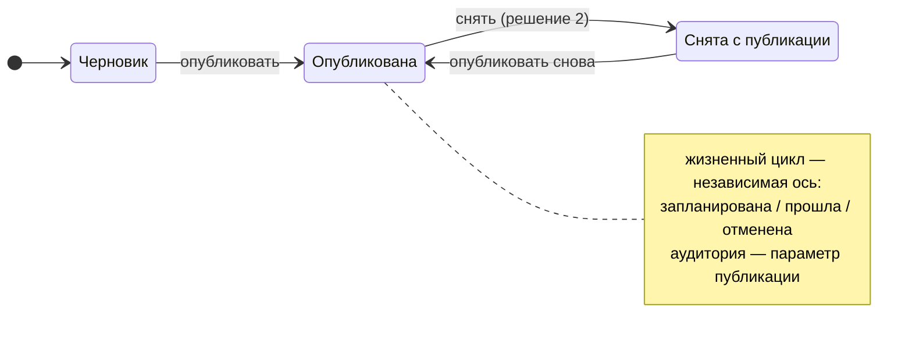
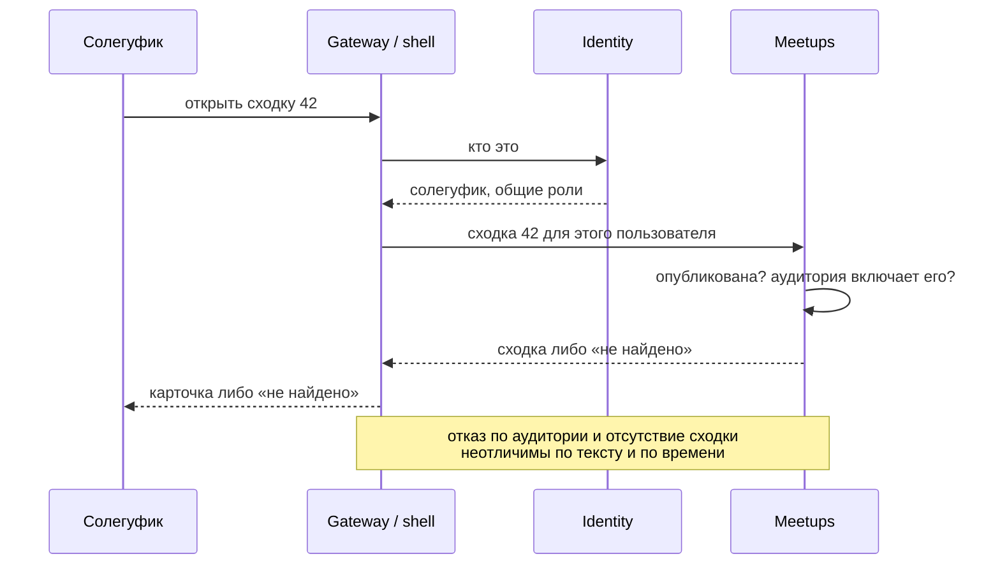

# RFC-002: Модель сходки — публикация, видимость и материалы

> **Статус:** Accepted
> **Автор:** владелец
> **Дата:** 2026-08-12
> **Решение:** принято владельцем 2026-08-16, см. раздел [«Решения владельца»](#решения-владельца)

## Кратко

Три бизнес-требования владельца упираются в одну и ту же незаполненную часть модели сходки: у сходки есть черновик и публикация, публикация может быть адресована не всему сообществу, а к сходке прикладываются афиши. Все три меняют схему Meetups и правила чтения, поэтому решаются вместе.

RFC собирает варианты и их цену. Ни один вариант здесь не принят.

Смежные документы: [RFC-001](RFC-001-meetup-modules-topology.md) — композиция модулей, [RFC-003](RFC-003-bot-presentation-rich-blocks.md) — чем карточка рисуется.

## Проблема и границы

### Что вынуждает решать сейчас

[product/overview.md](../product/overview.md) оставляет состояния сходки и допустимые переходы открытым вопросом, макет держит открытым вопрос «существует ли черновик как состояние», а бриф Meetups не описывает правила видимости. При этом первая же миграция Meetups зафиксирует и число осей состояния, и наличие аудитории.

Ошибка здесь необратима асимметрично. Добавить поле в схему дёшево. Разделить один enum на две оси задним числом — значит потерять информацию: если публикация и отмена жили в одном поле, то после разделения нельзя восстановить, какая именно отменённая сходка была до этого опубликована.

### Что в границах RFC

- Оси состояния сходки и их владельцы.
- Существование и семантика черновика.
- Как солегуфик узнаёт о новой опубликованной сходке.
- Ограниченная аудитория: чем задаётся, кто проверяет, как не утекает.
- Постеры: отдельный атрибут, материал или ссылка.
- Влияние видимости на модули, уведомления и прикреплённые материалы.

### Что вне границ

- Полный минимальный набор атрибутов сходки — отдельный продуктовый вопрос.
- Чем карточка рисуется в Telegram — [RFC-003](RFC-003-bot-presentation-rich-blocks.md).
- Модель подписок и категорий уведомлений — требования Notifications.
- Модерация контента сообщества как общий механизм.
- Роли и их назначение — зафиксированы в [product/overview.md](../product/overview.md).

### Исходное состояние репозитория

| Факт | Источник | Следствие для RFC |
|---|---|---|
| Публикация отделена от жизненного цикла как требование | [product/overview.md](../product/overview.md) | ось публикации существует, вопрос в её форме |
| Состояния и переходы — открытый продуктовый вопрос | [product/overview.md](../product/overview.md) | RFC не противоречит принятому, а заполняет пустое место |
| Макет держит открытым «существует ли черновик» и где он хранится | [design/bot/storyboard.html](../design/bot/README.md) | ответ меняет кадры A-03…A-07 |
| Meetups владеет публикацией и отменой | [services/meetups.md](../services/meetups.md) | ось публикации принадлежит Meetups, не Gateway |
| Роль организатора конкретной сходки принадлежит Meetups, общие роли — Identity | [services/meetups.md](../services/meetups.md) | аудитория может оказаться на границе двух сервисов |
| Подписка в MVP оформляется на конкретную сходку | [product/overview.md](../product/overview.md) | уведомление о новой сходке в эту модель не помещается |
| Бот проектируется как не имеющий доступа к произвольным сообщениям чата | [product/overview.md](../product/overview.md) | вариант аудитории «по членству в чате» упирается в права бота |
| Аукцион вне MVP, модулей в MVP нет | [AGENTS.md](../../AGENTS.md) | взаимодействие видимости и модулей проектируется впрок |

## Сценарии и требования

| # | Сценарий | Ожидаемый исход |
|---|---|---|
| S1 | Администратор создал сходку и не закончил заполнение | сходка не видна никому, кроме него |
| S2 | Администратор опубликовал сходку | сходка появляется у солегуфиков; шум в общем чате возникает только по явному действию |
| S3 | Опубликованную сходку нужно временно убрать | различимо, снята ли она с публикации или отменена |
| S4 | Сходка отменена | она остаётся видимой тем, кто её видел, со статусом «отменена» |
| S5 | Солегуфик открывает список | видит только те сходки, которые ему адресованы |
| S6 | Посторонний получил deep link на закрытую сходку | ответ не отличается от ответа на несуществующую сходку |
| S7 | Организатор прикладывает афишу | она видна в карточке, а не только ссылкой |
| S8 | Участник прикладывает свою неофициальную афишу | различимо, чья она; официальная не теряется среди неофициальных |
| S9 | К закрытой сходке подключён модуль | модуль недоступен тем, кому недоступна сама сходка |
| S10 | Сходка снята с публикации, у неё были подписчики | подписки не теряются, уведомления не рассылаются посторонним |

**Обязательные требования:**

- черновик не наблюдаем никем, кроме автора, ни через список, ни через ссылку, ни через уведомление;
- различимы «снята с публикации» и «отменена»;
- отсутствие доступа и отсутствие сходки неотличимы для того, у кого нет доступа;
- ни один путь чтения не обходит проверку аудитории, включая модули и уведомления;
- материалы закрытой сходки не становятся доступны по прямой ссылке.

**Осознанно не требуется:**

- иерархия аудиторий, наследование и вложенные группы;
- приглашения и запросы доступа;
- модерация неофициальных материалов как отдельный workflow;
- аудит того, кто и когда видел закрытую сходку.

## Решения и варианты

### 1. Сколько осей у состояния сходки

```text
жизненный цикл   запланирована → прошла | отменена
публикация       черновик → опубликована → (снята с публикации?)
аудитория        параметр опубликованного состояния, а не третья ось
```

| Вариант | Устройство | За | Против |
|---|---|---|---|
| **1a. Один enum** | `Draft, Published, Cancelled, Finished` | одно поле, простые запросы | снятие публикации и отмена неразличимы; «отменённый черновик» невыразим; добавление любого нового состояния комбинаторно взрывает enum |
| **1b. Две оси** | публикация и жизненный цикл — отдельные поля | выразимо каждое сочетание; у каждой оси свой владелец и свои переходы | больше состояний в UI, часть из них бессмысленна и требует запрета инвариантом |
| **1c. Две оси плюс явная ось аудитории** | аудитория — третье поле состояния | симметрично | аудитория не имеет собственных переходов: она не «состояние», а параметр |

Аудиторию правильнее считать параметром опубликованного состояния: у черновика её нет, у опубликованной она всегда есть, по умолчанию — всё сообщество. Тогда 1c сводится к 1b с дополнительным атрибутом, и отдельная ось не нужна.

Проверочный вопрос тот же, что в [решении 3 RFC-001](RFC-001-meetup-modules-topology.md): у состояния «не видна» одна причина или несколько, и кто возвращает обратно в каждом случае. Черновик возвращает автор публикацией, отмену не возвращает никто, снятие с публикации возвращает организатор. Разные владельцы — разные поля.

### 2. Существует ли снятие публикации

| Вариант | Цена |
|---|---|
| **2a. Публикация необратима** | проще инварианты; ошибку публикации исправить нечем, кроме отмены — а отмена означает другое |
| **2b. Снятие публикации есть** | ошибка исправима | у тех, кто уже видел сходку и подписался, она исчезает: нужно решить, что происходит с подписками и уже отправленными уведомлениями |
| **2c. Снятия нет, но есть окно правки** | компромисс: снять можно, пока никто не подписался | правило зависит от наблюдаемого поведения других людей, то есть недетерминированно для организатора |

Ключевая деталь варианта 2b: исчезновение сходки у пользователя наблюдаемо и выглядит как сбой. Требуется либо явное сообщение, либо запрет снятия после первого уведомления.

### 3. Где живёт черновик

Вопрос уже стоит в макете и является вопросом владения данными, а не интерфейса.

| Вариант | Устройство | За | Против |
|---|---|---|---|
| **3a. Meetups хранит черновик** | незаполненная сходка — обычная строка со статусом «черновик» | переживает перезапуск Gateway; можно вернуться и дозаполнить; один владелец данных | в Meetups появляются заведомо неполные записи, инварианты обязаны допускать пустые обязательные поля |
| **3b. Черновик — диалоговое состояние Gateway** | сходка создаётся в Meetups только в момент публикации | Meetups всегда содержит валидные сходки | черновик теряется при перезапуске; нельзя вернуться позже; логика заполнения уезжает в Gateway |
| **3c. Черновик в Meetups, но отдельным типом** | `meetup_draft` и `meetup` — разные сущности | инварианты чистые у обеих | переход между ними — создание новой сущности с новым идентификатором, ломающим ссылки |

Вариант 3a требует ответа на неприятный вопрос: обязательные атрибуты сходки обязательны в черновике или только при публикации. Наиболее живучий ответ — валидация на переходе, а не на записи.

### 4. Как узнают о новой опубликованной сходке

| Вариант | Устройство | За | Против |
|---|---|---|---|
| **4a. Никак, солегуфик смотрит список сам** | публикация — тихое событие | ноль новых механик; максимальная тишина | новую сходку легко пропустить, что и есть исходная проблема продукта |
| **4b. Глобальная подписка солегуфика** | пользователь один раз включает «сообщать о новых сходках» | управляется пользователем, соответствует принципу | новый scope подписки: в MVP подписка оформляется на конкретную сходку, а тут её нужно оформить до того, как сходка появилась |
| **4c. Флаг организатора при публикации** | «уведомить всех» / «уведомить интересующихся» | контроль у того, кто знает важность события | управление шумом переходит от получателя к отправителю, что противоречит принципу управляемости уведомлений |
| **4d. Тихое появление плюс ручной анонс** | бот молчит, организатор пишет анонс в чате сам | ноль новых механик, ноль риска шума | продукт не знает, был ли анонс; анонс не связан со сходкой автоматически |

Варианты 4b и 4c не исключают друг друга, но их пересечение требует правила приоритета: что происходит, когда организатор жмёт «уведомить всех», а солегуфик глобально отписан. Единственный ответ, совместимый с принципом продукта, — выигрывает отписка, и тогда «уведомить всех» означает «уведомить всех подписанных», то есть флаг слабее, чем звучит.

Вариант 4d стоит отдельного внимания: он не требует ничего, кроме уже существующего механизма прикрепления сообщений, и при этом закрывает сценарий. Его слабость не в механике, а в том, что продукт остаётся не в курсе факта анонса.

### 5. Чем задаётся ограниченная аудитория

| Вариант | Устройство | За | Против |
|---|---|---|---|
| **5a. Членство в отдельном Telegram-чате** | аудитория = участники чата X | переиспользует то, что уже существует социально; ноль новых сущностей; список ведут сами люди | боту нужен доступ к составу того чата, что упирается в принцип минимальных прав; проверка членства на каждое чтение либо кэш с устареванием; чат может исчезнуть, аудитория вместе с ним |
| **5b. Явный список солегуфиков** | организатор перечисляет людей | полный контроль, ничего лишнего не требуется от Telegram | список ведётся вручную для каждой сходки; не переиспользуется; растёт линейно |
| **5c. Именованная группа в продукте** | «настольщики» как сущность, сходка адресуется группе | переиспользуется между сходками; список ведётся один раз | новая сущность со своим жизненным циклом, правами на управление и вопросом, кто в неё добавляет |
| **5d. Признак на пользователе** | тег или интерес, сходка адресуется тегу | дёшево, ложится на «расширенный профиль» из [ideas.md](../product/ideas.md) | тег описывает интерес, а не состав компании; «эти конкретные восемь человек» не выражается |

Существующее решение — отдельный чат — не является плохим: оно работает и ничего не стоит. Требование расширяемости («мб это можно будет расширять и не делать отдельные чаты») — это гипотеза о будущем, а не наблюдаемая проблема. Вариант 5a интересен именно тем, что он мост: аудитория остаётся там, где она уже есть, а продукт лишь читает её.

### 6. Обнаружимость закрытой сходки

| Вариант | Цена |
|---|---|
| **6a. Различать «нет доступа» и «не найдено»** | честная диагностика; существование закрытой сходки утекает любому, кто угадал ссылку |
| **6b. Единый ответ «не найдено»** | ничего не утекает; организатору сложнее понять, ошибся он ссылкой или правами |

Утечка здесь не абстрактная. Deep link по [ADR-020](../decisions/ADR-020-uuidv7-identifiers.md) содержит идентификатор, а сам факт «такая сходка существует, но вам нельзя» в маленьком сообществе означает «вас не позвали». Это продуктовая, а не только техническая цена.

Одинаковый ответ должен быть одинаковым и по времени: если проверка доступа выполняется после загрузки сходки, разница в задержке различает случаи не хуже текста.

### 7. Кто проверяет аудиторию

| Вариант | Устройство | За | Против |
|---|---|---|---|
| **7a. Meetups на каждом чтении** | ни один ответ не покидает Meetups без проверки | одно место, обойти нельзя | Meetups обязан знать состав аудитории, а при варианте 5a — обращаться к Telegram |
| **7b. Gateway фильтрует** | Meetups отдаёт всё, отбор в shell | Meetups проще | каждый новый путь чтения обязан не забыть фильтр; модуль, обращающийся к Meetups напрямую, обходит его |
| **7c. Право едет в подтверждённом контексте** | Gateway разрешает доступ один раз и прикладывает факт «видит сходку 42» | согласовано с [решением 7 RFC-001](RFC-001-meetup-modules-topology.md); модуль получает готовый факт | контекст становится шире и живёт дольше; отзыв доступа не мгновенный |

Вариант 7c — единственный, который естественно распространяется на модули: модуль не спрашивает про аудиторию, он получает подтверждение вместе с командой. Но он же требует явно записать срок жизни контекста, иначе исключённый из аудитории человек сохраняет доступ до истечения.

### 8. Постеры

Требование распадается на два независимых вопроса. Первый — чем постер является в модели.

| Вариант | Устройство | За | Против |
|---|---|---|---|
| **8a. Отдельный атрибут сходки** | список постеров с автором, порядком и признаком официальности | видно в карточке; порядок и авторство выражены; официальный не теряется | новая сущность; появляется загрузка файлов, а с ней хранение, объём и модерация |
| **8b. Категория прикреплённого материала** | постер — прикреплённое сообщение с категорией | переиспользует существующий механизм и его privacy-модель; ноль нового хранения | постер живёт в чате и исчезает вместе с оригиналом; порядок и «официальность» приходится выражать категорией |
| **8c. Только один официальный постер** | одно поле | минимальная цена | не покрывает неофициальные афиши, то есть половину требования |

Второй вопрос — где лежит изображение.

| Вариант | За | Против |
|---|---|---|
| `file_id` Telegram | ничего не хранится у нас; privacy by design соблюдается сам собой | идентификатор привязан к боту; вне Telegram не показать, то есть Mini App и любой веб-клиент остаются без картинки |
| Публичный URL в своём хранилище | работает везде, включая превью ссылки | **прямо конфликтует с решением 5**: постер закрытой сходки становится доступен любому по ссылке |
| Своё хранилище с проверкой доступа | конфликта нет | нужен свой файловый сервис, авторизация на каждый запрос картинки, кэширование |

Конфликт URL и закрытой сходки — не деталь реализации, а развилка, которая может определить выбор в решении 8: при варианте 8b с `file_id` она не возникает вовсе.

### 9. Что видимость делает с остальной системой

Не отдельное решение, а список последствий, который должен быть принят вместе с решением 5.

| Область | Последствие |
|---|---|
| Список сходок | перестаёт быть общим для всех: кэш и любая общая проекция становятся per-user либо перестают существовать |
| Общий живой тикер и закреп | для закрытых сходок невозможны в принципе — сообщение в общем чате видно всем |
| Уведомления | подписчик мог быть в аудитории на момент подписки и выйти из неё; проверка нужна на отправке, а не только на подписке |
| Модули | модуль закрытой сходки наследует её аудиторию; при [решении 1a RFC-001](RFC-001-meetup-modules-topology.md) таблица подключений лежит в Meetups и проверка достаётся бесплатно, при 1b — нет |
| Прикреплённые сообщения | ссылка `t.me/c/...` и так открывается только участником чата, но подпись и факт связи хранятся у нас и должны фильтроваться |
| Постеры | см. решение 8: способ хранения изображения определяет, возможна ли утечка |

## Как это выглядит целиком

Две оси состояния:



Чтение сходки с проверкой аудитории при выборе 7c:



## Предложение

Предпочтения ниже — исходная позиция для обсуждения, а не принятое решение.

| # | Решение | Предпочтение | Главная причина |
|---|---|---|---|
| 1 | оси состояния | **1b**, две оси, аудитория как параметр | разные владельцы и разные переходы — разные поля |
| 2 | снятие публикации | **2b**, но запрещённое после первого уведомления | ошибка исправима, наблюдаемое исчезновение ограничено |
| 3 | где черновик | **3a**, Meetups с валидацией на переходе | черновик переживает перезапуск, владелец данных один |
| 4 | узнать о новой сходке | **4d** сейчас, **4b** как следующий шаг | ноль механик закрывает сценарий; глобальная подписка добавляется, когда подтвердится потребность |
| 5 | аудитория | ни один вариант не предлагается | требование основано на гипотезе о будущем, а не на наблюдаемой проблеме |
| 6 | обнаружимость | **6b**, единый ответ | в маленьком сообществе утечка факта — социальная, а не техническая |
| 7 | кто проверяет | **7a** сейчас, **7c** при появлении модулей | пока модулей нет, единственная точка проверки дешевле и надёжнее |
| 8 | постеры | **8b** с `file_id` | закрывает требование без файлового хранилища и без конфликта с закрытыми сходками |

Отдельно про решение 5: воздержание здесь осознанное. Отдельный чат уже решает задачу, а любой из четырёх вариантов вводит либо новую сущность, либо новые права бота. Разумный порядок — дождаться второго случая, когда отдельный чат окажется неудобен, и только тогда выбирать.

## Решения владельца

Принято 16 августа 2026 года. Архитектурная часть вынесена в [ADR-022](../decisions/ADR-022-meetup-state-axes-and-visibility.md), формат идентификаторов — в [ADR-023](../decisions/ADR-023-meetup-public-number.md).

| # | Принято | Отвергнуто | Причина |
|---|---|---|---|
| 0 | **Отложенная публикация есть.** Момент публикации задаётся полем; «запланирована публикация» выводится из непустого поля и состоянием не является | отдельное состояние `publish_scheduled` | состояние, выводимое из другого поля, можно рассинхронизировать с ним: строка получает возможность соврать. Требование появилось после написания RFC и в вариантах не рассматривалось |
| 1 | **1b, две оси.** Жизненный цикл: запланирована, состоялась, отменена. Видимость: скрыта, видна | 1a — один enum; 1c — аудитория третьей осью | у осей разные владельцы и разные переходы. Аудитория не имеет собственных переходов, поэтому она параметр состояния, а не ось. Значения `proposed` и «идёт обсуждение» не заводятся: первое занято отложенным сценарием предложения сходки, второе выражается расписанием |
| 1a | **Видимость имеет два значения, а не четыре.** «Снята с публикации» выводится из отметки о первой публикации | четыре состояния публикации | четвёртое состояние не несёт информации, которой нет в отметке, и может с ней разойтись. Отметка при этом нужна: без неё повторная публикация после снятия разошлёт «новая сходка» тем, кто уже знает |
| 2 | **2b, снятие публикации разрешено всегда.** Тем, кто уже знал о сходке, уходит одно сообщение о том, что она скрыта | 2a — публикация необратима; 2b с запретом после первого уведомления; 2c — окно правки | ошибка публикации должна быть исправима. Возражение против 2b было не про инварианты, а про наблюдаемость: молчаливое исчезновение выглядит как сбой. Оно снимается сообщением дешевле, чем запретом |
| 3 | **3a, черновик в Meetups той же сущностью.** Заголовок обязателен при публикации, остальные атрибуты необязательны нигде | 3b — черновик в состоянии диалога Gateway; 3c — отдельная сущность `meetup_draft` | 3b теряет черновик при рестарте, 3c меняет идентификатор при переходе и ломает ссылки. Обязательный заголовок возвращает валидацию на переходе: без единственного проверяемого условия черновик и готовая сходка неразличимы. Две формы одного агрегата — это не 3c: идентификатор общий |
| 4 | **4b, глобальная подписка на новые сходки**, включена по умолчанию | 4a — смотреть список самому; 4c — флаг организатора «уведомить всех»; 4d — ручной анонс в чате | 4a воспроизводит исходную проблему продукта. 4c переносит управление шумом от получателя к отправителю. 4d ничего не стоит, но продукт остаётся не в курсе факта анонса. Выключенная по умолчанию подписка равносильна 4a, потому что бот не может написать первым и напомнить о себе |
| 5 | **Ограниченной аудитории в MVP нет.** Состояние «видна» спроектировано расширяемым аудиторией | 5a — членство в отдельном чате; 5b — явный список; 5c — именованная группа; 5d — признак на пользователе | требование основано на гипотезе о будущем, а не на наблюдаемой проблеме: отдельный чат решает задачу сейчас. Вариант 5a дополнительно упирается в права бота, см. решение 7 |
| 6 | **6b, единый ответ «не найдено».** Настоящая причина уходит в лог | 6a — различать «нет доступа» и «не найдено» | в маленьком сообществе «сходка есть, но вам нельзя» означает «вас не позвали»; это продуктовая цена, а не только техническая. Правило нужно с первого дня MVP, потому что черновики существуют уже сейчас |
| 7 | **7a, проверяет Meetups.** Gateway передаёт установленную личность и общие роли, но не готовое разрешение | 7b — фильтрация в Gateway; 7c — право в подтверждённом контексте | 7b оставляет возможность обойти проверку новым путём чтения. 7c понадобится вместе с модулями, когда проверять придётся вне Meetups; пока модулей нет, единственная точка проверки дешевле и надёжнее. Автоматическая проверка членства в чате отвергнута отдельно: она требует прав администратора группы, а такой бот получает всю переписку |
| 8 | **8b, материалы одной коллекцией.** Афиша — обычный материал; источник бывает ссылкой на сообщение или файлом; изображение хранится как `file_id` | 8a — постеры отдельным атрибутом; 8c — один официальный постер; публичный URL или своё файловое хранилище | 8a потребовал бы своего хранения, порядка и признака официальности — ни одно не понадобилось: порядок общий, а официальную афишу от фанатской отличает название. Публичный URL конфликтовал бы с закрытыми сходками, своё хранилище не нужно ни одному сценарию MVP. Главное возражение против `file_id` — невозможность показать изображение вне Telegram — снято выносом Mini App за границы MVP |

Дополнительно принято за пределами исходных восьми вопросов: администратор может изменить любую сходку, организатор — только свою; отменённая сходка сразу уходит в архив и не показывается среди актуальных; фанатскую афишу передаёт организатору автор, собственной загрузки файлов посторонними нет.

## Что станет сложнее

- **Два поля состояния вместо одного** — каждый запрос списка обязан фильтровать по обеим осям, и забыть одну из них легко.
- **Черновик в Meetups ослабляет инварианты** — обязательные поля перестают быть обязательными на записи, валидация переезжает на переход и должна быть покрыта тестами отдельно.
- **Снятие публикации порождает вопрос о подписках** — их нельзя ни удалить (человек вернётся), ни оставить активными (уведомление о невидимой сходке).
- **Единый ответ «не найдено» усложняет поддержку** — организатор с опечаткой в ссылке и посторонний получают одно и то же, и различить их сможет только лог.
- **Аудитория делает список персональным** — исчезает возможность любой общей кэшированной или закреплённой проекции списка.
- **Постеры вводят пользовательский контент** — даже при `file_id` появляется вопрос, кто может удалить чужую афишу и что делать с неуместной.
- **Видимость становится сквозным инвариантом** — её нельзя проверить один раз: каждый новый путь чтения, включая будущие модули и Mini App, обязан её соблюдать.

## Открытые вопросы

Все восемь вопросов, требовавших решения владельца, закрыты разделом [«Решения владельца»](#решения-владельца).

Вопрос 9 («может ли бот получить состав участников чата, не нарушая принцип минимальных прав») проверен: документация Telegram прямо говорит, что `getChatMember` гарантированно работает про чужих пользователей только когда бот является администратором чата, а бот-администратор получает **все** сообщения группы независимо от Privacy Mode. Ответ отрицательный, и он же закрывает вариант 5a: аудитория по членству в чате несовместима с текущей формулировкой принципа минимальных привилегий.

Осталось открытым и вынесено в другие документы:

- нужны ли категории материалов помимо названия — [ideas.md](../product/ideas.md);
- владение подписками между Meetups и Notifications, scheduling и идемпотентная доставка — [RFC-005](RFC-005-notifications-subscription-scheduling-delivery.md);
- persistence и словарь событий Meetups — [RFC-004](RFC-004-meetups-domain-events-persistence.md).

## Результирующие артефакты

- **ADR:** [ADR-022](../decisions/ADR-022-meetup-state-axes-and-visibility.md) — оси состояния сходки, расписание и правила видимости; [ADR-023](../decisions/ADR-023-meetup-public-number.md) — публичный номер рядом с UUIDv7. Остальное относится к продуктовой модели, а не к архитектуре.
- **Standard:** не нужен. Правило «порядок предъявления сходок определяется расписанием, а не идентификатором» записано последствием ADR-022; отдельный standard появится, если правило понадобится второму сервису.
- **Обновление документов:** выполнено — [product/overview.md](../product/overview.md), [services/meetups.md](../services/meetups.md), [services/identity.md](../services/identity.md), [services/notifications.md](../services/notifications.md), [design/bot/storyboard.html](../design/bot/README.md), [product/ideas.md](../product/ideas.md).
- **Задачи Linear:** заводятся владельцем после принятия.
- **`contracts/proto/`:** не трогается до результата [RFC-004](RFC-004-meetups-domain-events-persistence.md).
