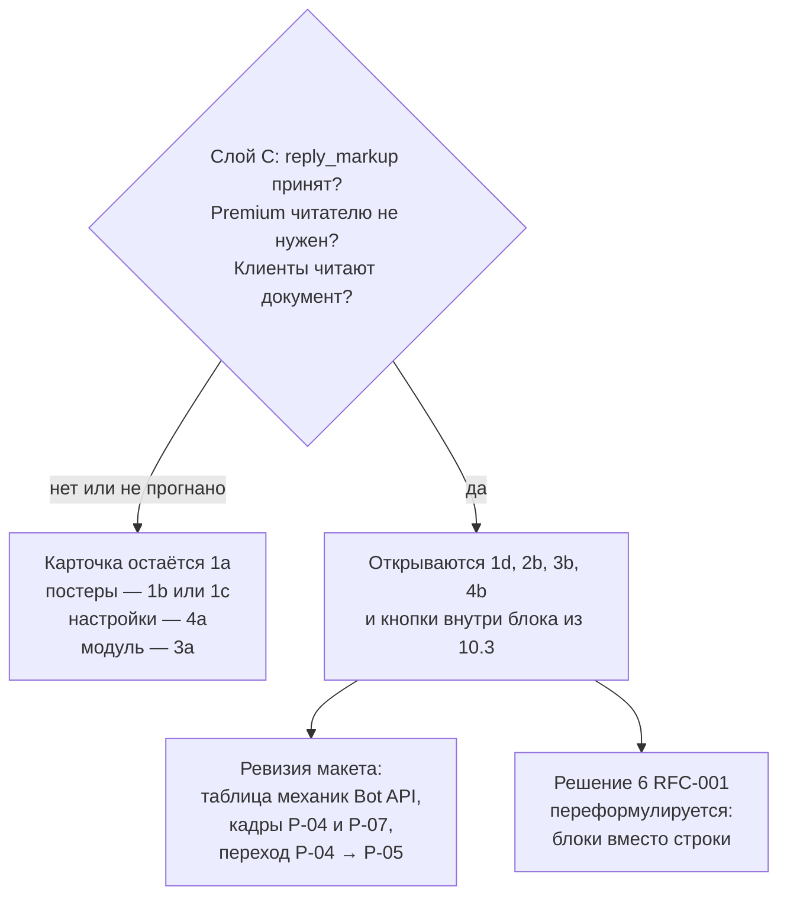
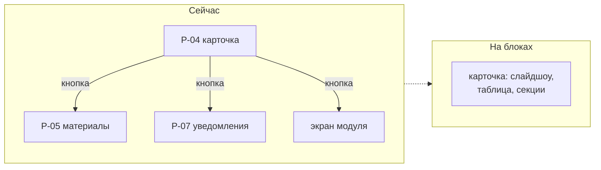

# RFC-003: Представление бота — плоский текст или блоки Rich Messages

> **Статус:** Accepted, [ADR-034](../decisions/ADR-034-telegram-bot-rich-presentation.md); открыты решения 3 и 4
> **Автор:** владелец
> **Дата:** 2026-08-12
> **Решение:** принято владельцем 2026-09-06, см. раздел [«Решения владельца»](#решения-владельца)

## Кратко

Макет Bot UI построен на допущении, что бот умеет отправлять текстовое сообщение с inline-клавиатурой, и больше ничего. Из этого допущения выведены иерархия через переносы строк, разбиение на отдельные сообщения-экраны и навигация кнопками. Bot API 10.1 и 10.2 добавили Rich Messages: структурные блоки, таблицы, сворачиваемые секции и слайдшоу.

Это меняет не оформление отдельных кадров, а словарь, которым они собраны: часть экранов и переходов перестаёт быть нужной. RFC фиксирует варианты и их цену. Документарный слой Bot API 10.3, типы grammY 1.46 и живой прогон сняли гейт `reply_markup`: сервер принял клавиатуру в личке и в группе, desktop и mobile рисуют карточку, читатель без Premium видит документ и свой шёпот. Offline-доставка шёпота и эфемерная команда остаются наблюдательными хвостами, а не гейтом механики.

Владелец выбрал **1d** как дефолт карточки и операторский тогл на **1a**: одна экранная модель, два рендерера. Решения 3 и 4 остаются открытыми. Ревизия storyboard — отдельное решение.

Смежные документы: [RFC-001](RFC-001-meetup-modules-topology.md) — что модуль отдаёт в карточку, [RFC-002](RFC-002-meetup-publication-visibility-materials.md) — постеры и материалы сходки.

## Проблема и границы

### Что вынуждает решать сейчас

Три вещи упираются в этот выбор одновременно:

- постеры из [RFC-002](RFC-002-meetup-publication-visibility-materials.md) требуют показать несколько изображений с прокруткой;
- центр настройки уведомлений требует показать несколько категорий с состояниями;
- [контракт представления модуля](RFC-001-meetup-modules-topology.md) описывает, что модуль отдаёт shell, и его форма зависит от того, чем shell рисует.

Ни одно из трёх не решается, пока не известно, каким словарём располагает бот. При этом контракт представления попадает в `.proto` и далее меняется согласованно у всех потребителей, то есть ошибка здесь дороже остальных.

### Что в границах RFC

- Механика отправки карточки сходки.
- Где живёт состояние экрана.
- Что модуль отдаёт в карточку.
- Форма экрана настройки уведомлений.
- Поведение при недоступности механики у клиента.
- Что обязательно проверить живым ботом до любого решения.

### Что вне границ

- Mini App: вынесен за границы MVP решением владельца, см. [service brief](../services/mini-app.md).
- Выбор варианта навигации A/B/C/D из макета — отдельный продуктовый вопрос владельца.
- Категории и обязательность уведомлений — требования Notifications.
- Модель данных сходки — [RFC-002](RFC-002-meetup-publication-visibility-materials.md).

### Исходное состояние платформы

Первый проход — по [Bot API changelog](https://core.telegram.org/bots/api-changelog) 12 августа 2026 года. Повторный — по [справочнику методов](https://core.telegram.org/bots/api#sendrichmessage) и [описанию возможностей](https://core.telegram.org/bots/features#rich-messages) 6 сентября 2026 года, после выхода Bot API 10.3 (24 августа 2026).

| Факт | Версия и дата | Следствие |
|---|---|---|
| Rich Messages, метод `sendRichMessage` | 10.1, 11 июня 2026 | у бота появляется структурный документ вместо плоского текста |
| Блоки `InputRichBlock*`: `Paragraph`, `SectionHeading`, `Table`, `Details`, `List`, `BlockQuotation`, `Divider`, `Photo`, `Video`, `Map`, `Collage`, `Slideshow` | 10.2, 14 июля 2026 | заголовки, таблицы, сворачиваемые секции и карусель — штатные элементы |
| Параметр `rich_message` у `editMessageText` | 10.1, 11 июня 2026 | rich-сообщение правится на месте тем же методом, что и плоский текст |
| Параметр `reply_markup` у `sendRichMessage` | справочник метода; живой `200` в личном чате 6 сентября 2026 | гейт «клавиатура на карточке» снят и на бумаге, и на сервере |
| `ephemeral_message_parameters` у `sendRichMessage` | 10.3, 24 августа 2026 | rich-документ и адресный шёпот — один метод |
| Кнопки внутри документа: `RichMessageButton`, `RichBlockButtons` / `InputRichBlockButtons`, `RichTextButton` | 10.3, 24 августа 2026 | действие больше не обязано жить только в `reply_markup` сообщения; в ряду блока — 1–8 кнопок, у callback — те же 64 байта |
| До 32 768 символов, «показать ещё» примерно после 8 000 | [анонс Telegram](https://telegram.org/blog/watch-apps-and-more) | в справочнике метода лимит длины не повторяется; сгиб остаётся гипотезой анонса |
| Rich Text Editor для людей — только для Premium | [анонс Telegram](https://telegram.org/blog/communities-editor-invisible-messages) | это другая фича; в справочнике `sendRichMessage` требования Premium у читателя нет |
| Невидимые команды и эфемерные сообщения | 10.2, уточнение параметров в 10.3 | `message_id` у эфемерного равен 0; адрес — `ephemeral_message_id`; доставка offline не гарантирована |

### Результаты проверки

Слои доказательств разделены. Решение владельца опирается на все три; один слой другой не подменяет.

| Слой | Что даёт | Состояние на 2026-09-06 |
|---|---|---|
| A. Справочник Bot API и changelog | принимает ли метод параметр, какие идентификаторы и лимиты объявлены | выполнен: [sendRichMessage](https://core.telegram.org/bots/api#sendrichmessage), [Ephemeral Messages](https://core.telegram.org/bots/api#ephemeral-messages-and-commands), [features](https://core.telegram.org/bots/features#rich-messages) |
| B. Типы grammY 1.46.0 (`@grammyjs/types` 5.0.0) | нужен ли raw Bot API | выполнен: `api.sendRichMessage(chat_id, rich_message, other)` типизирует `reply_markup` и `ephemeral_message_parameters`; есть `InputRichBlockButtons`, `editEphemeralMessage*` |
| C. Живой бот в личном чате и тестовой группе | принимает ли сервер вызов, приходит ли callback, как рисуют mobile/desktop, нужен ли Premium читателю | личка и группа 6 сентября 2026, `@solguficky_stage_bot`; desktop и mobile; без Premium видны карточка, кнопки и свой шёпот; offline-доставка шёпота и `is_ephemeral` команда — нет |

#### Матрица «механика × клиент × наблюдаемое поведение»

Ячейка без пометки «слой C» — документарный факт. Пустая ячейка слоя C — неизвестное, а не отрицательный результат.

| Механика | Bot API / grammY | Личный чат | Тестовая группа | Mobile | Desktop |
|---|---|---|---|---|---|
| `sendRichMessage` + `reply_markup` (inline) | слой A: параметр объявлен; слой B: поле есть в `other` | слой C API: `200`, есть `rich_message` и `reply_markup` | слой C API: `200`, публичная карточка с клавиатурой | слой C: владелец 7 сентября 2026, ок | слой C: заголовок, текст и кнопка `PER-20 ping` видны |
| callback после inline-клавиатуры на rich-сообщении | слой A: `callback_data` у `InlineKeyboardButton` без оговорки для rich | слой C: `per20:ping`, ответ принят | слой C: `per20:ping` и `per20:noprem` пришли, в том числе от участника без Premium | слой C: владелец 7 сентября 2026, ок | слой C: кнопка нажимается |
| `InputRichBlockButtons` с `callback_data` | слой A: 1–8 кнопок в ряду; слой B: тип есть | слой C API: `200`; `per20:open` пришёл | слой C: `per20:see` пришёл; на скрине без Premium видна кнопка `Вижу карточку` | слой C: владелец 7 сентября 2026, ок | слой C: кнопка в документе видна |
| Чтение без Premium | слой A: ограничения у читателя нет | слой C: не отделено от Premium-статуса владельца | слой C: читатель без Premium видит заголовок, таблицу, раскрытые «Материалы» и кнопки | слой C: не отделено от Premium-статуса владельца | слой C: тот же документ читается |
| Ограничение «AI bots» | слой A: в справочнике метода нет | слой C API: обычный бот отправил, отказа нет | слой C API: тот же бот отправил в группу | — | — |
| `editMessageText` с `rich_message` | слой A: метод правит text/rich/game | слой C API: `200`, тот же `message_id` | слой C: не прогнано | слой C: не прогнано | слой C: на скрине текст «Документ отредактирован целиком» |
| Эфемерная команда (`BotCommand.is_ephemeral`) | слой A: видна боту и отправителю | — | слой C: не прогоняли `setMyCommands` | слой C: не прогнано | слой C: не прогнано |
| Эфемерный ответ (`ephemeral_message_parameters`) | слой A: `message_id = 0`; offline не гарантирован | не применяется | слой C API: `200`; без Premium адресат видит свой шёпот | слой C: не прогнано | слой C: пометка «Видите только вы» у обоих адресатов |
| `replace_callback_query_message` | слой A/10.3: эфемерный ответ вместо исходного сообщения, только для этого пользователя | слой C: не прогнано | слой C: не прогнано | слой C: не прогнано | слой C: не прогнано |

#### Подтверждённые факты

- `sendRichMessage` в актуальном справочнике принимает `reply_markup` тех же четырёх видов, что и `sendMessage`: `InlineKeyboardMarkup`, `ReplyKeyboardMarkup`, `ReplyKeyboardRemove`, `ForceReply`.
- Живой обычный бот `@solguficky_stage_bot`: `sendRichMessage` с inline-клавиатурой вернул `200` в личке и в группе. Ограничение «AI bots» не сработало. Читателю Premium не нужен: участник без подписки увидел карточку целиком и нажал `Я без Premium`.
- Тот же метод принимает `ephemeral_message_parameters`. Живой вызов в группе вернул `200`, `message_id = 0`. Адресат без Premium видит свой шёпот с пометкой «Видите только вы»; то же у владельца на его шёпоте.
- Целый rich-документ правится через `editMessageText(..., rich_message)`; отдельного `editRichMessage` нет. Живой вызов в личном чате вернул `200` на том же `message_id`, клавиатура осталась.
- С 10.3 действие может стоять внутри документа. Живой `sendRichMessage` блоками прошёл в личке и в группе. На desktop и mobile карточка читается: заголовок, абзац, таблица «Когда / Где», сворачиваемая секция «Материалы», кнопка `Открыть` в документе и отдельно `PER-20 ping` в `reply_markup`. Нажатия в личке дали `per20:open` и `per20:ping`. Mobile подтвердил владелец 7 сентября 2026.
- Эфемерное сообщение адресуется `ephemeral_message_id`, а не `message_id`. Ответ на эфемерное сам должен быть эфемерным и укладывается в 15 секунд. Идентификатор может быть переиспользован после удаления или истечения.
- Доставка эфемерного получателю offline не гарантирована — это норма справочника, не гипотеза.
- grammY 1.46.0, уже стоящий в `apps/telegram-bot`, оборачивает `sendRichMessage`, `sendRichMessageDraft` и `editEphemeralMessage*`. Raw Bot API для этих вызовов не нужен: третий аргумент `other` несёт `reply_markup` и `ephemeral_message_parameters`. Живой прогон шёл сырым HTTP с тем же JSON.

#### Гипотезы

- Сгиб «показать ещё» около 8 000 символов и потолок 32 768 по-прежнему взяты из анонса, а не из таблицы параметров метода.
- Клиент без поддержки Rich Messages покажет деградированный текст сам, без второго рендера на стороне бота. Это предпочтение варианта 5a, не факт.

#### Неизвестные — только слой C

- Как выглядит и сколько живёт эфемерный ответ, если получатель offline.
- Эфемерная команда через `BotCommand.is_ephemeral` не прогонялась.

Воспроизведение — исследовательский зонд в `tools/telegram-rich-probe`, не часть платформы.

#### Консервативный fallback

Гейт механики зелёный: `reply_markup` принят, desktop рисует карточку, Premium читателю не нужен, шёпот доходит без Premium. Владелец выбрал **1d** как дефолт и **1a** как второй рендерер за тоглом процесса ([ADR-034](../decisions/ADR-034-telegram-bot-rich-presentation.md)). Навигация — уже выбранный вариант B. Вариант D не вводится.

Практическое правило после решения:

1. Продуктовая карточка по умолчанию идёт `sendRichMessage` / `editMessageText` с `rich_message`.
2. Та же экранная модель собирает `sendMessage`, когда процесс запущен с `TELEGRAM_BOT_PRESENTATION=plain`.
3. Если клиент режет блоки или ломает клавиатуру — дефолт возвращается к 1a отдельным пересмотром ADR-034; постеры тогда идут в 1b.
4. Детект клиента (5b) не используется: Bot API возможности получателя не отдаёт.

## Сценарии и требования

| # | Сценарий | Ожидаемый исход |
|---|---|---|
| S1 | Солегуфик открывает карточку сходки с афишей, четырьмя материалами и модулем | видит главное сразу, остальное доступно без ухода с экрана |
| S2 | Организатор изменил время сходки | у всех, кто держит карточку открытой, она обновляется на месте |
| S3 | У сходки не было афиши, афишу добавили | карточка обновляется, ссылки на неё не ломаются |
| S4 | Солегуфик настраивает категории уведомлений | видит текущее состояние каждой категории и меняет его |
| S5 | Клиент пользователя не поддерживает механику | карточка остаётся читаемой и действия остаются доступными |
| S6 | Модуль подключён к сходке | его содержимое видно в карточке либо доступно одним действием |
| S7 | Два администратора правят сходку одновременно | обновление сообщения не теряет чужое изменение молча |

**Обязательные требования:**

- ни одно действие пользователя не становится недоступным из-за выбранной механики;
- ответ на нажатие укладывается в дедлайн `answerCallbackQuery`;
- карточка читаема при отсутствии изображений;
- состояние, от которого зависит логика бота, остаётся наблюдаемым сервером.

**Осознанно не требуется:**

- одинаковый внешний вид на всех клиентах;
- редактируемость карточки пользователем;
- перенос механики в Mini App один в один.

## Решения и варианты

### 1. Чем отправляется карточка сходки

| Вариант | Устройство | За | Против |
|---|---|---|---|
| **1a. `sendMessage`** | плоский текст плюс inline-клавиатура; текущее допущение макета | подтверждено, работает у всех, нулевой риск | иерархия рисуется переносами строк и эмодзи; изображений нет; 4096 символов; всё, что не влезло, уезжает за кнопку в отдельное сообщение |
| **1b. `sendPhoto` с подписью** | фото сверху, текст в `caption` | афиша видна сразу; клавиатура работает | подпись 1024 символа вместо 4096; альбом не принимает `reply_markup`, поэтому несколько афиш требуют ручной карусели через `editMessageMedia`; **текстовое сообщение нельзя превратить в сообщение с фото** — добавленная позже афиша требует удалить и переотправить карточку с новым `message_id` |
| **1c. `sendMessage` с превью ссылки** | `link_preview_options` с `show_above_text` | одна большая картинка над текстом, карточка остаётся текстовой, 4096 сохраняются | нужен публичный URL, то есть **конфликт с закрытыми сходками** из [RFC-002](RFC-002-meetup-publication-visibility-materials.md); только одно изображение; момент генерации превью не под контролем бота |
| **1d. `sendRichMessage`** | блоки: заголовок, таблица, сворачиваемые секции, слайдшоу, с 10.3 — кнопки внутри документа | закрывает постеры, настройки и содержимое модулей одним механизмом; правка на месте через `rich_message` | две реализации, если нужен откат на 1a; сгиб остаётся хвостом наблюдения |

Варианты не исключают друг друга полностью: возможна карточка на 1d с деградацией до 1a. Но это означает две реализации представления и два набора кадров макета, то есть цену, которую нужно назвать явно, а не считать бесплатной.

### 2. Где живёт состояние экрана

Это самое недооценённое следствие блоков.

| Вариант | Устройство | Цена |
|---|---|---|
| **2a. Экран равен сообщению** | каждый экран — отдельное сообщение, переход — новое сообщение или правка текущего | состояние наблюдаемо сервером; на этом построены `callback_data`, версия экрана и обработка устаревших сообщений из кадра E-04 макета | много сообщений и много кнопок-навигации |
| **2b. Один документ, секции сворачивает клиент** | карточка содержит всё, пользователь раскрывает нужное | меньше сообщений, меньше кнопок, меньше кадров | **бот не знает, что раскрыто**: часть состояния UI перестаёт быть наблюдаемой сервером, и построить на ней логику нельзя |

Практическое следствие 2b: нельзя сделать «показать содержимое модуля только при раскрытии» с ленивой загрузкой — содержимое обязано быть в сообщении уже в момент отправки. Значит все сводки модулей собираются на каждый рендер карточки, что усиливает довод в пользу проекции сводок из [решения 5 RFC-001](RFC-001-meetup-modules-topology.md).

### 3. Что модуль отдаёт shell

Прямо уточняет [решение 6 RFC-001](RFC-001-meetup-modules-topology.md).

| Вариант | Устройство | За | Против |
|---|---|---|---|
| **3a. Строка состояния плюс кнопка на свой экран** | текущее допущение RFC-001 | контракт представления минимален; модуль владеет своим экраном целиком | модуль забирает экран у карточки; переход обязателен даже ради двух строк |
| **3b. Модуль отдаёт блоки в карточку** | модуль возвращает секцию, shell вставляет её в общий документ | содержимое видно на месте, переходов меньше | контракт представления вырастает с «строка и кнопки» до подмножества блоков; появляются общие ресурсы: порядок секций, бюджет длины, суммарный размер сообщения |
| **3c. Гибрид** | модуль отдаёт свёрнутую секцию для карточки и полный экран для перехода | лучший UX | две поверхности вместо одной, обе версионируются |

Вариант 3b напрямую бьёт по правилу роста контракта из RFC-001: «в контракт представления не попадает ни одно поле, называющее доменное понятие». Само по себе правило выживает — блоки доменных понятий не называют. Но объём контракта растёт, и с ним растёт цена любого его изменения.

**Два вида кнопок — не взаимозамена.** На живых скринах они стоят в разных местах и решают разную задачу. Оба несут тот же `callback_data` на 64 байта и оба доставили `callback_query` в личке и в группе.

| | Кнопка в документе (`InputRichBlockButtons`, `RichTextButton`) | Inline-клавиатура (`reply_markup`) |
|---|---|---|
| Где рисуется | внутри карточки, под секцией или в тексте | под пузырём, отдельным рядом |
| Чей это объект | блок документа | сообщение целиком, один `reply_markup` на сообщение |
| Вид | стили `primary` / `danger` / `success` / `link`; на прогоне — широкая кнопка в теле карточки | обычные серые кнопки Telegram |
| Сколько | 1–8 в одном ряду-блоке; рядов может быть несколько | до лимита клавиатуры; ряд = строка списка |
| Сгиб | уезжает вместе с секцией за «показать ещё» | остаётся на сообщении |
| Для чего | CTA рядом с прочитанным: «Открыть» у материалов, «Подписаться» у блока уведомлений | навигация хаба и список, который сам является действием: четыре материала — четыре ряда |

Выбрать «только одно навсегда» не нужно. Если карточка остаётся **1a**, живёт только `reply_markup` — это уже выбранный вариант B. Если открывают **1d**, документ несёт кнопки у содержимого, а клавиатура остаётся хромом хаба: «Уведомления», роль, переход, которому нет места в секции. Одно и то же действие в оба слоя класть не стоит: на прогоне `Открыть` в документе и `PER-20 ping` под пузырём читались как два разных предложения, не как дубль.

Склейка «строка списка = кнопка» у клавиатуры сильнее. Ряд в блоке не встаёт напротив строки таблицы и не заменяет кадр A-14 «убрать связь»: для построчного действия по-прежнему либо клавиатура, либо отдельный экран. Правило ниже от этого не меняется.

Проверяется на прикреплённых сообщениях. Солегуфику нужен только переход к оригиналу — это URL, и раскрытая секция полностью заменяет отдельный экран. Организатору нужно «убрать связь» из кадра A-14, то есть действие по конкретной строке; разместить его негде, кроме общей клавиатуры, и число кнопок растёт линейно с числом материалов. Обход через ссылку `t.me/<bot>?start=...` существует, но payload ограничен по длине, попадает в открытую ссылку и означает выход из чата с возвратом.

Отсюда два следствия. Первое: экран материалов не исчезает, а раздваивается — для читателя он не нужен, для организатора нужен, то есть карточка становится ролезависимой. Второе: модуль, ценность которого в действии по элементу — ставка на лот, «беру это» в потлак-листе, — забирает себе экран независимо от выбора между 3a и 3b.

Причина глубже, чем ограничение разметки. В inline-клавиатуре кнопка **одновременно является строкой списка и действием над ней**: список материалов — это и есть клавиатура, четыре материала — четыре ряда, нажатие и есть открытие. Блоки эту склейку разрывают и заставляют восстанавливать связь текстом кнопки. Отсюда правило разделения, которое стоит зафиксировать независимо от выбора механики:

> В блок попадает то, что читают. В клавиатуру — то, что одновременно является списком и действием над его элементом.

Правило проверяемо на любом кадре и не зависит от результата гейта: при отрицательном результате оно тривиально выполняется, при положительном — удерживает списки от переезда в блоки.

Появляется и новый общий ресурс, которого раньше не было: сгиб «показать ещё» примерно на 8 000 символов. Если модули вставляют секции в общий документ, то место до сгиба — дефицитный ресурс, который кто-то должен делить. Это ровно та же ситуация, что с 64 байтами `callback_data`, и обнаруживается она так же поздно.

### 4. Экран настройки уведомлений

| Вариант | Устройство | За | Против |
|---|---|---|---|
| **4a. Отдельное сообщение-экран** | кадр P-07 макета как есть | подтверждено, работает | состояние категории выражается только текстом кнопки; при росте числа категорий экран разъезжается |
| **4b. Секция внутри карточки сходки** | настройки — сворачиваемая секция | отдельный экран не нужен; настройка рядом с тем, что настраивается | зависит от 1d; настройки конкретной сходки нельзя открыть, не открыв сходку |
| **4c. Отдельный центр для всех сходок** | один экран со всеми подписками пользователя | видно всё сразу, удобно отписываться оптом | новый экран, новая навигация, дублирование с 4a или 4b |

Требование «продумать центр настройки уведомлений подробнее» на деле является выбором между 4a, 4b и 4c, а не задачей на проработку одного экрана. И 4b, и 4c уменьшают потребность в подробной проработке P-07 — в первом случае экран исчезает, во втором переезжает.

### 5. Деградация

| Вариант | Цена |
|---|---|
| **5a. Одна механика для всех** | простота; если механика где-то не поддержана, часть пользователей теряет функциональность |
| **5b. Определять возможности клиента** | Bot API не сообщает возможности клиента напрямую, определять придётся косвенно или не определять вовсе |
| **5c. Всегда отправлять минимально совместимое** | предсказуемо; преимущества блоков не используются |

Ответ на этот вопрос полностью зависит от результата проверки: если rich-сообщение читается везде и деградирует само, решение вырождается в 5a.

## Как это выглядит целиком

Зависимости решений от проверки платформы:

Что происходит с кадрами макета при выборе 1d плюс 3b:

Три кадра и шесть переходов сворачиваются в один документ. Это и есть содержательная разница: не оформление, а количество состояний интерфейса, которые нужно спроектировать, нарисовать и поддерживать.

## Предложение

Предпочтения ниже были исходной позицией для обсуждения. Принятое — в разделе [«Решения владельца»](#решения-владельца).

| # | Решение | Предпочтение | Главная причина |
|---|---|---|---|
| — | порядок работы | слой A/B снят; слой C — живой бот и клиенты; потом решение | документарный гейт `reply_markup` больше не держит развилку; отрицательный слой C по-прежнему закрывает половину вариантов |
| 1 | механика карточки | **1d**, если проверка положительна; иначе **1a** плюс **1b** только для сходок с афишей | 1c отпадает из-за конфликта с закрытыми сходками |
| 2 | состояние экрана | **2a** остаётся правилом: логика бота не строится на том, что раскрыто у клиента | наблюдаемость состояния важнее экономии кадров |
| 3 | что отдаёт модуль | **3a** в первом контракте, **3c** как цель | секция и ряд в блоке показывают и дают CTA; линейный список-действие остаётся у клавиатуры или на своём экране |
| 4 | настройки | **4b**, если проверка положительна; иначе **4a** | отдельный центр не оправдан числом категорий |
| 5 | деградация | **5a**, после того как проверка покажет реальное поведение | гадать о деградации до проверки бессмысленно |

Предпочтение 2a при выборе 1d означает конкретное правило: сворачиваемые секции используются для **содержимого**, но ни одно решение бота не зависит от того, раскрыта секция или нет.

## Решения владельца

Принято 6 сентября 2026 года после слоя C. Архитектурная часть вынесена в [ADR-034](../decisions/ADR-034-telegram-bot-rich-presentation.md).

| # | Принято | Отвергнуто | Причина |
|---|---|---|---|
| 1 | **1d** как дефолт карточки: `sendRichMessage` | 1a как единственная карточка; 1b как основная механика; 1c | слой C зелёный: обычный бот, без Premium, клавиатура и кнопки в документе работают. 1c по-прежнему конфликтует с закрытыми сходками |
| 2 | **2a** остаётся: логика не строится на раскрытой секции | 2b как источник состояния | уже следует из ADR-030: состояние живёт в сообщении и `callback_data` |
| 5 | **тогл процесса** `TELEGRAM_BOT_PRESENTATION=rich\|plain`, дефолт `rich`; та же экранная модель, два рендерера | 5b — детект клиента; 5c — всегда минимум; одна реализация без отката | Bot API возможности клиента не отдаёт; откат без второго рендерера дороже тогла; per-user режим потребовал бы хранилища, которого у края нет |

Не выбрано этим решением:

- **3** — что модуль отдаёт shell. 1d разблокирует 3b и 3c, но нижняя граница «строка и действия» больше не единственная форма. Блокирует `.proto`.
- **4** — форма экрана настроек. 4b больше не закрыт механикой, но не принят.
- ревизия [storyboard](../design/bot/README.md) — отдельное решение владельца.
- вариант D макета — не вводится.

## Что станет сложнее

- **Правка идёт целиком.** Изменилось время сходки — перерисовывается весь документ вместе со слайдшоу и всеми секциями. Чем богаче карточка, тем шире окно гонки при одновременном редактировании двумя администраторами, что уже висит открытым вопросом в макете.
- **Сводки модулей собираются всегда.** Ленивой загрузки внутри сообщения нет, значит рендер карточки требует сводку каждого подключённого модуля целиком.
- **Место до сгиба становится общим ресурсом.** 8 000 символов делятся между карточкой и всеми модулями.
- **Контракт представления растёт.** Подмножество блоков в `.proto` — это заметно больше, чем строка и список действий.
- **Две реализации при деградации.** Если fallback нужен, макет и код удваиваются в части представления.
- **Карточка становится ролезависимой.** Читателю секция заменяет экран, организатору — нет. Значит рендерится не один документ, а два, и любая проекция или кэш карточки обязаны это учитывать.
- **Макет требует ревизии.** Таблица механик Bot API, кадры карточки и настроек, часть переходов и часть открытых вопросов перестают быть актуальными.

## Открытые вопросы

Сняты документарным слоем, ждут только слой C:

1. Объявлен ли `reply_markup` у `sendRichMessage` — да. Сервер принял вызов в личке и в группе.
2. Поддержка в grammY 1.46.0 — да, типизированный метод, raw API не нужен.
3. Callback с `reply_markup` и с `InputRichBlockButtons` — оба пришли в личном чате.
4. Ограничение «AI bots» — обычный бот отправил rich-сообщение в личку и в группу.
5. Desktop рисует карточку: заголовок, таблица, `details`, кнопки в документе и в `reply_markup`.
6. Premium читателю не нужен: непремиум-участник видит документ, жмёт кнопки и получает свой шёпот.
7. Mobile читает ту же карточку — владелец 7 сентября 2026.

Требуют наблюдения, гейт не держат:

8. Жизнь эфемерного ответа, если получатель offline.
9. Эфемерная команда через `BotCommand.is_ephemeral`.

Закрыты решением владельца 2026-09-06, [ADR-034](../decisions/ADR-034-telegram-bot-rich-presentation.md):

10. Механика карточки — **1d** по умолчанию, **1a** за тоглом процесса.
11. Fallback — операторский тогл, не детект клиента.

Требуют отдельного решения владельца:

12. Что модуль отдаёт shell — решение 3. Блокирует контракт представления и, следовательно, `.proto`.
13. Форма экрана настроек — решение 4. Это и есть требование «продумать центр уведомлений».
14. Ревизия макета — таблица механик, кадры P-04 и P-07, переход P-04 → P-05. Не входит в ADR-034.

Вопрос про перенос структуры блоков в Mini App снят: Mini App вне MVP.

Вариант D из макета по этим результатам не вводится.

## Результирующие артефакты

- **ADR:** [ADR-034](../decisions/ADR-034-telegram-bot-rich-presentation.md) — механика представления. [ADR-030](../decisions/ADR-030-telegram-bot.md) её не выбирает: он решает границу компонента, состояние экрана и идемпотентность, а не форму сообщений.
- **Standard:** не нужен.
- **Обновление документов:** карта статусов и бриф Telegram Bot обновлены вместе с ADR-034. Ревизия [design/bot/storyboard.html](../design/bot/README.md) — отдельное решение владельца. [RFC-001](RFC-001-meetup-modules-topology.md) — решение 6 в части того, что модуль отдаёт, по-прежнему открыто; нижняя граница «строка и действия» больше не единственная форма.
- **Задачи Linear:** [PER-20](https://linear.app/anticnvm/issue/per-20) — проверка Rich Messages и ephemeral-механики живым ботом; лист блока «Показать сходку тому, кому она видна» в milestone «Первый вертикальный срез работает».
- **Исследовательский зонд:** `tools/telegram-rich-probe` — не платформа и не `verify`.
- **`contracts/proto/`:** не трогается до принятия решения 3.
