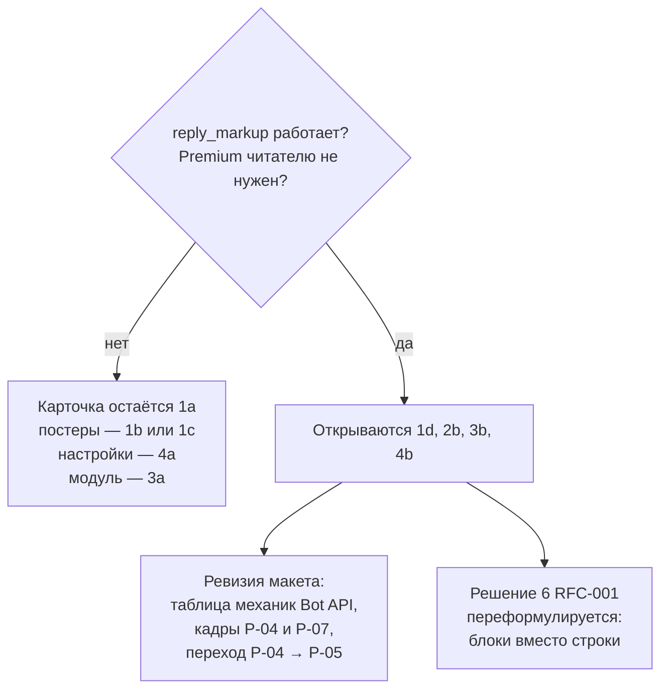
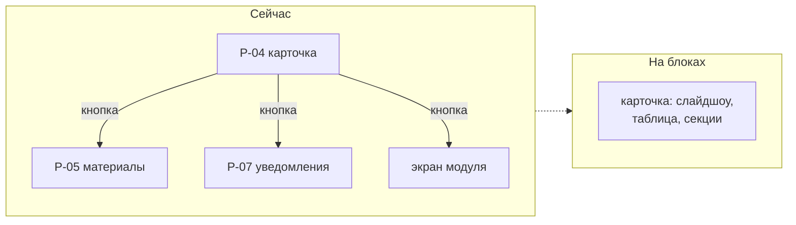

# RFC-003: Представление бота — плоский текст или блоки Rich Messages

> **Статус:** Draft
> **Автор:** владелец
> **Дата:** 2026-08-12

## Кратко

Макет Bot UI построен на допущении, что бот умеет отправлять текстовое сообщение с inline-клавиатурой, и больше ничего. Из этого допущения выведены иерархия через переносы строк, разбиение на отдельные сообщения-экраны и навигация кнопками. Bot API 10.1 и 10.2 добавили Rich Messages: структурные блоки, таблицы, сворачиваемые секции и слайдшоу.

Это меняет не оформление отдельных кадров, а словарь, которым они собраны: часть экранов и переходов перестаёт быть нужной. RFC фиксирует варианты и их цену. Ни один вариант здесь не принят, и принять их нельзя до проверки платформы живым ботом.

Смежные документы: [RFC-001](RFC-001-meetup-modules-topology.md) — что модуль отдаёт в карточку, [RFC-002](RFC-002-meetup-publication-visibility-materials.md) — постеры и материалы сходки.

## Проблема и границы

### Что вынуждает решать сейчас

Три вещи упираются в этот выбор одновременно:

- постеры из [RFC-002](RFC-002-meetup-publication-visibility-materials.md) требуют показать несколько изображений с прокруткой;
- центр настройки уведомлений требует показать несколько категорий с состояниями;
- [контракт представления модуля](RFC-001-meetup-modules-topology.md) описывает, что модуль отдаёт shell, и его форма зависит от того, чем shell рисует.

Ни одно из трёх не решается, пока не известно, каким словарём располагает бот. При этом контракт представления попадает в `.proto` и далее меняется согласованно у всех потребителей, то есть ошибка здесь дороже остальных.

### Что в границах RFC

- Механика отправки карточки сходки.
- Где живёт состояние экрана.
- Что модуль отдаёт в карточку.
- Форма экрана настройки уведомлений.
- Поведение при недоступности механики у клиента.
- Что обязательно проверить живым ботом до любого решения.

### Что вне границ

- Mini App: его поверхность не ограничена Bot API.
- Выбор варианта навигации A/B/C/D из макета — отдельный продуктовый вопрос владельца.
- Категории и обязательность уведомлений — требования Notifications.
- Модель данных сходки — [RFC-002](RFC-002-meetup-publication-visibility-materials.md).

### Исходное состояние платформы

Проверено по [Bot API changelog](https://core.telegram.org/bots/api-changelog) 12 августа 2026 года.

| Факт | Версия и дата | Следствие |
|---|---|---|
| Rich Messages, метод `sendRichMessage` | 10.1, 11 июня 2026 | у бота появляется структурный документ вместо плоского текста |
| Блоки `InputRichBlock*`: `Paragraph`, `SectionHeading`, `Table`, `Details`, `List`, `BlockQuotation`, `Divider`, `Photo`, `Video`, `Map`, `Collage`, `Slideshow` | 10.2, 14 июля 2026 | заголовки, таблицы, сворачиваемые секции и карусель — штатные элементы |
| Параметр `rich_message` у `editMessageText` | 10.2 | rich-сообщение, судя по всему, правится на месте |
| До 32 768 символов, «показать ещё» примерно после 8 000 | [анонс Telegram](https://telegram.org/blog/watch-apps-and-more) | длина перестаёт быть ограничением, но появляется сгиб |
| Rich Text Editor для людей — только для Premium | [анонс Telegram](https://telegram.org/blog/communities-editor-invisible-messages) | это другая фича; на ботов ограничение не переносится автоматически |
| Невидимые команды и эфемерные сообщения | 10.2 | уже учтено макетом |

### Что НЕ проверено

Это не оговорка, а гейт: при отрицательном ответе на первые два пункта половина вариантов ниже перестаёт существовать.

| Вопрос | Почему блокирует | Как проверяется |
|---|---|---|
| Принимает ли `sendRichMessage` параметр `reply_markup` | без inline-клавиатуры карточка сходки невозможна: все действия на кнопках | отправить rich-сообщение с клавиатурой живым ботом |
| Нужен ли Premium читателю | если да, механика не годится для основной карточки | прочитать тем же сообщением с непремиум-аккаунта |
| Реально ли ограничение «AI bots» из анонса | в changelog ограничения нет, в блоге формулировка маркетинговая | тот же прогон обычным ботом |
| Как выглядит rich-сообщение на старых клиентах и в desktop | определяет, нужен ли fallback | тот же прогон на нескольких клиентах |
| Поддержка в grammY | гейт для стека Gateway | чтение исходников или пробный вызов |

Проверка совмещается с уже запланированной в макете проверкой эфемерных сообщений: это один прогон.

## Сценарии и требования

| # | Сценарий | Ожидаемый исход |
|---|---|---|
| S1 | Солегуфик открывает карточку сходки с афишей, четырьмя материалами и модулем | видит главное сразу, остальное доступно без ухода с экрана |
| S2 | Организатор изменил время сходки | у всех, кто держит карточку открытой, она обновляется на месте |
| S3 | У сходки не было афиши, афишу добавили | карточка обновляется, ссылки на неё не ломаются |
| S4 | Солегуфик настраивает категории уведомлений | видит текущее состояние каждой категории и меняет его |
| S5 | Клиент пользователя не поддерживает механику | карточка остаётся читаемой и действия остаются доступными |
| S6 | Модуль подключён к сходке | его содержимое видно в карточке либо доступно одним действием |
| S7 | Два администратора правят сходку одновременно | обновление сообщения не теряет чужое изменение молча |

**Обязательные требования:**

- ни одно действие пользователя не становится недоступным из-за выбранной механики;
- ответ на нажатие укладывается в дедлайн `answerCallbackQuery`;
- карточка читаема при отсутствии изображений;
- состояние, от которого зависит логика бота, остаётся наблюдаемым сервером.

**Осознанно не требуется:**

- одинаковый внешний вид на всех клиентах;
- редактируемость карточки пользователем;
- перенос механики в Mini App один в один.

## Решения и варианты

### 1. Чем отправляется карточка сходки

| Вариант | Устройство | За | Против |
|---|---|---|---|
| **1a. `sendMessage`** | плоский текст плюс inline-клавиатура; текущее допущение макета | подтверждено, работает у всех, нулевой риск | иерархия рисуется переносами строк и эмодзи; изображений нет; 4096 символов; всё, что не влезло, уезжает за кнопку в отдельное сообщение |
| **1b. `sendPhoto` с подписью** | фото сверху, текст в `caption` | афиша видна сразу; клавиатура работает | подпись 1024 символа вместо 4096; альбом не принимает `reply_markup`, поэтому несколько афиш требуют ручной карусели через `editMessageMedia`; **текстовое сообщение нельзя превратить в сообщение с фото** — добавленная позже афиша требует удалить и переотправить карточку с новым `message_id` |
| **1c. `sendMessage` с превью ссылки** | `link_preview_options` с `show_above_text` | одна большая картинка над текстом, карточка остаётся текстовой, 4096 сохраняются | нужен публичный URL, то есть **конфликт с закрытыми сходками** из [RFC-002](RFC-002-meetup-publication-visibility-materials.md); только одно изображение; момент генерации превью не под контролем бота |
| **1d. `sendRichMessage`** | блоки: заголовок, таблица, сворачиваемые секции, слайдшоу | закрывает постеры, настройки и содержимое модулей одним механизмом; 32 768 символов; правка на месте через `rich_message` | всё, что перечислено в разделе «Что НЕ проверено»; поведение при деградации неизвестно |

Варианты не исключают друг друга полностью: возможна карточка на 1d с деградацией до 1a. Но это означает две реализации представления и два набора кадров макета, то есть цену, которую нужно назвать явно, а не считать бесплатной.

### 2. Где живёт состояние экрана

Это самое недооценённое следствие блоков.

| Вариант | Устройство | Цена |
|---|---|---|
| **2a. Экран равен сообщению** | каждый экран — отдельное сообщение, переход — новое сообщение или правка текущего | состояние наблюдаемо сервером; на этом построены `callback_data`, версия экрана и обработка устаревших сообщений из кадра E-04 макета | много сообщений и много кнопок-навигации |
| **2b. Один документ, секции сворачивает клиент** | карточка содержит всё, пользователь раскрывает нужное | меньше сообщений, меньше кнопок, меньше кадров | **бот не знает, что раскрыто**: часть состояния UI перестаёт быть наблюдаемой сервером, и построить на ней логику нельзя |

Практическое следствие 2b: нельзя сделать «показать содержимое модуля только при раскрытии» с ленивой загрузкой — содержимое обязано быть в сообщении уже в момент отправки. Значит все сводки модулей собираются на каждый рендер карточки, что усиливает довод в пользу проекции сводок из [решения 5 RFC-001](RFC-001-meetup-modules-topology.md).

### 3. Что модуль отдаёт shell

Прямо уточняет [решение 6 RFC-001](RFC-001-meetup-modules-topology.md).

| Вариант | Устройство | За | Против |
|---|---|---|---|
| **3a. Строка состояния плюс кнопка на свой экран** | текущее допущение RFC-001 | контракт представления минимален; модуль владеет своим экраном целиком | модуль забирает экран у карточки; переход обязателен даже ради двух строк |
| **3b. Модуль отдаёт блоки в карточку** | модуль возвращает секцию, shell вставляет её в общий документ | содержимое видно на месте, переходов меньше | контракт представления вырастает с «строка и кнопки» до подмножества блоков; появляются общие ресурсы: порядок секций, бюджет длины, суммарный размер сообщения |
| **3c. Гибрид** | модуль отдаёт свёрнутую секцию для карточки и полный экран для перехода | лучший UX | две поверхности вместо одной, обе версионируются |

Вариант 3b напрямую бьёт по правилу роста контракта из RFC-001: «в контракт представления не попадает ни одно поле, называющее доменное понятие». Само по себе правило выживает — блоки доменных понятий не называют. Но объём контракта растёт, и с ним растёт цена любого его изменения.

**Жёсткая граница, ограничивающая 3b.** Внутри блока размещается ссылка, но не кнопка: inline-клавиатура принадлежит сообщению, а не блоку, и не встаёт напротив строки списка. Значит секция умеет показывать содержимое и открывать внешние ссылки, но не умеет действие по элементу.

Проверяется на прикреплённых сообщениях. Солегуфику нужен только переход к оригиналу — это URL, и раскрытая секция полностью заменяет отдельный экран. Организатору нужно «убрать связь» из кадра A-14, то есть действие по конкретной строке; разместить его негде, кроме общей клавиатуры, и число кнопок растёт линейно с числом материалов. Обход через ссылку `t.me/<bot>?start=...` существует, но payload ограничен по длине, попадает в открытую ссылку и означает выход из чата с возвратом.

Отсюда два следствия. Первое: экран материалов не исчезает, а раздваивается — для читателя он не нужен, для организатора нужен, то есть карточка становится ролезависимой. Второе: модуль, ценность которого в действии по элементу — ставка на лот, «беру это» в потлак-листе, — забирает себе экран независимо от выбора между 3a и 3b.

Причина глубже, чем ограничение разметки. В inline-клавиатуре кнопка **одновременно является строкой списка и действием над ней**: список материалов — это и есть клавиатура, четыре материала — четыре ряда, нажатие и есть открытие. Блоки эту склейку разрывают и заставляют восстанавливать связь текстом кнопки. Отсюда правило разделения, которое стоит зафиксировать независимо от выбора механики:

> В блок попадает то, что читают. В клавиатуру — то, что одновременно является списком и действием над его элементом.

Правило проверяемо на любом кадре и не зависит от результата гейта: при отрицательном результате оно тривиально выполняется, при положительном — удерживает списки от переезда в блоки.

Появляется и новый общий ресурс, которого раньше не было: сгиб «показать ещё» примерно на 8 000 символов. Если модули вставляют секции в общий документ, то место до сгиба — дефицитный ресурс, который кто-то должен делить. Это ровно та же ситуация, что с 64 байтами `callback_data`, и обнаруживается она так же поздно.

### 4. Экран настройки уведомлений

| Вариант | Устройство | За | Против |
|---|---|---|---|
| **4a. Отдельное сообщение-экран** | кадр P-07 макета как есть | подтверждено, работает | состояние категории выражается только текстом кнопки; при росте числа категорий экран разъезжается |
| **4b. Секция внутри карточки сходки** | настройки — сворачиваемая секция | отдельный экран не нужен; настройка рядом с тем, что настраивается | зависит от 1d; настройки конкретной сходки нельзя открыть, не открыв сходку |
| **4c. Отдельный центр для всех сходок** | один экран со всеми подписками пользователя | видно всё сразу, удобно отписываться оптом | новый экран, новая навигация, дублирование с 4a или 4b |

Требование «продумать центр настройки уведомлений подробнее» на деле является выбором между 4a, 4b и 4c, а не задачей на проработку одного экрана. И 4b, и 4c уменьшают потребность в подробной проработке P-07 — в первом случае экран исчезает, во втором переезжает.

### 5. Деградация

| Вариант | Цена |
|---|---|
| **5a. Одна механика для всех** | простота; если механика где-то не поддержана, часть пользователей теряет функциональность |
| **5b. Определять возможности клиента** | Bot API не сообщает возможности клиента напрямую, определять придётся косвенно или не определять вовсе |
| **5c. Всегда отправлять минимально совместимое** | предсказуемо; преимущества блоков не используются |

Ответ на этот вопрос полностью зависит от результата проверки: если rich-сообщение читается везде и деградирует само, решение вырождается в 5a.

## Как это выглядит целиком

Зависимости решений от проверки платформы:

Что происходит с кадрами макета при выборе 1d плюс 3b:

Три кадра и шесть переходов сворачиваются в один документ. Это и есть содержательная разница: не оформление, а количество состояний интерфейса, которые нужно спроектировать, нарисовать и поддерживать.

## Предложение

Предпочтения ниже — исходная позиция для обсуждения, а не принятое решение. Все они условны относительно результата проверки.

| # | Решение | Предпочтение | Главная причина |
|---|---|---|---|
| — | порядок работы | сначала проверка живым ботом, потом всё остальное | при отрицательном результате половина вариантов не существует |
| 1 | механика карточки | **1d**, если проверка положительна; иначе **1a** плюс **1b** только для сходок с афишей | 1c отпадает из-за конфликта с закрытыми сходками |
| 2 | состояние экрана | **2a** остаётся правилом: логика бота не строится на том, что раскрыто у клиента | наблюдаемость состояния важнее экономии кадров |
| 3 | что отдаёт модуль | **3a** в первом контракте, **3c** как цель | секция показывает, но не действует построчно, поэтому экран модуля остаётся нужен |
| 4 | настройки | **4b**, если проверка положительна; иначе **4a** | отдельный центр не оправдан числом категорий |
| 5 | деградация | **5a**, после того как проверка покажет реальное поведение | гадать о деградации до проверки бессмысленно |

Предпочтение 2a при выборе 1d означает конкретное правило: сворачиваемые секции используются для **содержимого**, но ни одно решение бота не зависит от того, раскрыта секция или нет.

## Что станет сложнее

- **Правка идёт целиком.** Изменилось время сходки — перерисовывается весь документ вместе со слайдшоу и всеми секциями. Чем богаче карточка, тем шире окно гонки при одновременном редактировании двумя администраторами, что уже висит открытым вопросом в макете.
- **Сводки модулей собираются всегда.** Ленивой загрузки внутри сообщения нет, значит рендер карточки требует сводку каждого подключённого модуля целиком.
- **Место до сгиба становится общим ресурсом.** 8 000 символов делятся между карточкой и всеми модулями.
- **Контракт представления растёт.** Подмножество блоков в `.proto` — это заметно больше, чем строка и список действий.
- **Две реализации при деградации.** Если fallback нужен, макет и код удваиваются в части представления.
- **Карточка становится ролезависимой.** Читателю секция заменяет экран, организатору — нет. Значит рендерится не один документ, а два, и любая проекция или кэш карточки обязаны это учитывать.
- **Макет требует ревизии.** Таблица механик Bot API, кадры карточки и настроек, часть переходов и часть открытых вопросов перестают быть актуальными.

## Открытые вопросы

Требуют проверки до любого решения:

1. `reply_markup` у `sendRichMessage`.
2. Требование Premium у читателя.
3. Ограничение «AI bots».
4. Поведение на старых клиентах и в desktop.
5. Поддержка в grammY.

Требуют решения владельца после проверки:

6. Механика карточки — решение 1. Блокирует ревизию макета.
7. Что модуль отдаёт shell — решение 3. Блокирует контракт представления и, следовательно, `.proto`.
8. Форма экрана настроек — решение 4. Это и есть требование «продумать центр уведомлений».
9. Нужен ли fallback и какой — решение 5.
10. Переносится ли структура блоков в Mini App или там своя поверхность.

## Результирующие артефакты

- **ADR:** вероятно один — механика представления Gateway. Кандидат на объединение с ADR о Telegram Gateway, который макет уже считает необходимым.
- **Standard:** не нужен.
- **Обновление документов:** [design/bot/storyboard.html](../design/bot/README.md) — таблица механик Bot API, кадры P-04, P-05, P-07, сводка открытых вопросов; [RFC-001](RFC-001-meetup-modules-topology.md) — решение 6 в части того, что модуль отдаёт; [product/ideas.md](../product/ideas.md) — строка про постеры.
- **Задачи Linear:** проверка живым ботом — первая, до всего остального.
- **`contracts/proto/`:** не трогается до принятия решения 3.
