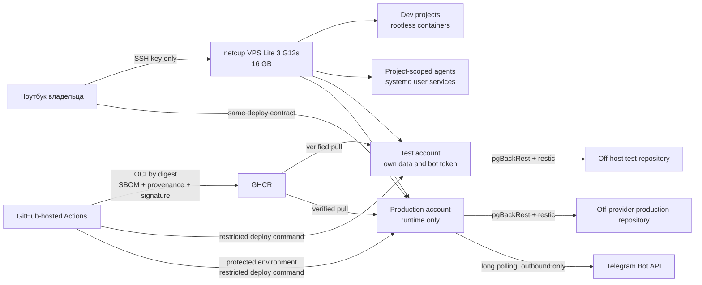

# RFC-007: Удалённая среда разработки и self-hosting Solguficky

> **Статус:** In Review; hosting model принят в ADR-034<br>
> **Автор:** Dmitriy Panfilyonok<br>
> **Дата:** 2026-09-06

## Кратко

PER-80 должен дать две постоянно работающие возможности: удалённую среду разработки с coding agents и воспроизводимый запуск Solguficky в test и production без зависимости от ноутбука. Эти нагрузки имеют противоположный профиль доверия. Среда разработки исполняет изменяемый код, package scripts, плагины и агентские команды; production хранит токен бота и пользовательские данные. Rootless-контейнеры разделяют пользователей и процессы, но используют ядро одного хоста, поэтому не образуют жёсткую границу между недоверенной разработкой и production ([Podman rootless](https://docs.podman.io/en/stable/markdown/podman.1.html), [границы namespaces](https://docs.kernel.org/admin-guide/namespaces/resource-control.html)).

Начальный этап принят в [ADR-034](../decisions/ADR-034-single-netcup-vps-for-initial-self-hosting.md):

- один **netcup VPS Lite 3 G12s** с 8 shared vCore, 16 GB RAM и 320 GB SSD размещает remote development, project-scoped coding agents, test и production;
- dev/agents, test и production получают разные Unix-аккаунты, rootless container storage, сети, базы, bot tokens, age recipients, backup credentials и resource limits;
- хосты восстанавливаются Ansible-сценарием, приложения запускаются rootless Podman Quadlet, версии приложений поставляются из CI по digest;
- PostgreSQL получает off-host pgBackRest repository с continuous WAL archiving и проверяемым PITR, остальные незаменимые файлы — отдельный restic repository;
- штатный и ручной redeploy используют один узкий deploy-контракт: `environment + OCI digest`, обязательную проверку подписи и один и тот же health gate.

Один VPS сознательно принят для старта. Отдельные Unix-пользователи и rootless Podman ограничивают обычные ошибки, но компрометация ядра, `ops` или конфигурации хоста открывает и dev, и production. Это остаточный риск, а не обещание жёсткой изоляции. Переезд production на отдельный хост выполняется только по сигналам ADR-034, а не как обязательный пятый этап.

## Проблема и границы

### Что вынуждает решать сейчас

Результат PER-80 сформулирован проверяемо:

- бот работает на арендованном сервере при выключенном ноутбуке;
- релиз собирается и доставляется из CI;
- test отделён от production по данным, секретам и экземпляру бота;
- база восстанавливается из off-host backup;
- известный исправный релиз можно вручную развернуть с локальной машины;
- удалённая dev-среда и фоновые coding agents работают 24/7, не получают production-секретов и не конфликтуют зависимостями разных проектов.

Сейчас репозиторий этого не обеспечивает. [Aspire-граф](../development/local-development.md) предназначен для local orchestration, утверждённых Dockerfile/Containerfile нет, production deployment не проверен. Текущий успешный local run не доказывает deployability; это уже отмечено в [infrastructure.md](../architecture/infrastructure.md).

Выбор площадки нельзя смешивать с устройством deployment. Для старта выбран netcup VPS Lite 3 G12s, но deployment остаётся переносимым и не зависит от API провайдера. Тариф предоставляет 8 shared vCore, 16 GB RAM, 320 GB SSD, 1 GBit/s interface и автоматически выбранный европейский location; CPU не dedicated, а Lite использует SSD вместо NVMe ([VPS Lite 3 G12s](https://www.netcup.com/en/server/vps/vps-lite-3-g12s-iv-2m), [VPS Lite differences](https://www.netcup.com/en/server/vps-lite)). Документация netcup сообщает, что сервер по умолчанию приходит с Debian Minimal, небольшой partition и оставшимся неразмеченным местом; это требует отдельной проверки диска при bootstrap ([First Use of Your Server](https://www.netcup.com/en/helpcenter/documentation/server/accessing-server)).

### В границах

- критерии выбора VPS и проверка предварительно выбранного тарифа netcup;
- воспроизводимый host baseline: ОС, SSH, firewall, обновления, пользователи, аудит и resource limits;
- удалённая разработка и фоновые агенты без локальных моделей;
- изоляция зависимостей и credentials разных проектов;
- разделение test и production;
- OCI build, supply-chain controls, CI release и ручной redeploy;
- управление секретами;
- резервное копирование, проверка восстановления и перенос на другой хостинг;
- целевые RPO/RTO и runbooks.

### Вне границ

- k3s и обучение Kubernetes;
- публичный домен, TLS и reverse proxy: Telegram-бот использует long polling, публичный ingress не нужен;
- перенос local orchestration с Aspire: Aspire остаётся единственным local inner loop;
- Auction и другие компоненты вне MVP;
- замена будущего домашнего mini-PC: описанные артефакты должны одинаково развернуть VPS, другой хостинг или локальную Linux-машину;
- выбор конкретного AI-провайдера, агента, harness или IDE;
- полноценная observability-платформа и disaster recovery между регионами.

PER-99 уже исследует площадку для long-lived agent process, PER-133 — декларацию agent environment, PER-138 — Codex Cloud. Перед созданием новых задач их нужно сверить с этим RFC: PER-80 владеет host/security/deploy/backup-контуром, а существующие задачи должны поставлять ему требования или реализацию своей узкой части.

## Сценарии и требования

### Сценарии

1. Владелец подключается по SSH из Windows/Linux, открывает репозиторий в привычном редакторе и запускает проект в описанном репозиторием dev container.
2. Фоновый агент продолжает разрешённую задачу после разрыва SSH, но ограничен проектом, CPU/RAM/PIDs и набором credentials.
3. Package manager или `postinstall` одного проекта оказывается вредоносным. Он не читает данные другого проекта и production, не управляет контейнерами другого пользователя и не получает операторский SSH-ключ.
4. Merge в `develop` собирает immutable OCI images, создаёт SBOM/provenance, подписывает digest и разворачивает test.
5. Production deploy требует отдельного GitHub Environment approval и разворачивает тот же проверенный digest, без повторной сборки.
6. CI недоступен, но GHCR доступен. Владелец с ноутбука повторно разворачивает известный подписанный digest той же командой и с тем же gate.
7. VPS потерян. На чистом сервере host baseline применяется из Git, база восстанавливается до выбранной точки, файлы — из restic, после чего запускается ровно один production bot.
8. При плановой миграции новый сервер готовится параллельно, получает base backup и WAL, а запись останавливается только на финальное переключение.

### SLO восстановления

Это цели, которые становятся обещанием только после измеренного restore drill:

| Состояние | Целевой RPO | Целевой RTO | Механизм |
|---|---:|---:|---|
| PostgreSQL, авария хоста | не более 5 минут | не более 2 часов | pgBackRest base backups + continuous WAL archive |
| PostgreSQL, плановая миграция | 0 подтверждённых транзакций | не более 15 минут остановки записи | финальный WAL switch и ожидание архива перед запуском цели |
| Файлы приложений | не более 1 часа | не более 2 часов | restic по systemd timer |
| Dev/agent workspace | не более 1 часа для незакоммиченного | не более 4 часов | Git checkpoints + restic; caches восстанавливаются сборкой |
| Host и deploy-конфигурация | 0 для закоммиченного | входит в RTO хоста | Ansible, Quadlet и SOPS ciphertext в Git |

`archive_timeout` заставляет PostgreSQL переключить неполный WAL segment, но не гарантирует его успешную запись вне хоста; слишком малое значение также раздувает архив. PostgreSQL рекомендует выбирать его осознанно ([Continuous Archiving](https://www.postgresql.org/docs/current/continuous-archiving.html)). RPO 5 минут требует непрерывной метрики времени последнего успешно принятого repository WAL и alert до исчерпания этого окна.

### Критерии площадки

До окончательного выбора тарифа нужно записать и проверить:

| Критерий | Минимум для PER-80 |
|---|---|
| CPU/RAM | VPS Lite 3 G12s: 8 shared vCore / 16 GB; допустимая конкурентность подтверждается замером |
| Disk | SSD/NVMe, достаточно для двух рабочих копий, image cache и backup staging; alert до 80% |
| Virtualization | разрешены user namespaces, cgroup v2 и rootless Podman |
| Console | независимая от SSH console/rescue; netcup rescue стартует отдельную минимальную ОС и требует остановки сервера ([Rescue System](https://www.netcup.com/en/helpcenter/documentation/server/rescue-system)) |
| Network | стабильный public IP, provider firewall, исходящий доступ к GitHub/GHCR, AI APIs и backup storage |
| Portability | стандартный Debian, экспорт/импорт диска как аварийный дополнительный путь; netcup migration работает через offline snapshot и может потребовать сетевой перенастройки ([Migrating Server](https://www.netcup.com/en/helpcenter/documentation/server/server-migration)) |
| Backup | S3-compatible repository вне VPS и с отдельными credentials; provider snapshot не считается единственной копией |
| Operations | прозрачные renewal price, срок отмены, регион данных, SLA и процедура удаления дисков |

## Модель угроз

| Актив или граница | Угроза | Контроль | Остаточный риск |
|---|---|---|---|
| Production data и bot token | агент, dependency script или украденный dev token читает production | отдельные Unix accounts, rootless storage, credentials и age identity; production не монтирует source tree; agent не получает deploy access | общий kernel и `ops` сохраняют путь к production при host compromise |
| Host | подбор SSH, украденный пароль, открытый сервис | key-only SSH, `PermitRootLogin no`, provider + nftables firewall, только SSH ingress | кража разрешённого private key, уязвимость OpenSSH |
| Проекты на общем host | package script читает соседние проекты | отдельный Unix user на проект/доверительную группу, rootless Podman storage, отдельные tokens | общий kernel и operator account |
| Container boundary | container escape или доступ к container socket | rootless mode, no socket mount, drop capabilities, no-new-privileges, read-only rootfs где возможно | kernel/user-namespace vulnerability |
| CI | вредоносный action/PR крадёт deploy secret | GitHub-hosted runners, full-SHA actions, least-privilege token, no secrets for fork PR, protected environments | компрометация GitHub account/action SHA owner |
| Artifact | подмена tag/image в registry | deploy only by digest, verify Cosign identity and provenance, retain SBOM | подписанный, но уязвимый код всё ещё возможен |
| Secrets in Git/backup/logs | случайная публикация или вывод | SOPS+age ciphertext, secret scanning, stdin/files instead of CLI arguments, log redaction | агент может отправить секрет, который ему разрешили читать |
| Backup | ransomware удаляет primary и repository | off-provider encrypted repo, append-only writer, separate prune credential, object versioning/lock if available | потеря recovery key или compromise maintenance credential |
| Restore | backup есть, но несовместим или повреждён | monthly isolated restore, quarterly migration drill, recorded duration/checks | неиспытанный новый schema/version gap |
| AI provider | source/context покидает VPS через разрешённый API | data classification, approved providers, project-scoped workspace, no production data/secrets | сама удалённая модель по определению получает отправленный контекст |

Последнюю строку нельзя закрыть firewall. Для hosted coding agents обещание «данные никогда не покидают сервер» ложно: инструмент отправляет выбранный контекст модели. До эксплуатации владелец должен утвердить допустимых провайдеров, репозитории и классы данных. Production data и production secrets агентам не выдаются ни при каком провайдере.

## Варианты

### Вариант A: один VPS Lite 3 G12s для dev, agents, test и production

Плюсы: минимальная цена, один host baseline, простое начало и 16 GB общей capacity без преждевременного разделения. Минусы: общий kernel и operator plane; вредоносная dependency или агент увеличивает blast radius до production; сборка конкурирует с PostgreSQL и ботом; host maintenance одновременно останавливает всё. Отдельные rootless users полезны, но не исправляют общую доверительную границу.

**Вывод:** выбран для начального self-hosting в ADR-034 с явным остаточным риском и измеримыми сигналами выноса production.

### Вариант B: dev/test и production на отдельных VPS

Плюсы: production не делит kernel, filesystem, Podman daemon и operator tokens с недоверенными build/agent workloads; test остаётся дешёвым и близким к dev; отказ dev host не останавливает бота. Минусы: второй тариф, два host lifecycle, раздельное наблюдение и backup.

**Вывод:** следующий вариант при срабатывании сигнала ADR-034, но не обязательный календарный этап.

### Вариант C: отдельные dev, test и production hosts

Плюсы: test лучше моделирует production и не зависит от agent load; самая ясная сеть и capacity. Минусы: стоимость и операционная нагрузка преждевременны для текущего состояния продукта.

**Вывод:** путь масштабирования после измерений, а не старт PER-80.

### Вариант D: managed PaaS для приложения, VPS только для agents

Плюсы: меньше host operations для production. Минусы: иные secret/deploy/backup contracts, возможный vendor lock-in и необходимость отдельно проверить PostgreSQL PITR и ручной redeploy. [ADR-006](../decisions/ADR-006-railway-hosting.md) заменён ADR-034 и больше не подтверждает этот вариант.

**Вывод:** сохраняется как альтернатива при пересмотре hosting ADR.

### Ничего не менять

Бот и агенты зависят от ноутбука, restore path отсутствует, а production deployment остаётся недоказанным. Критерии PER-80 не выполняются.

## Предложение

### Целевая схема



Публичный ingress приложения отсутствует. PostgreSQL, Identity gRPC, NATS при его появлении и любые dashboard ports слушают только loopback или внутреннюю container network. Для временного доступа используется SSH port forwarding. Из входящих сервисов снаружи открыт только SSH; provider firewall netcup начинает с разрешающего поведения, поэтому правила нужно применять и проверять явно. Его stateful tracking действует только для TCP, поэтому ответы на необходимые UDP-запросы, например DNS и NTP, получают отдельные узкие правила и проверяются с IPv4 и IPv6 ([netcup Firewall](https://www.netcup.com/en/helpcenter/documentation/server/firewall)).

### Доверительные зоны и аккаунты

| Account/zone | Где | Имеет | Не имеет |
|---|---|---|---|
| `ops` | общий хост | SSH, ограниченный sudo, host maintenance | agent/provider tokens, ежедневная разработка |
| `dev-<project>` | общий хост | свой home, rootless Podman, repo-scoped source/token | соседние homes, sudo, production secrets |
| `agent-<project>` или user service того же project account | общий хост | только нужный workspace, harness и provider token | SSH login, production/test deploy credential, host Podman socket |
| `solguficky-test` | общий хост | test images, network, volumes, test bot token | production database/token/repository |
| `solguficky-prod` | общий хост | только runtime images, production network/volumes/secrets | compilers, source tree, dev tokens, interactive SSH |
| `deploy-test` / `deploy-prod` | общий хост | forced command с environment и digest | shell, arbitrary image/tag, чтение secrets |

Rootless Podman хранит containers и images раздельно для каждого пользователя и использует user namespace; контейнеры одного непривилегированного пользователя не видны другому через его Podman ([Podman](https://docs.podman.io/en/stable/markdown/podman.1.html)). Socket не монтируется в agent containers: доступ к нему равен управлению всеми контейнерами и mounts данного project account.

### Host baseline

Host source of truth — отдельный private operations repository или каталог, который содержит Ansible roles/inventory schema, Quadlet units, deploy/backup scripts и SOPS policy. Inventory не хранит plaintext secrets. Ansible использует идемпотентные modules и check mode, поэтому тот же сценарий применим к netcup, другому VPS и локальной Linux-машине ([Ansible playbooks](https://docs.ansible.com/projects/ansible-core/devel/playbook_guide/playbooks_intro.html)). Изменение host state вручную допустимо только для восстановления доступа и затем переносится в декларацию.

Первичный bootstrap выполняется в таком порядке:

1. Защитить аккаунты netcup/SCP и GitHub отдельными passphrase и MFA, сохранить rescue procedure вне VPS.
2. Установить минимальный Debian stable, проверить `lsblk`, filesystem и использование всего оплаченного диска. Разметка оставляет headroom системному разделу, выделяет production state в отдельный bounded filesystem/volume и включает block/inode quotas для dev/agent/test homes и rootless container storage. Ни один непривилегированный project account не может исчерпать место для PostgreSQL WAL или системных операций. Debian 13 — текущая stable ветка; security advisories и repository публикуются проектом Debian ([stable release](https://www.debian.org/releases/stable/), [security information](https://www.debian.org/security/)).
3. Создать `ops`, установить его public key, открыть вторую SSH-сессию и только после успешного входа отключить root/password login.
4. Проверить конфигурацию `sshd -t`, reload без обрыва текущей сессии. Базовый policy:

   ```text
   PermitRootLogin no
   PasswordAuthentication no
   KbdInteractiveAuthentication no
   PubkeyAuthentication yes
   AllowUsers ops dev-solguficky deploy-test deploy-prod
   ```

   Доступные директивы и их точная семантика определены в [sshd_config](https://man.openbsd.org/sshd_config). Deploy keys дополнительно получают `restrict` и root-owned forced command в `authorized_keys`. Высокоценный локальный SSH agent не пересылается на VPS: forwarded socket доступен root на удалённом хосте ([ForwardAgent](https://man.openbsd.org/ssh_config#ForwardAgent)).
5. В nftables разрешить established/related, loopback, ICMP/ICMPv6 и SSH; остальной ingress удалить. В provider firewall отдельно разрешить SSH, ICMP/ICMPv6 и ответы от настроенных DNS/NTP endpoints: netcup отслеживает состояние TCP, но не UDP. До применения provider rule сохранить console/rescue access и проверить IPv4/IPv6 отдельно. Порты PostgreSQL, gRPC, NATS и dashboard не публикуются.
6. Включить автоматическую установку security updates и явное окно reboot. `unattended-upgrade` устанавливает пакеты из разрешённых APT sources и пишет отдельные logs ([Debian manpage](https://manpages.debian.org/stable/unattended-upgrades/unattended-upgrade.8.en.html)). Reboot не выполняется вслепую: production health и свежий backup проверяются до окна.
7. Установить rootless Podman, `uidmap`, subuid/subgid ranges, systemd user services и cgroup v2. Для long-running rootless services включить linger только service users; `loginctl enable-linger` запускает их user manager на boot и сохраняет после logout ([loginctl](https://www.freedesktop.org/software/systemd/man/latest/loginctl.html)).
8. Настроить journald retention, time synchronization, disk/inode/quota/backup-age alerts и отправку уведомлений вне самого VPS. Проверить исчерпание block и inode quota одним disposable project user: production WAL и root operations продолжают работать.
9. Включить 2 GB zram или encrypted swap как страховку от краткого пика, но не считать её дополнительной capacity. Обычный disk swap запрещён: страницы tmpfs с материализованными секретами могут попасть на диск. Все agent/build processes входят в общий ограниченный cgroup slice и получают дополнительные дочерние лимиты.

Перед закрытием bootstrap задача обязана доказать: новый SSH login, reboot, отсутствие лишних listening ports, rootless container после reboot, provider console/rescue procedure и повторный Ansible run без неожиданных изменений.

### Dev environments и coding agents

Каждый репозиторий описывает среду через `.devcontainer/devcontainer.json` и Dockerfile/Containerfile. Dev Container Specification переносит metadata среды между поддерживающими инструментами; reference CLI открыт отдельно ([containers.dev](https://containers.dev/), [Dockerfile guide](https://containers.dev/guide/dockerfile)). Podman-provider и конкретный редактор проверяются acceptance test для PER-133, потому что наличие спецификации не доказывает совместимость любой IDE.

Правила среды:

- версии SDK и base image закрепляются; base image — по digest, application dependencies — lockfiles (`go.sum`, `package-lock.json`, NuGet lock при появлении);
- compilers, package managers, harnesses и agent CLIs находятся внутри project image, не устанавливаются глобально на host;
- package install выполняется при сборке dev image, а не при каждом входе; floating `latest`, `curl | sh` и непроверенные Dev Container Features запрещены;
- source mount ограничен одним project workspace; соседние homes, `/etc`, runtime sockets и backup paths не монтируются;
- credentials отдельны по проекту и назначению, имеют минимальный scope и срок; production token/key недоступен dev/agent accounts;
- агент запускается как непривилегированный user, не получает `--privileged`, host network, device mounts или Podman socket;
- долгие процессы оформляются как versioned systemd user units с `Restart=on-failure`, `MemoryMax`, `CPUQuota`, `TasksMax` и timeout, а не как бесконтрольные `tmux`-сессии. Все project users входят в один host-level `dev-agents.slice` с aggregate limits: независимые user units иначе могут вместе исчерпать хост. Quadlet преобразует declarative container units в systemd services и поддерживает rootless search paths ([Podman Quadlet](https://docs.podman.io/en/latest/markdown/podman-systemd.unit.5.html));
- незакоммиченная работа агента попадает в hourly restic backup, но нормальный переносимый checkpoint — commit/push в отдельную ветку или worktree;
- sessions, prompts и tool configs сохраняются только если не содержат credentials; OAuth/token caches исключаются из backup и восстанавливаются повторной авторизацией.

Начальный бюджет общего 16 GB host, который нужно подтвердить метриками:

| Slice | Memory ceiling | CPU ceiling | Примечание |
|---|---:|---:|---|
| Host + filesystem cache | резерв 2 GB | — | не отдавать workload slices |
| Dev + agents вместе | 8 GB | 500% | один тяжёлый build/test job; конкурентность повышается только после замера |
| Test stack | 2 GB | 100% | disposable data, scale-to-zero допустим |
| Production | 2 GB | 100% | приоритет над agent jobs; отдельный account и volumes |
| Операционный запас | 2 GB RAM + 2 GB zram | — | zram страхует краткий пик и не заменяет RAM |

Лимиты — максимумы, а не гарантированные резервации; их сумма оставляет headroom, но shared vCore не обещают постоянной CPU performance. PER-80 не должен обещать количество одновременных агентов до недельного замера peak RSS, memory pressure, swap activity, CPU steal, disk latency и OOM events. При конкуренции сначала ограничиваются agent/build workloads; перенос production выполняется по сигналам ADR-034.

### Runtime test/production

Каждая среда запускает отдельные pinned OCI images через versioned rootless Quadlet units. Production account не содержит checkout, build toolchain или general-purpose CI runner. Unit включает:

- image reference только `registry/repository@sha256:...`;
- отдельную internal network на environment;
- `DropCapability=all`, no-new-privileges и read-only root filesystem, когда приложению не нужна запись;
- явные writable volumes/tmpfs;
- health check, graceful stop timeout и systemd restart policy;
- `MemoryMax`, `CPUQuota`, `TasksMax`;
- logging без token, DSN и персональных payloads;
- pinned PostgreSQL major/minor policy, отдельное migration gate и явно проверяемая совместимость image со схемой до и после миграции.

Test и production не используют один Telegram token: два процесса с одним long-polling token будут конкурировать за updates. Production promotion сначала останавливает старый экземпляр, затем запускает новый; rolling overlap для одного token запрещён. Это также упрощает миграцию без DNS: переключается единственный poller, а не endpoint.

Aspire в эту схему не публикуется. Он продолжает собирать local graph, а production topology описывается OCI/Quadlet artifacts. Соответствие двух путей проверяется одинаковыми environment contracts и smoke tests.

### CI, registry и supply chain

Pipeline строится на GitHub-hosted runners. GitHub предупреждает, что self-hosted runners могут быть постоянно скомпрометированы недоверенным workflow; hosted runners дают ephemeral clean VM. Actions закрепляются полным commit SHA, `GITHUB_TOKEN` получает минимальные permissions, workflow changes защищаются CODEOWNERS, а production — GitHub Environment approval ([GitHub secure use](https://docs.github.com/en/actions/reference/security/secure-use)). Постоянный self-hosted runner на dev или production VPS в PER-80 не вводится.

Release pipeline:

1. Проверить lockfiles, tests, lint, generated contracts и container build definitions.
2. Собрать отдельный OCI image для каждого deployable component на GitHub-hosted runner.
3. Просканировать dependencies/image, сформировать SPDX или CycloneDX SBOM.
4. Push в GHCR, получить registry digest и больше не использовать tag как deploy identity. GHCR поддерживает OCI images и pull по digest ([GitHub Container Registry](https://docs.github.com/en/packages/working-with-a-github-packages-registry/working-with-the-container-registry)).
5. Выпустить GitHub artifact attestation/provenance и SBOM attestation. Attestation позволяет проверить происхождение, но сама по себе не доказывает безопасность artifact ([Artifact attestations](https://docs.github.com/en/actions/concepts/security/artifact-attestations)).
6. Подписать digest Cosign keyless identity GitHub Actions и сохранить verification bundle; keyless verification связывает signature с OIDC identity и issuer ([Cosign quickstart](https://docs.sigstore.dev/quickstart/quickstart-cosign/)).
7. Автоматически передать test forced command только digest. Хост проверяет repository, digest, workflow identity/issuer, signature и attestation до pull/restart.
8. После test smoke gate тот же digest допускается в production через protected environment/manual approval. Production build повторно не выполняется.

Deploy account принимает только строгий формат, например:

```text
deploy-solguficky --environment prod --digest sha256:<64 hex>
```

Forced command вызывает через `sudo -n` единственный root-owned helper; sudoers не разрешает deploy account другие команды или сохранение environment. Helper валидирует repository, environment и digest, отображает environment в фиксированный service account, проверяет Cosign policy, атомарно меняет desired digest и обращается к его user manager через `systemctl --machine=<service-user>@.host --user`. Произвольные user, unit, path и environment variables из SSH-команды не принимаются; этот переход проверяется реальным test deploy после reboot. Автоматический rollback на предыдущий digest разрешён только до изменения схемы либо при доказанной backward compatibility через expand/contract migration. После необратимой миграции failed health gate останавливает deploy: восстановление БД или forward fix выполняется по отдельному runbook. Произвольный shell, tag, path и compose arguments через SSH не принимаются.

Ручной emergency redeploy с ноутбука вызывает этот же script и разворачивает уже существующий подписанный digest. Он не собирает source на production и не обходит verification. Отдельный offline сценарий на случай недоступности GHCR может переносить `podman save` archive вместе с digest и Cosign bundle; его необходимость — открытое решение, потому что повышает объём PER-80.

### Secrets

Версионируемые secret manifests шифруются SOPS для нативных age recipients. SOPS поддерживает age recipients и policy через `.sops.yaml`; age рекомендует отдельные native keys, а не повторное использование долгоживущего SSH private key ([SOPS](https://github.com/getsops/sops), [age](https://github.com/FiloSottile/age)).

Правила:

- test и production имеют разные age identities; production identity доступна только root-owned materialization unit общего хоста и находится в off-host recovery escrow;
- private age key принадлежит root и имеет mode `0600`; приложение и agent не читают его;
- root-owned materialization unit расшифровывает secret в отдельный runtime tmpfs перед запуском, назначает файл service user с минимальным mode и bind-mounts его в container read-only. Default Podman `file` secret driver запрещён: plaintext не попадает в persistent container storage. Tmpfs получает `noswap`, где это поддерживает kernel; boot cleanup и `ExecStopPost` удаляют runtime path, а zram/encrypted swap не оставляет его страницы на обычном диске ([Podman secret drivers](https://docs.podman.io/en/latest/markdown/podman-secret-create.1.html));
- SOPS ciphertext можно хранить в private Git, но ciphertext не заменяет backup recovery key;
- bot tokens, AI provider tokens, GitHub deploy keys и backup credentials различны по environment и роли;
- backup writer не имеет prune/delete права; maintenance credential используется только из operator context;
- восстановление age identity проверяется отдельно. Потеря identity при наличии ciphertext означает потерю secrets;
- после host compromise все доступные этому хосту tokens/keys считаются украденными и ротируются.

Не все runtime credentials обязаны жить в одном SOPS-файле. Если GitHub Environment или password manager является первичным issuer, в SOPS хранится bootstrap/reference, а runbook требует повторной выдачи. Источник истины для каждого секрета фиксируется в secret inventory без самого значения.

### Backup policy

Backup отделяется от переносимой конфигурации:

| Класс | Primary | Backup/restore |
|---|---|---|
| Source, Ansible, Quadlet, scripts | GitHub/private Git | clone конкретного commit; дополнительный repository mirror |
| OCI artifacts | GHCR | digest allowlist; при необходимости second registry/export |
| PostgreSQL | local production volume | pgBackRest off-provider repository: weekly full, daily differential, continuous WAL |
| Незаменимые application files | named volumes | restic hourly/daily по RPO |
| Dev/agent workspaces | Git branches/worktrees | hourly restic, исключая caches/build outputs/token caches |
| SOPS ciphertext | private Git | repository mirror |
| age recovery identities | root-owned storage общего хоста | password manager/offline encrypted escrow, отдельно от ciphertext |
| Recovery manifest | signed metadata рядом с off-provider backup | Ansible commit, OS, PostgreSQL major, pgBackRest version/config, application digest, schema version и связанные restic snapshots |
| Metrics/logs | local bounded retention | не блокируют restore; нужная incident retention решается отдельно |

PostgreSQL continuous archiving вместе с base backup позволяет PITR до выбранной точки; `archive_command` должен вернуть успех только после надёжной записи WAL и PostgreSQL повторяет неуспешную архивацию ([PostgreSQL PITR](https://www.postgresql.org/docs/current/continuous-archiving.html)). pgBackRest предоставляет full/differential/incremental backups, repository encryption, restore/PITR и S3-compatible repositories ([pgBackRest User Guide](https://pgbackrest.org/user-guide.html)). Для начального режима:

- `archive-async=y`, spool на локальном диске с alert по возрасту/размеру;
- weekly full, daily differential;
- минимум четыре успешных full chains; retention проверяется расчётом реального объёма и WAL, а не только количеством;
- `archive_timeout=5min` как начальный интервал переключения неполного WAL segment; фактический RPO считается от последней успешной записи в repository;
- encrypted repository в другом provider/account/credential domain;
- непрерывная метрика последнего успешно архивированного WAL с alert до 5 минут, ежедневная проверка backup chain и ежемесячный restore в изолированную базу.

restic шифрует repository, поддерживает S3-compatible backends и требует сохранить пароль: без него данные не восстановить ([Preparing a repository](https://restic.readthedocs.io/en/stable/030_preparing_a_new_repo.html)). `restic check` проверяет структуру, а `--read-data` читает pack data; prune переписывает и удаляет данные, поэтому для backup jobs используется append-only credential, а забывание/prune — отдельный изолированный maintenance context. Maintenance не доверяет только свежим snapshot: retention использует `--keep-within`, проверяет ожидаемые historical snapshots и не запускается автоматически после подозрительного backup burst ([Checking integrity](https://restic.readthedocs.io/en/stable/045_working_with_repos.html), [append-only pattern](https://restic.readthedocs.io/en/stable/060_forget.html)).

Файлы, на которые ссылается транзакционное состояние PostgreSQL, либо immutable/content-addressed и восстанавливаются независимо, либо получают согласованную с БД recovery point. Независимый hourly restic snapshot нельзя считать консистентным с произвольной точкой PITR без доказанного application invariant.

Снимок диска у того же VPS-провайдера полезен перед опасным host upgrade или для offline migration, но не является единственным backup: он не разделяет provider/account failure domain и не заменяет PostgreSQL-consistent PITR. NFS/storage у того же provider также не считается off-provider копией.

### Restore runbook

Ежемесячный drill выполняется без production credentials и без доступа к Telegram:

1. Создать disposable VM или изолированный namespace с достаточным диском.
2. Получить одноразовые read-only backup credentials и recovery identity, проверить подпись recovery manifest и выбрать совместимые Ansible commit, PostgreSQL major, pgBackRest config/version и application digest.
3. Применить выбранный Ansible commit на чистую ОС и зафиксировать длительность.
4. Выполнить pgBackRest `info`/`check`, восстановить последнюю consistency point или заданное время в новый volume.
5. Восстановить указанный manifest restic snapshot в пустой path, не поверх существующих файлов; для связанных с БД файлов выбрать согласованную recovery point и проверить application invariant.
6. Запустить database integrity/application smoke checks на закреплённом digest; внешние side effects и bot polling отключить.
7. Сверить ожидаемые backup timestamps, schema/migration version, row-count invariants и выбранные контрольные данные.
8. Удалить disposable credentials/VM и записать фактические RPO, RTO, объём и найденные gaps.

Аварийное восстановление production:

1. Изолировать старый хост, отозвать его deploy/backup writer access и считать все доступные ему credentials скомпрометированными. Остановить старый poller либо отозвать bot token до нового запуска.
2. Одноразовым read-only recovery credential проверить signed recovery manifest и до provisioning выбрать совместимые Ansible commit, PostgreSQL major, pgBackRest config/version, application digest и snapshots.
3. Создать чистый host у текущего или другого provider, применить выбранный Ansible commit и создать новую production age identity, новые deploy/backup credentials и новый bot token.
4. Старую recovery identity использовать только в изолированном operator context для чтения существующего ciphertext. Каждый credential или secret, материализованный на старом хосте, перевыпустить; прежнее значение нельзя просто зашифровать новому recipient. Неротируемый ключ старого backup repository использовать только read-only для recovery, после чего новые backups писать в repository с новым encryption material. Старую age identity и неротируемые recovery keys не устанавливать на новый работающий хост.
5. Восстановить PostgreSQL pgBackRest до последней безопасной точки совместимым runtime; не запускать приложение до окончания recovery и проверки timeline.
6. Восстановить согласованные незаменимые volumes из restic. Source, images и caches получить из Git/GHCR.
7. Материализовать только перевыпущенные runtime secrets, проверить подписи OCI, migrations, database invariants и внутренние health endpoints.
8. Запустить ровно один production poller с новым token, выполнить Telegram smoke test и включить backup jobs/alerts с новыми credentials. Остаточные credentials старого хоста отозвать до завершения инцидента.

### Плановая миграция с минимальным простоем

1. Поднять целевой host параллельно из Ansible и проверить rootless runtime/reboot без production token.
2. Перенести полный backup chain и непрерывно доставлять WAL в repository, доступный цели.
3. Восстановить staging copy на цели, проверить версии PostgreSQL/pgBackRest, images и capacity.
4. Назначить окно, остановить старый bot и другие writers.
5. Выполнить `pg_switch_wal()`, дождаться успешной архивации последнего segment и записать target LSN/timestamp. Принудительное переключение WAL предусмотрено PostgreSQL для архивации текущего неполного segment ([PostgreSQL PITR](https://www.postgresql.org/docs/current/continuous-archiving.html)).
6. Довести recovery цели до зафиксированной точки, проверить отсутствие ошибок и promote.
7. Восстановить финальные file snapshots, запустить приложения по прежнему подписанному digest и выполнить smoke gate.
8. Оставить старый host остановленным и без poller на согласованное rollback window. Rollback после новых записей требует отдельного reverse migration; простое включение старой базы запрещено.

При long polling DNS или load balancer не переключается. Нижняя граница downtime определяется временем финального WAL restore, health checks и запуска единственного bot process. Цель 15 минут подтверждается только репетицией на сопоставимом объёме.

### Проверки готовности

PER-80 нельзя закрыть по наличию файлов. Нужен живой evidence:

- clean host provisioned из versioned declaration, второй run идемпотентен;
- после reboot доступны только ожидаемые SSH и user services;
- scan извне не видит PostgreSQL/gRPC/NATS/dashboard ports;
- два проекта не читают homes/Podman storage друг друга;
- исчерпание block/inode quota disposable agent account не лишает PostgreSQL места для WAL и не блокирует root operations;
- agent не получает production secrets и не может вызвать production deploy;
- plaintext production secret существует только в runtime tmpfs, отсутствует в persistent Podman storage и очищается после reboot/stop;
- CI строит, подписывает и публикует image; test deploy принимает digest, tag отклоняет;
- подменённая/неподписанная image отклоняется до остановки текущей версии;
- forced deploy command после reboot управляет только сопоставленным service account и не принимает произвольный user/unit/path;
- production promotion использует test-tested digest и approval;
- manual command с ноутбука повторно разворачивает известный digest;
- test и production используют разные bot tokens, DB, secrets и repositories;
- restore drill выбирает совместимый runtime из signed recovery manifest и восстанавливает базу и файлы на чистом host в пределах измеренных RPO/RTO;
- planned migration drill доказывает единственный poller и отсутствие потерянных подтверждённых записей;
- потеря общего хоста не уничтожает off-provider backup, recovery keys и возможность восстановить production на новом VPS.

### Learning goals и fallback

PER-80 должен дать владельцу практику безопасного Linux-hosting, воспроизводимого bootstrap, rootless OCI runtime под systemd, проверки software supply chain и восстановления PostgreSQL на чистом хосте. k3s, multi-region failover и построение собственного PaaS в учебные цели этого среза не входят.

Основной fallback при непригодности или недоступности netcup — новый стандартный Linux VPS, восстановленный тем же Ansible-сценарием из off-provider backup. Managed PaaS остаётся временным fallback для приложения. При недоступном CI владелец повторяет известный подписанный digest с локальной машины, а необходимость offline OCI archive при недоступном GHCR решается отдельно.

## Что станет сложнее

- Один хост оставляет общий kernel и failure domain, поэтому логическая изоляция не может обещать защиту от host compromise.
- Resource limits уменьшают capacity, доступную dev/agents, потому что production и операционный запас защищаются первыми.
- Rootless networking, Quadlet и secret materialization сложнее одного rootful compose-файла; это цена уменьшения blast radius и systemd-managed lifecycle.
- Deployment по digest требует явного promotion record; нельзя «быстро поправить файл на сервере».
- Separate test/prod tokens означают отдельную регистрацию/настройку бота и запрет запуска production token в локальном Aspire.
- PITR требует совместимых PostgreSQL/pgBackRest versions, контроля WAL backlog и регулярных drills; один `pg_dump` проще, но не выдерживает целевой RPO.
- Off-provider object storage, recovery escrow и разные credentials требуют собственного inventory и ротации.
- Dev containers не дают bit-for-bit reproducible build сами по себе. Reproducibility здесь означает восстановимый declaration и immutable deployed artifact; обновление зависимостей остаётся осознанной работой.
- Жёсткая egress allowlist для coding agents практически нестабильна из-за AI/GitHub/package endpoints и не предотвращает утечку через уже разрешённый AI API. Главные контроли — data boundary и credentials minimization.

## Открытые вопросы

### Принято владельцем

- стартовый тариф — netcup VPS Lite 3 G12s с 16 GB RAM;
- dev, agents, test и production на первом этапе размещаются на одном хосте с зафиксированным остаточным риском;
- отдельный production VPS не входит в обязательную последовательность и появляется только по сигналу необходимости из ADR-034;
- production backup остаётся у другого provider/account, чтобы отказ или блокировка netcup не уничтожили обе копии.

### Решения владельца до реализации

1. Какие AI providers, repositories и классы данных разрешено отправлять удалённым моделям? Разрешены ли закрытые product docs и user-derived fixtures?
2. Какой редактор/клиент обязан пройти devcontainer-over-SSH acceptance: Zed, VS Code, CLI или несколько?
3. Агент одного проекта живёт под тем же Unix user, что интерактивный developer, или нужен отдельный user и односторонний workspace handoff?
4. Какой object storage выбран для pgBackRest/restic и поддерживает ли он отдельные append/delete credentials, versioning и object lock?
5. Достаточны ли RPO 5 минут, file RPO 1 час, disaster RTO 2 часа и planned downtime 15 минут?
6. Нужен ли offline OCI export для redeploy при недоступности GHCR, или достаточно предыдущих images в local storage и registry availability?
7. Какой срок хранения dev/agent histories допустим с точки зрения приватности и стоимости?
8. Где хранится recovery escrow для age/restic и кто проверяет его доступность?

### Вопросы, которые закрываются spike/измерением

- хватает ли 16 GB для выбранного числа одновременных agents, .NET/Go/Node builds, test stack и production без thrashing;
- работает ли выбранная IDE/Dev Container CLI с rootless Podman без privileged workaround;
- какие writable paths реально нужны каждому production image;
- сколько места и bandwidth занимают WAL и restic при реальной частоте изменений;
- достигаются ли заявленные RPO/RTO и 15 минут planned downtime;
- можно ли ограничить deploy SSH source addresses, не ломая GitHub-hosted Actions и доступ владельца;
- срабатывает ли хотя бы один сигнал ADR-034 для переноса production на отдельный VPS.

## Результирующие артефакты

После принятия и реализации решения должны появиться:

- принятый [ADR-034](../decisions/ADR-034-single-netcup-vps-for-initial-self-hosting.md), который заменяет ADR-006;
- versioned Ansible inventory schema/roles и bootstrap runbook;
- `.devcontainer/` declarations и documented project credential boundary;
- systemd/Quadlet units для agents, test и production;
- Containerfile/Dockerfile и pinned OCI image policy для deployable components;
- CI workflows build/attest/sign/deploy и GitHub Environment protection;
- root-owned narrow deploy script и локальная manual redeploy recipe;
- SOPS policy, secret inventory без значений и recovery/rotation runbook;
- pgBackRest/restic configuration, timers, alerts и retention policy;
- restore и migration runbooks с журналом ежемесячных/квартальных drills;
- measured capacity, RPO/RTO и cost record;
- обновлённые architecture, local-development, CI и operations docs после появления фактической реализации.
