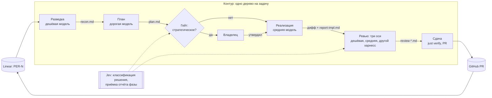

# RFC-013: Фазовый контур исполнения и гейты решений

> **Статус:** Draft  
> **Автор:** владелец  
> **Дата:** 2026-09-21

## Кратко

[Контур исполнения](../development/agent-execution-loop.md) описан как одна последовательность в одном исполнителе: одиннадцать шагов от захвата до отчёта проходят в одной сессии. Прогон PER-195 показал цену такой формы: 357 ходов самой дорогой модели с контекстом до 402k токенов, девять подагентов на той же модели и одни и те же файлы, прочитанные семью агентами. [Документ о цене](../development/agent-execution-cost.md) уже называет направление, но остаётся намерением и спорит с Canonical-документом.

Предлагается четыре связанных изменения:

1. сессия контура заканчивается на сдаче: рефлексия, заведение задач и любая следующая работа идут новой сессией; разведка оставляет артефакт с диапазонами строк, который читают план и реализация вместо повторного чтения файлов;
2. модель подагента выбирается по роли, а не наследуется: каталог `.claude/agents/` с ролями разведки, ревью по стандартам и ревью по спецификации, причём роль описывает работу, а модель передаёт вызывающая сторона (ревизия 2026-09-21, см. «Роли моделей внутри сессии»);
3. ручной гейт открывается только на решении, которое ещё не разрешено постановкой задачи, ADR и политикой контура: список таких решений становится нормой, всё внутри разрешённого агент решает сам; decision model Jev на старте только наблюдает за этими решениями и сравнивается с разметкой владельца, а не принимает их;
4. полное разнесение фаз по сессиям (разведка, план, реализация, ревью, сдача как отдельные сессии с передачей файлов) описывается как контракт передачи и проверяется живым прогоном, а нормой становится только после него.

Кто запускает фазы и передаёт между ними артефакты, документ не выбирает: владелец решил сравнить Orca orchestration и CAO на одной задаче в прогоне PER-282 (О-8). Документ не вводит сервис, не меняет контракты и продуктовое поведение. Он меняет Canonical-документ контура, документ о цене, одну строку норматива задач и два `proj-`скилла.

Первая редакция документа предлагала свой роутер исполнителей поверх Orca и Jev как маршрутизатор; после обсуждения с владельцем и независимого ревью (Codex, 2026-09-21) документ сужен. Что убрано и куда вернётся, собрано в разделе «Отложено при сужении».

## Проблема и границы

Цифры сняты с транскриптов сессии PER-195 (основной тред и девять подагентов), а не с отчётов агентов.

| Величина | Значение |
|---|---|
| Ходов основного треда | 357, все на Opus 5 |
| Пик контекста основного треда | 402k токенов |
| Чтение из кеша, основной тред | 80,6M токенов при hit rate 99% |
| Чтение из кеша, подагенты | 22,1M токенов, девять агентов, все на Opus 5 |
| Уникальный ввод | 1,1M основной тред + 2,4M подагенты |
| Вывод | 465k основной тред + 134k подагенты |
| Файлов, прочитанных двумя и более агентами | 36, повторов на 847 КБ |

Кеш работал. Проблема в площади под кривой «контекст × ходы»: после открытия PR та же сессия сделала рефлексию, завела две задачи, исследовала лимит Linear и на следующий день писала документ о цене. Час с 23:00 до 00:00 19 сентября стоил 161 ход и 51M кеш-чтений. Ни одна из этих работ не требовала истории предыдущей. Поэтому цифры доказывают не необходимость пяти сессий на задачу, а то, что сессия должна заканчиваться на сдаче: сколько из 80,6M кеш-чтений приходится на сам контур до PR, из транскрипта отделимо и посчитано в О-10.

Вторая цена не в токенах, а в минутах владельца. Агент выносит на владельца вопросы одного ряда с выбором имени каталога и порядком шагов, хотя `loop.md` называет три стоп-триггера, и все три стратегические. Каждый такой вопрос это ожидание, переключение и ответ, который владелец мог бы не давать.

Четыре причины, по которым это не чинится дисциплиной внутри одной сессии:

- **Модель не маршрутизируется.** Каталога `.claude/agents/` в репозитории нет, параметр модели подагенту не передавался ни разу, и каждый унаследовал модель родителя. Три разведочных агента и ревью по стандартам это механика на 10M кеш-чтений дорогой модели.
- **Разведка не оставляет артефакт.** Результаты разведки вернулись в основной тред текстом, планировщики их не получили и разведали репозиторий заново: ADR-022 и `Meetup.fs` прочитаны семью агентами каждый.
- **План отделён от реализации только формально.** Три планировщика отработали, чекпоинт прошёл, а реализация пошла в том же треде с 250k истории разведки.
- **Граница ручного гейта не названа.** `loop.md` перечисляет, когда останавливаться, но не говорит, какие решения агент обязан принять сам. Отсутствие второго списка читается как «спрашивай всё».

Документ о цене предлагает разнести фазы по сессиям, но `loop.md` остаётся Canonical и описывает одно дерево на задачу, один захват до ветки, гейт «в сессии» и два случая остановки. Пока документы спорят, ни скиллы, ни исполнители не могут опереться ни на один.

За границей документа: выбор оркестратора фаз (Orca orchestration, CAO, координатор-сессия) до живого прогона; свой роутер исполнителей, который [решение о тонком роутере](../development/agent-execution-cost.md#маршрутизация-по-харнессу-и-пулу-лимитов) держит отдельным слоем; Temporal и долгоживущий workflow фичи; замена трёх осей ревью автоматической проверкой; автоматический merge после гейта; изменение продуктового поведения сервисов; выбор конкретных дешёвых моделей через OpenRouter.

## Сценарии и требования

1. **Фаза стартует с малого контекста.** Сессия фазы читает задачу, артефакты предыдущих фаз и ровно те файлы, которые артефакт называет с диапазонами строк. Файл, прочитанный целиком дважды одним исполнителем, это отказ требования.
2. **Провал фазы виден явным исходом.** Отчёт фазы несёт `succeeded` или `failed` отдельным полем; провал, описанный только прозой, следующая фаза не принимает.
3. **Занятость задачи живёт в Linear.** Started-статус ставит первая фаза до создания дерева, снимает автоматика Linear по pull request. Ни сессия, ни запись кокпита признаком занятости не являются: два запуска на двух машинах не должны взять одну задачу.
4. **Владелец отвечает из любой фазы.** Чекпоинт плана ждёт владельца в том же виде, что сейчас. Фаза, запущенная не владельцем, задаёт вопрос тому, кто её запустил, а не фиксирует остановку переносимо.
5. **Ревью независимо от исполнителя.** Хотя бы одна ось ревью исполняется другой моделью или другим харнессом, чем реализация. Ревьюер работает read-only.
6. **Гейт подтверждён фазой сдачи.** `just verify` гоняется в фазе сдачи, вывод входит в отчёт; реализация гоняет его как самопроверку, но её прогон гейтом не считается.
7. **Отчёт фазы несёт стоимость.** Для каждой фазы сохраняются исполнитель, модель, исход и токены из транскрипта. Без этой строки acceptance rate исполнителя, который потребуется будущему роутеру, взять неоткуда.
8. **Не-Claude харнесс имеет скиллы репозитория.** В дереве, из которого работает Codex или OpenCode, существует `.agents/skills/`. Сегодня в деревьях это не гарантировано: из тринадцати деревьев каталог есть в трёх.
9. **Маленькая задача не платит за конвейер.** Задача на один балл проходит контур одной сессией на средней модели без фан-аута: разнесение фаз стоит дороже, чем экономит.
10. **Разрешённое решение не ждёт владельца.** Решение, которое уже разрешено постановкой задачи, ADR и политикой контура, агент принимает сам; в «Отклонения от плана» попадает только выбор, которого план не покрывал. Владелец видит его в PR, а не в диалоге.
11. **Сессия заканчивается на сдаче.** После отчёта и pull request сессия контура завершается; рефлексия, заведение задач и следующая работа идут новой сессией. Продолжение в той же сессии это отказ требования. Требование адресовано фазе сдачи и тому, кто её запускает, а не владельцу: фаза завершается явным исходом, и её процесс заканчивается; правки по ревью pull request это новый запуск реализации и сдачи с входом из комментариев PR. При ручном запуске (В-2) требование держится только на дисциплине владельца, и правилом оно становится вместе с оркестратором (О-10).

## Варианты

**В-0. Ничего не менять.** Содержателен: контур работает, PR открываются, автоматика Linear проверена. Цена измерена выше и повторится на каждой задаче в три балла и больше. Спор двух документов остаётся.

**В-1. Только маршрутизация модели внутри одной сессии.** Каталог `.claude/agents/` с ролями разведки и ревью; модель передаётся при вызове. Двадцать минут работы, снимает самую тяжёлую потерю PER-195. Не снимает рост контекста основного треда и повторные чтения: подагенты по-прежнему не получают артефакт. Входит в предложение первым шагом, но сам по себе спор документов не решает.

**В-2. Фазы в отдельных сессиях, координация ручная.** Orca или сама рабочая станция дают дерево и сессию на фазу, владелец между фазами смотрит артефакт и запускает следующую. Даёт разрыв контекста и выбор модели при запуске. Цена: владелец становится координатором каждой задачи, и делегированный из Linear контур в такой форме не работает. Годится как форма живого прогона, не как норма.

**В-3. Готовый оркестратор фаз.** Orca orchestration (Run, Task, Dispatch, `worker_done`, worker-start с `--model` и `--agent`) или CAO (workflows, MCP-шина между агентами, расписания). У Orca всё нужное в бинаре есть, живого прогона на репозитории нет, и владелец в оркестрацию не углублялся. CAO сильнее по оркестрации, но сидит на tmux без нативной Windows, доставляет скиллы агентам через MCP, и встраивание Jev не проверено; Jev это HTTP-запрос, так что препятствие непроверенное, а не техническое. Ни один не отвергается и ни один не выбирается здесь: контур описывается через артефакты и исходы фаз, а кто их запускает, решает прогон PER-282. Одно ограничение из решения волта о тонком роутере: правила выбора исполнителя и гейтов живут в документах репозитория, а не в семантике одного кокпита, иначе на ферме под Linux контур придётся переписывать вместе со сменой инструмента.

**В-4. Сессия до сдачи, роли моделей и правило гейтов; фазы на прогон, оркестратор открыт.** Предлагается ниже: сессия заканчивается на сдаче, В-1 первым шагом, список неразрешённых решений как норма гейта, Jev наблюдателем с разметкой владельца, фазы как контракт передачи с артефактами в дереве, который проверяет PER-282. Ручной запуск фаз (В-2) владелец как норму отверг: слишком дорого. Форму из В-3 выбирает сравнение в PER-282, а `loop.md` формулируется через артефакты и исходы, чтобы не зависеть от неё.

## Предложение

### Единица передачи: фаза

Шаги контура не меняются. Меняется то, что каждая фаза это отдельная сессия со своим стартовым контекстом, а между фазами передаются файлы.

| Фаза | Шаги контура | Исполнитель по умолчанию | Вход | Выход |
|---|---|---|---|---|
| Разведка | 1, 2, 3 | дешёвая модель | задача, ссылки из неё | `recon.md`: карта файлов с `файл:строки` и цитатами, открытые вопросы |
| План | 4 | дорогая модель | задача, `recon.md` | `plan.md`: варианты, выбранный владельцем, срез; чекпоинт ждёт владельца |
| Реализация | 5 | средняя модель, Codex или Claude | `plan.md`, `recon.md` | дифф в дереве, `report-impl.md` с исходом и самопроверкой `just verify` |
| Ревью | 7 | три оси: стандарты на дешёвой, спецификация на средней, корректность на другом харнессе | дифф, `plan.md`, задача | `review-*.md` с находками по осям |
| Сдача | 6, 8, 9, 10, 11 | средняя модель | дифф, отчёты | прогон `just verify`, коммит, PR, комментарий в Linear, отчёт |

Фаза не начинается, пока предыдущая не завершилась явным исходом. Провал реализации возвращает на план с отчётом, а не на разведку. Кто читает исход и запускает следующую фазу, владелец руками или оркестратор, для таблицы безразлично.

Дерево на задачу одно, как в `branching.md`, и фаза адресует его по имени. Изоляция внутри задачи идёт по фазам: параллельные фазы, которые только читают, например несколько сессий разведки, работают в том же дереве; каждый параллельный пишущий агент получает своё дерево от ветки задачи. Сравнение реализаций одной задачи несколькими агентами это тот же случай: у каждого своё дерево, а сравнивает результаты владелец или фаза ревью (О-1).

### Артефакты фаз

Артефакты лежат в дереве задачи под одним каталогом, по каталогу на задачу, и в pull request не попадают: `.work/PER-N/`. Строка `.work/` добавляется в секцию «Общее» корневого `.gitignore`. Имя `.work/` принято (О-4); правило требует только единственности и известности пути всем харнессам. Замена держится в уме: если прогон покажет, что оркестратор хранит артефакты фаз сам, как Run у Orca, каталог в дереве уступает его хранилищу при условии, что до артефактов дотягивается харнесс любой фазы.

Артефакт разведки называет файлы диапазонами строк и цитатами. Исполнитель следующей фазы проверяет цитату по диапазону, а не перечитывает файл. Это и есть требование 1.

Отчёт каждой фазы, `report-*.md`, несёт шапку с полями исход, исполнитель, модель, токены. Шапка сводится в комментарий сдачи в Linear. Это требование 7 и единственные данные, на которых позже можно строить роутер.

### Роли моделей внутри сессии

Каталог `.claude/agents/` получает три роли: разведка, ревью по стандартам, ревью по спецификации. Роль описывает работу и не несёт модель; конкретную модель передаёт вызывающая сторона, беря уровень из таблицы `cost.md` — она и остаётся единственным местом, где уровень записан. Планирование и ревью корректности роли не получают: первое остаётся дорогой модели основной сессии, второе уходит другому харнессу. Это В-1, он делается первым и работает до любого решения об оркестраторе.

**Ревизия 2026-09-21.** Первая редакция клала модель полем `model` в сам файл роли. Владелец пересмотрел это в пользу закреплённого набора ролей, общего для харнессов, где модель выбирает харнесс или позже Jev. Проверка показала, что выбора по ролям на стороне харнесса в Claude Code нет: `CLAUDE_CODE_SUBAGENT_MODEL` действует на всех подагентов сразу, а порядок разрешения модели — параметр вызова, затем `model` роли, затем эта переменная, затем модель сессии. Поэтому выбор уходит на вызывающую сторону: сегодня это текст скилла, позже Jev, и роль остаётся харнесс-независимой. Побочный эффект в пользу решения: без поля `model` роль не требует перевода под диалект каждого харнесса, и дословного копирования skillshare достаточно.

### Гейты

Правило гейта формулируется без Jev и действует само по себе. Вопрос не «стратегическое это решение или тактическое», а «разрешено ли оно уже»: постановкой задачи в Linear, принятыми ADR и политикой контура. Разрешённое агент исполняет без вопроса, даже если оно меняет продуктовое поведение: утверждённая продуктовая задача часто именно этого и требует. Владельцу уходит только решение, которого ни один из трёх источников не разрешал:

- новое продуктовое обещание или поведение, которого нет ни в задаче, ни в ADR;
- выход за «Границы» задачи: контракт, схема, второй компонент;
- расхождение с утверждённым планом;
- красные проверки без чистого фикса;
- необратимое действие: удаление, `push --force`, правка вне Ownership;
- деньги вне подписок и новая внешняя зависимость.

Второй, третий и четвёртый пункты это стоп-триггеры `loop.md`, остальные добавляются. Всё внутри разрешённого агент решает сам: имя файла, порядок шагов, выбор между равными реализациями, объём теста. В «Отклонения от плана» попадает только выбор, которого план не покрывал или которому противоречил; обычный выбор реализации отклонением не считается. Это требование 10.

Jev на старте наблюдатель, а не арбитр. Decision model с закрытыми вопросами и вероятностью на выходе получает те же три вопроса типа Noul (да или нет), что решает агент, а его ответ пишется рядом с решением агента и на него не влияет:

| Точка | Вопрос | Кто решает сегодня | Что пишет Jev |
|---|---|---|---|
| Перед вопросом владельцу | решение уже разрешено задачей, ADR и политикой | агент по списку выше | P(да) |
| После плана | план задевает контракт, ADR, схему или второй компонент | агент по правилам `loop.md` | P(да) |
| После каждой фазы | отчёт закрывает критерии приёмки и несёт явный исход | следующая фаза читает поле исхода кодом | P(да) |

Каждое решение по гейту пишется строкой в `report-*.md`: вопрос, ответ агента, P(да) от Jev. Владелец размечает только ошибки, при ревью pull request: «зря спросил» или «надо было спросить»; молчание значит верно. После десяти задач пропуски Jev и агента сравниваются, отдельно по редким опасным случаям; только после этого Jev получает право открывать или закрывать гейт, и порог выбирается по цене пропущенной эскалации, а не заранее (О-7). Правило подписок владелец считает рекомендацией, и Jev вводится как явное исключение из него (О-6). Noul возвращает вероятность «да» без отдельной уверенности: 0,05 это уверенное «нет», 0,5 это незнание, и зона незнания всегда уходит владельцу. Jev не ревьюит код, не заменяет три оси ревью и не отменяет запрет: наличие полей отчёта проверяется кодом, достоверность результата тестами и ревью.

### Изменения в документах и скиллах

- `loop.md` получает два новых правила: шаг 11 закрывает сессию, а следующая работа идёт новой (требование 11); стоп-триггеры заменяются списком неразрешённых решений с парным правилом «внутри разрешённого агент решает сам». Единица передачи «фаза» и артефакты входят как контракт передачи, три дыры закрываются явными ответами (О-1, О-2, О-3), остановка получает третий случай: вопрос тому, кто запустил фазу. Шаг 6 обновляется до текущего состава `just verify`.
- `cost.md` теряет разделы «Фазы живут в разных сессиях» и «Контракт передачи фаз» в пользу `loop.md` и остаётся про цену и маршрутизацию; цифры заменяются измеренными по транскриптам.
- `linear.md`: в секцию «Границы» задачи, которую фан-аут делит между несколькими пишущими воркерами, входит строка Ownership: что правится, что не правится. При сравнении реализаций строка не нужна: каждый делает всё. Новая секция не заводится, лимит четырёх секций сохраняется (О-5).
- `proj-start-task`: разведка пишет `recon.md` и завершается; план читает артефакт. `proj-deliver-task`: гейт и отчёт читают `report-*.md`.
- Каталог `.claude/agents/` с тремя ролями; модель передаёт вызывающая сторона, а не файл роли.
- Дерево не-Claude харнесса получает `.agents/skills/` командой `skillshare sync -p` при создании; кто её запускает, хук кокпита или фаза разведки, решает прогон. Это требование 8.

## Отложено при сужении

Первая редакция содержала пять решений, которые убраны из предложения, чтобы не строить то, чего живой прогон ещё не потребовал. Они не отвергнуты; у каждого назван возврат.

- **Свой роутер исполнителей** `tools/agent-router/`: Python CLI по образцу `tools/nats-tester/`, вход spec фазы, выход командная строка запуска (`orca orchestration worker-start --agent --model --worktree`), выбор пары «харнесс плюс модель» вопросом Jev типа Choice над объявленными парами, порог 0,8, резерв детерминированной таблицей, лог `route.jsonl`. Возврат: после десяти задач с шапками отчётов (требование 7), когда есть из чего считать acceptance rate. До этого исполнителя выбирает таблица фаз.
- **Orca orchestration как backend роутера** и setup-хук Orca, запускающий `skillshare sync -p` в каждом дереве. Возврат: по итогу PER-282, если Orca выбрана формой запуска (О-8).
- **CAO как провайдер воркеров.** Возврат раньше фермы: владелец включил CAO в сравнение оркестраторов PER-282 (О-8). На Windows ему нужен tmux через WSL, на VPS владельца он работает нативно; Jev туда встраивается HTTP-вызовом шагом workflow или MCP-инструментом.
- **Учёт квоты чужого харнесса** при выборе оси ревью корректности. Возврат: вместе с роутером; до этого исчерпанная квота Codex переводит ось на среднюю модель Claude с другим промптом, и отчёт фазы называет резерв.
- **Temporal** как владелец долговечного процесса. Отложен из-за сложности, а не из-за отсутствия VPS: локальный dev-сервер и CLI под Windows существуют. Возврат: при реальной потребности восстанавливать многодневный процесс.

Независимое ревью добавило два пункта, которых в первой редакции не было и которые дешевле любого из перечисленных:

- **Усиление детерминированных проверок.** Документ о цене приводит FS0025, прошедший гейт зелёным и найденный моделью; каждая такая находка переводится в проверку `just verify` раньше, чем добавляется ревьюер. Это правило для `proj-deliver-task` и журнала наблюдений, а не часть этого документа.
- **Автоматический merge после гейта.** Реалистичен, но граница «документация и тесты» неверна: документация несёт норматив, а тест чинится удалением проверки. Стартовый гейт: разрешённый scope, обязательные проверки GitHub на текущем SHA, независимое ревью того же SHA, ноль неразрешённых блокирующих находок, актуальная база; новый коммит обнуляет доказательства; исполнитель не выдаёт себе разрешение на merge и не правит гейт. Сначала владелец меняет `loop.md`, который требует ручной merge всегда. Отдельное решение, за границей документа.

## Что станет сложнее

- **Больше движущихся частей.** Пять сессий вместо одной и каталог артефактов. Для задачи на один балл это дороже одной сессии, поэтому требование 9 выключает конвейер по оценке.
- **Артефакт устаревает.** `recon.md` описывает дерево на момент разведки. Реализация, изменившая файлы, делает диапазоны в нём ложными для ревью. Ревью читает дифф, а не `recon.md`, и это надо записать в скилл явно.
- **Платный API вне подписок.** Jev нарушает правило владельца «спавн официального CLI по подписке». Цена на тысячу решений меньше цента, но исключение фиксируется явно, а не молча (О-6).
- **Тактическое решение может оказаться стратегическим.** Список конечен, а ошибка классификации теперь всплывает в PR, а не в диалоге. Цена ошибки ограничена одним PR; список правится по наблюдениям.
- **Независимость ревью зависит от чужой квоты.** Ось корректности на Codex не работает при исчерпанном лимите Codex. Резерв это средняя модель Claude с другим промптом, и отчёт фазы называет, что сработал резерв.
- **Передача между фазами не проверена.** Ни один прогон по фазам на этом репозитории не сделан. Живой прогон на дешёвой задаче обязателен до правки `loop.md`.
- **Наблюдаемость размазывается.** Транскрипты пяти сессий лежат в пяти каталогах; учёт по задаче держится на шапках отчётов фаз и на их честности.

## Открытые вопросы

Все десять вопросов владелец закрыл 2026-09-21; решения внесены в предложение, ниже они с исходной формулировкой. Открытым остаётся только то, что решает прогон PER-282: форма запуска фаз и остаток цены после требования 11.

- **О-1.** Цепочка фаз работает в одном рабочем дереве или каждая фаза берёт своё? Решение: одно дерево на задачу; параллельные читающие фазы работают в нём, каждый параллельный пишущий агент получает своё дерево от ветки задачи, сравнение реализаций тот же случай.
- **О-2.** Кто ставит started-статус в Linear? Решение: как сейчас, первая фаза до создания дерева; снимает автоматика по PR, как проверено 2026-09-17.
- **О-3.** Какая фаза обязана прогнать `just verify`? Решение: сдача; реализация гоняет как самопроверку.
- **О-4.** Имя каталога артефактов и строка `.gitignore`. Решение: `.work/`; хранилище оркестратора держится как замена, если прогон покажет, что он хранит артефакты сам.
- **О-5.** Ownership в «Границах» задачи: обязательная строка для любой задачи или только при фан-ауте? Решение: только при фан-ауте, который делит работу; при сравнении реализаций не нужна, лимит секций не меняется.
- **О-6.** Принять Jev как явное исключение из правила подписок? Решение: да; правило подписок владелец считает рекомендацией, а не запретом.
- **О-7.** Порог для гейтов выбирается по разметке владельца после десяти задач. Решение: десять задач как стартовое число; владелец размечает только ошибки при ревью PR, молчание значит верно.
- **О-8.** Кто запускает фазы и передаёт исходы: владелец руками (В-2), оркестрация Orca, CAO или координатор-сессия на средней модели? Решение: руками нет, слишком дорого. Несколько форм запуска пробуются на одной задаче и сравниваются: Orca orchestration с короткой координатор-сессией, потому что Run хранит состояние и inbox, но воркеров не планирует, и CAO; Temporal не пробуется. Каждая форма проходит рестарт координатора, потерю воркера, повторную доставку результата и отсутствие двойного запуска; успешная цепочка без сбоев ответа не даёт. Прогон может ждать VPS владельца: там CAO работает без WSL. `loop.md` до ответа описывает только артефакты и исходы.
- **О-9.** Достаточен ли список из шести неразрешённых решений? Решение: достаточен; недостачу покажет разметка из О-7.
- **О-10.** Сколько цены PER-195 снимает одно требование 11? По транскрипту основного треда до открытия PR 217 ходов и 44,7M кеш-чтений, после 140 ходов и 36,0M: завершение сессии на сдаче убирает около 45% чтений основного треда без разнесения фаз. Решение: разнесение фаз остаётся предметом прогона, а не нормой. Уточнение владельца: правило для человека работать не будет, поэтому требование 11 адресовано фазе и оркестратору, а при ручном запуске 45% это верхняя граница экономии, а не ожидание.

## Результирующие артефакты

- ADR: нужен после живого прогона: Jev как decision model гейтов контура и выбранная форма запуска фаз.
- standard: правка `loop.md` (Canonical), `cost.md`, одна строка в `linear.md`; новый standard не нужен.
- задачи Linear: после принятия. До принятия заведена одна задача исследования, [PER-282](https://linear.app/anticnvm/issue/per-282): сравнение форм запуска фаз, Orca orchestration и CAO, на [PER-275](https://linear.app/anticnvm/issue/per-275) с измерением по транскриптам и сценариями сбоев из О-8; её результат проверяет решения по О-1 и О-3 и закрывает остаток О-8 и О-10.
